# 1 Cellular Physiology

xml 버전='1.0' 인코딩='utf-8'?

생리학

## *세포 생리학*

> [체액의 양과 구성](#filepos30439)

> [세포막의 특성](#filepos48523)

> [세포막을 통한 수송](#filepos53532)

> [확산 잠재력과 평형 잠재력](#filepos104799)

> [휴지막 잠재력](#filepos124290)

> [행동 잠재력](#filepos129118)

> [시냅스 및 신경근 전달](CR%21G9RE0KW4PD33Q9F3DXNCSBNXCANP_split_008.html#filepos163619)

> [골격근](CR%21G9RE0KW4PD33Q9F3DXNCSBNXCANP_split_008.html#filepos201160)

> [평활근](CR%21G9RE0KW4PD33Q9F3DXNCSBNXCANP_split_008.html#filepos227955)

> [요약](CR%21G9RE0KW4PD33Q9F3DXNCSBNXCANP_split_008.html#filepos242776)

> [도전해보세요](CR%21G9RE0KW4PD33Q9F3DXNCSBNXCANP_split_008.html#filepos247039)

기관 시스템의 기능을 이해하려면 기본 세포 메커니즘에 대한 심오한 지식이 필요합니다. 각 기관 시스템은 전반적인 기능이 다르지만 모두 공통된 생리학적 원리에 의해 뒷받침됩니다.

이 장에서는 다음과 같은 생리학의 기본 원리를 소개합니다: 체액(특히 세포내액과 세포외액의 구성 차이에 중점을 둠) 세포막의 수송 과정에 의해 이러한 농도 차이가 발생합니다. 특히 신경과 근육과 같은 흥분성 세포에서 세포막을 가로지르는 전위차의 기원; 활동 전위 생성 및 흥분성 세포에서의 전파; 시냅스를 통한 세포 간 정보 전달과 신경 전달 물질의 역할; 그리고 활동 전위를 근육 세포의 수축과 결합시키는 메커니즘.

세포 생리학의 이러한 원리는 일련의 반복적이고 서로 맞물리는 주제를 구성합니다. 이러한 원리를 이해하면 각 기관 시스템의 기능에 적용하고 통합할 수 있습니다.

### 체액의 양과 구성

#### 체액 구획 내 수분 분포

인체에서 물은 체중에서 높은 비율을 차지합니다. 체액이나 수분의 총량을 **총체수분**이라고 하며 이는 체중의 50~70%를 차지합니다. 예를 들어, 총 체수분이 체중의 65%인 70kg의 남성은 45.5kg 또는 45.5리터(L)의 물을 섭취합니다(1kg 물 ≒ 1L 물). 일반적으로 총 체수분은 체지방과 반비례 관계에 있습니다. 따라서 총 체수분은 체지방이 낮을 때 체중에서 차지하는 비율이 더 높고, 체지방이 높을 때 그 비율이 더 낮습니다. 여성은 남성보다 지방 조직의 비율이 높기 때문에 체수분이 적은 경향이 있습니다. 체액 구획 사이의 수분 분포는 이 장에 간략하게 설명되어 있으며 [6장](CR%21G9RE0KW4PD33Q9F3DXNCSBNXCANP_split_015.html#filepos1181244)에 더 자세히 설명되어 있습니다.

총 체수분은 두 개의 주요 체액 구획인 세포내액(ICF)과 세포외액(ECF) 사이에 분포됩니다([그림 1-1](#filepos31992)). **ICF**는 세포 내에 포함되어 있으며 전체 체액의 2/3를 차지합니다. **ECF**는 세포 외부에 있으며 전체 체액의 1/3을 차지합니다. ICF와 ECF는 세포막으로 분리되어 있습니다.

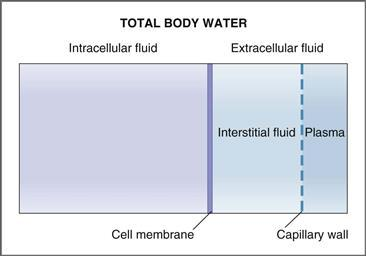

**그림 1-1 체액 구획.**

ECF는 혈장과 간질액이라는 두 개의 구획으로 더 나뉩니다. **혈장**은 혈관을 순환하는 액체이며 두 개의 ECF 하위 구획 중 더 작은 구획입니다. **간질액**은 실제로 세포를 적시는 액체로, 두 개의 하위 구획 중 더 큰 것입니다. 혈장과 간질액은 모세혈관 벽에 의해 분리됩니다. 간질액은 모세혈관 벽을 가로지르는 여과 과정에 의해 형성된 혈장의 **한외여과물**입니다. 모세혈관 벽은 혈장 단백질과 같은 큰 분자가 사실상 투과할 수 없기 때문에 간질액에는 단백질이 거의 포함되어 있지 않습니다.

체액구획의 부피를 추정하는 방법은 [6장](CR%21G9RE0KW4PD33Q9F3DXNCSBNXCANP_split_015.html#filepos1181244)에 제시되어 있다.

#### 체액 구획의 구성

체액의 구성이 일정하지 않습니다. ICF와 ECF는 다양한 용질의 농도가 크게 다릅니다. 또한 간질액에서 단백질이 배제된 결과로 발생하는 혈장과 간질액 사이의 용질 농도에는 예측 가능한 특정 차이가 있습니다.

##### *용질 농도 측정 단위*

일반적으로 용질의 **양**은 몰, 등가물 또는 삼투압으로 표시됩니다. 마찬가지로, 용질의 **농도**는 리터당 몰수(mol/L), 리터당 등가량(Eq/L) 또는 리터당 삼투압(Osm/L)으로 표시됩니다. 생물학적 용액에서 용질의 농도는 일반적으로 매우 낮으며 리터당 *밀리*몰(mmol/L), 리터당 *밀리* 등가물(mEq/L) 또는 리터당 *밀리* 삼투압(mOsm/L)으로 표시됩니다.

1 **몰**은 물질 분자 6 × 1023개입니다. 1 **밀리몰**은 1/1000 또는 10−3몰입니다. 1mmol/L의 포도당 농도는 용액 1L에 1×10-3몰의 포도당을 포함합니다.

**당량**은 충전된(이온화된) 용질의 양을 설명하는 데 사용되며 용질의 몰수에 원자가를 곱한 값입니다. 예를 들어 용액 속의 염화칼륨(KCl) 1몰은 칼륨(K+) 1당량과 염화칼륨(Cl-) 1당량으로 해리됩니다. 마찬가지로 용액 속의 염화칼슘(CaCl2) 1몰은 *2* 당량의 칼슘(Ca2+)과 *2* 당량의 염화물(Cl−)로 해리됩니다. 따라서 1mmol/L의 Ca2+ 농도는 2mEq/L에 해당합니다.

1 **오스몰**은 용액에서 용질이 해리되는 입자의 수입니다. **삼투압**은 리터당 삼투압으로 표현되는 용액 내 입자의 농도입니다. 용질이 용액(예: 포도당)에서 해리되지 않으면 삼투압은 몰농도와 같습니다. 용질이 용액 내에서 두 개 이상의 입자(예: NaCl)로 해리되면 삼투압은 몰농도에 용액 내 입자 수를 곱한 것과 같습니다. 예를 들어 NaCl이 1mmol/L인 용액은 NaCl이 두 개의 입자로 해리되기 때문에 2mOsm/L입니다.

**pH**는 수소(H+) 농도를 표현하는 데 사용되는 로그 용어입니다. 체액의 H+ 농도는 매우 낮기 때문에(예: 동맥혈의 40 x 10-9 Eq/L) 대수 용어인 pH로 더 편리하게 표현됩니다. 음의 부호는 H+ 농도가 증가함에 따라 pH가 감소하고, H+ 농도가 감소함에 따라 pH가 증가함을 의미합니다. 따라서,

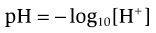

**예제 문제.** 두 명의 남성, 피험자 A와 피험자 B는 신체에서 과도한 산 생성을 유발하는 장애를 앓고 있습니다. 실험실에서는 피험자 A의 혈액의 산성도를 [H+]로 보고하고, 피험자 B의 혈액의 산성도를 pH로 보고합니다. 피험자 A의 동맥 [H+]는 65 × 10−9 Eq/L이고, 피험자 B의 동맥 pH는 7.3입니다. *혈액 내 H**+** 농도가 가장 높은 피험자는 누구입니까?*

**해결책.** 각 피험자의 혈액의 산성도를 비교하려면 피험자 A의 [H+]를 다음과 같이 pH로 변환하십시오.

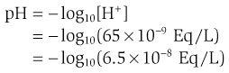

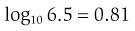

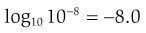

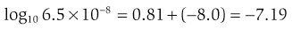

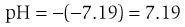

따라서 피험자 A의 혈액 pH는 [H+]로 계산하면 7.19이고, 피험자 B의 혈액 pH는 7.3으로 보고됩니다. 대상 A는 더 낮은 혈액 pH를 가지며, 이는 더 높은 [H+] 및 더 산성인 상태를 반영합니다.

##### *체액 구획의 전기중성*

각 체액 구획은 **거시적 전기 중성 원칙**을 준수해야 합니다. 즉, 각 구획은 음전하(**음이온**)와 양전하(**양이온**)의 농도(mEq/L)가 동일해야 합니다. 음이온보다 양이온이 더 많을 수 없으며 그 반대도 마찬가지입니다. 세포막 전체에 전위차가 있는 경우에도 벌크(거시적) 용액에서는 전하 균형이 여전히 유지됩니다. 막에 인접한 단지 몇 개의 전하를 분리함으로써 전위차가 발생하기 때문에 이러한 작은 전하 분리만으로는 벌크 농도를 측정 가능하게 변화시키기에 충분하지 않습니다.

##### *세포내액과 세포외액의 구성*

[표 1-1](#filepos39807)에서 볼 수 있듯이 ICF와 ECF의 구성은 확연히 다르다. **ECF**의 주요 양이온은 나트륨(Na+)이고 균형을 이루는 음이온은 염화물(Cl−)과 중탄산염(HCO3−)입니다. **ICF**의 주요 양이온은 칼륨(K+)과 마그네슘(Mg2+)이고 균형을 이루는 음이온은 단백질과 유기 인산염입니다. 구성의 다른 주목할만한 차이점은 Ca2+와 pH입니다. 일반적으로 ICF의 이온화된 Ca2+ 농도는 매우 낮습니다(약 10-7 mol/L). 반면 ECF의 Ca2+ 농도는 약 4배 더 높습니다. ICF는 ECF보다 더 산성입니다(pH가 낮습니다). 따라서 ECF에서 높은 농도로 발견되는 물질은 ICF에서 낮은 농도로 발견되며 그 반대의 경우도 마찬가지입니다.

**표 1–1 세포외액과 세포내액의 대략적인 구성**

|  |  |  |
| --- | --- | --- |
| **실질 및 단위** | **세포외액** | **세포내액**[\*](#filepos41787) |
| Na+(mEq/L) | 140 | 14 |
| K+(mEq/L) | 4 | 120 |
| Ca2+, 이온화(mEq/L) | 2.5[†](#filepos40844) | 1 × 10−4 |
| Cl− (mEq/L) | 105 | 10 |
| HCO3− (mEq/L) | 24 | 10 |
| pH[‡](#filepos42177) | 7.4 | 7.1 |
| 삼투압(mOsm/L) | 290 | 290 |

세포내액의 주요 음이온은 단백질과 유기 인산염입니다.

[†](#filepos40844)세포외액의 해당 총 [Ca2+]는 5mEq/L 또는 10mg/dL입니다.

[‡](#filepos41427)pH는 [H+]의 -log10입니다. pH 7.4는 40 × 10−9 Eq/L의 [H+]에 해당합니다.

놀랍게도, 개별 용질의 모든 농도 차이를 고려하면 총 용질 농도(**삼투압**)는 ICF와 ECF에서 동일합니다. 이러한 평등은 물이 세포막을 통해 자유롭게 흐르기 때문에 달성됩니다. ICF와 ECF 사이에 발생하는 삼투압의 일시적인 차이는 동등성을 다시 확립하기 위해 세포 안팎으로 물이 이동함으로써 빠르게 소멸됩니다.

##### *세포막 간 농도 차이 생성*

세포막 간 용질 농도의 차이는 세포막에서 에너지를 소비하는 수송 메커니즘에 의해 생성되고 유지됩니다.

이러한 수송 메커니즘 중 가장 잘 알려진 것은 Na+-K+ ATPase(Na+-K+ 펌프)로, Na+를 ICF에서 ECF로 수송하는 동시에 K+를 ECF에서 ICF로 수송합니다. Na+와 K+는 모두 각자의 전기화학적 구배에 반하여 운반됩니다. 따라서 에너지원인 아데노신 삼인산(ATP)이 필요합니다. Na+-K+ ATPase는 세포막을 가로질러 존재하는 Na+ 및 K+에 대한 큰 농도 구배(즉, 낮은 세포내 Na+ 농도와 높은 세포내 K+ 농도)를 생성하는 역할을 합니다.

유사하게, 세포내 Ca2+ 농도는 세포외 Ca2+ 농도보다 훨씬 낮은 수준으로 유지됩니다. 이러한 농도 차이는 부분적으로 전기화학적 구배에 대해 Ca2+를 펌핑하는 세포막 Ca2+ ATPase에 의해 확립됩니다. Na+-K+ ATPase와 마찬가지로 Ca2+ ATPase도 ATP를 직접적인 에너지원으로 사용합니다.

ATP를 직접 사용하는 수송체 외에도 다른 수송체도 막횡단 Na+ 농도 구배(Na+-K+ ATPase에 의해 확립됨)를 에너지원으로 활용하여 세포막 전체에 걸쳐 농도 차이를 설정합니다. 이러한 수송체는 ATP를 직접 활용하지 않고도 포도당, 아미노산, Ca2+ 및 H+에 대한 농도 구배를 생성합니다.

분명히 세포막에는 큰 농도 구배를 설정하는 장치가 있습니다. 그러나 세포막이 모든 용질에 대해 자유롭게 투과할 수 있다면 이러한 기울기는 빠르게 사라질 것입니다. 따라서 세포막이 모든 물질에 자유롭게 투과할 수 *있는 것이 아니라* 에너지를 소비하는 수송 과정에 의해 설정된 농도 구배를 유지하는 선택적 투과성을 갖는 것이 매우 중요합니다.

직간접적으로 ICF와 ECF 사이의 구성 차이는 다음 예에서 설명하는 것처럼 모든 중요한 생리적 기능의 기초가 됩니다. (1) 신경과 근육의 휴지 막 전위는 결정적으로 세포막을 가로지르는 K+ 농도의 차이에 따라 달라집니다. (2) 동일한 흥분성 세포의 활동 전위 상승은 세포막 전체의 Na+ 농도 차이에 따라 달라집니다. (3) 근육 세포의 흥분-수축 결합은 세포막과 근형질 세망막의 Ca2+ 농도 차이에 따라 달라집니다. (4) 필수 영양소의 흡수는 막횡단 Na+ 농도 구배(예: 소장에서의 포도당 흡수 또는 신장 근위세뇨관에서의 포도당 재흡수)에 따라 달라집니다.

##### *혈장과 간질액의 농도 차이*

이전에 논의한 바와 같이 ECF는 간질액과 혈장이라는 두 개의 하위 구획으로 구성됩니다. 이 두 구획 사이의 구성에서 가장 중요한 차이점은 혈장 구획에 단백질(예: 알부민)이 존재한다는 것입니다. 혈장 단백질은 분자 크기가 크기 때문에 모세혈관 벽을 쉽게 통과하지 못하므로 간질액에서 제외됩니다.

간질액에서 단백질을 제외하면 이차적인 결과가 발생합니다. 혈장 단백질은 음전하를 띠고 있으며, 이 음전하는 **Gibbs-Donnan 평형**이라고 불리는 작은 침투성 양이온과 음이온이 모세관 벽을 따라 재분배됩니다. 재분배는 다음과 같이 설명할 수 있습니다. 혈장 구획에는 비침투성 음전하 단백질이 포함되어 있습니다. 전기적 중성에 대한 요구 사항으로 인해 혈장 구획은 간질액보다 작은 음이온(예: Cl-)의 농도가 약간 낮고 작은 양이온(예: Na+ 및 K+)의 농도는 약간 높아야 합니다. 투과 이온의 작은 농도 차이는 **Gibbs-Donnan 비율**로 표현됩니다. 이는 음이온의 경우 간질액 농도에 대한 혈장 농도를, 양이온의 경우 혈장에 대한 간질액 농도를 나타냅니다. 예를 들어, 혈장의 Cl- 농도는 간질액의 Cl- 농도보다 약간 낮습니다(비침투성 혈장 단백질의 영향으로 인해). Cl−에 대한 Gibbs-Donnan 비율은 0.95이며, 이는 [Cl−]혈장/[Cl−]간질액이 0.95임을 의미합니다. Na+의 경우 Gibbs-Donnan 비율도 ​​0.95이지만 양전하를 띠는 Na+는 반대 방향으로 향하고 [Na+]간질액/[Na+]혈장은 0.95입니다. 일반적으로 작은 양이온과 음이온에 대한 농도의 이러한 사소한 차이는 무시됩니다.

### 세포막의 특성

세포막은 주로 지질과 단백질로 구성됩니다. 지질 성분은 인지질, 콜레스테롤, 당지질로 구성되어 있으며 이산화탄소, 산소, 지방산, 스테로이드 호르몬과 같은 지용성 물질에 대한 세포막의 높은 투과성을 담당합니다. 세포막의 지질 성분은 이온, 포도당, 아미노산과 같은 수용성 물질에 대한 세포막의 낮은 투과성을 담당합니다. 막의 단백질 성분은 수송체, 효소, 호르몬 수용체, 세포 표면 항원, 이온 및 물 채널로 구성됩니다.

#### 세포막의 인지질 성분

인지질은 인산화된 글리세롤 골격(“머리”)과 두 개의 지방산 “꼬리”로 구성됩니다([그림 1-2](#filepos50485)). 글리세롤 골격은 **친수성**(수용성)이고, 지방산 꼬리는 **소수성**(수불용성)입니다. 따라서 인지질 분자는 친수성과 소수성을 모두 갖고 있으며 **양친매성**이라고 합니다. 기름-물 경계면([그림 1-2*A*](#filepos50485) 참조)에서 인지질 분자는 단층을 형성하고 방향을 지정하여 글리세롤 골격이 수상에 용해되고 지방산 꼬리가 오일 상에 용해됩니다. 세포막([그림 1-2*B*](#filepos50485) 참조)에서 인지질은 지용성 지방산 꼬리가 서로 마주하고 수용성 글리세롤 머리가 서로 멀어지도록 방향을 지정하여 ICF 또는 ECF의 수용액에 용해됩니다. 이 방향은 **지질 이중층**을 생성합니다.

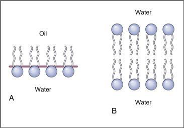

**그림 1-2 기름과 물의 경계면에서 인지질 분자의 방향.**
기름-물 경계면에서 인지질의 방향 **(A)**과 세포막에서 발생하는 이중층 인지질의 방향 **(B)**이 묘사되어 있습니다.

#### 세포막의 단백질 성분

세포막의 단백질은 막에 걸쳐 있는지 또는 한쪽에만 존재하는지에 따라 통합적이거나 주변적일 수 있습니다. 인지질 이중층의 단백질 분포는 [그림 1-3](#filepos51537)에 표시된 **유체 모자이크 모델**에 설명되어 있습니다.

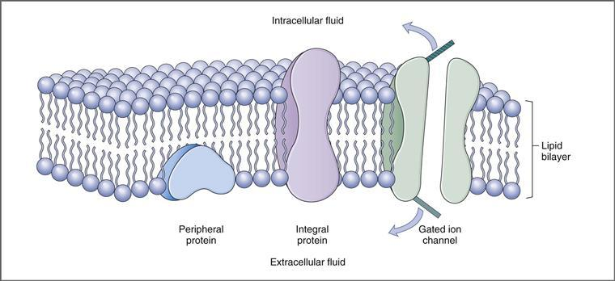

**그림 1-3 세포막의 유동 모자이크 모델.**

 **통합 막 단백질**은 **소수성 상호작용**에 의해 세포막에 내장되어 고정됩니다. 세포막에서 필수 단백질을 제거하려면 지질 이중층에 대한 부착을 방해해야 합니다(예: 세제에 의해). 일부 통합 단백질은 **막횡단 단백질**입니다. 이는 지질 이중층에 한 번 이상 걸쳐 있음을 의미합니다. 따라서 막횡단 단백질은 ECF와 ICF 모두와 접촉합니다. 막횡단 통합 단백질의 예로는 리간드 결합 수용체(예: 호르몬 또는 신경전달물질), 수송 단백질(예: Na+-K+ ATPase), 세공, 이온 채널, 세포 접착 분자 및 GTP 결합 단백질(G 단백질)이 있습니다. 다른 필수 단백질은 막에 내장되어 있지만 막에 걸쳐 있지는 않습니다.

 **말초막 단백질**은 막에 내장되어 있지 *않고* 세포막 구성요소에 공유적으로 결합되어 있지 *않습니다*. 이는 **정전기적 상호작용**(예: 통합 단백질 사용)에 의해 세포막의 세포내 또는 세포외 측면에 느슨하게 부착되어 있으며 이온 또는 수소 결합을 파괴하는 가벼운 처리로 제거할 수 있습니다. 말초막 단백질의 한 가지 예는 **안키린**이며, 이는 적혈구의 세포골격을 통합 막 수송 단백질인 Cl--HCO3- 교환체(밴드 3 단백질이라고도 함)에 "고정"시킵니다.

### 세포막을 통한 이동

여러 유형의 메커니즘이 세포막을 통과하는 물질의 수송을 담당합니다([표 1-2](#filepos53806)).

**표 1-2 막 수송 요약**

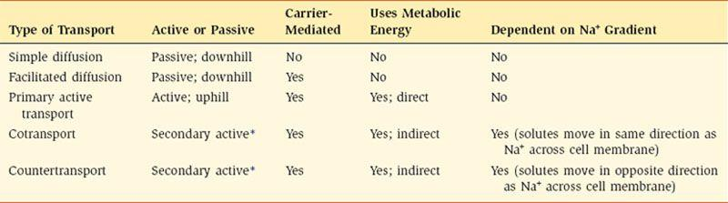

[\*](#filepos53963)Na+는 내리막으로 이동되고 하나 이상의 용질은 오르막으로 이동됩니다.

물질은 전기화학적 경사를 따라(내리막) 또는 전기화학적 경사를 거슬러(오르막) 운반될 수 있습니다. **내리막** 이동은 단순하거나 촉진된 확산에 의해 발생하며 대사 에너지 투입이 필요하지 않습니다. **오르막** 수송은 능동 수송에 의해 발생하며, 이는 1차 또는 2차일 수 있습니다. 1차 및 2차 능동수송 과정은 에너지원에 따라 구별됩니다. 1차 능동 수송에는 대사 에너지의 *직접적인* 입력이 필요합니다. 2차 능동 수송은 대사 에너지의 *간접적인* 입력을 활용합니다.

수송 메커니즘 간의 추가 구별은 프로세스에 단백질 운반체가 포함되는지 여부에 따라 결정됩니다. 단순 확산은 캐리어 매개가 *아닌* 유일한 전달 형태입니다. 촉진 확산, 1차 능동 수송, 2차 능동 수송은 모두 내재막 단백질을 포함하며 **운반체 매개 수송**이라고 합니다. 모든 형태의 운반체 매개 수송은 포화, 입체특이성, 경쟁이라는 세 가지 특징을 공유합니다.

 **포화도.** 포화도는 담체 단백질이 용질에 대한 결합 부위의 수가 제한되어 있다는 개념을 기반으로 합니다. [그림 1-4](#filepos56568)는 담체 매개 수송 속도와 용질 농도 간의 관계를 보여줍니다. 낮은 용질 농도에서는 많은 결합 부위를 이용할 수 있으며 농도가 증가함에 따라 수송 속도가 급격히 증가합니다. 그러나 용질 농도가 높으면 이용 가능한 결합 부위가 부족해지고 수송 속도가 느려집니다. 마지막으로 모든 결합 부위가 채워지면 **이동 최대값** 또는 **Tm**이라는 지점에서 포화가 달성됩니다. 담체 매개 수송의 동역학은 Michaelis-Menten 효소 동역학과 유사합니다. 둘 다 제한된 수의 결합 부위를 가진 단백질을 포함합니다. (Tm은 효소 동역학의 Vmax와 유사합니다.) 신장 근위세뇨관에서의 Tm 제한 포도당 수송은 포화 수송의 예입니다.

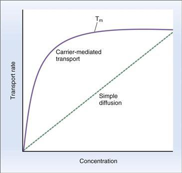

**그림 1-4 운반체 매개 수송의 동역학.**
Tm, 최대 운송량.

 **입체특이성.** 수송 단백질의 용질 결합 부위는 입체특이성입니다. 예를 들어, 신근위세뇨관의 포도당 운반체는 천연 이성질체인 D-글루코스를 인식하고 운반하지만, 비천연 이성질체인 L-글루코스를 인식하거나 운반하지 않습니다. 대조적으로, 단순 확산은 단백질 운반체가 포함되지 않기 때문에 두 포도당 이성질체를 구별하지 않습니다.

 **경쟁.** 운반된 용질의 결합 부위는 매우 구체적이지만 화학적으로 관련된 용질을 인식하고 결합하고 운반할 수도 있습니다. 예를 들어, 포도당의 수송체는 D-포도당에 특이적이지만 밀접하게 관련된 당인 D-갈락토스도 인식하고 수송합니다. 따라서 D-갈락토오스의 존재는 일부 결합 부위를 점유하고 이를 포도당에 사용할 수 없도록 만들어 D-포도당의 수송을 억제합니다.

#### 단순 확산

##### *비전해질의 확산*

단순 확산은 [그림 1-5](#filepos59288)와 같이 분자의 무작위 열 운동의 결과로 발생합니다. 두 용액 A와 B는 용질을 투과할 수 있는 막으로 분리되어 있습니다. A의 용질 농도는 초기에 B의 두 배입니다. 용질 분자는 일정한 운동을 하며, 주어진 분자가 막을 통과하여 다른 용액으로 갈 확률도 동일합니다. 그러나 용액 A에는 용액 B보다 용질 분자가 두 배 더 많기 때문에 B에서 A로의 분자 이동보다 A에서 B로의 분자 이동이 더 큽니다. 즉, A에서 B로의 용질의 **순 확산**이 발생하며, 이는 두 용액의 용질 농도가 같아질 때까지 계속됩니다(분자의 무작위 이동은 영원히 계속되지만).

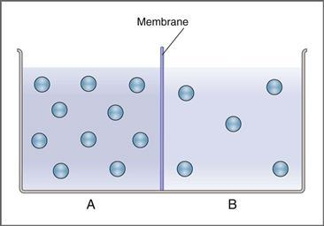

**그림 1–5 단순 확산.**
**A**와 **B**라는 두 용액은 용질(*원*)을 투과할 수 있는 막으로 분리되어 있습니다. 용액 A는 처음에 용액 B보다 더 높은 농도의 용질을 포함합니다.

용질의 순 확산은 **유량** 또는 **유량**(**J**)이라고 하며 농도 구배 크기, 분배 계수, 확산 계수, 막 두께, 확산에 사용할 수 있는 표면적 등의 변수에 따라 달라집니다.

###### 농도 구배(CA − CB)

막을 가로지르는 농도 구배는 순확산의 원동력입니다. 용액 A와 용액 B 사이의 용질 농도 차이가 클수록 추진력이 커지고 순 확산도 커집니다. 또한 두 용액의 농도가 동일하면 추진력도 없고 순 확산도 없습니다.

###### 분할 계수(K)

분배 계수는 정의에 따라 물에 대한 용해도에 비해 오일에 대한 용질의 용해도를 나타냅니다. 오일의 상대 용해도가 클수록 분배 계수가 높아지고 용질이 세포막의 지질 이중층에 더 쉽게 용해될 수 있습니다. 비극성 용질은 기름에 용해되는 경향이 있고 분배 계수 값이 높은 반면, 극성 용질은 기름에 불용성인 경향이 있고 분배 계수 값이 낮습니다. 분배 계수는 올리브 오일과 물의 혼합물에 용질을 추가한 다음 수상의 농도와 비교하여 오일 상의 농도를 측정하여 측정할 수 있습니다. 따라서,

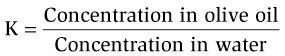

###### 확산계수(D)

확산 계수는 용질 분자의 크기 및 매질의 점도와 같은 특성에 따라 달라집니다. 이는 스톡스-아인슈타인 방정식(나중에 참조)으로 정의됩니다. 확산 계수는 용질의 분자 반경 및 매질의 점도와 *역의* 상관관계가 있습니다. 따라서 비점성 용액의 작은 용질은 가장 큰 확산 계수를 가지며 가장 쉽게 확산됩니다. 점성 용액의 큰 용질은 확산 계수가 가장 작고 쉽게 확산되지 않습니다. 따라서,

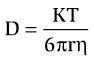

어디서

|  |  |
| --- | --- |
| 디 | = 확산계수 |
| 케이 | = 볼츠만 상수 |
| 티 | = 절대온도(K) |
| r | = 분자 반경 |
| 에타 | = 매체의 점도 |

###### 멤브레인의 두께(ΔX)

세포막이 두꺼울수록 용질이 확산되어야 하는 거리가 길어지고 확산 속도는 낮아집니다.

###### 표면적(A)

사용 가능한 막의 표면적이 클수록 확산 속도는 높아집니다. 예를 들어, 산소 및 이산화탄소와 같은 지용성 가스는 세포막을 통한 확산 속도가 특히 높습니다. 이러한 높은 속도는 막의 지질 성분에 의해 제공되는 확산을 위한 넓은 표면적에 기인할 수 있습니다.

확산에 대한 설명을 단순화하기 위해 앞서 인용한 몇 가지 특성을 **투과성**(**P**)**이라는 단일 용어로 결합할 수 있습니다.** 투과성에는 분배 계수, 확산 계수 및 멤브레인 두께가 포함됩니다. 따라서,

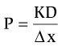

여러 변수를 투과도로 결합함으로써 순 확산 속도는 다음 식으로 단순화됩니다.

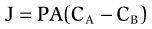

어디서

|  |  |
| --- | --- |
| 제이 | = 순 확산 속도(mmol/초) |
| 피 | = 투과율(cm/초) |
| A | = 확산 표면적(cm2) |
| 캘리포니아 | = 용액 A의 농도(mmol/L) |
| CB | = 용액 B의 농도(mmol/L) |

##### *전해질의 확산*

지금까지 확산에 관한 논의에서는 용질이 비전해질(즉, 전하를 띠지 않음)이라고 가정했습니다. 그러나 확산하는 용질이 **이온** 또는 **전해질**인 경우 용질에 전하가 존재하면 두 가지 추가 결과가 발생합니다.

첫째, 만약 막을 가로질러 전위차가 있다면, 그 전위차는 전하를 띤 용질의 순 확산 속도를 변화시킬 것입니다. (전위차는 비전해질의 확산 속도를 바꾸지 않습니다.) 예를 들어, K+가 양전하 영역으로 확산되면 K+ 이온의 확산이 느려지고, K+가 음전하 영역으로 확산되면 가속됩니다. 전위차의 이러한 효과는 전위차의 방향과 확산 이온의 전하에 따라 농도 차이의 효과를 추가하거나 무효화할 수 있습니다. 농도 구배와 전하 효과가 막을 통해 같은 방향으로 향하면 결합됩니다. 반대 방향으로 향하면 서로 상쇄될 수 있습니다.

**샘플 문제.** 용액 A와 용액 B는 요소에 대한 투과도가 2 × 10−5 cm/sec이고 표면적이 1 cm2인 막으로 분리되어 있습니다. A의 요소 농도는 10mg/mL이고, B의 요소 농도는 1mg/mL입니다. 요소의 분배계수는 기름-물 혼합물에서 측정했을 때 10−3입니다. *요소의 순 확산의 초기 속도와 방향은 무엇입니까?*

**해결책.** 분배 계수를 이미 포함하는 투자율 값이 제공되므로 분배 계수는 외부 정보입니다. 순 유속은 순 확산 방정식에 다음 값을 대입하여 계산할 수 있습니다. 물 1mL = 1cm3라고 가정합니다. 따라서,

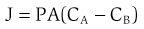

어디서

> 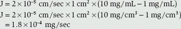

순 플럭스의 *크기*는 1.8 × 10−4 mg/sec로 계산되었습니다. 순 플럭스의 *방향*은 고농도 영역(용액 A)에서 저농도 영역(용액 B)으로 순 플럭스가 발생하기 때문에 직관적으로 결정될 수 있습니다. 순 확산은 두 용액의 요소 농도가 같아질 때까지 계속되며, 이 지점에서 추진력은 0이 됩니다.

둘째, 전하를 띤 용질이 농도 구배에 따라 확산될 때 확산 자체가 막을 가로질러 **확산 전위**라고 불리는 전위차를 생성할 수 있습니다. 확산 전위의 개념은 다음 섹션에서 더 자세히 논의됩니다.

#### 확산 촉진

단순 확산과 마찬가지로 촉진 확산도 전기화학적 전위 구배에 따라 발생합니다. 따라서 대사 에너지의 입력이 필요하지 않습니다. 그러나 단순 확산과 달리 촉진 확산은 멤브레인 캐리어를 사용하며 포화, 입체특이성 및 경쟁과 같은 캐리어 매개 수송의 모든 특성을 나타냅니다. 낮은 용질 농도에서 촉진 확산은 담체의 기능으로 인해 일반적으로 단순 확산보다 빠르게 진행됩니다(즉, 촉진됩니다). 그러나 농도가 높아지면 캐리어가 포화되고 촉진 확산이 안정됩니다. (반대로, 단순 확산은 용질에 농도 구배가 있는 한 진행됩니다.)

촉진 확산의 훌륭한 예는 **GLUT4** 수송체에 의해 **D-포도당**이 골격근과 지방 세포로 수송되는 것입니다. 포도당 수송은 혈중 포도당 농도가 세포내 포도당 농도보다 높고 운반체가 포화되지 않는 한 진행될 수 있습니다. D-갈락토오스, 3-*O-* 메틸 포도당, 플로리진과 같은 다른 단당류는 운반체의 수송 부위에 결합하기 때문에 경쟁적으로 포도당 수송을 억제합니다. 경쟁 용질은 그 자체로 운반될 수도 있고(예: D-갈락토오스) 단순히 결합 부위를 차지하고 포도당의 부착을 방지할 수도 있습니다(예: 플로리진). 이전에 언급한 바와 같이, 비생리학적 입체이성질체인 L-글루코스는 운반체에 의해 촉진 확산으로 인식되지 않으므로 결합되거나 운반되지 않습니다.

#### 기본 능동 전송

능동 수송에서는 하나 이상의 용질이 전기화학적 전위 구배(오르막)에 반대하여 이동합니다. 즉, 용질은 농도가 낮은(또는 전기화학적 전위가 낮은) 영역에서 농도가 높은(또는 전기화학적 전위가 높은) 영역으로 이동합니다. 용질의 *오르막* 이동은 일이므로 ATP 형태의 대사 에너지가 제공되어야 합니다. 이 과정에서 ATP는 아데노신 이인산염(ADP)과 무기 인산염(Pi)으로 가수분해되어 ATP의 말단 고에너지 인산염 결합에서 에너지를 방출합니다. 말단 인산염이 방출되면 수송 단백질로 전달되어 인산화와 탈인산화의 순환이 시작됩니다. ATP 에너지원이 수송 과정에 직접 결합되는 경우를 *1차* 능동 수송이라고 합니다. 생리학적 시스템에서 일차 능동 수송의 세 가지 예는 모든 세포막에 존재하는 Na+-K+ ATPase, 근형질 및 소포체에 존재하는 Ca2+ ATPase, 위 벽세포에 존재하는 H+-K+ ATPase입니다.

##### *Na+-K+ ATPase(Na+-K+ 펌프)*

Na+-K+ ATPase는 모든 세포의 막에 존재합니다. Na+를 ICF에서 ECF로, K+를 ECF에서 ICF로 펌핑합니다([그림 1-6](#filepos73302)). 각 이온은 해당 전기화학적 구배에 반대하여 이동합니다. 화학량론은 다양할 수 있지만 일반적으로 세포 밖으로 3개의 Na+ 이온이 펌핑될 때마다 2개의 K+ 이온이 세포로 펌핑됩니다. 2개의 K+ 이온당 3개의 Na+ 이온의 화학량론은 Na+-K+ ATPase의 각 주기에 대해 세포 안으로 펌핑되는 것보다 더 많은 양전하가 세포 밖으로 펌핑된다는 것을 의미합니다. 따라서 이 과정은 전하 분리와 전위차를 생성하기 때문에 **전기 발생**이라고 불립니다. Na+-K+ ATPase는 세포막 전체에서 Na+와 K+의 농도 구배를 유지하여 세포 내 Na+ 농도를 낮게 유지하고 세포 내 K+ 농도를 높게 유지하는 역할을 합니다.

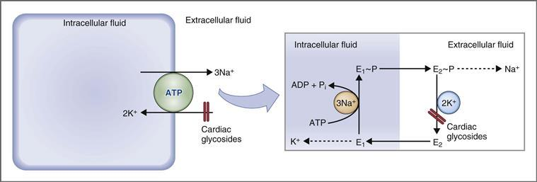

**그림 1–6 세포막의 Na+-K+ 펌프.**
ADP, 아데노신 디포스페이트; ATP, 아데노신 삼인산; E, Na+-K+ ATPase; E ~ P, 인산화된 Na+-K+ ATPase; Pi, 무기 인산염.

Na+-K+ ATPase는 α 및 β 하위 단위로 구성됩니다. α 소단위체에는 ATPase 활성뿐만 아니라 운반된 이온인 Na+ 및 K+의 결합 부위도 포함되어 있습니다. Na+-K+ ATPase는 두 가지 주요 구조 상태인 E1과 E2 사이를 전환합니다. **E1 상태**에서 Na+와 K+의 결합 부위는 세포내액을 향하고 효소는 Na+에 대해 높은 친화력을 갖습니다. **E2 상태**에서는 Na+와 K+의 결합 부위가 세포외액을 향하고 효소는 K+에 대해 높은 친화력을 갖습니다. 효소의 이온 수송 기능(즉, Na+를 세포 밖으로 펌핑하고 K+를 세포로 펌핑)은 E1과 E2 상태 사이의 순환을 기반으로 하며 ATP 가수분해에 의해 구동됩니다.

**이송주기**는 [그림 1-6](#filepos73302)과 같다. 이 주기는 ATP에 결합된 E1 상태의 효소로 시작됩니다. E1 상태에서 이온 결합 부위는 세포내액을 향하고 있으며 효소는 Na+에 대해 높은 친화력을 가지고 있습니다. 세 개의 Na+ 이온이 결합하고 ATP가 가수분해되며 ATP의 말단 인산염이 효소로 전달되어 고에너지 상태인 E1~P가 생성됩니다. 이제 주요 구조적 변화가 발생하고 효소는 E1~P에서 E2~P로 전환됩니다. E2 상태에서는 이온 결합 부위가 세포외액을 향하고 있으며 Na+에 대한 친화력은 낮고 K+에 대한 친화력은 높습니다. 세 개의 Na+ 이온이 효소에서 세포외액으로 방출되고, 두 개의 K+ 이온이 결합되고, 무기 인산염이 E2에서 방출됩니다. 이제 효소는 세포내 ATP와 결합하고, 효소를 E1 상태로 되돌리는 또 다른 주요 형태 변화가 발생합니다. 두 개의 K+ 이온이 세포내액으로 방출되고 효소는 다음 주기를 준비합니다.

**심장배당체**(예: **ouabain** 및 **digitalis**)는 Na+-K+ ATPase를 억제하는 약물 계열입니다. 이 종류의 약물로 치료하면 세포내 이온 농도에 예측 가능한 변화가 발생합니다. 세포내 Na+ 농도는 증가하고 세포내 K+ 농도는 감소합니다. 강심배당체는 세포외 측의 K+ 결합 부위 근처의 E2~P 형태에 결합하여 Na+-K+ATPase를 억제함으로써 E2~P가 E1으로 다시 전환되는 것을 방지합니다. 인산화-탈인산화 주기를 방해함으로써 이들 약물은 전체 효소 주기와 그 ​​수송 기능을 방해합니다.

##### *Ca2+ ATPase(Ca2+ 펌프)*

대부분의 **세포**(**플라즈마**) **막**에는 Ca2+ ATPase 또는 혈장 막 Ca2+ ATPase(**PMCA**)가 포함되어 있으며, 이 기능은 전기화학적 구배에 맞서 세포에서 Ca2+를 압출하는 것입니다. 가수분해된 각 ATP에 대해 하나의 Ca2+ 이온이 압출됩니다. PMCA는 부분적으로 매우 낮은 세포내 Ca2+ 농도를 유지하는 역할을 합니다. 또한, 근육 세포의 **근형질 세망**과 다른 세포의 **소형질 세망**에는 세포내액에서 두 개의 Ca2+ 이온(가수분해된 각 ATP에 대해)을 근형질 또는 소포체 내부로 펌핑하는(즉, Ca2+ 격리) Ca2+ ATPase의 변이체가 포함되어 있습니다. 이러한 변종을 근형질 및 소포체 Ca2+ ATPase(**SERCA**)라고 합니다. Ca2+ ATPase는 Na+-K+ ATPase와 유사하게 기능하며 E1 및 E2 상태는 각각 Ca2+에 대해 높은 친화력과 낮은 친화성을 갖습니다. PMCA의 경우, E1 상태는 세포내 측에서 Ca2+와 결합하고, E2 상태로의 구조적 변화가 발생하며, E2 상태는 Ca2+를 세포외액으로 방출합니다. SERCA의 경우 E1 상태는 세포내 측면에서 Ca2+를 결합하고 E2 상태는 Ca2+를 근형질 또는 소포체의 내강으로 방출합니다.

##### *H+-K+ ATPase(H+-K+ 펌프)*

H+-K+ ATPase는 위 점막의 벽세포와 신장 집합관의 α-삽입 세포에서 발견됩니다. 위에서는 벽세포의 ICF에서 위의 내강으로 H+를 펌핑하여 위 내용물을 산성화합니다. 위 H+-K+ ATPase 억제제인 ​​**오메프라졸**은 일부 유형의 소화성 궤양 질환 치료에서 H+ 분비를 줄이기 위해 치료적으로 사용될 수 있습니다.

#### 2차 능동 수송

2차 능동 수송 과정은 둘 이상의 용질 수송이 결합되는 과정입니다. 용질 중 하나(일반적으로 Na+)는 전기화학적 기울기를 따라 이동하고(내리막), 다른 용질은 전기화학적 기울기에 반대하여 이동합니다(오르막). Na+의 내리막 이동은 다른 용질의 오르막 이동에 에너지를 제공합니다. 따라서 ATP와 같은 대사에너지는 직접적으로 사용되지 않고 세포막을 통과하는 Na+ 농도 구배를 통해 간접적으로 공급됩니다. (ATP를 활용하는 Na+-K+ ATPase는 이 Na+ 구배를 생성하고 유지합니다.) 따라서 *2차* 능동 수송이라는 이름은 ATP를 에너지원으로 *간접적으로* 활용하는 것을 의미합니다.

Na+-K+ ATPase의 억제(예: ouabain 처리)는 ICF에서 ECF로의 Na+ 수송을 감소시켜 세포 내 Na+ 농도를 증가시키고 이에 따라 막횡단 Na+ 구배의 크기를 감소시킵니다. 따라서 간접적으로 모든 2차 능동 수송 과정은 에너지원인 Na+ 구배가 감소하기 때문에 Na+-K+ ATPase 억제제에 의해 감소됩니다.

오르막 용질의 이동 방향에 따라 구별되는 2차 능동 수송에는 두 가지 유형이 있습니다. 오르막 용질이 Na+와 같은 방향으로 이동하는 경우 이를 **공동수송** 또는 **상호수송**이라고 합니다. 오르막 용질이 Na+와 반대 방향으로 이동하는 경우 이를 **역수송, 역이동** 또는 **교환이라고 합니다.**

##### *공동운송*

공동수송(symport)은 모든 용질이 세포막을 가로질러 **같은 방향**으로 운반되는 2차 능동 수송의 한 형태입니다. Na+는 전기화학적 구배를 따라 캐리어 위의 세포 *안으로* 이동합니다. Na+와 함께 수송되는 용질도 세포 *안으로* 이동합니다. Cotransport는 특히 소장과 세뇨관의 흡수 상피와 같은 여러 중요한 생리적 과정에 관여합니다. 예를 들어, **Na+-포도당 공동수송**(SGLT) 및 **Na+-아미노산 공동수송**은 소장 및 신장 근위세뇨관 모두의 상피 세포의 관강막에 존재합니다. 세뇨관과 관련된 공동수송의 또 다른 예는 **Na+-K+-2Cl− 공동수송**이며, 이는 두꺼운 상행 사지의 상피 세포의 관강막에 존재합니다. 각 예에서 Na+-K+ ATPase에 의해 설정된 Na+ 구배는 전기화학적 구배에 대해 포도당, 아미노산, K+ 또는 Cl-와 같은 용질을 운반하는 데 사용됩니다.

[그림 1-7](#filepos83741)은 장 상피 세포에서 Na+-포도당 공동수송(**SGLT1** 또는 Na-포도당 수송 단백질 1)의 예를 사용하여 공동수송의 원리를 보여줍니다. 공동수송체는 이들 세포의 내강막에 존재하며 두 개의 특정 인식 부위(하나는 Na+ 이온에 대한 것이고 다른 하나는 포도당에 대한 것)를 갖는 것으로 시각화될 수 있습니다. Na+와 포도당이 모두 소장의 내강에 존재하면 운반체에 결합합니다. 이 구성에서 공동수송 단백질은 회전하여 Na+와 포도당을 모두 세포 내부로 방출합니다. (결과적으로, 두 용질은 모두 Na+-K+ ATPase에 의해 기저측막을 통해 세포 밖으로 운반되고 Na+는 촉진 확산에 의해 포도당으로 운반됩니다.) Na+ 또는 포도당 중 하나가 장 내강에서 누락되면 공동수송체가 회전할 수 없습니다. 따라서 두 용질이 모두 필요하며 다른 용질이 없으면 둘 중 어느 것도 운반될 수 없습니다([박스 1-1](#filepos84164)).

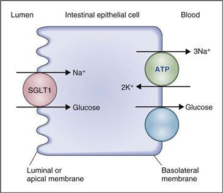

**그림 1–7 장 상피 세포의 Na+-포도당 동시 수송.**
ATP, 아데노신 삼인산; SGLT1, Na+-포도당 수송 단백질 1.

**상자 1-1 임상 생리학: 당뇨병으로 인한 당뇨병**

> **사례 설명.** 연례 신체 검진에서 14세 소년이 잦은 배뇨와 심한 갈증 증상을 보고했습니다. 그의 소변 딥스틱 테스트에서는 포도당 수치가 상승한 것으로 나타났습니다. 의사는 내당능 검사를 지시했는데, 이는 그 소년이 제1형 당뇨병을 앓고 있음을 나타냅니다. 그는 주사를 통해 인슐린 치료를 받았으며, 이후 그의 딥스틱 테스트는 정상입니다.

> **사례 설명.** 제1형 당뇨병은 복잡한 질병임에도 불구하고, 이 논의는 빈뇨 증상과 당뇨(소변 내 포도당)의 발견에 국한됩니다. 포도당은 일반적으로 신장에서 다음과 같은 방식으로 처리됩니다. 혈액 내 포도당은 사구체 모세혈관을 통해 여과됩니다. 신장 근위 세뇨관을 둘러싸고 있는 상피 세포는 여과된 포도당을 모두 재흡수하여 포도당이 소변으로 배설되지 않도록 합니다. 따라서 정상적인 계량봉 검사에서는 소변에 포도당이 나타나지 않습니다. 근위세뇨관의 상피 세포가 여과된 포도당을 모두 다시 혈액으로 재흡수하지 못하는 경우, 재흡수되지 않은 포도당은 배설됩니다. 이러한 포도당 재흡수를 위한 세포 메커니즘은 근위세뇨관 세포의 관강막에 있는 Na+-포도당 공동수송체입니다. 이는 운반체 매개 수송체이기 때문에 포도당 결합 부위의 수가 한정되어 있습니다. 이러한 결합 부위가 완전히 채워지면 수송 포화 상태가 발생합니다(수송 최대치).

> 이 제1형 당뇨병 환자의 경우, 췌장 베타 세포에서 인슐린 호르몬이 충분한 양으로 생성되지 않습니다. 인슐린은 포도당이 간, 근육 및 기타 세포로 정상적으로 흡수되는 데 필요합니다. 인슐린이 없으면 세포가 포도당을 흡수하지 못하기 때문에 혈당 농도가 증가합니다. 혈당 농도가 높은 수준으로 증가하면 신장 사구체에 의해 더 많은 포도당이 여과되고 여과된 포도당의 양은 Na+-포도당 공동수송체의 용량을 초과합니다. 이 수송체의 포화로 인해 재흡수될 수 없는 포도당은 소변으로 "흘려집니다".

> **치료.** 제1형 당뇨병 환자의 치료는 외인성 인슐린을 주사로 투여하는 것입니다. 췌장 β 세포에서 정상적으로 분비되거나 주사로 투여되는 인슐린은 세포 내로의 포도당 흡수를 촉진하여 혈당 농도를 낮춥니다. 이 환자는 인슐린을 투여받았을 때 혈당 농도가 감소했습니다. 따라서 여과된 포도당의 양은 감소했고 Na+-포도당 공동수송체는 더 이상 포화되지 않았습니다. 여과된 포도당은 모두 재흡수될 수 있으므로 포도당이 소변으로 배설되거나 "유출"되지 않습니다.

마지막으로, 장내 Na+-포도당 공동수송 과정의 역할은 탄수화물의 전반적인 장내 흡수와 관련하여 이해될 수 있습니다. 식이 탄수화물은 위장 효소에 의해 흡수 가능한 형태인 단당류로 소화됩니다. 이러한 단당류 중 하나는 포도당이며, 이는 내강막의 Na+-포도당 공동수송과 기저측막의 포도당 확산 촉진의 조합에 의해 장 상피 세포를 통해 흡수됩니다. Na+-포도당 공동수송은 포도당이 전기화학적 구배에 반하여 혈액으로 흡수되도록 하는 활성 단계입니다.

##### *반송*

역수송(역이동 또는 교환)은 용질이 세포막을 가로질러 *반대 방향*으로 이동하는 2차 능동 수송의 한 형태입니다. Na+는 전기화학적 구배를 따라 캐리어 위의 세포 *안으로* 이동합니다. 역수송되거나 Na+로 교환되는 용질은 세포 *밖으로* 이동합니다. 역수송은 Ca2+-Na+ 교환([그림 1-8](#filepos89139))과 Na+-H+ 교환으로 설명됩니다. 공동수송과 마찬가지로 각 과정은 Na+-K+ ATPase에 의해 설정된 Na+ 구배를 에너지원으로 사용합니다. Na+는 내리막으로 이동하고 Ca2+ 또는 H+는 오르막으로 이동합니다.

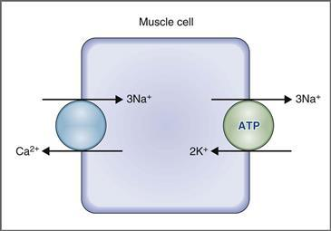

**그림 1–8 근육 세포의 Ca2+-Na+ 역수송(교환).**
ATP, 아데노신 삼인산.

Ca2+-Na+ 교환은 Ca2+ ATPase와 함께 세포 내 Ca2+ 농도를 매우 낮은 수준(약 10−7 몰)으로 유지하는 데 도움이 되는 수송 메커니즘 중 하나입니다. Ca2+-Na+ 교환을 수행하려면 Ca2+가 전기화학적 구배에 반하여 세포 밖으로 이동하기 때문에 능동 수송이 필요합니다. [그림 1-8](#filepos89139)은 근육세포막에서 Ca2+-Na+ 교환의 개념을 보여준다. 교환 단백질은 Ca2+와 Na+ 모두에 대한 인식 부위를 가지고 있습니다. 단백질은 막의 세포내 측에서 Ca2+와 결합해야 하며 동시에 세포외 측에서 Na+와 결합해야 합니다. 이 구성에서 교환 단백질은 회전하여 Ca2+를 세포 외부로 전달하고 Na+를 세포 내부로 전달합니다.

Ca2+-Na+ 교환의 화학양론은 세포 유형에 따라 다르며 심지어 조건에 따라 단일 세포 유형에 따라 달라질 수도 있습니다. 그러나 일반적으로 세포에서 압출된 각 Ca2+ 이온에 대해 3개의 Na+ 이온이 세포로 들어갑니다. Ca2+ 이온 1개당 Na+ 이온 3개의 화학량론을 사용하면 세포에서 나가는 양전하 2개와 교환하여 양전하 3개가 세포 내로 이동하여 Ca2+-Na+ 교환기가 **전기성을 띠게 됩니다.**

#### 삼투

삼투는 용질 농도의 차이로 인해 반투막을 통과하는 물의 흐름입니다. 비침투성 용질의 농도 차이로 인해 삼투압 차이가 생기고, 이 삼투압 차이로 인해 삼투 현상이 일어나 물이 흐르게 됩니다. 물의 삼투는 물의 확산이 *아님*: 삼투는 압력 차이로 인해 발생하는 반면, 확산은 물의 농도(또는 활성) 차이로 인해 발생합니다.

##### *삼투압*

용액의 삼투압은 삼투압 활성 입자의 농도이며, 리터당 삼투압 또는 리터당 밀리오스몰로 표시됩니다. 삼투압을 계산하려면 용질의 농도와 용질이 용액에서 해리되는지 여부를 알아야 합니다. 예를 들어, 포도당은 용액에서 해리되지 않습니다. 이론적으로 NaCl은 두 개의 입자로 해리되고 CaCl2는 세 개의 입자로 해리됩니다. 기호 "g"는 용액에 있는 입자의 수를 나타내며 완전한 해리가 있는지 아니면 부분 해리만 있는지도 고려합니다. 따라서 NaCl이 두 개의 입자로 완전히 해리되면 g는 2.0이고; NaCl이 부분적으로만 해리되면 g는 1.0과 2.0 사이에 속합니다. 삼투압은 다음과 같이 계산됩니다.

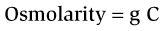

어디서

|  |  |
| --- | --- |
| 삼투압 | = 입자 농도(mOsm/L) |
| 지 | = 용액 내 몰당 입자 수(Osm/mol) |
| 다 | = 농도(mmol/L) |

두 용액의 계산된 삼투압이 동일한 경우 이를 **등삼투성**이라고 합니다. 두 용액의 계산된 삼투압이 서로 다른 경우 삼투압이 더 높은 용액을 **고삼투성**이라고 하고, 삼투압이 낮은 용액을 **저삼투성**이라고 합니다.

##### *삼투압*

**삼투압**은 삼투압 활성 입자의 농도를 제외하고는 삼투압과 유사하며, 삼투압(또는 밀리오스몰) *물 kg당*으로 표시됩니다. 1kg의 물은 대략 1L의 물과 동일하므로 삼투압*r*ity와 삼투압*l*ity는 본질적으로 동일한 수치 값을 갖습니다.

**샘플 문제.** 용액 A는 2mmol/L 요소이고, 용액 B는 1mmol/L NaCl입니다. gNaCl = 1.85라고 가정합니다. *두 용액은 등삼투성인가요?*

**해결책.** 두 용액의 삼투압을 계산하여 비교하십시오. 용액 A에는 용액에서 해리되지 않는 요소가 포함되어 있습니다. 용액 B에는 용액에서 부분적으로 해리되지만 완전히 해리되지는 않는 NaCl이 포함되어 있습니다(즉, g < 2.0). 따라서,

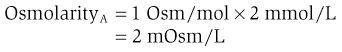

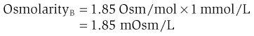

두 용액의 계산된 삼투압농도는 동일하지 않습니다. 그러므로 그들은 *등삼투성이 아니다*. 용액 A는 용액 B보다 삼투압이 더 높고 고삼투성입니다. 용액 B는 저삼투성이다.

##### *삼투압*

**삼투**는 용질 농도의 차이로 인해 반투막을 통과하는 물의 흐름입니다. 용질 농도의 차이로 인해 막 전체에 삼투압 차이가 발생하고 이 압력 차이가 삼투압 수류의 원동력이 됩니다.

[그림 1-9](#filepos96769)는 삼투의 개념을 보여준다. 대기에 개방된 두 가지 수용액이 [그림 1-9*A*](#filepos96769)에 나와 있습니다. 용액을 분리하는 막은 물은 투과할 수 있지만 용질은 투과하지 못합니다. 처음에 용질은 용액 1에만 존재합니다. 용액 1의 용질은 삼투압을 생성하고 용질과 막의 기공과의 상호 작용으로 용액 1의 정수압을 감소시킵니다. 결과적으로 막을 통과하는 정수압 차이로 인해 물이 용액 2에서 용액 1로 흐르게 됩니다. 시간이 지남에 따라 물의 흐름으로 인해 용액 1의 부피가 증가하고 용액 2의 부피가 감소합니다.

[그림 1-9*B*](#filepos96769)는 유사한 솔루션 쌍을 보여줍니다. 그러나 피스톤에 압력을 가하여 용액 1로 물이 흐르는 것을 방지하도록 준비가 수정되었습니다. *물의 흐름을 멈추는 데 필요한 압력은 용액 1의 삼투압입니다.*

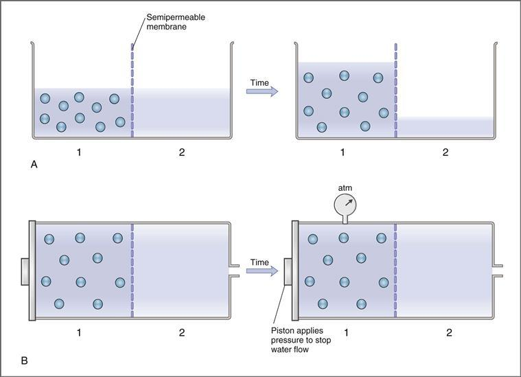

**그림 1–9 반투막을 통한 삼투.**
**A**, 용질(*원*)은 반투막의 한쪽 면에 존재합니다. 시간이 지남에 따라 용질에 의해 생성된 삼투압으로 인해 물이 용액 2에서 용액 1로 흐르게 됩니다. 결과적인 부피 변화가 표시됩니다. **B**, 용액은 대기와 폐쇄되고, 피스톤은 용액 1로의 물의 흐름을 막기 위해 적용됩니다. 물의 흐름을 멈추는 데 필요한 압력은 용액 1의 유효 삼투압입니다. Atm, Atmosphere.

용액 1의 삼투압(π)은 삼투압 활성 입자의 농도와 용질이 용액 1에 남아 있는지 여부(즉, 용질이 막을 통과할 수 있는지 여부)라는 두 가지 요인에 따라 달라집니다. 삼투압은 **반트 호프 방정식**(다음과 같음)으로 계산됩니다. 이 방정식은 용질이 원래 용액에 유지되는지 여부를 고려하여 입자의 농도를 압력으로 변환합니다.

따라서,

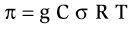

어디서

|  |  |
| --- | --- |
| π | = 삼투압(atm 또는 mm Hg) |
| 지 | = 용액 내 몰당 입자 수(Osm/mol) |
| 다 | = 농도(mmol/L) |
| σ | = 반사계수(0에서 1까지 다양함) |
| R | = 가스 상수(0.082 L – atm/mol – K) |
| 티 | = 절대온도(K) |

**반사 계수**(**σ**)는 용질이 막을 쉽게 통과하는 정도를 나타내는 0과 1 사이의 무차원 숫자입니다. 반사계수는 다음 세 가지 조건으로 설명할 수 있습니다([그림 1-10](#filepos99615)).

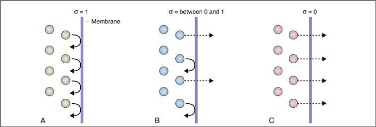

**그림 1–10 반사 계수**(**σ**).

 **σ** = **1.0** ([그림 1-10*A*](#filepos99615) 참조). 막이 용질에 대해 불투과성인 경우 σ는 1.0이고 용질은 원래 용액에 유지되어 완전한 삼투 효과를 발휘합니다. 이 경우 유효 삼투압은 최대가 되며 최대 물 흐름을 유발합니다. 예를 들어 **혈청 알부민**과 **세포내 단백질**은 σ = 1인 용질입니다.

 **σ** = **0** ([그림 1-10*C*](#filepos99615) 참조). 막이 용질에 대해 자유롭게 투과할 수 있는 경우 σ는 0이고 용질은 두 용액의 용질 농도가 동일해질 때까지 농도 구배를 따라 막을 가로질러 확산됩니다. 즉, 용질은 마치 물인 것처럼 행동합니다. 이 경우, 막 전체에 유효한 삼투압 차이가 *없으므로* 삼투수 흐름을 위한 추진력이 없습니다. van't Hoff 방정식을 다시 참조하여 σ = 0일 때 계산된 유효 삼투압이 0이 된다는 점에 유의하세요. **요소**는 σ = 0(또는 거의 0)인 용질의 예입니다.

 **σ = 0~1 사이의 값** ([그림 1-10*B*](#filepos99615) 참조). 대부분의 용질은 막을 통해 비침투성(σ = 1)도 아니고 자유롭게 투과성(σ = 0)도 아니지만 반사 계수는 0과 1 사이 어딘가에 있습니다. 이러한 경우 유효 삼투압은 가능한 최대 값(용질이 완전히 불투과성인 경우)과 0(용질이 자유롭게 투과 가능한 경우) 사이에 있습니다. van't Hoff 방정식을 다시 한 번 참고하여 σ가 0과 1 사이일 때 계산된 유효 삼투압은 가능한 최대 값보다 작지만 0보다 크다는 점에 유의하세요.

반투막으로 분리된 두 용액의 유효 삼투압이 동일하면 **등장성**입니다. 즉, 막을 통과하는 유효 삼투압 차이가 없기 때문에 용액 사이에 물이 흐르지 않습니다. 두 용액의 유효 삼투압이 서로 다른 경우 유효 삼투압이 더 낮은 용액은 **저음성**이고 유효 삼투압이 더 높은 용액은 **고삼투성**입니다.
*물은 저장성 용액에서 고장성 용액으로 흐릅니다.*

**예제 문제.** 1 mol/L NaCl 용액은 반투막에 의해 2 mol/L 요소 용액에서 분리됩니다. NaCl이 완전히 해리되어 σNaCl = 0.3, σurea = 0.05라고 가정합니다. *두 용액은 등삼투성 및/또는 등장성입니까? 순 물 흐름이 있고, 그 방향은 무엇입니까?*

**해결책. 1단계.** 용액이 등삼투압인지 확인하려면 각 용액의 삼투압(g × C)을 계산하고 두 값을 비교하면 됩니다. NaCl은 완전히 해리(즉, 두 개의 입자로 분리)된다고 명시되어 있습니다. 따라서 NaCl의 경우 g = 2.0입니다. 요소는 용액에서 해리되지 않습니다. 따라서 요소의 경우 g = 1.0입니다.

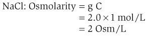

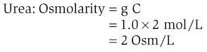

각 용액의 삼투압은 2 Osm/L입니다. 즉, 등삼투성입니다.

**2단계.** 용액이 등장성인지 확인하려면 각 용액의 유효 삼투압을 확인해야 합니다. 37°C(310K)에서 RT = 25.45 L-atm/mol이라고 가정합니다. 따라서,

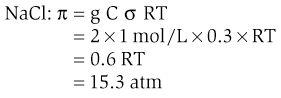

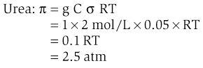

두 용액의 계산된 삼투압은 동일하고 등삼투성(1단계)이지만 유효 삼투압은 다르며 등장성이 아닙니다(2단계). 이러한 차이는 NaCl의 반사 계수가 요소의 반사 계수보다 훨씬 높기 때문에 발생하며, 따라서 NaCl은 더 큰 *유효한* 삼투압을 생성합니다. 물은 요소 용액에서 NaCl 용액으로, 저장성 용액에서 고장성 용액으로 흐릅니다.

### 확산 잠재력과 평형 잠재력

#### 이온 채널

이온 채널은 열릴 때 특정 이온의 통과를 허용하는 막에 걸쳐 있는 필수 단백질입니다. 따라서 이온 채널은 **선택적**이며 특정 특성을 가진 이온이 통과하도록 허용합니다. 이 선택성은 채널의 크기와 채널에 들어있는 전하에 따라 결정됩니다. 예를 들어, 음전하가 늘어선 채널은 일반적으로 양이온의 통과를 허용하지만 음이온은 제외합니다. 양전하를 띤 채널은 음이온은 통과시키지만 양이온은 통과시키지 않습니다. 채널은 또한 크기에 따라 차별됩니다. 예를 들어, 음전하로 늘어선 양이온 선택 채널은 Na+의 통과를 허용하지만 K+는 제외할 수 있습니다. 또 다른 양이온 선택 채널(예: 모터 끝판의 니코틴 수용체)은 선택성이 낮고 여러 가지 작은 양이온의 통과를 허용할 수 있습니다.

이온 채널은 **게이트**에 의해 제어되며, 게이트의 위치에 따라 채널이 열리거나 닫힐 수 있습니다. 채널이 열리면 선택적인 이온이 수동 확산을 통해 기존 전기화학적 구배를 따라 채널을 통해 흐를 수 있습니다. 채널이 닫히면 전기화학적 구배의 크기에 관계없이 이온이 채널을 통해 흐를 수 없습니다. 채널의 **컨덕턴스**는 채널이 열려 있을 확률에 따라 달라집니다. 채널이 열려 있을 확률이 높을수록 전도도나 투자율도 높아집니다.

이온 채널의 게이트는 세 가지 유형의 **센서**에 의해 제어됩니다. 한 가지 유형의 게이트에는 막 전위(예: 전압 개폐 채널)의 변화에 ​​반응하는 센서가 있습니다. 두 번째 유형의 게이트는 신호 분자(즉, 두 번째 메신저 게이트 채널)의 변화에 ​​반응합니다. 세 번째 유형의 게이트는 호르몬이나 신경 전달 물질(즉, 리간드 개폐 채널)과 같은 리간드의 변화에 ​​반응합니다.

 **전압 개폐 채널**에는 막 전위의 변화에 ​​의해 제어되는 게이트가 있습니다. 예를 들어, 신경 Na**+**채널**의 **활성화 관문은 신경 세포막의 탈분극에 의해 *열립니다*. 이 채널이 열리면 활동 전위가 상승합니다. 흥미롭게도 Na+ 채널의 또 다른 게이트인 **비활성화 게이트**는 탈분극에 의해 *닫혀* 있습니다. 활성화 게이트는 비활성화 게이트보다 탈분극에 더 빠르게 반응하기 때문에 Na+ 채널이 먼저 열리고 닫힙니다. 두 게이트의 반응 시간 차이는 활동 전위의 모양과 시간 경과를 설명합니다.

 **두 번째 메신저 게이트 채널**에는 고리형 아데노신 일인산(고리형 AMP) 또는 이노시톨 1,4,5-삼인산(IP3)과 같은 세포내 신호 분자 수준의 변화에 ​​의해 제어되는 게이트가 있습니다. 따라서 이러한 게이트에 대한 센서는 이온 채널의 세포내 쪽에 있습니다. 예를 들어, 심장동방결절의 Na+ 채널의 문은 증가된 세포내 순환 AMP에 의해 열립니다.

 **리간드 개폐 채널**에는 호르몬과 신경 전달 물질에 의해 제어되는 관문이 있습니다. 이러한 게이트의 센서는 이온 채널의 세포외 쪽에 위치합니다. 예를 들어, **모터 엔드 플레이트**에 있는 **니코틴 수용체**는 실제로 아세틸콜린(ACh)이 결합할 때 열리는 이온 채널입니다. 열려 있으면 Na+ 및 K+ 이온이 투과됩니다.

#### 확산 가능성

확산 전위는 전하를 띤 용질(이온)이 농도 구배에 따라 확산될 때 막을 통해 생성되는 전위차입니다. 따라서 **확산 전위는 이온 확산에 의해 발생합니다.** 따라서 확산 전위는 막이 해당 이온을 투과할 수 있는 경우 *만* 생성될 수 있습니다. 또한, 막이 이온을 투과할 수 없으면 농도 구배가 아무리 커도 확산 전위가 생성되지 않습니다.

밀리볼트(mV)로 측정되는 확산 전위의 **크기**는 농도 구배의 크기에 따라 달라지며, 농도 구배가 원동력이 됩니다. 확산 전위의 **부호**는 확산 이온의 전하에 따라 달라집니다. 마지막으로, 언급한 바와 같이, 확산 전위는 단지 몇 개의 이온의 이동에 의해 생성되며, 이는 벌크 용액의 이온 농도 변화를 일으키지 않습니다.

#### 평형 잠재력

평형 전위 개념은 단순히 확산 전위 개념의 확장입니다. 막을 가로지르는 이온의 농도 차이가 있고 막이 해당 이온을 투과할 수 있으면 전위차(확산 전위)가 생성됩니다. 결국 이온의 순 확산은 느려지고 전위차로 인해 중단됩니다. 즉, 양이온이 농도 구배에 따라 확산되면 막을 통해 양전하를 운반하여 양이온의 추가 확산을 지연시키고 결국 중단시킵니다. 음이온이 농도 구배에 따라 확산되면 음전하를 띠게 되어 음이온의 확산이 지연되고 중단됩니다. **평형 잠재력**은 농도 차이에 따라 확산 경향이 정확히 균형을 이루거나 반대되는 확산 잠재력입니다. **전기화학적 평형**에서는 이온에 작용하는 화학적 및 전기적 추진력이 동일하고 반대이며 더 이상 순 확산이 발생하지 않습니다.

확산 양이온과 확산 음이온의 다음 예는 평형 전위와 전기화학적 평형의 개념을 보여줍니다.

##### *Na+ 평형 전위의 예*

[그림 1-11](#filepos112876)은 Na+에는 투과되지만 Cl-에는 투과되지 않는 이론적인 막으로 분리된 두 개의 용액을 보여줍니다. NaCl 농도는 용액 2보다 용액 1에서 더 높습니다. 투과 이온인 Na+는 용액 1에서 용액 2로 농도 구배에 따라 확산되지만 비침투성 이온 Cl-는 이를 동반하지 않습니다. 용액 2로의 양전하의 순 이동의 결과로 **Na+ 확산 전위**가 발생하고 용액 2는 용액 1에 비해 양이 됩니다. 용액 2의 양성은 Na+의 추가 확산에 반대되며 결국에는 추가 순 확산을 방지할 만큼 충분히 커집니다. Na+가 농도 구배에 따라 확산되는 경향의 균형을 정확히 맞추는 전위차가 **Na+ 평형 전위**입니다. Na+에 대한 화학적 및 전기적 추진력이 동일하고 반대일 때 Na+는 **전기화학적 평형** 상태에 있다고 합니다. 확산 전위를 생성하기에 충분한 *몇 가지* Na+ 이온의 확산은 벌크 용액에서 Na+ 농도에 어떠한 변화도 일으키지 않습니다.

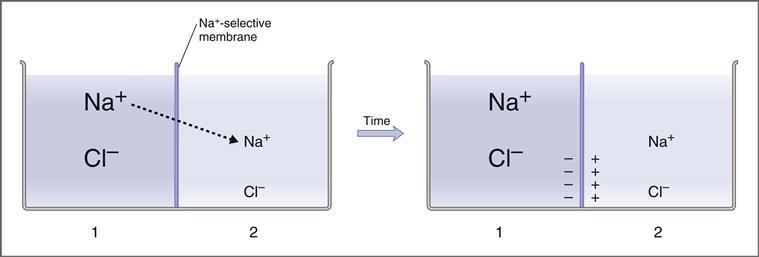

**그림 1–11 Na+ 확산 잠재력의 생성.**

##### *Cl− 평형 전위의 예*

[그림 1-12](#filepos114402)는 [그림 1-11](#filepos112876)과 동일한 솔루션 쌍을 보여준다. 그러나 [그림 1-12](#filepos114402)에서 이론적 막은 Na+가 아닌 Cl-에 투과성을 갖는다. Cl−는 농도 구배에 따라 용액 1에서 용액 2로 확산되지만 Na+는 동반되지 않습니다. 확산 전위가 확립되고 용액 2는 용액 1에 비해 음수가 됩니다. 농도 구배에 따라 확산되는 Cl-의 경향과 정확하게 균형을 이루는 전위차는 **Cl- 평형 전위입니다.** Cl-에 대한 화학적 및 전기적 추진력이 동일하고 반대일 때 Cl-는 **전기화학적 평형**에 있습니다. 다시 말하지만, 이러한 몇 가지 Cl- 이온의 확산은 벌크 용액의 Cl- 농도를 변화시키지 않습니다.

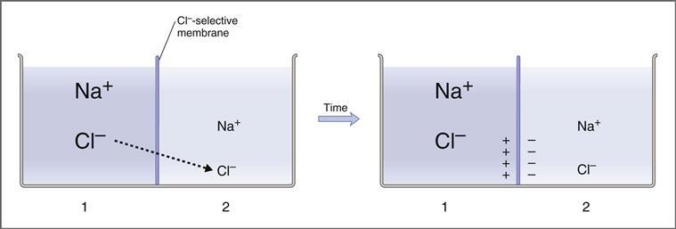

**그림 1–12 Cl- 확산 전위의 생성.**

#### 네른스트 방정식

Nernst 방정식은 막이 해당 이온에 대해 투과성이라는 가정 하에 막 전체에 걸쳐 주어진 농도 차이에서 이온의 평형 전위를 계산하는 데 사용됩니다. 정의에 따르면 평형 전위는 *한 번에 하나의 이온*에 대해 계산됩니다. 따라서,

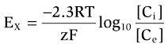

어디서

|  |  |
| --- | --- |
| EX | = 주어진 이온에 대한 평형 전위(mV), X |
| 이미지 | = 상수(37°C에서 60mV) |
| z | = 이온의 전하(Na+의 경우 +1, Ca2+의 경우 +2, Cl−의 경우 −1) |
| 시 | = X의 세포내 농도(mmol/L) |
| Ce | = X의 세포외 농도(mmol/L) |

즉, Nernst 방정식은 이온의 농도 차이를 전압으로 변환합니다. 이 변환은 다양한 상수에 의해 수행됩니다. R은 기체 상수, T는 절대 온도, F는 패러데이 상수입니다. 2.3을 곱하면 자연 로그가 log10으로 변환됩니다.

관례적으로, *막 전위는 세포외 전위에 대한 세포내 전위로 표현됩니다.* 따라서 -70mV의 막횡단 전위차는 70mV(세포 내부 음성)를 의미합니다.

이전에 설명한 대로 계산하고 세포막 전체의 일반적인 농도 구배를 가정하여 공통 이온의 평형 전위에 대한 일반적인 값은 다음과 같습니다.

ENa+ = +65mV

ECa2+ = +120mV

EK+ = -85mV

ECl– = –90mV

휴지막 전위와 활동 전위의 개념을 고려할 때 이러한 값을 염두에 두는 것이 유용합니다.

**예제 문제.** *세포 내 [Ca2+]가 10−7 mol/L이고 세포 외 [Ca2+]가 2 × 10−3 mol/L인 경우, 세포막을 가로지르는 전위차는 얼마에서 Ca2+가 전기화학적 평형 상태에 있게 됩니까?* 체온(37°C)에서 2.3RT/F = 60 mV라고 가정합니다.

**해결책.** 질문을 제기하는 또 다른 방법은 Ca2+가 유일한 투과 이온인 경우 막을 가로지르는 농도 구배를 고려할 때 막 전위가 얼마인지 묻는 것입니다. Ca2+는 2가이므로 z = +2라는 것을 기억하세요. 따라서,

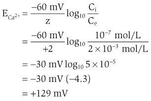

이는 로그 함수이기 때문에 분자에 어떤 농도가 들어가는지 기억할 필요가 없습니다. 간단히 129mV에 도달하도록 계산을 완료한 다음 직관적인 접근 방식으로 올바른 부호를 결정합니다. 직관적인 접근 방식은 [Ca2+]가 ICF보다 ECF에서 훨씬 높기 때문에 Ca2+가 ECF에서 ICF로 농도 구배를 확산시켜 세포 내부를 양성으로 만드는 경향이 있다는 지식에 달려 있습니다. 따라서 Ca2+는 막 전위가 +129 mV(세포 내부 양성)일 때 전기화학적 평형 상태에 있게 됩니다.

평형 전위는 Ca2+ 이온에 대해 주어진 농도 구배에서 계산되었습니다. 농도 구배가 다르면 계산된 평형 전위도 달라집니다.

#### 추진력

전하를 띠지 않은 용질을 다룰 때 순 확산의 원동력은 단순히 세포막을 통과하는 용질의 농도 차이입니다. 그러나 전하를 띤 용질(즉, 이온)을 처리할 때 순 확산의 추진력은 농도 차이와 세포막 전체의 전위차를 모두 고려해야 합니다.

특정 이온에 대한 **구동력**은 실제 측정된 막 전위(Em)와 이온의 계산된 평형 전위(EX) 간의 차이입니다. 즉, Em과 해당 이온이 "좋아하는" 막 전위(Nernst 방정식으로 계산된 평형 전위) 간의 차이입니다. 따라서 주어진 이온 X에 대한 추진력은 다음과 같이 계산됩니다.

순 추진력(mV) = Em – Ex

어디서

|  |  |
| --- | --- |
| 원동력 | = 구동력(mV) |
| 엠 | = 실제 막 전위(mV) |
| EX | = X의 평형 전위(mV) |

구동력이 음수일 때(즉, Em이 이온의 평형 전위보다 더 음수임), 이온 X가 양이온이면 세포 안으로 들어가고 음이온이면 세포를 떠납니다. 즉, 이온 X는 막 전위가 너무 음수라고 "생각"하고 세포막을 가로질러 적절한 방향으로 확산함으로써 막 전위를 평형 전위로 가져오려고 합니다. 반대로 추진력이 양수인 경우(Em은 이온의 평형 전위보다 더 양수임), 이온 X가 양이온이면 세포를 떠나고 음이온이면 세포 안으로 들어갑니다. 이 경우 이온 X는 막 전위가 너무 양수라고 "생각"하고 세포막을 가로질러 적절한 방향으로 확산함으로써 막 전위를 평형 전위로 가져오려고 합니다. 마지막으로, Em이 이온의 평형 전위와 같으면 이온에 대한 추진력은 0이고 이온은 정의에 따라 전기화학적 평형 상태에 있습니다.

#### 이온 전류

**이온 전류(IX)** 또는 전류 흐름은 세포막을 가로질러 이온이 이동할 때 발생합니다. 이온은 두 가지 조건이 충족될 때 이온 채널을 통해 세포막을 가로질러 이동합니다. (1) 이온에 추진력이 있고 (2) 막에 해당 이온에 대한 전도도가 있습니다(즉, 이온 채널이 열려 있음). 따라서,

Ix = Gx(Em – Ex)

어디에

|  |  |
| --- | --- |
| 9 | = 이온 전류(mAmps) |
| GX | = 이온 컨덕턴스(1/ohms), 여기서 컨덕턴스는 저항의 역수 |
| 엠 - EX | = 이온에 대한 추진력 X(mV) |

이온 전류 방정식은 단순히 옴의 법칙을 재배열한 것입니다. 여기서 V = IR 또는 I = V/R(V는 E와 동일함)입니다. 컨덕턴스(G)는 저항(R)의 역수이므로 I = G × V입니다.

**이온 전류의 방향**은 이전 섹션에서 설명한 것처럼 추진력의 방향에 따라 결정됩니다. **이온 전류의 크기**는 구동력의 크기와 컨덕턴스에 따라 결정됩니다. 주어진 컨덕턴스에 대해 구동력이 클수록 전류 흐름도 커집니다. 주어진 구동력에 대해 컨덕턴스가 클수록 전류 흐름도 커집니다. 마지막으로, 이온의 구동력이나 전도도가 0이면 해당 이온이 세포막을 통과하여 확산될 수 없고 전류 흐름도 없습니다.

### 막 잠재력 휴식

휴지기 막 전위는 활동 전위 사이의 기간(즉, 휴지 상태)에 신경, 근육 등 흥분성 세포의 막을 가로질러 존재하는 전위차입니다. 앞서 언급한 바와 같이, 막전위를 표현할 때 세포내 전위를 세포외 전위로 지칭하는 것이 일반적입니다.

휴지막 전위는 세포막을 가로지르는 다양한 이온의 농도 차이로 인해 발생하는 확산 전위에 의해 확립됩니다. (이러한 농도 차이는 1차 및 2차 능동 수송 메커니즘에 의해 확립되었음을 기억하십시오.) *각 투과 이온은 자신의 평형 전위를 향해 막 전위를 유도하려고 시도합니다.* 정지 상태에서 투과도 또는 전도도가 가장 높은 이온은 정지 막 전위에 가장 큰 기여를 하며, 투과도가 가장 낮은 이온은 거의 또는 전혀 기여하지 않습니다.

흥분성 세포의 휴지 막 전위는 **-70 ~ -80mV** 범위에 속합니다. 이 값은 세포막의 상대 투과성 개념으로 가장 잘 설명될 수 있습니다. 따라서, 정지 막 전위는 정지 상태의 이들 이온에 대한 투과성이 높기 때문에 K+ 및 Cl-의 평형 전위에 *가깝습니다*. 정지 막 전위는 정지 상태의 이온에 대한 투과성이 낮기 때문에 Na+ 및 Ca2+의 평형 전위와 *거리가 멀습니다*.

각 이온이 막 전위에 미치는 영향을 평가하는 한 가지 방법은 상대 전도도로 각 이온의 평형 전위(Nernst 방정식으로 계산)에 가중치를 부여하는 **현 전도도 방정식**을 사용하는 것입니다. 전도도가 가장 높은 이온은 막 전위를 평형 전위 쪽으로 유도하는 반면, 전도도가 낮은 이온은 막 전위에 거의 영향을 미치지 않습니다. (동일한 질문에 대한 또 다른 접근 방식은 **골드만 방정식**을 적용합니다. 이 방정식은 컨덕턴스가 아닌 상대 투자율로 각 이온의 기여도를 고려합니다.) 현 컨덕턴스 방정식은 다음과 같이 작성됩니다.

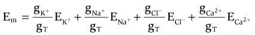

어디서

|  |  |
| --- | --- |
| 엠 | = 막 전위(mV) |
| gK+ 등 | = K+ 컨덕턴스 등(mho, 저항의 역수) |
| gT | = 총 컨덕턴스(mho) |
| EK+ 등 | = K+ 평형전위 등(mV) |

휴식 상태에서 흥분성 세포의 막은 Na+와 Ca2+보다 K+와 Cl-에 훨씬 더 투과성이 있습니다. 이러한 투과성의 차이는 정지 막 전위를 설명합니다.

*Na*+*-K*+*ATPase가 휴지 막 전위를 생성하는 데 어떤 역할을 합니까?* 대답은 두 부분으로 구성됩니다. 첫째, Na+-K+ ATPase의 작은 *직접적인* 전기적 기여가 있는데, 이는 세포 안으로 펌핑되는 2개의 K+ 이온마다 세포 밖으로 펌핑되는 3개의 Na+ 이온의 화학량론에 기초합니다. 둘째, 더 중요한 *간접적인* 기여는 세포막 전체에 걸쳐 K+의 농도 구배를 유지하는 것인데, 이는 K+ 평형 전위로 막 전위를 유도하는 K+ 확산 전위를 담당합니다. 따라서 Na+-K+ ATPase는 휴지 막 전위를 확립하는 K+ 농도 구배를 생성하고 유지하는 데 필요합니다. (활동 전위의 상승에서 Na+-K+ ATPase의 역할에 대해서도 비슷한 주장이 있을 수 있으며, 여기서 Na+에 대한 이온 구배를 세포막을 통해 유지합니다.)

### 활동 가능성

활동전위는 신경, 근육 등 흥분성 세포의 현상으로, 급격한 탈분극(상향운동)과 이어서 막전위의 재분극으로 구성됩니다. 활동 전위는 신경계와 모든 유형의 근육에서 정보를 전달하는 기본 메커니즘입니다.

#### 용어

활동 전위, 불응 기간 및 활동 전위 전파를 논의하기 위해 다음 용어가 사용됩니다.

 **탈분극**은 막 전위를 *덜 음전위*로 만드는 과정입니다. 언급한 바와 같이, 흥분성 세포의 일반적인 휴지 막 전위는 세포 내부 음전위를 향합니다. 탈분극은 세포 내부의 음성을 덜 부정적으로 만들거나 세포 내부를 양성으로 만들 수도 있습니다. 막 전위의 변화는 용어가 모호하므로 "증가" 또는 "감소"로 설명해서는 안 됩니다. (예를 들어, 막전위가 탈분극되거나 음이 덜해지면 막전위가 증가했습니까, 감소했습니까?)

 **과분극**은 막 전위를 *더 음으로* 만드는 과정입니다. 탈분극과 마찬가지로 "증가" 또는 "감소"라는 용어는 막 전위를 더 음으로 만드는 변화를 설명하는 데 사용되어서는 안 됩니다.

 **내부 전류**는 양전하가 셀로 흐르는 흐름입니다. 따라서 내부 전류는 막 전위를 *탈분극*합니다. 내부 전류의 예는 활동 전위가 상승하는 동안 세포 내로 Na+가 흐르는 것입니다.

 **외부 전류**는 전지 밖으로 양전하가 흐르는 흐름입니다. 외부 전류는 막 전위를 *과분극화*합니다. 외부 전류의 예는 활동 전위의 재분극 단계 동안 세포 밖으로 K+가 흐르는 것입니다.

 **역치전위**는 활동전위 발생이 불가피한 막전위입니다. 역치 전위는 휴지 막 전위보다 음수가 적기 때문에 막 전위를 역치까지 탈분극하려면 내부 전류가 필요합니다. 역치 전위에서 순 내부 전류(예: 내부 Na+ 전류)는 순 외부 전류(예: 외부 K+ 전류)보다 커지고 결과적인 탈분극은 스스로 유지되어 활동 전위의 상승을 초래합니다. 순 내부 전류가 순 외부 전류보다 작으면 막은 역치까지 탈분극되지 않으며 활동 전위가 발생하지 않습니다(모두 아니면 전무 반응 참조).

 **오버슈트**는 막 전위가 양성인 활동 전위 부분(세포 내부 양성)입니다.

 **Undershoot** 또는 **과분극 후전위**는 재분극 이후의 활동 전위 부분으로, 막 전위가 정지 상태보다 실제로 더 음수입니다.

 **불응기**는 흥분성 세포에서 또 다른 정상적인 활동 전위가 유도될 수 없는 기간입니다. 불응 기간은 절대적이거나 상대적일 수 있습니다.

#### 활동전위의 특성

활동전위는 전형적인 크기와 모양, 전파, 전부 아니면 전무 반응이라는 세 가지 기본 특성을 가지고 있습니다.

 **정형적인 크기 및 모양.** 주어진 세포 유형에 대한 각각의 *정상* 활동 전위는 동일해 보이고, 동일한 전위로 탈분극되고, 동일한 휴지 전위로 다시 재분극됩니다.

 **전파.** 한 부위의 활동 전위는 인접한 부위에서 탈분극을 유발하여 인접한 부위를 역치 수준으로 만듭니다. 한 부위에서 다음 부위로의 활동 전위 전파는 *비감소적입니다.*

 **전부 아니면 전무 반응.** 활동전위는 발생하거나 발생하지 않습니다. 흥분성 세포가 *정상적인* 방식으로 역치까지 탈분극되면 활동 전위의 발생은 불가피합니다. 반면, 막이 역치까지 탈분극되지 않으면 활동 전위가 발생할 수 없습니다. 실제로 불응기 동안 자극이 가해지면 활동 전위가 발생하지 않거나 활동 전위가 발생하지만 전형적인 크기와 모양을 갖지 않습니다.

#### 활동 전위의 이온 기반

활동전위는 빠른 탈분극(상승)과 이어서 휴지 막전위로 다시 재분극되는 것입니다. [그림 1-13](#filepos135174)은 신경과 골격근의 활동전위가 다음과 같은 단계로 일어나는 현상을 나타낸 것이다.

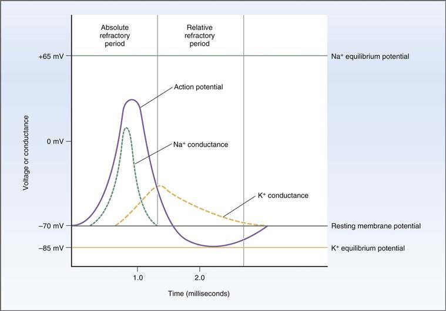

**그림 1–13 신경 활동 전위 동안의 전압 및 전도도 변화의 시간 경과.**

1. **휴지 막 전위.** 정지 시 막 전위는 약 -70mV(세포 내부 음성)입니다. **K+ 전도도 또는 투과성이 높고** ​​K+ 채널이 거의 완전히 열려 K+ 이온이 기존 농도 구배에 따라 세포 밖으로 확산될 수 있습니다. 이 확산은 K+ 확산 전위를 생성하여 막 전위를 K+ 평형 전위로 유도합니다. Cl-(표시되지 않음)에 대한 컨덕턴스도 높으며 정지 상태에서 Cl- 역시 전기화학적 평형에 가깝습니다. 정지 상태에서는 **Na+ 전도도가 낮기 때문에**, 정지 막 전위는 Na+ 평형 전위와는 거리가 멀습니다.
2. **활동 전위의 상승.** 일반적으로 이웃 부위의 활동 전위에서 확산된 전류의 결과인 내부 전류는 신경 세포막의 역분극을 유발하며 이는 약 -60mV에서 발생합니다. 이러한 초기 탈분극은 Na+ 채널의 **활성화 게이트**를 빠르게 열게 하며, Na+ 전도도는 즉시 증가하여 K+ 전도도보다 더욱 높아집니다([그림 1-14](#filepos135174)). Na+ 전도도가 증가하면 **내부로 Na+ 전류**가 발생하고, 막 전위는 +65mV의 Na+ 평형 전위를 향해 더 탈분극되지만 완전히 도달하지는 않습니다. **테트로도톡신**(일본 복어의 독소)과 국소 마취제인 **리도카인**은 이러한 전압에 민감한 Na+ 채널을 차단하고 신경 활동 전위의 발생을 방지합니다.

   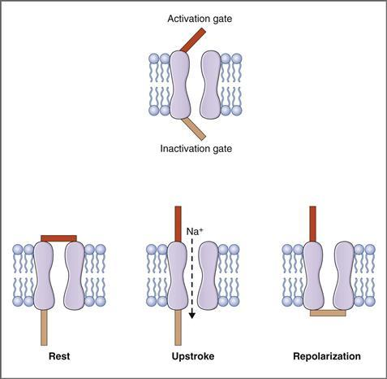

   **그림 1–14 신경 Na+ 채널의 활성화 및 비활성화 게이트 기능.**
   정지 상태에서는 활성화 게이트가 닫히고 비활성화 게이트가 열립니다. 활동전위가 상승하는 동안 두 문은 모두 열리고 Na+는 전기화학적 전위 구배를 따라 세포 안으로 흘러 들어갑니다. 재분극 동안 활성화 게이트는 열려 있지만 비활성화 게이트는 닫혀 있습니다.

   *이 위치에는 현재 귀하의 장치에서 지원되지 않는 비디오 콘텐츠가 있습니다. 이 콘텐츠의 캡션은 아래에 표시됩니다.*

   **동영상: 활동 잠재력**
3. **활동 전위의 재분극.** 두 가지 사건의 결과로 상승 스트로크가 종료되고 막 전위가 휴지 수준으로 재분극됩니다. 첫째, Na+ 채널의 비활성화 게이트는 닫힘으로써 탈분극에 반응하지만 그 반응은 활성화 게이트가 열리는 것보다 느립니다. 따라서 지연 후 **비활성화 게이트**는 Na+ 채널을 닫고 상승 행정을 종료합니다. 둘째, 탈분극은 K+ 채널을 열고 K+ 전도도를 정지 상태에서 발생하는 것보다 훨씬 높은 값으로 증가시킵니다. Na+ 채널이 닫히고 K+ 채널이 더 크게 열리는 결합 효과로 인해 K+ 전도도가 Na+ 전도도보다 훨씬 높아집니다. 따라서 **외부로 향하는 K+ 전류**가 발생하고 막이 재분극됩니다. **테트라에틸암모늄**(**TEA**)은 이러한 전압 개폐 K+ 채널, 외부 K+ 전류 및 재분극을 차단합니다.
4. **과분극 후전위(미만).** 재분극 후 짧은 기간 동안 K+ 전도도는 정지 상태보다 높으며 막 전위는 K+ 평형 전위에 훨씬 더 가깝게 이동합니다(과분극 후전위). 결국 K+ 전도도는 휴지 수준으로 돌아가고 막 전위는 약간 탈분극되어 휴지 막 전위로 돌아갑니다. 이제 막은 자극을 받으면 또 다른 활동전위를 생성할 준비가 되었습니다.

#### 신경 Na+ 채널

전압 개폐 Na+ 채널은 신경과 골격근의 활동 전위 상승을 담당합니다. 이 채널은 큰 α 소단위와 두 개의 β 소단위로 구성된 통합 막 단백질입니다. α 하위단위에는 4개의 도메인이 있으며, 각 도메인에는 6개의 막횡단 α-나선이 있습니다. 막횡단 α-나선의 반복은 Na+ 이온이 흐를 수 있는 중앙 기공을 둘러싸고 있습니다(채널의 게이트가 열려 있는 경우). 활성화 및 비활성화 게이트의 기능을 보여주는 Na+ 채널의 개념적 모델은 [그림 1-14](#filepos137409)에 나와 있습니다. 이 모델의 기본 가정은 Na+가 채널을 통해 이동하려면 *채널의 두 게이트가 모두 열려 있어야 한다는 것입니다.* 이러한 게이트가 탈분극에 어떻게 반응하는지 기억해 보세요. 활성화 게이트는 빠르게 열리고 비활성화 게이트는 시간 지연 후에 닫힙니다.

1. **휴식** 상태에서는 활성화 게이트가 닫힙니다. 비활성화 게이트가 열려 있더라도(막 전위가 과분극되어 있기 때문에) Na+는 채널을 통해 이동할 수 없습니다.
2. **활동 전위가 상승**하는 동안 역치까지의 탈분극은 활성화 게이트를 빠르게 엽니다. 비활성화 게이트는 활성화 게이트보다 더 느리게 탈분극에 반응하기 때문에 여전히 열려 있습니다. 따라서 두 문이 잠시 열려 있고 Na+가 채널을 통해 세포로 흘러 들어가 추가 탈분극(상향 행정)을 일으킬 수 있습니다.
3. **활동전위의 정점**에서 느린 비활성화 게이트가 마침내 반응하여 닫히고 채널 자체가 닫힙니다. 재분극이 시작됩니다. 막 전위가 휴지 수준으로 다시 재분극되면 활성화 게이트는 닫히고 비활성화 게이트는 원래 위치에서 열립니다.

#### 불응 기간

불응기 동안 흥분성 세포는 정상적인 활동 전위를 생성할 수 *불가능*합니다([그림 1-13](#filepos137409) 참조). 불응기는 절대 불응기와 상대 불응기를 포함한다([박스 1-2](#filepos142794)).

**상자 1-2 임상 생리학: 근육 약화를 동반한 고칼륨혈증**

> **사례 설명.** 인슐린 의존형 당뇨병을 앓고 있는 48세 여성이 심각한 근육 약화를 겪고 있다고 의사에게 보고했습니다. 그녀는 베타-아드레날린 차단제인 프로프라놀롤로 고혈압 치료를 받고 있습니다. 그녀의 의사는 즉시 혈액 검사를 지시했는데, 그 결과 혈청 [K+]가 6.5mEq/L(정상, 4.5mEq/L)이고 BUN(혈액 요소 질소)이 증가한 것으로 나타났습니다. 의사는 프로프라놀롤의 복용량을 줄이고 결국 약물을 중단합니다. 그는 그녀의 인슐린 복용량을 조정합니다. 며칠 내에 환자의 혈청 [K+]은 4.7mEq/L로 감소했으며 근력이 정상으로 돌아왔다고 보고했습니다.

> **사례 설명.** 이 당뇨병 환자는 여러 요인으로 인해 심각한 고칼륨혈증을 앓고 있습니다. (1) 인슐린 투여량이 충분하지 않기 때문에 적절한 인슐린 부족으로 인해 K+가 세포에서 혈액으로 이동되었습니다(인슐린은 K+ 세포 내 흡수를 촉진합니다). (2) 여성의 고혈압 치료에 사용되는 베타 차단제인 프로프라놀롤도 K+를 세포에서 혈액으로 이동시킵니다. (3) BUN의 상승은 여성에게 신부전이 발생하고 있음을 나타냅니다. 그녀의 기능이 저하된 신장은 혈액에 축적되는 여분의 K+를 배설할 수 없습니다. 이러한 메커니즘에는 신장 생리학 및 내분비 생리학과 관련된 개념이 포함됩니다.

> 이 여성의 혈중 [K+] 수치가 심하게 상승(고칼륨혈증)했으며 근육 약화가 이러한 고칼륨혈증으로 인해 발생한다는 점을 이해하는 것이 중요합니다. 이러한 약점의 원인은 다음과 같이 설명할 수 있습니다. 근육 세포의 휴지기 막 전위는 세포막을 가로지르는 K+의 농도 구배에 의해 결정됩니다(Nernst 방정식). 휴식 상태에서 세포막은 K+에 대한 투과성이 매우 높으며 K+는 농도 구배에 따라 세포 밖으로 확산되어 K+ 확산 전위를 생성합니다. 이 K+ 확산 전위는 세포 내부 음성인 휴지 막 전위의 원인입니다. K+ 농도 구배가 클수록 세포의 음성성이 커집니다. 혈액[K+]이 상승하면 세포막을 가로지르는 농도 구배가 정상보다 낮습니다. 따라서 휴지 막 전위는 덜 음(즉, 탈분극)이 됩니다.

> 휴식기 막 전위가 역치에 더 가까워지기 때문에 이러한 탈분극으로 인해 근육에서 활동 전위가 생성되기가 더 쉬워질 것으로 예상할 수 있습니다. 그러나 탈분극의 더 중요한 효과는 Na+ 채널의 비활성화 게이트를 닫는 것입니다. 이러한 비활성화 게이트가 닫히면 활성화 게이트가 열려 있어도 활동 전위가 생성되지 않습니다. 근육에 활동전위가 없으면 수축이 일어날 수 없습니다.

> **치료.** 이 환자의 치료는 여성의 인슐린 용량을 늘리고 프로프라놀롤을 중단하여 K+를 세포 내로 다시 이동시키는 것을 기반으로 합니다. 여성의 혈액[K+]을 정상 수준으로 줄임으로써 골격근 세포의 휴지기 막 전위가 정상으로 돌아가고 Na+ 채널의 불활성화 관문이 휴지기 막 전위에서 열려 정상적인 활동 전위가 발생할 수 있습니다.

##### *절대 불응 기간*

절대 불응 기간은 활동 전위의 거의 전체 기간과 겹칩니다. 이 기간 동안에는 자극이 아무리 커도 다른 활동전위가 유발되지 않습니다. 절대 불응 기간의 기본은 탈분극에 대한 반응으로 Na+ 채널의 비활성화 게이트가 닫히는 것입니다. 이러한 비활성화 게이트는 세포가 휴지 막 전위로 다시 재분극될 때까지 닫힌 위치에 있습니다([그림 1-14](#filepos135174) 참조).

##### *상대 불응 기간*

상대 불응기는 절대 불응기가 끝날 때 시작되며 주로 과분극 후전위 기간과 겹칩니다. 이 기간 동안 활동 전위가 유도될 수 있지만 이는 일반적인 탈분극(내부) 전류보다 더 큰 전류가 적용되는 경우에만 가능합니다. 상대 불응 기간의 기초는 정지 상태에 있는 K+ 전도도보다 더 높다는 것입니다. 막 전위가 K+ 평형 전위에 더 가깝기 때문에 다음 활동 전위가 시작될 수 있도록 막을 임계값으로 가져오려면 더 많은 내부 전류가 필요합니다.