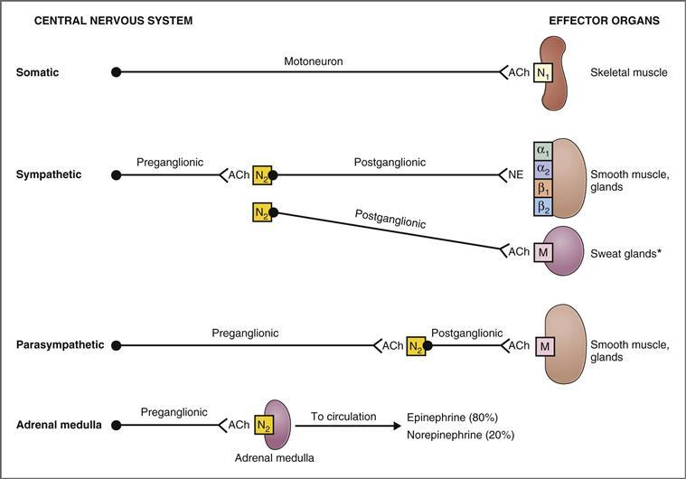
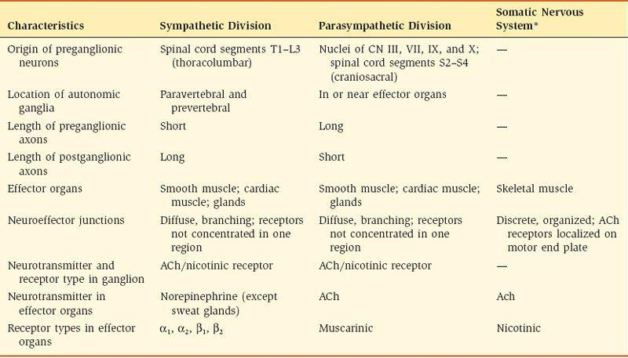
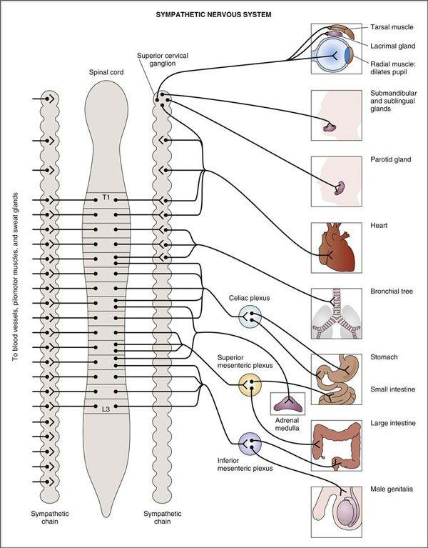
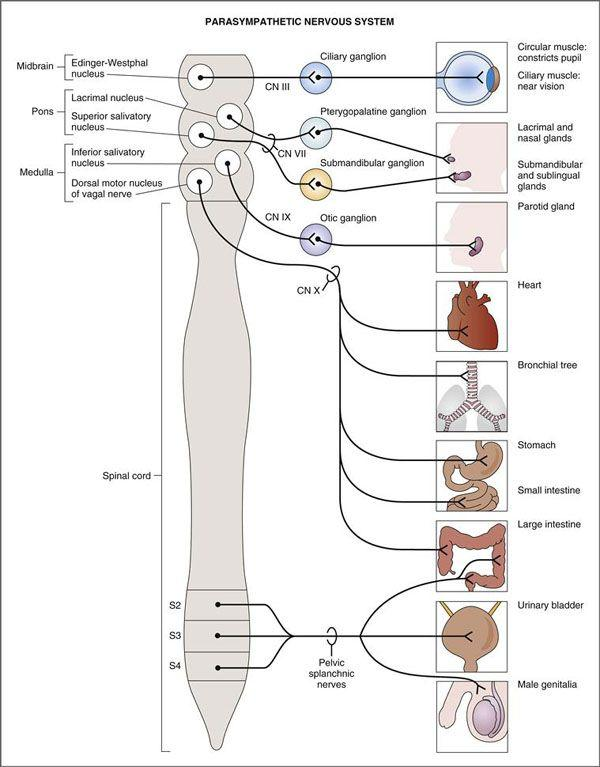
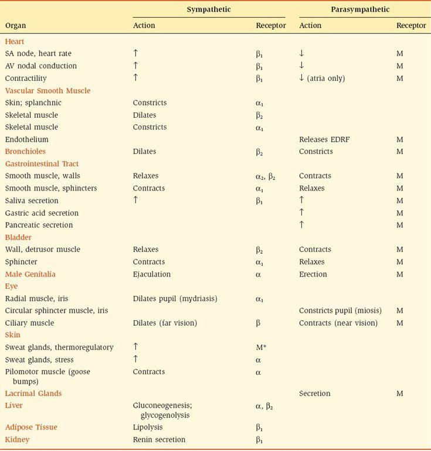
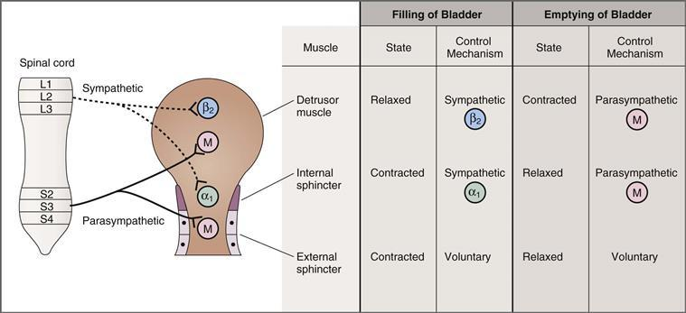
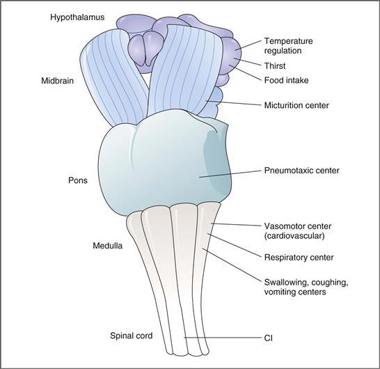
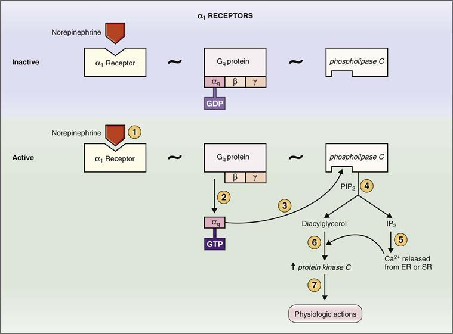
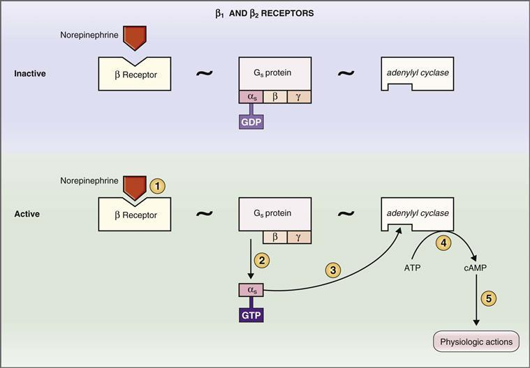
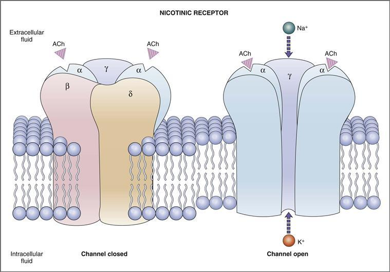

# 2 Autonomic Nervous System

xml 버전='1.0' 인코딩='utf-8'?

생리학

## *자율신경계*

> [자율신경계의 구성과 일반적인 특징](#filepos256345)

> [자율수용체](#filepos302177)

> [요약](#filepos333933)

> [도전하세요](#filepos336895)

운동(원심성) 신경계는 체성 신경계와 자율 신경계의 두 가지 구성 요소로 구성됩니다. 이 두 시스템은 여러 면에서 다르지만 주로 신경을 공급하는 효과 기관의 유형과 제어하는 ​​기능의 유형으로 구별됩니다.

**체신경계**는 의식적으로 제어되는 **자발적** 운동 시스템입니다. 각각의 경로는 단일 운동뉴런과 이것이 신경을 분포시키는 골격근 섬유로 구성됩니다. 운동뉴런의 세포체는 중추신경계(CNS)의 뇌간이나 척수에 위치하며, 축색돌기는 작동 기관인 골격근에 직접 시냅스됩니다. 신경전달물질인 아세틸콜린(ACh)은 운동뉴런의 시냅스전 말단에서 방출되어 골격근의 운동 말단판에 위치한 니코틴 수용체를 활성화합니다. 운동뉴런의 활동 전위는 근육 섬유의 활동 전위를 유발하여 근육을 수축시킵니다. (체신경계에 대한 자세한 내용은 [1장](CR%21G9RE0KW4PD33Q9F3DXNCSBNXCANP_split_007.html#filepos27757)을 참조하세요.)

**자율신경계**는 주로 내장 기관의 기능을 제어하고 조절하는 **불수의** 시스템입니다. 자율신경계의 각 경로는 두 개의 뉴런, 즉 신경절 이전 뉴런과 신경절 이후 뉴런으로 구성됩니다. 각 신경절 이전 뉴런의 세포체는 CNS에 있습니다. 이러한 신경절이전 뉴런의 축삭돌기는 중추신경계 외부에 위치한 여러 자율신경절 중 하나에 있는 신경절이후 뉴런의 세포체에서 시냅스를 이룹니다. 그런 다음 신경절후 뉴런의 축삭은 말초로 이동하여 심장, 세기관지, 혈관 평활근, 위장관, 방광 및 생식기와 같은 내장 효과 기관에 시냅스를 형성합니다. 자율신경계의 모든 신경절 이전 뉴런은 ACh를 방출합니다. 신경절후 뉴런은 ACh 또는 노르에피네프린을 방출하거나 경우에 따라 신경펩티드를 방출합니다.

### 자율신경계의 조직과 일반적인 특징

자율신경계는 교감신경과 부교감신경의 두 가지 주요 부분으로 구성되어 있으며, 종종 기관계 기능을 조절하면서 서로 보완합니다. 자율신경계의 세 번째 부분인 장신경계는 위장관의 신경총에 위치합니다. (장신경계는 [8장](CR%21G9RE0KW4PD33Q9F3DXNCSBNXCANP_split_018.html#filepos1635324)에서 논의됩니다.)

자율신경계의 구성은 [그림 2-1](#filepos257203)과 그 동반인 [표 2-1](#filepos257727)에 설명되어 있다. 교감신경과 부교감신경이 포함되며, 비교를 위해 체성신경계도 포함됩니다.

**그림 2-1 자율신경계의 조직.** 체성신경계는 비교를 위해 포함되었습니다. ACh, 아세틸콜린; M, 무스카린성 수용체; N, 니코틴 수용체; NE, 노르에피네프린. \*땀샘에는 교감신경성 콜린성 신경 분포가 있습니다.

**표 2-1 자율신경계의 조직**

ACh, 아세틸콜린; CN, 뇌신경.

[\*](#filepos257899)비교를 위해 체신경계가 포함되어 있습니다.

#### 용어

교감신경과 부교감신경이라는 용어는 엄밀히 말하면 *해부학적* 용어이며 CNS에 있는 신경절 이전 뉴런의 *해부학적* 기원을 나타냅니다([표 2-1](#filepos257727) 참조). **교감신경**의 신경절전 뉴런은 흉요추 척수에서 유래합니다. **부교감신경**의 신경절이전 뉴런은 뇌간과 천골 척수에서 유래합니다.

아드레날린성 및 콜린성이라는 용어는 어떤 신경전달물질을 합성하고 방출하는지에 따라 *둘 중 하나* 분할의 뉴런을 설명하는 데 사용됩니다. **아드레날린성** 뉴런은 **노르에피네프린을 방출합니다.** 효과 기관의 노르에피네프린 수용체는 **아드레날린 수용체**라고 합니다. 아드레날린 수용체는 아드레날린성 뉴런에서 방출되는 노르에피네프린에 의해 활성화되거나 부신 수질에 의해 순환계로 분비되는 에피네프린에 의해 활성화될 수 있습니다. **콜린성** 뉴런은 **ACh를 방출합니다.** ACh에 대한 수용체는 **콜린 수용체라고 합니다.** (세 번째 용어는 **비아드레날린성, 비콜린성**입니다. 이는 ACh가 아닌 신경 전달 물질로 펩타이드[예: 물질 P] 또는 기타 물질(예: 산화질소)을 방출하는 위장관의 *일부* 신경절후 부교감 신경을 설명합니다.)

요약하자면, 교감부에 있든 부교감부에 있든 상관없이 모든 신경절 이전 뉴런은 ACh를 방출하므로 콜린성이라고 합니다. 신경절후 뉴런은 아드레날린성(노르에피네프린 분비) 또는 콜린성(ACh 분비)일 수 있습니다. 대부분의 신경절후 부교감 뉴런은 콜린성입니다. 신경절이후 교감신경세포는 아드레날린성 또는 콜린성일 수 있습니다.

#### 자율신경계의 신경효과기 접합

신경절후 자율신경 뉴런과 그 효과기(표적 조직) 사이의 접합부인 **신경효과기 접합부**는 체성 신경계의 신경근 접합부와 유사합니다. 그러나 신경근 접합부에는 몇 가지 구조적, 기능적 차이가 있습니다. (1) 신경근 접합부([1장](CR%21G9RE0KW4PD33Q9F3DXNCSBNXCANP_split_007.html#filepos27757)에서 논의)는 개별 배열을 가지며, 골격근 섬유인 "효과기"는 단일 운동뉴런에 의해 신경지배됩니다. 대조적으로, 자율신경계에서는 표적 조직에 신경을 분포시키는 신경절후 뉴런이 **확산** 분기 네트워크를 형성합니다. 구슬 또는 **정맥류**는 이러한 가지를 따라 늘어서 있으며 신경 전달 물질이 합성, 저장 및 방출되는 부위입니다. 따라서 정맥류는 신경근 접합부의 시냅스전 신경 말단과 유사합니다. (2) 다양한 신경절후 뉴런의 분기 네트워크에는 중첩이 있어 표적 조직이 많은 신경절후 뉴런에 의해 신경지배될 수 있습니다. (3) 자율신경계에서는 시냅스후 수용체가 표적 조직에 널리 분포되어 있으며 골격근의 운동 말단판과 유사한 특수화된 수용체 영역이 없습니다.

#### 교감신경계

교감 신경계의 전체적인 기능은 **활동을 위해 몸을 움직이는 것**입니다. 극단적으로 사람이 스트레스가 많은 상황에 노출되면 교감 신경계는 동맥압 증가, 활동 근육으로의 혈류 증가, 대사율 증가, 혈당 농도 증가, 정신 활동 및 주의력 증가를 포함하는 "투쟁 또는 도피"라는 반응으로 활성화됩니다. 이 반응은 *그 자체로* 거의 사용되지 않지만 교감 신경계는 지속적으로 작동하여 심장, 혈관, 위장관, 기관지 및 땀샘과 같은 많은 기관 시스템의 기능을 조절합니다.

[그림 2-2](#filepos264020)는 척수, 교감신경절, 말초의 효과기관과 관련된 교감신경계의 조직을 묘사하고 있다. 신경절 이전 교감 뉴런은 흉요추 척수의 핵에서 유래하여 복부 운동근과 백색 가지를 통해 척수를 떠나 교감 사슬의 척추 주위 신경절 또는 일련의 척추 전 신경절로 투사됩니다. 따라서 신경절전 뉴런 시냅스의 한 범주는 **교감신경 사슬** 내의 신경절 이후 뉴런에 있습니다. 이러한 시냅스는 사슬의 동일한 분절 수준에 있는 신경절에서 발생할 수 있거나, 신경절전 섬유는 두개골 또는 꼬리 방향으로 바뀌고 사슬의 더 높거나 낮은 수준에서 신경절에 신경을 분포시켜 다중 신경절에서 시냅스를 허용합니다(교감 기능의 확산과 일치). 다른 범주의 신경절 이전 뉴런은 시냅스 없이 교감 사슬을 통과하여 위장관의 내장 기관, 분비선 및 장 신경계에 영양을 공급하는 **척추전 신경절**(복강, 상장간막 및 하장간막)에서 계속 시냅스를 이룹니다. 신경절에서는 신경절 이전 뉴런이 신경절 이후 뉴런과 시냅스를 이루고, 이 뉴런은 말초로 이동하여 효과기 기관에 신경을 공급합니다.

**그림 2–2 교감 신경계의 신경 분포.** 신경절전 뉴런은 척수의 흉부 및 요추 부분(T1–L3)에서 유래합니다.

다음 절에서 논의되는 교감신경계의 특징은 [표 2-1](#filepos257727)과 [그림 2-2](#filepos264020)에 나타나 있다.

##### *절전 뉴런의 기원*

교감신경절의 신경절이전 뉴런은 흉추 및 요추 분절의 핵, 특히 첫 번째 흉추 분절에서 세 번째 요추 분절(T1-L3)까지의 핵에서 발생합니다. 따라서 교감신경계를 **흉요추**라고 합니다.

일반적으로 척수의 신경절전 뉴런의 기원은 해부학적으로 말초로의 투영과 일치합니다. 따라서 흉부 기관(예: 심장)으로 가는 교감 경로에는 *상부 흉부* 척수에서 유래하는 신경절전 뉴런이 있습니다. 골반 기관(예: 결장, 생식기)으로 가는 교감 경로에는 *요추* 척수에서 유래하는 신경절전 뉴런이 있습니다. 피부의 혈관, 체온 조절 땀샘 및 모모운동 근육에는 교감 사슬 위아래로 여러 개의 신경절 후 뉴런과 시냅스를 이루는 신경절 전 뉴런이 있는데, 이는 신체 전체에 광범위하게 분포되어 있음을 반영합니다.

##### *자율신경절의 위치*

교감 신경계의 신경절은 **척수 근처**, 척추 주위 신경절(교감 사슬로 알려져 있음) 또는 척추 전 신경절에 위치합니다. 다시 말하지만, 해부학은 논리적입니다. 상부 경추 신경절은 눈, 침샘과 같은 머리의 기관으로 돌출되어 있습니다. 복강 신경절은 위와 소장으로 돌출되어 있습니다. 상부 장간막 신경절은 소장과 대장으로 돌출하고, 하부 장간막 신경절은 하부 대장, 항문, 방광 및 생식기로 돌출합니다.

부신수질은 신경절전 신경세포가 흉부 척수(T5~T9)에서 유래하여 시냅스 없이 교감쇄와 복강 신경절을 통과하고 대내장 신경을 통해 부신으로 이동하는 특수한 교감 신경절입니다.

##### *신경절 이전 및 신경절 이후 축삭의 길이*

교감신경절은 척수 *근처*에 위치하므로 신경절전 신경 축삭은 짧고 신경절후 신경 축삭은 길다(말초 효과 기관에 도달할 수 있도록).

##### *신경전달물질 및 수용체 유형*

**교감신경절의 신경절이전 뉴런**은 항상 **콜린성**입니다. 이 신경절은 신경절이후 뉴런의 세포체에 있는 니코틴 수용체와 상호작용하는 ACh를 방출합니다. 교감부의 **신경절후 뉴런**은 체온 조절 땀샘(콜린성인 곳)을 *제외* 모든 효과기에서 아드레날린성을 나타냅니다. 교감 아드레날린 뉴런의 지배를 받는 효과기 기관에는 알파1, 알파2, 베타1 또는 베타2(α1, α2, β1 또는 β2) 유형의 아드레날린 수용체가 하나 이상 있습니다. 교감 콜린성 뉴런의 지배를 받는 체온 조절 땀샘에는 무스카린성 콜린수용체가 있습니다.

##### *교감신경 아드레날린성 정맥류*

이전에 설명한 대로 **교감 신경절후 아드레날린성 신경**은 정맥류에서 표적 조직(예: 혈관 평활근)으로 신경 전달 물질을 방출합니다. 교감신경 아드레날린성 **정맥류**에는 고전적 신경전달물질(노르에피네프린)과 비고전적 신경전달물질(ATP 및 신경펩타이드 Y)이 모두 포함되어 있습니다. 전형적인 신경전달물질인 **노르에피네프린**은 정맥류의 티로신으로부터 합성되고([그림 1-18](CR%21G9RE0KW4PD33Q9F3DXNCSBNXCANP_split_008.html#filepos190161) 참조) 방출 준비가 된 ***작은* 조밀한 코어 소포**에 저장됩니다. 이 작고 조밀한 핵심 소포에는 도파민이 노르에피네프린으로 전환되는 것을 촉매하는 도파민 β-수산화효소(합성 경로의 마지막 단계)와 **ATP**도 포함되어 있습니다. ATP는 노르에피네프린과 "공동 국소화"된다고 합니다. ***큰* 조밀한 코어 소포**의 별도 그룹에는 **신경펩타이드 Y.**가 포함되어 있습니다.

교감 신경절이후 아드레날린성 뉴런이 자극되면 노르에피네프린과 ATP가 작고 조밀한 핵심 소포에서 방출됩니다. 노르에피네프린과 ATP는 둘 다 신경효과기 접합부에서 신경전달물질 역할을 하며, 표적 조직(예: 혈관 평활근)에 있는 각각의 수용체에 결합하고 활성화합니다. 실제로 ATP는 먼저 작용하여 표적 조직의 퓨린성 수용체에 결합하여 생리적 효과(예: 혈관 평활근의 수축)를 유발합니다. 노르에피네프린의 작용은 ATP를 따릅니다. 노르에피네프린은 표적 조직의 수용체(예: 혈관 평활근의 α1-아드레날린 수용체)에 결합하여 두 번째로 더 장기간의 수축을 유발합니다. 마지막으로, 더 강렬하거나 더 높은 주파수의 자극을 받으면 크고 조밀한 중심 소포가 신경펩티드 Y를 방출합니다. 이 신경펩티드 Y는 표적 조직의 수용체에 결합하여 세 번째의 느린 수축 단계를 유발합니다.

##### *부신 수질*

부신수질은 자율신경계의 교감부에 있는 특화된 신경절입니다. 신경절 이전 뉴런의 세포체는 흉부 척수에 위치합니다. 이러한 신경절 이전 뉴런의 축삭돌기는 대내장 신경을 통해 부신 수질로 이동하여 **크로마핀 세포**에 시냅스를 이루고 니코틴 수용체를 활성화하는 ACh를 방출합니다. 활성화되면 부신 수질의 크로마핀 세포는 카테콜아민(에피네프린과 노르에피네프린)을 일반 순환계로 분비합니다. 노르에피네프린만 분비하는 교감 신경절이후 뉴런과 달리, 부신 수질은 주로 **에피네프린**(80%)과 소량의 **노르에피네프린**(20%)을 분비합니다. 이러한 차이가 나타나는 이유는 부신수질에는 **페닐에탄올아민-*N*-메틸트랜스퍼라제**(PNMT)가 존재하지만 교감신경절후 아드레날린성 뉴런에는 존재하지 않기 때문입니다([그림 1-18](CR%21G9RE0KW4PD33Q9F3DXNCSBNXCANP_split_008.html#filepos190161) 참조). PNMT는 노르에피네프린이 에피네프린으로 전환되는 과정을 촉매합니다. 이 단계에서는 흥미롭게도 인근 부신 *피질*에서 코르티솔이 필요합니다. 코르티솔은 부신 피질에서 정맥 유출액을 통해 부신 수질로 공급됩니다.

부신 수질 종양 또는 **갈색세포종**은 부신 수질 위 또는 근처에 위치할 수도 있고 신체의 먼(이소성) 위치에 위치할 수도 있습니다([상자 2-1](#filepos272258)). 주로 에피네프린을 분비하는 정상적인 부신 수질과 달리 갈색 세포종은 주로 **노르에피네프린**을 분비하는데, 이는 종양이 부신 피질에서 너무 멀리 떨어져 있어 PNMT에 필요한 코르티솔을 수용할 수 없다는 사실로 설명됩니다.

**박스 2–1 임상 생리학: 크롬친화세포종**

> **사례 설명.** 48세 여성이 "공황 발작"이라고 부르는 증상을 호소하며 의사를 방문했습니다. 그녀는 심장이 뛰는 것을 경험했으며 가슴에서 심장이 뛰는 것을 느낄 수 있다고 말했습니다(심지어 볼 수도 있음). 그녀는 또한 욱신거리는 두통, 차가운 손과 발의 차가운 느낌, 뜨거운 느낌, 시력 장애, 메스꺼움과 구토를 호소합니다. 진료실에서 혈압이 심하게 상승했습니다(230/125). 그녀는 고혈압 평가를 위해 병원에 입원했습니다.

> 24시간 소변 샘플에서는 메타네프린, 노르메타네프린 및 3-메톡시-4-하이드록시만델산(VMA) 수치가 상승한 것으로 나타났습니다. 의사는 고혈압의 다른 원인을 배제한 후 크롬친화세포종이라는 부신 수질 종양이 있다는 결론을 내렸습니다. 복부를 컴퓨터 단층 촬영한 결과 오른쪽 부신 수질에 3.5cm 크기의 종괴가 드러났습니다. 환자에게 α1 길항제를 투여하고 수술을 시행합니다. 그 여자는 완전히 회복되었습니다. 혈압이 정상으로 돌아오고 다른 증상도 사라집니다.

> **사례 설명.** 이 여성은 부신 수질의 크롬친화성 세포 종양인 고전적인 갈색 세포종을 앓고 있습니다. 종양은 과도한 양의 노르에피네프린과 에피네프린을 분비하는데, 이로 인해 여성의 모든 증상이 나타나고 소변 내 카테콜아민 대사산물의 수치가 높아집니다. 주로 에피네프린을 분비하는 정상적인 부신수질과 달리 갈색세포종은 주로 노르에피네프린을 분비합니다.

> 카테콜아민의 생리적 효과를 이해함으로써 환자의 증상을 해석할 수 있습니다. 아드레날린 수용체가 존재하는 모든 조직은 순환을 통해 조직에 도달하는 에피네프린과 노르에피네프린의 수준이 증가하여 활성화됩니다. 여성의 가장 두드러진 증상은 심혈관계입니다. 심장이 두근거리고, 심박수가 증가하고, 혈압이 증가하고, 손발이 차가워집니다. 이러한 증상은 심장과 혈관에 있는 아드레날린 수용체의 기능을 고려하면 이해할 수 있습니다. 순환하는 카테콜아민의 양이 증가하면 심장의 β1 수용체가 활성화되어 심박수가 증가하고 수축력(심장이 두근거림)이 증가합니다. 피부의 혈관 평활근에 있는 α1 수용체의 활성화로 인해 혈관 수축이 발생하여 손발이 차가워지는 증상이 나타납니다. 그러나 환자는 뜨거움을 느꼈습니다. 피부의 혈관 수축으로 인해 열을 발산하는 능력이 손상되었기 때문입니다. 그녀의 극도로 높은 혈압은 심박수 증가, 수축성 증가, 혈관 수축(저항) 증가로 인해 발생했습니다. 환자의 두통은 혈압 상승으로 인해 이차적으로 발생했습니다.

> 여성의 다른 증상은 다른 기관 시스템의 아드레날린 수용체 활성화로 설명될 수도 있습니다(예: 메스꺼움, 구토 등의 위장 증상, 시각 장애).

> **치료.** 환자의 치료는 종양을 찾아서 절제하여 과도한 카테콜아민의 원인을 제거하는 것으로 구성되었습니다. 대안적으로, 종양이 절제되지 않았다면, 수용체 수준에서 내인성 카테콜아민의 작용을 방지하기 위해 여성은 α1 길항제(예: 페녹시벤자민 또는 프라조신)와 β1 길항제(예: 프로프라놀롤)를 병용하여 약리학적으로 치료받았을 수 있습니다.

##### *투쟁 또는 도피 대응*

신체는 부신 수질을 포함한 교감 신경계의 대규모 조화 활성화를 통해 두려움, 극심한 스트레스 및 강렬한 운동에 반응합니다. 이러한 활성화, 즉 투쟁 또는 도피 반응은 신체가 스트레스가 많은 상황(예: 어려운 시험 치르기, 불타는 집에서 도망치기, 공격자와 싸우는 등)에 적절하게 반응할 수 있도록 보장합니다. 반응에는 심박수, 심박출량 및 혈압의 증가가 포함됩니다. 피부, 신장, 내장 부위에서 골격근 쪽으로 혈액 흐름을 재분배합니다. 기도 확장과 함께 환기 증가; 위장 운동성 및 분비물 감소; 혈당 농도가 증가했습니다.

#### 부교감신경계

부교감 신경계의 전반적인 기능은 **회복**, **에너지 보존**입니다.
[그림 2-3](#filepos278026)은 중추신경계(뇌간 및 척수), 부교감신경절, 효과기관과 관련된 부교감신경계의 조직을 묘사하고 있다. 부교감신경의 신경절이전 뉴런은 뇌간(중뇌, 뇌교, 수질)이나 천골 척수에 세포체가 있습니다. 신경절이전 축삭은 효과기 기관 근처 또는 내부에 위치한 일련의 신경절로 돌출됩니다.

**그림 2–3 부교감 신경계의 신경 분포.** 신경절전 뉴런은 뇌간(중뇌, 뇌교, 수질)의 핵과 척수의 천골 부분(S2~S4)에서 유래합니다. CN, 뇌신경.

부교감신경계의 특징을 교감신경계와 비교하면 다음과 같은 특징을 알 수 있다([표 2-1](#filepos257727), [그림 2-3](#filepos278026) 참조).

##### *절전 뉴런의 기원*

부교감신경절의 신경절이전 뉴런은 뇌신경(CN) III, VII, IX, X의 핵이나 천골 척수 분절 S2~S4에서 발생합니다. 따라서 부교감부는 **두개천골**이라고 합니다. 교감부에서와 마찬가지로 CNS의 신경절전 뉴런의 기원은 말초의 효과기 기관으로의 투영과 일치합니다. 예를 들어, 눈 근육의 부교감 신경 분포는 중뇌의 Edinger-Westphal 핵에서 시작되어 CN III의 말초로 이동합니다. 심장, 세기관지 및 위장관의 부교감 신경 분포는 수질의 핵에서 시작되어 CN X(미주 신경)의 말초로 이동합니다. 비뇨생식기의 부교감 신경 분포는 천골 척수에서 시작되어 골반 신경의 말초로 이동합니다.

##### *자율신경절의 위치*

CNS 근처에 위치한 교감 신경절과 달리 부교감 신경계의 신경절은 효과기 기관**(예: 섬모체, 익상구개근, 턱밑, 귀) **근처, 위에** 또는 **내 위치합니다.

##### *신경절 이전 및 신경절 이후 축삭의 길이*

부교감신경절의 신경절이전 축삭과 신경절이후 축삭의 상대적 길이는 교감신경의 상대적 길이와 반대입니다. 이 차이는 신경절의 위치를 ​​반영합니다. 부교감신경절은 효과기 기관 근처나 안에 위치합니다. 따라서 신경절 이전 뉴런은 긴 축삭을 갖고, 신경절 이후 뉴런은 짧은 축삭을 갖습니다.

##### *신경전달물질 및 수용체 유형*

교감부에서와 마찬가지로 모든 **신경절 이전 뉴런**은 **콜린성**이며 ACh를 방출합니다. 이는 신경절 이후 뉴런의 세포체에 있는 니코틴 수용체에서 상호 작용합니다. 부교감신경계의 대부분 **신경절후 뉴런**도 **콜린성**입니다. 효과기 기관의 ACh 수용체는 니코틴 수용체가 아닌 무스카린 수용체입니다. 따라서 부교감신경절의 신경절이전 뉴런에서 방출된 ACh는 니코틴 수용체를 활성화시키는 반면, 부교감신경절의 신경절이후 뉴런에서 방출된 ACh는 무스카린 수용체를 활성화시킵니다. 이러한 수용체와 그 기능은 이를 활성화하거나 억제하는 약물에 따라 구별됩니다([표 2-2](#filepos281695)).

**표 2–2 자율 수용체에 대한 작용제 및 길항제의 원형**

|  |  |  |
| --- | --- | --- |
| **수용체** | **작용제** | **적대자** |
| 아드레날린 수용체 | | |
| α1 | 노르에피네프린 | 페닐에프린 |
|  | 페녹시벤자민 | 프라조신 |
| α2 | 클로니딘 | 요힘빈 |
| β1 | 노르에피네프린 | 프로프라놀롤 |
|  | 에피네프린 | 메토프롤롤 |
|  | 이소프로테레놀 |  |
|  | 도부타민 |  |
| β2 | 에피네프린 | 프로프라놀롤 |
|  | 노르에피네프린 | 부톡사민 |
|  | 이소프로테레놀 |  |
|  | 알부테롤 |  |
| 콜린수용체 | | |
| 니코틴 | 아흐 니코틴 | Curare(신경근 N1 수용체 차단) |
|  |  | 헥사메토늄(신경절 N2 수용체 차단) |
| 무스카린 | 아흐 | 아트로핀 |
|  | 무스카린 |  |

ACh, 아세틸콜린.

##### **부교감신경성 콜린성 정맥류**

이전에 설명한 바와 같이 **부교감신경절후콜린성 신경**은 정맥류에서 표적 조직(예: 평활근)으로 신경전달물질을 방출합니다. 부교감신경성 콜린성 **정맥류**는 고전적 신경전달물질(ACh)과 비고전적 신경전달물질(예: 혈관활성 장펩타이드[VIP], 산화질소[NO])을 모두 방출합니다. 고전적인 신경전달물질인 **ACh**는 콜린과 아세틸 CoA로부터 정맥류로 합성되어([그림 1-17](CR%21G9RE0KW4PD33Q9F3DXNCSBNXCANP_split_008.html#filepos170991) 참조) **작고 투명한 소포에 저장됩니다.** 별도의 **대형 밀도 코어 그룹 소포**에는 **VIP**와 같은 펩타이드가 포함되어 있습니다. 마지막으로 정맥류에는 산화질소 합성효소가 포함되어 있으며 필요에 따라 **NO**를 합성할 수 있습니다.

부교감신경절후콜린성뉴런이 자극되면 ACh는 정맥류에서 방출되어 표적 조직의 무스카린성 수용체에 결합하여 생리학적 작용을 지시합니다. 강렬하거나 고주파 자극을 받으면 크고 조밀한 코어 소포는 표적 조직의 수용체에 결합하고 ACh의 작용을 증가시키는 펩타이드(예: VIP)를 방출합니다.

#### 장기 시스템의 자율 신경 분포

[표 2-3](#filepos287099)은 장기 시스템 기능의 자율 조절에 관한 정보에 대한 참고 자료로 사용됩니다. 이 표에는 주요 기관 시스템의 교감 및 부교감 신경 분포와 이러한 조직에 존재하는 수용체 유형이 나열되어 있습니다. [표 2-3](#filepos287099)은 포함된 정보가 임의의 작업 및 수용체 목록이 아니라 반복되는 주제의 집합으로 표시되는 경우 가장 가치가 있습니다.

**표 2–3 자율신경계가 기관계 기능에 미치는 영향**

AV, 방실; EDRF, 내피 유래 이완 인자; M, 무스카린성 수용체; SA, 동심원.

[\*](#filepos287291)교감신경 콜린성 뉴런.

##### **상호 기능—교감신경과 부교감신경**

대부분의 기관에는 교감 신경과 부교감 신경 분포가 모두 있습니다. 이러한 신경 분포는 **상호적으로** 또는 **상승적으로** 작동하여 조화로운 반응을 생성합니다. 예를 들어, 심장에는 심박수, 전도 속도 및 수축력(수축성)을 조절하기 위해 상호 작용하는 교감 신경과 부교감 신경 분포가 모두 있습니다. 위장관과 방광의 평활근 벽에는 교감 신경 분포(이완 생성)와 부교감 신경 분포(수축 생성)가 모두 있습니다. 홍채의 요골 근육은 동공 확장(산동증)을 담당하며 교감 신경 분포를 가지고 있습니다. 홍채의 원형 근육은 동공 수축(동공 축소)을 담당하며 부교감 신경 분포를 가지고 있습니다. 눈 근육의 이 예에서는 서로 다른 근육이 동공 크기를 제어하지만 교감 및 부교감 활동의 *전반적인* 효과는 상호적입니다. 남성 생식기에서는 교감신경 활동이 사정을 조절하고 부교감신경 활동이 발기를 조절하는데, 이는 모두 남성의 성적 반응을 담당합니다.

다음 세 가지 예는 교감신경과 부교감신경의 상호성과 시너지 효과를 더 자세히 보여줍니다.

###### 동방 노드

심장에 있는 **동심방**(**SA**) **결절**의 자율 신경 분포는 기능의 조화로운 제어의 훌륭한 예입니다. SA 노드는 심장의 정상적인 맥박 조정기이며 탈분극 속도가 전체 심박수를 설정합니다. SA 노드에는 심박수를 조절하기 위해 상호 작용하는 교감 신경과 부교감 신경 분포가 모두 있습니다. 따라서 교감신경의 활동이 증가하면 심박수가 증가하고, 부교감신경의 활동이 증가하면 심박수가 감소합니다. 이러한 상호 기능은 다음과 같이 설명됩니다. 혈압이 감소하면 뇌간의 혈관 운동 중추가 이러한 감소에 반응하여 동시에 SA 결절에 대한 교감 신경 활동이 증가하고 부교감 신경 활동이 감소합니다. 뇌간 혈관운동 센터에 의해 지시되고 조정되는 이러한 각각의 활동은 심박수를 증가시키는 효과가 있습니다. 교감신경과 부교감신경의 작용은 서로 경쟁하지 않고 시너지 효과를 발휘하여 심박수를 증가시킵니다(정상 혈압 회복에 도움이 됨).

###### 방광

**방광**은 교감신경과 부교감신경의 상호 신경 분포의 또 다른 예입니다([그림 2-4](#filepos291430)). 성인의 경우 외부 괄약근이 골격근으로 구성되어 있기 때문에 **배뇨** 또는 방광 비우기가 자발적으로 조절됩니다. 그러나 배뇨 반사 자체는 자율신경계에 의해 제어됩니다. 이 반사는 방광이 "가득 차있다"고 감지될 때 발생합니다. 방광벽의 배뇨근과 내부 방광 괄약근은 평활근으로 구성되어 있습니다. 각각은 교감신경과 부교감신경 분포를 모두 가지고 있습니다. 배뇨근과 내괄약근의 교감 신경 분포는 요추 척수(L1~L3)에서 시작되고 부교감 신경 분포는 천추 척수(S2~S4)에서 시작됩니다.

**그림 2-4 방광 기능의 자율 조절.** 방광을 채우는 동안 교감 신경 조절이 우세하여 배뇨근을 이완시키고 내부 괄약근을 수축시킵니다. 배뇨 중에는 부교감신경 조절이 우세하여 배뇨근을 수축시키고 내부 괄약근을 이완시킵니다. *점선*은 동정적인 신경 분포를 나타냅니다. *실선*은 부교감 신경 분포를 나타냅니다. α1, 내부 괄약근의 아드레날린 수용체; β2, 배뇨근의 아드레날린 수용체; L1-L3, 요추 부분; M, 배뇨근 및 내부 괄약근의 무스카린성 콜린수용체; S2-S4, 천골 부분.

**방광이 소변으로 가득 차면** **교감신경계** 조절이 우세합니다. 이러한 교감신경 활동은 β2 수용체를 통해 배뇨근을 이완시키고, α1 수용체를 통해 내부 괄약근 근육을 수축시킵니다. 외부 괄약근은 훈련된 자발적인 행동에 의해 동시에 닫힙니다. 근육벽이 이완되고 괄약근이 닫히면 방광에 소변이 가득 찰 수 있습니다.

**방광이 가득 차면** 이 충만함은 방광벽의 기계 수용체에 의해 감지되고 구심성 뉴런은 이 정보를 척수와 뇌간으로 전달합니다. 배뇨 반사는 중뇌의 중추에 의해 조정되며 현재는 **부교감** 조절이 우세합니다. 부교감신경 활동은 배뇨근의 수축(압력을 높이고 소변을 배출하기 위해)과 내부 괄약근의 이완을 유발합니다. 동시에 외부 괄약근은 자발적인 행동으로 이완됩니다.

분명히 방광 구조에 대한 교감신경과 부교감신경 작용은 반대이지만 조화를 이룹니다. 교감신경 작용은 방광 채우기에 우세하고 부교감 작용은 방광 비우기에 우세합니다.

###### 학생

**동공의 크기**는 홍채의 두 근육, 즉 동공 확장근(요골) 근육과 동공 수축근(괄약근)에 의해 상호 제어됩니다. **동공 확장 근육**은 α1 수용체를 통한 교감 신경 분포에 의해 제어됩니다. 이러한 α1 수용체의 활성화는 요골근의 *수축*을 유발하여 동공의 *확장* 또는 산동을 유발합니다. **동공 수축근**은 무스카린 수용체를 통한 부교감 신경 분포에 의해 제어됩니다. 이러한 무스카린성 수용체의 활성화는 괄약근 근육의 *수축*을 유발하여 동공 *수축*, 즉 축동을 유발합니다.

예를 들어, **동공 빛 반사**에서 빛은 망막에 닿고 일련의 CNS 연결을 통해 Edinger-Westphal 핵의 부교감 신경절전 신경을 활성화합니다. 이러한 부교감 신경 섬유의 활성화는 괄약근 근육의 수축과 동공 수축을 유발합니다. **조절 반응**에서 흐릿한 망막 이미지는 Edinger-Westphal 핵의 부교감신경절이전 뉴런을 활성화하고 괄약근 근육과 동공 수축을 유발합니다. 동시에 모양체근이 수축하여 수정체가 "둥그스름하게" 되고 굴절력이 증가합니다.

상호 신경 분포의 일반화에는 몇 가지 주목할만한 *예외*가 있습니다. 여러 기관에는 ***오직* 교감 신경 분포가 있습니다.** 땀샘, 혈관 평활근, 피부의 모운동근, 간, 지방 조직 및 신장.

##### **장기 내 기능 조정**

자율신경계에 의해 조정되는 장기 시스템 내 기능 조정은 또 다른 반복되는 생리학적 주제입니다([상자 2-2](#filepos295971)).

**상자 2-2 임상 생리학: 호너 증후군**

> **증례 설명.** 오른쪽 뇌졸중을 앓은 66세 남자는 오른쪽 눈꺼풀이 처지고(안검하수증), 오른쪽 동공이 수축되고(동공수축), 오른쪽 얼굴에 땀이 나지 않음(무한증)이 있다. 그의 의사는 코카인 안약으로 검사를 지시합니다. 10% 코카인 용액을 왼쪽 눈에 적용했을 때 동공이 확장되었습니다(산동증). 그러나 오른쪽 눈에 코카인 용액을 적용했을 때 동공이 확장되지 않았습니다.

> **사례 설명.** 이 남성은 뇌졸중으로 인한 이차적인 호너증후군의 전형적인 사례를 갖고 있습니다. 이 증후군에서는 영향을 받은 얼굴 쪽의 교감신경 분포가 상실됩니다. 따라서 오른쪽 눈꺼풀을 들어올리는 평활근의 교감신경 분포가 소실되어 오른쪽 눈꺼풀처짐이 발생하였다. 오른쪽 동공 확장 근육의 교감 신경 분포의 상실로 인해 오른쪽 동공이 수축되었습니다. 그리고 얼굴 오른쪽 땀샘의 교감 신경 분포가 상실되어 오른쪽에 무한증이 발생했습니다.

> 왼쪽 눈(감염되지 않은 쪽)에 코카인 방울을 주입했을 때, 코카인은 노르에피네프린이 동공 확장근에 분포하는 교감 신경으로 재흡수되는 것을 차단했습니다. 아드레날린성 시냅스의 노르에피네프린 수치가 높을수록 홍채의 요골 근육이 수축되어 동공이 장기간 확장되었습니다. 오른쪽 눈에 코카인 방울을 주입했을 때, 그 시냅스에 노르에피네프린이 적었기 때문에 동공 확장이 일어나지 않았습니다.

> **치료.** 호르너증후군의 치료는 근본 원인을 해결하는 것입니다.

예를 들어 **요로 방광**의 기능을 고려하면 이러한 조절은 매우 명확합니다. 이 기관에서는 방광벽의 배뇨근과 괄약근의 배뇨근 활동이 적시에 조화를 이루어야 합니다([그림 2-4](#filepos291430) 참조). 따라서 방광이 채워져 방광벽이 이완되고 동시에 내부 방광 괄약근이 수축될 때 교감신경 활동이 지배적입니다. 방광벽이 이완되고 괄약근이 닫혀 방광이 채워질 수 있습니다. 배뇨 중에는 부교감 신경의 활동이 지배적이어서 방광벽이 수축되고 동시에 괄약근이 이완됩니다.

유사한 추론이 **위장관 자율 조절에도 적용될 수 있습니다.** 위장관 벽의 수축은 괄약근(부교감신경)의 이완을 동반하여 위장관의 내용물이 앞으로 추진되도록 합니다. 위장관 벽의 이완은 괄약근(교감신경)의 수축을 동반합니다. 이러한 작업의 결합 효과는 내용의 이동을 느리게 하거나 중지하는 것입니다.

##### **수용체의 유형**

[표 2-3](#filepos287099)을 살펴보면 수용체 유형과 작용 메커니즘에 대한 일반화가 가능합니다. 이러한 일반화는 다음과 같습니다: (1) 부교감부에서 효과기 기관에는 *오직* 무스카린성 수용체가 있습니다. (2) 교감신경에는 4개의 아드레날린 수용체(α1, α2, β1, β2)를 포함하여 효과기 기관에 다양한 수용체 유형이 있으며, 교감신경 콜린성 신경 분포가 있는 조직에는 무스카린 수용체가 있습니다. (3) 교감신경 아드레날린 수용체 중 수용체 유형은 기능과 관련이 있습니다. α 수용체와 α1 수용체는 혈관 평활근, 위장관 및 방광 괄약근, 모공운동근, 홍채의 요골근 등 평활근의 수축을 유발합니다. β1 수용체는 포도당 생성, 지방분해, 레닌 분비와 같은 대사 기능과 심장의 모든 기능에 관여합니다. β2 수용체는 세기관지, 방광벽, 위장관 벽의 평활근을 이완시킵니다.

#### 시상하부 및 뇌간 센터

시상하부와 뇌간의 중추는 장기 시스템 기능의 자율 조절을 조정합니다. [그림 2-5](#filepos301788)에는 온도 조절, 갈증, 음식 섭취(포만감), 배뇨, 호흡, 심혈관(혈관 운동) 기능을 담당하는 이들 중추의 위치가 요약되어 있습니다. 예를 들어, 혈관운동 센터는 경동맥동의 압수용기로부터 혈압에 대한 정보를 수신하고 이 정보를 혈압 설정점과 비교합니다. 교정이 필요한 경우 혈관운동중추는 심장과 혈관의 교감신경 및 부교감신경 분포의 출력 변화를 조정하여 혈압에 필요한 변화를 가져옵니다. 이러한 고등 자율신경 센터는 이 책 전반에 걸쳐 각 기관계의 맥락에서 논의됩니다.

**그림 2–5 시상하부와 뇌간의 자율신경 센터.** CI, 첫 번째 경추 척수 분절.

### 자율 수용체

이전 논의에서 언급한 바와 같이, 자율신경 수용체는 신경근 접합부, 신경절후 뉴런의 세포체 및 효과기 기관에 존재합니다. 수용체의 유형과 그 작용 메커니즘에 따라 생리적 반응의 성격이 결정됩니다. 더욱이, 생리학적 반응은 조직 특이적이며 세포 유형 특이적이다.

이러한 특이성을 설명하기 위해 SA 결절에서 아드레날린성 β1 수용체를 활성화하는 효과를 심실 근육에서 β1 수용체를 활성화하는 효과와 비교하십시오. SA 노드와 심실 근육은 모두 심장에 위치하며 아드레날린 수용체와 작용 메커니즘은 동일합니다. 그러나 결과적인 생리적 작용은 완전히 다릅니다. SA 노드의 **β1 수용체**는 자발적인 탈분극 속도를 증가시키고 심박수를 증가시키는 메커니즘과 결합됩니다. *이* β1 수용체에 노르에피네프린과 같은 작용제가 결합하면 심박수가 증가합니다. **심실 근육의 β1 수용체**는 세포내 Ca2+ 농도와 수축성을 증가시키는 메커니즘과 결합되어 있습니다. 노르에피네프린과 같은 작용제가 *이* β1 수용체에 결합하면 수축성이 증가하지만 심박수에 직접적인 영향을 미치지는 않습니다.

수용체의 유형은 또한 어떤 약리학적 작용제 또는 길항제가 이를 활성화하거나 차단할지 예측합니다. 그러한 약물의 효과는 *정상적인* 생리적 반응을 이해함으로써 쉽게 예측할 수 있습니다. 예를 들어, β1 작용제인 약물은 심박수 증가 및 수축력 증가를 유발할 것으로 예상되며, β1 길항제인 약물은 심박수 감소 및 수축력 감소를 유발할 것으로 예상됩니다.

[표 2-4](#filepos304984)에는 아드레날린성 수용체와 콜린성 수용체, 이들의 표적 조직 및 작용 메커니즘이 요약되어 있습니다. 동반자인 [표 2-2](#filepos281695)는 수용체 유형별로 유사하게 배열되어 있으며 수용체를 활성화(**작용제**)하거나 차단(**길항제**)하는 원형 약물을 나열합니다. 두 표는 함께 작용 메커니즘에 대한 다음 논의를 위한 참조 자료로 사용되어야 합니다. 구아노신 삼인산(GTP) 결합 단백질(G 단백질), 아데닐릴 시클라제 및 이노시톨 1,4,5-삼인산(IP3)과 관련된 이러한 메커니즘은 호르몬 작용의 맥락에서 [9장](CR%21G9RE0KW4PD33Q9F3DXNCSBNXCANP_split_020.html#filepos1863682)에서도 논의됩니다.

**표 2–4 자율 수용체의 위치 및 작용 메커니즘**

|  |  |  |
| --- | --- | --- |
| **수용체** | **표적 조직** | **작용 메커니즘** |
| 아드레날린 수용체 | | |
| α1 | 혈관 평활근, 피부, 신장 및 내장 | IP3, ↑ 세포내 [Ca2+] |
|  | 위장관, 괄약근 |  |
|  | 방광, 괄약근 |  |
|  | 방사형 근육, 홍채 |  |
| α2 | 위장관, 벽 시냅스전 아드레날린성 뉴런 | 아데닐릴 시클라제 억제, ↓ cAMP |
| β1 | 심장 | 아데닐릴 시클라제 자극, ↑ cAMP |
|  | 침샘 |  |
|  | 지방 조직 |  |
|  | 신장 |  |
| β2 | 골격근의 혈관 평활근 | 아데닐릴 시클라제 자극, ↑ cAMP |
|  | 위장관, 벽 |  |
|  | 방광, 벽 |  |
|  | 기관지 |  |
| 콜린수용체 | | |
| 니코틴 | 골격근, 운동종판(N1) | Na+ 및 K+ 채널 열기 → 탈분극 |
|  | 신경절후 뉴런, SNS 및 PNS(N2) 부신 수질(N2) |  |
| 무스카린 | 모든 효과기, PNS 땀샘, SNS | IP3, ↑ 세포내 [Ca2+](M1, M3, M5) ↓ 아데닐릴 사이클라제, ↓ cAMP(M2, M4) |

cAMP, 순환 아데노신 모노포스페이트; PNS, 부교감 신경계; SNS, 교감신경계.

#### G 단백질

자율신경계 수용체는 GTP 결합 단백질(G 단백질)과 연결되어 있으므로 **G 단백질 연결 수용체**라고 합니다. 자율신경계의 수용체를 포함한 G 단백질 연결 수용체는 세포막을 일곱 번 앞뒤로 휘감는 단일 폴리펩티드 사슬로 구성됩니다. 따라서 이들은 7회 통과 막횡단 수용체 단백질로도 알려져 있습니다. 리간드(예: ACh, 노르에피네프린)는 G 단백질 연결 수용체의 세포외 도메인에 결합합니다. 수용체의 세포내 도메인은 G 단백질에 결합("연결")됩니다.

이러한 G 단백질은 **이종삼량체**입니다. 즉, α, β, γ라는 세 가지 하위 단위를 가지고 있습니다. α 소단위체는 구아노신 이인산(GDP) 또는 구아노신 삼인산(GTP)과 결합합니다. GDP가 묶여 있으면 α 하위 단위가 비활성화됩니다. GTP가 결합되면 α 하위 단위가 활성화됩니다. 따라서 G 단백질의 활성은 α 서브유닛에 존재하며, G 단백질은 GDP에 결합되어 있는지 GTP에 결합되어 있는지에 따라 활성 상태와 비활성 상태 사이를 전환합니다. 예를 들어, G 단백질이 GDP를 방출하고 GTP에 결합하면 비활성 상태에서 활성 상태로 전환됩니다. GTP가 G 단백질의 고유한 GTPase 활성을 통해 다시 GDP로 전환되면 활성 상태에서 비활성 상태로 전환됩니다.

G 단백질은 G 단백질과 연결된 자율신경 수용체를 생리적 활동을 실행하는 효소에 연결합니다. 이러한 효소는 아데닐릴 시클라제와 포스포리파제 C이며, 활성화되면 2차 전달자(각각 순환 아데노신 일인산[cAMP] 또는 IP3)를 생성합니다. 그런 다음 두 번째 메신저는 메시지를 증폭하고 최종 생리적 작업을 실행합니다. 어떤 경우에는(예: 특정 무스카린 수용체) G 단백질이 2차 전달자의 중재 없이 이온 채널의 기능을 직접 변경합니다.

#### 아드레날린 수용체

아드레날린 수용체는 교감 신경계의 표적 조직에서 발견되며 카테콜아민인 노르에피네프린과 에피네프린에 의해 활성화됩니다. 노르에피네프린은 교감신경계의 신경절후 뉴런에서 분비됩니다. 에피네프린은 부신 수질에서 분비되며 순환을 통해 표적 조직에 도달합니다. 아드레날린 수용체는 α와 β의 두 가지 유형으로 나뉘며, 이는 α1, α2, β1 및 β2 수용체로 더 지정됩니다. 각 수용체 유형은 서로 다른 작용 메커니즘을 가지고 있어(동일한 작용 메커니즘을 갖는 β1 및 β2 수용체 제외), 서로 다른 생리적 효과를 나타냅니다([표 2-3](#filepos287099) 및 [2-4](#filepos304984) 참조).

##### *α1 수용체*

α1 수용체는 피부의 혈관평활근, 골격근, 내장 부위, 위장관과 방광의 괄약근, 홍채의 요골근에서 발견됩니다. α1 수용체의 활성화는 이들 조직 각각에서 **수축**을 유발합니다. 작용기전은 [그림 2-6](#filepos312675)에 예시된 Gq라는 G 단백질과 **포스포리파제 C의 활성화**와 관련이 있습니다. 그림에서 원 안의 숫자는 다음과 같이 설명된 단계에 해당합니다.

**그림 2-6 α1**아드레날린 수용체의 작용 메커니즘**. 비활성 상태에서 Gq 단백질의 αq 하위 단위는 GDP에 결합됩니다. 활성 상태에서는 노르에피네프린이 α1 수용체에 결합되어 있고 αq 하위 단위가 GTP에 결합되어 있습니다. αq, β 및 γ는 Gq 단백질의 하위 단위입니다. 원 안의 숫자는 본문에서 설명한 단계에 해당합니다. ER, 소포체; GDP, 구아노신 디포스페이트; Gq, G 단백질; GTP, 구아노신 삼인산염; PIP2, 포스파티딜이노시톨 4,5-디포스페이트; SR, 근형질 세망.

1. α1 수용체는 세포막에 내장되어 있으며 Gq 단백질을 통해 포스포리파제 C에 결합됩니다. 비활성 상태에서 이종삼합체 Gq 단백질의 αq 하위 단위는 GDP에 결합됩니다.
2. 노르에피네프린과 같은 작용제가 α1 수용체에 결합하면(1단계) Gq 단백질의 αq 소단위체에 형태 변화가 일어납니다. 이러한 구조적 변화는 두 가지 효과를 갖습니다(2단계). GDP는 αq 하위 단위에서 방출되어 GTP로 대체되고, αq 하위 단위(GTP가 부착된)는 Gq 단백질의 나머지 부분에서 분리됩니다.
3. αq-GTP 복합체는 세포막 내로 이동하여 포스포리파제 C에 결합하여 활성화합니다(3단계). 그러면 고유한 GTPase 활성이 GTP를 다시 GDP로 변환하고 αq 하위 단위는 비활성 상태로 돌아갑니다(표시되지 않음).
4. 활성화된 포스포리파제 C는 포스파티딜이노시톨 4,5-디포스페이트로부터 디아실글리세롤과 IP3의 유리를 촉매합니다(4단계). 생성된 **IP3**는 소포체 또는 근형질 세망의 세포내 저장소에서 **Ca2+**를 방출시켜 세포내 Ca2+ 농도를 증가시킵니다(5단계). Ca2+와 디아실글리세롤은 함께 단백질을 인산화시키는 단백질 키나제 C(6단계)를 활성화합니다. 이러한 인산화된 단백질은 평활근 수축과 같은 최종 생리적 작용(7단계)을 수행합니다.

##### *α2 수용체*

α2 수용체는 억제성이며 시냅스전과 시냅스후에 위치하며 α1 수용체보다 덜 일반적입니다. 이는 시냅스전 아드레날린성 및 콜린성 신경 말단과 위장관에서 발견됩니다. α2 수용체는 자가수용체와 이종수용체의 두 가지 형태로 발견됩니다.

교감신경절후신경 말단에 존재하는 α2 수용체를 **자가수용체**라고 합니다. 이 기능에서 시냅스전 신경 말단에서 방출된 노르에피네프린에 의한 α2 수용체의 활성화는 동일한 말단에서 노르에피네프린의 추가 방출을 억제합니다. 이 부정적인 피드백은 교감신경계의 높은 자극 상태에서 노르에피네프린을 보존합니다. 흥미롭게도 부신 수질에는 α2 수용체가 없으므로 피드백 억제가 적용되지 않습니다. 결과적으로, 장기간의 스트레스 기간 동안 부신 수질에서 카테콜아민이 고갈될 수 있습니다.

위장관의 부교감신경절이후신경 말단에 존재하는 α2 수용체를 **이종수용체**라고 합니다. 노르에피네프린은 이러한 부교감신경절이후섬유에서 시냅스를 이루는 교감신경절이후섬유에서 방출됩니다. 노르에피네프린에 의해 활성화되면 α2 수용체는 부교감 신경절후 신경 말단에서 아세틸콜린의 방출을 억제합니다. 이러한 방식으로 교감신경계는 간접적으로 위장 기능을 억제합니다(즉, 부교감 신경 활동을 억제함으로써).

이들 수용체의 작용 메커니즘은 다음 단계에 따라 설명되는 **아데닐릴 시클라제의 억제**를 포함합니다:

1. 작용제(예: 노르에피네프린)는 억제성 G 단백질 Gi에 의해 아데닐릴 시클라제와 결합되는 α2 수용체에 결합합니다.
2. 노르에피네프린이 결합되면 Gi 단백질은 GDP를 방출하고 GTP와 결합하며 αi 하위 단위는 G 단백질 복합체에서 분리됩니다.
3. 그런 다음 αi 하위 단위는 막으로 이동하여 아데닐릴 시클라제에 결합하여 **아데닐릴 사이클라제를 억제합니다.** 결과적으로 cAMP 수준이 감소하여 최종 생리적 작용을 생성합니다.

##### *β1 수용체*

β1 수용체는 심장에 두드러지게 존재합니다. 이는 SA 노드, 방실(AV) 노드 및 심실 근육에 존재합니다. 이들 조직에서 β1 수용체의 활성화는 각각 SA 결절의 심박수 증가, AV 결절의 전도 속도 증가 및 심실 근육의 수축성 증가를 생성합니다. β1 수용체는 타액선, 지방 조직 및 신장(레닌 분비를 촉진하는 곳)에도 위치합니다. β1 수용체의 작용 메커니즘은 Gs 단백질과 **아데닐릴 사이클라제의 활성화**와 관련됩니다. 이 작용은 [그림 2-7](#filepos318905)에 설명되어 있으며 그림의 원 안 숫자에 해당하는 다음 단계를 포함합니다.

**그림 2-7 β **아드레날린 수용체의 작용 메커니즘**. 비활성 상태에서 Gs 단백질의 αs 하위 단위는 GDP에 결합됩니다. 활성 상태에서는 노르에피네프린이 β 수용체에 결합되어 있고 αs 소단위체가 GTP에 결합되어 있습니다. β1과 β2 수용체는 동일한 작용 메커니즘을 가지고 있습니다. 원 안의 숫자는 본문에서 설명한 단계에 해당합니다. ATP, 아데노신 삼인산; cAMP, 사이클릭 아데노신 모노포스페이트; GDP, 구아노신 디포스페이트; GTP, 구아노신 삼인산.

1. 다른 자율 수용체와 유사하게 β1 수용체는 세포막에 내장되어 있습니다. 이들은 Gs 단백질을 통해 아데닐릴 사이클라제에 결합됩니다. 비활성 상태에서 Gs 단백질의 αs 하위 단위는 GDP에 결합됩니다.
2. 노르에피네프린과 같은 작용제가 β1 수용체에 결합하면(1단계) αs 소단위체에 형태 변화가 일어납니다. 이 변화에는 두 가지 효과가 있습니다(2단계). GDP는 αs 하위 단위에서 방출되어 GTP로 대체되고 활성화된 αs 하위 단위는 G 단백질 복합체에서 분리됩니다.
3. αs-GTP 복합체는 세포막 내로 이동하여 아데닐릴 시클라제에 결합하여 활성화합니다(3단계). GTPase 활동은 GTP를 다시 GDP로 변환하고 αs 하위 단위는 비활성 상태로 돌아갑니다(표시되지 않음).
4. 활성화된 아데닐릴 사이클라제는 ATP가 두 번째 전달자 역할을 하는 cAMP로 전환되는 것을 촉매합니다(4단계). **cAMP**는 단백질 키나제 활성화와 관련된 단계를 통해 최종 생리적 작용을 시작합니다(5단계). 이전에 언급한 바와 같이, 이러한 생리학적 작용은 조직 특이적이며 세포 유형 특이적입니다. SA 노드에서 β1 수용체가 활성화되면 심박수가 증가합니다. 심실 근육에서 β1 수용체가 활성화되면 수축성이 증가합니다. 타액선에서 β1 수용체가 활성화되면 분비가 증가합니다. 신장에서 β1 수용체가 활성화되면 레닌이 분비됩니다.

##### *β2 수용체*

β2 수용체는 골격근의 혈관평활근, 위장관 및 방광벽, 세기관지에서 발견됩니다. 이러한 조직에서 β2 수용체가 활성화되면 **이완** 또는 확장이 발생합니다. β2 수용체는 β1 수용체와 유사한 작용 기전을 가지고 있습니다: Gs 단백질의 활성화, αs subunit의 방출, **아데닐릴 시클라제의 자극**, cAMP 생성([그림 2-7](#filepos318905) 참조).

##### *노르에피네프린과 에피네프린에 대한 아드레날린 수용체의 반응*

카테콜아민인 에피네프린과 노르에피네프린에 대한 α1, β1, β2 아드레날린 수용체의 반응에는 상당한 차이가 있습니다. 노르에피네프린은 신경절후 교감신경 아드레날린성 신경 섬유에서 방출되는 카테콜아민인 반면, 에피네프린은 부신 수질에서 방출되는 주요 카테콜아민이라는 점을 상기하면서 이러한 차이점을 다음과 같이 설명합니다. (1) 노르에피네프린과 에피네프린은 **α1 수용체**에서 거의 동일한 효능을 가지며, 에피네프린이 약간 더 강력합니다. 그러나 β 수용체와 비교하여 α1 수용체는 카테콜아민에 상대적으로 둔감합니다. α1 수용체를 활성화하려면 β 수용체를 활성화하는 것보다 더 높은 농도의 카테콜아민이 필요합니다. 생리학적으로 노르에피네프린이 신경절후 교감신경 섬유에서 방출될 때 이러한 높은 농도에 도달하지만, 카테콜아민이 부신 수질에서 방출될 때는 그렇지 않습니다. 예를 들어, 투쟁 또는 도피 반응에서 부신 수질에서 방출되는 에피네프린(및 노르에피네프린)의 양은 α1 수용체를 활성화하기에 충분하지 않습니다. (2) 노르에피네프린과 에피네프린은 β1 수용체에서 등가적입니다. 이전에 언급한 바와 같이 훨씬 낮은 농도의 카테콜아민은 α1 수용체를 활성화하는 것보다 β1 수용체를 활성화합니다. 따라서 교감 신경 섬유에서 방출되는 노르에피네프린이나 부신 수질에서 방출되는 에피네프린은 β1 수용체를 활성화합니다. (3) **β2 수용체**는 에피네프린에 의해 우선적으로 활성화됩니다. 따라서 부신 수질에서 방출되는 에피네프린은 β2 수용체를 활성화할 것으로 예상되는 반면, 교감 신경 말단에서 방출되는 노르에피네프린은 그렇지 않습니다.

#### 콜린수용체

콜린수용체에는 니코틴성 및 무스카린성 두 가지 유형이 있습니다. 니코틴 수용체는 운동 말단판, 모든 자율 신경절 및 부신 수질의 크롬친화성 세포에서 발견됩니다. 무스카린성 수용체는 부교감부의 모든 효과기 기관과 교감부의 일부 효과기 기관에서 발견됩니다.

##### *니코틴 수용체*

니코틴 수용체는 골격근의 운동 말단판, 교감 및 부교감 신경계의 모든 신경절후 뉴런, 부신 수질의 크롬친화 세포 등 여러 중요한 위치에서 발견됩니다. ACh는 운동뉴런과 모든 신경절 이전 뉴런에서 분비되는 천연 작용제입니다.

운동 말단판의 니코틴 수용체가 자율신경절의 니코틴 수용체와 동일한지에 대한 의문이 제기됩니다. 이 질문은 니코틴 수용체에 대한 작용제 또는 길항제 역할을 하는 약물의 작용을 조사함으로써 답할 수 있습니다. 두 유전자좌의 니코틴 수용체는 확실히 유사합니다. 둘 다 작용제 ACh, 니코틴 및 카르바콜에 의해 활성화되고 둘 다 약물 **curare**에 의해 길항됩니다([표 2-2](#filepos281695) 참조). 그러나 니코틴 수용체에 대한 또 다른 길항제인 **헥사메토늄**은 신경절의 니코틴 수용체를 차단하지만 운동 종판의 니코틴 수용체는 차단하지 않습니다. 따라서 두 유전자좌의 수용체가 유사하지만 동일하지는 않다는 결론을 내릴 수 있습니다. 여기서 골격근 말단판의 니코틴 수용체는 N1으로 지정되고 자율신경절의 니코틴 수용체는 N2로 지정됩니다. 이러한 약리학적 구별로 인해 헥사메토늄과 같은 약물은 신경절 차단제가 될 것이지만 신경근 차단제는 아닐 것으로 예측됩니다.

헥사메토늄과 같은 **신경절 차단제**에 관해 두 번째 결론을 내릴 수 있습니다. 이러한 제제는 교감신경과 부교감 신경절 *둘 다*에서 니코틴 수용체를 억제해야 하며, 따라서 자율신경 기능에 광범위한 영향을 미쳐야 합니다. 그러나 특정 기관계에 대한 신경절 차단제의 작용을 예측하려면 해당 기관에서 교감신경 또는 부교감신경 조절이 우세한지 아는 것이 필요합니다. 예를 들어, **혈관 평활근**에는 혈관 수축을 유발하는 *오직* 교감 신경 분포가 있습니다. 따라서 신경절 차단제는 혈관 평활근을 이완시키고 혈관을 확장시킵니다. (이러한 특성으로 인해 신경절 차단제는 고혈압 치료에 사용될 수 있습니다.) 반면에 남성의 성적 반응에는 교감신경(사정)과 부교감신경(발기) 성분이 모두 포함되어 있기 때문에 **남성의 성기능**은 신경절 차단제에 의해 크게 손상됩니다.

운동 말단판에서든 신경절에서든 니코틴 수용체의 **작용 메커니즘**은 이 ACh 수용체가 Na+ 및 K+에 대한 이온 채널이기도 한다는 사실에 기초합니다. 니코틴 수용체가 ACh에 의해 활성화되면 채널이 열리고 Na+와 K+가 채널을 통해 각각의 전기화학적 구배에 따라 흐릅니다.

[그림 2-8](#filepos328922)은 닫힌 상태와 열린 상태의 니코틴 수용체/채널의 기능을 보여줍니다. 니코틴 수용체는 5개의 하위 단위(α 2개, β 1개, 델타(δ) 1개, 감마(γ) 1개)로 구성된 통합 세포막 단백질입니다. 이 5개의 하위 단위는 중앙 코어 입구 주위에 깔때기를 형성합니다. *ACh가 바인딩되지 않으면* 채널의 입구가 닫힙니다. *ACh가 두 개의 α 하위 단위 각각에 결합*되면 모든 하위 단위에서 형태 변화가 발생하여 채널의 중심 코어가 열립니다. 채널의 핵심이 열리면 Na+와 K+는 각각의 전기화학적 구배(Na+는 세포 안으로, K+는 세포 밖으로)로 흐르고, 각 이온은 막 전위를 평형 전위로 유도하려고 시도합니다. 생성된 막 전위는 Na+와 K+ 평형 전위 사이의 중간(약 0밀리볼트)이며, 이는 탈분극 상태입니다.

**그림 2-8 니코틴성 콜린수용체의 작용 메커니즘.** 아세틸콜린(ACh)에 대한 니코틴성 수용체는 Na+ 및 K+의 이온 채널입니다. 수용체에는 5개의 하위 단위(α 2개, β 1개, δ 1개, γ 1개)가 있습니다. (Kandel ER, Schwartz JH: 신경 과학의 원리, 4판 New York, Elsevier, 2000에서 수정됨.)

##### *무스카린 수용체*

무스카린성 수용체는 부교감 신경계의 모든 효과 기관(심장, 위장관, 세기관지, 방광 및 남성 성기)에 위치합니다. 이러한 수용체는 교감 신경계의 특정 효과 기관, 특히 땀샘에서도 발견됩니다.

일부 무스카린성 수용체(예: M1, M3, M5)는 α1 아드레날린 수용체와 동일한 **작용 메커니즘**을 가지고 있습니다([그림 2-6](#filepos312675) 참조). 이러한 경우, 무스카린 수용체에 작용제(ACh)가 결합하면 G 단백질의 α 하위 단위가 분리되고 **포스포리파제 C**가 활성화되며 **IP3** 및 디아실글리세롤이 생성됩니다. IP3는 저장된 Ca2+를 방출하고, 디아실글리세롤과 함께 증가된 세포내 Ca2+는 조직 특이적 생리적 작용을 생성합니다.

다른 무스카린성 수용체(예: M4)는 아데닐릴 시클라제를 억제하고 세포내 cAMP 수준을 감소시킴으로써 작용합니다.

다른 무스카린성 수용체(M2)는 **G 단백질의 직접적인 작용**을 통해 생리적 과정을 변경합니다. 이러한 경우에는 다른 2차 전달자가 관여하지 않습니다. 예를 들어, 심장 **SA 결절**의 무스카린 수용체는 ACh에 의해 활성화될 때 Gi 단백질의 활성화와 SA 결절의 K+ 채널에 *직접* 결합하는 αi 하위 단위의 방출을 생성합니다. αi 하위 단위가 K+ 채널에 결합하면 채널이 열리고 SA 노드의 탈분극 속도가 느려지고 심박수가 감소합니다. 이 메커니즘에서는 아데닐릴 시클라제나 포스포리파제 C의 자극이나 억제가 없으며 2차 전달자의 개입도 없습니다. 오히려 Gi 단백질은 이온 채널에 직접 작용합니다([상자 2-3](#filepos331703)).

**박스 2-3 임상 생리학: 무스카린 수용체 길항제를 이용한 멀미 치료**

> **사례 설명.** 10일간의 크루즈 여행을 계획하고 있는 여성이 의사에게 멀미 예방을 위한 약을 요청했습니다. 의사는 아트로핀과 관련된 약물인 스코폴라민을 처방하고 크루즈 여행 기간 내내 복용할 것을 권했습니다. 약을 복용하는 동안 여성은 희망했던 대로 메스꺼움이나 구토를 경험하지 않았습니다. 그러나 그녀는 구강 건조, 동공 확장(산동증), 심박수 증가(빈맥) 및 배뇨 곤란을 경험합니다.

> **사례 설명.** 스코폴라민은 아트로핀과 마찬가지로 표적 조직에서 콜린성 무스카린성 수용체를 차단합니다. 실제로 전정계의 무스카린 수용체와 관련된 병인 멀미를 치료하는 데 효과적으로 사용될 수 있습니다. 여성이 스코폴라민을 복용하는 동안 경험한 부작용은 표적 조직의 무스카린 수용체의 생리를 이해함으로써 설명할 수 있습니다.

> 무스카린 수용체의 *활성화*는 타액 분비 증가, 동공 수축, 심박수 감소(서맥), 배뇨 중 방광벽 수축을 유발합니다([표 2-2](#filepos281695) 참조). 따라서 스코폴라민으로 무스카린 수용체를 *억제*하면 타액 분비 감소(구강 건조), 동공 확장(교감 신경계가 요골 근육에 미치는 영향으로 인해), 심박수 증가, 배뇨 지연(방광벽의 수축 긴장도 상실로 인해 발생) 등의 증상이 나타날 것으로 예상됩니다.

> **치료.** 스코폴라민은 중단되었습니다.

### 요약

 자율신경계는 교감신경과 부교감신경의 두 가지 주요 부분으로 구성되어 있으며, 이들은 조화롭게 작동하여 불수의 기능을 조절합니다. 교감부는 흉요추부로, 척수에서 기원합니다. 부교감신경계는 두개천골(craniosacral)로, 이는 뇌간과 천골 척수에서 기원함을 의미합니다.

 자율신경계의 원심성 경로는 자율신경절에서 시냅스되는 신경절이전 뉴런과 신경절이후 뉴런으로 구성됩니다. 신경절후 뉴런의 축삭은 효과기 기관에 신경을 분포시키기 위해 말초로 이동합니다. 부신 수질은 교감부의 특화된 신경절입니다. 자극을 받으면 카테콜아민을 순환계로 분비합니다.

 기관이나 기관계의 교감신경 및 부교감신경 분포는 종종 상호 효과를 갖습니다. 이러한 효과는 뇌간의 자율신경 센터에 의해 조정됩니다. 예를 들어, 뇌간의 자율신경 센터는 동방결절에 대한 교감 및 부교감 활동을 조절하여 심박수를 조절합니다.

 자율신경계의 신경전달물질 수용체는 아드레날린성(아드레날린 수용체) 또는 콜린성(콜린수용체)입니다. 아드레날린 수용체는 카테콜아민인 노르에피네프린과 에피네프린에 의해 활성화됩니다. 콜린수용체는 ACh에 의해 활성화됩니다.

 자율신경 수용체는 자극성(Gs) 또는 억제성(Gi)일 수 있는 G 단백질과 결합됩니다. G 단백질은 최종 생리적 작용을 담당하는 효소를 활성화하거나 억제합니다.

 아드레날린 수용체의 작용 메커니즘은 다음과 같이 설명할 수 있습니다. α1 수용체는 포스포리파제 C의 활성화와 IP3의 생성을 통해 작용합니다. β1 및 β2 수용체는 아데닐릴 사이클라제의 활성화와 cAMP 생성을 통해 작용합니다. α2 수용체는 아데닐릴 사이클라제의 억제를 통해 작용합니다.

 콜린 수용체의 작용 메커니즘은 다음과 같이 설명할 수 있습니다. 니코틴 수용체는 Na+ 및 K+에 대한 이온 채널 역할을 합니다. 많은 무스카린성 수용체는 α1 수용체와 동일한 작용 메커니즘을 가지고 있습니다. 일부 무스카린성 수용체는 아데닐릴 시클라제를 억제함으로써 작용합니다. 몇몇 무스카린성 수용체는 생리학적 메커니즘에 대한 G 단백질의 직접적인 작용을 포함합니다.

---

***도전해 보세요***

각 질문에 단어, 구문, 문장 또는 숫자로 답해 보세요. 질문과 함께 가능한 답변 목록이 제공되는 경우 선택 항목 중 하나, 둘 이상 또는 하나도 정답이 아닐 수 있습니다. 정답은 책 말미에 나와 있습니다.

**[1](CR%21G9RE0KW4PD33Q9F3DXNCSBNXCANP_split_028.html#filepos2279540)** *다음 중 β2 수용체에 의해 매개되는 작용은 무엇입니까? 심박수 증가, 위장 괄약근 수축, 혈관 평활근 수축, 기도 확장, 방광벽 이완?*

**[2](CR%21G9RE0KW4PD33Q9F3DXNCSBNXCANP_split_028.html#filepos2279651)** *위장 장애로 아트로핀을 복용 중인 여성은 동공이 확장된 것을 발견했습니다. 이는 아트로핀이 홍채의 \_\_\_\_\_\_\_\_\_\_근육에 있는 \_\_\_\_\_\_\_\_\_\_\_ 수용체를 차단하기 때문에 발생했습니다.*

**[3](CR%21G9RE0KW4PD33Q9F3DXNCSBNXCANP_split_028.html#filepos2279736)** *다음 중 부교감 신경계의 특징이지만 교감 신경계의 특징은 무엇입니까? 표적 조직 내부 또는 근처의 신경절, 신경절후 뉴런의 니코틴 수용체, 일부 표적 조직의 무스카린 수용체, 일부 표적 조직의 β1 수용체, 콜린성 신경절전 뉴런?*

**[4](CR%21G9RE0KW4PD33Q9F3DXNCSBNXCANP_split_028.html#filepos2279993)** *프로프라놀롤은 \_\_\_\_\_\_\_\_\_\_\_\_\_\_\_ \_\_\_\_\_\_\_\_\_\_\_\_\_ 심장의 동방결절에 있는 수용체.*

**[5](CR%21G9RE0KW4PD33Q9F3DXNCSBNXCANP_split_028.html#filepos2280107)** *다음 중 아데닐릴 사이클라제 메커니즘에 의해 매개되는 작용은 무엇입니까: 부교감 신경계가 위산 분비를 증가시키는 효과, 에피네프린이 심장 수축성을 증가시키는 효과, 에피네프린이 심박수를 증가시키는 효과, 효과 심박수를 감소시키는 아세틸콜린, 기도 수축에 대한 아세틸콜린의 효과, 내장 혈관의 혈관 평활근 수축?*

**[6](CR%21G9RE0KW4PD33Q9F3DXNCSBNXCANP_split_028.html#filepos2280272)** *부신 수질이 노르에피네프린보다 더 많은 에피네프린을 합성한다는 사실을 담당하는 효소는 무엇입니까?*

**[7](CR%21G9RE0KW4PD33Q9F3DXNCSBNXCANP_split_028.html#filepos2280390)** *한 남성이 갈색 세포종을 앓고 있어 혈압이 심하게 상승했습니다. 종양 제거 수술을 받기 전에 그는 잘못된 약을 투여받았고 이로 인해 혈압이 더욱 상승했습니다. 이러한 추가 상승을 유발하기 위해 실수로 투여되었을 수 있는 약물의 두 가지 종류를 말하십시오.*

**[8](CR%21G9RE0KW4PD33Q9F3DXNCSBNXCANP_split_028.html#filepos2280685)** *남자의 방광이 가득 찼습니다. 배뇨(배뇨) 시 \_\_\_\_\_\_\_\_\_\_ 수용체는 배뇨근의 \_\_\_\_\_\_\_\_\_\_를 유발하고 \_\_\_\_\_\_\_\_\_\_ 수용체는 내부 괄약근의 \_\_\_\_\_\_\_\_\_\_를 유발합니다.*

**[9](CR%21G9RE0KW4PD33Q9F3DXNCSBNXCANP_split_028.html#filepos2280796)** *α1 수용체의 작용에서 올바른 단계의 순서는 무엇입니까? αq는 GDP에 결합하고, αq는 GTP에 결합하고, IP3 생성, 세포 내 저장소에서 Ca2+ 방출, 단백질 키나제 활성화, 포스포리파제 C 활성화?*

**[10](CR%21G9RE0KW4PD33Q9F3DXNCSBNXCANP_split_028.html#filepos2281080)** *다음 중 무스카린 수용체에 의해 매개되는 작용은 무엇입니까? AV 노드의 전도 속도가 느려집니다. 위산 분비, 산동, 위장 괄약근 수축, 발기, 레닌 분비, 더운 날 발한.*

---

#### 선정된 독서

> Burnstock G, Hoyle CHV: 자율 신경 효과기 메커니즘. 뉴저지 주 뉴어크, Harwood Academic 출판사, 1992.
>
> Changeux J-P: 아세틸콜린 수용체: "알로스테릭" 막 단백질. 하비 렉트 75:85-254, 1981.
>
> Gilman AG: 구아닌 뉴클레오티드 결합 조절 단백질 및 아데닐산 사이클라제의 이중 제어. J Clin 투자 73:1-4, 1984.
>
> Houslay MD, Milligan G: 세포 신호 전달 과정의 중재자로서의 G 단백질. 뉴욕, 존 와일리, 1990.
>
> Lefkowitz RJ, Stadel JM, Caron MG: 아데닐레이트 시클라제 결합 베타 아드레날린 수용체: 활성화 및 탈감작의 구조 및 메커니즘. Annu Rev Biochem 52:159-186, 1983.
>
> J 선택: 자율신경계: 형태학적, 비교적, 임상적, 외과적 측면. 필라델피아, JB Lippincott, 1970.