# 3 Neurophysiology

xml 버전='1.0' 인코딩='utf-8'?

생리학

## *신경생리학*

> [신경계의 조직](#filepos344086)

> [감각 및 운동 시스템의 일반적인 특징](#filepos355948)

> [감각 시스템](#filepos361246)

> [체성감각계와 통증](#filepos382981)

> [비전](#filepos397981)

> [오디션](#filepos424182)

> [전정기관](#filepos439227)

> [후각](#filepos451593)

> [맛](#filepos460783)

> [모터 시스템](#filepos470982)

> [신경계의 상위 기능](#filepos508647)

> [뇌척수액](#filepos515412)

> [요약](#filepos521810)

> [도전해보세요](#filepos526269)

신경계는 유기체가 주변 환경과 소통할 수 있게 해주는 복잡한 네트워크입니다. 네트워크에는 환경 자극의 변화를 감지하는 감각 구성 요소와 움직임, 심장 및 평활근의 수축, 선 분비물을 생성하는 운동 구성 요소가 포함됩니다. 신경계의 통합 구성 요소는 감각 정보를 수신, 저장 및 처리한 다음 적절한 운동 반응을 조정합니다.

### 신경계의 조직

신경생리학을 이해하려면 신경계의 조직과 구조의 전체적인 해부학적 배열을 이해할 필요가 있습니다. 신경해부학에 대한 포괄적인 설명이 전체 텍스트의 주제가 됩니다. 따라서 이 장에서는 생리학적 맥락에 맞게 해부학을 간략하게 설명할 것입니다.

신경계는 뇌와 척수를 포함하는 **중추신경계**(**CNS**)**와 감각 수용체, 감각 신경 및 CNS 외부의 신경절을 포함하는 **말초신경계**(**PNS**)**의 두 부분으로 구성됩니다. CNS와 PNS는 서로 광범위하게 통신합니다.

신경계의 감각 부분과 운동 부분을 더 구분할 수 있습니다. **감각 또는 구심성 부문**은 정보를 신경계 *내로* 가져오며, 일반적으로 말초의 감각 수용체에서 일어나는 사건으로 시작됩니다. 이러한 수용체에는 시각 수용체, 청각 수용체, 화학 수용체, 체성감각(촉각) 수용체가 포함되지만 이에 국한되지는 않습니다. 이 구심성 정보는 점점 더 높은 수준의 신경계로 전달되고, 마지막으로 대뇌 피질로 전달됩니다. **운동 또는 원심성 부분**은 신경계 *밖으로* 정보를 말초로 전달합니다. 이러한 원심성 정보는 골격근, 평활근 및 심장 근육을 수축시키거나 내분비샘과 외분비선에 의한 분비를 초래합니다.

신경계의 감각 및 운동 부분의 기능을 설명하고 비교하려면 [2장](CR%21G9RE0KW4PD33Q9F3DXNCSBNXCANP_split_009.html#filepos253561)에 소개된 동맥 혈압 조절의 예를 고려하십시오. 동맥 혈압은 경동맥동 벽에 위치한 압수용체에 의해 감지됩니다. 이 정보는 설인두 신경(뇌신경 IX)을 통해 뇌간의 수질에 있는 혈관 운동 센터로 전달됩니다. 이는 혈압 조절을 담당하는 감각 또는 구심성 부위입니다. 수질에서 감지된 혈압은 설정점과 비교되고 수질 혈관운동 센터는 심장과 혈관으로의 교감 및 부교감 신경 유출의 변화를 지시하여 동맥압을 적절하게 조정합니다. 이것이 혈압 조절의 운동 또는 원심성 사지입니다.

중추신경계에는 **뇌**와 **척수**가 포함됩니다. 중추신경계의 주요 구조 구성은 [그림 3-1](#filepos347185), [3-2](#filepos347649)와 같습니다. [그림 3-1](#filepos347185)은 올바른 해부학적 위치의 구조를 보여준다. 이러한 동일한 구조는 [그림 3-2](#filepos347649)에 개략적으로 설명되어 있어 참고용으로 더 유용할 수 있습니다.

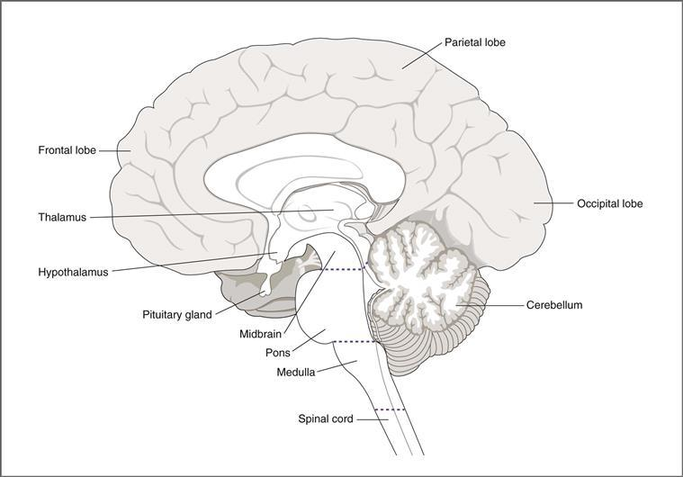

**그림 3-1 뇌의 정중시상면.** 대뇌 피질의 엽, 소뇌, 시상 및 시상하부, 뇌간 및 척수 사이의 관계가 표시됩니다.

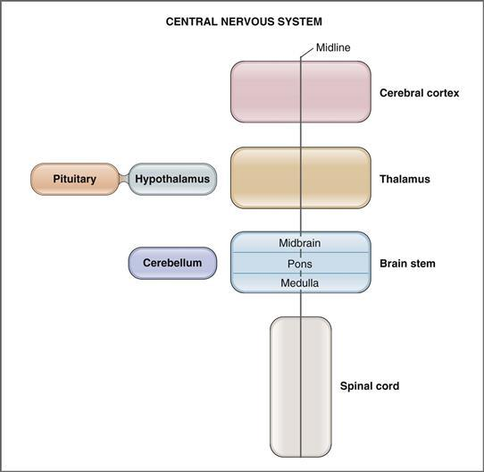

**그림 3-2 중추신경계의 개략도.**

CNS의 주요 부분은 척수입니다. 뇌간(수질, 교뇌, 중뇌); 소뇌; 간뇌(시상 및 시상하부); 및 대뇌 반구(대뇌 피질, 백질, 기저핵, 해마 형성 및 편도체).

#### 척수

척수는 CNS의 가장 꼬리 부분으로 두개골 기저부에서 첫 번째 요추까지 뻗어 있습니다. 척수는 **감각**(구심성) 신경과 **운동**(원심성) 신경을 모두 포함하는 31쌍의 척수 신경으로 나누어져 있습니다. 감각 신경은 등근과 뇌신경 신경절을 통해 말초의 피부, 관절, 근육 및 내장 기관에서 척수로 정보를 전달합니다. 운동 신경은 척수에서 말초로 정보를 전달하며 골격근에 분포하는 체성 운동 신경과 심장 근육, 평활근, 분비선 및 분비 세포에 분포하는 자율 신경계의 운동 신경을 모두 포함합니다([장 참조). 2](CR%21G9RE0KW4PD33Q9F3DXNCSBNXCANP_split_009.html#filepos253561)).

정보는 또한 척수 내에서 위아래로 이동합니다. 척수의 **상행 경로**는 감각 정보를 말초에서 CNS의 상위 수준으로 전달합니다. 척수의 **내림경로**는 CNS의 상위 수준에서 말초를 지배하는 운동 신경으로 운동 정보를 전달합니다.

#### 뇌간

수질, 교뇌, 중뇌를 합쳐서 뇌간이라고 합니다. 12개의 뇌신경 중 10개(CN III~XII)가 뇌간에서 발생합니다. 그들은 감각 정보를 뇌간으로 전달하고 운동 정보를 뇌간으로 전달합니다. 뇌간의 구성요소는 다음과 같습니다.

 **수질**은 척수의 입쪽 확장입니다. 여기에는 호흡과 혈압을 조절하는 자율신경 센터와 삼킴, 기침, 구토 반사를 조정하는 센터가 포함되어 있습니다([Chapter 2](CR%21G9RE0KW4PD33Q9F3DXNCSBNXCANP_split_009.html#filepos253561 참조), [Fig. 2-5](CR%21G9RE0KW4PD33Q9F3DXNCSBNXCANP_split_009.html#filepos301788)).

 **폰**은 수질의 입쪽이며 수질의 중심과 함께 자세의 균형과 유지, 호흡 조절에 참여합니다. 또한 뇌교는 대뇌반구에서 소뇌로 정보를 전달합니다.

 **중뇌**는 뇌교의 앞쪽에 있으며 안구 운동을 제어하는 ​​데 참여합니다. 또한 청각 및 시각 시스템의 중계 핵이 포함되어 있습니다.

#### 소뇌

소뇌는 뇌간에 부착되어 교뇌와 수질의 등쪽에 놓여 있는 잎 모양의("잎이 많은") 구조입니다. 소뇌의 기능은 움직임의 조정, 움직임의 계획 및 실행, 자세 유지, 머리와 눈 움직임의 조정입니다. 따라서 대뇌 피질과 척수 사이에 편리하게 위치한 소뇌는 척수의 위치에 대한 감각 정보, 대뇌 피질의 운동 정보, 내이의 전정 기관의 균형 정보를 통합합니다.

#### 시상 및 시상하부

시상과 시상하부는 함께 "뇌 사이"를 의미하는 **간뇌**를 형성합니다. 이 용어는 대뇌 반구와 뇌간 사이의 시상과 시상하부의 위치를 ​​나타냅니다.

**시상**은 대뇌 피질로 *가는* 거의 모든 감각 정보와 대뇌 피질에서 뇌간 및 척수로 *오는* 거의 모든 운동 정보를 처리합니다.

**시상하부**는 시상의 복부에 위치하며 체온, 음식 섭취 및 수분 균형을 조절하는 센터를 포함합니다. 시상하부는 뇌하수체의 호르몬 분비를 조절하는 내분비선이기도 합니다. 시상하부는 뇌하수체 전엽 호르몬의 방출(또는 방출 억제)을 유발하는 방출 호르몬과 방출 억제 호르몬을 뇌하수체 문맥 혈액으로 분비합니다. 시상하부에는 항이뇨 호르몬(ADH)과 옥시토신을 분비하는 뇌하수체 후엽 뉴런의 세포체가 포함되어 있습니다.

#### 대뇌 반구

대뇌 반구는 대뇌 피질, 밑에 있는 백질, 3개의 심핵(기저핵, 해마 및 편도체)으로 구성됩니다. 대뇌 반구의 기능은 지각, 고등 운동 기능, 인지, 기억, 감정입니다.

 **대뇌 피질.** 대뇌 피질은 대뇌 반구의 복잡한 표면이며 **전두엽, 두정엽, 측두엽** 및 **후두엽**의 4개 엽으로 구성됩니다. 이 엽은 고랑 또는 홈으로 구분됩니다. 대뇌 피질은 감각 정보를 수신하고 처리하며 운동 기능을 통합합니다. 피질의 이러한 감각 및 운동 영역은 감각 또는 운동 처리를 얼마나 직접적으로 처리하는지에 따라 **“1차”, “2차”** 및 **“3차”**로 추가 지정됩니다. 기본 영역은 가장 직접적이며 가장 적은 수의 시냅스를 포함합니다. 3차 영역은 가장 복잡한 처리가 필요하고 가장 많은 수의 시냅스가 필요합니다. **연관 영역**은 목적 있는 활동을 위해 다양한 정보를 통합합니다. 예를 들어, 변연계 연합 영역은 동기 부여, 기억 및 감정에 관여합니다. 다음 예는 명명법을 설명합니다. (1) *1차* 운동 피질에는 상부 운동뉴런이 포함되어 있으며, 이는 척수로 직접 돌출되어 골격근에 신경을 분포시키는 하부 운동뉴런을 활성화합니다. (2) *1차* 감각 피질은 1차 시각 피질, 1차 청각 피질, 1차 체성감각 피질로 구성되며, 몇 개의 시냅스만 개입하여 말초의 감각 수용체로부터 정보를 받습니다. (3) *2차* 및 *3차* 감각 및 운동 영역은 1차 영역을 둘러싸고 있으며 연합 영역과 연결되어 더 복잡한 처리에 관여합니다.

 **기저핵, 해마, 편도체.** 대뇌반구에는 3개의 심핵이 있습니다. **기저핵**은 꼬리핵, 피각, 담창구로 구성됩니다. 기저핵은 대뇌 피질의 모든 엽으로부터 입력을 받고 시상을 통해 전두엽 피질로 돌출되어 움직임 조절을 돕습니다. **해마**와 **편도체**는 변연계의 일부입니다. 해마는 기억에 관여합니다. 편도체는 감정에 관여하고 시상하부를 통해 자율신경계와 통신합니다(예: 감정이 심박수, 동공 크기 및 시상하부 호르몬 분비에 미치는 영향).

### 감각 및 운동 시스템의 일반적인 특징

주요 감각 및 운동 시스템에 대한 구체적인 논의를 진행하기 전에 몇 가지 일반적인 조직적 특징을 고려할 것입니다. 각 시스템의 세부 사항은 다양하지만 이러한 기능은 신경 생리학 전반에 걸쳐 반복되는 주제 집합으로 평가될 수 있습니다.

#### 시냅틱 릴레이

가장 단순한 시냅스는 시냅스 전 요소(예: 운동뉴런)와 시냅스 후 요소(예: 골격근 섬유)로 구성된 일대일 연결입니다. 그러나 신경계에서는 많은 시냅스가 더 복잡하며 **중계 핵**의 시냅스를 사용하여 수렴 정보를 통합합니다. 중계핵은 중추신경계 전체에서 발견되지만 특히 시상에서 두드러집니다.

중계 핵에는 국소 **개재뉴런** 및 **투영 뉴런**을 포함한 여러 가지 유형의 뉴런이 포함되어 있습니다. 투사 뉴런은 핵 밖으로 긴 축삭을 확장하여 다른 중계 핵이나 대뇌 피질의 시냅스를 연결합니다. 대뇌 피질로 들어오고 나가는 거의 모든 정보는 시상 중계 핵에서 처리됩니다.

#### 지형 조직

감각 및 운동 시스템의 눈에 띄는 특징 중 하나는 정보가 **신경 지도**에 인코딩되어 있다는 것입니다. 예를 들어, 체성 감각 시스템에서 **체성 주제 지도**는 신체의 특정 위치 *에서* 정보를 수신하고 *로* 정보를 보내는 뉴런 배열로 구성됩니다. 지형 코딩은 대뇌 피질만큼 높은 신경계의 각 수준에서 보존됩니다. 따라서 체성감각계에서는 지형정보가 대뇌피질에서 감각호문쿨루스로 표현된다([그림 3-11](#filepos394738) 참조). 시각 시스템에서는 지형학적 표현을 **retinotopic**이라고 하고, 청각 시스템에서는 **tonotopic**이라고 합니다.

#### 토론

거의 모든 감각 및 운동 경로는 양측 대칭이며 정보는 뇌 또는 척수의 한쪽(동측)에서 다른 쪽(대측)으로 교차합니다. 따라서 신체 한쪽의 감각 활동은 반대쪽 대뇌 반구로 전달됩니다. 마찬가지로 신체 한쪽의 운동 활동은 반대쪽 대뇌 반구에 의해 제어됩니다.

그러나 모든 경로는 CNS의 동일한 수준에서 교차하지 않습니다. 일부 경로(예: 통증)는 척수에서 교차하고 많은 경로는 뇌간에서 교차합니다. 이러한 교차를 **논교**라고 합니다. 토론 축삭만 포함하는 뇌 영역을 **교련**이라고 합니다. 예를 들어 뇌량은 두 대뇌 반구를 연결하는 교련입니다.

일부 시스템은 교차 경로와 교차 경로가 모두 혼합되어 있습니다. 예를 들어, 시각 시스템에서 각 망막의 축삭 중 절반은 반대편으로 교차하고 나머지 절반은 동측으로 유지됩니다. **시신경교차**에서는 시각 섬유가 교차합니다.

#### 신경 섬유의 종류

신경 섬유는 섬유의 크기와 수초화의 유무에 따라 전도 속도에 따라 분류됩니다. 섬유 직경과 수초화가 전도 속도에 미치는 영향은 [1장](CR%21G9RE0KW4PD33Q9F3DXNCSBNXCANP_split_007.html#filepos27757)에 설명되어 있습니다. 간단히 말해서, 섬유가 클수록 전도 속도가 높아집니다. 전도 속도는 또한 신경 섬유 주위에 수초가 존재함으로써 증가됩니다. 따라서 큰 수초 신경 섬유는 가장 빠른 전도 속도를 가지며 작은 수초 신경 섬유는 가장 느린 전도 속도를 갖습니다.

전도 속도의 차이에 기초한 두 가지 분류 시스템이 사용됩니다. Erlanger와 Gasser가 설명한 첫 번째 시스템은 감각(구심성) 신경 섬유와 운동(원심성) 신경 섬유 *모두*에 적용되며 A, B, C라는 문자 명명법을 사용합니다. Lloyd와 Hunt가 설명한 두 번째 시스템은 감각 신경 섬유에만 *만 적용되며 I, II, III, IV의 로마 숫자 명명법을 사용합니다. [표 3-1](#filepos360992)은 각 분류 내의 신경 섬유 유형 요약, 각 유형의 예, 섬유 직경 및 전도 속도에 대한 정보, 섬유가 수초화되었는지 또는 수초화되지 않았는지 여부를 제공합니다.

**표 3-1 신경 섬유의 분류**

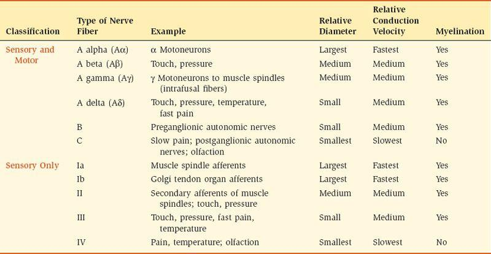

### 감각 시스템

#### 감각 경로

감각 시스템은 말초의 특수 수용체를 통해 환경으로부터 정보를 수신하고 이 정보를 일련의 뉴런과 시냅스 중계를 통해 CNS로 전달합니다. 감각정보를 전송하는 과정은 다음과 같습니다([그림 3-3](#filepos361797)).

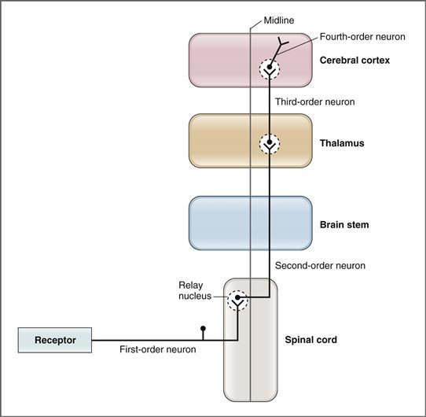

**그림 3-3 신경계의 감각 경로 도식.** 정보는 일련의 뉴런을 통해 말초 수용체에서 대뇌 피질로 전달됩니다. 시냅스는 1차 뉴런과 2차 뉴런 사이, 2차 뉴런과 3차 뉴런 사이, 3차와 4차 뉴런 사이의 중계 핵에서 만들어집니다. 2차 뉴런은 척수(*표시됨*) 또는 뇌간(*표시되지 않음*)의 정중선을 통과하여 신체 한쪽의 정보가 반대측 시상 및 대뇌 피질로 전달됩니다.

1. **감각 수용체.** 감각 수용체는 환경의 자극에 의해 활성화됩니다. 수용체의 성격은 감각 양상에 따라 다양합니다. 시각, 미각, 청각 시스템에서 수용체는 특화된 상피 세포입니다. 체성감각 및 후각 시스템에서 수용체는 1차 또는 1차 구심성 뉴런입니다. 이러한 차이점에도 불구하고 수용체의 기본 기능은 동일합니다. 즉, 자극(예: 음파, 전자기파 또는 압력)을 전기화학 에너지로 변환하는 것입니다. **감각 전달**이라고 하는 전환 과정은 특정 이온 채널을 열거나 닫는 것을 통해 매개됩니다. 이온 채널을 열거나 닫으면 감각 수용체의 탈분극 또는 과분극과 같은 막 전위의 변화가 발생합니다. 감각 수용체의 막전위 변화를 **수용기 전위**라고 합니다.  
       수용체 전위의 전달 및 생성 후 정보는 1차, 2차, 3차, 4차 뉴런으로 지정된 일련의 감각 구심성 뉴런을 따라 중추신경계로 전달됩니다([그림 3-3](#filepos361797) 참조). 1차 뉴런은 감각 수용체에 가장 가까운 뉴런을 의미하고, 고차 뉴런은 CNS에 더 가까운 뉴런을 의미합니다.
2. **1차 감각 구심성 뉴런.** 1차 감각 뉴런은 1차 감각 구심성 뉴런입니다. 어떤 경우에는(체성감각, 후각) 수용체 세포이기도 합니다. 감각 수용체가 특화된 상피 세포인 경우, 1차 뉴런과 시냅스를 형성합니다. 수용체가 일차 구심성 뉴런이기도 하면 이 시냅스가 필요하지 않습니다. 일차 구심성 뉴런은 일반적으로 등근 또는 척수 신경절에 세포체를 가지고 있습니다. (청각, 후각, 시각 시스템은 예외입니다.)
3. **2차 감각 구심성 뉴런.** 1차 뉴런은 척수 또는 뇌간에 위치한 **중계 핵**의 2차 뉴런과 시냅스를 이룹니다. 일반적으로 많은 1차 뉴런은 중계핵 내의 단일 2차 뉴런에서 시냅스를 형성합니다. 중계 핵에도 위치한 중간뉴런은 흥분성 또는 억제성일 수 있습니다. 이들 중간뉴런은 1차 뉴런으로부터 받은 감각 정보를 처리하고 수정합니다. 2차 뉴런의 축색돌기는 중계핵을 떠나 시상에 위치한 다음 중계로 올라가며, 그곳에서 3차 뉴런과 시냅스를 이룹니다. 시상으로 가는 도중에 이러한 2차 뉴런의 축삭은 **정중선에서 교차합니다.** decussation 또는 교차는 척수([그림 3-3](#filepos361797)에 설명됨) 또는 뇌간(그림에 없음)에서 발생할 수 있습니다.
4. **3차 감각 구심성 뉴런.** 3차 뉴런은 일반적으로 **시상의 중계 핵에 존재합니다.** 다시 말하지만, 많은 2차 뉴런은 단일 3차 뉴런에서 시냅스됩니다. 중계핵은 흥분성 또는 억제성일 수 있는 국소 개재뉴런을 통해 수신한 정보를 처리합니다.
5. **4차 감각 구심성 뉴런.** 4차 뉴런은 대뇌 피질의 적절한 감각 영역에 위치합니다. 예를 들어, 청각 경로에서 4차 뉴런은 일차 청각 피질에서 발견됩니다. 시각 경로에서는 일차 시각 피질에 상주합니다. 등등. 언급한 바와 같이, 피질에는 2차 및 3차 영역과 연합 영역이 있으며, 모두 복잡한 감각 정보를 통합합니다.

#### 감각 수용체

환경 자극이 감각 수용체에서 전기 신호로 변환되는 감각 경로의 첫 번째 단계를 다시 고려하십시오. 이 섹션에서는 다양한 유형의 감각 수용체, 감각 전달 메커니즘, 감각 뉴런의 수용 영역, 감각 코딩 및 감각 수용체의 적응에 대해 논의합니다.

##### *수용체의 유형*

수용체는 이를 활성화하는 자극의 유형에 따라 분류됩니다. 수용체의 5가지 유형은 기계수용체, 광수용체, 화학수용체, 열수용체, 통각수용체입니다. [표 3-2](#filepos367389)는 수용체를 요약하고 각 유형의 예와 위치를 제공합니다.

**표 3–2 감각 수용체의 유형 및 예**

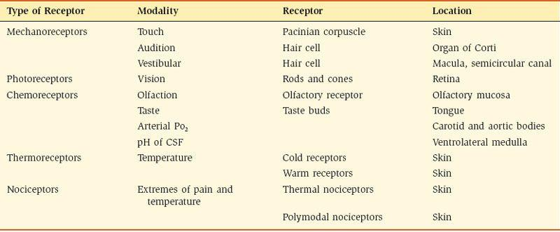

CSF, 뇌척수액; PO2, 산소 부분압.

**기계 수용체**는 압력이나 압력 변화에 의해 활성화됩니다. 기계 수용체에는 피하 조직의 파치니 소체, 털이 없는 피부의 마이스너 소체(촉각), 경동맥동의 압력 수용체(혈압), 코르티 기관(청각) 및 반고리관(전정계)의 유모 세포가 포함되지만 이에 국한되지는 않습니다. **광수용체**는 빛에 의해 활성화되며 시력에 관여합니다. **화학수용체**는 화학물질에 의해 활성화되며 후각, 미각, 호흡 조절 시 산소 및 이산화탄소 감지에 관여합니다. **온도 수용체**는 온도 또는 온도 변화에 의해 활성화됩니다. **침해수용체**는 극한의 압력, 온도 또는 유해 화학물질에 의해 활성화됩니다.

##### *감각 전달 및 수용체 잠재력*

**감각 전달**은 환경 자극(예: 압력, 빛, 화학 물질)이 수용체를 활성화하고 전기 에너지로 변환되는 과정입니다. 변환에는 일반적으로 수용체 막의 이온 채널이 열리거나 닫히는 과정이 포함되며, 이는 막을 가로지르는 이온의 흐름(전류 흐름)으로 이어집니다. 그런 다음 전류 흐름은 **수용체 전위**라고 불리는 막 전위의 변화로 이어지며, 이는 활동 전위가 발생할 가능성을 증가시키거나 감소시킵니다. 자극이 감각 수용체를 활성화할 때 다음과 같은 일련의 단계가 발생합니다.

1. 환경 **자극**은 감각 수용체와 상호 작용하여 그 특성에 변화를 일으킵니다. 기계적 자극은 *기계* 수용체의 *움직임*을 유발합니다(예: 음파가 코르티 기관의 유모 세포를 움직입니다). 빛의 광자는 망막의 *광*수용체에 있는 색소에 흡수되어 로돕신(광수용체 막의 화학물질)의 광이성질체화를 유발합니다. 화학 자극제는 *화학*수용체와 반응하여 Gs 단백질과 아데닐릴 시클라제를 활성화합니다. 각각의 경우 감각 수용체에 *변화*가 발생합니다.
2. 이러한 변화로 인해 감각 수용체 막의 **이온 채널**이 열리거나 닫히게 되어 전류 흐름이 변경됩니다. 이온 전류 흐름이 안쪽으로 향하는 경우(즉, 양전하가 수용체 세포로 이동하는 경우) 탈분극이 발생합니다. 전류 흐름이 바깥쪽으로 향하는 경우(즉, 양전하가 세포 밖으로 이동하는 경우) 과분극이 발생합니다. 탈분극 또는 과분극 등 막 전위의 결과적인 변화를 **수용체 전위** 또는 **생성기 전위**라고 합니다. 수용체 전위는 활동 전위가 *아닙니다*. 오히려 수용체 전위는 탈분극인지 과분극인지에 따라 활동 전위가 발생할 가능성을 증가시키거나 감소시킵니다. 수용체 전위는 등급이 매겨진 전자 전위이며, 그 진폭은 자극의 크기와 상관됩니다.
3. 수용체 전위가 **탈분극**되면 막전위가 역치쪽으로 *이동하여 활동전위가 발생할 가능성이 높아집니다([그림 3-4](#filepos371891)). 수용체 전위는 진폭에 따라 등급이 매겨지기 때문에, 작은 탈분극 수용체 전위는 여전히 역치 이하일 수 있으므로 활동 전위를 생성하기에는 불충분합니다. 그러나 더 큰 자극은 더 큰 탈분극 수용체 전위를 생성하고, 역치에 도달하거나 초과하면 활동 전위가 발생합니다. 수용체 전위가 **과분극**(그림에 없음)인 경우 막 전위가 역치에서 *멀리* 이동하여 활동 전위가 발생할 가능성이 항상 감소합니다.

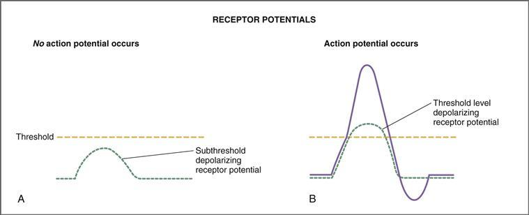

**그림 3-4 감각 수용체 세포의 수용체 전위.** 수용체 전위는 탈분극(*표시됨*) 또는 과분극(*표시되지 않음*)일 수 있습니다. **A,** 탈분극 수용체 전위가 막 전위를 역치 수준으로 가져오지 않으면 활동 전위가 발생하지 않습니다. **B,** 탈분극 수용체 전위가 막 전위를 역치 수준으로 가져오면 감각 수용체에서 활동 전위가 발생합니다.

##### *수용 필드*

수용 장이란 *자극을 받았을 때 감각 뉴런의 발화율이 변하는 신체 부위*를 정의합니다. 발화율의 변화는 증가*또는* 감소할 수 있습니다. 따라서 수용 필드는 **흥분성**(감각 뉴런의 발사 속도 증가) 또는 **억제성**(감각 뉴런의 발사 속도 감소)으로 설명됩니다.

1차, 2차, 3차, 4차 감각 뉴런에 대한 수용 영역이 있습니다. 예를 들어, 2차 뉴런의 수용 영역은 *해당* 2차 뉴런의 발화 속도에 변화를 일으키는 말초의 수용체 영역입니다.

수용필드의 크기는 다양하다([그림 3-5](#filepos373989)). 수용 영역이 작을수록 감각을 더 정확하게 국소화하거나 식별할 수 있습니다. 일반적으로 CNS 뉴런의 순서가 높을수록 수용 영역이 더 복잡해집니다. 각 수준의 중계 핵에 더 많은 뉴런이 모이기 때문입니다. 따라서 1차 감각 뉴런은 가장 단순한 수용 영역을 가지며, 4차 감각 뉴런은 가장 복잡한 수용 영역을 갖습니다.

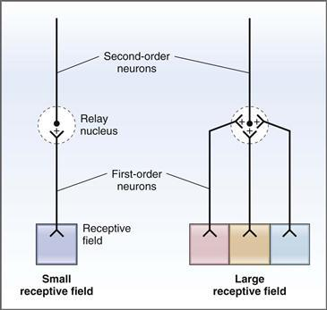

**그림 3-5 감각 뉴런의 수용 영역 크기.**

언급한 바와 같이, 수용 필드는 흥분성 또는 억제성 수용 필드일 수 있으며, 흥분성 또는 억제성 수용 필드의 패턴은 *추가* 정보를 CNS에 전달합니다. [그림 3-6](#filepos375052)은 2차 뉴런에 대한 이러한 패턴 중 하나를 보여줍니다. 이 특정 뉴런에 대한 피부의 수용 장에는 중앙의 흥분 영역이 있으며 양쪽은 억제 영역으로 둘러싸여 있습니다. 들어오는 모든 정보는 척수나 뇌간의 중계핵에서 처리됩니다. 억제 영역은 **측면 억제**라는 현상에 기여하며 경계를 정의하고 대조 경계를 제공함으로써 자극의 정확한 위치 파악을 돕습니다.

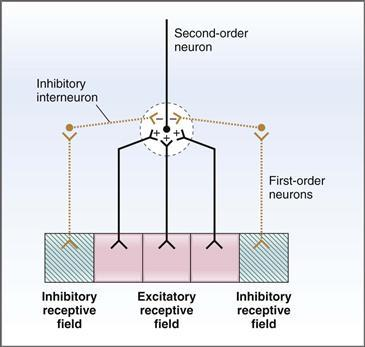

**그림 3-6 감각 뉴런의 흥분성 및 억제성 수용 영역.**

##### *감각 코딩*

감각 뉴런은 환경의 자극을 인코딩하는 역할을 합니다. 코딩은 자극이 감각 수용체에 의해 전달될 때 시작되고 정보가 점차적으로 더 높은 수준의 CNS로 전달됨에 따라 계속됩니다. 자극의 하나 이상의 측면이 인코딩되고 해석됩니다. 예를 들어, 빨간 공을 볼 때 그 크기, 위치, 색상 및 깊이가 모두 인코딩됩니다. 인코딩할 수 있는 특징에는 감각 양식, 공간 위치, 빈도, 강도, 임계값 및 자극 기간이 포함됩니다.

 자극 **양식**은 **표시된 선**으로 인코딩되는 경우가 많습니다. 이는 해당 양식에 *전용된 감각 뉴런의 경로로 구성됩니다.* 따라서 시각에 전념하는 뉴런의 경로는 망막의 광수용체에서 시작됩니다. 이 경로는 체성감각, 청각 또는 후각 자극에 의해 활성화되지 않습니다. 이러한 양식에는 *자체* 라벨이 붙은 라인이 있습니다.

 자극 **위치**는 감각 뉴런의 수용 영역에 의해 인코딩되며 이전에 설명한 대로 측면 억제에 의해 향상될 수 있습니다.

 **임계값**은 감지할 수 있는 최소 자극입니다. 임계값은 수용체 잠재력의 맥락에서 가장 잘 평가됩니다. 자극이 역치에 도달하는 탈분극 수용체 전위를 생성할 만큼 충분히 크면 감지됩니다. 더 작은 임계값 이하 자극은 감지되지 않습니다.

 자극 **강도**는 세 가지 방식으로 인코딩됩니다. (1) 강도는 활성화된 수용체의 수에 따라 인코딩될 수 있습니다. 따라서 큰 자극은 작은 자극보다 더 많은 수용체를 활성화하고 더 큰 반응을 생성합니다. (2) 강도는 경로에서 감각 뉴런의 발화 속도 차이로 인코딩될 수 있습니다. (3) 강도는 다양한 유형의 수용체를 활성화함으로써 암호화될 수도 있습니다. 따라서 피부를 가볍게 만지면 기계 수용체만 활성화될 수 있는 반면, 피부에 대한 강렬한 손상 자극은 기계 수용체 *및* 통각 수용체를 활성화할 수 있습니다. 강렬한 자극은 더 강한 것으로 감지될 뿐만 아니라 다른 양식으로도 감지됩니다.

 자극 정보는 신체의 여러 위치(예: 체성소 지도), 망막의 여러 위치(예: 망막색소 지도) 또는 다양한 소리 주파수(예: 음위상 지도)에서 정보를 수신하는 뉴런 배열로 형성된 **신경 지도**에도 인코딩됩니다.

 다른 자극 정보는 **신경 자극 패턴**으로 인코딩됩니다. 이러한 코드 중 일부는 평균 방전 빈도를 기반으로 하고, 다른 코드는 발사 기간을 기반으로 하고, 다른 코드는 일시적인 발사 패턴을 기반으로 합니다. 자극의 빈도는 감각 뉴런의 방전 사이의 간격(스파이크 간격이라고 함)에서 직접 인코딩될 수 있습니다.

 자극 **지속 시간**은 감각 뉴런의 발사 지속 시간으로 인코딩됩니다. 그러나 장기간의 자극 동안 수용체는 자극에 "적응"하고 발사 속도를 변경합니다. 감각 뉴런은 빠르게 적응할 수도 있고 느리게 적응할 수도 있습니다.

##### *감각 수용체의 적응*

감각 수용체는 자극에 "적응"합니다. **적응**은 일정한 자극이 일정 기간 동안 가해질 때 관찰됩니다. 처음에는 활동전위의 빈도가 높으나, 시간이 지날수록 자극이 계속되더라도 이 빈도는 감소합니다([그림 3-7](#filepos379894)). 적응 패턴은 수용체의 종류에 따라 다릅니다. 일부 수용체는 **위상**으로서 자극(예: 파치니안 소체)에 빠르게 적응한다는 의미이고, 다른 수용체는 **강장성** 즉 자극(예: 메르켈 수용체)에 천천히 적응한다는 의미입니다.

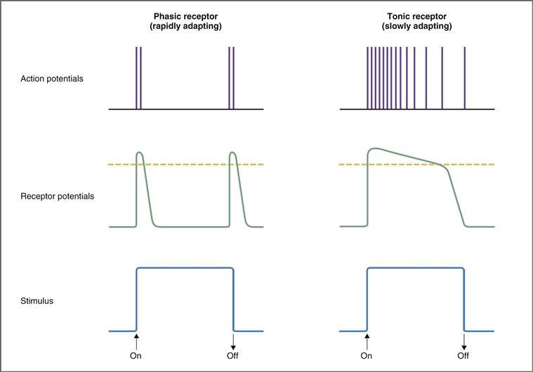

**그림 3–7 위상 및 강장성 기계수용체의 반응.**

적응을 위한 생리학적 기초도 [그림 3-7](#filepos379894)에 나와 있다. 두 가지 유형의 수용체, 즉 위상 수용체와 강장제 수용체가 표시됩니다. 자극(예: 압력)이 가해진 다음(*on*) 자극이 제거됩니다(*off*). 자극이 켜져 있는 동안 수용체 전위와 활동 전위의 빈도가 측정됩니다. (그림에서 활동 전위는 "스파이크"로 나타납니다.)

 **위상 수용체**는 자극이나 **진동**의 급격한 변화를 감지하는 **파시니 소체**로 설명됩니다. 이러한 수용체는 일정한 자극에 빠르게 적응하며 주로 자극의 **시작** 및 **오프셋**과 변화하는 자극을 감지합니다. 위상 수용체는 막 전위를 역치 이상으로 만드는 탈분극 수용체 전위로 자극이 시작될 때 즉시 반응합니다. 짧은 활동전위 폭발이 뒤따릅니다. 이러한 폭발 후에 수용체 전위는 역치 수준 아래로 감소하고, 자극이 계속되더라도 활동 전위는 없습니다(즉, 침묵이 있음). 자극이 꺼지면 수용체 전위가 역치까지 탈분극되어 두 번째로 짧은 활동 전위 폭발을 일으키면서 수용체가 다시 활성화됩니다.

 **강장성 기계 수용체**는 **일정한 압력**을 감지하는 피부의 기계 수용체(예: 메르켈 수용체)로 설명됩니다. 파치니 소체(빠른 온-오프 반응으로 진동을 감지)와 비교할 때 강장성 기계 수용체는 자극의 지속 시간과 강도를 인코딩하도록 설계되었습니다. 강장제 수용체는 막을 역치에 이르게 하는 탈분극 수용체 전위로 자극의 시작에 반응하여 일련의 긴 활동 전위를 생성합니다. 수용체 전위가 빠르게 기준선으로 돌아가는 파치니 소체와는 달리, 여기서 수용체 전위는 자극 기간의 더 긴 부분 동안 탈분극된 상태로 유지되며 활동 전위는 계속됩니다. 수용체 전위가 재분극되기 시작하면 활동 전위 속도가 감소하고 결국에는 침묵이 발생합니다. 강장제 수용체는 **자극 강도:**를 암호화합니다. 강도가 클수록 탈분극 수용체 전위가 커지고 활동 전위가 발생할 가능성이 높아집니다. 따라서 강장제 수용체는 **자극 지속 시간**도 인코딩합니다. 자극이 길수록 수용체 전위가 역치를 초과하는 기간도 길어집니다.

### 체성감각체계와 통증

체성 감각 시스템은 접촉, 위치, 통증 및 온도에 대한 정보를 처리합니다. 이러한 감각을 전달하는 데 관여하는 수용체에는 기계 수용체, 온도 수용체 및 통각 수용체가 있습니다. 체성감각 정보를 CNS로 전달하는 경로에는 등쪽 기둥 시스템과 전외측 시스템의 두 가지 경로가 있습니다. 등주 시스템은 미세한 촉각, 압력, 두 지점 식별, 진동 및 고유 감각(사지 위치) 감각을 처리합니다. 전외측 시스템은 통증, 온도, 가벼운 촉각 등의 감각을 처리합니다.

#### 체성감각 수용체의 유형

체성감각 수용체는 그들이 암호화하는 특정 감각에 따라 분류됩니다. 수용체의 주요 그룹은 **기계 수용체**(촉각 및 고유 감각용), **온도 수용체**(온도용) 및 **침해 수용체**(통증 또는 유해 자극용)입니다.

##### *기계수용체*

기계 수용체는 어떤 종류의 압력이나 고유 감각 품질을 인코딩하는지에 따라 다양한 유형의 수용체로 세분됩니다. 일부 유형의 기계 수용체는 털이 없는 피부에서 발견되고 다른 유형은 털이 있는 피부에서 발견됩니다. 기계수용체는 피부나 근육에서의 위치, 나타나는 적응 유형, 부호화하는 감각에 따라 [표 3-3](#filepos384786)에 설명되어 있으며, [그림 3-8](#filepos385020)에 나와 있습니다.

**표 3–3 기계 수용체 유형**

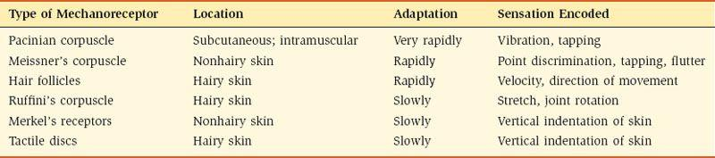

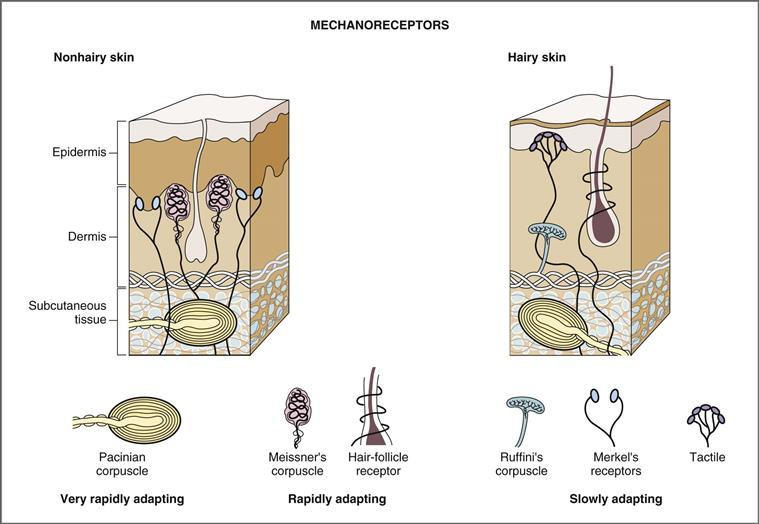

**그림 3–8 털이 없는 피부와 털이 있는 피부에서 발견되는 기계 수용체 유형.** (Schmidt RF에서 수정됨: 감각 생리학 기초, 3판, Berlin, Springer-Verlag, 1986.)

각 수용체의 중요한 특징은 그것이 나타내는 적응 유형입니다. 다양한 기계 수용체 중에서 적응은 "매우 빠른 적응"(예: 파치니 소체)부터 "빠른 적응"(예: 마이스너 소체 및 모낭), "느린 적응"(예: 루피니 소체, 메르켈 수용체 및 촉각 디스크)까지 다양합니다. **매우 빠르게** 및 **빠르게 적응하는 수용체**는 *자극의 변화*를 감지하고 따라서 속도의 변화도 감지합니다. **천천히 적응하는 수용체**는 자극의 강도와 지속 시간에 반응합니다.

 **파시니안 소체.** 파시니안 소체는 털이 없는 피부와 털이 있는 피부의 피하층과 근육에서 발견되는 캡슐화된 수용체입니다. 그들은 모든 기계적 수용체 중에서 가장 빠르게 적응합니다. 매우 빠른 온-오프 반응으로 인해 자극 속도의 변화를 감지하고 **진동** 감각을 인코딩할 수 있습니다.

 **마이스너 소체**. 마이스너 소체는 또한 털이 없는 피부의 진피, 특히 손가락 끝, 입술 및 촉각 식별이 특히 좋은 기타 위치에서 발견되는 캡슐화된 수용체입니다. 수용 영역이 작으며 **2점 식별**에 사용할 수 있습니다. 마이스너 소체는 점 식별, 정확한 위치, 태핑 및 펄럭임을 인코딩하는 수용기에 빠르게 적응합니다.

 **모낭.** 모낭 수용체는 털이 많은 피부에서 모낭을 둘러싸는 신경 섬유의 배열입니다. 모발이 옮겨지면 모낭 수용체가 자극됩니다. 또한 이 수용체는 피부 전체의 **속도**와 이동 방향에 빠르게 적응하고 감지합니다.

 **루피니 소체.** 루피니 소체는 털이 없는 피부와 털이 있는 피부의 진피와 관절낭에 위치합니다. 이들 수용체는 큰 수용 영역을 갖고 있으며 피부가 늘어날 때 자극을 받습니다. 자극은 그것이 활성화하는 수용체로부터 어느 정도 떨어진 곳에 위치할 수 있습니다. 루피니 소체는 수용체에 천천히 적응하고 있습니다. 피부가 늘어나면 수용체는 빠르게 활성화된 다음 자극 강도에 해당하는 새로운 수준의 활성화에 천천히 적응합니다. 루피니의 소체는 **신축**과 관절 회전을 감지합니다.

 **메르켈 수용체 및 촉각 디스크.** 메르켈 수용체는 털이 없는 피부에서 발견되는 수용체에 천천히 적응하며 매우 작은 수용 영역을 가지고 있습니다. 이 수용체는 피부의 수직 **압입**을 감지하고 그 반응은 자극 강도에 비례합니다. 촉각 디스크는 메르켈 수용체와 유사하지만 털이 없는 피부가 아닌 털이 있는 피부에서 발견됩니다.

##### *온도 수용기*

온도 수용체는 피부 온도의 변화를 감지하는 천천히 적응하는 수용체입니다. 온도수용체에는 저온수용체와 온수용체 두 가지가 있다([그림 3-9](#filepos389384)). 각 유형의 수용체는 넓은 범위의 온도에서 기능하며 중간 온도 범위에서는 일부 중복됩니다(예: 36°C에서는 두 수용체가 모두 활성화됩니다). 피부가 36°C 이상 따뜻해지면 한랭 수용체가 정지되고, 피부가 36°C 이하로 차가워지면 온 수용체가 정지됩니다.

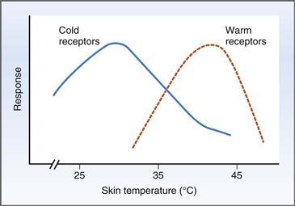

**그림 3–9 피부 온도 수용체의 반응 프로파일.**

피부 온도가 위험한 수준(45°C 이상)으로 올라가면 따뜻한 수용체가 비활성화됩니다. 따라서 따뜻한 수용체는 극심한 열로 인한 통증을 알리지 않습니다. 45°C 이상의 온도에서는 다형 통각수용체가 활성화됩니다. 마찬가지로 극도로 추운(어는) 온도도 통각수용기를 활성화합니다.

따뜻한 온도의 변환에는 바닐로이드 수용체 계열(즉, TRPV)의 **일과성 수용체 전위(TRP) 채널**이 포함됩니다. 이러한 채널은 매운 음식의 성분인 캡사이신을 포함하는 바닐로이드 계열의 화합물에 의해 활성화됩니다.

차가운 온도의 변환에는 멘톨(차가운 느낌을 주는)과 같은 화합물에 의해 열리는 다른 TRP 채널인 TRPM8이 포함됩니다.

##### *침해수용체*

통각수용체는 조직 손상을 일으킬 수 있는 유해 자극에 반응합니다. 통각수용체에는 열적 또는 기계적 통각수용기와 다중형 통각수용기라는 두 가지 주요 부류가 있습니다. **열 또는 기계적 통각수용기**(TRPV 또는 TRPM8 채널)는 미세하게 형성된 A-델타 구심성 신경 섬유에 의해 공급되며 날카롭고 찌르는 듯한 통증과 같은 기계적 자극에 반응합니다. **다중 침해수용체**는 수초가 없는 C 섬유에 의해 공급되며 고강도 기계적 또는 화학적 자극과 뜨겁고 차가운 자극에 반응합니다.

손상된 피부는 브라디키닌, 프로스타글란딘, 물질 P, K+, H+를 포함한 다양한 화학 물질을 방출하여 **염증 반응**을 시작합니다. 혈관이 투과성이 있게 되고, 결과적으로 피부에 국소 부종과 발적이 나타납니다. 부상 부위 근처의 비만 세포는 침해 수용체를 직접 활성화하는 히스타민을 방출합니다. 또한, 통각수용기의 축삭은 이전에는 유해하거나 고통스럽지 않았던 자극에 대해 통각수용기를 민감하게 만드는 물질을 방출합니다. **통각과민**이라고 불리는 이러한 민감화 과정은 통증 역치 감소를 비롯한 다양한 현상의 기초가 됩니다.

#### 체성감각 경로

체성감각 정보가 중추신경계로 전달되는 경로는 등쪽 기둥 시스템과 전외측 또는 척수시상 시스템의 두 가지 경로가 있습니다([그림 3-10](#filepos392308)). 각 경로는 감각 시스템에 대해 이미 설명한 일반적인 패턴을 따릅니다.

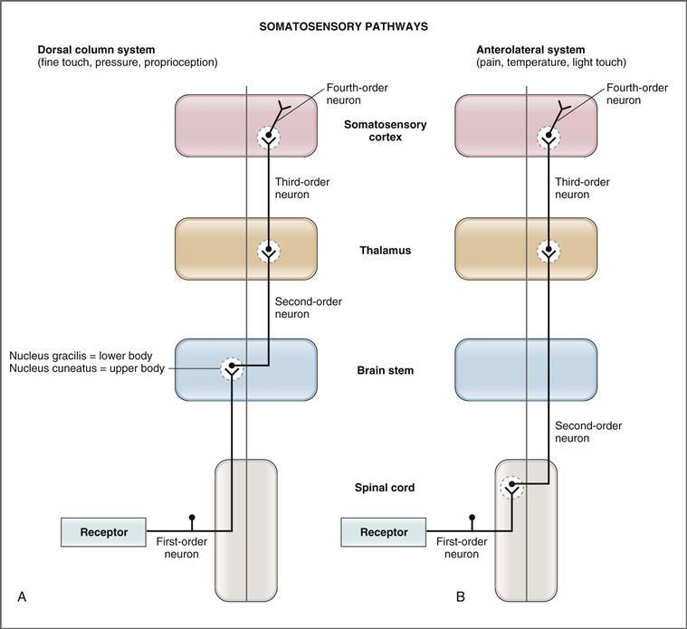

**그림 3–10 등주(A)와 전외측(B) 체성감각 시스템의 비교.** 등주 시스템은 뇌간의 정중선을 가로지릅니다. 전외측 시스템은 척수의 정중선을 통과합니다.

1. 체성감각 경로의 **1차 뉴런**은 1차 구심성 뉴런입니다. 일차 구심성 뉴런은 등근 또는 두개골 신경절에 세포체가 있고, 축색돌기는 체성감각 수용체 세포(즉, 기계 수용체)에 시냅스를 두고 있습니다. 신호는 수용체에 의해 변환되고 일차 구심성 뉴런에 의해 중추신경계로 전달됩니다.
2. **2차 뉴런**은 척수(전외측 시스템) 또는 뇌간(등쪽 기둥 시스템)에 위치합니다. 2차 뉴런은 1차 뉴런으로부터 정보를 받아 그 정보를 시상으로 전달합니다. 2차 뉴런의 축삭돌기는 척수나 뇌간에서 **정중선**을 가로질러 시상으로 올라갑니다. 이 논의는 신체 한쪽의 체성감각 정보가 반대쪽 시상에서 수신된다는 것을 의미합니다.
3. **3차 뉴런**은 시상의 체성감각 핵 중 하나에 위치합니다. 시상에는 체성 감각 정보의 체성 배열이 있습니다.
4. **4차 뉴런**은 S1과 S2라고 불리는 체성감각 피질에 위치합니다. 체성감각 피질 및 기타 연관 피질 영역의 고차 뉴런은 복잡한 정보를 통합합니다. S1 체성감각 피질은 시상과 유사한 체성 표상, 즉 "지도"를 가지고 있습니다. 이 신체 지도를 **체성 감각 호문쿨루스**라고 합니다([그림 3-11](#filepos394738)). 신체를 가장 많이 표현하는 부위는 얼굴, 손, 손가락으로 체성감각신경이 밀집되어 있어 민감도가 가장 높은 부위이다. 감각 호문쿨루스는 체성 감각 정보의 "장소" 코딩을 보여줍니다.

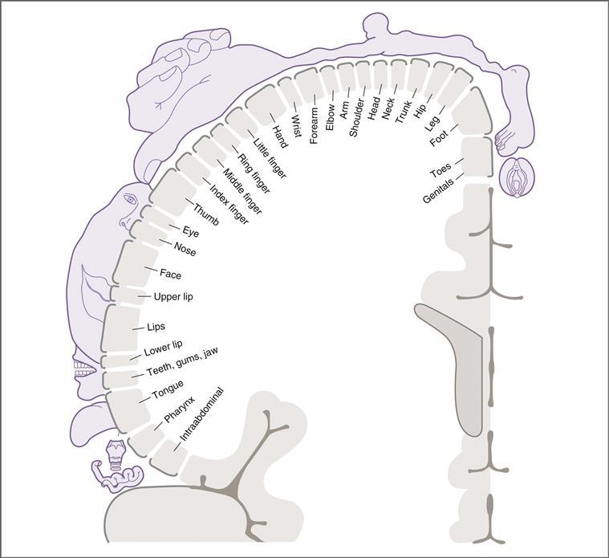

**그림 3–11 체성감각 호문쿨루스.** (Wilder P, Rasmussen T: The Cerebral Cortex of Man. New York, Macmillan, 1950에서 수정됨. The Gale Group의 허가를 받아 재인쇄됨.)

##### *등 기둥 시스템*

등주 시스템은 **차별적 촉각, 압력, 진동, 두 지점 식별** 및 **고유 감각**에 대한 체성감각 정보를 전달하는 데 사용됩니다. 등주 시스템은 주로 그룹 I 및 II 신경 섬유로 구성됩니다. 1차 뉴런은 등근 신경절 세포 또는 뇌신경 신경절 세포에 세포체가 있으며 뇌간의 수질에 있는 **박근핵**(하체) 또는 **핵핵**(상체)으로 동측으로 상승합니다. 수질에서 1차 뉴런은 *정중선을 가로지르는* 2차 뉴런과 시냅스를 이룹니다. 2차 뉴런은 반대쪽 시상으로 올라가서 3차 뉴런과 시냅스를 이루고, 체감각 피질로 올라가는 3차 뉴런과 4차 뉴런과 시냅스를 맺습니다.

##### *전외측 시스템*

전외측(척수시상) 시스템은 **통증, 온도** 및 **가벼운 접촉**에 대한 체성감각 정보를 전송합니다. 전외측 시스템은 주로 그룹 III 및 그룹 IV 섬유로 구성됩니다. (그룹 IV 섬유는 모든 감각 신경 중 전도 속도가 가장 느리다는 점을 기억하십시오.) 전외측 시스템에서 1차 뉴런은 등뿔에 세포체가 있고 피부의 열수용체 및 통각수용체에 시냅스가 있습니다. 1차 뉴런은 척수의 2차 뉴런과 시냅스를 이룹니다. 척수에서 2차 뉴런은 *정중선*을 가로질러 반대쪽 시상으로 올라갑니다. 시상에서 2차 뉴런은 3차 뉴런과 시냅스를 이루고 체감각 피질로 올라가며 4차 뉴런과 시냅스를 이룹니다.

**빠른 통증**(예: 핀 찌르기)은 A 델타, 그룹 II 및 그룹 III 섬유에 전달되며 빠르게 시작되고 사라지며 정확하게 국소화됩니다. **느린 통증**(예: 화상)은 C 섬유에 전달되며 국소적이지 않은 아프거나 화끈거리거나 욱신거리는 통증이 특징입니다.

**연관통**은 내장에서 비롯됩니다. 통증은 **피부분절 법칙**에 따라 "참조"되는데, 이는 피부 부위가 내장 기관을 지배하는 척수 분절과 동일한 척수 분절에서 발생하는 신경의 지배를 받는다는 것입니다. 따라서 피부분절 법칙에 따르면 허혈성 심장 통증은 가슴과 어깨, 담낭 통증은 복부, 신장 통증은 허리 등으로 분류됩니다.

### 비전

시각 시스템은 전자기파인 빛 자극을 감지하고 해석합니다. 눈은 빛의 두 가지 특성, 즉 밝기와 파장을 구별할 수 있습니다. 인간의 경우 400~750나노미터 사이의 파장을 **가시광선**이라고 합니다.

#### 눈의 구조

눈의 주요 구조는 [그림 3-12](#filepos399614)와 같다. 눈의 벽은 3개의 동심원 층, 즉 외부층, 중간층, 내부층으로 구성됩니다. 섬유질인 바깥층에는 각막, 각막 상피, 결막 및 공막이 포함됩니다. 혈관인 중간층에는 홍채와 맥락막이 포함됩니다. 신경층인 내부 층에는 망막이 포함되어 있습니다. 망막의 기능적 부분은 **시신경유두**(시신경의 머리)인 **맹점**을 제외하고 눈 뒤쪽 전체를 덮습니다. 시력은 **황반**이라고 불리는 망막의 중앙 지점에서 가장 높습니다. 빛은 **중심와**라고 불리는 황반의 함몰 부위에 집중됩니다. 눈에는 또한 빛의 초점을 맞추는 수정체가 포함되어 있습니다. 빛을 흡수하고 산란을 감소시키는 안료; 그리고 두 가지 액체, 즉 방수와 유리액이 있습니다. **방수**는 눈의 전방을 채우고 **유리체액**은 눈의 후방을 채웁니다.

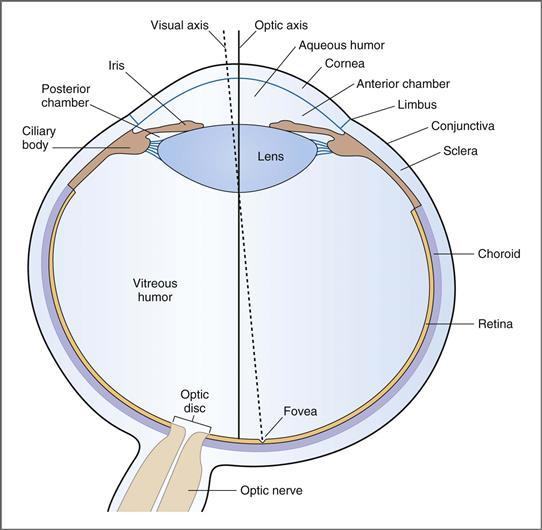

**그림 3–12 눈의 구조.**

시각에 대한 감각 수용체는 망막에 위치한 **광수용체**입니다. 광수용체에는 막대형과 원뿔형의 두 가지 유형이 있습니다([표 3-4](#filepos400518)). **간상체**는 임계값이 낮고 낮은 강도의 빛에 민감하며 어둠 속에서도 잘 작동합니다. 간상체는 시력이 낮고 색각에 참여하지 않습니다. **원뿔**은 간상체보다 빛에 대한 임계값이 더 높고, 일광에서 가장 잘 작동하며, 더 높은 시력을 제공하고 색각에 참여합니다. 원뿔은 낮은 강도의 빛에 민감하지 않습니다.

표 3-4 막대와 원뿔의 특성

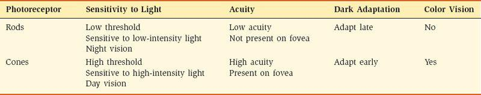

정보는 망막의 광수용체에 의해 수신되고 변환된 후 망막 신경절 세포의 축색돌기를 통해 중추신경계로 전달됩니다. 일부 시신경은 시신경교차에서 교차하고 다른 시신경은 동측으로 계속됩니다. 주요 시각 경로는 시각 피질로 투사되는 시상의 등쪽 외측 슬상핵을 통과하는 것입니다.

#### 광수용

##### *망막의 층*

망막은 광수용체와 층으로 배열된 다른 세포 유형을 포함하는 특수한 감각 상피입니다. 망막 세포에는 광수용체, 개재뉴런(양극 세포, 수평 세포, 무축삭 세포) 및 신경절 세포가 포함됩니다. 시냅스는 두 개의 망상층, 즉 외부 망상층과 내부 망상층의 세포 사이에서 만들어집니다. *망막의 층*은 다음과 같이 설명되며 [그림 3-13](#filepos401885)의 원 안의 숫자에 해당됩니다.

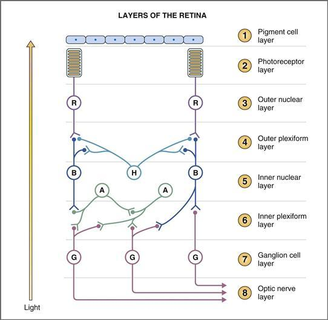

**그림 3–13 망막의 층.** 망막의 출력 세포는 망막 신경절 세포이며, 그 축삭은 시신경을 형성합니다. 원 안의 숫자는 본문에 설명된 망막의 층에 해당합니다. *A,* 무축삭 세포; *B,* 양극성 세포; *G,* 신경절 세포; *H,* 수평 셀; *R,* 광수용체.

1. **색소세포층.** 망막은 **색소상피**층으로 맥락막 바로 안쪽에서 시작됩니다([그림 3-12](#filepos399614) 참조). 색소 상피 세포는 미광을 흡수하고 광수용체 사이의 빛 산란을 방지하기 위해 광수용체 층으로 확장되는 촉수와 같은 돌기를 가지고 있습니다. 색소 세포는 또한 all-*trans-*retinal을 11-*cis-*retinal로 전환하고 11-*cis* 형태를 광수용체에 전달합니다(광수용 단계 참조).
2. **광수용체층.** 광수용체는 간상체와 원뿔체로, 세포체, 외부 분절, 내부 분절로 구성됩니다. 이 그림에는 막대만 표시되어 있습니다.
3. **외부 핵층.** 광수용체 핵(*R*)은 외부 핵층에 포함되어 있습니다.
4. **외망상층.** 외부망상층은 망막의 광수용체와 개재뉴런의 시냅스전 및 시냅스후 요소를 포함하는 시냅스층입니다. (망막 개재뉴런의 세포체는 내부 핵층에 포함되어 있습니다.) 시냅스는 광수용체와 개재뉴런 사이, 그리고 개재뉴런 자체 사이에도 만들어집니다.
5. **내부 핵층.** 내부 핵층에는 양극성 세포(B), 수평 세포(H) 및 무축삭 세포(A)를 포함한 망막 개재뉴런의 세포체가 포함되어 있습니다.
6. **내부 망상층.** 내부 망상층은 두 번째 시냅스 층입니다. 이는 망막 개재뉴런의 시냅스전 및 시냅스후 요소를 포함합니다. 망막 개재뉴런과 신경절 세포 사이에는 시냅스가 만들어집니다.
7. **신경절 세포층.** 신경절 세포층에는 망막의 출력 세포인 신경절 세포(G)의 세포체가 포함되어 있습니다.
8. **시신경층.** 망막 신경절 세포의 축삭이 시신경층을 형성합니다. 이 축삭은 망막을 통과하여(황반을 피하여) 시신경 유두로 들어가고 시신경에서 눈을 떠납니다.

앞서 언급한 바와 같이 간상체와 원추체 사이에는 시력의 차이가 있는데, 이는 망막 회로의 차이로 설명할 수 있습니다([표 3-4](#filepos400518) 참조). 단지 *몇몇*
**원추**는 단일 양극성 세포에서 시냅스를 형성하며, 이는 단일 신경절 세포에서 시냅스를 형성합니다. 이러한 배열은 원뿔의 예민도는 높고 감도는 낮은 이유를 설명합니다. 시력은 하나의 원뿔이 하나의 양극성 세포와 시냅스되는 중심와(fovea)에서 가장 높으며, 이는 하나의 신경절 세포와 시냅스됩니다. 그에 비해 *많은*
**간상체**는 단일 양극성 세포의 시냅스입니다. 이러한 배열은 간체의 예리함은 낮지만 민감도는 더 높은 이유를 설명합니다. 간체 중 어느 하나에 빛이 닿으면 양극성 세포가 활성화됩니다.

##### *광수용체의 구조*

앞서 설명한 바와 같이 광수용체인 간상체와 원추체는 망막의 여러 층에 걸쳐 있습니다. 광수용체의 외부 및 내부 세그먼트는 광수용체 층에 위치하고, 핵은 외부 핵층에 위치하며, 시냅스 말단(양극 세포 및 수평 세포의)은 외부 망상층에 위치합니다. 막대와 원뿔의 구조는 [그림 3-14](#filepos406204)와 같다.

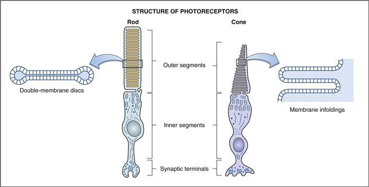

**그림 3–14 광수용체의 구조.** 확대 사진은 외부 부분을 확대한 모습을 보여줍니다.

간상체와 원뿔체의 **바깥쪽 부분**에는 빛에 민감한 색소(광색소)인 **로돕신**이 포함되어 있습니다. 간상체의 바깥쪽 부분은 길며 다량의 로돕신을 함유한 자유 부동 이중막 원반의 더미로 구성됩니다. 원뿔은 짧은 원뿔 모양의 외부 부분을 가지고 있으며, 이는 표면 막이 접힌 부분으로 구성됩니다. 이 접힌 막에는 로돕신도 포함되어 있지만 막대에 존재하는 것보다 적은 양입니다. 광색소의 양이 많을수록 빛에 대한 민감도가 높아지는데, 이는 부분적으로 막대의 광 민감도가 더 커지는 이유입니다. *단일 광자 하나가 막대를 활성화할 수 있는 반면, 원뿔을 활성화하려면 수백 개의 광자가 필요합니다.*

막대와 원뿔의 **내부 세그먼트**는 단일 섬모로 외부 세그먼트에 연결됩니다. 내부 부분에는 미토콘드리아와 기타 소기관이 포함되어 있습니다. 로돕신은 내부 분절에서 합성된 후 다음과 같이 외부 분절의 막에 통합됩니다. *간상체*에서 로돕신은 외부 분절을 향해 이동되는 새로운 막 디스크에 삽입됩니다. 결국 그들은 색소 세포 상피에 의해 흘려지고 식균 작용을 하여 바깥 부분에 막대 모양의 모양을 갖게 됩니다. *원뿔*에서 로돕신은 벗겨짐 과정 없이 막 주름에 무작위로 통합됩니다.

##### *광수용 단계*

광수용은 빛 에너지를 전기 에너지로 변환하는 막대와 원뿔의 변환 과정입니다. **로돕신**은 감광성 색소로 옵신(G 단백질 결합 수용체의 슈퍼패밀리에 속하는 단백질)과 레티날(비타민 A의 알데히드)로 구성됩니다. 빛이 광수용체에 닿으면 레티날은 광이성질화라는 과정을 통해 화학적으로 변형되며, 이것이 변환 과정을 시작합니다. 다음과 같이 설명되는 광수용 단계는 [그림 3-15](#filepos408751)에 표시된 원 안의 숫자에 해당합니다.

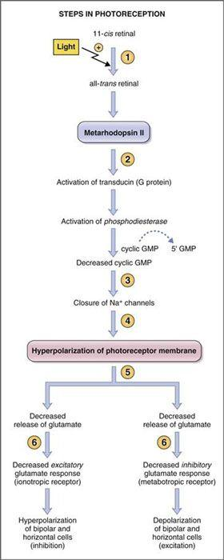

**그림 3–15 광수용 단계.** 빛이 망막에 닿으면 광수용체가 과분극됩니다. 결과적으로 광수용체는 글루타메이트 방출을 감소시켜 양극성 또는 수평 세포의 과분극 또는 탈분극을 초래합니다. 원으로 표시된 숫자는 텍스트에 설명된 단계와 연관되어 있습니다. 고리형 GMP, 고리형 구아노신 모노포스페이트; GMP, 구아노신 모노포스페이트.

1. **빛**이 망막에 닿으면 망막의 **광이성질체화**가 시작됩니다. 11-*시스* 레티날은 모두-*트랜스* 레티날로 변환됩니다. 거기서부터 옵신에서 일련의 구조적 변화가 일어나 **메타로돕신 II**를 생성하게 됩니다. (11-*시스* 레티날을 재생하려면 **비타민 A**가 필요하며, 비타민 A가 부족하면 **야맹증**이 발생합니다.)
2. 메타로돕신 II는 **트랜스듀신** 또는 **Gt**라고 불리는 G 단백질을 활성화합니다. 활성화되면 트랜스듀신은 고리형 구아노신 일인산(GMP)이 5'-GMP로 전환되는 과정을 촉매하는 포스포디에스테라제를 자극합니다. 결과적으로 순환 GMP의 분해가 증가하여 순환 GMP 수준이 감소합니다.
3. 및 4. 광수용체 막에서 내부 전류를 전달하는 **Na+ 채널**은 순환 GMP에 의해 조절됩니다. **어두운 곳**에서는 주기적 GMP 수준이 증가하여 Na+ 내부 전류(또는 "**암흑 전류**")와 광수용막의 **탈분극**을 생성합니다. **빛**에서는 이미 설명한 대로 주기적 GMP 수준이 감소하여 광수용체 막의 Na+ 채널이 닫히고 내부 Na+ 전류가 감소하며 **과분극이 발생합니다.**
4. 광수용체 막의 **과분극**은 광수용체의 시냅스 말단에서 흥분성 신경전달물질인 글루타메이트**의 방출을 ***감소*합니다. ([그림 3-13](#filepos401885)에서 광수용체는 양극성 세포와 외망상층의 수평 세포에서 시냅스를 형성한다는 것을 기억하세요.)
5. 양극성 및 수평 세포에는 두 가지 **유형의 글루타메이트 수용체**가 있습니다. 즉, 탈분극(흥분성)되는 이온성 수용체와 과분극성(억제성)인 대사성 수용체입니다. 양극성 또는 수평 세포의 수용체 유형에 따라 반응이 탈분극(흥분)인지 과분극(억제)인지가 결정됩니다. 따라서 **이온성 수용체**와 상호작용하는 글루타메이트의 *감소* 방출은 양극성 또는 수평 세포의 과분극 및 억제(즉, 흥분 감소)를 초래합니다. 그리고 **대사촉진 수용체**와 상호작용하는 글루타메이트의 방출 *감소*는 양극성 또는 수평 세포의 탈분극 및 흥분을 초래합니다(즉, 억제 감소는 흥분을 유발합니다). 이 프로세스는 시야에 대한 **온-오프 패턴**을 설정합니다.

##### *시각적 수용 필드*

시각 경로의 각 수준은 수용 영역으로 설명될 수 있습니다. 따라서 광수용체, 양극 및 수평 세포, 신경절 세포, 시상에 있는 외측 슬상체 세포, 시각 피질에 있는 세포에 대한 수용 영역이 있습니다. 각 상위 수준에서 수용 필드는 점점 더 복잡해집니다.

###### 광수용체, 수평 세포 및 양극성 세포

[그림 3-16](#filepos414750)은 시각적 수용 영역의 간단한 배열을 보여준다. 그림은 세 개의 광수용체, 두 개의 양극성 세포, 양극성 세포 사이에 위치한 하나의 수평 세포에 대한 수용 영역을 보여줍니다. 빛이 광수용체에 닿으면 광수용체에 마이너스 기호로 표시된 대로 *항상* 과분극되어 글루타메이트 양이 *감소* 방출됩니다(광수용 단계를 기억하세요). 광수용체는 망막의 외망상층에 있는 양극성 세포에 직접 시냅스를 형성합니다. 양극성 세포의 수용장은 두 개의 동심원으로 표시됩니다. 안쪽 원을 "중심"이라고 하고 바깥쪽 원을 "서라운드"라고 합니다. 양극성 세포의 수용 장의 중심은 광수용체로부터의 직접적인 연결을 나타내며 앞서 설명한 바와 같이 양극성 세포의 글루타메이트 수용체 유형에 따라 흥분(*on*)되거나 억제(*off*)될 수 있습니다. 수용 장의 중심에 대사성 글루타메이트 수용체가 있으면 양극성 세포가 흥분됩니다(+). 수용 장의 중앙에 이온성 글루타메이트 수용체가 있으면 양극성 세포가 억제됩니다(-). 양극성 세포의 수용 영역 주변은 수평 세포를 통해 인접한 광수용체로부터 입력을 받습니다. 수용 장의 주변은 중앙의 *반대* 반응을 보여줍니다. 왜냐하면 수평 세포는 억제적이기 때문입니다(즉, 양극성 세포에 있는 광수용체의 직접 반응을 역전시킵니다). 양극성 세포의 수용 영역에 대한 두 가지 패턴은 [그림 3-16](#filepos414750)에 설명되어 있으며 다음과 같습니다.

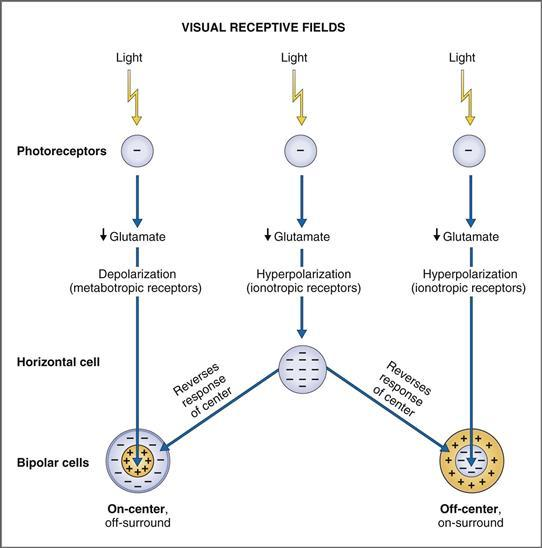

**그림 3–16** **망막에 있는 양극성 세포의 시각 수용 영역**. 온센터(on-center)와 오프센터(off-center)라는 두 가지 패턴이 표시됩니다.

 **중앙에, 서라운드에서 벗어나**(또는 “중앙에”). 이 패턴은 그림 왼쪽에 표시된 양극 셀에 설명되어 있습니다. 수용 장의 중심은 빛에 의해 자극되고(*on*) 수용 장 주변은 빛에 의해 억제됩니다(*off*). *이 패턴은 어떻게 달성됩니까?* 항상 그렇듯이 광수용체에 빛이 닿으면 과분극이 발생하고 글루타메이트 방출이 감소합니다. 이 광수용체는 양극성 세포 수용 영역의 *중심*에 연결되어 있으며 글루타메이트는 대사성 수용체에 결합합니다. 따라서 수용 장의 중심이 흥분됩니다(즉, 억제가 감소하면 흥분이 생성됩니다). 빛은 또한 수평 세포의 이온성 수용체에 결합하는 인접한 광수용체를 억제하여 수평 세포를 억제합니다. 수평 세포는 양극성 세포 수용 장의 *주위*에 연결됩니다. 수평 세포가 억제되기 때문에 양극성 세포에 대한 광수용체의 직접적인 작용을 역전시키고 주변에서 억제를 생성합니다.

 **중심에서 벗어난, 서라운드에서**(또는 "중심에서 벗어난"). 이 패턴은 그림 오른쪽에 표시된 양극 셀에 설명되어 있습니다. 수용 장의 중심은 빛에 의해 억제(*꺼짐*)되고 주변은 빛에 의해 자극(*켜짐*)됩니다. *이 패턴은 어떻게 달성됩니까?* 다시 말하지만, 광수용체에 빛이 닿으면 억제가 발생합니다. 이 광수용체는 양극성 세포의 수용 영역 중앙에 연결되어 있으며 이온성 수용체와 결합합니다. 따라서 수용 장의 *중심*이 억제됩니다. 빛은 또한 인접한 광수용체를 억제하여 수평 세포를 억제합니다. 수평 세포는 양극성 세포 수용 장의 *주위*에 연결됩니다. 수평 세포가 억제되기 때문에 양극성 세포에 대한 광수용체의 직접적인 작용을 역전시키고 주변에 여기를 생성합니다.

###### 아마크린 세포

무축삭 세포는 중심에 있는 양극성 세포와 중심에서 벗어난 양극성 세포의 다양한 조합으로부터 입력을 받습니다. 따라서 무축삭 세포의 수용 영역은 중심 중심 패턴과 중심 중심 패턴의 혼합입니다.

###### 신경절 세포

신경절 세포는 양극성 세포와 무축삭 세포 모두로부터 입력을 받습니다([그림 3-13](#filepos401885) 참조). 신경절 세포에 대한 입력이 주로 양극성 세포로부터 오는 경우, 신경절 세포는 양극성 세포 수준에서 확립된 중심 중심 및 중심 이탈 패턴을 유지합니다. 신경절 세포로의 입력이 주로 무축삭 세포로부터 오는 경우, 무축삭 세포 수준에서 입력이 혼합되었기 때문에 수용 영역이 분산되는 경향이 있습니다.

###### 시상의 외측 생식세포

시상의 측면 슬상체 세포는 신경절 세포에서 전달된 중심 중심 또는 중심 이탈 패턴을 유지합니다.

###### 시각 피질

시각 피질의 뉴런은 도형의 모양과 방향을 감지합니다. 이러한 유형의 시각적 구별에는 단순 세포, 복합 세포 및 초복합 세포의 세 가지 세포 유형이 포함됩니다. **단순 세포**는 신경절 세포 및 외측 슬상 세포(즉, 중심 또는 중심 외)와 유사한 수용 영역을 가지고 있지만 패턴은 동심원이 아닌 길쭉한 막대 모양입니다. 단순 세포는 "올바른" 위치와 방향을 가진 빛 막대에 가장 잘 반응합니다. **복잡한 셀**은 올바른 방향으로 움직이는 빛의 막대나 빛의 가장자리에 가장 잘 반응합니다. **초복합 세포**는 특정 길이의 선, 곡선 및 각도에 가장 잘 반응합니다.

#### 광학 경로

망막에서 중추신경계까지의 시신경 경로는 [그림 3-17](#filepos419919)과 같습니다. 망막 신경절 세포의 축삭은 시신경과 시신경로를 형성하고, 시상의 외측 슬상체에서 시냅스를 이루고, 제니쿨로카린로의 시각 피질로 올라갑니다.

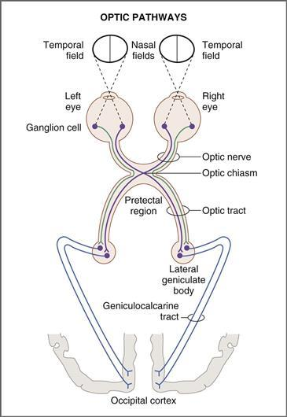

**그림 3–17 시신경 경로.** 측두 시야의 섬유는 시교차에서 교차하지만 비강 시야의 섬유는 교차되지 않은 상태로 유지됩니다. (Ganong WF: 의료 생리학 검토, 20판 Norwalk, Conn, Appleton & Lange, 2001에서 수정됨.)

측두 시야는 코 망막에 투사되고, 코 시야는 측두 망막에 투사됩니다. 각 **비측반망막**의 신경 섬유는 **시신경교차**에서 교차하여 반대쪽으로 올라갑니다. 각 **측두반망막**의 신경 섬유는 교차되지 않고 동측으로 올라갑니다. 따라서 *왼쪽* 비강 편망막의 섬유와 *오른쪽* 관자반망막의 섬유는 *오른쪽* 시신경로를 형성하고 *오른쪽* 외측 슬상체의 시냅스를 형성합니다. 반대로, *오른쪽* 비강 편망막의 섬유와 *왼쪽* 관자반망막의 섬유는 *왼쪽* 시신경로를 형성하고 *왼쪽* 외측 슬상체의 시냅스를 형성합니다. 측면 슬상체의 섬유는 **시각 피질**(후두엽의 17번 영역)까지 올라가는 **유전자 국소 카린 관**을 형성합니다. 오른쪽 측면 무릎체의 섬유는 오른쪽 무릎로컬카린관을 형성합니다. 왼쪽 측면 무릎체의 섬유는 왼쪽 무릎로카린관을 형성합니다.

시신경 경로의 여러 지점에서 병변이 발생하면 시력 장애가 발생하는데, 이는 [그림 3-18](#filepos422214)과 같이 경로를 추적하여 예측할 수 있습니다. **반맹**은 한쪽 눈 또는 양쪽 눈 시야의 절반이 시력을 상실하는 현상입니다. 병변이 신체의 같은 쪽에 발생하는 경우 이를 동측성이라고 합니다. 병변이 신체의 반대쪽에 손실이 발생하는 경우 반대쪽이라고 합니다. 다음 **병변**은 그림의 음영 처리된 막대와 원 안의 숫자에 해당합니다.

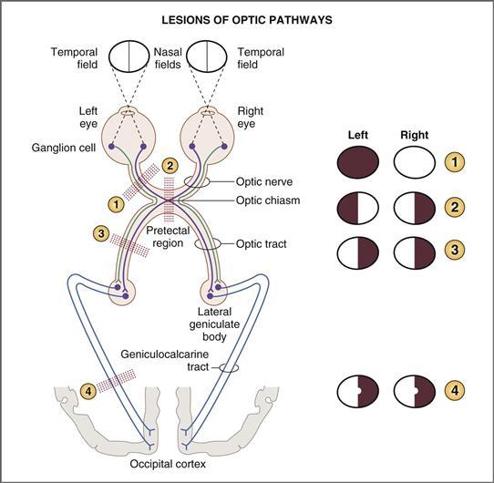

**그림 3–18 시각 경로의 다양한 수준에서 병변으로 인해 발생하는 시야 결함.** 원 안의 숫자는 결함을 나타내며 본문에 설명되어 있습니다. (Ganong WF: 의료 생리학 검토, 20판 Norwalk, Conn, Appleton & Lange, 2001에서 수정됨.)

1. **시신경.** 시신경을 절단하면 동측(같은 쪽) 눈의 실명이 발생합니다. 따라서 왼쪽 시신경을 절단하면 왼쪽 눈의 실명이 발생합니다. 그 눈에서 나오는 모든 감각 정보는 시신경 교차점에서 섬유가 교차하기 전에 절단이 발생하기 때문에 손실됩니다.
2. **시교차.** 시교차를 절단하면 이형(양쪽 눈) 양측측(양쪽 측두 시야) 반맹이 발생합니다. 즉, 교차하는 섬유에서 *모든 정보가 손실됩니다.* 따라서 이 섬유가 시신경 교차에서 교차하기 때문에 *양쪽* 눈의 시간적 시야 정보가 손실됩니다.
3. **시신경로.** 시신경로를 절단하면 동측 반대쪽 반맹이 발생합니다. 그림에 표시된 대로 왼쪽 시신경을 절단하면 오른쪽 눈의 측두 시야(교차)가 손실되고 왼쪽 눈의 비강 시야(교차)가 손실됩니다.
4. **제니큐로카린관.** 제니큐로카린관을 절단하면 **황반 보존**과 함께 동측 반대쪽 반맹이 발생합니다(황반의 시야는 손상되지 않음). 황반 보존은 시각 피질의 병변이 황반을 나타내는 모든 뉴런을 파괴하지 않기 때문에 발생합니다.

### 오디션

청각인 청각은 음파를 전기 에너지로 변환한 후 신경계로 전달될 수 있는 과정을 포함합니다. 소리는 공기나 물과 같은 탄성 매체를 통해 전달되는 압축 및 감압 파동에 의해 생성됩니다. 이러한 파동은 압력의 증가(압축) 및 감소(감압)와 관련이 있습니다. 음압을 표현하는 단위는 **데시벨(dB)**이며 이는 로그 스케일의 상대적 측정값입니다. 사운드 주파수는 초당 사이클 또는 **헤르츠(Hz)**로 측정됩니다. 순수 톤은 단일 주파수의 정현파에서 생성됩니다.

대부분의 소리는 순음의 혼합입니다. 인간의 귀는 **20~20,000Hz** 주파수의 음조에 민감하며, 2000~5000Hz 사이가 가장 민감합니다. 기준 0dB는 1000Hz에서 들을 수 있는 평균 임계값입니다. 음압(dB)은 다음과 같이 계산됩니다.

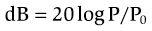

어디서

|  |  |
| --- | --- |
| 데시벨 | = 데시벨 |
| 피 | = 측정 중인 음압 |
| P0 | = 임계 주파수에서 측정된 기준 압력 |

따라서 음압이 기준압력의 10배이면 20dB(20×log10=20×1=20dB)가 된다. 음압이 기준압력의 100배이면 40dB(20×log100=20×2=40dB)이다.

인간 음성의 일반적인 주파수 범위는 300~3500Hz이고 소리 강도는 약 65dB입니다. 100dB보다 큰 소리 강도는 청각 기관에 손상을 줄 수 있고, 120dB보다 큰 소리 강도는 통증을 유발할 수 있습니다.

#### 귀의 구조

외이, 중이, 내이의 구조는 [그림 3-19](#filepos426667)와 같으며, 그 설명은 다음과 같다.

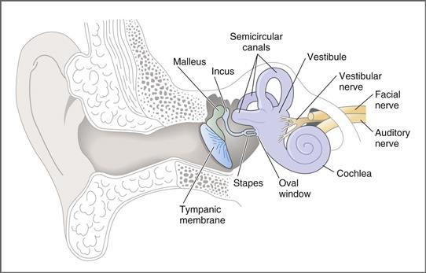

**그림 3–19 외이, 중이, 내이의 구조.** 시각화를 위해 달팽이관을 약간 회전시켰습니다.

 **외이**는 귓바퀴와 외이도(이도)로 구성됩니다. 외이의 기능은 음파를 이도로 전달하는 것입니다. 외이에는 공기가 채워져 있습니다.

 **중이**는 **고막**과 **추골**, **침골**, **등골**이라고 불리는 일련의 청각 뼈로 구성됩니다. 고막은 외이와 중이를 분리합니다. 중이와 내이 사이에는 타원형 창과 둥근 창이 있습니다. 등골에는 발판이 있어 타원형 창에 삽입되어 중이와 내이 사이의 인터페이스를 제공합니다. 중이에는 공기가 채워져 있습니다.

 **내이**는 뼈성 미로와 막성 미로로 구성되어 있습니다. 뼈미로는 3개의 **반고리관**(측면, 후방, 상부)으로 구성됩니다. 막미로는 전정계, 고실계, 중계라고 불리는 일련의 관으로 구성됩니다.  
    달팽이관과 현관은 뼈와 막미로로 구성됩니다. 세 개의 관형 관 또는 관으로 ​​구성된 나선형 구조인 **달팽이관**에는 코르티 기관이 들어 있습니다. **코르티 기관**에는 수용체 세포가 포함되어 있으며 청각 전달 부위입니다. 내이는 액체로 채워져 있으며, 각 관의 액체는 서로 다른 구성을 가지고 있습니다. 전정계와 고실계에 있는 체액을 **외림프**라고 하며, 이는 세포외액과 유사합니다. 스칼라 매체의 체액은 **내림프**라고 하며, 여기에는 **고칼륨**(**K+**) 농도와 낮은 나트륨(Na+) 농도가 있습니다. 따라서 내림프는 기술적으로는 세포외액임에도 불구하고 그 구성이 세포내액과 유사하다는 점에서 특이합니다.

#### 청각 전달

청각 변환은 음압을 전기 에너지로 변환하는 것입니다. 귀의 많은 구조가 이 변환 과정에 직접 또는 간접적으로 참여합니다. 외이와 중이는 공기로 채워져 있고, 코르티 기관이 들어 있는 내이는 체액으로 채워져 있다는 점을 기억하세요. 따라서 변환이 일어나기 전에 공기를 통해 이동하는 음파는 유체의 압력파로 변환되어야 합니다. 유체의 음향 임피던스는 공기의 음향 임피던스보다 훨씬 큽니다. 고막과 이소골의 결합은 이러한 변환을 수행하는 임피던스 매칭 장치 역할을 합니다. 임피던스 매칭은 난원창의 작은 표면적에 대한 고막의 넓은 표면적 비율과 이소골의 레버 시스템이 제공하는 기계적 이점에 의해 달성됩니다.

외이는 음파를 이도로 전달하고, 이도는 음파를 고막으로 전달합니다. 음파가 고막을 움직일 때 이소골 사슬도 움직여 등골의 발판을 난원창 안으로 밀어 넣고 내이의 체액을 대체합니다.

##### *달팽이관과 코르티 기관*

달팽이관에는 감각 전달 기관인 코르티 기관이 들어 있습니다. 달팽이관과 코르티기관의 구조는 [그림 3-20](#filepos430931)과 같다.

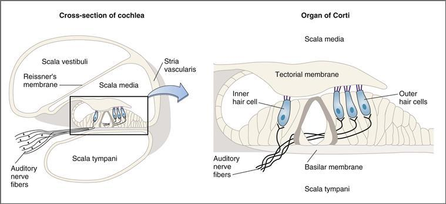

**그림 3–20 달팽이관과 코르티 기관의 구조.**

**달팽이관의 단면**은 전정계, 중계계, 고실계라는 세 개의 방을 보여줍니다. 각 방은 체액으로 채워져 있으며 전정계와 고실계는 외림프, 중계는 내림프로 구성되어 있습니다. 전정계는 Reissner 막에 의해 중계와 분리됩니다. 기저막은 중계계와 고실계를 분리합니다.

**코르티 기관**은 달팽이관의 기저막에 위치하며 중질계에 포함된 내림프에 잠겨 있습니다. 코르티 기관의 청각 유모 세포는 청각 전달 부위입니다. 코르티 기관에는 내부 유모 세포와 외부 유모 세포의 두 가지 유형의 수용체 세포가 포함되어 있습니다. 한 줄로 배열된 **내부 유모세포**가 더 적습니다. **외부 유모세포**는 평행한 열로 배열되어 있으며 내부 유모세포보다 그 수가 더 많습니다. 유모세포에서 튀어나온 섬모는 장막에 박혀 있습니다. 따라서 유모세포의 몸체는 기저막과 접촉하고, 유모세포의 섬모는 지각막과 접촉합니다.

코르티 기관을 담당하는 신경은 전정와우 신경(**CN VIII**)에 포함되어 있습니다. 이 신경의 세포체는 나선 신경절에 위치하며 축삭은 유모 세포 기저부에서 시냅스를 형성합니다. 이 신경은 청각 유모 세포에서 CNS로 정보를 전달합니다.

##### *청각 전달의 단계*

코르티 기관의 청각 유모 세포에 의한 음파의 변환 이전에 몇 가지 중요한 단계가 있습니다. 음파는 고막을 향해 전달되고, 고막이 진동함에 따라 이소골이 진동하고 등골이 난원창으로 밀려나게 됩니다. 이 움직임은 달팽이관의 체액을 대체합니다. 소리 에너지는 이소골의 지렛대 작용과 큰 고막에서 작은 타원형 창으로 음파가 집중되는 두 가지 효과에 의해 **증폭**됩니다. 따라서 음파는 공기로 채워진 외이와 중이에서 수용기가 있는 체액으로 채워진 내이로 전달되고 증폭됩니다.

**코르티 기관**의 유모 세포에 의한 청각 변환은 다음 단계로 발생합니다([그림 3-21](#filepos433776)).

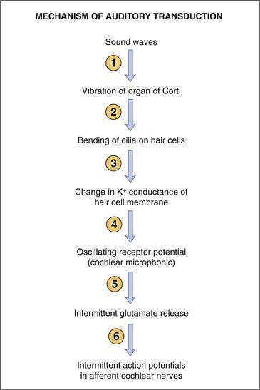

**그림 3–21 유모세포의 청각 전달 단계.** 원 안의 숫자는 본문에 설명된 단계에 해당합니다.

1. 음파는 내이로 전달되어 코르티 기관의 **진동**을 유발합니다.
2. **청각유모세포**는 기계수용체로서 코르티(Corti) 기관에 위치합니다([그림 3-20](#filepos430931) 참조). 유모세포의 기저부는 기저막에 위치하며, 유모세포의 섬모는 유모막에 내장되어 있습니다. 기저막은 지각막보다 더 탄력적입니다. 따라서 코르티 기관의 진동은 섬모가 점막을 밀 때 전단력에 의해 유모 세포에 **섬모가 휘어짐**을 유발합니다.
3. 섬모가 구부러지면 유모세포막의 **K+ 전도도**에 변화가 생깁니다. 한 방향으로 구부리면 K+ 전도도와 과분극이 증가합니다. 다른 방향으로 구부리면 K+ 전도도와 탈분극이 감소합니다.
4. 이러한 막 전위의 변화는 청각 유모 세포의 수용체 전위입니다. 진동 수용체 전위를 **와우각 마이크로포닉 전위**라고 합니다.
5. 유모세포가 탈분극될 때, 탈분극은 유모세포의 시냅스전 말단에 있는 전압 개폐 Ca2+ 채널을 엽니다. 결과적으로 Ca2+는 시냅스 전 말단으로 들어가 여기에서 흥분성 신경 전달 물질로 기능하는 글루타메이트의 방출을 유발하여 이 정보를 CNS로 전송하는 구심성 달팽이관 신경에 활동 전위를 유발합니다. 유모 세포가 *과분극*되면 반대 현상이 발생하고 글루타메이트 방출이 감소합니다.
6. 따라서 유모 세포의 진동하는 탈분극 및 과분극 수용체 전위는 간헐적인 글루타메이트 방출을 유발하여 구심성 달팽이관 신경의 간헐적인 발화를 생성합니다.

##### *사운드 인코딩*

소리 주파수의 인코딩은 서로 다른 청각 유모 세포가 서로 다른 주파수에 의해 활성화되기 때문에 발생합니다. 특정 유모 세포를 활성화하는 빈도는 [그림 3-22](#filepos437335)에서 볼 수 있듯이 **기저막**을 따라 있는 해당 유모 세포의 *위치*에 따라 달라집니다. 기저막의 **기저부**는 등골에 가장 가깝고 좁고 뻣뻣합니다. 기저부에 위치한 유모세포는 고주파수에 가장 잘 반응합니다. 기저막의 **정점**은 넓고 유연합니다. 정점에 위치한 유모세포는 저주파에 가장 잘 반응합니다. 따라서 기저막은 소리 주파수 분석기 역할을 하며 기저막을 따라 위치한 유모 세포는 서로 다른 주파수에 반응합니다. 주파수의 공간적 매핑은 **음위도 지도**를 생성한 다음 청각 시스템의 더 높은 수준으로 전송됩니다.

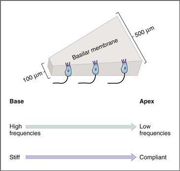

**그림 3-22 기저막의 주파수 응답.**

#### 청각 경로

정보는 코르티 기관의 유모 세포에서 구심성 달팽이관 신경으로 전달됩니다. 달팽이관 신경은 수질의 등쪽 및 배쪽 달팽이관 핵의 뉴런과 시냅스를 이루며, 이는 CNS로 올라가는 축삭을 보냅니다. 이들 축삭 중 일부는 반대편으로 교차하여 **외측 방막**(1차 청각관)에서 **하구체**로 올라갑니다. 다른 축삭은 동측으로 유지됩니다. 두 개의 하구는 하구의 교련을 통해 연결됩니다. 하구의 핵에서 나온 섬유는 시상의 내측 슬상핵으로 올라갑니다. 시상에서 나온 섬유는 **청각 피질**로 올라갑니다. 코르티 기관 수준에서 생성된 음위상 지도는 CNS의 모든 수준에서 보존됩니다. 복잡한 특징 식별(예: 패턴화된 순서를 인식하는 능력)은 청각 피질의 속성입니다.

일부 청각 섬유는 교차되고 일부는 교차되지 않기 때문에 상승하는 신경 섬유의 혼합은 CNS의 모든 수준에서 *두* 귀를 나타냅니다. 따라서 한쪽 귀의 달팽이관 병변은 동측 난청을 유발합니다. 그러나 더 중앙에 위치한 편측 병변은 귀에서 정보를 전달하는 일부 섬유가 이미 손상되지 않은 쪽을 통과했기 때문에 난청을 유발하지 않습니다.

### 전정 시스템

전정 시스템은 머리의 각도 및 선형 가속도를 감지하여 **평형** 또는 **균형**을 유지하는 데 사용됩니다. 그런 다음 전정계의 감각 정보를 사용하여 (머리가 움직이는 동안) 망막에 안정적인 시각 이미지를 제공하고 균형을 유지하는 데 필요한 자세를 조정합니다.

#### 전정기관

전정 기관은 청각 기관(달팽이관)에 인접한 측두골 내에 위치합니다. 전정기관은 골성미로(Bony labyrinth) 내에 막성미로(membranous labyrinth)로 구성되어 있다([그림 3-23](#filepos440393)). 막미로는 3개의 수직 반고리관(수평, 상부 및 후방)과 2개의 이석 기관(난형낭 및 구형낭)으로 구성됩니다. 반고리관과 이석 기관은 내림프(endolymph)로 채워져 있고 청각 기관과 마찬가지로 외림프(perilymph)로 둘러싸여 있습니다.

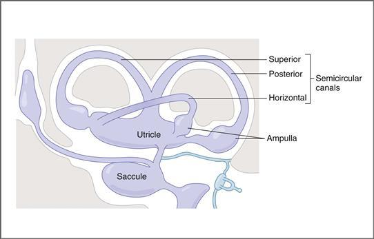

**그림 3–23 3개의 수직 반고리관과 2개의 이석 기관(난형낭과 구형낭)을 보여주는 전정 기관의 구조.**

서로 수직으로 배열된 **반고리관**은 머리의 *각* 또는 회전 가속도를 감지하는 데 사용됩니다. (관의 수직 배열은 머리 회전의 세 가지 주요 축을 덮도록 보장합니다.) 내림프로 채워진 각 관에는 **팽대부**라고 불리는 한쪽 끝이 확장되어 있습니다. 각 팽대부에는 **전정 유모 세포**가 포함되어 있으며, 이 세포는 **큐풀라**라고 불리는 젤라틴 덩어리로 덮여 있습니다([그림 3-24](#filepos441629)). 팽대부 단면적에 걸쳐 있는 팽대부(cupula)는 관의 내림프와 동일한 비중을 갖습니다. 머리의 각가속도 동안 큐풀라는 변위되어 유모 세포의 흥분 또는 억제를 유발합니다.

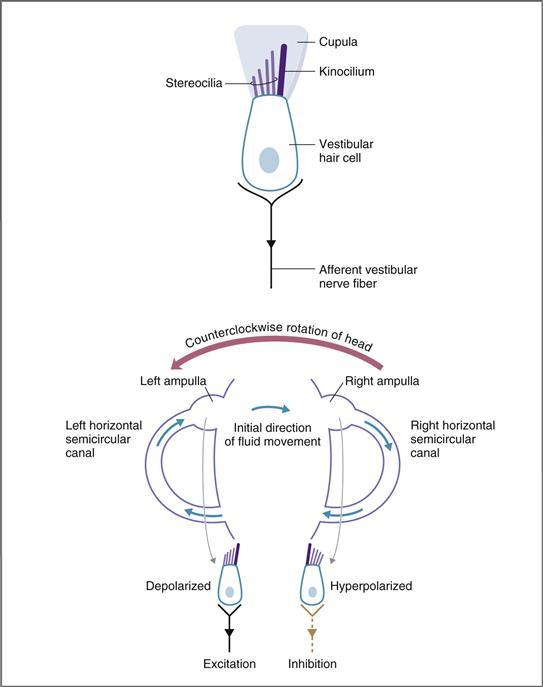

**그림 3-24 수평 반고리관에 있는 유모 세포의 기능을 보여주는 전정 유모 세포의 구조.** 머리를 시계 반대 방향(*왼쪽*)으로 회전하면 왼쪽 반고리관이 자극되고 오른쪽 반고리관이 억제됩니다.

**이석 기관**, **난원낭** 및 **낭형낭**은 *선형* 가속도(예: 중력)를 감지하는 데 사용됩니다. 난원낭과 구형낭 내에는 점액다당류와 탄산칼슘 결정으로 구성된 이석 덩어리가 전정 유모 세포(예: "베개") 위에 놓여 있습니다. 머리가 기울어지면 중력이 이석 덩어리에 작용하여 전정 유모 세포를 가로질러 이동합니다. 유모세포는 활성화되거나 억제되어 환자에게 머리 위치의 변화를 알려줍니다.

#### 전정 전달

##### *반원형 운하*

수평반고리관의 기능은 [그림 3-24](#filepos441629)와 같이 머리의 **각가속도**를 감지하는 것입니다. 이 그림에서는 왼쪽 및 오른쪽 수평 근관이 부착된 팽대와 함께 표시됩니다. 팽대부는 팽대부(cupula)의 젤라틴 덩어리에 박혀 있는 전정 유모 세포를 포함합니다. 전정 유모 세포는 큰 **근섬모**와 부동섬모 집단을 가지고 있다는 점에서 청각 유모 세포와 다릅니다. 유모 세포의 구심성 신경 섬유는 전정 정보를 CNS로 전달합니다.

예를 들어, **머리가 시계 반대 방향**(왼쪽)으로 회전하면 수평 반고리관에서 다음과 같은 현상이 발생합니다.

1. 머리를 왼쪽으로 회전시키면 수평 반고리관과 그에 부착된 팽대부도 왼쪽으로 회전합니다. 처음에는 내림프가 흐르기 시작하기 전에 팽대부(팽대부에 고정된)가 움직입니다. 따라서, 팽대부는 내림프를 통해 옮겨지거나 끌려가며 유모 세포의 섬모가 구부러지게 됩니다. 결국 회전이 계속되면서 내림프가 움직이기 시작합니다.
2. 부동모가 운동연장을 *향해* 구부러지면 유모 세포가 *탈분극*되고 구심성 전정 신경의 발사 속도가 증가합니다. 부동모가 운동장모로부터 *멀리* 구부러지면 유모 세포가 *과분극*되고 구심성 전정 신경의 발사 속도가 감소합니다. 그러므로 머리가 처음 왼쪽으로 회전하는 동안 왼쪽 수평관은 자극되고 오른쪽 수평관은 억제됩니다.
3. 머리가 여전히 왼쪽으로 회전하는 동안 내림프는 결국 머리, 팽대부, 팽대부(cupula)의 움직임을 "따라잡습니다". 섬모는 이제 원래 위치로 돌아가고 유모세포는 탈분극되거나 과분극되지 않습니다.
4. 헤드 회전이 멈추면 이벤트가 반대로 발생합니다. 짧은 기간 동안 내림프는 계속 움직이며 유모세포의 큐풀라와 운동연골을 반대 방향으로 밀어냅니다. 따라서 유모세포가 초기 회전에서 탈분극되었다면 이제는 과분극되어 구심성 신경 출력이 억제됩니다. 유모세포가 초기 회전에서 과분극되었다면 이제 구심성 신경 출력이 자극되면서 탈분극될 것입니다. 따라서 머리가 왼쪽으로 움직이는 것을 멈추면 왼쪽 수평 신경관은 억제되고 오른쪽 신경관은 자극됩니다.

요약하면, 머리를 왼쪽으로 돌리면 왼쪽 반고리관이 자극되고, 오른쪽으로 돌리면 오른쪽 반고리관이 자극됩니다.

##### *이석 기관*

황반은 **선형 가속도**(예: 중력으로 인한 가속도)에 민감합니다. 황반의 유모 세포가 이석 덩어리에 묻혀 있다는 것을 기억하십시오. 머리가 기울어지면 중력으로 인해 이석 덩어리가 전정 유모 세포를 가로질러 미끄러지면서 부동섬모가 운동연장 쪽으로 또는 반대 방향으로 구부러집니다. 부동섬모가 운동연모를 *향해* 움직이면 유모 세포의 *탈분극*과 흥분이 발생합니다. 부동섬모가 운동장모로부터 *멀어지게* 이동하면 유모 세포의 *과분극*과 억제가 발생합니다.

머리가 직립할 때 난원낭의 황반은 수평 방향을 향하고 구형낭은 수직 방향을 향합니다. **난원낭**에서 머리를 앞으로 또는 옆으로 기울이면 동측 난원낭이 자극됩니다. 머리를 뒤로 기울이거나 내측으로 기울이면 동측 난원낭이 억제됩니다. **낭형낭**은 모든 방향의 머리 움직임에 반응합니다. 구형낭의 유모 세포는 전방 및 후방 움직임("피치"라고 함)과 측면 및 내측 움직임("롤"이라고 함)으로 흥분됩니다. 구형낭은 또한 머리의 위아래 움직임에 반응합니다.

이석 기관의 양측 배열로 인해 머리의 가능한 모든 방향은 전정 유모 세포의 자극 또는 억제에 의해 암호화될 수 있습니다. 머리의 각 위치에는 공간 내 머리 위치에 대한 자세한 정보를 CNS에 제공하는 이석 기관을 지배하는 구심성 신경의 독특한 활동 패턴이 있습니다.

#### 전정 경로

전정 유모 세포의 구심성 신경은 수질의 전정 핵, 즉 상핵, 내측 핵, 외측 핵(다이터스 핵) 및 하핵에서 종결됩니다. **내측 핵과 상핵**은 반고리관으로부터 입력을 받고 내측 세로 다발을 통해 외안근에 분포하는 신경으로 투사됩니다. **외측 전정핵**은 난원낭으로부터 입력을 받아 외측 전정척수관을 통해 척수 운동뉴런으로 전달됩니다. 외측 전정핵의 돌출부는 자세 반사를 유지하는 역할을 합니다. **하전정핵**은 난원낭, 구형낭 및 반고리관으로부터 입력을 받습니다. 그것은 내측종다발을 통해 뇌간과 소뇌로 투사됩니다.

#### 전정안구반사

머리의 움직임에 반응하여 여러 전정 반사가 생성됩니다. **안진증**이라고 하는 반사 중 하나는 머리의 각도 또는 회전 가속도에 반응하여 발생합니다. 머리가 회전하면 처음에는 눈이 회전 반대 방향으로 움직이며 시선의 방향을 일정하게 유지하려고 합니다. 이 초기 움직임은 안진 증의 느린 구성 요소입니다. 눈이 측면 움직임의 한계에 도달하면 머리 회전과 같은 방향으로 빠른 눈 움직임이 발생합니다. 이 움직임은 눈이 공간의 새로운 위치에 고정하기 위해 "앞으로 점프"하는 안진증의 빠른 구성요소입니다. 안진증은 빠른 구성 요소의 방향으로 정의됩니다. *안진증은 머리 회전 방향에 있습니다.*

회전이 갑자기 중단되면 눈은 원래 회전 방향과 반대 방향으로 움직입니다. 이러한 안구 운동을 **회전 후 안구진탕**이라고 합니다. 회전 후 기간 동안 환자는 자신이 반대 방향으로 회전하고 있다고 *생각*하기 때문에 (대측 신근 근육의 자극으로 인해) 원래 회전 방향으로 떨어지는 경향이 있습니다.

##### *전정안구 반사 테스트*

전정 기능은 안진증과 회전 후 안진증의 현상을 사용하여 테스트할 수 있습니다.

**Bárány 테스트**에는 특수 의자에 앉은 사람을 약 10회 회전시키는 테스트가 포함됩니다. 전정 기능이 정상인 사람의 경우 오른쪽으로 회전하면 오른쪽 *회전* 안진, 왼쪽 *회전* 안진이 발생하고, 회전 후 기간 동안 사람은 오른쪽으로 넘어집니다. 마찬가지로 왼쪽으로 회전하면 왼쪽 회전 안진, 오른쪽 회전 후 안진이 발생하고 회전 후 기간 동안 사람이 왼쪽으로 쓰러집니다.

**칼로리 테스트**에는 오른쪽 및 왼쪽 수평 반고리관을 개별적으로 자극할 수 있는 내이의 열 자극이 포함됩니다. 이 테스트에서는 수평 근관이 수직 방향을 갖도록 머리를 60도 뒤로 기울입니다. 따뜻하거나 차가운 물로 귀를 헹구면 내림프가 흐르게 되어 마치 머리가 회전하는 것처럼 팽대관의 방향이 바뀌게 됩니다. 안구진탕이 발생하며 약 2분간 지속됩니다. **따뜻한 물**은 치료받는 쪽을 향해 안진 증을 일으킵니다. **찬물**은 치료하지 않은 쪽으로 안진증을 일으킵니다.

### 후각

화학적 감각에는 화학적 자극을 감지하고 이러한 자극을 신경계에 전달될 수 있는 전기 에너지로 변환하는 기능이 포함됩니다. 후각인 후각은 화학적 감각 중 하나입니다. 인간의 경우 후각은 생존에 꼭 필요한 것은 아니지만 삶의 질을 향상시키고 심지어 위험으로부터 보호하기도 합니다.

**후각상실증**은 후각이 없는 상태, **후각저하증**은 후각 장애, **후각이상**은 왜곡된 후각입니다. 머리 손상, 상부 호흡기 감염, 전안와 종양 및 독성 화학물질(후각 상피를 파괴함)에 대한 노출은 모두 후각 장애를 유발할 수 있습니다.

#### 후각 상피 및 수용체

기체 상태로 존재하는 냄새 분자는 비강을 통해 후각 수용체에 도달합니다. 공기는 콧구멍으로 들어가 비강을 통과하여 비인두로 빠져나갑니다. 비강에는 비갑개라고 불리는 구조가 포함되어 있으며, 그 중 일부에는 후각 수용체 세포가 들어 있는 후각 상피가 늘어서 있습니다. (비강의 나머지 부분은 호흡 상피로 둘러싸여 있습니다.) 비갑개는 배플 역할을 하여 공기 흐름을 난류로 만들어서 비강의 상부 영역에 도달하게 합니다.

**후각상피**는 지지세포, 기저세포, 후각수용기세포의 3가지 세포 형태로 구성되어 있습니다([그림 3-25](#filepos453335)).

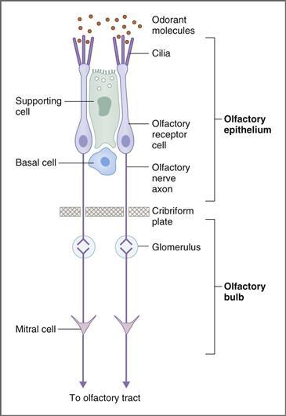

**그림 3–25 후각 상피와 후각 망울을 보여주는 후각 경로.**

 **지지 세포**는 점막 경계에 미세융모가 늘어서 있고 분비 과립으로 채워져 있는 원주형 상피 세포입니다.

 **기저세포**는 후각상피의 기저부에 위치하며 후각수용체세포를 형성하는 미분화 줄기세포입니다. 이 줄기 세포는 유사분열을 거쳐 수용체 세포의 지속적인 교체를 생성합니다.

 **일차 구심성 뉴런**이기도 한 **후각 수용체 세포**는 냄새 물질 결합, 감지 및 전달 부위입니다. 냄새 분자는 코 점막까지 확장되는 섬모의 수용체에 결합합니다. 후각 수용체 세포의 축삭은 후각 상피를 떠나 후각 망울 중앙으로 이동합니다. 이 축삭은 후각 구근에 도달하려면 두개골 기저부의 **체판**을 통과해야 합니다. 따라서 체판의 골절은 후각 뉴런을 절단하여 후각 장애(예: 후각상실증)를 유발할 수 있습니다. 후각 신경 축색돌기는 수초가 없으며 신경계에서 가장 작고 가장 느린 섬유 중 하나입니다([1장](CR%21G9RE0KW4PD33Q9F3DXNCSBNXCANP_split_007.html#filepos27757)에서 논의된 섬유 직경, 수초화 및 전도 속도 사이의 관계를 상기하십시오).  
    후각 수용체 세포도 일차 구심성 뉴런이기 때문에 기저 세포에서 수용체 세포가 지속적으로 교체된다는 것은 **지속적인 신경 발생**이 있음을 의미합니다.

#### 후각 변환

후각 시스템의 변환에는 화학적 신호가 CNS로 전송될 수 있는 전기 신호로 변환되는 과정이 포함됩니다. 후각전달의 단계는 다음과 같다([그림 3-26](#filepos455794)).

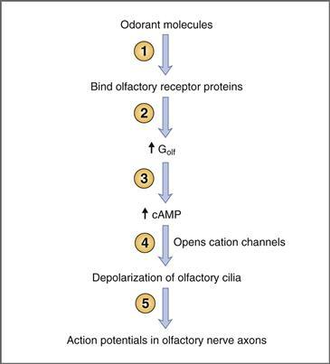

**그림 3–26 후각 전달 단계.** 원 안의 숫자는 본문에 설명된 단계에 해당합니다. cAMP, 사이클릭 아데노신 모노포스페이트.

1. 냄새 분자는 후각 수용체 세포의 섬모에 위치한 특정 **후각 수용체 단백질**에 결합합니다. 적어도 1000가지의 서로 다른 후각 수용체 단백질(G 단백질 결합 수용체 슈퍼패밀리의 구성원)이 있으며, 각각은 서로 다른 유전자에 의해 암호화되고 서로 다른 후각 수용체 세포에서 발견됩니다.
2. 후각 수용체 단백질은 **골프**라고 불리는 G 단백질을 통해 아데닐릴 사이클라제에 결합됩니다. 냄새 물질이 결합되면 골프가 활성화되어 **아데닐릴 시클라제**를 활성화합니다.
3. 아데닐릴 사이클라제는 ATP가 cAMP로 전환되는 것을 촉매합니다. cAMP의 세포 내 수준이 증가하여 Na+, K+ 및 Ca2+가 투과되는 후각 수용체의 세포막에서 **양이온 채널을 엽니다**.
4. 수용체 세포막이 탈분극됩니다(즉, 막 전위가 세 양이온의 평형 전위 사이에 있는 값을 향해 이동하는 것, 즉 탈분극). 이 탈분극 수용체 전위는 막 전위를 역치에 더 가깝게 만들고 후각 신경 축삭의 초기 부분을 탈분극합니다.
5. 그런 다음 활동 전위가 생성되어 후각 신경 축삭을 따라 후각 구쪽으로 전파됩니다.

##### *후각 자극 인코딩*

후각 자극이 어떻게 인코딩되는지는 정확히 알려져 있지 않습니다. 즉, 우리는 어떻게 장미나 치자나무 또는 특별한 사람의 향기를 *인식*하고, 장미와 치자나무를 어떻게 *구별*합니까?

다음 정보가 알려져 있습니다. (1) 후각 수용체 단백질은 단일 냄새 물질에만 *전용되지 않으며* 각 단백질은 다양한 냄새 물질에 반응할 수 있습니다. (2) 그럼에도 불구하고 후각 수용체 단백질은 선택적이어서 어떤 냄새 물질에는 다른 냄새 물질보다 더 많이 반응하고 어떤 냄새 물질에는 전혀 반응하지 않습니다. (3) 서로 다른 후각 수용체 단백질은 동일한 냄새 물질에 대해 서로 다른 반응을 보입니다. 예를 들어, 수용체 단백질 "A"는 수용체 단백질 "B"보다 "사과"에 대해 훨씬 더 강한 반응을 보입니다. (4) 주어진 냄새 물질에 대한 반응을 많은 수용체에 걸쳐 조사하면, 다른 냄새 물질에 대해 다른 패턴이 나타납니다. 이를 **섬유 간 패턴 코드**라고 합니다. 각 냄새 물질은 수용체 집단 전체에 걸쳐 고유한 활동 패턴을 생성하며, 이는 후각구의 표적 사구체에 투사됩니다("냄새 지도"). 그런 다음 CNS는 이러한 냄새 지도(예: 장미, 치자나무 또는 특별한 사람)를 해석합니다.

#### 후각 경로

언급한 바와 같이, 후각 수용체 세포는 후각 시스템의 주요 구심성 뉴런입니다. 수용체 세포에서 나온 축삭은 후각상피를 떠나 체판을 통과하여 **후각구**에 있는 **승모세포**(2차 뉴런)의 정점 수상돌기에서 시냅스를 형성합니다. 이러한 시냅스는 **사구체**라는 클러스터에서 발생합니다([그림 3-25](#filepos453335) 참조). 사구체에서는 약 1000개의 후각 수용체 축삭이 1개의 승모판 세포로 모입니다. 승모판 세포는 후각 망울의 단일 층으로 배열되어 있으며 정점 수상돌기 외에 측면 수상돌기를 갖고 있습니다. 후각 망울에는 과립 세포와 사구체 주위 세포도 포함되어 있습니다(표시되지 않음). 과립 및 사구체 주위 세포는 인접한 승모판 세포에 **수상돌기 시냅스**를 만드는 억제성 개재뉴런입니다. 억제 입력은 망막의 수평 세포와 유사한 기능을 하며 CNS에 투사된 정보를 "날카롭게" 하는 측면 억제를 제공할 수 있습니다.

후각 구의 승모판 세포는 CNS의 더 높은 중심으로 돌출합니다. 후각로가 뇌의 기저부에 접근함에 따라 측면로와 내측로라는 두 가지 주요 도로로 나뉩니다. **측면 후각관**은 전피질 피질을 포함하는 일차 후각 피질에서 시냅스를 형성합니다. **내측 후각로**는 전교차와 반대측 후각 구근으로 돌출됩니다.

### 맛

두 번째 화학적 감각은 **임신** 또는 맛입니다. 미각을 위해서는 미각 물질이라고 불리는 화학 물질이 미뢰에 위치한 화학 수용체에 의해 감지되고 전달됩니다. 맛은 짠맛, 단맛, 신맛, 쓴맛, 감칠맛(글루타민산나트륨을 포함한 감칠맛)의 5가지 기본 맛 특성이 혼합된 것입니다.

미각과 관련된 장애는 생명을 위협하지는 않지만, 삶의 질을 저하시키고 영양 상태를 손상시키며 우발적인 중독 가능성을 높일 수 있습니다. 미각 장애에는 **미각 상실**(미각 상실), **저미각**(미각 민감도 감소), **미각 과민증**(미각 민감도 증가) 및 **미각이상**(미각 자극이 없을 때 미각 감각을 포함하는 미각 왜곡)이 포함됩니다.

#### 미각 및 수용체

미각 수용체 세포는 혀, 입천장, 인두 및 후두의 미뢰 내에 위치합니다. 혀의 미뢰는 수백 개의 미뢰를 포함하는 미뢰에서 발견됩니다. 미뢰는 해부학적으로 후각상피와 유사하며 지지세포, 기저세포, 수용체 세포의 세 가지 세포 유형으로 구성됩니다([그림 3-27](#filepos462287)).

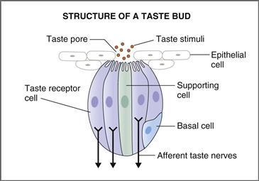

**그림 3–27 미뢰의 구조.**

 **지지 세포**는 미각 수용체 세포 중에서 발견됩니다. 이 세포는 미각 자극에 반응하지 않으며 그 기능도 알려져 있지 않습니다.

 **기저 세포**는 미각 수용체 세포의 전구체 역할을 하는 미분화 줄기 세포입니다(기저 세포가 후각 수용체 세포의 전구체 역할을 하는 것처럼). 기저 세포는 **지속적인 교체**를 거칩니다. 약 10일마다 생성되는 새로운 세포는 미뢰의 중심을 향해 이동하여 새로운 수용체 세포로 분화됩니다. 혀에서 탈락된 세포를 대체하려면 새로운 수용체 세포가 필요합니다.

 **미각 수용체 세포**는 미각 시스템의 화학 수용체입니다. 그들은 미뢰를 정렬하고 미공으로 미세융모를 확장합니다. 이러한 **미세융모**는 화학적 자극을 감지할 수 있는 넓은 표면적을 제공합니다. 후각 시스템(수용기 세포가 일차 구심성 뉴런인)과 달리 미각 시스템에서 수용체 세포는 *뉴런이 아닙니다.* 이는 화학 수용체 역할을 하며 화학적 자극을 전기 신호로 변환하는 특수 상피 세포입니다. 구심성 섬유는 미각 수용체 세포에 신경을 분포시키고 이 정보를 CNS로 전달합니다.  
    혀의 미뢰는 특수한 **유두**로 구성되어 있습니다([그림 3-28](#filepos464334)). 세 가지 유형의 유두에는 미뢰가 포함되어 있습니다: 환형형, 잎형, 곰팡이형.

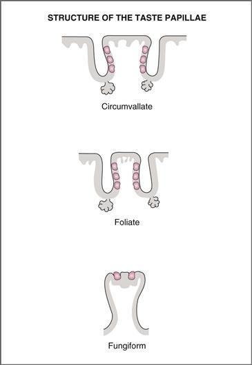

**그림 3–28 미뢰가 늘어선 미뢰의 구조.**

 **환유두**는 크기는 가장 크지만 개수는 가장 적습니다. 그들은 혀 밑 부분에 줄을 지어 배열되어 있습니다. 각각의 판 주위 유두는 도랑으로 둘러싸여 있으며, 도랑의 측면을 따라 미뢰가 위치합니다. 크기가 크기 때문에 전체 미뢰 수의 약 절반이 성곽유두에서 발견됩니다. 성곽유두의 미각 세포는 CN VII 및 IX에 의해 신경지배됩니다.

 **엽상유두**는 혀의 측면 가장자리에 위치합니다. 미뢰는 유두의 측면에 접힌 부분에 위치합니다.

 **Fungiform papillae**는 혀의 등쪽 표면에 흩어져 있으며 앞쪽 끝 부분에 가장 많습니다. 그것들은 버섯 모양("균류 형태")이며, 각 유두에는 3~5개의 미뢰가 들어 있습니다. 곰팡이 모양의 유두는 반투명하고 혈액 공급이 촘촘하여 혀 표면에 붉은 반점으로 나타납니다. 곰팡이형 유두의 미각 세포는 CN VII의 고실창 분지(chorda tympani Branch)에 의해서만 신경지배됩니다.

#### 맛 변환

5가지 기본 미각 특성을 감지하는 데는 혀 영역의 차등적 민감도가 포함됩니다([그림 3-29](#filepos466599)). 다섯 가지 미각 특성은 모두 혀의 전체 표면에서 감지될 수 있지만 혀의 부위에 따라 역치가 다릅니다. 혀끝은 단맛, 짠맛, ​​감칠맛에 가장 반응하는 반면, 혀 뒤쪽은 쓴맛에 가장 반응하고, 혀의 옆부분은 신맛에 가장 반응합니다.

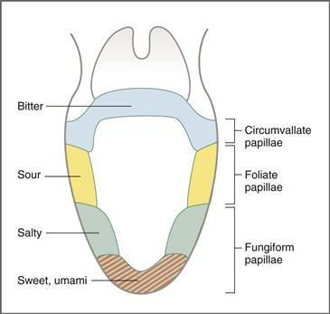

**그림 3–29 혀의 미각 유두의 조직.** 환유두, 잎 모양 유두, 곰팡이 유두와 이들이 감지하는 화학 물질이 표시되어 있습니다.

다섯 가지 맛에 대한 화학적 신호는 [그림 3-30](#filepos468420)과 같은 메커니즘에 의해 변환됩니다. 대부분의 경우, 형질도입은 궁극적으로 미각 수용체 막의 탈분극(즉, 탈분극 발생기 전위)을 초래합니다. 이러한 탈분극은 혀의 해당 부분을 지배하는 구심성 신경의 활동 전위로 이어집니다. **쓴맛** 감각의 경우 미각 분자는 미각 수용체 막의 G 단백질 결합 수용체에 결합하고 이노시톨 1,4,5-삼인산(IP3)/Ca2+ 메커니즘에 의해 매개되어 소위 일시적 수용체 전위(TRP) 채널을 열고 탈분극을 초래합니다. **단맛과 감칠맛** 감각의 경우 분자는 미각 수용체 세포막에 있는 다른 종류의 G 단백질 결합 수용체에 결합하고 IP3/Ca2+에 의해 매개되어 TRP 채널을 열고 탈분극을 유발합니다. **신맛** 감각(H+에 의해 매개됨)의 경우 H+는 상피 *Na+* 채널(**ENaC**)을 통해 미각 수용체로 들어가 탈분극을 유발합니다. **짠맛** 감각(Na+에 의해 매개됨)의 경우 Na+는 동일한 상피 Na+ 채널을 통해 미각 수용체로 들어가서 직접적으로 탈분극을 유도합니다.

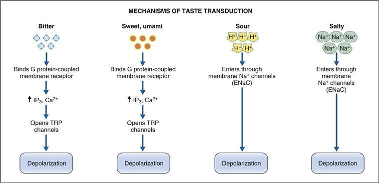

**그림 3–30 미각 수용체 세포의 형질도입 메커니즘.** ENaC, 상피 Na+ 채널; IP3, 이노시톨 1,4,5-트리포스페이트; TRP, 일시적 수용체 잠재력.

#### 미각 자극 인코딩

CNS에서 미각 특성이 어떻게 인코딩되는지는 정확하게 알려져 있지 않습니다. 한 이론에서는 각 미각 섬유가 하나의 자극에 가장 잘 반응하지만 다른 자극에는 덜 반응하는 **섬유 간 패턴 코드**가 있다고 말합니다. 따라서 구심성 미각 섬유는 염분에 가장 잘 반응하지만 산에도 반응합니다. 또 다른 맛 섬유는 산에 가장 잘 반응하지만 쓴맛에도 반응합니다. 따라서 각 구심성 미각 섬유는 독특한 반응 *패턴*을 갖는 미각 수용체 집단으로부터 입력을 받습니다. 그러면 여러 섬유 *전반에 걸친* 반응 패턴이 특정 미각 감각을 암호화합니다.

#### 맛 경로

언급한 바와 같이, 미각은 미뢰에 위치한 미각 수용체 세포에 화학적 신호가 전달되는 것으로 시작됩니다. 형질도입은 탈분극 수용체 전위로 이어지며, 이는 혀의 특정 부위에 신경을 분포하는 일차 구심성 뉴런의 활동 전위로 이어집니다. 혀의 다양한 부위는 세 개의 뇌신경 가지에 의해 지배됩니다. 혀의 뒤쪽 1/3(쓴맛과 신맛이 가장 민감한 곳)은 설인두 신경(CN IX)의 지배를 받습니다. 혀의 앞쪽 2/3(단맛, 감칠맛, 짠맛이 가장 민감한 곳)는 안면 신경(CN VII)의 지배를 받습니다. 목구멍 뒤쪽과 후두개는 미주 신경(CN X)의 지배를 받습니다. 이 세 개의 뇌신경(CN VII, IX, X)은 뇌간으로 들어가 **고립관**으로 올라가며 수질의 **고립핵**에 있는 2차 뉴런에서 끝납니다. 2차 뉴런은 시상의 복부 후내측 핵에 동측으로 돌출합니다. 3차 뉴런은 시상을 떠나 미각 피질에서 종결됩니다.

### 모터 시스템

자세와 움직임은 척수에 의해 조정되는 불수의 반사와 상위 뇌 중추에 의해 제어되는 자발적 활동의 조합에 따라 달라집니다.

#### 척수에 의한 운동 기능의 구성

자세와 움직임은 궁극적으로 일부 골격근의 수축에 따라 달라지며 동시에 다른 근육은 이완된 상태를 유지합니다. 골격근의 활성화와 수축은 골격근에 신경을 분포시키는 운동뉴런의 통제를 받는다는 점을 기억하세요. 운동 시스템은 주로 척수에 통합된 반사 신경을 통해 이러한 조화된 반응을 실행하도록 설계되었습니다.

#### 모터 유닛

**운동 단위**는 *단일* 운동 뉴런과 이것이 신경을 전달하는 근육 섬유로 정의됩니다. 신경이 분포된 근섬유의 수는 운동 활동의 성격에 따라 몇 개의 섬유에서 수천 개의 섬유까지 다양할 수 있습니다. 따라서 미세한 제어가 필요한 안구 운동의 경우 운동뉴런은 소수의 근육 섬유에만 신경을 공급합니다. 큰 움직임에 관여하는 자세 근육의 경우 운동뉴런은 수천 개의 근육 섬유에 신경을 공급합니다. **운동뉴런 풀**은 동일한 근육 내의 섬유에 신경을 분포시키는 운동뉴런 세트입니다.

근육 수축력은 운동 단위의 **모집**에 따라 등급이 결정됩니다(크기 원칙). 예를 들어, 작은 운동뉴런은 몇 개의 근육 섬유에 신경을 공급하며, 역치가 가장 낮기 때문에 먼저 활성화됩니다. 작은 운동뉴런은 또한 가장 적은 양의 힘을 생성합니다. 반면에, 큰 운동뉴런은 많은 근육섬유를 자극합니다. 활동 전위를 발화하는 데 가장 높은 임계값을 가지고 있습니다. 따라서 그들은 마지막으로 발사됩니다. 큰 운동뉴런은 많은 근육 섬유에 신경을 공급하기 때문에 가장 큰 힘을 생성합니다. **크기 원칙**은 더 많은 운동 단위가 동원될수록 점진적으로 더 큰 운동 뉴런이 관련되고 더 큰 긴장이 생성된다는 것을 나타냅니다.

##### *운동뉴런의 유형*

운동뉴런에는 α 운동뉴런과 γ 운동뉴런의 두 가지 유형이 있습니다. **α 운동뉴런**은 추외 골격근 섬유에 신경을 분포시킵니다. α 운동뉴런의 활동 전위는 신경 분포하는 추외 근육 섬유의 활동 전위로 이어지며, 이는 수축을 초래합니다([1장](CR%21G9RE0KW4PD33Q9F3DXNCSBNXCANP_split_007.html#filepos27757) 참조). **γ 운동뉴런**은 근방추의 구성 요소인 특화된 추내 근육 섬유에 신경을 분포시킵니다. 근방추의 전반적인 기능은 근육 길이를 감지하는 것입니다. 근육에 분포하는 γ 운동뉴런의 기능은 근방추의 민감도를 조정하는 것입니다(추외 섬유가 수축하고 짧아질 때 적절하게 반응하도록). α 운동뉴런과 γ 운동뉴런은 함께 활성화되어(동시에 활성화됨) 근육이 수축하고 짧아지는 경우에도 근방추가 근육 길이의 변화에 ​​민감한 상태를 유지합니다.

##### *근육섬유의 종류*

이미 언급했듯이 근섬유에는 추외 섬유와 추내 섬유라는 두 가지 유형이 있습니다. **추외 섬유**는 골격근의 대부분을 구성하고 α 운동뉴런의 지배를 받으며 힘을 생성하는 데 사용됩니다. **추내 섬유**는 γ 운동뉴런의 지배를 받는 특수 섬유로 크기가 너무 작아서 상당한 힘을 생성할 수 없습니다. 추내 섬유는 외피로 싸여 추외 섬유와 평행하게 움직이는 근방추를 형성합니다.

#### 근육방추

근방추는 추외근섬유에 분포되어 있으며, 특히 미세한 움직임에 사용되는 근육(예: 눈의 근육)에 풍부합니다. 근방추는 [그림 3-31](#filepos475614)과 같이 추내근섬유로 구성되어 감각신경섬유와 운동신경섬유에 의해 지배되는 방추형 기관이다. 근방추는 결합조직에 부착되어 추외근섬유와 평행하게 배열됩니다.

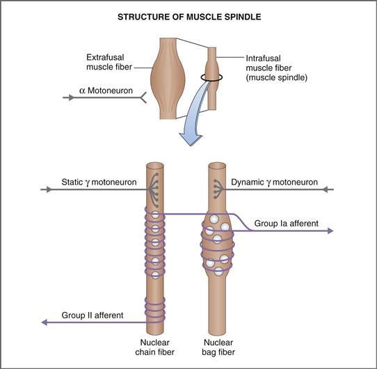

**그림 3–31 근방추의 구조.** 추내 근섬유는 추외 근섬유와 관련하여 표시됩니다.

##### *근방추의 추내 근육 섬유*

근방추에는 핵주머니 섬유와 핵사슬 섬유라는 두 가지 유형의 추내 섬유가 존재합니다([그림 3-31](#filepos475614) 참조). 일반적으로 두 가지 유형의 섬유가 모든 근방추에 존재하지만 핵사슬 섬유가 핵주머니 섬유보다 더 많습니다. (2개의 핵주머니 섬유에 비해 근방추당 5~6개의 핵사슬 섬유가 있습니다.) **핵주머니 섬유**는 더 크며 핵은 중앙("주머니") 영역에 축적됩니다. **핵 사슬 섬유**는 더 작고, 핵이 열로 배열됩니다('사슬').

##### *근육방추의 신경 분포*

근방추는 감각(구심성) 신경과 운동(원심성) 신경 모두의 지배를 받습니다.

 근방추의 **감각 신경 분포**는 핵주머니 섬유와 핵사슬 섬유 모두의 중앙 영역에 분포하는 단일 **그룹 Ia 구심성 신경**과 주로 핵사슬 섬유에 분포하는 **그룹 II 구심성 신경**으로 구성됩니다. 그룹 Ia 섬유는 신체에서 가장 큰 신경 중 하나입니다. 따라서 전도 속도가 가장 빠릅니다. 이러한 섬유는 핵주머니와 핵사슬 섬유의 중앙 영역 주변의 나선형 말단에서 1차 말단을 형성합니다. 그룹 II 섬유는 중간 직경과 중간 전도 속도를 갖습니다. 그룹 II 섬유는 주로 핵 사슬 섬유에서 2차 말단을 형성합니다.

 근방추의 **운동 신경 분포**는 동적 및 정적의 두 가지 유형의 γ 운동 뉴런으로 구성됩니다. **동적** γ **운동뉴런**은 "판 말단"의 핵주머니 섬유에 있는 시냅스입니다. **정적** γ **운동뉴런**은 더 먼 거리에 걸쳐 퍼져 있는 "트레일 엔딩"의 핵사슬 섬유에 시냅스를 형성합니다. γ 운동뉴런은 추외섬유에 분포하는 α 운동뉴런보다 작고 느립니다. 다시 말하지만, γ 운동뉴런(정적 또는 동적)의 기능은 그들이 신경을 분포시키는 추내 근육 섬유의 민감도를 조절하는 것입니다.

##### *근육방추의 기능*

근방추는 추외근 섬유가 단축되거나(수축에 의해) 길어질 때(신장에 의해) 근육 길이의 변화를 교정하는 기능을 하는 **신장 수용체**입니다. 따라서 근방추 반사는 근육이 짧아지거나 길어진 후에 근육을 휴식 길이로 되돌리는 역할을 합니다. 근방추 반사의 기능을 설명하기 위해 근육이 늘어날 때 발생하는 사건을 고려하십시오.

1. 근육이 늘어나면 추외근섬유가 늘어납니다. 근육 내 평행 배열로 인해 추내 근육 섬유도 길어집니다.
2. 추내 섬유의 길이 증가는 이를 신경지배하는 감각 구심성 섬유에 의해 감지됩니다. **Ia군 구심성 섬유**(핵주머니와 핵사슬 섬유의 중앙 영역에 분포)는 길이 변화의 *속도*를 감지하고, **II군 구심성 섬유**(핵사슬 섬유에 분포)는 근섬유의 *길이*를 감지합니다. 따라서 근육이 신장되면 추내 섬유의 길이가 증가하여 그룹 Ia 및 그룹 II 감각 구심성 섬유가 모두 활성화됩니다.
3. Ia군 구심성 섬유의 활성화는 척수의 α 운동뉴런을 자극합니다. 이러한 α 운동뉴런은 동형(동일한) 근육의 추외 섬유에 신경을 공급하고, 활성화되면 근육이 수축(즉, 단축)되도록 합니다. 따라서 반사로 인해 근육이 수축되고 짧아지면 원래의 신장(연장)이 반대됩니다. γ 운동뉴런은 α 운동뉴런과 함께 활성화되어 근육 스핀들이 수축 중에도 근육 길이의 변화에 ​​민감한 상태를 유지하도록 합니다.

#### 척수 반사

척수 반사는 근육 스트레칭과 같은 특정 유형의 자극에 대한 **고정관념** 운동 반응입니다. 이 운동 반응을 지시하는 신경 회로를 **반사궁**이라고 합니다. 반사궁에는 감각 수용체가 포함됩니다. 척수에 정보를 전달하는 감각 구심성 신경; 척수의 개재뉴런; 그리고 근육이 수축하거나 이완하도록 지시하는 운동뉴런이 있습니다.

신장 반사는 감각 구심성 신경과 운동 원심성 신경 사이에 단 하나의 시냅스만 갖는 척수 반사 중 가장 단순한 반사입니다. 골지건 반사는 중간 정도의 복잡성을 가지며 두 개의 시냅스를 가지고 있습니다. 척수 반사 중 가장 복잡한 것은 여러 개의 시냅스를 갖는 굴근-움츠림 반사입니다. 척수 반사의 세 가지 유형에 대한 특징은 [표 3-5](#filepos481708)에 요약되어 있다.

표 3-5 근육 반사

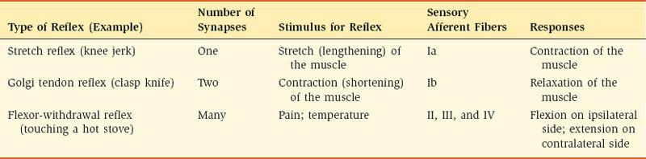

##### *신축 반사*

신장(**근력성**) 반사는 무릎반사로 예시됩니다([그림 3-32](#filepos482363)). 다음 단계는 감각 구심성 신경(Ia군 구심성)과 운동 원심성 신경(α 운동뉴런) 사이에 단 하나의 시냅스만 있는 신장 반사에서 발생합니다.

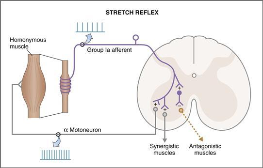

**그림 3–32 신장 반사의 작동.**
*실선*은 흥분성 경로를 보여줍니다. *점선*은 억제 단계를 나타냅니다. *개방* 뉴런은 흥분성입니다. *채워진* 뉴런은 억제성입니다.

1. 근육이 신장되면 근방추의 그룹 Ia 구심성 섬유가 활성화되고 발사 속도가 증가합니다. 이들 그룹 Ia 구심성 신경은 척수로 들어가고 *직접* 시냅스를 형성하여 α 운동뉴런을 활성화합니다. α 운동뉴런의 이 풀은 동형근에 신경을 분포시킵니다.
2. 이들 α 운동뉴런이 활성화되면 원래 늘어난 근육(동일근)의 수축을 유발합니다. 근육이 수축하면 짧아져 근방추의 신장이 감소합니다. 근방추는 원래 길이로 돌아가고 Ia 구심성 신경의 발사 속도는 기준선으로 돌아갑니다.
3. 동시에 척수에서 정보가 전달되어 시너지 근육의 수축과 길항근의 이완을 유발합니다.

신장 반사는 **무릎반사**로 설명됩니다. 이는 슬개골 힘줄을 두드려 대퇴사두근을 스트레칭함으로써 시작됩니다. 대퇴사두근과 근방추가 늘어나면 그룹 Ia 구심성 섬유가 자극됩니다. 이들 그룹 Ia 구심성 섬유는 척수의 α 운동뉴런에 시냅스를 형성하고 활성화합니다. 이러한 α 운동뉴런은 대퇴사두근(원래 늘어난 근육)에 신경을 분포시키고 수축을 유발합니다. 대퇴사두근이 수축하고 짧아짐에 따라 특징적인 무릎반사로 인해 아래쪽 다리가 늘어나게 됩니다.

##### *골지힘줄 반사*

골지건 반사는 **역 근섬유 반사**(신장 반사의 역 또는 반대)라고도 불리는 시냅스 없는 척수 반사입니다.

**골지건 기관**은 힘줄에서 발견되는 신장 수용체로, 근육의 수축(단축)을 감지하고 Ib군 구심성 신경을 활성화합니다. 골지건기관은 추외근섬유와 직렬로 배열되어 있습니다(신장반사에서 근육방추의 평행배열과 대조). 골지건 반사의 단계는 [그림 3-33](#filepos485190)과 같으며, 그 설명은 다음과 같다.

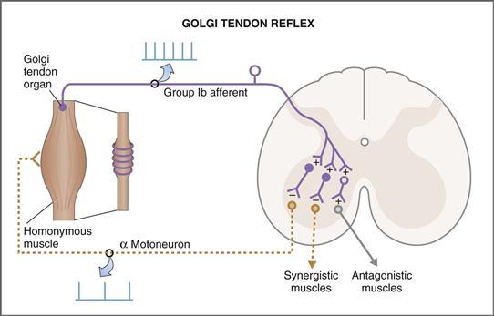

**그림 3–33 골지건 반사의 작동.**
*실선*은 흥분성 경로를 보여줍니다. *점선*은 억제 단계를 나타냅니다. *개방* 뉴런은 흥분성입니다. *채워진* 뉴런은 억제성입니다.

1. 근육이 수축하면 추외근섬유가 짧아지고 이에 부착된 골지건 기관이 활성화됩니다. 차례로, 척수의 억제성 개재뉴런에 시냅스를 이루는 그룹 Ib 구심성 섬유가 활성화됩니다. 이러한 억제성 개재뉴런은 α 운동뉴런에서 시냅스를 이룹니다.
2. 억제성 개재뉴런이 활성화되면(즉, *억제*되도록 활성화됨) α 운동뉴런의 발사를 억제하여 동형근(원래 수축되었던 근육)을 이완시킵니다.
3. 동측근이 이완됨에 따라 반사 작용으로 인해 시너지 근육이 이완되고 길항근이 ​​수축됩니다.

골지건 반사의 과장된 형태는 **걸쇠-칼 반사**로 설명됩니다. 이 반사는 비정상적이며 근육긴장도가 증가할 때 발생합니다(예: 근육의 과다긴장성 또는 경직성). 관절이 수동적으로 굴곡되면 반대편 근육은 처음에는 이러한 수동적 움직임에 저항합니다. 그러나 굴곡이 계속되면 반대쪽 근육의 긴장이 증가하고 골지건 반사가 활성화되어 반대쪽 근육이 이완되고 관절이 빠르게 닫힙니다. 굴곡에 대한 초기 저항과 빠른 굴곡이 뒤따르는 방식은 주머니칼이 닫히는 방식과 유사합니다. 처음에는 칼이 높은 저항에 대해 천천히 닫혔다가 빠르게 닫힙니다.

##### *굴근-금단 반사*

굴근-움츠림 반사는 촉각, 통증 또는 유해한 자극에 반응하여 발생하는 다시냅스 반사입니다. 체성감각 및 통증 구심성 섬유는 고통스럽거나 유해한 자극으로부터 신체의 영향을 받은 부분을 철수시키는 굴곡 반사를 시작합니다(예: 뜨거운 난로에 손을 대었다가 빠르게 손을 빼는 것). 반사는 동측(즉, 자극측)에 **굴곡**을 일으키고 반대측에는 **신전**을 생성합니다([그림 3-34](#filepos487984)). 굴근-움츠림 반사와 관련된 단계는 다음과 같이 설명됩니다.

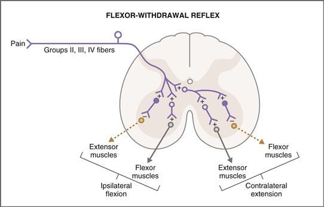

**그림 3–34 굴근-움츠림 반사의 작동.**
*실선*은 흥분성 경로를 보여줍니다. *점선*은 억제 단계를 나타냅니다. *개방* 뉴런은 흥분성입니다. *채워진* 뉴런은 억제성입니다.

1. 사지가 통증이 있는 자극에 닿으면(예: 손이 뜨거운 난로에 닿는 경우) 굴근 반사 구심성 섬유(그룹 II, III 및 IV)가 활성화됩니다. 이러한 구심성 섬유는 척수의 여러 개재뉴런에서 시냅스를 이룹니다(즉, 다시냅스 반사).
2. 통증 자극의 동측에서는 굴근을 수축시키고 신근을 이완시키는 반사 신경이 활성화됩니다. 반사의 이 부분은 동측의 굴곡을 생성합니다(예: 뜨거운 난로에서 손을 빼는 것).
3. 통증 자극의 반대편에서는 신근 근육을 수축시키고 굴근 근육을 이완시키는 반사 신경이 활성화됩니다. 이 반사 부분은 반대쪽의 확장을 생성하며 **교차 확장 반사**라고 합니다. 따라서 통증이 왼쪽에서 발생하면 왼쪽 팔과 다리는 구부러지거나 물러나고 오른쪽 팔과 다리는 균형을 유지하기 위해 확장됩니다.
4. **후방전**이라고 불리는 지속적인 신경 방전이 다시냅스 반사 회로에서 발생합니다. 후방전의 결과로 수축된 근육은 반사가 활성화된 후에도 일정 시간 동안 수축된 상태를 유지합니다.

#### 뇌간을 통한 자세 및 움직임 제어

하행 운동 경로(즉, 대뇌 피질과 뇌간에서 하강하는 경로)는 추체로와 추체외로로 나뉩니다. **추체로**는 수질추를 통과하여 척수의 하부 운동뉴런으로 직접 내려가는 피질척수로와 피질안구로입니다. 다른 모든 것은 **추체외로**입니다. 추체외로는 다음과 같은 뇌간의 구조에서 유래합니다.

 **Rubrospinal tract**는 적색핵에서 시작하여 측면 척수의 운동뉴런으로 연결됩니다. 적핵의 자극은 굴곡근을 활성화하고 신전근을 억제합니다.

 **교교 세망척수로**는 뇌교의 핵에서 시작하여 복내측 척수로 뻗어 있습니다. 자극은 굴근과 신근 근육 *모두*에 일반화된 활성화 효과를 가지며, 신근에 가장 큰 영향을 미칩니다.

 **수질망척수로**는 수질망체 형성에서 시작하여 척수의 운동뉴런으로 뻗어 나갑니다. 자극은 굴근과 신근 근육 *모두*에 일반화된 억제 효과를 가지며, 신근에 가장 큰 영향을 미칩니다.

 **외측 전정척수로**는 외측 전정핵(다이터스 핵)에서 시작하여 척수의 동측 운동뉴런으로 뻗어 나갑니다. 자극은 신근을 활성화하고 굴근을 억제합니다.

 **운동척수로**는 상구(뇌간의 지각 또는 "지붕")에서 시작하여 경추로 뻗어나갑니다. 목 근육의 조절에 관여합니다.

뇌교 망상 형성과 외측 전정 핵은 모두 신근 근육에 강력한 흥분 효과를 갖습니다. 따라서 뇌교 *위* 위*, 중뇌 *아래*에 있는 뇌간의 병변은 **감뇌 경직**이라고 불리는 신근 긴장도의 급격한 증가를 유발합니다. 중뇌 *위* 병변은 제뇌 경직을 *발생시키지 *않습니다*.

#### 소뇌

소뇌 또는 "작은 뇌"는 움직임과 자세를 조절하고 특정 종류의 운동 학습에 역할을 합니다. 소뇌는 움직임의 속도, 범위, 힘, 방향을 제어하는 ​​데 도움을 줍니다(통칭하여 **시너지**라고 함). 소뇌가 손상되면 협응력이 부족해집니다.

소뇌는 후두엽 바로 아래의 후와에 위치합니다. 이는 구심성 및 원심성 신경 섬유를 모두 포함하는 3개의 소뇌각에 의해 뇌간과 연결됩니다.

소뇌에는 전정소뇌, 척수소뇌, 교소뇌의 세 가지 주요 부분이 있습니다. **전정소뇌**는 전정 입력을 지배하며 균형과 안구 운동을 제어합니다. **척수소뇌**는 척수 입력을 지배하며 운동의 시너지 효과를 제어합니다. **교소뇌**는 교뇌핵을 통한 대뇌 입력의 지배를 받으며 움직임의 계획과 시작을 제어합니다.

##### *소뇌 피질의 층*

소뇌피질은 3개의 층으로 구성되어 있으며, 출력세포인 푸르킨예세포(Purkinje cell)와 관련하여 기술된다([그림 3-35](#filepos494198)). 소뇌 피질의 층은 다음과 같습니다.

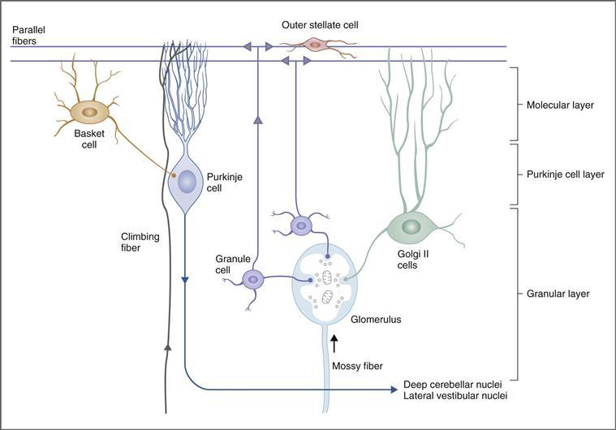

**그림 3–35 단면에 표시된 소뇌 피질의 구조.**

 **세분화된 레이어**는 가장 안쪽 레이어입니다. 그것은 과립 세포, 골지 II 세포 및 사구체를 포함합니다. 사구체에서 척수소뇌와 교소뇌관의 이끼섬유 축삭은 과립의 수상돌기와 골지형 II 세포의 시냅스를 형성합니다.

 **푸르킨제 세포층**은 중간층입니다. 이는 Purkinje 세포를 포함하고 있으며 그 출력은 *항상 억제적입니다.*

 **분자층**은 가장 바깥쪽에 있는 층입니다. 이는 외부 별 모양 세포, 바구니 세포, Purkinje 및 Golgi II 세포의 수상 돌기 및 과립 세포의 축삭을 포함합니다. 과립 세포의 축삭은 평행 섬유를 형성하며, 이 섬유는 푸르킨예 세포, 바구니 세포, 외부 성상 세포 및 골지 유형 II 세포의 수상돌기에 시냅스를 형성합니다.

##### *소뇌 피질에 대한 입력*

소뇌 피질에 **흥분성 입력**을 제공하는 두 가지 시스템, 즉 등반 섬유 시스템과 이끼 섬유 시스템이 있습니다. 각 시스템은 또한 소뇌 피질에 대한 투영 외에도 심부 소뇌 핵에 직접 측부 가지를 보냅니다. 소뇌 피질의 흥분성 돌기는 퍼킨예 세포를 통해 소뇌 핵의 출력을 조절하는 2차 회로를 활성화합니다.

 **등상섬유**는 수질의 하 올리브에서 유래하여 푸르킨예 세포로 직접 투사됩니다. 이러한 섬유는 푸르킨예 세포의 수상돌기를 따라 여러 개의 시냅스 연결을 형성하지만, 각 푸르킨예 세포는 단 *하나*의 등반 섬유로부터 입력을 받습니다. 이러한 시냅스 연결은 강력합니다! 등반 섬유의 단일 활동 전위는 푸르킨예 세포의 수상돌기에서 **복합 스파이크**라고 불리는 여러 번의 흥분성 폭발을 유발할 수 있습니다. 등반 섬유는 푸르킨예 세포를 "조절"하고 이끼 섬유 유입에 대한 반응을 조절하는 것으로 믿어집니다. 등반 섬유는 또한 소뇌 학습에 중요한 역할을 할 수 있습니다.

 **이끼 섬유**는 소뇌 입력의 대부분을 구성합니다. 이러한 섬유에는 전정소뇌, 척수소뇌 및 교소뇌 구심성이 포함됩니다. 이끼 섬유는 사구체라고 불리는 시냅스 집합에 위치한 흥분성 개재뉴런인 과립 세포로 돌출됩니다. 이 과립 세포의 축삭은 분자층으로 올라가서 두 갈래로 갈라져 평행 섬유를 형성합니다. 과립 세포의 **평행 섬유**는 *많은* 퍼킨제 세포의 수상돌기와 접촉하여 퍼킨제 세포 열을 따라 여기의 "빔"을 생성합니다. 각 푸르킨예 세포의 수지상 나무는 최대 250,000개의 평행 섬유로부터 입력을 받을 수 있습니다! 푸르킨예 수상돌기(복잡한 스파이크 생성)에 대한 등반 섬유 입력과 대조적으로, 이끼 섬유 입력은 **단순 스파이크**라고 불리는 단일 활동 전위를 생성합니다. 이러한 평행 섬유는 또한 소뇌 개재 뉴런(바스켓, 성상 및 골지 II)에서 시냅스를 형성합니다.

##### *소뇌의 중간뉴런*

소뇌 개재뉴런의 기능은 퍼킨예 세포의 출력을 **조절**하는 것입니다. 과립 세포를 제외하고 모든 소뇌 개재뉴런은 억제성입니다. 과립 세포는 바구니 세포, 성상 세포, 골지 II 세포 및 Purkinje 세포에 흥분성 입력을 갖습니다. 바구니 세포와 별 모양 세포는 (평행 섬유를 통해) Purkinje 세포를 억제합니다. 골지 II 세포는 과립 세포를 억제하여 Purkinje 세포에 대한 흥분 효과를 감소시킵니다.

##### *소뇌 피질의 출력*

소뇌 피질의 유일한 출력은 **퍼킨제 세포의 축색돌기**를 통해서입니다. 퍼킨제 세포의 출력은 ***항상* 억제성**입니다. 왜냐하면 이 시냅스에서 방출되는 신경 전달 물질은 γ-아미노부티르산(**GABA**)이기 때문입니다([장 참조). 1](CR%21G9RE0KW4PD33Q9F3DXNCSBNXCANP_split_007.html#filepos27757)). 퍼킨제 세포의 축색돌기는 지형학적으로 심부소뇌핵과 외측전정핵으로 돌출되어 있습니다. 소뇌 피질의 이러한 억제 출력은 운동 속도, 범위, 힘 및 방향(시너지)을 조절합니다.

##### *소뇌 장애*

소뇌 병변은 **운동실조증**이라는 비정상적인 운동을 초래합니다. 소뇌 운동실조는 운동 속도, 범위, 힘 및 방향의 오류로 인한 조정 부족입니다. 운동실조증은 여러 가지 방법 중 하나로 나타날 수 있습니다. 움직임의 **지연된 시작** 또는 일련의 움직임 실행이 제대로 이루어지지 않아 움직임이 조화되지 않은 것처럼 보일 수 있습니다. 팔다리는 목표를 **오버슛**하거나 목표에 도달하기 전에 멈출 수 있습니다. 운동실조증은 빠르고 교대로 움직이는 동작을 수행할 수 없는 **운동 장애**로 표현될 수 있습니다. **의도 떨림**은 자발적인 움직임의 방향과 수직으로 발생할 수 있으며 움직임이 끝날 무렵에 증가합니다. (소뇌 질환에서 나타나는 의도성 떨림은 파킨슨병에서 나타나는 안정시 떨림과 다릅니다.) **반동 현상**은 움직임을 멈출 수 없는 것입니다. 예를 들어, 소뇌 질환이 있는 사람이 저항에 맞서 팔뚝을 구부리면 저항이 제거되면 굴곡을 멈출 수 없을 수도 있습니다.

#### 기저핵

기저핵은 종뇌의 깊은 핵입니다: **미상핵, 피각, 담창구** 및 **편도체.** 또한 시상의 복부 전방 핵과 복부 측면 핵, 간뇌의 시상하 핵, 중뇌의 흑색질을 포함한 관련 핵도 있습니다.

기저핵의 주요 기능은 시상을 통과하는 경로를 통해 운동 피질에 영향을 미치는 것입니다. 기저핵의 역할은 원활한 움직임을 계획하고 실행하는 데 도움을 주는 것입니다. 기저핵은 또한 정서적, 인지적 기능에 기여합니다.

기저핵으로 들어가고 나오는 경로는 [그림 3-36](#filepos501708)과 같이 복잡합니다. 대뇌 피질의 거의 모든 영역은 운동 피질의 중요한 입력을 포함하여 선조체에 지형적으로 투영됩니다. 그런 다음 선조체는 시상과 통신한 다음 두 가지 다른 경로를 통해 피질로 돌아갑니다.

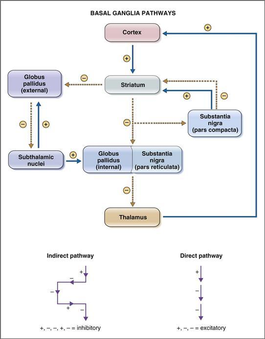

**그림 3–36 기저핵의 경로.** 대뇌 피질, 기저핵 및 시상의 관계가 표시됩니다. *파란색 실선*은 흥분성 경로를 나타냅니다. *갈색 점선*은 억제 경로를 나타냅니다. 간접 경로의 전체 출력은 억제이고, 직접 경로의 전체 출력은 여기입니다. (Kandel ER, Schwartz JH, Jessell TM: 신경 과학의 원리, 4판 뉴욕, McGraw-Hill, 2000에서 수정됨.)

 **간접 경로.** 간접 경로에서 선조체는 담창구의 외부 부분에 대한 억제 입력을 가지며, 이는 시상하 핵에 대한 억제 입력을 갖습니다. 시상하핵은 담창구의 내부 분절과 흑색질의 망상부에 흥분성 입력을 투사하여 시상에 억제성 입력을 보냅니다. 그런 다음 시상은 흥분성 입력을 운동 피질로 다시 보냅니다. 이 경로에서 억제성 신경전달물질은 **GABA**이고 흥분성 신경전달물질은 **글루타메이트입니다.** 그림 하단의 요약 다이어그램에 설명된 것처럼 간접 경로의 전체 출력은 **억제성**입니다.

 **직접 경로.** 직접 경로에서 선조체는 담창구의 내부 부분과 흑색질의 망망부에 억제 입력을 보내고, 이는 시상에 억제 입력을 보냅니다. 간접 경로에서와 마찬가지로 시상은 흥분성 입력을 운동 피질로 다시 보냅니다. 다시 말하지만, 억제성 신경전달물질은 **GABA**이고 흥분성 신경전달물질은 **글루타메이트**입니다. 그림 하단의 요약 다이어그램에 표시된 것처럼 직접 경로의 전체 출력은 **흥분성**입니다.

기저핵에서 운동 피질까지의 간접 경로와 직접 경로의 출력은 반대이며 조심스럽게 균형을 이루고 있습니다. 간접 경로는 억제성 경로이고 직접 경로는 흥분성 경로입니다. 경로 중 하나에 장애가 발생하면 운동 활동이 증가하거나 감소하여 운동 제어의 균형이 깨집니다. 이러한 불균형은 기저핵 질환의 특징입니다.

간접 및 직접 경로의 기본 회로 외에도 선조체와 흑질의 치밀부 사이에 *앞뒤로* 추가 연결이 있습니다. 선조체로 다시 연결되는 신경전달물질은 **도파민**입니다. 흑색질과 선조체 사이의 이러한 추가 연결은 도파민이 간접 경로에서는 억제성(D2 수용체를 통해)이고 직접 경로에서는 흥분성(D1 수용체를 통해)이 된다는 것을 의미합니다.

##### *기저핵 질환*

기저핵의 질병에는 파킨슨병과 헌팅턴병이 포함됩니다. **파킨슨병**에서는 흑색질 치밀부의 세포가 퇴화되어 간접 경로를 통한 억제가 감소하고 직접 경로를 통한 흥분이 감소합니다. 파킨슨병의 특징은 기저핵의 기능 장애(휴식 떨림, 움직임의 둔화 및 지연, 질질 끄는 보행)로 설명할 수 있습니다. 파킨슨병 치료에는 **L-도파**(도파민의 전구체)로 치료하거나 브로모크립틴과 같은 도파민 작용제를 투여하여 도파민을 대체하는 것이 포함됩니다. **헌팅턴병**은 선조체 및 피질 콜린성 뉴런과 억제성 GABA성 뉴런의 파괴로 인해 발생하는 유전성 질환입니다. 헌팅턴병의 신경학적 증상은 무도회(몸부림) 운동과 치매입니다. 치료법이 없습니다.

#### 운동피질

**자발적 움직임**은 하행 경로를 통해 운동 피질의 지시를 받습니다. 자발적인 운동 활동을 생성하는 데 필요한 동기와 아이디어는 먼저 대뇌 피질의 여러 연관 영역에서 조직화된 다음 **운동 계획** 개발을 위해 보조 운동 및 전운동 피질로 전달됩니다. 운동 계획은 수축해야 하는 특정 근육, 수축해야 하는 정도, 수축해야 하는 순서를 식별합니다. 그런 다음 이 계획은 일차운동피질의 상부 운동뉴런으로 전달되고, 이 계획은 하강경로를 통해 척수의 하부 운동뉴런으로 전달됩니다. 계획의 계획 및 실행 단계도 소뇌 및 기저핵의 운동 제어 시스템에 의해 영향을 받습니다.

운동 피질은 일차 운동 피질, 보조 운동 피질, 전운동 피질의 세 영역으로 구성됩니다.

 **전운동 피질과 보조 운동 피질**(**영역 6**)은 움직임의 **계획 생성**을 담당하는 운동 피질의 영역으로, 이 운동 피질은 실행을 위해 일차 운동 피질로 전달됩니다. 보조 운동 피질은 복잡한 운동 순서를 프로그래밍하고 움직임이 없을 때에도 움직임의 "정신적 예행" 중에 활성화됩니다.

 **1차 운동 피질**(**영역 4**)은 움직임의 **실행**을 담당하는 운동 피질 영역입니다. 프로그램된 운동뉴런 패턴은 일차운동피질에서 활성화됩니다. 운동 피질의 상부 운동 뉴런이 흥분되면 이 활동은 뇌간과 척수로 전달되고, 그곳에서 하부 운동 뉴런이 활성화되어 해당 근육의 ​​조화로운 수축(즉, 수의 운동)이 생성됩니다. 일차 운동 피질은 지형학적으로 조직되어 있으며 **운동 호문쿨루스**로 설명됩니다. 이러한 지형학적 조직은 일차 운동 피질에서 발생하는 간질 사건인 **잭슨 발작**에서 극적으로 설명됩니다. 간질 사건은 대개 한 손의 손가락에서 시작되어 손과 팔로 진행되어 결국 몸 전체로 퍼집니다(예: "잭슨 행진").

### 신경계의 더 높은 기능

#### 뇌파검사

뇌전도(EEG)는 두개골에 배치된 전극을 통해 대뇌 피질의 전기적 활동을 기록합니다. EEG 파동은 표면 전극에 의해 감지될 수 있도록 피질을 가로질러 충분한 세포외 전류 흐름을 생성하는 교대하는 흥분성 및 억제성 시냅스 전위에서 발생합니다. (EEG파는 활동 전위가 아닙니다. 두개골 표면의 전극은 단일 활동 전위의 작은 전압 변화를 감지할 만큼 충분히 민감하지 않습니다.)

정상 뇌파([그림 3-37](#filepos509960))는 다양한 진폭과 주파수를 갖는 파동으로 구성되어 있다. **눈을 뜨고** 깨어 있는 정상적인 성인의 경우, 두정엽과 후두엽에 기록된 주요 주파수는 비동기식 저전압, 고주파수 파동으로 구성된 베타 리듬(13~30Hz)입니다. **눈을 감았을 때** 지배적인 주파수는 알파 리듬(8~13Hz)이며, 이는 더 높은 전압과 더 낮은 주파수의 동기파를 더 많이 가지고 있습니다.

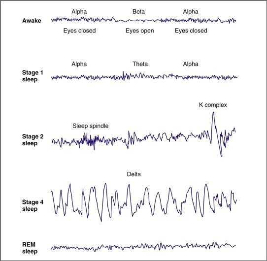

**그림 3–37 깨어 있는 피험자와 1, 2, 4단계 및 REM 수면에 있는 피험자의 뇌파도.**

사람은 잠들면서 **서파수면**의 네 단계를 거친다. 1단계에서는 눈을 감고 깨어 있는 성인에게서 보이는 알파파와 저주파 세타파가 산재해 있다. 2단계에서는 이러한 저주파 파동에 **수면 방추**라고 하는 고주파 폭발과 **K 복합체**라고 하는 크고 느린 전위가 산재해 있습니다. 3단계(그림에 표시되지 않음)에는 매우 낮은 주파수의 델타파와 간헐적인 수면 스핀들이 있습니다. 4단계는 델타파가 특징입니다. 약 90분마다 서파수면 패턴이 **빠른 안구 운동**(**REM**) **수면**으로 바뀌는데, 여기서 EEG는 깨어 있는 사람과 유사한 저전압, 고주파수 파동과 비동기화됩니다. REM 수면은 때때로 역설적 수면(paradoxical sleep)이라고도 불립니다. EEG가 깨어 있는 상태와 가장 유사하더라도 사람은 (역설적이게도) 깨어나기가 가장 어렵습니다. REM 수면은 근육긴장 손실, 특히 안구 근육의 손실로 인해 빠른 안구 운동, 온도 조절 손실, 동공 수축, 음경 발기, 심박수, 혈압 및 호흡의 변동이 나타나는 것이 특징입니다. 대부분의 꿈은 REM 수면 중에 발생합니다. 서파수면과 REM 수면의 비율은 수명에 따라 다양합니다. 신생아는 수면의 절반을 REM 수면으로 보냅니다. 젊은 성인은 수면의 약 25%를 REM 수면으로 보냅니다. 노인들은 REM 수면이 거의 없습니다.

#### 학습과 기억

학습과 기억은 신경계의 더 높은 수준의 기능입니다. **학습**은 사람이 경험의 결과로 자신의 행동을 변화시키는 신경 메커니즘입니다. **기억**은 학습한 내용을 저장하는 메커니즘입니다.

학습은 비연관적 학습과 연관 학습으로 분류됩니다. 습관화로 예시되는 **비연관** 학습에서는 반복된 자극이 반응을 일으키지만, 자극이 중요하지 않다는 것을 "학습"함에 따라 그 반응은 점차 감소합니다. 예를 들어, 뉴욕시에 새로 온 사람은 처음에는 거리의 소음에 잠에서 깰 수 있지만, 결국 소음은 관련이 없다는 것을 알게 되므로 무시하게 됩니다. 습관화의 반대는 민감화입니다. 여기서 자극은 자극이 중요하다는 것을 학습했을 때 후속 반응의 확률이 더 높아집니다. **연관** 학습에서는 자극 타이밍에 일관된 관계가 있습니다. **고전적 조건화**에서는 조건 자극과 학습되지 않은 반응을 이끌어내는 무조건 자극 사이에 시간적 관계가 있습니다. 조합이 반복되면 시간적 관계가 유지되고 연관이 학습됩니다. 일단 학습되면(예를 들어 파블로프의 개에 의해) 자극(예를 들어 종소리)만이 학습되지 않은 반응(예를 들어 타액 분비)을 이끌어냅니다. **조작적 조건화**에서는 자극에 대한 반응이 긍정적이든 부정적이든 강화되어 반응이 바뀔 확률이 높아집니다.

**시냅스 가소성**은 학습의 기초가 되는 기본 메커니즘입니다. 즉, 시냅스 기능은 가변적이며 이전 활동 수준 또는 시냅스를 통한 "트래픽"에 따라 달라집니다. 시냅스 후 뉴런의 반응성(**시냅스 강도**라고 함)은 고정되어 있지 않고 오히려 이전 수준의 시냅스 트래픽에 따라 달라집니다. 예를 들어, **강화** 현상에서 신경 경로의 반복적인 활성화는 해당 경로에서 시냅스 후 뉴런의 반응성을 증가시킵니다. 향상된 반응 기간은 밀리초 정도로 짧을 수도 있고 며칠 또는 몇 주 동안 지속될 수도 있습니다(예: **장기 강화**). 반대로 습관화 시 시냅스 활동이 증가하면 시냅스 후 뉴런의 반응성이 감소합니다.

장기 강화 메커니즘에는 흥분성 신경전달물질인 **글루타메이트**와 그 ***N*-메틸-D-아스파르트산염**(**NMDA**) **수용체를 사용하는 시냅스 경로가 포함됩니다. 시냅스 전 뉴런이 활성화되면 글루타메이트가 방출되어 시냅스를 통해 확산되고 시냅스 후 막의 NMDA 수용체가 활성화됩니다. NMDA 수용체는 리간드 개폐 이온 Ca2+ 채널로, 열리면 Ca2+가 시냅스후 세포로 들어갈 수 있습니다. 고주파 자극(경로의 활성 증가)으로 인해 더 많은 Ca2+가 시냅스후 세포에 축적됩니다. 세포 내 Ca2+ 농도가 높을수록 단백질 키나제 활성이 증가하고, 완전히 이해되지 않은 메커니즘에 의해 해당 시냅스의 반응성이 증가합니다.

### 뇌척수액

인간의 뇌는 80%가 체액으로 구성되어 있으며, 그 중 대부분이 뇌척수액(CSF)입니다. CSF는 맥락막 신경총(외측, 제3, 제4뇌실에 위치)의 상피 세포에 의해 하루 500밀리리터(mL)의 속도로 형성됩니다. 맥락막 신경총에서 생성된 CSF는 뇌실과 뇌 및 척수를 둘러싸는 거미막하 공간으로 흘러 들어갑니다. 거미막하 공간의 확장된 영역을 거미막하 수조라고 합니다. 체액은 단방향 대량 흐름을 통해 뇌척수액에서 정맥혈로 전달되고 전신 순환계로 반환됩니다. 정상 상태에서 CSF에서 정맥혈로의 체액 이동은 CSF 형성 속도(즉, 500mL/일)와 동일해야 합니다. 진단 목적으로 요추 수조에 있는 **요추 천자**를 사용하여 뇌척수액 샘플을 채취할 수 있습니다.

뇌의 동맥혈 공급과 맥락막, 혈액뇌장벽의 관계는 [그림 3-38](#filepos516667)과 같다. 물질은 뇌세포(간질액으로 채워져 있음), 간질액 및 뇌척수액 사이에서 교환될 수 있습니다.

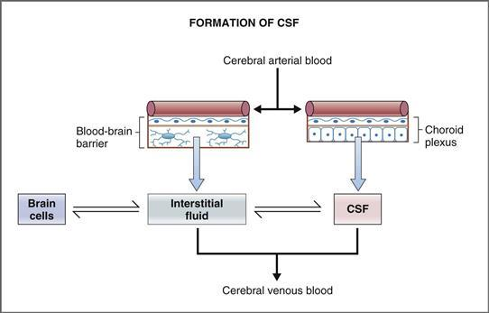

**그림 3–38 뇌척수액 생산 메커니즘.** CSF, 뇌척수액.

뇌모세혈관과 뇌척수액 사이의 장벽은 **맥락막 신경총**입니다. 이 장벽은 모세혈관 내피 세포와 기저막, 신경교세포막, 맥락막 상피 세포의 3개 층으로 구성됩니다. 맥락총 상피 세포는 신장 원위 세뇨관의 세포와 유사하며 모세혈관에서 CSF로 용질과 체액을 이동시키는 수송 메커니즘을 포함합니다.

뇌모세혈관과 뇌간질액 사이의 장벽은 **혈뇌장벽**입니다. 해부학적으로 혈액뇌장벽은 모세혈관내피세포와 기저막, 신경교세포막, 신경교말단발(장벽의 뇌측에서 나오는 성상세포의 돌출부)로 구성됩니다. 기능적으로 혈액뇌장벽은 다른 조직의 유사한 장벽과 두 가지 면에서 다릅니다. (1) 뇌 내피 세포 사이의 접합부는 너무 "단단"하여 세포 *사이*를 통과할 수 있는 물질이 거의 없습니다. (2) 소수의 물질만이 내피 세포를 *통과*할 수 있습니다. 지용성 물질(예: 산소 및 이산화탄소)은 혈액뇌관문을 통과할 수 있지만 수용성 물질은 제외됩니다.

#### 뇌척수액의 형성

CSF는 맥락막 신경총의 상피 세포에 의해 형성됩니다. 이들 세포의 수송 메커니즘은 혈액에서 CSF로 일부 물질(예: Na+, Cl-, 물)을 분비하고 CSF의 다른 물질을 혈액으로 흡수합니다. 단백질, 콜레스테롤과 같은 분자는 분자 크기가 크기 때문에 뇌척수액에서 제외됩니다. 반면, 산소와 이산화탄소와 같은 지용성 물질은 두 구획 사이에서 자유롭게 이동하고 평형을 이룹니다. 따라서 운반 메커니즘과 장벽의 특성에 따라 일부 물질은 혈액보다 뇌척수액에 더 높은 농도로 존재하고, 일부는 대략 동일한 농도로 존재하며, 일부는 혈액보다 뇌척수액에 더 낮은 농도로 존재합니다. 뇌간질액과 뇌척수액 사이에는 많은 물질이 쉽게 교환됩니다([그림 3-38](#filepos516667) 참조). 따라서 간질액과 뇌척수액의 구성은 서로 유사하지만 혈액과는 다릅니다. [표 3-6](#filepos519526)은 뇌척수액과 혈액의 조성을 비교한 것이다.

표 3-6 뇌척수액의 구성

|  |  |  |
| --- | --- | --- |
| **[CSF] ≒ [혈액]** | **[CSF] < [혈액]** | **[CSF] > [혈액]** |
| Na+ Cl− HCO3− 삼투압 | K+ Ca2+ 포도당 아미노산 pH 콜레스테롤[\*](#filepos520785) 단백질[\*](#filepos520785) | Mg2+ 크레아티닌 |

CSF, 뇌척수액.

\*CSF에서는 무시할 수 있습니다.

#### 뇌척수액의 기능

CSF의 기능은 뇌 세포에 지속적이고 통제된 환경을 제공하고 내인성 또는 외인성 독소로부터 뇌를 보호하는 것입니다. CSF는 또한 국소 신경전달물질이 일반 순환계로 빠져나가는 것을 방지하는 기능을 할 수도 있습니다. 약물은 지질 용해도에 따라 다양한 정도로 혈액뇌장벽을 통과합니다. 따라서 비이온화된(지용성) 약물은 뇌에 쉽게 침투하는 반면, 이온화된(비지용성) 약물은 뇌에 침투하지 않습니다. 염증, 방사선 조사 및 종양은 혈액뇌관문의 투과성을 증가시켜 일반적으로 배제되는 물질이 뇌로 들어가도록 허용할 수 있습니다. 이러한 물질에는 암 화학요법 약물, 항생제, 방사성 표지자가 포함됩니다.

### 요약

 감각 시스템은 특수 감각 수용체와 CNS의 일련의 1차, 2차, 3차 및 4차 뉴런을 통해 환경에서 CNS로 정보를 전송합니다. 감각 수용체에는 기계 수용체, 광수용체, 화학 수용체, 열 수용체 및 통각 수용체가 포함됩니다. 자극(예: 빛)은 변환 과정을 통해 감각 수용체에서 전기 에너지로 변환되어 수용체 전위가 생성됩니다.

 체성감각 및 통증 시스템은 등쪽 기둥과 전외측 시스템을 사용하여 촉각, 위치, 통증 및 온도에 대한 정보를 처리합니다.

 시각 시스템은 빛 자극을 감지하고 해석합니다. 광수용체는 빛에 반응하여 과분극되는 망막의 간상체와 원추체입니다. 광수용체는 양극성 세포와 망막의 수평 세포에서 시냅스를 형성하며 양극성 세포와 수평 세포의 수용체 유형에 따라 여기 또는 억제를 생성합니다. 망막의 출력 세포는 신경절 세포이며, 그 축삭은 시신경을 형성합니다. 시신경은 시상의 외측슬상핵에서 시냅스를 이룬다. 각 비강 반망막의 섬유는 시교차에서 교차하여 반대쪽으로 올라갑니다. 각 측두반망막의 섬유는 동측으로 올라갑니다.

 청각 시스템은 음파의 변환을 포함합니다. 기계수용체는 내이의 코르티 기관에 위치한 청각 유모세포입니다. 유모 세포의 섬모가 구부러지면 진동 수용체 전위가 생성됩니다. 기저막을 따라 있는 유모세포의 위치는 주파수를 암호화합니다.

 전정 시스템은 평형과 균형을 유지하는 데 사용됩니다. 전정 유모 세포는 반고리관의 팽대부와 이석 기관에 위치한 기계 수용체입니다. 반고리관은 머리의 각가속도를 감지하고 이석 기관은 선형 가속도를 감지합니다.

 화학적 감각은 후각과 미각입니다. 후각 상피에는 일차 구심성 뉴런이기도 한 후각 수용체 세포가 포함되어 있습니다. 이들 뉴런의 축삭은 체판을 통과하여 후각 구의 사구체에서 시냅스를 통과합니다. 미각 수용체는 유두로 조직된 미뢰에서 발견됩니다.

 근방추는 추내근섬유로 구성되며 추외근섬유와 평행하게 배열됩니다. 근방추는 추외 섬유가 수축하거나 이완될 때 근육 길이의 변화를 감지하는 신장 수용체입니다.

 척수 반사에는 신장 반사(단일시냅스), 골지건 반사(시냅스 장애) 및 굴곡-철퇴 반사(다중시냅스)가 포함됩니다.

 대뇌 피질과 뇌간에서 하행 운동 경로는 추체로와 추체외로로 구분됩니다. 추체로(Pyramidal tract)는 수질을 통과하고 척수의 하부 운동뉴런에 있는 시냅스를 통과합니다. 추체외로에는 루브로스피날(rubrospinal), 뇌교세망척수로(pontine reticulospinal tract), 수질세망척수로(medullary reticulospinal tract), 외측전정척수로(Lateral Vestibulospinal tract), 지각척수로(tectospinal tract)가 포함됩니다.

 소뇌는 시너지 효과를 조절하여 움직임을 조절합니다. 소뇌 피질은 과립층, 퍼킨예 세포층, 분자층으로 구성됩니다. 소뇌 피질의 출력은 퍼킨제 세포의 축삭을 통해 이루어지며 항상 억제됩니다. 소뇌 장애는 운동실조를 유발합니다.

 기저핵은 종뇌의 깊은 핵으로, 부드러운 움직임의 계획과 실행에 관여합니다.

 운동 피질에는 운동 계획 생성을 담당하는 전운동 피질과 보조 피질이 포함됩니다. 일차 운동 피질은 운동 계획의 실행을 담당합니다.

---

***도전해 보세요***

각 질문에 단어, 구문, 문장 또는 숫자로 답해 보세요. 질문과 함께 가능한 답변 목록이 제공되는 경우 선택 항목 중 하나, 둘 이상 또는 하나도 정답이 아닐 수 있습니다. 책 말미에는 정답이 나와 있습니다.

**[1](CR%21G9RE0KW4PD33Q9F3DXNCSBNXCANP_split_029.html#filepos2281325)***시신경 교차, 왼쪽 시신경, 오른쪽 시신경, 오른쪽 시신경, 왼쪽 시신경 중 오른쪽 눈의 완전 실명으로 이어지는 요소를 절단하면?*

**[2](CR%21G9RE0KW4PD33Q9F3DXNCSBNXCANP_split_029.html#filepos2281406)***발레리나가 오른쪽으로 회전합니다. 그녀가 갑자기 회전을 멈추면 그녀의 눈은 어느 방향으로 움직일까요?*

**[3](CR%21G9RE0KW4PD33Q9F3DXNCSBNXCANP_split_029.html#filepos2281567)***운동 단위에는 몇 개의 운동 뉴런이 있습니까?*

**[4](CR%21G9RE0KW4PD33Q9F3DXNCSBNXCANP_split_029.html#filepos2281634)***다음 반사 신경 중 하나의 시냅스만 구성하는 것은 무엇입니까: 무릎반사, 골지건 반사, 신장 반사, 뜨거운 난로에서 손을 뺄 때 관련된 반사?*

**[5](CR%21G9RE0KW4PD33Q9F3DXNCSBNXCANP_split_029.html#filepos2281781)***위상 또는 강장제 중 어떤 유형의 수용체에서 자극이 계속되더라도 수용체 전위가 역치 아래로 떨어지나요?*

**[6](CR%21G9RE0KW4PD33Q9F3DXNCSBNXCANP_split_029.html#filepos2281851)***이러한 광수용 이벤트를 올바른 순서로 배치하십시오: 신경 전달 물질 방출, 순환 GMP 감소, 빛, 11-시스 로돕신의 전트랜스 로돕신으로의 전환, 트랜스두신, 과분극, Na+ 채널 폐쇄.*

**[7](CR%21G9RE0KW4PD33Q9F3DXNCSBNXCANP_split_029.html#filepos2282125)***과분극 수용체 전위는 막 전위를 \_\_\_\_\_\_(다소) 음수로 만들고 활동 전위가 발생할 가능성을 \_\_\_\_\_\_(증가 또는 감소)시킵니다.*

**[8](CR%21G9RE0KW4PD33Q9F3DXNCSBNXCANP_split_029.html#filepos2282277)***골지 힘줄 반사 작동에서 다음 각 항목이 활성화(증가), 억제(감소) 또는 변경되지 않는지 여부를 나타냅니다.*

골지건기관

Ia 구심성 섬유

Ib 구심성 섬유

억제성 개재뉴런

α운동뉴런

**[9](CR%21G9RE0KW4PD33Q9F3DXNCSBNXCANP_split_029.html#filepos2282769)***다음 중 단백질, 삼투압, Mg2+, 포도당, Na+, K+ 중 뇌척수액보다 혈액에서 더 높은 농도로 발견되는 것은 무엇입니까?*

**[10](CR%21G9RE0KW4PD33Q9F3DXNCSBNXCANP_split_029.html#filepos2282864)***머리가 오른쪽으로 회전하면 초기 회전 중에 어느 수평 반고리관(오른쪽 또는 왼쪽)이 활성화됩니까? 머리 회전이 멈추면 어느 관(오른쪽 또는 왼쪽)이 활성화됩니까?*

**[11](CR%21G9RE0KW4PD33Q9F3DXNCSBNXCANP_split_029.html#filepos2283041)***베이스와 비교하여 기저막의 정점은 \_\_\_\_\_\_(넓음/좁음)이고 \_\_\_\_\_\_(더 유연함/덜 유연함)이며 \_\_\_\_\_\_(더 높은/낮은) 주파수에 반응합니다.*

---

#### 선정된 독서

> Adrian ED, Zotterman Y: 감각 신경 말단에서 생성되는 자극. 2부. 단일 말단 기관의 반응. J Physiol 61:151–171, 1926.
>
> Boyd IA: 분리된 포유류의 근방추. Trends Neurosci 3:258–265, 1980.
>
> Finger TE, Silver WL: 미각과 후각의 신경생물학. 뉴욕, 존 와일리, 1987.
>
> Hille B: 흥분성 막의 이온 채널, 2판. 선덜랜드, 매사추세츠, 시나우어, 1991.
>
> Hubel DH, Wiesel TN: 시각의 뇌 메커니즘. Sci Am 242:150–162, 1979.
>
> Ito M: 소뇌와 신경 조절. 뉴욕, 레이븐 프레스, 1984.
>
> Kandel ER, Schwartz JH, Jessell TM: 신경과학의 원리, 4판. 뉴욕, 맥그로힐, 2000.
>
> Katz B: 신경, 근육, 시냅스. 뉴욕, 맥그로힐, 1966년.
>
> Schnapf JL, Baylor DA: 광수용체 세포가 빛에 반응하는 방식. Sci Am 256:40–47, 1987.