# 4 Cardiovascular Physiology

xml 버전='1.0' 인코딩='utf-8'?

생리학

## *심혈관 생리학*

> [심혈관계의 회로](#filepos533980)

> [혈역학](#filepos542533)

> [심장전기생리학](#filepos598966)

> [심장근육 수축](#filepos659035)

> [심장주기](CR%21G9RE0KW4PD33Q9F3DXNCSBNXCANP_split_012.html#filepos715195)

> [심박출량과 정맥환류의 관계](CR%21G9RE0KW4PD33Q9F3DXNCSBNXCANP_split_012.html#filepos726361)

> [동맥압 조절](CR%21G9RE0KW4PD33Q9F3DXNCSBNXCANP_split_012.html#filepos751686)

> [미세순환](CR%21G9RE0KW4PD33Q9F3DXNCSBNXCANP_split_012.html#filepos787482)

> [특별 순환](CR%21G9RE0KW4PD33Q9F3DXNCSBNXCANP_split_012.html#filepos807647)

> [온도 조절](CR%21G9RE0KW4PD33Q9F3DXNCSBNXCANP_split_012.html#filepos827464)

> [심혈관계통합기능](CR%21G9RE0KW4PD33Q9F3DXNCSBNXCANP_split_012.html#filepos837314)

> [요약](CR%21G9RE0KW4PD33Q9F3DXNCSBNXCANP_split_012.html#filepos872944)

> [도전해보세요](CR%21G9RE0KW4PD33Q9F3DXNCSBNXCANP_split_012.html#filepos878806)

심혈관계의 주요 기능은 혈액을 조직에 전달하고, 신진대사를 위해 세포에 필수 영양소를 *제공하고, 세포에서* 노폐물을 제거하는 것입니다. 심장은 수축을 통해 일련의 혈관을 통해 혈액을 내보내는 압력을 생성하는 펌프 역할을 합니다. 심장에서 조직으로 혈액을 운반하는 혈관은 동맥으로, 압력이 높고 혈액량이 비교적 적습니다. 조직에서 심장으로 혈액을 다시 운반하는 정맥은 압력이 낮고 혈액량의 가장 큰 비율을 차지합니다. 조직 내에는 모세혈관이라고 불리는 벽이 얇은 혈관이 동맥과 정맥 사이에 끼어 있습니다. 영양분, 노폐물, 체액의 교환은 모세혈관 벽을 통해 일어납니다.

심혈관계는 또한 여러 가지 항상성 기능에도 관여합니다. 동맥 혈압 조절에 참여합니다. 내분비샘에서 표적 조직의 작용 부위로 조절 호르몬을 전달합니다. 체온 조절에 참여합니다. 출혈, 운동, 자세 변화 등 변경된 생리적 상태에 대한 항상성 조정에 관여합니다.

### 심장혈관 시스템의 회로

#### 심장의 왼쪽과 오른쪽

[그림 4-1](#filepos534811)은 심혈관계의 회로도를 개략적으로 나타낸 것이다. 심장과 혈관의 왼쪽과 오른쪽이 서로 연관되어 표시됩니다. 심장의 각 측면에는 **심방**과 **심실**이라는 두 개의 방이 있으며, **방실**(**AV**) **판막이라고 하는 일방향 판막으로 연결되어 있습니다. AV 판막은 혈액이 심방에서 심실로 한 방향으로만 흐를 수 있도록 설계되었습니다.

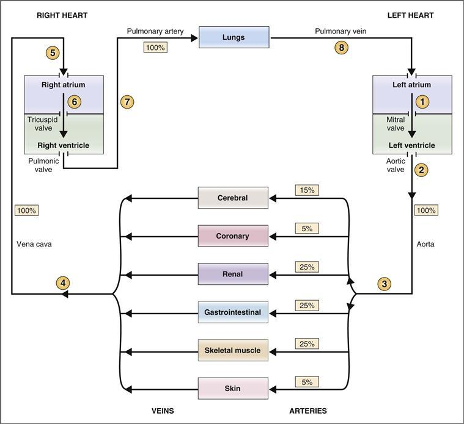

**그림 4-1 심혈관계의 회로를 보여주는 개략도.** *화살표*는 혈류의 방향을 나타냅니다. 백분율은 심박출량의 백분율(%)을 나타냅니다. 동그라미 숫자에 대한 설명은 텍스트를 참조하세요.

왼쪽 심장과 오른쪽 심장은 서로 다른 기능을 합니다. 좌심장과 전신동맥, 모세혈관, 정맥을 총칭하여 **전신순환**이라고 합니다. 좌심실은 폐를 제외한 신체의 모든 기관에 혈액을 공급합니다. 우심장과 폐동맥, 모세혈관, 정맥을 총칭하여 **폐순환**이라고 합니다. 우심실은 혈액을 폐로 펌핑합니다. 왼쪽 심장과 오른쪽 심장은 직렬로 기능하여 혈액이 왼쪽 심장에서 전신 순환계, 오른쪽 심장, 폐 순환계, 그리고 다시 왼쪽 심장으로 순차적으로 펌핑됩니다.

양쪽 심실에서 혈액이 펌핑되는 속도를 **심박출량**이라고 합니다. 심장의 양쪽이 직렬로 작동하기 때문에 정상 상태에서 좌심실의 심박출량은 우심실의 심박출량과 같습니다. 정맥에서 심방으로 혈액이 되돌아오는 속도를 **정맥 복귀**라고 합니다. 또한, 왼쪽 심장과 오른쪽 심장이 직렬로 작동하기 때문에 정상 상태에서 왼쪽 심장으로의 정맥 복귀는 오른쪽 심장으로의 정맥 복귀와 같습니다. 마지막으로, 정상 상태에서 심장 *으로부터의* 심박출량은 심장으로 *으로의* 정맥 복귀와 같습니다.

#### 혈관

혈관에는 여러 가지 기능이 있습니다. 이는 폐쇄된 수동 도관 시스템의 역할을 하며, 영양분과 폐기물이 교환되는 조직으로 혈액을 전달합니다. 혈관은 또한 장기로의 혈류 조절에 적극적으로 참여합니다. 혈관, 특히 세동맥의 저항이 변경되면 해당 기관으로의 혈류가 변경됩니다.

#### 회로

심혈관계를 통한 하나의 완전한 회로의 단계는 [그림 4-1](#filepos534811)에 나와 있습니다. 그림에서 원 안의 숫자는 여기에 설명된 단계에 해당합니다.

1. **산소화된 혈액은 좌심실을 채웁니다.** 폐에서 산소화된 혈액은 폐정맥을 통해 좌심방으로 되돌아옵니다. 그런 다음 이 혈액은 **승모판**(왼쪽 심장의 AV 판막)을 통해 좌심방에서 좌심실로 흐릅니다.
2. **혈액은 좌심실에서 대동맥으로 분출됩니다.** 혈액은 좌심실과 대동맥 사이에 위치한 **대동맥판**(심장의 왼쪽 반월판)을 통해 좌심실에서 나옵니다. 좌심실이 수축하면 심실의 압력이 증가하여 대동맥 판막이 열리고 혈액이 대동맥으로 강제로 분출됩니다. (앞서 언급한 바와 같이, 단위 시간당 좌심실에서 분출되는 혈액의 양을 **심박출량**이라고 합니다.) 그런 다음 혈액은 좌심실의 수축으로 생성된 압력에 의해 동맥계를 통해 흐릅니다.
3. **심장 출력은 다양한 기관에 분배됩니다.** 왼쪽 심장의 총 심박출량은 일련의 평행 동맥을 통해 기관 시스템에 분배됩니다. 따라서 동시에 심박출량의 15%는 대뇌동맥을 통해 뇌로 전달되고, 5%는 관상동맥을 통해 심장으로 전달되며, 25%는 신장동맥을 통해 신장으로 전달되는 식입니다. 기관 시스템의 이러한 **병렬 배열**을 고려하면 전체 전신 혈류량은 심박출량과 같아야 합니다.  
       그러나 다양한 기관 시스템 사이의 심박출량 분포 비율은 고정되어 있지 않습니다. 예를 들어, 격렬한 운동 중에는 골격근으로 이동하는 심박출량의 비율이 휴식 시의 비율에 비해 증가합니다. 장기 시스템으로의 혈류 변화를 달성하기 위한 세 가지 주요 메커니즘이 있습니다. *첫 번째* 메커니즘에서는 심박출량이 일정하게 유지되지만 동맥 저항의 선택적인 변경에 의해 혈류가 기관 시스템 간에 재분배됩니다. 이 시나리오에서는 다른 기관으로의 혈류를 희생시키면서 한 기관으로의 혈류가 증가할 수 있습니다. *두 번째* 메커니즘에서는 심박출량이 증가하거나 감소하지만 기관 시스템 간의 혈류 분포 비율은 일정하게 유지됩니다. 마지막으로, *세 번째* 메커니즘에서는 심박출량 *및* 혈류 분포 비율이 *모두* 변경되는 처음 두 메커니즘의 조합이 발생합니다. 이 세 번째 메커니즘은 예를 들어 격렬한 운동에 대한 반응으로 사용됩니다. 즉, 심박출량 증가와 골격근에 대한 분포 비율 증가의 조합으로 증가된 대사 요구를 충족시키기 위해 골격근으로의 혈류가 증가합니다.
4. **장기에서 나오는 혈액의 흐름은 정맥에 모입니다.** 장기에서 나가는 혈액은 정맥혈이며 이산화탄소(CO2)와 같은 대사 과정에서 발생하는 노폐물을 포함합니다. 이 혼합 정맥혈은 크기가 커지는 정맥에 수집되고 최종적으로 가장 큰 정맥인 **대정맥**에 수집됩니다. 대정맥은 혈액을 오른쪽 심장으로 운반합니다.
5. **우심방으로의 정맥 복귀.** 대정맥의 압력이 우심방의 압력보다 높기 때문에 우심방은 혈액, 즉 정맥 복귀로 채워집니다. 정상 상태에서 우심방으로의 정맥 복귀는 좌심실의 심장 박출량과 동일합니다.
6. **혼합정맥혈은 우심실을 채운다.** 혼합정맥혈은 우심방의 AV판막인 **삼첨판막을 거쳐 우심방에서 우심실로 흐른다.**
7. **우심실에서 폐동맥으로 혈액이 분출됩니다.** 우심실이 수축하면 폐동맥판(심장의 오른쪽 반월판)을 통해 혈액이 폐동맥으로 분출되어 폐로 혈액을 운반합니다. 우심실에서 분출되는 심박출량은 좌심실에서 분출되는 심박출량과 동일합니다. 폐의 모세혈관층에서는 산소(O2)가 폐포 가스로부터 혈액에 첨가되고, CO2는 혈액에서 제거되어 폐포 가스에 첨가됩니다. 따라서 폐에서 나가는 혈액에는 폐로 들어간 혈액보다 O2가 더 많고 CO2가 더 적습니다.
8. **폐에서 나온 혈액의 흐름은 폐정맥을 통해 심장으로 되돌아갑니다.** 산소화된 혈액은 폐정맥을 통해 좌심방으로 되돌아와 새로운 주기를 시작합니다.

### 혈역학

**혈역학**이라는 용어는 심혈관계의 혈류를 지배하는 원리를 나타냅니다. 이러한 물리학의 기본 원리는 일반적으로 유체의 운동에 적용되는 원리와 동일합니다. 흐름, 압력, 저항 및 용량의 개념은 심장과 혈관 내에서 들어오고 나가는 혈류에 적용됩니다.

#### 혈관의 종류와 특성

혈관은 혈액이 심장에서 조직으로, 조직에서 다시 심장으로 운반되는 통로입니다. 또한 일부 혈관(모세혈관)은 벽이 너무 얇아서 물질이 서로 교환될 수 있습니다. 다양한 유형의 혈관 크기와 혈관벽의 조직학적 특성이 다양합니다. 이러한 변화는 저항 및 정전 용량 특성에 큰 영향을 미칩니다.

[그림 4-2](#filepos544086)는 혈관층의 개략도이다. 혈관층을 통과하는 혈류의 방향은 동맥에서 세동맥, 모세혈관, 세정맥, 정맥으로입니다. 동반도인 [그림 4-3](#filepos544417)은 전체 단면적과 혈관계 각층의 혈관수, 각 혈관에 함유된 혈액량의 백분율을 나타내는 그래프이다.

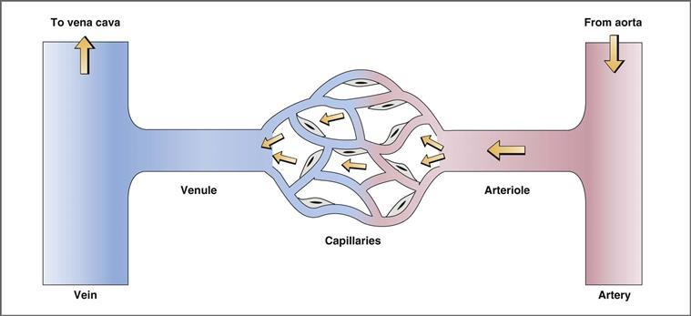

**그림 4-2 심혈관계의 혈관 배열.**

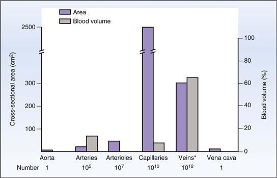

**그림 4–3 전신 혈관에 포함된 면적과 부피.** 혈관은 각 유형의 수, 전체 단면적 및 포함된 혈액량의 백분율(%)로 설명됩니다. (폐혈관은 이 그림에 포함되지 않습니다.) \*전체 수에는 정맥과 세정맥이 포함됩니다.

 **동맥.** 대동맥은 전신 순환의 가장 큰 동맥입니다. 중형 및 소형 동맥은 대동맥에서 분기됩니다. 동맥의 기능은 산소가 풍부한 혈액을 장기에 전달하는 것입니다. 동맥은 **탄성 조직**, 평활근 및 결합 조직이 광범위하게 발달한 **두꺼운 벽으로 구성된** 구조입니다. 동맥벽의 두께는 중요한 특징입니다. 동맥은 심장으로부터 직접 혈액을 받으며 혈관계에서 가장 높은 압력을 받습니다. 동맥에 포함된 혈액량을 **스트레스량**(*고압* 하의 혈액량을 의미)이라고 합니다.

 **세동맥.** 세동맥은 동맥의 가장 작은 가지입니다. 벽에는 **평활근**이 광범위하게 발달되어 있으며 혈류에 대한 **저항이 가장 높은 부위**입니다.  
    세동맥 벽의 평활근은 긴장적으로 활동적입니다(즉, 항상 수축됨). 이는 교감신경 아드레날린성 신경 섬유에 의해 광범위하게 신경지배됩니다. **α1-아드레날린 수용체**는 여러 혈관층(예: 피부 및 내장 혈관계)의 세동맥에서 발견됩니다. 활성화되면 이러한 수용체는 혈관 평활근의 수축 또는 수축을 유발합니다. 수축은 세동맥의 직경을 감소시켜 혈류에 대한 저항을 증가시킵니다. 덜 일반적으로 **β2-아드레날린 수용체**는 골격근의 세동맥에서 발견됩니다. 활성화되면 이러한 수용체는 혈관 평활근을 이완시켜 직경을 늘리고 혈류에 대한 세동맥의 저항을 감소시킵니다.  
    따라서 세동맥은 혈관계에서 가장 높은 저항을 갖는 부위일 뿐만 아니라 교감 신경 활동의 변화, 순환하는 카테콜아민 및 기타 혈관 활성 물질에 의해 저항이 변화될 수 있는 부위이기도 합니다.

 **모세혈관.** 모세혈관은 기저판으로 둘러싸인 **단일 층의 내피 세포**가 늘어선 얇은 벽 구조입니다. 모세혈관은 혈액과 조직 사이, 그리고 폐에서는 혈액과 폐포 가스 사이에서 영양분, 가스, 물, 용질이 교환되는 부위입니다. **지질 용해성 물질**(예: O2 및 CO2)은 내피 세포막에 용해되고 확산되어 모세혈관 벽을 통과합니다. 대조적으로, **수용성 물질**(예: 이온)은 내피 세포 사이의 물로 채워진 틈(공간)을 통해 또는 일부 모세혈관 벽의 큰 구멍(예: 천공 모세혈관)을 통해 모세혈관 벽을 통과합니다.  
    *모든 모세혈관에 항상 혈액이 관류되는 것은 아닙니다.* 오히려 조직의 대사 요구에 따라 모세혈관층이 선택적으로 관류됩니다. 이러한 선택적 관류는 세동맥과 모세혈관전 괄약근(모세혈관 "앞"에 있는 평활근 밴드)의 확장 또는 수축 정도에 따라 결정됩니다. 확장 또는 수축 정도는 혈관 평활근의 교감 신경 분포와 조직에서 생성되는 혈관 활성 대사산물에 의해 제어됩니다.

 **세정맥과 정맥.** 모세혈관과 마찬가지로 세정막도 벽이 얇은 구조입니다. 정맥의 벽은 일반적인 내피 세포층과 적당한 양의 탄력 조직, 평활근 및 결합 조직으로 구성됩니다. 정맥의 벽은 동맥보다 훨씬 덜 탄력적인 조직을 포함하고 있기 때문에 정맥의 용량(혈액을 담는 용량)이 큽니다. 실제로 정맥에는 *심혈관계*에서 혈액이 가장 많이 포함되어 있습니다. 정맥에 포함된 혈액량을 **비스트레스량**(*낮은* 압력 하에서의 혈액량을 의미)이라고 합니다. 정맥 벽의 평활근은 세동맥 벽의 평활근과 마찬가지로 교감 신경 섬유의 지배를 받습니다. **α1 아드레날린성 수용체**를 통한 교감 신경 활동의 증가는 정맥의 수축을 유발하여 정맥의 용량을 감소시키고 따라서 스트레스를 받지 않는 용적을 감소시킵니다.

#### 혈류 속도

혈류 속도는 단위 시간당 혈액의 이동 속도입니다. 심혈관계의 혈관은 직경과 단면적에 따라 다양합니다. 직경과 면적의 이러한 차이는 결국 흐름 속도에 큰 영향을 미칩니다. 속도, 흐름 및 단면적(혈관 반경 또는 직경에 따라 다름) 간의 관계는 다음과 같습니다.

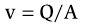

어디서

|  |  |
| --- | --- |
| v | = 혈류 속도(cm/sec) |
| 질문 | = 유량(mL/초) |
| A | = 단면적(cm2) |

**혈류 속도**(**v**)는 *선형* 속도이며 단위 시간당 혈액의 이동 속도를 나타냅니다. 따라서 속도는 단위 시간당 거리 단위(예: cm/sec)로 표현됩니다.

**유량**(**Q**)은 단위 시간당 *부피* 흐름이며 단위 시간당 부피 단위(예: mL/초)로 표시됩니다.

**면적**(**A**)은 혈관(예: 대동맥) 또는 혈관 그룹(예: 모든 모세혈관)의 단면적입니다. 면적은 A = πr2로 계산됩니다. 여기서 r은 단일 혈관(예: 대동맥)의 반경 또는 혈관 그룹(예: 모든 모세혈관)의 전체 반경입니다.

[그림 4-4](#filepos552195)는 직경의 변화가 용기를 통과하는 유속을 어떻게 변화시키는지 보여줍니다. 이 그림에는 세 개의 혈관이 직경과 단면적이 증가하는 순서로 표시되어 있습니다. 각 혈관을 통과하는 흐름은 10mL/초로 동일합니다. 그러나 속도와 단면적 사이의 역관계로 인해 혈관 직경이 증가함에 따라 혈관을 통과하는 유속이 감소합니다.

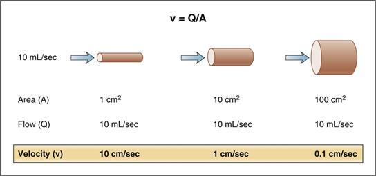

**그림 4-4 혈류 속도에 대한 혈관 직경의 영향**

이 예는 심혈관계에 적용할 수 있습니다. 가장 작은 혈관은 대동맥을 나타내고, 중간 크기의 혈관은 *모든* 동맥을 나타내며, 가장 큰 혈관은 *모든* 모세혈관을 나타낸다고 상상해 보십시오. 각 혈관 수준의 총 혈류량은 동일하며 심박출량과 같습니다. 속도와 전체 단면적 사이의 역관계로 인해 혈류 속도는 대동맥에서 가장 높고 모세혈관에서 가장 낮습니다. 모세혈관 기능(즉, 영양분, 용질 및 물의 교환)의 관점에서 보면 혈류 속도가 느린 것이 유리합니다. 즉, 모세혈관 벽을 통과하는 교환 시간을 최대화합니다.

**예제 문제.** 한 남자의 심박출량은 5.5L/min입니다. 그의 대동맥 직경은 20mm로 추정되며 전신 모세혈관의 전체 단면적은 2500cm2로 추정됩니다. *모세혈관의 혈류 속도에 비해 대동맥의 혈류 속도는 얼마나 됩니까?*

**해결책.** 대동맥의 혈류 속도와 모세혈관의 속도를 비교하려면 각 혈관 유형에 대해 총 혈류량(Q)과 총 단면적(cm2)이라는 두 가지 값이 필요합니다. 각 수준의 총 유량은 동일하며 심박출량과 같습니다. 문제에는 모세혈관의 전체 단면적이 주어지며, 대동맥의 단면적은 반경(10mm)으로부터 계산되어야 합니다. 면적 = πr2 = 3.14 × (10mm)2 = 3.14 × (1cm)2 = 3.14cm2. 따라서,

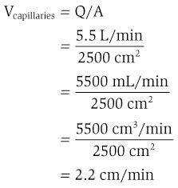

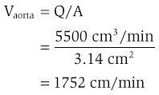

따라서 대동맥의 속도는 모세혈관의 속도보다 800배입니다(대동맥의 속도는 1752cm/min, 모세혈관의 속도는 2.2cm/min). 이러한 계산은 혈류 속도에 관한 이전 논의를 확인시켜 줍니다. 유속은 총 단면적이 가장 큰 혈관(모세혈관)에서 가장 낮고 총 단면적이 가장 작은 혈관(대동맥)에서 가장 높아야 합니다.

#### 혈류, 압력 및 저항의 관계

혈관 또는 일련의 혈관을 통과하는 혈액의 흐름은 두 가지 요소, 즉 혈관의 두 끝(입구와 출구) 사이의 **압력 차이**와 혈류에 대한 혈관의 **저항**에 의해 결정됩니다. 압력차는 혈류의 원동력이 되고, 저항은 혈류를 방해하는 요인이 됩니다.

흐름, 압력 및 저항의 관계는 **옴의 법칙**(옴의 법칙에 따르면 ΔV = I × R 또는 I = ΔV/R)으로 표현되는 전기 회로의 전류(I), 전압(ΔV) 및 저항(R)의 관계와 유사합니다. 혈류는 전류 흐름과 유사하고, 압력 차이 또는 구동력은 전압 차이와 유사하며, 유체역학적 저항은 전기 저항과 유사합니다. 혈류 방정식은 다음과 같이 표현됩니다.

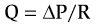

어디서

|  |  |
| --- | --- |
| 질문 | = 유량(mL/분) |
| ΔP | = 압력차(mmHg) |
| R | = 저항(mmHg/mL/분) |

**혈류**(**Q**)의 *크기*는 **압력 차이**(ΔP) 또는 압력 구배의 크기에 정비례합니다. 혈류의 *방향*은 압력 구배의 방향에 따라 결정되며 항상 *높은 압력에서 낮은 압력*입니다. 예를 들어, 심실 박출 중에 혈액은 좌심실에서 대동맥으로 흐르고 다른 방향으로는 흐르지 않습니다. 왜냐하면 심실의 압력이 대동맥의 압력보다 높기 때문입니다. 또 다른 예를 들면, 대정맥의 압력이 우심방의 압력보다 약간 높기 때문에 혈액은 대정맥에서 우심방으로 흐릅니다.

또한 혈류는 **저항(R)**에 반비례합니다. 저항이 증가하면(예: 세동맥 혈관 수축에 의해) 혈액 흐름이 감소하고, 저항이 감소하면(예: 동맥 혈관 확장에 의해) 혈액 흐름이 증가합니다. *심혈관계의 혈류를 변화시키는 주요 메커니즘은 혈관, 특히 세동맥의 저항을 변화시키는 것입니다.*

흐름, 압력 및 저항 관계를 재배열하여 저항을 결정할 수도 있습니다. 혈류와 압력 구배를 알고 있는 경우 저항은 R = ΔP/Q로 계산됩니다. 이 관계는 전체 전신 혈관계의 저항(즉, 전체 말초 저항)을 측정하는 데 사용될 수 있거나 단일 기관 또는 단일 혈관의 저항을 측정하는 데 사용될 수 있습니다.

 **총 말초 저항.** 전체 전신 혈관계의 저항을 총 말초 저항(TPR) 또는 전신 혈관 저항(SVR)이라고 합니다. TPR은 흐름(Q)을 심박출량으로 대체하고 ΔP를 대동맥과 대정맥 사이의 압력 차이로 대체하여 흐름, 압력 및 저항 관계로 측정할 수 있습니다.

 **단일 기관의 저항.** 흐름, 압력 및 저항 관계를 더 작은 규모로 적용하여 단일 기관의 저항을 결정할 수도 있습니다. 다음 샘플 문제에 설명된 대로 신장 혈관계의 저항은 흐름(Q)을 신장 혈류로 대체하고 ΔP를 신장 동맥과 신장 정맥 사이의 압력 차이로 대체하여 결정할 수 있습니다.

**예제 문제.** 신장 혈류는 여성의 왼쪽 신장 동맥에 유량계를 배치하여 측정됩니다. 동시에 왼쪽 신장 동맥과 왼쪽 신장 정맥에 압력 탐침을 삽입하여 압력을 측정합니다. 유량계로 측정한 신장 혈류량은 500mL/분입니다. 압력 프로브는 신장 동맥압을 100mmHg로, 신장 정맥압을 10mmHg로 측정합니다. *이 여성의 왼쪽 신장의 혈관 저항은 얼마입니까?*

**해결책.** 유량계로 측정한 왼쪽 신장으로의 혈류량은 Q입니다. 신동맥과 신정맥의 압력 차이는 ΔP입니다. 신장 혈관계의 흐름에 대한 저항은 혈류 방정식을 재배열하여 계산됩니다.

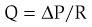

*R을 재정렬하고 풀기*

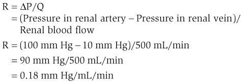

#### 혈류에 대한 저항

혈관과 혈액 자체는 혈류에 대한 저항을 구성합니다. 저항, 혈관 직경(또는 반경) 및 혈액 점도 사이의 관계는 **포아세유 방정식**으로 설명됩니다. 일련의 혈관이 제공하는 총 저항은 혈관이 직렬로 배열되어 있는지(즉, 혈액이 한 혈관에서 다음 혈관으로 순차적으로 흐름) 또는 병렬로 배열되어 있는지(즉, 전체 혈류가 평행 혈관 간에 동시에 분배됨)에 따라 달라집니다.

##### *푸아즈유 방정식*

혈류에 대한 혈관의 저항을 결정하는 요소는 **Poiseuille 방정식:**으로 표현됩니다.

어디서

|  |  |
| --- | --- |
| R | = 저항 |
| 에타 | = 혈액의 점도 |
| 내가 | = 혈관의 길이 |
| r4 | = 혈관 반경의 4제곱 |

Poiseuille 방정식에 표현된 가장 중요한 개념은 다음과 같습니다. 첫째, 흐름에 대한 저항은 혈액의 **점도**(**eta**)에 정비례합니다. 예를 들어 점도가 증가하면(예: 적혈구 용적률이 증가하는 경우) 흐름에 대한 저항도 증가합니다. 둘째, 흐름에 대한 저항은 혈관의 **길이**(**l**)에 정비례합니다. 셋째, 가장 중요한 것은 흐름에 대한 저항이 혈관의 **반경의 4제곱**(**r4**)에 반비례한다는 것입니다. 이것은 참으로 강력한 관계입니다! 혈관의 반경이 감소하면 저항이 선형적으로 증가하는 것이 아니라 네 번째 힘의 관계로 확대됩니다. 예를 들어 혈관의 반경이 절반으로 줄어들면 저항은 단순히 두 배로 증가하는 것이 아니라 16배로 증가합니다(24)!

**예제 문제.** 한 남자가 왼쪽 내부 경동맥의 부분 폐색으로 인해 뇌졸중을 앓고 있습니다. 자기공명영상(MRI)을 이용해 경동맥을 평가한 결과 반경이 75% 감소한 것으로 나타났다. *폐쇄 전 좌측 내경동맥을 통과하는 혈류량이 400mL/분이라고 가정하면, 폐쇄 후 동맥을 통과하는 혈류량은 얼마입니까?*

**해결책.** 이 예의 변수는 왼쪽 내부 경동맥의 직경(또는 반경)입니다. 혈류는 동맥의 저항에 반비례하고(Q = ΔP/R), 저항은 반경의 4제곱에 반비례합니다(포아세유 방정식). 내부 경동맥이 폐쇄되고 반경이 75% 감소합니다. 이 감소를 표현하는 또 다른 방법은 반경이 원래 크기의 1/4로 감소했다고 말하는 것입니다.

첫 번째 질문은 *동맥이 75% 폐색되면 저항이 얼마나 증가합니까?*입니다. 답은 포아세유(Poiseuille) 방정식에서 찾을 수 있습니다. 폐색 후 동맥의 반경은 원래 반경의 1/4입니다. 따라서 저항은 1/(1/4)4, 즉 256배 증가했습니다.

두 번째 질문은 *저항이 256배 증가하면 흐름은 어떻게 될까요?* 대답은 흐름, 압력, 저항 관계(Q = ΔP/R)에서 찾을 수 있습니다. 저항이 256배 증가했기 때문에 유량은 원래 값의 1/256, 즉 0.0039, 즉 0.39%로 감소했습니다. 유속은 400mL/분의 0.39% 또는 1.56mL/분입니다. 분명히 이것은 저항과 혈관 반경 사이의 4승 관계에 기초한 뇌로 가는 혈류의 극적인 감소입니다.

##### *직렬 및 병렬 저항*

심혈관계의 저항은 전기회로와 마찬가지로 직렬 또는 병렬로 배열될 수 있다([그림 4-5](#filepos565445)). 배열이 직렬인지 병렬인지에 따라 총 저항 값이 달라집니다.

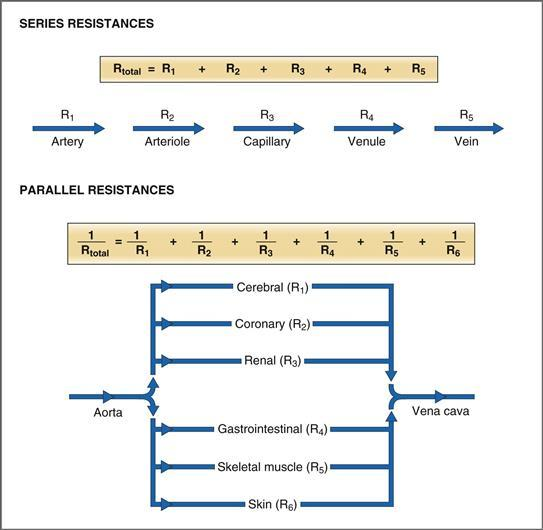

**그림 4–5 혈관의 직렬 및 병렬 배열.** *화살표*는 혈류의 방향을 나타냅니다. R, 저항(아래첨자는 개별 저항을 나타냄).

 **계열 저항**은 특정 기관 *내* 혈관 배열로 설명됩니다. 각 기관에는 주요 동맥을 통해 혈액이 공급되고 주요 정맥을 통해 혈액이 배출됩니다. 기관 내에서 혈액은 주요 동맥에서 작은 동맥, 세동맥, 모세혈관, 세정맥, 정맥으로 흐릅니다. **직렬로 배열된 시스템의 전체 저항은 개별 저항의 합과 같습니다**, 다음 수식과 [그림 4-5](#filepos565445)와 같습니다. 일련의 다양한 저항 중에서 세동맥 저항이 가장 큽니다. 따라서 혈관층의 전체 저항은 대부분 세동맥 저항에 의해 결정됩니다. 직렬 저항은 다음과 같이 표현됩니다.

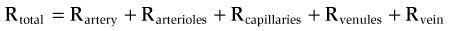

저항이 직렬로 배열되면 시스템의 각 레벨을 통과하는 총 흐름은 동일합니다. 예를 들어, 대동맥을 통한 혈류는 모든 큰 전신 동맥을 통한 혈류와 동일하고, 모든 전신 세동맥을 통한 혈류와 동일하며, 모든 전신 모세혈관을 통한 혈류와 동일합니다. 또 다른 예를 들면, 신장 동맥을 통한 혈류는 모든 신장 모세혈관을 통한 혈류와 같고, 신장 정맥을 통한 혈류와 동일합니다(소변으로 손실된 소량의 양을 뺀 것). 전체 흐름은 계열의 각 수준에서 일정하지만 혈액이 각 순차 구성 요소를 통해 흐를 때 압력은 점진적으로 감소합니다(Q = ΔP/R 또는 ΔP = Q × R 기억). **가장 큰 압력 감소는 세동맥**에서 발생합니다. 세동맥이 저항의 가장 큰 부분을 차지하기 때문입니다.

 **평행 저항**은 대동맥에서 분기되는 다양한 주요 동맥 *사이*의 혈류 분포로 설명됩니다([그림 4-1](#filepos534811) 및 [4-5](#filepos565445) 참조). 심장 박출량은 대동맥을 통해 흐른 다음 백분율 기준으로 다양한 기관 시스템에 분배된다는 점을 기억하십시오. 따라서 각 순환(예: 신장, 대뇌 및 관상동맥)을 통해 평행하고 동시적인 혈류가 발생합니다. 장기에서 나온 정맥 유출물은 대정맥에 모여 심장으로 돌아갑니다. 다음 방정식과 [그림 4-5](#filepos565445)에서 볼 수 있듯이 *병렬* 배열의 총 **저항은 개별 저항보다 작습니다.** 아래 첨자 1, 2, 3 등은 대뇌, 관상 동맥, 신장, 위장, 골격근 및 피부 순환의 저항을 나타냅니다. 병렬 저항은 다음과 같이 표현됩니다.

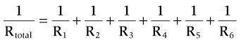

혈류가 일련의 병렬 저항을 통해 분배될 때 각 기관을 통과하는 흐름은 전체 혈류의 일부입니다. 이러한 배열의 효과는 주요 동맥에 **압력 손실**이 없으며 각 주요 동맥의 평균 압력이 대동맥의 평균 압력과 거의 동일하다는 것입니다.

병렬 배열의 또 다른 예측 가능한 결과는 회로에 저항을 추가하면 총 저항이 감소하는 *증가하는 것이 아니라* 발생한다는 것입니다. 수학적으로 이는 다음과 같이 설명할 수 있습니다. 각각 숫자 값이 10인 4개의 저항이 병렬로 배열됩니다. 방정식에 따르면 총 저항은 2.5(1/Rtotal = 1/10 + 1/10 + 1/10 + 1/10 = 2.5)입니다. 값이 10인 다섯 번째 저항을 병렬 배열에 추가하면 전체 저항은 2로 감소합니다(1/Rtotal = 1/10 + 1/10 + 1/10 + 1/10 + 1/10 = 2).

반면, 병렬 배열된 개별 혈관 중 하나의 저항이 증가하면 총 저항이 *증가*합니다. 이는 각 개별 저항이 10이고 총 저항이 2.5인 4개의 혈관의 평행 배열로 돌아가서 확인할 수 있습니다. 네 개의 혈관 중 하나가 완전히 막히면 그 개별 저항은 무한대가 됩니다. 그러면 병렬 배열의 총 저항은 3.333(1/Rtotal = 1/10 + 1/10 + 1/10 + 1/무한대)으로 증가합니다.

#### 층류 흐름과 레이놀즈 수

이상적으로는 심혈관계의 혈류가 **층류** 또는 유선형입니다. 층류에서는 혈관 내 속도가 포물선 형태로 나타나며, 혈류 속도는 혈관 중심에서 가장 높고 혈관벽으로 갈수록 가장 낮습니다([그림 4-6](#filepos571414)). 포물선 모양은 혈관벽 옆에 있는 혈액층이 혈관벽에 달라붙어 본질적으로 움직이지 않기 때문에 발생합니다. 혈액의 다음 층(중앙 방향)은 움직이지 않는 층을 지나서 조금 더 빠르게 움직입니다. 중앙을 향한 각각의 연속적인 혈액 층은 더 빠르게 이동하지만 인접한 층에 대한 접착력은 떨어집니다. 따라서 *혈관 벽의 흐름 속도는 0이고 흐름 중심의 속도는 최대입니다.* 층류 혈류는 이 규칙적인 포물선 프로필을 따릅니다.

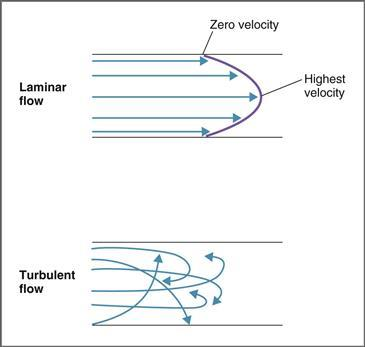

**그림 4–6 층류와 난류 혈류의 비교.** *화살표*의 길이는 대략적인 혈류 속도를 나타냅니다. 층류 혈류는 혈관 벽에서 가장 낮은 속도와 흐름 중앙에서 가장 높은 속도를 갖는 포물선 형태를 갖습니다. 난류 혈류는 축 방향 및 방사형 흐름을 나타냅니다.

혈관(예: 판막 또는 혈전 부위)에 불규칙성이 발생하면 층류가 중단되고 혈류가 **난류**가 될 수 있습니다. 난류([그림 4-6](#filepos571414) 참조)에서는 유체 흐름이 포물선 프로필에 남아 있지 않습니다. 대신, 흐름은 방사상 및 축 방향으로 혼합됩니다. 혈액을 방사형 및 축 방향으로 추진하는 데 에너지가 낭비되기 때문에 층류 혈류보다 난류 혈류를 구동하는 데 더 많은 에너지(압력)가 필요합니다. 난류에는 종종 **잡음소리**라는 가청 진동이 동반됩니다.

**레이놀즈 수**는 혈류가 층류인지 난류인지 예측하는 데 사용되는 무차원 수입니다. 이는 혈관 직경, 평균 유속, 혈액 점도 등 다양한 요인을 고려합니다. 따라서,

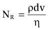

어디서

|  |  |
| --- | --- |
| NR | = 레이놀즈수 |
| ρ | = 혈액의 밀도 |
| 디 | = 혈관의 직경 |
| v | = 혈류 속도 |
| 에타 | = 혈액의 점도 |

레이놀즈수(NR)가 2000보다 작으면 혈류는 층류가 됩니다. 레이놀즈 수가 2000보다 크면 혈류가 혼란스러울 가능성이 높아집니다. 3000보다 큰 값은 항상 난류를 예측합니다.

심혈관계에서 레이놀즈 수에 대한 주요 영향은 혈액 **점도**의 변화와 혈류 **속도**의 변화입니다. 방정식을 검토해 보면 점도 감소(예: 적혈구 용적률 감소)로 인해 레이놀즈 수가 증가하는 것으로 나타났습니다. 마찬가지로, 혈관이 좁아져 혈류 속도가 증가하면 레이놀즈 수가 증가합니다.

혈관을 좁히는 것(즉, 감소된 직경과 반경)이 레이놀즈 수에 미치는 영향은 방정식에 따르면 혈관 직경이 감소하면 레이놀즈 수(직경은 분자에 있음)가 *감소*해야 하기 때문에 처음에는 혼란스럽습니다. 그러나 이전 방정식 v = Q/A 또는 v = Q/πr2에 따르면 혈류 속도는 직경(반지름)에 따라 달라집니다. 따라서 속도(또한 레이놀즈 수 방정식의 분자)는 반경이 *감소*함에 따라 *증가*하고 *2승*으로 증가합니다. 따라서 속도에 대한 레이놀즈 수의 의존성은 직경에 대한 의존성보다 더 강력합니다.

두 가지 일반적인 임상 상황인 빈혈과 혈전은 난류 예측에 레이놀즈 수를 적용하는 방법을 보여줍니다.

 **빈혈**은 적혈구 용적률 감소(적혈구 질량 감소)와 관련이 있으며 난류 혈류로 인해 기능성 심잡음을 유발합니다. 난류의 예측 인자인 레이놀즈 수는 혈액 점도 감소로 인해 빈혈에서 증가합니다. 빈혈 환자에서 레이놀즈수가 증가하는 두 번째 원인은 높은 심박출량으로 인해 혈류 속도가 증가하기 때문입니다(v = Q/A).

 **혈전**은 혈관 내강에 있는 혈전입니다. 혈전은 혈관의 직경을 좁혀 혈전 부위의 혈액 속도를 증가시켜 레이놀즈 수를 증가시키고 난류를 생성합니다.

#### 전단

**전단**은 혈관 내에서 혈액이 서로 다른 속도로 이동한다는 사실의 결과입니다([그림 4-6](#filepos571414) 참조). 인접한 혈액층이 서로 다른 속도로 이동하면 전단이 발생합니다. 인접한 레이어가 동일한 속도로 이동하면 전단력이 없습니다. 따라서 다음과 같은 추론에 따르면 **전단력은 혈관벽에서 가장 높습니다**. 벽 바로 옆에는 움직이지 않는 혈액층이 있습니다(즉, 속도는 0입니다). 인접한 혈액층은 *움직이고* 있으므로 속도를 갖습니다. 혈액 속도의 상대적인 가장 큰 차이는 바로 벽에 있는 움직이지 않는 혈액 층과 그 다음 층 사이에 있습니다. **전단력은 가장 낮습니다**, 혈관 중앙에서는 혈액 속도가 가장 높지만 인접한 혈액 층은 본질적으로 동일한 속도로 움직입니다. 전단의 한 가지 결과는 적혈구 집합체를 분해하고 혈액 점도를 감소시키는 것입니다. 따라서 일반적으로 전단 속도가 가장 높은 벽에서는 적혈구 응집 및 점도가 가장 낮습니다.

#### 혈관 준수

혈관의 순응도 또는 **정전 용량**은 주어진 압력에서 혈관이 보유할 수 있는 혈액의 양을 나타냅니다. 규정 준수는 **팽창성**과 관련이 있으며 다음 방정식으로 제공됩니다.

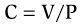

어디서

|  |  |
| --- | --- |
| 다 | = 규정 준수 또는 정전 용량(mL/mm Hg) |
| 뷔 | = 용량(mL) |
| 피 | = 압력(mmHg) |

컴플라이언스 방정식은 용기의 컴플라이언스가 높을수록 주어진 압력에서 더 많은 양을 보유할 수 있음을 나타냅니다. 또는 다르게 말하면 규정 준수는 주어진 압력 변화(ΔV/ΔP)에 대해 혈관에 포함된 혈액의 양이 어떻게 변하는지를 나타냅니다.

[그림 4-7](#filepos579391)은 순응의 원리를 보여주며, 정맥과 동맥의 상대적인 순응도를 보여준다. 각 혈관 유형에 대해 부피가 압력의 함수로 표시됩니다. 각 곡선의 **기울기**는 **순응도**입니다. 정맥의 순응도는 높습니다. 즉, 정맥은 낮은 압력에서 많은 양의 혈액을 보유하고 있습니다. 동맥의 순응도는 정맥의 순응도보다 훨씬 낮습니다. 동맥은 정맥보다 훨씬 적은 양의 혈액을 보유하고 있으며 높은 압력에서 그렇게 합니다.

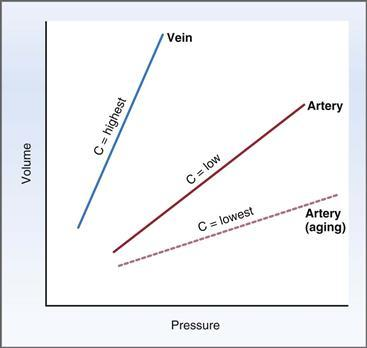

**그림 4–7 정맥과 동맥의 용량.**
부피는 압력의 함수로 표시됩니다. 곡선의 기울기는 정전용량(C)입니다.

정맥과 동맥의 순응도 차이는 스트레스를 받지 않은 부피와 스트레스를 받은 부피의 개념에 기초합니다. 정맥은 유연성이 가장 뛰어나고 응력을 받지 않은 부피(낮은 압력에서 큰 부피)를 포함합니다. 동맥은 유연성이 훨씬 낮고 스트레스를 받는 부피(고압 하에서 낮은 부피)를 포함합니다. 심혈관계의 총 혈액량은 스트레스를 받지 않은 혈액량과 스트레스를 받은 혈액량의 합입니다(심장에 포함된 모든 혈액량 포함).

**정맥의 순응도 변화**는 정맥과 동맥 사이의 혈액 재분배를 유발합니다(즉, 혈액이 스트레스를 받지 않은 부피와 스트레스를 받은 부피 사이에서 이동함). 예를 들어, 정맥의 탄력성이 감소하면(예: 정맥 수축으로 인해) 정맥이 보유할 수 있는 부피가 감소하고 결과적으로 혈액이 정맥에서 동맥으로 이동합니다. 즉, 스트레스를 받지 않은 부피는 감소하고 스트레스를 받은 부피는 증가합니다. 정맥의 탄력성이 증가하면 정맥이 수용할 수 있는 부피가 증가하고 결과적으로 혈액이 동맥에서 정맥으로 이동합니다. 즉, 스트레스를 받지 않은 부피는 증가하고 스트레스를 받은 부피는 감소합니다. 정맥과 동맥 사이의 혈액 재분배는 이 장의 뒷부분에서 논의되는 바와 같이 동맥압에 영향을 미칩니다.

[그림 4-7](#filepos579391)도 **동맥의 순응도**에 대한 **노화**의 영향을 보여줍니다. 동맥벽의 특성은 나이가 들수록 변합니다. 즉, 동맥벽은 더 단단해지고, 덜 늘어나며, 덜 유연해집니다. 주어진 동맥압에서 동맥은 더 적은 양의 혈액을 담을 수 있습니다. 노화와 관련된 순응도 감소를 생각하는 또 다른 방법은 "늙은 동맥"이 "젊은 동맥"과 동일한 부피를 유지하기 위해서는 "늙은 동맥"의 압력이 "젊은 동맥"의 압력보다 높아야 한다는 것입니다. 실제로 노인의 경우 동맥 탄력성 감소로 인해 동맥압이 증가합니다.

#### 심혈관계의 압력

혈압은 심혈관계 전반에 걸쳐 동일하지 않습니다. 만약 그들이 같다면, 혈액은 흐르지 않을 것입니다. 왜냐하면 흐름에는 추진력(즉, 압력 차이)이 필요하기 때문입니다. 심장과 혈관 사이에 존재하는 압력 차이는 혈류의 원동력입니다. [표 4-1](#filepos582471)은 전신 순환과 폐 순환의 압력을 요약한 것입니다.

**표 4–1 심혈관계의 압력**

|  |  |
| --- | --- |
| **위치** | **평균 압력(mmHg)** |
| 전신 |  |
| 대동맥 | 100 |
| 큰 동맥 | 100(수축기 120, 확장기 80) |
| 세동맥 | 50 |
| 모세혈관 | 20 |
| 대정맥 | 4 |
| 우심방 | 0–2 |
| 폐 |  |
| 폐동맥 | 15(수축기 25, 확장기 8) |
| 모세혈관 | 10 |
| 폐정맥 | 8 |
| 좌심방[\*](#filepos584292) | 2~5 |

[\*](#filepos584161)심장 왼쪽의 압력은 직접 측정하기 어렵습니다. 그러나 좌심방압은 *폐쐐기압*으로 측정할 수 있습니다. 이 기술을 사용하면 카테터를 폐동맥에 삽입하고 폐동맥의 작은 가지까지 전진시킵니다. 카테터는 *쐐기로 고정*되어 해당 가지에서 나오는 모든 혈류를 차단합니다. 흐름이 중단되면 카테터는 좌심방의 압력을 거의 직접적으로 감지합니다.

##### *혈관계의 압력 프로필*

[그림 4-8](#filepos585545)은 전신 혈관계 내의 압력 프로파일입니다. 먼저 맥동을 무시하고 매끄러운 프로파일을 검사합니다. 부드러운 곡선은 평균 압력을 제공하며, 이 압력은 대동맥과 큰 동맥에서 가장 높으며 혈액이 동맥에서 세동맥으로, 모세혈관으로, 정맥으로, 다시 심장으로 흐를 때 점차 감소합니다. 마찰 저항을 극복하는 데 에너지가 소비되기 때문에 혈액이 혈관계를 통해 흐를 때 이러한 압력 감소가 발생합니다.

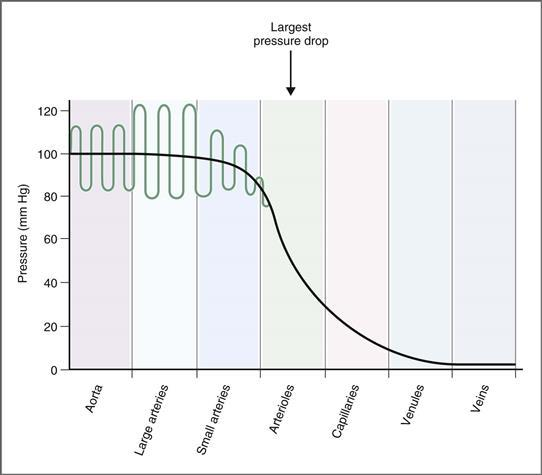

**그림 4–8 혈관계의 압력 프로필.** 부드러운 곡선은 평균 압력입니다. 맥동이 존재할 경우 평균 압력에 중첩됩니다.

**대동맥**의 평균 압력은 100mmHg로 높습니다([표 4-1](#filepos582471) 및 [그림 4-8](#filepos585545) 참조). 이렇게 높은 평균 동맥압은 좌심실에서 대동맥으로 펌핑되는 대량의 혈액(심장 출력)과 동맥벽의 낮은 순응도라는 두 가지 요인의 결과입니다. (혈관의 탄력성이 낮을 때 주어진 부피는 더 큰 압력을 유발한다는 점을 기억하십시오.) 동맥벽의 높은 탄성 반동으로 인해 대동맥에서 갈라지는 **큰 동맥**에서는 압력이 높게 유지됩니다. 따라서 혈액이 대동맥에서 동맥계를 통해 흐를 때 에너지가 거의 손실되지 않습니다.

**소동맥**부터 시작하여 동맥압이 감소하며, 세동맥에서 가장 큰 감소가 발생합니다. **세동맥** 끝의 평균 압력은 약 30mmHg입니다. 이러한 급격한 압력 감소는 세동맥이 흐름에 대한 높은 저항을 구성하기 때문에 발생합니다. 총 혈류는 심혈관계의 모든 수준에서 일정하므로 저항이 증가함에 따라 하류 압력은 필연적으로 감소해야 합니다(Q = ΔP/R 또는 ΔP = Q × R).

**모세혈관**에서 압력은 두 가지 이유, 즉 흐름에 대한 마찰 저항과 모세혈관 밖으로의 유체 여과로 인해 더욱 감소합니다(미세 순환에 대한 논의 참조). 혈액이 **정맥** 및 **정맥**에 도달하면 압력은 더욱 감소합니다. (정맥의 용량이 높기 때문에 정맥은 이 낮은 압력에서 많은 양의 혈액을 담을 수 있다는 점을 기억하십시오.) 대정맥의 압력은 4mmHg에 불과하고 우심방의 압력은 0~2mmHg로 훨씬 더 낮습니다.

##### *전신 순환계의 동맥압*

[그림 4-8](#filepos585545)을 자세히 살펴보면 동맥의 *평균* 압력이 높고 일정하지만 동맥압의 진동이나 맥동이 있음을 알 수 있습니다. 이러한 **박동**은 수축기 동안 혈액 방출, 확장기 동안 휴식, 혈액 방출, 휴식 등 심장의 박동성 활동을 반영합니다. 동맥의 각 맥동 주기는 하나의 심장 주기와 일치합니다.

[그림 4-9](#filepos588522)는 큰 동맥에서 발생하는 두 가지 맥박의 확장 버전을 보여줍니다.

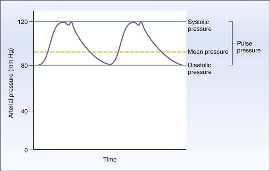

**그림 4–9 심장 주기 중 전신 동맥압.** 수축기 혈압은 수축기 동안 측정된 최고 압력입니다. 확장기 혈압은 확장기 동안 측정되는 최저 압력입니다. 맥압은 수축기 혈압과 이완기 혈압의 차이입니다. (평균 동맥압에 대한 논의는 본문을 참조하십시오.)

 **이완기압**은 심장 주기 동안 측정된 최저 동맥압이며 좌심실에서 혈액이 박출되지 않을 때 심실 이완 동안 동맥의 압력입니다.

 **수축기 혈압**은 심장 주기 동안 측정된 최고 동맥압입니다. 수축기 동안 좌심실에서 혈액이 분출된 후 동맥의 압력입니다. **중간절흔**(또는 **절치수라**)이라고 하는 동맥압 곡선의 "현상"은 대동맥 판막이 닫힐 때 생성됩니다. 대동맥 판막 폐쇄는 대동맥에서 판막 방향으로 역행하는 짧은 기간의 흐름을 생성하여 대동맥 압력을 수축기 혈압 아래로 잠시 감소시킵니다.

 **맥박압**은 수축기 혈압과 이완기 혈압의 차이입니다. 다른 모든 요소가 동일할 경우 맥압의 크기는 단일 박동 시 좌심실에서 분출되는 혈액량, 즉 **박출량**을 반영합니다.

맥압은 압력, 체적 및 순응도 사이의 관계 때문에 일회박출량의 지표로 사용될 수 있습니다. 혈관의 순응도는 주어진 압력(C = V/P)에서 혈관이 유지할 수 있는 부피라는 점을 기억하십시오. 따라서 동맥 탄력성이 일정하다고 가정하면 동맥압은 특정 순간에 동맥에 들어 있는 혈액량에 따라 달라집니다. 예를 들어, 주어진 시간에 대동맥의 혈액량은 혈액 유입과 유출의 균형에 의해 결정됩니다. 좌심실이 수축하면 대동맥으로 박출량이 빠르게 분출되고 압력은 최고 수준인 수축기 혈압까지 빠르게 상승합니다. 그런 다음 혈액은 대동맥에서 나머지 동맥계로 흐르기 시작합니다. 이제 대동맥의 부피가 감소함에 따라 압력도 감소합니다. 심실이 이완되고 혈액이 동맥계에서 심장으로 되돌아갈 때 동맥압은 가장 낮은 수준인 확장기 혈압에 도달합니다.

 **평균 동맥압**은 전체 심장 주기의 평균 압력이며 다음과 같이 계산됩니다.

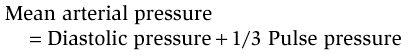

> 평균 동맥압은 확장기 혈압과 수축기 혈압의 단순한 수학적 평균이 아니라는 점에 유의하십시오. 이는 각 심장 주기의 더 많은 부분이 수축기보다 이완기에 소비되기 때문입니다. 따라서 평균 동맥압 계산에서는 수축기 혈압보다 이완기 혈압에 더 많은 가중치를 부여합니다.

흥미롭게도 **큰 동맥의 박동**은 대동맥의 박동보다 훨씬 더 큽니다([그림 4-8](#filepos585545) 참조). 즉, 수축기 혈압과 맥압은 대동맥보다 큰 동맥에서 더 높습니다. 왜 "하류" 동맥에서 맥압이 증가해야 하는지는 즉시 명확하지 않습니다. 설명은 좌심실에서 혈액이 분출된 후 압력파가 혈액 자체가 이동하는 것보다 더 빠른 속도로 이동하여(혈액의 관성으로 인해) 하류 압력을 증가시킨다는 사실에 있습니다. 더욱이, 동맥의 분지점에서는 압력파가 뒤로 반사되어 해당 부위의 압력을 증가시키는 경향이 있습니다. (혈액이 대동맥에서 큰 동맥으로 흐른다는 점을 고려하면 하류 동맥에서 수축기 혈압과 맥압이 더 높다는 것이 이상하게 보일 수 있습니다. 우리는 혈류의 방향이 높은 압력에서 낮은 압력으로 이루어져야 하며 그 반대가 되어서는 안 된다는 것을 알고 있습니다! 설명에 따르면 동맥의 혈류 흐름에 대한 원동력은 *평균* 동맥압이며, 이는 수축기 혈압보다 이완기 혈압의 영향을 더 많이 받습니다(왜냐하면 각 심장 주기의 더 큰 비율이 [그림 4-8](#filepos585545)에서 수축기 혈압은 대동맥보다 큰 동맥에서 높지만 이완기 혈압은 낮으므로 하류의 평균 동맥압이 더 낮습니다.

대동맥에 비해 큰 동맥에서는 수축기 혈압과 맥압이 증가하지만(대동맥에 비해) 그 시점부터 진동이 약화됩니다. 맥압은 여전히 ​​뚜렷하지만 작은 동맥에서는 감소합니다. 세동맥에는 사실상 존재하지 않습니다. 모세혈관, 정맥, 정맥에는 전혀 존재하지 않습니다. 이러한 맥압 감쇠 및 손실은 두 가지 이유로 발생합니다. (1) 혈관, 특히 세동맥의 저항으로 인해 맥압이 전달되기 어렵습니다. (2) 혈관, 특히 정맥의 순응도는 맥압을 감소시킵니다. 즉, 혈관의 순응도가 높을수록 압력 증가 없이 맥압에 더 많은 양을 추가할 수 있습니다.

여러 병리학적 조건은 예측 가능한 방식으로 동맥압 곡선을 변경합니다([그림 4-10](#filepos594808)). 앞서 언급한 바와 같이, 맥압은 좌심실에서 대동맥으로 박출량이 분출될 때 발생하는 동맥압의 변화입니다. 그렇다면 논리적으로 볼 때 박출량이 변경되거나 *또는* 동맥의 탄력성이 변경되면 맥압이 변경됩니다.

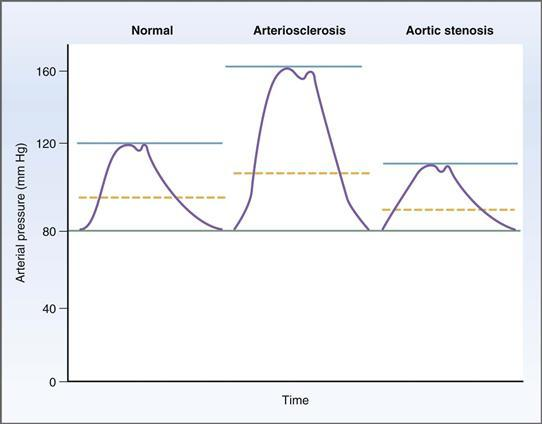

**그림 4–10** **동맥경화증과 대동맥 협착증이 동맥압에 미치는 영향**.

2

 **동맥경화증** ([그림 4-10](#filepos594808) 참조). 동맥경화증에서는 동맥벽에 플라크가 침착되어 동맥 직경이 줄어들고 동맥이 더 단단해지고 유연성이 떨어지게 됩니다. 동맥 탄력성이 감소하기 때문에 좌심실에서 박출량을 박출하면 정상 동맥에서보다 동맥압에 훨씬 더 큰 변화가 발생합니다(C = ΔV/ΔP 또는 ΔP = ΔV/C). 따라서 동맥경화증에서는 수축기압, 맥압, 평균압 모두 증가하게 된다.

 **대동맥 협착증** ([그림 4-10](#filepos594808) 참조). 대동맥 판막이 협착되면(좁혀지면) 좌심실에서 대동맥으로 혈액을 분출할 수 있는 구멍의 크기가 줄어듭니다. 따라서 박동량이 줄어들고 각 박동 시 대동맥으로 들어가는 혈액의 양이 줄어듭니다. 수축기압, 맥압, 평균압력 모두 감소합니다.

 **대동맥판 역류**(*표시되지 않음*). 대동맥 판막이 기능하지 않으면(예: 선천적 기형으로 인해) 좌심실에서 대동맥으로의 정상적인 일방향 혈액 흐름이 중단됩니다. 대신, 대동맥으로 분출된 혈액은 심실로 역류합니다. 이러한 역행성 흐름은 심실이 이완되어 있고(낮은 압력에 있음) 무능한 대동맥 판막이 이를 방지할 수 없기 때문에 발생할 수 있습니다.

##### *전신 순환의 정맥 압력*

혈액이 정맥과 정맥에 도달할 때 압력은 10mmHg 미만입니다. 대정맥과 우심방의 압력은 더욱 감소합니다. 압력이 지속적으로 감소하는 이유는 이제 익숙합니다. 전신 혈관계의 각 수준에서 혈관이 제공하는 저항으로 인해 압력이 감소합니다. [표 4-1](#filepos582471)과 [그림 4-8](#filepos585545)은 전신순환의 정맥압에 대한 평균값을 보여준다.

##### *폐순환의 압력*

[표 4-1](#filepos582471)은 또한 폐순환의 압력과 전신순환의 압력을 비교합니다. 표에서 볼 수 있듯이 전체 폐 혈관계는 전신 혈관계보다 훨씬 **낮은 압력**에 있습니다. 그러나 폐순환 내의 압력 *패턴*은 전신 순환과 유사합니다. 혈액은 우심실에서 압력이 가장 높은 폐동맥으로 분출됩니다. 그 후, 혈액이 폐동맥, 세동맥, 모세혈관, 정맥, 정맥을 거쳐 좌심방으로 다시 흐르면서 압력이 감소합니다.

폐 측의 이러한 낮은 압력의 중요한 의미는 **폐 혈관 저항이 전신 혈관 저항보다 훨씬 낮다는 것**입니다. 이 결론은 전신 순환과 폐 순환을 통한 총 흐름이 동일해야 함(즉, 왼쪽 심장과 오른쪽 심장의 심박출량이 동일함)을 상기함으로써 도달할 수 있습니다. 폐측 압력은 전신측 압력보다 훨씬 낮기 때문에 동일한 흐름을 달성하려면 폐 저항이 전신 저항보다 낮아야 합니다(Q = ΔP/R). (폐순환에 대해서는 [5장](CR%21G9RE0KW4PD33Q9F3DXNCSBNXCANP_split_013.html#filepos887681)에서 자세히 설명합니다.)

### 심장 전기생리학

심장 전기생리학에는 심장의 전기적 활성화와 관련된 모든 과정이 포함됩니다. 특수 전도 조직을 따른 활동 전위 전도; 흥분성 및 불응기; 심박수, 전도 속도 및 흥분성에 대한 자율신경계의 조절 효과; 그리고 심전도(ECG).

궁극적으로 심장의 기능은 혈관계를 통해 혈액을 펌핑하는 것입니다. 펌프 역할을 하려면 심실이 전기적으로 활성화된 다음 수축되어야 합니다. 심장 근육에서 전기적 활성화는 일반적으로 동심방(SA) 결절에서 발생하는 심장 활동 전위입니다. SA 노드에서 시작된 활동 전위는 특정한 시간 순서에 따라 전체 심근으로 전도됩니다. 수축도 특정 순서로 이어집니다. 효율적인 혈액 방출을 위해서는 심방이 심실보다 먼저 활성화되고 수축해야 하며, 심실은 정점에서 기저부까지 수축해야 하기 때문에 "순서"가 특히 중요합니다.

#### 심장 활동 전위

##### *심장 내 흥분의 근원과 확산*

심장은 두 종류의 근육 세포, 즉 수축 세포와 전도 세포로 구성됩니다. **수축 세포**는 심방 및 심실 조직의 대부분을 구성하며 심장의 작동 세포입니다. 수축 세포의 활동 전위는 수축과 힘 또는 압력의 생성으로 이어집니다. **전도 세포**는 SA 결절, 심방 결절 간 관, AV 결절, His 다발 및 Purkinje 시스템의 조직을 구성합니다. 전도 세포는 힘 생성에 크게 기여하지 않는 특수한 근육 세포입니다. 대신에, 그들은 전체 심근에 걸쳐 활동 전위를 빠르게 확산시키는 기능을 합니다. 특수 전도 조직의 또 다른 특징은 자발적으로 활동 전위를 생성하는 능력입니다. 그러나 SA 노드를 제외하면 이 용량은 일반적으로 억제됩니다.

[그림 4-11](#filepos601613)은 동방결절, 심방, 심실 및 특수 전도 조직의 관계를 보여주는 개략도입니다. 활동 전위는 다음 순서로 심근 전체에 퍼집니다.

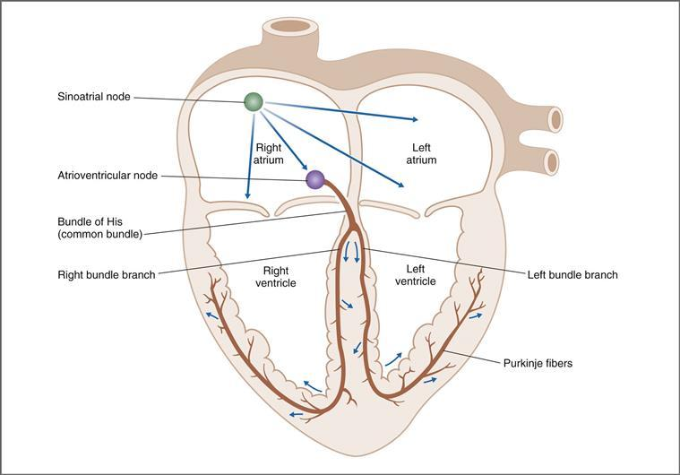

**그림 4–11 심근 활성화 순서를 보여주는 도식적 다이어그램.** 심장 활동 전위는 *화살표*로 표시된 것처럼 동방 결절에서 시작되어 심근 전체로 퍼집니다.

1. **SA 결절.** 일반적으로 심장의 활동 전위는 **심장 조율기** 역할을 하는 SA 결절의 특수 조직에서 시작됩니다. 활동 전위가 SA 결절에서 시작된 후 심장의 나머지 부분으로 활동 전위가 전도되는 데는 특정한 순서와 타이밍이 있습니다.
2. **심방 결절간로 및 심방.** 활동 전위는 심방 결절간로를 통해 SA 결절에서 좌우 심방으로 퍼집니다. 동시에 활동 전위는 AV 노드로 전도됩니다.
3. **AV 노드.** AV 노드를 통한 전도 속도는 다른 심장 조직보다 상당히 느립니다. 방실결절을 통한 **느린 전도**는 심실이 활성화되어 수축하기 전에 혈액을 채울 수 있는 충분한 시간을 확보하도록 합니다. AV node의 전도 속도가 증가하면 심실 충전이 감소하고 박출량 및 심박출량이 감소할 수 있습니다.
4. **His, 푸르킨예 시스템 및 심실의 묶음.** 방실결절에서 활동 전위는 심실의 특수 전도 시스템으로 들어갑니다. 활동전위는 공통다발을 통해 먼저 His속으로 전도됩니다. 그런 다음 왼쪽 및 오른쪽 다발 가지를 침범한 다음 푸르킨예계의 더 작은 다발을 침범합니다. His-Purkinje 시스템을 통한 전도는 매우 빠르며 활동 전위를 심실에 빠르게 분배합니다. 활동 전위는 또한 세포 사이의 저저항 경로를 통해 하나의 심실 근육 세포에서 다음 심실 근육 세포로 퍼집니다. 심실 전반에 걸친 활동 전위의 신속한 전도는 필수적이며 혈액의 효율적인 수축 및 배출을 가능하게 합니다.

**정상 동율동**이라는 용어에는 특별한 의미가 있습니다. 이는 심장의 전기적 활성화 패턴과 타이밍이 정상적이라는 의미입니다. 정상동리듬으로 인정받으려면 다음 세 가지 기준을 충족해야 합니다. (1) 활동 전위는 SA 노드에서 시작되어야 합니다. (2) SA 결절 자극은 분당 60~100회의 속도로 규칙적으로 발생해야 합니다. (3) 심근의 활성화는 올바른 순서와 올바른 타이밍 및 지연으로 이루어져야 합니다.

##### *심장 활동 전위와 관련된 개념*

심장 활동 전위에 적용되는 개념은 신경, 골격근 및 평활근의 활동 전위에 적용되는 개념과 동일합니다. 다음 섹션은 [1장](CR%21G9RE0KW4PD33Q9F3DXNCSBNXCANP_split_007.html#filepos27757)에서 논의된 원칙을 요약한 것입니다.

1. 심장 세포의 **막 전위**는 이온에 대한 상대 전도도(또는 투과성)와 투과성 이온의 농도 구배에 의해 결정됩니다.
2. 세포막이 이온에 대해 높은 전도도 또는 투과성을 갖는 경우, 해당 이온은 전기화학적 구배를 따라 흘러 막 전위를 **평형 전위**(Nernst 방정식으로 계산) 쪽으로 유도하려고 시도합니다. 세포막이 이온에 대해 불투과성인 경우, 해당 이온은 막 전위에 거의 또는 전혀 기여하지 않습니다.
3. 관례적으로 막전위는 밀리볼트(mV)로 표현되고, 세포내 전위는 세포외 전위에 비례하여 표현됩니다. 예를 들어, -85mV의 막 전위는 85mV, 즉 세포 내부 음성을 의미합니다.
4. 심장 세포의 **휴식 막 전위**는 주로 칼륨 이온(K+)에 의해 결정됩니다. 정지 상태에서 K+에 대한 전도도는 높고, 정지 막 전위는 K+ 평형 전위에 가깝습니다. 정지 상태에서 나트륨(Na+)에 대한 전도도가 낮기 때문에 Na+는 정지 막 전위에 거의 기여하지 않습니다.
5. **Na+-K+ ATPase**의 역할은 막 전위에 작은 직접적인 전기적 기여를 하기는 하지만 주로 세포막 전체에 걸쳐 Na+ 및 K+ 농도 구배를 유지하는 것입니다.
6. **막 전위의 변화**는 세포 안팎으로의 이온 흐름에 의해 발생합니다. 이온 흐름이 발생하려면 세포막이 해당 이온을 투과할 수 있어야 합니다. **탈분극**은 막 전위가 *덜 음의*가 되었음을 의미합니다. 탈분극은 양전하가 세포 내로 순이동할 때 발생하며, 이를 **내부 전류라고 합니다. 과분극**은 막 전위가 *더 음의*가 되었음을 의미하며, 이는 **외향 전류**라고 하는 양전하가 세포 외부로 순 이동할 때 발생합니다.
7. 두 가지 기본 메커니즘이 막 전위의 변화를 일으킬 수 있습니다. 한 메커니즘에서는 **투과 이온에 대한 전기화학적 구배의 변화**가 발생하며, 이로 인해 해당 이온의 평형 전위가 변경됩니다. 투과성 이온은 전기화학적 평형을 재확립하기 위해 세포 안팎으로 흘러 들어가고, 이 전류 흐름은 막 전위를 변화시킵니다. 예를 들어, 심근 세포의 휴지 막 전위에 대한 세포외 K+ 농도 감소의 효과를 고려하십시오. Nernst 방정식으로 계산된 K+ 평형 전위는 더욱 음수가 됩니다. 그런 다음 K+ 이온은 세포 밖으로 흘러나와 이제 더 큰 전기화학적 구배를 따라 내려가며 휴지 막 전위를 새롭고 더 음의 K+ 평형 전위로 유도합니다.  
       다른 메커니즘에는 **이온에 대한 전도도의 변화**가 있습니다. 예를 들어 Na+에 대한 심실 세포의 휴지 투과성은 매우 낮으며 Na+는 휴지 막 전위에 최소한으로 기여합니다. 그러나 심실 활동 전위가 상승하는 동안 Na+ 전도도는 급격하게 증가하고 Na+는 전기화학적 구배를 따라 세포 내로 유입되며 막 전위는 잠시 Na+ 평형 전위 쪽으로 이동합니다(즉, 탈분극됩니다).
8. **임계 전위**는 순 내부 전류가 있는 전위차입니다(즉, 내부 전류가 외부 전류보다 커짐). 역치 전위에서 탈분극은 스스로 유지되고 활동 전위가 상승합니다.

##### *심실, 심방 및 퍼킨제 시스템의 활동 전위*

심실, 심방, 푸르킨예계의 활동 전위에 대한 이온 기반은 동일합니다. 이러한 조직의 활동전위는 다음과 같은 특징을 공유합니다([표 4-2](#filepos609475)).

**표 4–2 심장 조직의 활동 전위 비교**

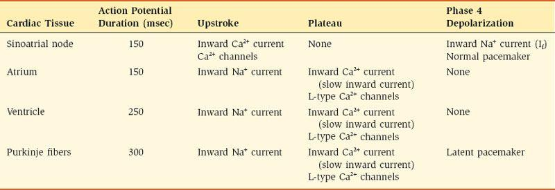

 **긴 지속 시간.** 이러한 각 조직에서 활동 전위는 오랫동안 지속됩니다. 활동 전위 기간은 심방에서 150msec, 심실에서 250msec, 푸르킨예 섬유에서 300msec까지 다양합니다. 이러한 지속 시간은 신경 및 골격근의 활동 전위의 짧은 지속 시간(1~2msec)과 비교할 수 있습니다. 활동 전위의 지속 기간은 불응 기간의 지속 기간도 결정한다는 점을 상기하십시오. 활동 전위가 길수록 세포는 다른 활동 전위를 발화하는 데 더 오랜 시간 동안 반응하지 않습니다. 따라서 심방, 심실 및 퍼킨제 세포는 다른 흥분성 조직에 비해 **긴 불응 기간**을 갖습니다.

 **안정적인 휴지막 전위.** 심방, 심실 및 푸르킨예계 세포는 안정적이거나 일정한 휴지막 전위를 나타냅니다. (방실 결절과 푸르킨제 섬유는 *불안정한 정지 막 전위를 발달시킬 수 있으며, 특수한 조건에서는 잠재 심박 조율기에 관한 섹션에서 논의된 것처럼 심장의 박동 조절기가 될 수 있습니다.)

 **고원.** 심방, 심실 및 푸르킨예계 세포의 활동 전위는 고원이 특징입니다. 고원은 탈분극이 지속되는 기간으로, 이는 활동 전위의 긴 지속 기간과 결과적으로 긴 불응 기간을 설명합니다.

[그림 4-12*A* 및 *B*](#filepos612136)는 심실근섬유와 심방근섬유의 활동전위를 보여줍니다. Purkinje 섬유(표시되지 않음)의 활동 전위는 심실 섬유의 활동 전위와 유사해 보이지만 지속 시간은 약간 더 길어집니다. **활동 전위의 단계**는 이후에 설명되며 [그림 4-12*A* 및 *B*](#filepos612136)*에 표시된 번호가 매겨진 단계에 해당합니다.* 각 단계를 담당하는 이온 전류를 표시하기 위해 심실 활동 전위도 [그림 4-13](#filepos612581)에 다시 그려졌습니다. 이 정보 중 일부는 [표 4-2](#filepos609475)에도 요약되어 있습니다.

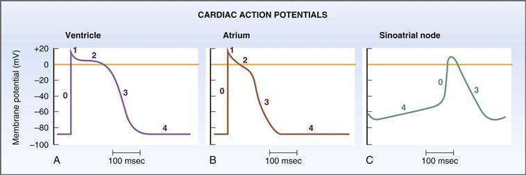

**그림 4–12 심실, 심방 및 동방결절의 심장 활동 전위.
**A–C,**** 숫자는 활동 전위의 단계에 해당합니다.

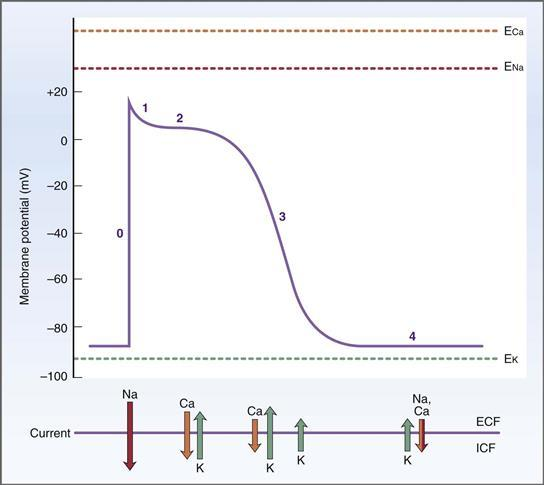

**그림 4–13 심실 활동 전위를 담당하는 전류.** *화살표*의 길이는 각 이온 전류의 상대적인 크기를 보여줍니다. E, 평형 잠재력; ECF, 세포외액; ICF, 세포내액.

1. **0단계, 상향 뇌졸중.** 심실, 심방 및 푸르킨예 섬유에서 활동 전위는 상향 뇌졸중이라고 불리는 **빠른 탈분극** 단계로 시작됩니다. 신경 및 골격근에서와 마찬가지로, 상승 스트로크는 Na+ 채널의 탈분극 유발 활성화 게이트 개방에 의해 생성된 Na+ 전도도(gNa)의 일시적인 증가로 인해 발생합니다. gNa가 증가하면 **내부 Na+ 전류**(세포 내로 Na+ 유입) 또는 INa가 발생하여 막 전위를 약 +65mV의 Na+ 평형 전위 쪽으로 유도합니다. 신경에서와 마찬가지로 Na+ 채널의 비활성화 게이트가 탈분극에 반응하여 닫히기 때문에 막 전위는 Na+ 평형 전위에 완전히 도달하지 못합니다(비록 활성화 게이트가 열리는 것보다 더 느리긴 하지만). 따라서 Na+ 채널은 잠깐 열렸다가 닫힙니다. 상승 행정의 정점에서 막 전위는 약 +20mV의 값으로 탈분극됩니다. **업스트로크 상승률**을 **dV/dT**라고 합니다. dV/dT는 시간의 함수에 따른 막 전위 변화율이며 단위는 초당 볼트(V/sec)입니다. dV/dT는 **휴지 막 전위 값에 따라 달라집니다.** 이러한 의존성을 **반응성 관계**라고 합니다. 따라서 휴지 막 전위가 가장 음이거나 과분극화(예: -90 mV)될 때 dV/dT가 가장 크며(상향 스트로크 상승 속도가 가장 빠름), 휴지 막 전위가 덜 음이거나 탈분극될 때 dV/dT가 가장 낮습니다(상향 스트로크 상승 속도가 가장 느림). (예: -60mV) 이 상관 관계는 막 전위와 Na+ 채널의 비활성화 게이트 위치 사이의 관계를 기반으로 합니다([1장](CR%21G9RE0KW4PD33Q9F3DXNCSBNXCANP_split_007.html#filepos27757) 참조). 휴지막 전위가 상대적으로 과분극되면(예: -90mV) 전압 의존적 비활성화 게이트가 열리고 많은 Na+ 채널이 상향 행정에 사용 가능합니다. 휴지 막 전위가 상대적으로 탈분극되면(예: -60mV) Na+ 채널의 비활성화 게이트가 닫히는 경향이 있고 상승 행정 중에 열 수 있는 Na+ 채널의 수가 더 적습니다. dV/dT는 또한 **내부 전류의 크기**(즉, 심실, 심방 및 Purkinje 섬유에서 내부 Na+ 전류의 크기)와 상관 관계가 있습니다. 2. **1단계, 초기 재분극.** 심실, 심방 및 퍼킨제 섬유의 1단계는 짧은 재분극 기간으로, 상승 뇌졸중 직후에 나타납니다. 재분극이 발생하려면 **순 외부 전류**가 있어야 한다는 점을 상기하십시오. 1단계에서 순 외부 전류가 발생하는 데는 두 가지 설명이 있습니다. 첫째, 탈분극에 반응하여 Na+ 채널의 비활성화 게이트가 닫힙니다. 이러한 게이트가 닫히면 gNa가 감소하고 내부 Na+ 전류(업스트로크를 유발함)가 중단됩니다. 둘째, K+ 이온에 대한 큰 추진력으로 인해 외부로 K+ 전류가 발생합니다. 상승 행정이 최고조에 달할 때 *화학적 추진력과 전기적 추진력이 *둘 다* 세포 밖으로 K+ 이동을 *촉진*합니다(세포 내 K+ 농도는 세포 외 K+ 농도보다 높으며 세포 내부는 전기적으로 양성입니다). K+ 전도도(gK)가 높기 때문에 K+는 급격한 전기화학적 기울기를 따라 세포 밖으로 흘러나옵니다. 3. **2단계, 정체기.** 정체기에는 특히 심실 섬유와 푸르킨예 섬유에서 비교적 **안정적이고 탈분극된 막 전위**가 장기간(150~200msec) 지속됩니다. (심방 섬유에서는 안정기가 심실 섬유보다 짧습니다.) 막 전위가 안정적이려면 내부 전류와 외부 전류가 같아야 막을 통과하는 순 전류 흐름이 없어야 한다는 점을 상기하십시오. *안정기 동안 내부 전류와 외부 전류의 균형이 어떻게 이루어지나요?* Ca2+ 컨덕턴스(gCa)가 증가하여 **내부 Ca2+ 전류**가 발생합니다. 내부 Ca2+ 전류는 **느린 내부 전류**라고도 하는데, 이는 이러한 채널의 더 느린 동역학을 반영합니다(상향 스트로크의 빠른 Na+ 채널과 비교). 정체기 동안 열리는 Ca2+ 채널은 **L형 채널**이며 **Ca2+ 채널 차단제** 니페디핀, 딜티아젬 및 베라파밀에 의해 억제됩니다. 내부 Ca2+ 전류의 균형을 맞추기 위해 K+ 이온에 대한 전기화학적 추진력에 의해 구동되는 **외부 K+ 전류**가 있습니다(1단계에서 설명한 대로).

따라서 정체기 동안 내부로 향하는 Ca2+ 전류는 외부로 향하는 K+ 전류와 균형을 이루고 순 전류는 0이 되며 막 전위는 안정적인 탈분극 값으로 유지됩니다. ([그림 4-13](#filepos612581) 참조. 2단계에서 내부로 유입되는 Ca2+ 전류는 외부로 유입되는 K+ 전류와 동일한 크기로 표시됩니다.)  
       내부 Ca2+ 전류의 중요성은 막 전위에 미치는 영향을 넘어 확장됩니다. 활동 전위가 안정되는 동안 Ca2+ 유입은 흥분-수축 결합을 위해 세포 내 저장소에서 더 많은 Ca2+ 방출을 시작합니다. 소위 **Ca2+ 유도 Ca2+방출** 과정은 심장 근육 수축 섹션에서 논의됩니다. 4. **3단계, 재분극.** 재분극은 2단계가 끝날 때 점진적으로 시작되고 3단계 동안 휴지 막 전위로 급속한 재분극이 발생합니다. 재분극은 외부로 향하는 전류가 내부로 향하는 전류보다 클 때 생성된다는 점을 상기하십시오. 3단계 동안 재분극은 gCa 감소(이전에는 안정기 동안 증가)와 gK 증가(휴식기보다 더 높은 수준)의 조합으로 인해 발생합니다. gCa의 감소는 내부 Ca2+ 전류의 감소를 가져오고, gK의 증가는 외부 K+ 전류(IK)의 증가를 가져오며, K+는 가파른 전기화학적 구배를 따라 아래로 이동합니다(1단계에서 설명한 대로). 3단계가 끝나면 재분극으로 인해 막 전위가 K+ 평형 전위에 더 가까워지고 이에 따라 K+에 대한 추진력이 감소하기 때문에 외부로 향하는 K+ 전류가 감소합니다. 5. **4단계, 휴지기 막 전위 또는 전기 확장기.** 막 전위는 3단계 동안 완전히 재분극되고 약 -85mV의 휴지기 수준으로 돌아갑니다. 4단계에서는 막전위가 다시 안정되고 내부 전류와 외부 전류가 동일해집니다. 휴지 막 전위는 K+ 평형 전위에 접근하지만 완전히 도달하지는 않습니다. 이는 K+에 대한 높은 휴지 전도도를 반영합니다. 4단계를 담당하는 K+ 채널과 그에 따른 K+ 전류는 3단계의 재분극을 담당하는 채널과 다릅니다. 4단계에서 K+ 전도도를 gK1이라고 하고 K+ 전류를 이에 따라 IK1이라고 합니다. 4단계의 안정적인 막 전위는 내부 전류와 외부 전류가 동일하다는 것을 의미합니다. K+에 대한 높은 컨덕턴스는 이미 설명한 외부 K+ 전류(IK1)를 생성합니다. 이 외부 전류의 균형을 맞추는 내부 전류는 Na+ 및 Ca2+에 대한 컨덕턴스가 정지 상태에서 낮더라도 Na+ 및 Ca2+([그림 4-13](#filepos612581) 참조)에 의해 전달됩니다. 다음과 같은 질문이 생길 수 있습니다. *gNa와 gCa가 매우 낮고 gK1이 매우 높다면 어떻게 내부 Na+와 Ca2+ 전류의 합이 외부 K+ 전류와 같은 크기가 될 수 있습니까?* 대답은 각 이온에 대해 전류 = 전도도 × 추진력이라는 사실에 있습니다. gK1은 높지만 정지 막 전위가 K+ 평형 전위에 가깝기 때문에 K+에 대한 추진력은 낮습니다. 따라서 외부 K+ 전류는 상대적으로 작습니다. 반면, gNa와 gCa는 모두 낮지만, 휴지 막 전위가 Na+ 및 Ca2+ 평형 전위와 멀기 때문에 Na+와 Ca2+에 대한 추진력은 높습니다. 따라서 Na+와 Ca2+가 전달하는 내부 전류의 합은 K+가 전달하는 외부 전류와 같습니다.

##### *동심방결절의 활동 전위*

SA 노드는 심장의 정상적인 맥박 조정기입니다. 활동 전위의 구성과 이온 기반은 심방, 심실 및 푸르킨예 섬유의 구성과 몇 가지 중요한 측면에서 다릅니다([그림 4-12*C*](#filepos612136) 참조). SA 결절의 활동 전위에 대한 다음 특징은 심방, 심실 및 푸르킨예 섬유의 활동 전위와 다릅니다. (1) SA 결절은 **자동성**을 나타냅니다. 즉, 신경 입력 없이 자발적으로 활동 전위를 생성할 수 있습니다. (2) 심방, 심실 및 퍼킨제 섬유의 세포와는 직접적으로 대조적으로 **불안정한 휴지 막 전위**를 가지고 있습니다. (3) 지속되는 정체기가 ***없음*입니다.**

SA 노드 활동 전위의 단계는 여기에 설명되어 있으며 [그림 4-12*C*](#filepos612136)에 표시된 번호가 매겨진 단계에 해당합니다.

1. **0단계, 상승 단계.** 0단계(다른 심장 세포와 마찬가지로)는 활동 전위의 상승 단계입니다. 상승 스트로크는 다른 유형의 심장 조직만큼 빠르거나 가파르지 않습니다. SA 노드의 상승 스트로크에 대한 이온 기반도 다릅니다. 다른 심근 세포에서 상승 뇌졸중은 gNa 증가와 내부 Na+ 전류의 결과입니다. SA 결절 세포에서 상승 스트로크는 주로 L형 Ca2+ 채널에 의해 전달되는 **gCa 증가 및 내부 Ca2+ 전류**의 결과입니다. SA 노드에는 상향 행정의 내부 Ca2+ 전류 일부를 전달하는 T형 Ca2+ 채널도 있습니다.
2. **1단계와 2단계는 없습니다.**
3. **3단계, 재분극.** 다른 심근 조직에서와 마찬가지로 SA 결절의 재분극은 gK의 증가로 인해 발생합니다. K+에 대한 전기화학적 추진력이 크기 때문에(화학적 및 전기적 추진력 모두 세포를 떠나는 K+를 선호함) 외부로 K+ 전류가 발생하여 막 전위를 재분극합니다.
4. **4단계, 자발적인 탈분극 또는 심박 조율기 잠재력.** 4단계는 SA 노드 활동 전위의 가장 긴 부분입니다. 이 단계는 SA 결절 세포의 **자동성**(신경 입력 없이 활동 전위를 자발적으로 생성하는 능력)을 설명합니다. 4단계 동안 막 전위의 가장 음의 값(**최대 이완기 전위**라고 함)은 약 -65mV이지만 막 전위는 이 값으로 유지되지 않습니다. 오히려 Na+ 채널이 열리고 **If**라고 불리는 **내부 Na+ 전류**가 생성되어 느린 탈분극이 발생합니다. *웃긴*를 의미하는 "f"는 이 Na+ 전류가 심실 세포의 상승을 담당하는 빠른 Na+ 전류와 다르다는 것을 나타냅니다. *I*f*는 이전 활동 전위의 재분극에 의해 활성화되어* SA 노드의 각 활동 전위 뒤에 또 다른 활동 전위가 따라오게 됩니다. 일단 느린 탈분극이 막 전위를 임계값으로 가져오면 T형 Ca2+ 채널이 상승을 위해 열립니다.  
       **4단계 탈분극 속도가 심박수를 설정합니다.** 4단계 탈분극 속도가 증가하면 역치에 더 빨리 도달하고 SA 노드는 시간당 더 많은 활동 전위를 발생시키고 심박수는 증가합니다. 반대로, 4단계 탈분극 속도가 감소하면 역치에 더 느리게 도달하고 SA 노드는 시간당 더 적은 활동 전위를 발생시키며 심박수는 감소합니다. 심박수에 대한 자율신경계의 영향은 4단계 탈분극 속도의 변화에 ​​기초하며 이 장의 뒷부분에서 논의됩니다.

##### *잠재 심박조율기*

SA 노드의 세포는 본질적인 자동성을 갖는 유일한 심근 세포가 아닙니다. **잠재 심박조율기**라고 불리는 다른 세포도 자발적인 4단계 탈분극 능력을 가지고 있습니다. 잠재 심박조율기에는 **AV 결절**, **His 다발**, **푸르킨제 섬유**의 세포가 포함됩니다. 이들 세포 각각은 자동성을 가질 가능성이 있지만 일반적으로 발현되지 않습니다.

*4단계 탈분극 속도가 가장 빠른 심박조율기가 심박수를 조절하는 것이 원칙입니다.* 일반적으로 SA node는 4단계 탈분극 속도가 가장 빠르므로 심박수를 설정합니다([표4-3](#filepos628118)). 또한 모든 심근 세포 중에서 SA 결절 세포가 가장 짧은 활동 전위 기간(즉, 가장 짧은 불응 기간)을 갖는다는 점을 기억하십시오. 따라서 SA 결절 세포는 더 빨리 회복되고 다른 세포 유형이 준비되기 전에 다른 활동 전위를 발동할 준비가 되어 있습니다.

**표 4–3 심장의 동방결절 및 잠복 심박조율기의 작동 속도**

|  |  |
| --- | --- |
| **위치** | **고유 발사 속도(충격수/분)** |
| 동방결절 | 70~80 |
| 방실결절 | 40~60 |
| 그의 묶음 | 40 |
| 푸르킨예 섬유 | 15~20 |

SA 노드가 심박수를 구동할 때 잠재 심박조율기가 억제되는 현상을 **과구동 억제**라고 하며, SA 노드는 모든 잠재적 심박조율기 중 가장 빠른 발사 속도를 가지며, 자극은 [그림 4-11](#filepos601613)에 표시된 순서대로 SA 노드에서 다른 심근 조직으로 전파됩니다. 이러한 조직 중 일부는 그 자체로 잠재적인 심박 조율기(AV 노드, His 번들, Purkinje 섬유)이지만 발화 속도가 SA 노드에 의해 구동되는 한 자발적인 탈분극 능력은 억제됩니다.

잠재 심박 조율기는 SA 결절이 억제되거나 잠복 심박 조율기의 고유 발사 속도가 SA 결절의 속도보다 빨라지는 경우 *만* 심박수를 유도할 수 있는 기회를 갖습니다. 잠재성 박동조율기의 고유 박동수는 동방결절의 박동수보다 느리기 때문에 잠재성 박동조율기로 구동할 경우 심장 박동 속도가 느려집니다([표 4-3](#filepos628118) 참조).

다음 조건에서 잠복 심박조율기가 대신하여 심장의 *심장박동기가 됩니다. 이 경우 **이소성 심박조율기** 또는 **이소성 초점**이라고 합니다. (1) SA 결절 발사 속도가 감소하거나(예: 미주신경 자극으로 인해) 완전히 멈추면(예: SA 결절이 약물에 의해 파괴, 제거 또는 억제되기 때문에) 잠복 부위 중 하나가 심장에서 심박 조율기의 역할을 맡게 됩니다. (2) 또는 잠재 심장 박동기 중 하나의 고유 발사 속도가 SA 노드의 속도보다 빨라지면 심장 박동기 역할을 맡게 됩니다. (3) 또는 전도 경로의 질병으로 인해 SA 결절에서 심장의 나머지 부분으로의 활동 전위 전도가 차단되면 SA 결절 외에 잠복 심박 조율기가 나타날 수 있습니다.

#### 전도 속도

##### *심장 활동 전위의 전도*

심장에서 **전도 속도**는 신경 및 골격근 섬유에서와 동일한 의미를 갖습니다. 활동 전위가 조직 내에서 전파되는 속도입니다. 전도 속도의 단위는 초당 미터(m/sec)입니다. 전도 속도는 모든 심근 조직에서 동일하지 않습니다. [그림 4-14](#filepos631929)에서 볼 수 있듯이 AV 노드에서 가장 느리고(0.01~0.05m/sec) 푸르킨예 섬유에서 가장 빠릅니다(2~4m/sec).

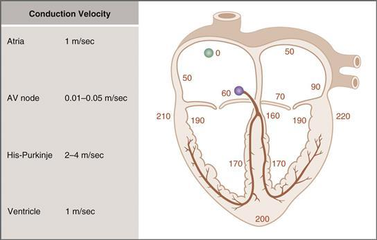

**그림 4–14 심근 활성화 시기.** 심근에 겹쳐진 숫자는 동방결절에서 활동 전위가 시작된 후의 누적 시간(msec)을 나타냅니다.

전도 속도는 활동 전위가 심근의 다양한 위치로 확산되는 데 걸리는 시간을 결정합니다. 이 시간은 밀리초 단위로 [그림 4-14](#filepos631929)의 다이어그램에 겹쳐져 있습니다. 활동전위는 소위 시간 0에 SA 노드에서 시작됩니다. 그런 다음 활동 전위가 심방, 방실결절 및 His-Purkinje 시스템을 통해 심실의 가장 먼 지점으로 확산되는 데 총 220msec가 걸립니다. AV 노드를 통한 전도(**AV 지연**이라고 함)에는 심근을 통한 전체 전도 시간의 거의 절반이 필요합니다. AV 지연이 발생하는 이유는 모든 심근 조직 중에서 AV node의 전도 속도가 가장 느리고(0.01~0.05m/sec) 전도 시간이 가장 길기 때문입니다(100msec).

심장 조직 간의 전도 속도의 차이는 생리적 기능에 영향을 미칩니다. 예를 들어, 방실결절의 느린 전도 속도는 심실이 너무 일찍(즉, 심방에서 혈액을 채울 시간이 되기 전에) 활성화되지 않도록 보장합니다. 반면, 푸르킨예 섬유의 빠른 전도 속도는 효율적인 혈액 방출을 위해 심실이 신속하고 원활한 순서로 활성화될 수 있도록 보장합니다.

##### *심장 활동 전위 전파 메커니즘*

신경 및 골격근 섬유에서와 마찬가지로 심장 활동 전위 전도의 생리학적 기초는 **국소 전류**의 확산입니다([1장](CR%21G9RE0KW4PD33Q9F3DXNCSBNXCANP_split_007.html#filepos27757) 참조). 한 부위의 활동 전위는 인접한 부위에서 국소 전류를 생성합니다. 인접한 장소는 국지적인 전류 흐름과 화재 활동 전위 자체의 결과로 임계값까지 탈분극됩니다. 이 국소 전류 흐름은 활동 전위 상승의 내부 전류의 결과입니다. 심방, 심실 및 푸르킨예 섬유에서는 상향 행정의 내부 전류가 Na+에 의해 전달되고, SA 결절에서는 상향 행정의 내부 전류가 Ca2+에 의해 전달된다는 점을 상기하십시오.

전도 속도는 활동 전위가 상승하는 동안 **내부 전류의 크기**에 따라 달라집니다. 내부 전류가 클수록 국지적 전류는 더 빠르게 인접한 사이트로 확산되어 임계값까지 탈분극됩니다. 전도 속도는 활동 전위의 상승 속도인 **dV/dT**와도 상관 관계가 있습니다. 왜냐하면 dV/dT *또한* 이전에 논의한 것처럼 내부 전류의 크기와 상관 관계가 있기 때문입니다.

활동전위의 전파는 국소 전류를 형성하기 위한 상향 행정의 내부 전류뿐만 아니라 심근 섬유의 **케이블 특성**에 따라 달라집니다. 이러한 케이블 특성은 세포막 저항(Rm)과 내부 저항(Ri)에 의해 결정됩니다. 예를 들어, 심근 조직에서는 **간극 접합**이라고 불리는 세포 간 연결의 저항이 낮기 때문에 Ri가 특히 낮습니다. 따라서 심근 조직은 빠른 전도에 특히 적합합니다.

전도 속도는 혼란스러울 수 있는 활동 전위 기간에 의존하지 *않습니다*. 그러나 활동 전위 기간은 단순히 주어진 부위가 탈분극에서 완전한 재분극으로 이동하는 데 걸리는 시간입니다(예: 심실 세포의 활동 전위 기간은 250msec입니다). 활동 전위 기간은 해당 활동 전위가 이웃 사이트로 확산되는 데 걸리는 시간에 대해서는 아무 의미도 없습니다.

#### 흥분성 및 불응기

**흥분성**은 내부의 탈분극 전류에 반응하여 활동 전위를 생성하는 심근 세포의 능력입니다. 엄밀히 말하면 흥분성은 심근 세포를 역치 전위에 도달시키는 데 필요한 내부 전류의 양입니다. 심근 세포의 흥분성은 활동 전위의 과정에 따라 달라지며 이러한 흥분성의 변화는 불응기에 반영됩니다.

심근 세포의 **불응기**에 대한 생리학적 기초는 신경 세포의 그것과 유사합니다. [제1장](CR%21G9RE0KW4PD33Q9F3DXNCSBNXCANP_split_007.html#filepos27757)에서 막 전위가 역치까지 탈분극될 때 Na+ 채널의 활성화 게이트가 *열려* 세포 내로 Na+가 급속하게 유입되어 Na+ 평형 전위를 향해 추가 탈분극이 발생한다는 사실을 상기해 보십시오. 이러한 급속한 탈분극은 활동 전위의 상승입니다. 그러나 Na+ 채널의 비활성화 게이트도 탈분극과 함께 *닫힙니다*(비록 활성화 게이트가 열리는 것보다 더 느리게 닫힙니다). 따라서 막전위가 탈분극되는 활동전위 단계에서는 비활성화 관문이 닫혀 있기 때문에 Na+ 채널의 일부가 닫힙니다. Na+ 채널이 닫혀 있으면 내부 탈분극 전류가 채널을 통해 흐를 수 없으며 상승 행정도 있을 수 없습니다. 상승이 없으면 정상적인 활동 전위가 발생할 수 없으며 세포는 *불응성*이 됩니다. 일단 재분극이 발생하면 Na+ 채널의 비활성화 게이트가 열리고 세포는 다시 한번 흥분하게 됩니다.

[그림 4-15](#filepos638322)는 심실 근육의 활동 전위를 보여주는 친숙한 다이어그램이며 불응 기간이 그 위에 겹쳐져 있습니다. 다음 불응 기간은 활동 전위 기간 동안의 흥분성의 차이를 반영합니다.

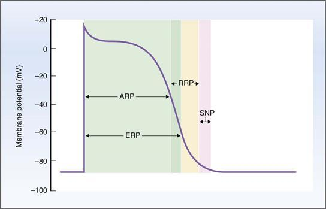

**그림 4–15 심실 활동 전위의 불응기.** 유효 불응기(ERP)에는 절대 불응기(ARP)와 상대 불응기(RRP)의 전반부가 포함됩니다. RRP는 절대 불응기가 끝날 때 시작되며 유효 불응기의 마지막 부분을 포함합니다. 초정상기(SNP)는 상대 불응기가 끝날 때 시작됩니다.

 **절대 불응기.** 대부분의 활동 전위 기간 동안 심실 세포는 다른 활동 전위를 발생시키는 데 완전히 불응합니다. 아무리 큰 자극(즉, 내부 전류)이 적용되더라도 대부분의 Na+ 채널이 닫혀 있기 때문에 세포는 절대 불응기(ARP) 동안 두 번째 활동 전위를 생성할 수 없습니다. 절대 불응기는 상승기, 전체 안정기, 재분극의 일부를 포함합니다. 이 기간은 세포가 약 -50mV로 재분극되었을 때 종료됩니다.

 **유효 불응 기간.** 유효 불응 기간(ERP)에는 절대 불응 기간이 포함되며 이보다 약간 더 깁니다. 유효 불응 기간이 끝나면 Na+ 채널이 회복되기 시작합니다(즉, 전류를 내부로 전달할 수 있게 됩니다). 절대 불응 기간과 유효 불응 기간의 차이는 *절대*는 다른 활동 전위를 생성할 만큼 큰 자극이 *절대* 없음을 의미한다는 것입니다. *효과적*은 *전도된* 활동 전위가 생성될 수 없음을 의미합니다(즉, 다음 부위로 전도하기에 충분한 내부 전류가 없음).

 **상대 불응기.** 상대 불응기(RRP)는 절대 불응기의 끝에서 시작하여 세포막이 거의 완전히 재분극될 때까지 계속됩니다. 상대 불응기 동안 더 많은 Na+ 채널이 회복되어 *정상보다 더 큰 자극이 필요하기는 하지만* 두 번째 활동 전위를 생성하는 것이 가능합니다. 상대 불응기 동안 두 번째 활동 전위가 생성되면 비정상적인 구성과 단축된 정체기를 갖게 됩니다.

 **정상 이상 기간.** 정상 이상 기간(SNP)은 상대 불응 기간을 따릅니다. 이는 막 전위가 -70mV일 때 시작하여 막이 -85mV로 완전히 재분극될 때까지 계속됩니다. 이름에서 알 수 있듯이 이 기간 동안 세포는 *정상보다 더 흥분합니다*. 즉, 셀을 임계 전위까지 탈분극하는 데 더 적은 내부 전류가 필요합니다. 이렇게 흥분성이 증가한 것에 대한 생리학적 설명은 Na+ 채널이 회복되고(즉, 비활성화 관문이 다시 열림) 막 전위가 정지 상태보다 역치에 더 가깝기 때문에 세포막이 정지 막 전위에 있을 때보다 활동 전위를 발생시키기가 더 쉽다는 것입니다.

#### 심장과 혈관에 대한 자율신경 효과

[표 4-4](#filepos642589)는 자율신경계가 심장과 혈관에 미치는 영향을 정리한 것이다. 편의상 심박수, 전도 속도, 심근 수축력, 혈관 평활근에 대한 자율 효과를 하나의 표로 통합했습니다. 심장 전기생리학(예: 심박수 및 전도 속도)에 대한 효과는 이 섹션에서 논의되고, 기타 자율신경 효과는 이후 섹션에서 논의됩니다.

**표 4–4 자율신경계가 심장과 혈관에 미치는 영향**

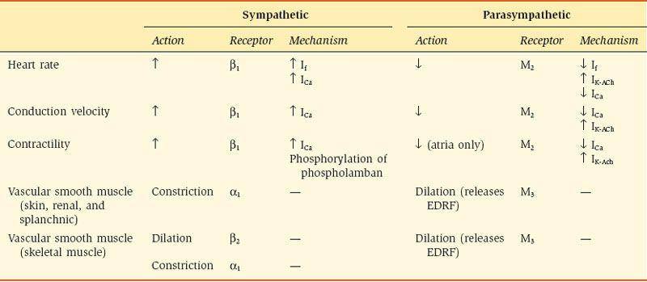

AV, 방실; EDRF, 내피 유래 이완 인자; M, 무스카린성.

##### *심박수에 대한 자율신경의 영향*

자율신경계가 심박수에 미치는 영향을 **만대시간효과**라고 합니다. 교감신경계와 부교감신경계가 심박수에 미치는 영향을 정리하면 [표 4-4](#filepos642589)와 [그림 4-16](#filepos643583)에 나타나 있습니다. 간단히 말하면, 교감신경 자극은 심박수를 증가시키고 부교감신경 자극은 심박수를 감소시킵니다.

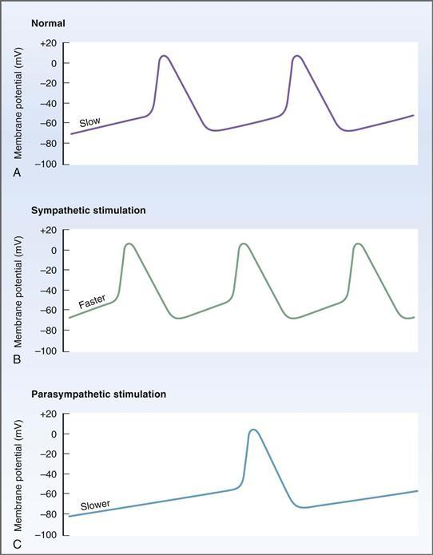

**그림 4-16 동방결절 활동 전위에 대한 교감신경 및 부교감신경 자극의 효과.
**A,**** SA 노드의 일반적인 발사 패턴이 표시됩니다. **B,** 교감신경 자극은 4단계 탈분극 속도를 증가시키고 활동 전위의 빈도를 증가시킵니다. **C,** 부교감신경 자극은 4단계 탈분극 속도를 감소시키고 최대 이완기 전위를 과분극시켜 활동 전위의 빈도를 감소시킵니다.

[그림 4-16*A*](#filepos643583)는 SA 노드의 정상적인 발사 패턴을 보여줍니다. 4단계 탈분극은 Na+ 채널을 열어서 발생하며, 이는 If라고 불리는 느린 탈분극 내부 Na+ 전류로 이어집니다. 막 전위가 역치 전위로 탈분극되면 활동 전위가 시작됩니다.

 **긍정적인 크로노트로픽 효과**는 심박수 증가입니다. 가장 중요한 예는 [그림 4-16*B*](#filepos643583)*에 설명된 대로 **교감 신경계**를 자극하는 것입니다.* 교감 신경 섬유에서 방출된 노르에피네프린은 SA 노드의 β1 수용체를 활성화합니다. 이러한 **β1 수용체**는 Gs 단백질을 통해 아데닐릴 사이클라제에 결합됩니다([2장](CR%21G9RE0KW4PD33Q9F3DXNCSBNXCANP_split_009.html#filepos253561) 참조). SA 결절에서 β1 수용체가 활성화되면 **If의 증가**가 발생하고, 이는 4단계 탈분극 속도를 증가시킵니다. 또한, ICa가 증가합니다. 이는 기능적인 Ca2+ 채널이 더 많아 역치에 도달하는 데 필요한 탈분극이 더 적다는 것을 의미합니다(즉, 역치 전위 감소). 4단계 탈분극 속도를 높이고 역치 전위를 감소시키는 것은 SA 노드가 역치 전위로 더 자주 탈분극되고 결과적으로 단위 시간당 더 많은 활동 전위(즉, 심박수 증가)를 발생시킨다는 것을 의미합니다.

 **부정적 시간변환 효과**는 심박수 감소입니다. 가장 중요한 예는 [그림 4-16*C*](#filepos643583)에 설명된 **부교감신경계** 자극입니다. 부교감 신경 섬유에서 분비되는 아세틸콜린(ACh)은 SA 결절의 **무스카린성**(**M2**) 수용체를 활성화합니다. SA 결절에서 무스카린 수용체의 활성화는 결합하여 심박수를 감소시키는 두 가지 효과를 갖습니다. 첫째, 이러한 무스카린성 수용체는 아데닐릴 시클라제를 억제하고 **If의 감소**를 생성하는 **GK**라고 하는 일종의 **Gi 단백질**과 결합됩니다. If의 감소는 4단계 탈분극 속도를 감소시킵니다. 둘째, Gk*는 **K+-ACh**라고 하는 K+ 채널의 컨덕턴스를 직접적으로 증가시키고 **IK-ACh**라고 하는 외부 K+ 전류(IK1과 유사)를 증가시킵니다. 이 외부 K+ 전류를 강화하면 최대 이완기 전위가 과분극되어 SA 결절 세포가 역치 전위에서 더 멀어지게 됩니다. 또한, ICa가 감소합니다. 이는 기능성 Ca2+ 채널이 적고 따라서 역치에 도달하기 위해 더 많은 탈분극이 필요함을 의미합니다(즉, 역치 전위 증가). 요약하면, 부교감 신경계는 SA 결절에 대한 세 가지 효과를 통해 심박수를 감소시킵니다. (1) 4단계 탈분극 속도를 늦추고, (2) 역치 전위에 도달하기 위해 더 많은 내부 전류가 필요하도록 최대 확장기 전위를 과분극화하고, (3) 역치 전위를 증가시킵니다. 결과적으로 SA 노드는 역치까지 탈분극되고 단위 시간당 더 적은 활동 전위를 발생시킵니다(즉, 심박수 감소)([상자 4-1](#filepos648069)).

**상자 4-1 임상 생리학: 부비동 서맥**

> **사례 설명.** 고혈압이 있는 72세 여성이 베타-아드레날린 차단제인 프로프라놀롤로 치료를 받고 있습니다. 그녀는 현기증과 실신(실신)을 여러 번 경험했습니다. ECG는 동서맥을 보여줍니다: 정상, 규칙적인 P파, 이어서 정상적인 QRS 복합체; 그러나 P파의 주파수는 45/분으로 감소합니다. 의사는 프로프라놀롤의 양을 줄여 결국 중단한 다음 여성의 약물을 다른 계열의 항고혈압제로 변경합니다. 프로프라놀롤을 중단하면 반복 ECG에서 P파 빈도가 80/분인 정상적인 동리듬을 나타냅니다.

> **사례 설명.** 심박수는 P파의 주파수로 표시됩니다. 프로프라놀롤 치료 중 그녀의 심박수는 분당 45회에 불과했습니다. ECG에서 P파의 존재는 심장이 정상적인 심박조율기인 SA 노드에서 활성화되고 있음을 나타냅니다. 그러나 SA결절의 탈분극 빈도는 베타-아드레날린 차단제인 프로프라놀롤로 치료를 받고 있기 때문에 정상보다 훨씬 낮습니다. β-아드레날린 작용제는 If를 증가시킴으로써 SA 결절의 4단계 탈분극 속도를 *증가*시킨다는 점을 상기하십시오. 따라서 β-아드레날린 길항제는 4단계 탈분극을 *감소*시키고 SA 결절 세포가 활동 전위를 발화하는 빈도를 감소시킵니다.

> **치료.** 여성의 동서맥증은 프로프라놀롤 요법의 부작용이었습니다. 프로프라놀롤을 중단하자 그녀의 심박수는 정상으로 돌아왔습니다.

##### *방실결절의 전도 속도에 대한 자율신경 효과*

자율신경계가 전도 속도에 미치는 영향을 **방향성 효과**라고 합니다. 전도 속도의 증가를 양의 방향성 효과라고 하며, 전도 속도의 감소를 음의 방향성 효과라고 합니다. 전도 속도에 대한 자율신경계의 가장 중요한 생리학적 효과는 AV 결절에서의 효과이며, 이는 사실상 활동 전위가 심방에서 심실로 전도되는 속도를 변경합니다. 이러한 자율신경 효과의 메커니즘을 고려할 때 전도 속도는 활동 전위 상승의 내부 전류 크기 및 상승 속도 dV/dT와 상관관계가 있다는 점을 상기하십시오.

**교감 신경계**를 자극하면 방실결절을 통한 **전도 속도의 증가**가 발생하고(양성 자극 촉진 효과), 이는 활동 전위가 심방에서 심실로 전도되는 속도를 증가시킵니다. 교감 효과의 메커니즘은 ICa 증가이며, 이는 AV 노드(SA 노드에서와 마찬가지로)에서 활동 전위의 상승을 담당합니다. 따라서 ICa의 증가는 내부 전류의 증가와 전도 속도의 증가를 의미합니다. 지지 역할에서 증가된 ICa는 ERP를 단축시켜 AV 결절 세포가 비활성화에서 더 일찍 회복되고 증가된 발사 속도를 수행할 수 있도록 합니다.

**부교감 신경계**를 자극하면 방실결절을 통한 **전도 속도가 감소**되어(음성 윤동성 효과), 이는 활동 전위가 심방에서 심실로 전도되는 속도를 감소시킵니다. 부교감 효과의 메커니즘은 ICa 감소(내부 전류 감소)와 IK-ACh 증가(외부 K+ 전류 증가, 순 내부 전류 감소)의 조합입니다. 또한 AV 결절 세포의 ERP가 연장됩니다. 방실결절을 통한 전도 속도가 충분히 느려지면(예: 부교감신경 활동 증가 또는 방실결절 손상으로 인해) 일부 활동 전위가 심방에서 심실로 전혀 전도되지 않아 **심장 차단**이 발생할 수 있습니다. 심장 차단의 정도는 다양할 수 있습니다. 경미한 형태에서는 심방에서 심실로의 활동 전위 전도가 단순히 느려집니다. 더 심한 경우에는 활동 전위가 심실로 전혀 전달되지 않을 수 있습니다.

#### 심전도

심전도(ECG 또는 EKG)는 심장의 전기 활동을 반영하는 신체 표면의 작은 전위차를 측정한 것입니다. 간단히 말해서 이러한 전위차 또는 전압은 심장의 탈분극 및 재분극의 시기와 순서로 인해 신체 표면에서 측정할 수 있습니다. 전체 심근이 한 번에 탈분극되지 않는다는 점을 기억하십시오. 심방은 심실보다 먼저 탈분극됩니다. 심실은 특정 순서로 탈분극됩니다. 심실이 탈분극되는 동안 심방은 재분극됩니다. 심실은 특정 순서로 재분극됩니다. 심근의 탈분극 및 재분극 확산의 순서와 타이밍에 따라 심장의 서로 다른 부분 간에 전위차가 발생하며 이는 신체 표면에 배치된 전극으로 감지될 수 있습니다.

정상적인 ECG의 구성은 [그림 4-17](#filepos654450)과 같다. ECG의 명명법은 다음과 같습니다. 다양한 파동은 심근의 여러 부분의 탈분극 또는 재분극을 나타내며 문자로 된 이름이 지정됩니다. 파도 사이의 간격과 세그먼트에도 이름이 지정됩니다. 간격과 세그먼트의 차이점은 간격에는 파도가 포함되고 세그먼트에는 포함되지 않는다는 것입니다. ECG에는 다음과 같은 파동, 간격 및 세그먼트가 표시됩니다.

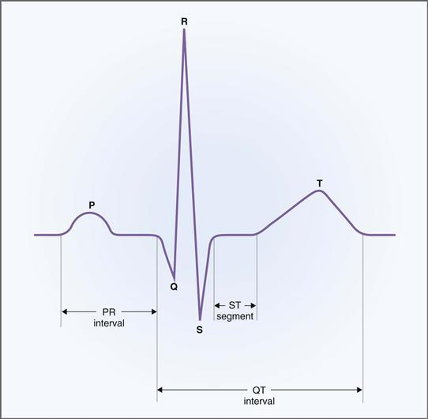

**그림 4–17** **납 II에서 측정한 심전도**.

1. **P파.** P파는 심방의 탈분극을 나타냅니다. P파의 지속 시간은 심방을 통한 전도 시간과 상관관계가 있습니다. 예를 들어, 심방을 통한 전도 속도가 감소하면 P파가 퍼집니다. 심방 재분극은 QRS 복합체에 "매장"되어 있기 때문에 정상적인 ECG에서는 볼 수 없습니다.
2. **PR 간격.** PR 간격은 심방의 초기 탈분극부터 심실의 초기 탈분극까지의 시간입니다. 따라서 PR 간격에는 **AV 결절 전도**에 해당하는 ECG의 등전위(평평한) 부분인 P파와 PR 세그먼트가 포함됩니다. PR 간격에는 PR 세그먼트가 포함되므로 *AV 결절을 통한 전도 시간과도 상관 관계가 있습니다.*  
       일반적으로 PR 간격은 160msec로, 이는 심방의 첫 번째 탈분극부터 심실의 첫 번째 탈분극까지의 누적 시간입니다([그림 4-14](#filepos631929) 참조). AV 결절을 통한 전도 속도의 증가는 PR 간격을 *감소*시키고(예: 교감 신경 자극으로 인해), AV 결절을 통한 전도 속도의 감소는 PR 간격을 *증가*시킵니다(예: 부교감 신경 자극으로 인해).
3. **QRS 복합체.** QRS 복합체는 Q, R, S의 세 가지 파동으로 구성됩니다. 종합적으로 이 파동은 심실의 탈분극을 나타냅니다. QRS 복합체의 전체 지속 시간은 P파의 지속 시간과 유사합니다. 심실이 심방보다 훨씬 크기 때문에 이 사실은 놀랍게 보일 수 있습니다. 그러나 His-Purkinje 시스템의 전도 속도가 심방 전도 시스템보다 훨씬 빠르기 때문에 심실은 심방만큼 빠르게 탈분극됩니다.
4. **T파.** T파는 심실의 재분극을 나타냅니다.
5. **QT 간격.** QT 간격에는 QRS 복합체, ST 세그먼트 및 T파가 포함됩니다. 이는 첫 번째 심실 탈분극부터 마지막 ​​심실 재분극까지를 나타냅니다. ST 분절은 심실 활동 전위의 안정기와 상관관계가 있는 QT 간격의 등전위 부분입니다.

**심박수**는 분당 QRS파(또는 가장 두드러지기 때문에 R파)의 수를 계산하여 측정됩니다. **주기 길이**는 **R-R 간격**(하나의 R 파동과 다음 파동 사이의 시간)입니다. 심박수는 다음과 같이 주기 길이와 관련됩니다.

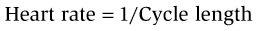

**샘플 문제.** R-R 간격이 800msec(0.8초)인 경우 심박수는 얼마입니까? 심박수가 분당 90회라면 주기의 길이는 얼마입니까?

**해결책.** R-R 간격은 사이클 길이입니다. 주기 길이가 0.8초인 경우 심박수는 1/주기 길이 또는 1.25비트/초 또는 75비트/분(1비트/0.8초)입니다. 심박수가 90회/분인 경우 주기 길이 = 1/심박수 또는 0.66초 또는 660msec입니다. 주기 길이가 길수록 심박수가 느려지고, 주기 길이가 짧을수록 심박수가 빨라집니다.

심박수(및 주기 길이)의 변화는 활동 전위의 지속 기간을 변경하고 결과적으로 불응 기간 및 흥분성의 지속 기간을 변경합니다. 예를 들어 심박수가 증가하고 주기 길이가 감소하면 활동 전위 기간이 감소합니다. 시간당 더 많은 활동 전위가 있을 뿐만 아니라 해당 활동 전위의 지속 시간과 불응 기간도 더 짧아집니다. 심박수와 불응기 사이의 관계로 인해 심박수의 증가는 **부정맥**(비정상적인 심장 박동)을 유발하는 요인이 될 수 있습니다. 심박수가 증가하고 불응 기간이 단축됨에 따라 심근 세포는 더 일찍 그리고 더 자주 흥분하게 됩니다.

### 심장 근육 수축

#### 심근세포의 구조

심장 근육과 골격근 사이에는 몇 가지 형태적, 기능적 차이가 있지만 두 세포 유형의 기본 수축 기계는 유사합니다.

골격근과 마찬가지로 심장근세포도 **근절**로 구성되어 있습니다. Z선에서 Z선까지 이어지는 근절은 굵은 필라멘트와 얇은 필라멘트로 구성되어 있습니다. **두꺼운 필라멘트**는 **미오신**으로 구성되어 있으며, 그 구형 머리에는 액틴 결합 부위와 ATPase 활성이 있습니다. **얇은 필라멘트**는 액틴, 트로포미오신, 트로포닌의 세 가지 단백질로 구성됩니다. **액틴**은 미오신 결합 부위가 있는 구형 단백질로, 중합되면 두 개의 꼬인 가닥을 형성합니다. **트로포미오신**은 꼬인 액틴 가닥의 홈을 따라 움직이며 미오신 결합 부위를 차단하는 기능을 합니다. **트로포닌**은 세 개의 하위 단위의 복합체로 구성된 구형 단백질입니다. 트로포닌 C 소단위는 Ca2+와 결합합니다. Ca2+가 트로포닌 C에 결합하면 구조적 변화가 발생하여 액틴-미오신 상호작용에 대한 트로포미오신 억제가 제거됩니다.

골격근에서와 마찬가지로 미오신과 액틴 사이에 교차 다리가 형성되었다가 끊어지면 두꺼운 필라멘트와 얇은 필라멘트가 서로 지나쳐 이동한다는 **미끄러지는 필라멘트 모델**에 따라 수축이 발생합니다. 이러한 교차 다리 순환의 결과로 근섬유는 긴장을 생성합니다.

**가로**(**T**) **세관**은 Z선에서 심장 근육 세포를 함입시키고, 세포막과 연속되어 있으며, 활동 전위를 세포 내부로 전달하는 기능을 합니다. T 세뇨관은 여기-수축 결합을 위해 Ca2+를 저장하고 방출하는 부위인 **육형질 세망**과 함께 쌍을 형성합니다.

#### 흥분-수축 결합

골격근과 평활근에서와 마찬가지로 심장 근육의 흥분-수축 결합은 활동 전위를 장력 생성으로 변환합니다. 다음 단계는 심장 근육의 흥분-수축 결합에 관련됩니다. 이러한 단계는 [그림 4-18](#filepos661762)에 표시된 원 안의 숫자와 연관되어 있습니다.

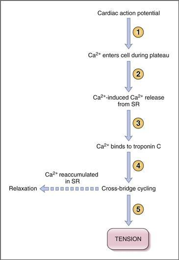

**그림 4–18 심근 세포의 흥분-수축 결합.** 원 안의 숫자에 대한 설명은 본문을 참조하십시오. SR, 근형질 세망.

1. 심장의 **활동전위**는 심근세포막에서 시작되고 탈분극은 T세관을 통해 세포 내부로 퍼집니다. 심장 활동 전위의 고유한 특징은 gCa의 증가와 Ca2+가 세포외액(ECF)에서 세포내액(ICF)으로 L형 Ca2+ 채널(**디하이드로피리딘 수용체**)을 통해 흐르는 **내부 Ca2+ 전류**의 증가로 인해 발생하는 정체기(2단계)라는 점을 상기하십시오.
2. Ca2+가 심근 세포로 유입되면 세포 내 Ca2+ 농도가 증가합니다. 세포 내 Ca2+ 농도의 증가는 수축을 시작하는 데 *혼자서* 충분하지 않습니다. 그러나 Ca2+ 방출 채널(**리아노딘 수용체**)을 통해 근형질 세망의 저장소에서 *더 많은* Ca2+ 방출을 촉발합니다. 이 과정을 **Ca2+ 유발 Ca2+ 방출**이라고 하며, 활동 전위의 안정기에 들어가는 Ca2+를 **Ca2+ 유발 요인**이라고 합니다. 이 단계에서 Ca2+가 근형질 세망에서 얼마나 많이 방출되는지를 결정하는 두 가지 요인, 즉 이전에 저장된 Ca2+의 양과 활동 전위가 안정되는 동안 내부로 유입되는 Ca2+ 전류의 크기입니다.
3. 및 4. 근형질세망으로부터의 Ca2+ 방출은 세포내 Ca2+ 농도를 더욱 증가시킵니다. Ca2+는 이제 **트로포닌 C**에 결합하고, 트로포미오신은 방해가 되지 않는 곳으로 이동하여 액틴과 미오신의 상호 작용이 발생할 수 있습니다. 액틴과 미오신이 결합하고, **교차교**가 형성되었다가 끊어지고, 얇고 두꺼운 필라멘트가 서로 지나가며 장력이 생성됩니다. 교차교량 순환은 세포내 Ca2+ 농도가 트로포닌 C의 Ca2+ 결합 부위를 차지할 만큼 충분히 높은 한 계속됩니다.
4. 매우 중요한 개념은 *심근 세포에 의해 발생된 장력의 크기는 세포 내 Ca2+ 농도에 비례한다는 것입니다*. 따라서 활동 전위 고원 동안 내부 Ca2+ 전류를 변경하거나* 근형질 세망의 Ca2+ 저장을 변경하는 호르몬, 신경 전달 물질 및 약물이 심근 세포에 의해 생성되는 장력의 양을 변화시킬 것으로 예상되는 것이 합리적입니다.

**이완**은 **Ca2+ ATPase의 작용으로 Ca2+가 근형질 세망에 재축적될 때 발생합니다.** 이러한 재축적은 세포 내 Ca2+ 농도를 안정 수준으로 감소시킵니다. 또한, 활동전위가 안정되는 동안 세포 내로 유입된 Ca2+는 근막에서 Ca2+ ATPase 및 Ca2+-Na+ 교환에 의해 세포 밖으로 배출됩니다. 이러한 근절 수송체는 ATP를 직접 사용하는 Ca2+ ATPase와 내부 Na+ 구배의 에너지를 사용하는 Ca2+-Na+ 교환기를 사용하여 전기화학적 구배에 대해 세포 밖으로 Ca2+를 펌핑합니다.

#### 수축성

수축성 또는 **수축성**은 주어진 근육 세포 길이에서 힘을 발생시키는 심근 세포의 본질적인 능력입니다. 수축성을 증가시키는 제제는 **양성 수축 효과**를 갖는다고 합니다. 양성 수축성 제제는 장력 발달 속도와 최대 장력을 모두 증가시킵니다. 수축성을 감소시키는 제제는 **음성 수축 효과**를 갖는다고 합니다. 음성 수축 촉진제는 장력 발달 속도와 최대 장력을 모두 감소시킵니다.

##### *수축성을 변화시키는 메커니즘*

수축성은 **세포내 Ca2+ 농도**와 직접적인 상관관계가 있으며, 이는 흥분-수축 커플링 동안 근형질 세망 저장소에서 방출되는 Ca2+의 양에 따라 달라집니다. 근형질 세망에서 방출되는 Ca2+의 양은 두 가지 요소에 따라 달라집니다. 심근 활동 전위가 안정되는 동안 **내부로 유입되는 Ca2+ 전류의 크기**(유발 Ca2+ 유발 요인의 크기)와 **방출을 위해 이전에 근형질 세망에 저장된 Ca2+의 양**입니다. 따라서 내부로 유입되는 Ca2+ 전류가 크고 세포 내 저장량이 클수록 세포 내 Ca2+ 농도가 더 많이 증가하고 수축력도 커집니다.

##### *수축성에 자율신경계가 미치는 영향*

자율신경계가 수축력에 미치는 영향은 [표 4-4](#filepos642589)에 요약되어 있습니다. 이러한 효과 중 가장 중요한 것은 교감신경계의 양성 수축 효과입니다.

 **교감 신경계.** 교감 신경계와 순환 카테콜아민의 자극은 심근에 **양성 수축 효과**(즉, 수축성 증가)를 갖습니다. 이 긍정적인 수축 효과에는 최대 장력 증가, 장력 발달 속도 증가, 이완 속도 증가라는 세 가지 중요한 특징이 있습니다. 이완이 빠르다는 것은 수축(경련)이 짧아져 재충전에 더 많은 시간이 걸린다는 것을 의미합니다. 심박수에 대한 교감 효과와 마찬가지로 이 효과는 Gs 단백질을 통해 아데닐릴 시클라제에 결합되는 **β1 수용체**의 활성화를 통해 매개됩니다. 아데닐릴 시클라제의 활성화는 사이클릭 아데노신 모노포스페이트(cAMP)의 생성, 단백질 키나제의 활성화 및 수축성 증가의 생리적 효과를 생성하는 단백질의 인산화를 유도합니다.  
    수축성을 증가시키기 위해 두 가지 다른 단백질이 인산화됩니다. 이들 인산화된 단백질의 조화된 작용은 세포내 Ca2+ 농도를 증가시킵니다. (1) 활동전위가 안정되는 동안 내부로 Ca2+ 전류를 전달하는 근절 **Ca2+ 채널**의 인산화가 있습니다. 결과적으로, 정체기 동안 내부 Ca2+ 전류가 증가하고 Ca2+ 유발 요인이 증가하여 근형질 세망에서 방출되는 Ca2+의 양이 증가합니다. (2) 근형질 세망에서 Ca2+ ATPase를 조절하는 단백질인 **포스포람반**의 인산화가 있습니다. 인산화되면 포스포람반은 Ca2+ ATPase를 자극하여 근형질 세망에 의한 Ca2+ 흡수 및 저장을 증가시킵니다. 근형질세망에 의한 Ca2+ 흡수 증가에는 두 가지 효과가 있습니다. 즉, 더 빠른 이완(즉, 더 짧은 수축)을 유발하고 후속 박동에서 방출하기 위해 저장된 Ca2+ 양을 증가시킵니다.

 **부교감 신경계.** 부교감 신경계와 ACh의 자극은 ***심방에 **음성 수축 효과**를 갖습니다.*** 이 효과는 **무스카린성 수용체**를 통해 매개되며, 이 수용체는 GK라는 Gi 단백질을 통해 아데닐릴 사이클라제에 결합됩니다. 이 경우 G 단백질은 억제성이므로 수축성이 감소합니다(카테콜아민에 의한 β1 수용체 활성화 효과와 반대). 부교감 신경 자극으로 인한 심방 수축력 감소의 원인은 두 가지입니다. (1) ACh는 활동 전위의 안정기 동안 내부 Ca2+ 전류를 감소시킵니다. (2) ACh는 IK-ACh를 증가시켜 활동 전위 기간을 단축하고 간접적으로 내부 Ca2+ 전류를 감소시킵니다(고원 단계를 단축하여). 함께, 이 두 가지 효과는 활동 전위 동안 심방 세포로 들어가는 Ca2+의 양을 감소시키고, Ca2+ 유발 물질을 감소시키며, 근형질 세망에서 방출되는 Ca2+의 양을 감소시킵니다.

##### *심박수가 수축력에 미치는 영향*

아마도 놀랍게도 심박수의 변화는 수축력의 변화를 가져옵니다. 심박수가 증가하면 수축력도 증가합니다. 심박수가 감소하면 수축력이 감소합니다. 메커니즘은 흥분-수축 커플링 동안 수축성이 세포내 Ca2+ 농도와 직접적인 상관관계가 있다는 것을 기억함으로써 이해될 수 있습니다.

예를 들어, **심박수의 증가**는 **수축성의 증가**를 가져오며 이는 다음과 같이 설명될 수 있습니다. (1) 심박수가 증가하면 단위 시간당 활동 전위가 더 많아지고 활동 전위의 안정 단계 동안 세포에 유입되는 유발 Ca2+의 *총* 양이 증가합니다. 더욱이, 심박수의 증가가 교감신경 자극이나 카테콜아민에 의해 유발된다면, 각 활동 전위와 함께 내부로 유입되는 Ca2+ 전류의 크기도 증가합니다. (2) 활동 전위 동안 세포 내로 Ca2+가 더 많이 유입되기 때문에 근형질 세망은 후속 방출을 위해 더 많은 Ca2+를 축적합니다(즉, 저장된 Ca2+의 증가). 다시 말하면, 심박수의 증가가 교감 신경 자극에 의해 발생한다면 근형질 세망에 의한 Ca2+ 흡수를 증가시키는 포스포람반이 인산화되어 흡수 과정을 더욱 증가시킬 것입니다. 심박수가 수축성에 미치는 영향에 대한 두 가지 구체적인 예인 양성 계단 효과와 수축기외 강화가 [그림 4-19](#filepos675563)에 나와 있습니다.

 **포지티브 계단 효과.** 포지티브 계단 효과는 **Bowditch 계단** 또는 Treppe라고도 합니다([그림 4-19*A*](#filepos675563) 참조). 예를 들어 심박수가 두 배로 증가하면 각 박동에서 발생하는 장력은 단계적으로 증가하여 최대 값에 도달합니다. 이러한 장력의 증가는 단위 시간당 활동 전위가 더 많고, 고원 단계 동안 세포에 유입되는 총 Ca2+가 더 많으며, 근형질 세망에 의한 축적을 위한 Ca2+가 더 많기 때문에 발생합니다(즉, Ca2+가 더 많이 저장됨). 심박수가 증가한 후 *첫 번째 박동*에서는 추가 Ca2+가 아직 축적되지 않았기 때문에 *장력이 증가하지 않음*이 표시됩니다. 후속 박동에서는 근형질세망에 의한 Ca2+의 추가 축적 효과가 분명해집니다. *계단처럼 장력이 단계적으로 높아집니다.* 각 박동마다 최대 저장 수준에 도달할 때까지 더 많은 Ca2+가 근형질 세망에 축적됩니다.

 **수축후 강화.** **수축기외**가 발생하면(잠재 심박조율기에 의해 생성된 비정상적인 "추가" 박동) 다음 박동에서 발생하는 장력은 정상보다 커집니다([그림 4-19*B*](#filepos675563) 참조). 수축기 외 박동 *자체*에 발생하는 장력은 정상보다 낮지만 *바로 다음 박동*에서는 증가된 장력을 나타냅니다. 예상치 못한 또는 "추가" 양의 Ca2+가 수축기 외 기간 동안 세포에 유입되어 근형질 세망에 의해 축적되었습니다(즉, 저장된 Ca2+의 증가).

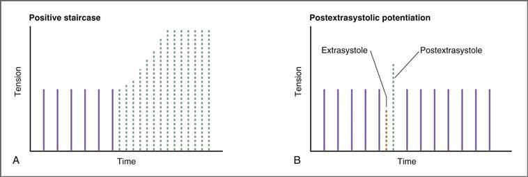

**그림 4–19 심박수가 수축성에 미치는 영향의 예.**
**A,** 포지티브 계단; **B,** 수축기외 강화. 장력은 수축성의 척도로 사용됩니다. 막대의 빈도는 심박수를 나타내고 막대의 높이는 각 비트에서 생성되는 장력을 나타냅니다.

##### *심장배당체가 수축성에 미치는 영향*

강심배당체는 **양성 수축촉진제** 역할을 하는 약물 종류입니다. 이 약물은 디기탈리스 식물 *디기탈리스 퍼푸레아*의 추출물에서 추출됩니다. 원형 약물은 **디곡신**입니다. 이 클래스의 다른 약물에는 디기톡신과 우아바인이 포함됩니다.

강심배당체의 잘 알려진 작용은 Na+-K+ ATPase의 억제입니다. 심근에서 Na+-K+ ATPase의 억제는 [그림 4-20](#filepos677004)에 설명된 대로 심장 배당체의 양성 수축 효과의 기초가 됩니다. 그림에서 원으로 표시된 숫자는 다음 단계와 관련이 있습니다.

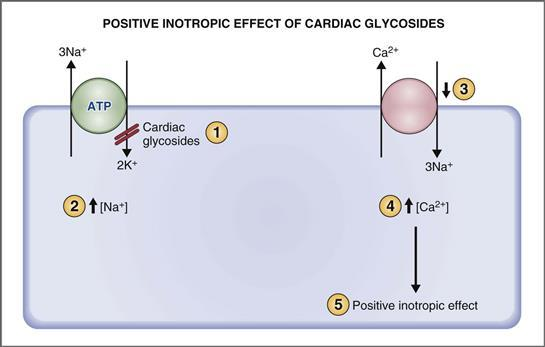

**그림 4–20 강심 배당체의 양성 수축 효과 메커니즘.**
동그라미 숫자에 대한 설명은 텍스트를 참조하세요.

1. Na+-K+ ATPase는 심근세포의 세포막에 위치합니다. 강심배당체는 세포외 K**+**-결합 부위에서 **Na+-K+ ATPase**를 억제합니다.
2. Na+-K+ ATPase가 억제되면 더 적은 양의 Na+가 세포 밖으로 펌핑되어 **세포내 Na+ 농도가 증가합니다.**
3. 세포 내 Na+ 농도의 증가는 심근 세포막을 가로지르는 Na+ 구배를 변경하여 **Ca2+-Na+ 교환기의 기능을 변경합니다.** 이 교환기는 Na+가 전기화학적 구배를 따라 세포 안으로 이동하는 대신 전기화학적 구배에 맞서 Ca2+를 세포 밖으로 펌핑합니다. (Ca2+-Na+ 교환은 심근 세포 활동 전위의 안정기 동안 세포에 들어간 Ca2+를 압출하는 메커니즘 중 하나라는 점을 기억하십시오.) Ca2+*위로* 펌핑하는 에너지는 일반적으로 Na+-K+ ATPase에 의해 유지되는 *아래로* Na+ 구배에서 나옵니다. 세포 내 Na+ 농도가 증가하면 안쪽으로 향하는 Na+ 구배가 감소합니다. 결과적으로 Ca2+-Na+ 교환은 에너지원에 대한 Na+ 기울기에 의존하기 때문에 감소합니다.
4. Ca2+-Na+ 교환기에 의해 세포 밖으로 펌핑되는 Ca2+의 양이 줄어들수록 **세포내 Ca2+ 농도는 증가합니다.**
5. 장력은 세포내 Ca2+ 농도에 정비례하기 때문에 강심배당체는 세포내 Ca2+ 농도를 증가시켜 장력을 증가시킵니다. 즉 **양성 수축 효과**입니다.

강심배당체의 주요 치료 용도는 심실 근육의 수축력 감소(즉, 음성 수축력)가 특징인 상태인 **울혈성 심부전** 치료에 있습니다. 심장의 왼쪽에 부전이 발생하면 좌심실은 수축 시 정상적인 장력을 발달시킬 수 없고 정상적인 박출량을 대동맥으로 방출할 수 없습니다. 심장 오른쪽에 부전이 발생하면 우심실은 정상적인 장력을 발달시킬 수 없고 정상적인 박출량을 폐동맥으로 방출할 수 없습니다. 어느 상황이든 심각하며 잠재적으로 생명을 위협할 수도 있습니다. 심실 세포의 세포내 Ca2+ 농도를 증가시킴으로써, 강심배당체는 양성 수축성 작용을 하며, 이는 실패한 심실의 음성 수축성을 중화할 수 있습니다.

#### 심장 근육의 길이-장력 관계

골격근과 마찬가지로 심근세포에 의해 생성될 수 있는 최대 장력은 휴식 기간에 따라 달라집니다. 길이-장력 관계의 생리학적 기초는 두꺼운 필라멘트와 얇은 필라멘트의 중첩 정도와 교차 다리 형성을 위한 *가능한* 부위의 수라는 점을 상기하십시오. (세포 내 Ca2+ 농도는 이러한 가능한 교차 다리의 어느 부분이 *실제로* 형성되고 순환할지를 결정합니다.) 심근 세포에서 최대 장력 발달은 세포 길이가 약 2.2μm 또는 **Lmax**일 때 발생합니다. 이 길이에서는 두꺼운 필라멘트와 얇은 필라멘트가 최대로 겹칩니다. 더 짧거나 더 긴 셀 길이에서 발생하는 장력은 최대보다 작습니다. 두꺼운 필라멘트와 얇은 필라멘트의 중첩 정도 외에도 심장 근육에는 장력을 변화시키는 두 가지 추가 길이 의존 메커니즘이 있습니다. 근육 길이가 증가하면 트로포닌 C의 Ca2+ 민감도가 증가하고 근육 길이가 증가하면 근형질 세망에서 Ca2+ 방출이 증가합니다.

단일 심근 세포의 길이-장력 관계는 **심실의 길이-장력 관계**로 확장될 수 있습니다. 예를 들어 좌심실을 생각해 보세요. 수축 직전의 단일 좌심실 근육 섬유의 *길이*는 좌심실 확장기말 부피에 해당합니다. 단일 좌심실 근육 섬유의 *장력*은 전체 좌심실에 의해 발생된 장력 또는 압력에 해당합니다. 이러한 대체가 이루어지면 심실 확장기말 용적의 함수로서 수축기 동안 심실 압력을 보여주는 곡선이 개발될 수 있습니다([그림 4-21](#filepos682559)).

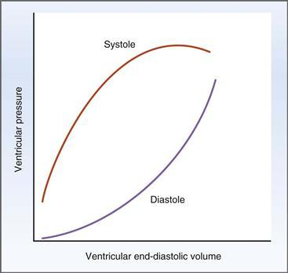

**그림 4–21 수축기 및 확장기 좌심실 압력-용적 곡선.** 수축기 곡선은 이완기말 용적(섬유 길이)의 함수로 활성 압력을 보여줍니다. 확장기 곡선은 확장기말 부피의 함수로서 수동적 압력을 보여줍니다.

**상부 곡선**은 수축기 동안 발생한 심실 압력과 확장기 말기 용적(또는 확장기 말 섬유 길이) 사이의 관계입니다. 이러한 압력 발달은 활성 메커니즘입니다. 곡선의 상승 부분에서는 섬유 길이가 증가함에 따라 압력이 가파르게 증가합니다. 이는 두꺼운 필라멘트와 얇은 필라멘트의 중첩 정도가 커지고 교차 다리 형성 및 순환이 늘어나고 장력이 더 커짐을 반영합니다. 중첩이 최대가 되면 곡선은 결국 수평을 이룹니다. 확장기 말 볼륨이 더 증가하고 섬유가 더 긴 길이로 늘어나면 중첩이 줄어들고 압력이 감소합니다(곡선의 하강 사지). 전체 길이-장력 곡선에 걸쳐 작동하는 골격근과 대조적으로([제1장](CR%21G9RE0KW4PD33Q9F3DXNCSBNXCANP_split_007.html#filepos27757 참조), [Fig. 1-26](CR%21G9RE0KW4PD33Q9F3DXNCSBNXCANP_split_008.html#filepos214851)), 심장 근육은 일반적으로 곡선의 **상승 사지**에서만 작동합니다. 이러한 차이가 나타나는 이유는 심장 근육이 골격근보다 훨씬 더 뻣뻣하기 때문입니다. 따라서 심장 근육은 높은 휴식 장력을 가지며 길이가 조금만 증가하면 휴식 장력이 크게 증가합니다. 이러한 이유로 심장 근육은 길이-장력 곡선의 상승하는 부분에 "고정"되어 Lmax 이상으로 심장 근육 섬유를 늘리는 것이 어렵습니다. 예를 들어, 심장 근육 섬유의 "작동 길이"(확장기 말의 길이)는 1.9μm(<Lmax, 2.2μm)입니다. 심실의 수축기 압력-용적(즉, 길이-장력) 관계는 심장의 **프랭크-스탈링 관계**의 기초입니다.

**하부 곡선**은 심장이 수축하지 않는 확장기 동안 심실 압력과 심실 용적 사이의 관계입니다. 확장기말 부피가 증가함에 따라 수동 메커니즘을 통해 심실 압력이 증가합니다. 심실의 압력 증가는 근육 섬유가 더 긴 길이로 늘어남에 따라 근육 섬유의 장력이 증가함을 반영합니다.

"예압"과 "애프터로드"라는 용어는 골격근에 적용되는 것처럼 심장 근육에도 적용될 수 있습니다.

 좌심실에 대한 **예압**은 **좌심실 확장기말 용적** 또는 확장기말 섬유 길이입니다. 즉, 예압은 근육이 수축하는 휴식 길이입니다. [그림 4-21](#filepos682559)의 위쪽(수축기) 곡선에 표시된 예비하중과 전개된 장력 또는 압력 사이의 관계는 두꺼운 필라멘트와 얇은 필라멘트의 중첩 정도를 기반으로 합니다.

 좌심실에 대한 **애프터로드**는 **대동맥압**입니다. 심근의 단축 속도는 애프터로드가 0일 때 최대이고, 애프터로드가 증가할수록 단축 속도는 감소합니다. (발현된 심실 압력과 대동맥 압력 또는 후부하 사이의 관계는 심실 압력-용적 루프 섹션에서 더 자세히 논의됩니다.)

#### 뇌졸중량, 박출률 및 심박출량

심실의 기능은 다음 세 가지 매개변수로 설명됩니다. (1) **박출량**은 각 박동 시 심실에서 분출되는 혈액의 양입니다. (2) **박출률**은 심실 효율의 척도인 각 박출량에서 방출된 확장기말 부피의 비율입니다. (3) **심박출량**은 단위 시간당 심실에서 분출되는 총 부피입니다.

##### *스트로크 볼륨*

한번의 심실 수축으로 분출되는 혈액의 양이 박출량입니다. 박출량은 *박출 전* 심실의 혈액량(이완기말 부피)과 *박출 후* 심실에 남아 있는 혈액량(수축기말 부피)의 차이입니다. 일반적으로 스트로크 볼륨은 약 **70mL**입니다. 따라서,

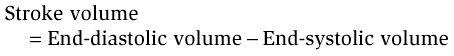

어디서

|  |  |
| --- | --- |
| 스트로크 볼륨 | = 한 박자에 분출되는 볼륨(mL) |
| 확장기말 볼륨 | = 박출 전 심실의 부피(mL) |
| 수축기말 용량 | = 방출 후 심실의 부피(mL) |

##### *배출 비율*

혈액을 토출할 때 심실의 효율성은 *1회 박출량에서 토출되는 확장기 말 부피의 비율인 박출률로 설명됩니다.* 일반적으로 박출률은 약 **0.55 또는 55%입니다.** 박출률은 **수축성**을 나타냅니다. 박출률의 증가는 수축성의 증가를 반영하고 박출률의 감소는 수축성의 감소를 반영합니다. 따라서,

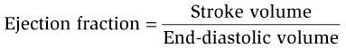

##### *심박출량*

단위 시간당 분출되는 혈액의 총량을 심박출량이라고 합니다. 따라서 심박출량은 단일 박동에 분출되는 양(박출량)과 분당 박동수(심박수)에 따라 달라집니다. 심장박출량은 70kg 남성의 경우 약 **5000mL/분**입니다(일회박출량 70mL 및 심박수 72회/분 기준). 따라서,

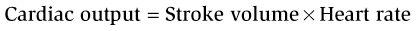

어디서

|  |  |
| --- | --- |
| 심박출량 | = 분당 분출된 부피(mL/min) |
| 스트로크 볼륨 | = 한 비트에 분출된 볼륨(mL) |
| 심박수 | = 분당 비트수(비트/분) |

**예제 문제.** 한 남성의 확장기 기량은 140mL, 수축기 기량은 70mL, 심박수는 분당 75회입니다. *박출량, 심박출량, 박출률은 얼마입니까?*

**해결책.** 이러한 계산은 기본적이고 중요합니다. 박출량은 단일 박동 시 심실에서 분출되는 양입니다. 따라서 이는 수축 전과 후의 심실 용적의 차이입니다. 심박출량은 박출량에 심박수를 곱한 값입니다. 박출률은 혈액을 배출하는 심실의 효율이며 박출량을 이완기말 부피로 나눈 값입니다.

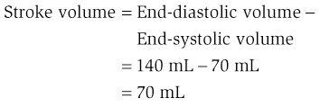

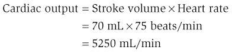

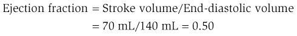

#### 프랭크-스탈링 관계

심실 수축기의 길이-장력 관계는 이미 설명되었습니다. 이제 이 관계는 박출량, 박출률, 심박출량 등의 매개변수를 사용하여 이해할 수 있습니다.

독일의 생리학자인 Otto Frank는 수축기 동안 개구리 심실에서 발생한 압력과 수축기 직전에 심실에 존재하는 용적 사이의 관계를 처음으로 설명했습니다. Frank의 관찰을 바탕으로 영국의 생리학자인 Ernest Starling은 분리된 개의 심장에서 수축기에서 방출되는 심실의 용적이 확장기말 용적에 의해 결정된다는 것을 입증했습니다. 이 관계의 기본 원리는 심장 근육 섬유의 길이-장력 관계라는 점을 상기하십시오.

Frank-Starling의 심장 법칙 또는 **Frank-Starling 관계**는 이러한 획기적인 실험을 기반으로 합니다. *심실에서 분출되는 혈액량은 확장기 말기에 심실에 존재하는 혈액량에 따라 달라집니다.* 확장기 말기에 존재하는 혈액량은 심장으로 되돌아가는 혈액량, 즉 정맥 환류량에 따라 달라집니다. 그러므로 일회박출량과 심박출량은 이완기말 부피와 직접적인 상관관계가 있으며, 이는 정맥환류량과 상관관계가 있습니다. Frank-Starling 관계는 정상적인 심실 기능을 제어하고 심장이 수축기에서 *분출*하는 용적과 정맥 환류에서 *받는* 용적을 동일하게 보장합니다. 정상 상태에서 **심장 박출량은 정맥 환류와 동일**하다는 이전 논의를 상기해 보십시오. 이러한 평등을 뒷받침하고 보장하는 것은 프랭크-스탈링의 심장 법칙입니다.

Frank-Starling 관계는 [그림 4-22](#filepos693872)와 같다. 심박출량과 박출량은 심실 확장기말 부피 또는 우심방압의 함수로 표시됩니다. (두 매개변수 모두 정맥 환류와 관련되어 있기 때문에 우심방 압력은 확장기말 용적을 대체할 수 있습니다.) 박출량 또는 심박출량과 심실 확장기말 용적 사이에는 곡선 관계가 있습니다. 정맥 환류가 증가함에 따라 확장기말 부피가 증가하고 심실의 길이-장력 관계로 인해 박출량도 그에 따라 증가합니다. 생리학적 범위에서 박출량과 이완기말 부피 사이의 관계는 거의 선형입니다. 확장기 말기 용적이 높아질 때만 곡선이 구부러지기 시작합니다. 이렇게 높은 수준에서 심실은 한계에 도달하고 단순히 정맥 환류를 "따라갈" 수 없습니다.

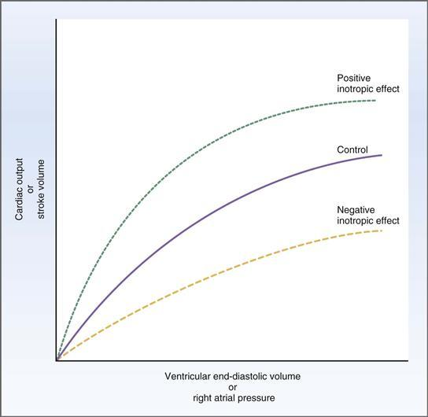

**그림 4–22 심장의 Frank-Starling 관계.** 양성 및 음성 수축촉진제의 효과는 정상적인 Frank-Starling 관계와 관련하여 표시됩니다.

또한 [그림 4-22](#filepos693872)에는 수축성 변화가 Frank-Starling 관계에 미치는 영향이 나와 있습니다. 수축성을 증가시키는 약물은 **양성 수축 효과**(*가장 높은 곡선*)를 나타냅니다. 양성 수축촉진제(예: 디곡신)는 주어진 이완기말 부피에 대해 박출량과 심박출량을 증가시킵니다. 그 결과 박동당 이완기 말기 용적의 더 많은 부분이 박출되고 박출 비율이 증가합니다.

수축성을 감소시키는 약물은 **음성 수축 효과**(*가장 낮은 곡선*)를 나타냅니다. 음성 수축촉진제는 주어진 이완기말 부피에 대해 박출량과 심박출량을 감소시킵니다. 그 결과 박동당 박출되는 이완기 용량의 일부가 줄어들고 박출률도 감소합니다.

#### 심실 압력-용적 루프

##### *정상 심실압력-용적 루프*

좌심실의 기능은 [그림 4-21](#filepos682559)의 두 가지 압력-용적 관계를 결합하여 전체 심장 주기(이완기 + 수축기)에 걸쳐 관찰할 수 있습니다. 이 두 개의 압력-용적 곡선을 연결하면 소위 **심실 압력-용적 루프**를 구성할 수 있습니다([그림 4-23](#filepos696736)). [그림 4-21](#filepos682559)의 수축기 혈압-용적 관계는 주어진 심실 용적에 대해 최대 발생 심실 압력을 보여줍니다. 이해를 돕기 위해 수축기 압력-용적 곡선의 일부가 심실 압력-용적 루프에 금색 점선으로 겹쳐져 있습니다. 점선은 수축기 동안(즉, 심실이 수축할 때) 주어진 심실 용적에 대해 개발될 수 있는 최대 가능한 압력을 보여줍니다. 압력-체적 루프의 지점 3은 수축기 압력-체적 곡선(*점선*)에 닿습니다. 또한 지점 4와 1 사이의 루프 부분이 [그림 4-21](#filepos682559)의 확장기 압력-체적 곡선의 일부에 해당하는지 명확하지 않을 수 있습니다.

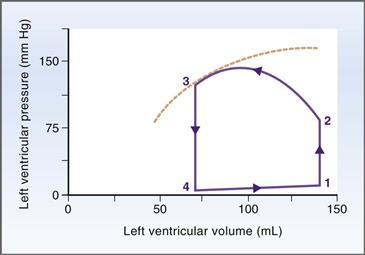

**그림 4–23 좌심실 압력-용적 루프.** 하나의 완전한 좌심실 주기가 표시됩니다. (자세한 설명은 본문을 참조하세요.) *점선*은 [그림 4-21](#filepos682559)의 수축기 혈압-체적 곡선의 일부를 보여줍니다.

심실 압력-용적 루프는 심실 수축, 박출, 이완 및 재충전의 완전한 한 주기를 다음과 같이 설명합니다.

 **등용적 수축(1 → 2).** 확장기 끝을 표시하는 지점 1에서 주기를 시작합니다. 좌심실은 좌심방의 혈액으로 채워져 있으며 그 부피는 확장기말 부피 140mL이다. 심실 근육이 이완되기 때문에 해당 압력은 매우 낮습니다. 이 시점에서 심실이 활성화되고 수축하며 심실 압력이 극적으로 증가합니다. 모든 판막이 닫혀 있기 때문에 좌심실에서 혈액이 배출될 수 없으며, 심실 압력이 상당히 높아지더라도 심실 용적은 일정합니다(점 2). 따라서 주기의 이 단계를 *등체적* 수축이라고 합니다.

 **심실 박출(2 → 3).** 지점 2에서는 좌심실 압력이 대동맥 압력보다 높아져 대동맥 판막이 열립니다. (점 2의 압력이 금색 점선으로 표시된 수축기 혈압-체적 곡선에 도달하지 않는 이유가 궁금할 수 있습니다. 간단한 이유는 *꼭 그럴 필요는 없습니다*입니다. 점 2의 압력은 대동맥 압력에 의해 결정됩니다. 심실 압력이 대동맥 압력 값에 도달하면 대동맥 판막이 열리고 나머지 수축량은 열린 대동맥 판막을 통해 박출량을 배출하는 데 사용됩니다.) 판막이 열리면 혈액이 빠르게 분출되어 구동됩니다. 좌심실과 대동맥 사이의 압력 구배에 의해. 이 단계에서는 심실이 여전히 수축하고 있기 때문에 좌심실 압력은 높게 유지됩니다. 그러나 혈액이 대동맥으로 분출됨에 따라 심실 용적은 급격히 감소합니다. 지점 3에서 심실에 남아 있는 부피는 수축기말 부피인 70mL입니다. **압력-용량 루프의 폭**은 분출되는 혈액량 또는 **박출량**입니다. 이 심실 주기의 박출량은 70mL(140mL − 70mL)입니다.

 **등용적 이완(3 → 4).** 지점 3에서 수축기가 끝나고 심실이 이완됩니다. 심실압력은 대동맥압 이하로 감소하고 대동맥판은 닫힙니다. 이 단계에서 심실 압력은 급격히 감소하지만 모든 판막이 다시 닫히기 때문에 심실 용적은 수축기 말기 값 70mL에서 일정하게(*등용적*) 유지됩니다.

 **심실 충만(4 → 1).** 지점 4에서 심실 압력이 이제 좌심방 압력보다 낮은 수준으로 떨어져 승모판(AV)이 열렸습니다. 좌심실은 다음 주기의 심방 수축의 결과로 수동적으로나 적극적으로 좌심방의 혈액으로 채워집니다. 좌심실 용적은 확장기말 용적 140mL로 다시 증가합니다. 이 마지막 단계에서는 심실 근육이 이완되고 순응성 심실이 혈액으로 채워짐에 따라 압력이 약간만 증가합니다.

##### *심실 압력-용적 루프의 변화*

심실 압력-용적 루프를 사용하면 예압 변화(예: 정맥 환류 또는 확장기 용적 변화), 후부하 변화(예: 대동맥압 변화) 또는 수축력 변화([그림 4-24](#filepos703915))의 효과를 시각화할 수 있습니다. 실선은 단일의 정상적인 심실 주기를 나타내며 [그림 4-23](#filepos696736)에 표시된 압력-용량 루프와 동일합니다. 점선은 단일 심실 주기에 대한 다양한 변화의 효과를 보여줍니다(그러나 나중에 발생할 수 있는 보상 반응은 포함되지 않습니다).

 [그림 4-24*A*](#filepos703915)는 심실 주기에 **예압 증가**가 미치는 영향을 보여줍니다. 사전 하중은 확장기말 용적이라는 점을 상기하십시오. 이 예에서는 정맥 환류가 증가하여 이완기말 부피가 증가하므로 예압이 증가합니다(점 1). 애프터로드와 수축성은 일정하게 유지됩니다. 심실이 수축, 방출, 이완 및 재충전의 주기를 통해 진행됨에 따라 이러한 예압 증가의 효과를 평가할 수 있습니다. 즉, 압력-용량 루프의 폭으로 측정되는 박출량이 증가합니다. 이 **박출량 증가**는 Frank-Starling 관계에 기초합니다. 이 관계는 확장기 말기 볼륨(확장기 섬유 길이)이 클수록 수축기에서 분출되는 박출량도 더 크다는 것을 나타냅니다.

 [그림 4-24*B*](#filepos703915)는 **애프터로드 증가** 또는 대동맥 압력 증가가 심실 주기에 미치는 영향을 보여줍니다. 이 예에서 좌심실은 정상보다 더 큰 압력에 맞서 혈액을 분출해야 합니다. 혈액을 배출하려면 등용적 수축(점 2) 및 심실 박출(즉, 2 → 3) 동안 심실 압력이 정상 수준보다 높아야 합니다. 후부하가 증가하면 수축기 동안 심실에서 방출되는 혈액의 양이 줄어듭니다. 따라서 **박출량은 감소하고** 수축기 말에 심실에 더 많은 혈액이 남아 있으며 **수축기말 부피는 증가합니다.** 다음과 같이 증가된 후부하의 효과를 상상할 수 있습니다. 더 높은 후부하와 일치하도록 등용적 수축에서 수축의 더 많은 부분이 "사용"되면 "남은" 수축이 적어 박출량 방출에 사용할 수 있습니다.

 [그림 4-24*C*](#filepos703915)는 심실주기에 대한 **수축성 증가**의 효과를 보여줍니다. 수축성이 증가하면 심실은 수축기 동안 더 큰 장력과 압력을 발생시켜 정상보다 더 많은 양의 혈액을 분출할 수 있습니다. **스트로크 볼륨이 증가합니다**, 배출 비율도 마찬가지입니다. 수축기가 끝날 때 심실에 남아 있는 혈액의 양이 줄어들고 결과적으로 **수축기말 부피가 감소합니다**(포인트 3 및 4).

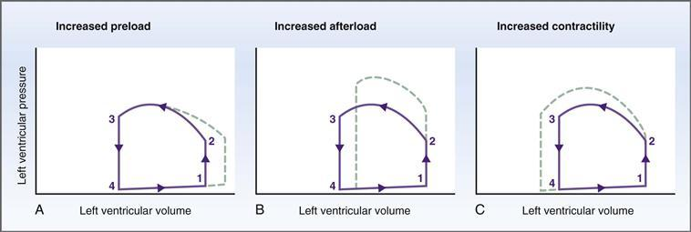

**그림 4–24 좌심실 압력-용적 루프의 변화.**
**A,** 예압 증가; **B,** 애프터로드 증가; **C,** 수축력이 증가했습니다. 정상적인 심실 주기는 *실선*으로 표시되며, 변화의 효과는 *점선*으로 표시됩니다.

#### 심장 활동

일은 힘과 거리의 곱으로 정의됩니다. 심근 기능 측면에서 "작업"은 **뇌졸중 작업** 또는 각 박동 시 심장이 수행하는 작업입니다. 좌심실의 경우 박동량은 박출량에 대동맥 압력을 곱한 값입니다. 여기서 대동맥 압력은 힘에 해당하고 박출량은 거리에 해당합니다. 좌심실의 작용은 [그림 4-23]에 예시된 루프와 같이 압력-용적 루프 내의 영역으로도 생각될 수 있습니다(#filepos696736)

분 일 또는 전력은 단위 시간당 일로 정의됩니다. 심근 기능 측면에서 **심장 분당 작업**은 심박출량에 대동맥 압력을 곱한 값입니다. 따라서 심장 분당 작업은 **체적 작업**(즉, 심박출량)과 **압력 작업**(즉, 대동맥압)의 두 가지 구성 요소로 간주될 수 있습니다.

때때로 체적일 성분을 "외부" 일이라고 하고, 압력일 성분을 "내부" 일이라고 합니다. 따라서 심박출량의 증가(박출량 증가 및/또는 심박수 증가로 인해) *또는 대동맥압 증가는 심장 활동을 증가시킵니다.

##### *심근 산소 소비량*

심근 O2 소비는 심장의 분당 작업과 직접적인 상관 관계가 있습니다. 심장 분당 작업의 두 가지 구성 요소 중 O2 소비 측면에서 *압박 작업은 볼륨 작업보다 비용이 훨씬 더 많이 듭니다.* 즉, 압력 작업은 전체 심장 작업의 큰 부분을 차지하고 볼륨 작업은 작은 비율을 차지합니다. 이러한 관찰은 전체 심근 O2 소비가 심박출량과 낮은 상관관계를 갖는 이유를 설명합니다. O2 소비의 가장 큰 비율은 심박출량이 아닌 압력 작업(또는 내부 작업)에 대한 것입니다.

또한 전체 심장 작업 중 정상보다 더 큰 비율이 압력 작업인 조건에서는 O2 소비 측면에서 비용이 증가한다는 결론을 내릴 수 있습니다. 예를 들어, **대동맥 협착증**에서는 협착된 대동맥 판막을 통해 혈액을 펌핑하기 위해 좌심실이 극도로 높은 압력을 발생시켜야 하기 때문에 심근 O2 소비가 크게 증가합니다(실제로 심박출량은 감소하더라도).

반면, 심박출량이 매우 높아지는 **격렬한 운동** 중에는 볼륨 운동이 전체 심장 활동 중 정상보다 더 큰 비율(최대 50%)을 차지합니다. Although myocardial O2 consumption increases during exercise, it does not increase as much as when pressure work increases.

압력 작업으로 인한 더 큰 O2 소비의 또 다른 결과는 *좌심실이 우심실보다 더 열심히 일해야 한다는 것입니다.* 심박출량은 심장 양쪽에서 동일하지만 평균 대동맥 압력(100mmHg)은 평균 폐동맥 압력(15mmHg)보다 훨씬 높습니다. Thus, the pressure work of the left ventricle is much greater than the pressure work of the right ventricle, although the volume work is the same. 실제로 좌심실 벽은 더 많은 압력 작업을 수행하기 위한 보상 메커니즘으로 우심실 벽보다 두껍습니다.

**전신성 고혈압**(전신 순환계의 동맥압 상승)과 같은 병리학적 상태에서 좌심실은 평소보다 더 많은 압력 작업을 수행해야 합니다. 대동맥 압력이 상승하기 때문에 증가된 작업량에 대한 보상으로 좌심실 벽이 비대해집니다(두꺼워집니다).

정상적인 좌심실 벽의 더 두꺼운 두께와 전신성 고혈압에서 좌심실 벽의 보상성 비대는 더 많은 압력 작업을 수행하기 위한 적응 메커니즘입니다. 이러한 적응 메커니즘은 **라플라스의 법칙**으로 설명됩니다. 구(즉, 심장의 대략적인 모양)에 대한 라플라스의 법칙은 압력이 장력 및 벽 두께와 직접적인 상관관계가 있고 반경과 반비례한다는 것을 나타냅니다. 따라서,

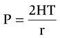

어디서

|  |  |
| --- | --- |
| 피 | = 압력 |
| H | = 두께(높이) |
| 티 | = 긴장 |
| r | = 반경 |

즉, 구에 대한 라플라스의 법칙은 구의 벽(예: 좌심실)이 두꺼울수록 전개될 수 있는 압력도 더 커진다는 것입니다. 이 점을 설명하면, 좌심실이 혈액을 내보내려면 더 큰 압력을 발생시켜야 하기 때문에 좌심실 벽은 우심실 벽보다 두껍습니다.

심실이 증가된 대동맥압(예: 고혈압)에 맞서 펌프질을 해야 한다면 보상 메커니즘으로 심실 벽 두께가 증가할 것이라는 결론을 내릴 수 있습니다. 따라서 전신성 고혈압에서는 좌심실 비대가 발생합니다. 폐고혈압에서는 우심실이 비대해집니다. 불행하게도 이러한 유형의 보상성 심실 비대 역시 심실 부전으로 이어질 수 있으며, 결국에는 해롭거나 심지어 치명적일 수도 있습니다.