# 5 Respiratory Physiology

xml 버전='1.0' 인코딩='utf-8'?

생리학

## *호흡기 생리학*

> [호흡기의 구조](#filepos889636)

> [폐량 및 용량](#filepos896826)

> [호흡의 역학](#filepos938626)

> [가스교환](#filepos988703)

> [혈액 내 산소 수송](CR%21G9RE0KW4PD33Q9F3DXNCSBNXCANP_split_014.html#filepos1031473)

> [혈액 내 이산화탄소 수송](CR%21G9RE0KW4PD33Q9F3DXNCSBNXCANP_split_014.html#filepos1073012)

> [환기/관류 관계](CR%21G9RE0KW4PD33Q9F3DXNCSBNXCANP_split_014.html#filepos1082028)

> [호흡 제어](CR%21G9RE0KW4PD33Q9F3DXNCSBNXCANP_split_014.html#filepos1112113)

> [통합기능](CR%21G9RE0KW4PD33Q9F3DXNCSBNXCANP_split_014.html#filepos1128323)

> [저산소혈증 및 저산소증](CR%21G9RE0KW4PD33Q9F3DXNCSBNXCANP_split_014.html#filepos1151810)

> [요약](CR%21G9RE0KW4PD33Q9F3DXNCSBNXCANP_split_014.html#filepos1164786)

> [도전해보세요](CR%21G9RE0KW4PD33Q9F3DXNCSBNXCANP_split_014.html#filepos1172753)

호흡계의 기능은 환경과 신체 세포 사이에서 산소와 이산화탄소를 교환하는 것입니다. 호흡 주기의 흡기 단계 동안 신선한 공기가 폐로 유입되고, 흡기 공기와 폐 모세혈관 사이에서 산소와 이산화탄소가 교환된 다음 공기가 호기됩니다.

### 호흡계의 구조

#### 항공

호흡계에는 폐와 폐를 외부 환경에 연결하는 일련의 기도가 포함됩니다. 호흡계의 구조는 폐 안팎으로 공기를 가져오는 **전도 구역**(또는 전도 기도)과 가스 교환이 일어나는 폐포로 둘러싸인 **호흡 구역**으로 세분화됩니다. 전도성 영역과 호흡 영역의 기능이 다르며, 이를 둘러싸고 있는 구조도 다릅니다([그림 5-1](#filepos890421)).

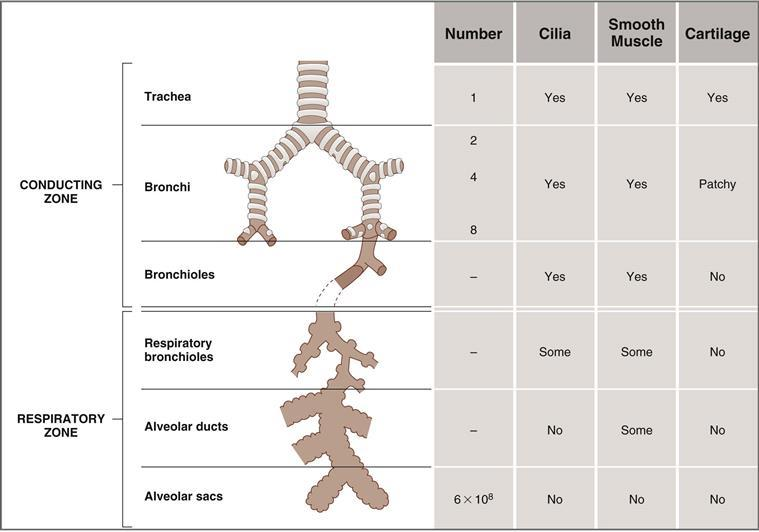

**그림 5–1 기도의 구조.** 두 개의 폐에 대한 다양한 구조의 수가 보고되어 있습니다.

##### *전도 구역*

전도 구역에는 코, 비인두, 후두, 기관, 기관지, 세기관지 및 말단 세기관지가 포함됩니다. 이러한 구조는 가스 교환을 위해 호흡 영역 안팎으로 공기를 가져오고 공기가 중요한 가스 교환 영역에 도달하기 전에 공기를 따뜻하게 하고 가습하고 필터링하는 기능을 합니다.

기관은 주요 전도 기도이다. 기관은 두 개의 기관지로 나누어지며, 하나는 각 폐로 이어지며, 이 기관지는 두 개의 더 작은 기관지로 나누어지고 다시 나누어집니다. 궁극적으로 점점 더 작아지는 기도로 23개의 분할이 있습니다.

전도성 기도에는 흡입된 입자를 제거하는 역할을 하는 점액 분비 세포와 섬모 세포가 늘어서 있습니다. 큰 입자는 일반적으로 코에서 걸러지지만, 작은 입자는 기도로 들어갈 수 있으며, 그곳에서 점액에 포획되어 섬모의 리드미컬한 박동에 의해 위쪽으로 쓸려갑니다.

전도성 기도의 벽에는 **평활근**이 포함되어 있습니다. 이 평활근에는 기도 직경에 반대 효과를 갖는 교감 및 부교감 신경 분포가 있습니다. (1) 교감 아드레날린성 뉴런은 기관지 평활근의 **β2 수용체**를 활성화하여 기도의 이완과 **확장**을 유도합니다. 또한, 더 중요한 것은 이러한 β2 수용체가 부신 수질에서 방출된 순환 에피네프린과 이소프로테레놀과 같은 β2-아드레날린 작용제에 의해 활성화된다는 것입니다. (2) 부교감신경 콜린성 뉴런은 **무스카린성 수용체**를 활성화하여 기도의 수축과 **수축**을 유발합니다.

전도성 기도의 직경이 변하면 저항도 변하고, 이로 인해 공기 흐름도 변하게 됩니다. 따라서 자율신경계가 기도 직경에 미치는 영향은 기도 저항과 기류에 예측 가능한 영향을 미칩니다. 가장 주목할만한 효과는 **천식** 치료에서 기도를 확장하는 데 사용되는 β**2**-아드레날린 작용제(예: 에피네프린, 이소프로테레놀, 알부테롤)의 효과입니다.

##### *호흡기 구역*

호흡 구역에는 폐포가 늘어서 있는 구조가 포함되어 있으므로 **가스 교환:** 호흡 기관지, 폐포관 및 폐포낭에 참여합니다. **호흡 기관지**는 과도기 구조입니다. 전도성 기도와 마찬가지로 섬모와 평활근이 있지만 폐포가 때때로 벽에서 자라기 때문에 가스 교환 영역의 일부로 간주됩니다. **폐포관**은 완전히 폐포로 둘러싸여 있지만 섬모와 평활근은 거의 없습니다. 폐포관은 **폐포낭**에서 끝나며, 이 주머니에도 폐포가 늘어서 있습니다.

**폐포**는 호흡 세기관지, 폐포관 및 폐포낭 벽의 주머니 모양의 분비물입니다. 각 폐에는 총 약 3억 개의 폐포가 있습니다. 각 폐포의 직경은 약 200μm입니다. 폐포 가스와 폐모세혈관 혈액 사이의 산소(O2)와 이산화탄소(CO2) 교환은 폐포 벽이 얇고 확산을 위한 **표면적**이 크기 때문에 폐포 전체에서 빠르고 효율적으로 발생할 수 있습니다.

폐포 벽은 탄력 있는 섬유로 둘러싸여 있으며 제1형 및 제2형 폐포 세포(또는 폐포 세포)라고 불리는 상피 세포로 둘러싸여 있습니다. **제2형 폐세포**는 **폐 표면활성제**(폐포의 표면장력 감소에 필요)를 합성하며 제1형 및 제2형 폐세포에 대한 재생 능력을 가지고 있습니다.

폐포에는 **폐포 대식세포**라고 불리는 식세포가 포함되어 있습니다. 폐포 대식세포는 폐포에 먼지와 잔해물이 없도록 유지합니다. 폐포에는 이 기능을 수행하는 섬모가 없기 때문입니다. 대식세포는 잔해로 가득 차서 세기관지로 이동하고, 여기서 박동하는 섬모는 잔해를 상기도와 인두로 운반하여 삼키거나 뱉어낼 수 있습니다.

#### 폐혈류

폐혈류는 오른쪽 심장의 심장 박출량입니다. 우심실에서 분출되어 폐동맥을 통해 폐로 전달됩니다([4장 참조](CR%21G9RE0KW4PD33Q9F3DXNCSBNXCANP_split_011.html#filepos530928), [Fig. 4-1](CR%21G9RE0KW4PD33Q9F3DXNCSBNXCANP_split_011.html#filepos534811)). 폐동맥은 점점 더 작은 동맥으로 갈라지며 기관지와 함께 호흡 구역을 향해 이동합니다. 가장 작은 동맥은 세동맥으로 나누어진 다음 폐모세혈관으로 나누어져 폐포 주위에 조밀한 네트워크를 형성합니다.

**중력 효과**로 인해 폐혈류가 폐에 고르게 분포되지 않습니다. 사람이 서 있을 때 혈류는 폐 꼭대기(상부)에서 가장 낮고 폐 기저부(하부)에서 가장 높습니다. 사람이 바로 누우면(누운 자세) 이러한 중력 효과가 사라집니다. 혈류의 지역적 변화의 생리학적 중요성은 이 장의 뒷부분에서 논의됩니다.

다른 기관과 마찬가지로 **폐혈류의 조절**은 폐세동맥의 저항을 변경하여 이루어집니다. 폐동맥 저항의 변화는 주로 O2와 같은 국소적 요인에 의해 제어됩니다.

**기관지 순환**은 전도성 기도(가스 교환에 참여하지 않음)로의 혈액 공급이며 전체 폐혈류의 매우 작은 부분입니다.

### 폐 용적 및 용량

#### 폐량

폐의 정적 용적은 **폐활량계**를 사용하여 측정합니다([표 5-1](#filepos897400)). 일반적으로 피험자는 앉아서 폐활량계 안팎으로 숨을 쉬며 종을 움직입니다. 변위된 부피는 보정된 종이에 기록됩니다([그림 5-2](#filepos906685)).

표 5-1 호흡 생리학과 관련된 약어 및 정상 값

|  |  |  |
| --- | --- | --- |
| **약어** | **의미** | **정상값** |
| 피 | Gas pressure or partial pressure |  |
| 이미지 | 혈액의 흐름 |  |
| 뷔 | 가스량 |  |
| 이미지 | 가스 유량 |  |
| F | 가스의 분수 농도 |  |
| A | 폐포 가스 |  |
| | 동맥혈 |  |
| 뷔 | 정맥혈 |  |
| 전자 | 만료된 가스 |  |
| 나는 | 영감을 받은 가스 |  |
| 엘 | 경폐 |  |
| TM | 경벽 |  |
| 동맥혈 |  |  |
| 이미지 | 동맥혈의 O2 부분압 | 100mmHg |
| 이미지 | 동맥혈의 CO2 부분압 | 40mmHg |
| 혼합 정맥혈 |  |  |
| 이미지 | 정맥혈의 O2 부분압 | 40mmHg |
| 이미지 | 정맥혈의 CO2 부분압 | 46mmHg |
| 영감받은 공기 |  |  |
| 이미지 | 건조한 흡기 공기의 O2 부분압 | 160mmHg |
| 이미지 | 건조한 흡기 공기의 CO2 부분압 | 0mmHg |
| 폐포 공기 |  |  |
| 이미지 | 폐포 공기의 O2 부분압 | 100mmHg |
| 이미지 | 폐포 공기의 CO2 부분압 | 40mmHg |
| 호흡량 및 호흡수 |  |  |
| TLC | 총 폐활량 | 6.0L |
| FRC | 기능적 잔여 용량 | 2.4L |
| VC | 폐활량 | 4.7L |
| 버몬트 | 조수량 | 0.5L |
| 이미지 | 폐포 환기 | — |
| — | 호흡률 | 분당 15회 호흡 |
| 비디오 | 생리적 사강 | 0.15L |
| FVC | 강제 폐활량 | 4.7L |
| FEV1 | 강제 폐활량이 1초 만에 만료됨 | — |
| 상수 |  |  |
| Patm 또는 PB | 대기(기압) 압력 | 760mmHg(해수면) |
| PH2o | 수증기압 | 47mmHg(37°C) |
| STPD | 표준온도, 압력, 건조 | 273K, 760mmHg |
| BPS | 체온, 압력, 포화 | 310K, 760mmHg, 47mmHg |
| — | 혈액 내 O2 용해도 | 0.003mL O2/100mL 혈액/mmHg |
| — | 혈액 내 CO2 용해도 | 0.07mL CO2/100mL 혈액/mmHg |
| 기타 가치 |  |  |
| — | 헤모글로빈 농도 | 15g/100mL 혈액 |
| — | 헤모글로빈의 O2 결합 능력 | 1.34 mL O2/g hemoglobin |
| 이미지 | O2 소비 | 250mL/분 |
| 이미지 | CO2 생산 | 200mL/분 |
| R | 호흡교환지수(CO2생산/O2소비) | 0.8 |

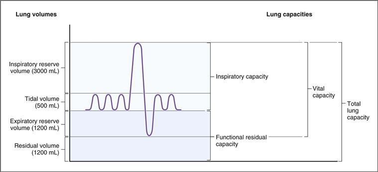

**그림 5–2 폐용적 및 용량.** 폐용적 및 용량은 폐활량 측정법으로 측정합니다. 폐활량 측정으로는 잔여량을 측정할 수 없습니다.

먼저, 피험자에게 조용히 숨을 쉬도록 요청합니다. 정상적이고 조용한 호흡에는 **일회 호흡량**(**VT**)의 흡기 및 호기가 포함됩니다. 정상적인 일회 호흡량은 약 500mL이며 여기에는 폐포를 채우는 공기의 양과 *기도를 채우는 공기의 양이 포함됩니다.

다음으로, 피험자는 최대한 흡기를 취하고 최대한 숨을 내쉬도록 요청받습니다. 이 방법을 사용하면 추가 폐량이 드러납니다. 일회 호흡량 *이상* 흡기될 수 있는 추가 흡기량을 **흡기 예비량**이라고 하며 이는 약 3000mL입니다. 일회 호흡량 *미만*에 호기될 수 있는 추가 용량을 **호기 예비 용량**이라고 하며 이는 약 1200mL입니다.

최대 강제 호기 후 폐에 남아 있는 가스의 부피는 **잔기 부피**(**RV**)**입니다. 이는 약 1200mL이며 폐활량 측정법으로 측정할 수 없습니다.

#### 폐활량

이러한 폐용적 외에도 여러 가지 **폐용적**이 있습니다. 각 폐용적에는 2개 이상의 폐용적이 포함됩니다. **흡기 용량**(**IC**)은 일회 호흡량과 예비 흡기량으로 구성되며 약 3,500mL(500mL + 3000mL)입니다. **기능적 잔기 용량**(**FRC**)은 호기 예비량(ERV)에 잔기량을 더한 값, 즉 약 2400mL(1200mL + 1200mL)로 구성됩니다. FRC는 정상적인 일회 호흡량이 만료된 후 폐에 남아 있는 용적이며 폐의 **평형 용적**으로 생각할 수 있습니다. **폐활량**(**VC**)은 흡기 용량에 호기 예비량을 더한 값, 즉 약 4700mL(3500mL + 1200mL)로 구성됩니다. 폐활량은 최대 흡기 후 만료될 수 있는 양입니다. 그 가치는 신체 크기, 남성 성별, 신체적 조건에 따라 증가하고 나이가 들수록 감소합니다. 마지막으로, 용어에서 알 수 있듯이 **총 폐활량**(**TLC**)에는 모든 폐용적이 포함됩니다. 이는 폐활량에 잔량을 더한 값, 즉 5900mL(4700mL + 1200mL)입니다.

잔량은 폐활량 측정법으로 측정할 수 없기 때문에 잔량을 *포함*하는 폐활량도 폐활량 측정법(예: FRC 및 TLC)으로 측정할 수 없습니다. 폐활량측정법으로 측정할 수 *없는* 폐활량 중에서 FRC(정상 호기 후 폐에 남아 있는 부피)는 폐의 휴식기 또는 평형 부피이기 때문에 가장 큰 관심을 끌고 있습니다.

**FRC:** 헬륨 희석과 신체 혈량측정을 측정하는 데는 두 가지 방법이 사용됩니다.

 **헬륨 희석** 방법에서 피험자는 폐활량계에 추가된 알려진 양의 헬륨을 호흡합니다. 헬륨은 혈액에 용해되지 않기 때문에 몇 번 호흡하면 폐의 헬륨 농도가 폐활량계의 농도와 동일해지며 이를 측정할 수 있습니다. 폐활량계에 추가된 헬륨의 양과 폐 내 농도는 폐용적을 "역계산"하는 데 사용됩니다. 정상적인 일회 호흡량이 만료된 후에 이 측정을 수행하는 경우 계산되는 폐용적은 FRC입니다.

 **신체 혈량측정기**는 보일의 법칙의 변형을 사용합니다. 이는 일정한 온도의 기체에 대해 기체 압력에 기체 부피를 곱한 값이 일정하다는 것입니다(P × V = 일정). 따라서 부피가 증가하면 압력은 감소해야 하고, 부피가 감소하면 압력은 증가해야 합니다. FRC를 측정하기 위해 피험자는 혈량측정기라고 불리는 크고 밀폐된 상자에 앉습니다. 정상적인 일회 호흡량이 만료된 후 피험자의 기도에 대한 마우스피스가 닫힙니다. 그 후 대상은 숨을 쉬려고 시도합니다. 피험자가 영감을 얻으려고 하면 피험자의 폐 용적은 증가하고 폐 압력은 감소합니다. 동시에 상자 안의 부피는 감소하고 상자 안의 압력은 증가합니다. 상자 내 압력 증가를 측정할 수 있으며, 이를 통해 폐의 흡기 전 부피, 즉 FRC를 계산할 수 있습니다.

#### 데드 스페이스

사강은 **가스 교환에 참여하지 않는** 기도와 폐의 부피입니다. 사강은 전도 기도의 *해부학적* 사강과 기능적 또는 *생리학적* 사강을 모두 가리키는 일반적인 용어입니다.

##### *해부학적 사강*

해부학적 사강은 코(및/또는 입), 기관, 기관지 및 세기관지를 포함한 **전도 기도의 부피**입니다. 호흡 기관지와 폐포는 포함되지 않습니다. 전도성 기도의 부피는 약 150mL입니다. 따라서 예를 들어 500mL의 일회 호흡량이 흡기되면 전체 용량이 가스 교환을 위해 폐포에 도달하지 않습니다. 150mL는 전도성 기도(가스 교환이 일어나지 않는 해부학적 사강)를 채우고 350mL는 폐포를 채웁니다. [그림 5-3](#filepos913854)은 호기가 끝나면 전도성 기도가 폐포 공기로 채워지는 것을 보여줍니다. 즉, 이미 폐포에 있던 공기로 채워져 있으며 폐모세혈관 혈액과 가스를 교환했습니다. 다음 일회 호흡량의 영감으로 이 폐포 공기는 더 이상 가스 교환을 거치지 않더라도 먼저 폐포로 들어갑니다(“이미 거기에 있었습니다. 그렇게 했습니다”). 폐포에 들어가는 다음 공기는 흡기된 일회 호흡량(350mL)에서 나온 신선한 공기이며, 이 공기는 가스 교환을 겪게 됩니다. 나머지 일회 호흡량(150mL)은 폐포에 도달하지 못하고 전도성 기도에 남아 있습니다. 이 공기는 가스 교환에 참여하지 않으며 첫 번째로 만료되는 공기가 됩니다. (이 논의에서 관련 요점이 발생합니다. 첫 번째로 호기된 공기는 가스 교환을 거치지 않은 사강 공기입니다. 폐포 공기를 샘플링하려면 *호기말* 공기를 샘플링해야 합니다.)

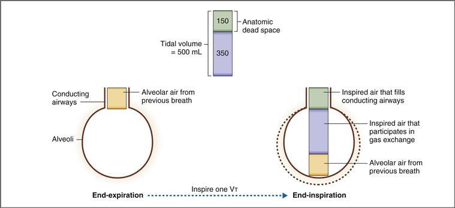

**그림 5–3 해부학적 사강.** 각 일회 호흡량의 1/3이 해부학적 사강을 채웁니다. VT, 일회 호흡량.

##### *생리학적 사강*

생리학적 사강의 개념은 해부학적 사강의 개념보다 더 추상적입니다. 정의에 따르면, 생리적 사강은 *가스 교환에 참여하지 않는 폐의 총 부피*입니다. 생리적 사강에는 전도 기도의 *해부학적* 사강과 폐포의 *기능적* 사강이 포함됩니다.

기능적 사강은 가스 교환에 참여하지 않는 환기된 폐포로 생각할 수 있습니다. 폐포가 가스 교환에 참여하지 않는 가장 중요한 이유는 환기와 관류의 불일치, 즉 환기된 폐포가 폐모세혈관 혈액에 의해 관류되지 않는 소위 환기/관류 결함입니다.

정상인의 경우 생리학적 사강은 해부학적 사강과 거의 동일합니다. 즉, 폐포 환기와 관류(혈류)가 일반적으로 잘 일치하고 기능적 사강이 작습니다. 그러나 특정 병리학적 상황에서는 생리학적 사강이 해부학적 사강보다 커질 수 있으며 이는 환기/관류 결함을 암시합니다. 일회 호흡량에 대한 생리적 사강의 비율은 환기가 얼마나 "낭비되는지"(전도성 기도 또는 비관류 폐포에서) 추정치를 제공합니다.

**생리학적 사강의 부피**는 혼합 호기의 CO2(PCO2) 분압 측정(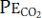)과 다음 세 가지 가정을 기반으로 하는 다음 방법으로 추정됩니다. (1) 호기 내 *모든* CO2는 기능하는(환기 및 관류) 폐포의 CO2 교환에서 비롯됩니다. (2) 흡기 공기에는 본질적으로 CO2가 없습니다. (3) 생리적 사강(비기능 폐포 및 기도)은 CO2를 교환하거나 기여하지 않습니다. 생리학적 사강이 0이면 는 폐포 PCO2()와 동일합니다. 그러나 생리학적 사강이 존재하는 경우 는 사강 공기에 의해 "희석"되고 는 희석 인자에 의해 보다 작습니다. 따라서 를 와 비교하여 희석 인자(즉, 생리적 사강의 부피)를 측정할 수 있습니다. 생리학적 사강을 측정할 때 잠재적인 문제는 폐포 공기를 직접 샘플링할 수 없다는 것입니다. 그러나 폐포 공기는 일반적으로 폐모세혈관 혈액(전신 동맥혈이 됨)과 평형을 이루기 때문에 이 문제는 극복될 수 있습니다. 따라서 전신 동맥혈의 PCO2(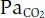)는 폐포 공기의 PCO2()와 동일합니다. 이 가정을 사용하여 생리적 사강의 부피는 다음 방정식으로 계산됩니다.

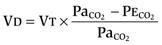

어디서

|  |  |
| --- | --- |
| 비디오 | = 생리학적 사강(mL) |
| 버몬트 | = 일호흡량(mL) |
| 이미지 | = 동맥혈 이미지(mmHg) |
| 이미지 | = 혼합된 호기 이미지(mmHg) |

즉, 방정식은 생리학적 사강의 부피가 일회 호흡량(1회 호흡으로 흡기된 부피)에 분수를 곱한 것임을 나타냅니다. 분수는 사강 공기(CO2에 기여하지 않음)에 의한 폐포 PCO2의 희석을 나타냅니다.

방정식과 그 적용을 더 잘 이해하려면 두 가지 극단적인 예를 고려하십시오. 첫 번째 예에서는 생리적 사강이 *0*이라고 가정하고, 두 번째 예에서는 생리적 사강이 *전체* 일회 호흡량과 동일하다고 가정합니다. 사강이 0인 첫 번째 예에서는 "낭비된" 환기가 없기 때문에 호기()의 PCO2는 폐포 가스() 및 동맥혈()의 PCO2와 동일합니다. 방정식의 분수는 0과 같으므로 VD의 계산된 값은 0입니다. 두 번째 예에서는 사강이 *전체* 일회 호흡량과 동일하며 가스 교환이 없습니다. 따라서 는 0이 되고 분수는 1.0이 되며 VD는 VT와 같습니다.

#### 환기율

환기율은 단위 시간당 폐 안팎으로 이동하는 공기의 양입니다. 환기율은 폐 안팎으로 공기가 이동하는 총 속도인 *분* 환기 또는 생리적 사강을 보정하는 *폐포* 환기로 표현될 수 있습니다. 폐포 환기를 계산하려면 이전 섹션에서 설명한 대로 전신 동맥혈 샘플링을 포함하여 생리학적 사강을 먼저 측정해야 합니다.

**분당 환기**는 다음 방정식으로 계산됩니다.

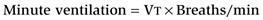

**폐포 환기**는 생리적 사강을 보정한 미세 환기로 다음 방정식으로 계산됩니다.

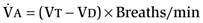

어디서

|  |  |
| --- | --- |
| 이미지 | = 폐포 환기(mL/min) |
| 버몬트 | = 일호흡량(mL) |
| 비디오 | = 생리학적 사강(mL) |

**예제 문제.** 일회 호흡량이 550mL인 남성이 분당 14회 호흡 속도로 호흡하고 있습니다. 동맥혈의 Pco2는 40mmHg이고 호기 공기의 Pco2는 30mmHg입니다. *그의 분당 환기란? 그의 폐포 환기는 무엇입니까? 각 일회 호흡량의 몇 퍼센트가 기능하는 폐포에 도달합니까? 각 일회 호흡량 중 몇 퍼센트가 사강입니까?*

**해결책.** 분당 환기는 일회호흡량과 분당 호흡수를 곱한 값 또는 다음과 같습니다.

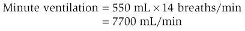

폐포 환기는 계산이 필요한 생리적 사강을 보정한 미세 환기입니다. 이 문제는 환기는 되지만 CO2를 교환하지 않는 구조를 나타내는 생리학적 사강을 평가하는 일반적인 방법을 보여줍니다.

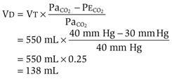

따라서 폐포 환기(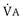)는

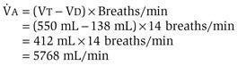

일회 호흡량이 550mL이고 생리적 사강이 138mL인 경우, 각 호흡에서 기능하는 폐포에 도달하는 신선한 공기의 양은 412mL 또는 각 일회 호흡량의 75%입니다. 따라서 사강은 각 일회 호흡량의 25%입니다.

#### 폐포 환기 방정식

폐포 환기 방정식은 *호흡 생리학의 기본 관계*이며 폐포 환기와 폐포 PCO2 사이의 역관계를 설명합니다(). 폐포 환기 방정식은 다음과 같이 표현됩니다.

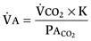

또는 다시 정리하면,

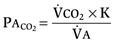

어디서

> 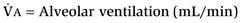

> 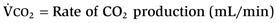

> 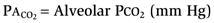

> 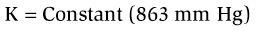

**상수 K**는 BTPS 조건과  및 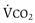가 동일한 단위(예: mL/min)로 표현되는 경우 863mmHg와 같습니다. **BTPS**는 체온(310K), 주변 압력(760mmHg) 및 수증기로 포화된 가스를 의미합니다.

방정식의 재배열된 형식을 사용하여 두 가지 변수, 즉 (1) 조직의 호기성 대사로 인한 **CO2 생성 속도**와 (2) 호기에서 이 CO2를 배설하는 **폐포 환기**를 알면 폐포 PCO2를 예측할 수 있습니다.

폐포 환기 방정식에서 이해해야 할 중요한 점은 *만약 CO*2*생산이 일정하다면*
*는 폐포 환기에 의해 결정됩니다.* 일정한 CO2 생산 수준을 위해 PACO2와 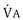 사이에는 쌍곡선 관계가 있습니다([그림 5-4](#filepos926087)). 폐포 환기가 증가하면 가 감소합니다. 반대로 폐포 환기가 감소하면 가 증가합니다.

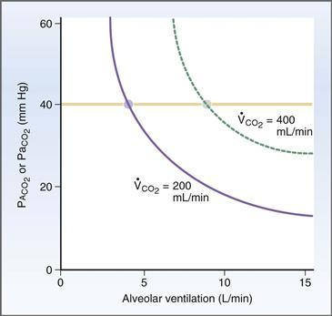

**그림 5–4 폐포 환기의 함수로서의 폐포 또는 동맥 PCO2.** 관계는 폐포 환기 방정식으로 설명됩니다. CO2 생산량이 200mL/min에서 400mL/min으로 두 배가 되면  및 를 40mmHg로 유지하기 위해 폐포 환기도 두 배로 증가해야 합니다.

방정식에서 즉시 명백하지 않은 추가적인 중요한 점은 CO2가 항상 폐 모세혈관과 폐포 가스 사이에서 평형을 이루기 때문에 동맥 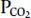 ()가 항상 폐포 와 동일하다는 것입니다. (). 따라서 앞서 논의한 를 측정 가능한 로 대체할 수 있다.

그렇다면 *동맥(및 폐포) PCO2가 폐포 환기와 반비례하여 달라지는 이유는 무엇입니까?* 역관계를 이해하려면 먼저 폐포 환기가 폐 모세혈관에서 CO2를 *끌어낸다*는 점을 이해해야 합니다. 호흡할 때마다 CO2가 없는 공기가 폐로 유입되어 폐 모세혈관에서 폐포 가스로 CO2가 확산되는 원동력이 생성됩니다. 그러면 폐 모세혈관에서 뽑아낸 CO2가 만료됩니다. 폐포 환기가 높을수록 혈액에서 더 많은 CO2가 빠져나오고  및 가 낮아집니다(폐포 는 항상 동맥 와 평형을 이루기 때문입니다). 폐포 환기량이 낮을수록 혈액에서 CO2가 덜 빠져나가고  및 가 높아집니다.

폐포 환기 방정식에 대해 생각하는 또 다른 방법은 와  사이의 관계가 CO2 생산량의 변화에 ​​따라 어떻게 변경되는지 고려하는 것입니다. 예를 들어, CO2 생산량, 즉 가 2배로 증가하면(예: 격렬한 운동 중) 와  사이의 쌍곡선 관계는 오른쪽으로 이동합니다([그림 5-4](#filepos926087) 참조). 이러한 조건에서 를 정상 값(즉, 40mmHg)으로 유지하는 유일한 방법은 폐포 환기도 두 배로 늘리는 것입니다. 그래프는 CO2 생산량이 200 mL/min에서 400 mL/min으로 증가하면 는 40 mm Hg로 유지되고 동시에 는 5 L/min에서 10 L/min으로 증가함을 확인합니다.

#### 폐포 가스 방정식

폐포 환기 방정식은 폐포 환기에 대한 폐포 및 동맥 PCO2의 의존성을 설명합니다. 두 번째 방정식인 **폐포 기체 방정식**은 폐포 PCO2를 기반으로 폐포 PO2를 예측하는 데 사용되며 [그림 5-5](#filepos930271)의 O2-CO2 다이어그램에 표시되어 있습니다. 폐포 가스 방정식은 다음과 같이 표현됩니다.

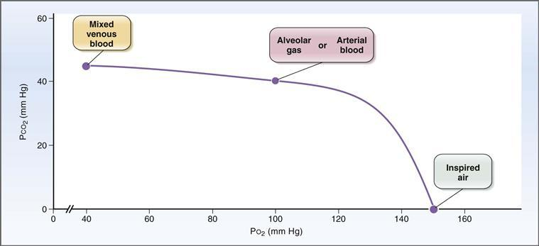

**그림 5–5 PO2의 함수인 PCO2.** 관계는 폐포 기체 방정식으로 설명됩니다. 흡기 공기와 혼합 정맥혈 사이의 PO2 변화는 PCO2 변화보다 훨씬 큽니다.

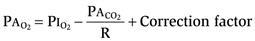

어디서

|  |  |
| --- | --- |
| 이미지 | = 폐포 이미지(mm Hg) |
| 이미지 | = 흡기 공기 중 PO2(mmHg) |
| 이미지 | = 폐포 이미지(mm Hg) |
| R | = 호흡교환율 또는 호흡지수(CO2생산/O2소비) |

보정 계수는 작으며 일반적으로 무시됩니다. 정상 상태에서 호흡 교환 비율인 R은 호흡 지수와 같습니다. 이전의 폐포 환기 방정식에 따르면 폐포 환기가 절반으로 줄어들면 가 두 배가 됩니다(폐포에서 제거되는 CO2가 더 적기 때문입니다). 폐포 환기를 절반으로 줄인 두 번째 결과는 가 감소한다는 것입니다(폐포 환기가 감소한다는 것은 폐포로 유입되는 O2의 양이 적다는 것을 의미합니다). 폐포 가스 방정식은 의 주어진 변화에 대해 발생할 의 변화를 예측합니다. 호흡 교환율의 정상 값은 0.8이므로 폐포 환기가 절반으로 줄어들면 의 *감소*는 의 *증가*보다 약간 더 커집니다. 요약하면 가 반으로 줄어들면 는 두 배가 되고 는 반보다 약간 더 커집니다.

폐포 가스 방정식을 추가로 조사하면 어떤 이유로 호흡 교환 비율이 변경되면 와  간의 관계도 변경되는 것으로 나타났습니다. 언급한 바와 같이 호흡교환율의 정상값은 0.8이다. 그러나 CO2 생성 속도가 O2 소비 속도에 비해 감소하는 경우(예: 호흡 지수 및 호흡 교환 비율이 0.8이 아닌 0.6인 경우) 는 에 비해 감소합니다.

**예제 문제.** 한 남자의 CO2 생성 속도는 O2 소비 속도의 80%입니다. 동맥 PCO2가 40mmHg이고 가습된 기관 공기의 PO2가 150mmHg라면 폐포 PO2는 얼마입니까?

**해결책.** 이 문제를 해결하기 위한 기본 가정은 CO2가 동맥혈과 폐포 공기 사이에서 평형을 이룬다는 것입니다. 따라서 (폐포 가스 방정식에 필요)는 (문제에 제공됨)와 같습니다. 폐포 가스 방정식을 사용하면 호흡 지수와 흡기 공기의 PO2를 알고 있는 경우 에서 를 계산할 수 있습니다. CO2 생산량은 O2 소비량의 80%라고 합니다. 따라서 호흡 지수는 0.8로 정상 수치입니다. 는 다음과 같이 계산됩니다.

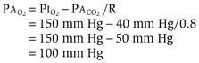

에 대해 계산된 값은 [그림 5-4](#filepos926087)의 O2-CO2 다이어그램에서 확인할 수 있습니다. 그래프는 PCO2가 40mmHg인 폐포 가스 또는 동맥혈이 호흡 지수가 0.8일 때 PO2가 100mmHg임을 나타냅니다. 이는 정확히 폐포 가스 방정식으로 계산된 값입니다!

#### 강제 호기량

폐활량은 최대 흡기 후에 만료될 수 있는 양입니다. ***강제* 폐활량**(**FVC**)은 [그림 5-6](#filepos936802)과 같이 최대 흡기 후 *강제* 호기될 수 있는 총 공기량입니다. 1초에 강제로 호기될 수 있는 공기량을 **FEV1**이라고 합니다. 마찬가지로 2초에 누적 호기되는 공기량을 **FEV2**, 3초에 누적 호기되는 공기량을 **FEV3**이라고 합니다. 일반적으로 전체 폐활량이 3초에 강제로 소진될 수 있으므로 “FEV4”는 필요하지 않습니다.

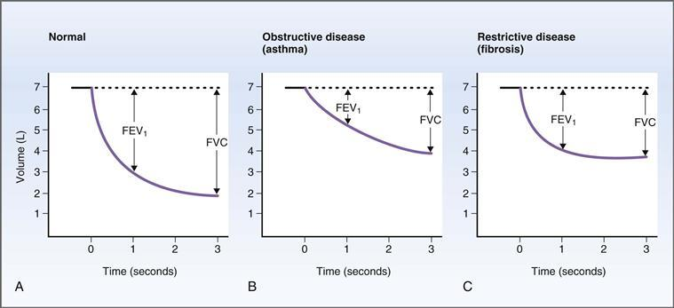

**그림 5–6 정상 피험자와 폐 질환 환자의 FVC 및 FEV1.** 피험자는 최대 흡기 후 강제로 숨을 거두었습니다. **A–C,** 그래프는 강제 만료 단계를 보여줍니다. 강제로 소진되는 총량을 강제 폐활량(FVC)이라고 합니다. 첫 번째 초에 만료된 볼륨을 FEV1이라고 합니다.

FVC와 FEV1은 폐질환의 유용한 지표입니다. 특히, 첫 번째 1초에 만료될 수 있는 폐활량의 비율인 FEV1/FVC를 사용하여 질병을 구별할 수 있습니다. 예를 들어 **정상** 사람의 경우 FEV1/FVC는 약 0.8로 강제 호기 1초 안에 폐활량의 80%가 소진될 수 있음을 의미합니다([그림 5-6*A*](#filepos936802) 참조). **천식**과 같은 폐쇄성 폐질환이 있는 환자의 경우 FVC와 FEV1이 모두 감소하지만 FEV1은 FVC보다 *더* 감소합니다. 따라서 FEV1/FVC도 감소하는데, 이는 호기 기류에 대한 저항이 증가한 기도 폐쇄의 전형적인 현상입니다([그림 5-6*B*](#filepos936802) 참조). **섬유증**과 같은 제한적인 폐 질환이 있는 환자의 경우 FVC와 FEV1은 모두 감소하지만 FEV1은 FVC보다 *적게* 감소합니다. 따라서 섬유증에서는 FEV1/FVC가 실제로 증가하게 된다([그림 5-6*C*](#filepos936802) 참조).

### 호흡의 역학

#### 호흡에 사용되는 근육

##### *영감을 주는 근육*

**횡격막**은 영감을 얻는 데 가장 중요한 근육입니다. 횡격막이 수축하면 복부 내용물이 아래로 밀리고 갈비뼈가 위쪽 바깥쪽으로 들어 올려집니다. 이러한 변화는 흉강 내 용적을 증가시켜 흉강 내압을 낮추고 폐로 공기의 흐름을 시작합니다. **운동** 중에 호흡 빈도와 일회 호흡량이 증가하면 **외부 늑간 근육**과 **보조 근육**을 사용하여 더 활발한 흡기를 할 수도 있습니다.

##### *만료 근육*

만료는 일반적으로 수동적인 프로세스입니다. 시스템이 다시 평형점에 도달할 때까지 폐와 대기 사이의 역압 구배에 의해 공기가 폐 밖으로 배출됩니다. **운동** 중이나 기도 저항이 증가하는 질병(예: **천식**)에서는 호기 근육이 호기 과정을 도울 수 있습니다. 호기 근육에는 복강을 압박하고 횡격막을 위로 밀어내는 **복부 근육**과 갈비뼈를 아래쪽과 안쪽으로 당기는 **내부 늑간근**이 포함됩니다.

#### 규정 준수

순응성의 개념은 심혈관계에서와 마찬가지로 호흡계에서도 동일한 의미를 갖습니다. 순응성은 시스템의 **확장성**을 설명합니다. 호흡계에서는 폐와 흉벽의 순응성이 주요 관심사입니다. 규정 준수는 압력 변화로 인해 부피가 어떻게 변하는지를 측정하는 것입니다. 따라서 폐 순응도는 주어진 압력 변화에 대한 폐 부피의 변화를 나타냅니다.

폐와 흉벽의 탄력성은 탄력성 또는 **탄력성**과 *반비* 상관관계가 있습니다. 탄력성과 탄력성 사이의 역상관관계를 이해하려면 얇은 고무 밴드와 두꺼운 고무 밴드 두 개를 고려해 보세요. 얇은 고무 밴드는 탄력 있는 "조직"의 양이 더 적습니다. 즉, 쉽게 늘어나고 늘어나며 유연해집니다. 두꺼운 고무 밴드는 탄력 있는 "조직"의 양이 더 많습니다. 즉, 늘어나기가 어렵고 팽창성과 유연성이 떨어집니다. 더욱이, 늘어나면 두꺼운 고무 밴드는 탄성이 더 커서 얇은 고무 밴드보다 더 강력하게 "뒤로 늘어납니다". 폐 구조도 마찬가지입니다. 탄성 조직의 양이 많을수록 "뒤로 돌아오는" 경향이 커지고 탄성 반동력도 커지지만 유연성은 낮아집니다.

폐 순응도를 측정하려면 폐압과 폐량을 동시에 측정해야 합니다. 그러나 압력이라는 용어는 모호할 수 있습니다. 왜냐하면 "압력"은 폐포 *내부* 압력, 폐포 *외부* 압력 또는 심지어 폐포 벽을 가로지르는 *경벽* 압력을 의미할 수 있기 때문입니다. **경벽압력**은 구조물 전체에 걸친 압력입니다. 예를 들어, 경폐압은 폐포내압과 흉막내압의 차이입니다. (흉막내 공간은 폐와 흉벽 사이에 있습니다.) 마지막으로, 폐압은 항상 *대기압을 기준으로* 하며 이를 "0"이라고 합니다. 대기압과 같은 압력은 0, 대기압보다 높은 압력은 양, 대기압보다 낮은 압력은 음입니다.

##### *폐의 순응도*

격리된 폐의 압력-용적 관계는 [그림 5-7](#filepos943682)에 나와 있습니다. 이 시연을 위해 폐를 절제하여 병에 담습니다. 폐 외부 공간은 흉막내압과 유사합니다. 폐 외부의 압력은 흉막 내압의 변화를 시뮬레이션하기 위해 진공 펌프로 변화됩니다. 폐 외부의 압력이 변화함에 따라 폐활량계를 사용하여 폐용적을 측정합니다. 폐는 음의 외부 압력으로 팽창된 다음 음의 외부 압력을 감소시켜 수축됩니다. 팽창과 수축의 순서는 **압력-용적 루프**를 생성합니다. 압력-용적 루프의 각 가지의 기울기는 격리된 폐의 **순응도**입니다.

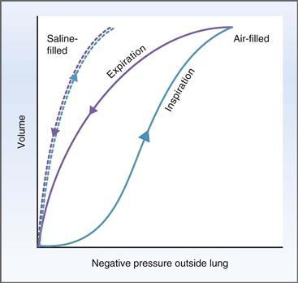

**그림 5–7 폐의 순응도.** 폐용적과 폐압 사이의 관계는 분리된 폐를 팽창 및 수축시켜 얻습니다. 각 곡선의 기울기는 순응도입니다. 공기가 채워진 폐에서는 흡기(팽창)와 호기(수축)가 서로 다른 곡선을 따르는데, 이를 히스테리시스라고 합니다.

**공기가 채워진** 폐에 대한 실험에서는 기도와 폐포가 대기에 열려 있고 폐포 압력은 대기압과 같습니다. 진공 펌프를 사용하여 폐 외부의 압력이 더 음압으로 설정되면 폐가 부풀어 오르고 부피가 증가합니다. 따라서 폐를 팽창시키는 이 음의 외부 압력은 **팽창 압력**입니다. 폐는 압력-체적 루프의 **흡기** 부분을 따라 공기로 채워집니다. 최고 팽창 압력에서 폐포가 한계까지 채워지면 폐포가 더 뻣뻣해지고 유연성이 떨어지며 곡선이 평평해집니다. 폐가 최대로 확장되면 폐 외부의 압력은 점차적으로 덜 음압이 되어 압력-용적 루프의 **호기** 부분을 따라 폐용적이 감소하게 됩니다.

공기가 채워진 폐에 대한 압력-용적 루프의 특이한 특징은 흡기 및 호기 관계의 기울기가 다르다는 것입니다. 이 현상을 **히스테리시스**라고 합니다. 압력-부피 관계의 기울기는 순응도이므로 흡기 및 호기에 대한 폐 순응도 달라야 합니다. 주어진 외부 압력에 대해 폐의 용적은 흡기 시보다 호기 시 더 큽니다(즉, 흡기 시보다 호기 시 순응도가 더 높습니다). 일반적으로 **순응도는 압력-용량 루프의 호기 부분**에서 측정됩니다. 왜냐하면 흡기 부분은 최대 팽창 압력에서의 순응도 감소로 인해 복잡해지기 때문입니다.

폐 순응도 곡선의 흡기 및 호기 사지가 다른 이유는 무엇입니까? 순응도는 탄력 있는 조직의 양에 따라 달라지는 폐의 고유한 특성이므로 두 곡선이 동일할 것이라고 생각할 수 있습니다. 다양한 곡선(즉, 이력현상)에 대한 설명은 공기가 채워진 폐의 액체-공기 경계면에서의 **표면 장력**에 있습니다. 폐를 감싸고 있는 액체 분자 사이의 분자간 인력은 액체와 공기 분자 사이의 힘보다 훨씬 더 강합니다. 공기가 채워진 폐에서는 흡기 및 호기에 대해 다음과 같은 다양한 곡선이 생성됩니다.

 **흡기 사지**에서는 액체 분자가 서로 가장 가깝고 분자간 힘이 가장 높은 낮은 폐 용적에서 시작됩니다. 폐를 팽창시키려면 먼저 이러한 분자간 힘을 분해해야 합니다. 이후 섹션에서 논의되는 계면활성제는 히스테리시스에서 역할을 합니다. 간단히 말하면, 계면활성제는 제2형 폐포 세포에 의해 생성되고 표면 장력을 감소시키고 폐 순응도를 증가시키는 세제 역할을 하는 인지질입니다. 폐(흡기 사지)가 팽창하는 동안 제2형 폐포 세포에 의해 새로 생성되는 계면활성제가 폐포를 감싸는 액체층으로 들어가 이러한 분자간 힘을 분해하여 표면 장력을 감소시킵니다. 흡기 곡선의 초기 부분에서 가장 낮은 폐 용적에서 폐 표면적은 액체 층에 계면활성제를 첨가할 수 있는 것보다 빠르게 증가합니다. 따라서 계면활성제 밀도가 낮고 표면 장력이 높으며 컴플라이언스가 낮고 곡선이 평평합니다. As inflation proceeds, the surfactant density increases, which decreases surface tension, increases compliance, and increases the slope of the curve.

 **호기지**에서는 액체 분자 사이의 분자간 힘이 낮은 높은 폐용적에서 시작됩니다. 폐를 수축시키기 위해 분자간 힘을 분해할 필요는 없습니다. 폐(호기지)가 수축되는 동안 폐 표면적은 계면활성제가 액체 내벽에서 제거될 수 있는 것보다 빠르게 감소하고 계면활성제 분자의 밀도는 급격히 증가하여 표면 장력을 감소시키고 순응도를 증가시킵니다. 따라서 만료 사지의 초기 부분은 평평합니다. 호기가 진행됨에 따라 계면활성제는 액체 내막에서 제거되고 계면활성제의 밀도는 폐의 순응도와 마찬가지로 상대적으로 일정하게 유지됩니다.

요약하면, 공기가 채워진 폐의 경우 관찰된 컴플라이언스 곡선은 부분적으로 폐의 본질적인 컴플라이언스에 의해 결정되고 부분적으로는 액체-공기 인터페이스의 표면 장력에 의해 결정됩니다. 표면 장력의 역할은 **식염수로 채워진 폐**에서 실험을 반복하여 입증됩니다. 액체-공기 경계면, 즉 표면 장력이 제거되면 흡기 및 호기 사지는 동일합니다.

##### *가슴벽 준수*

[그림 5-8](#filepos949602)은 폐와 흉벽의 관계를 보여준다. 전도성 기도는 단일 튜브로 표시되고, 가스 교환 영역은 단일 폐포로 표시됩니다. 폐와 흉벽 사이의 흉강 내 공간이 실제 크기보다 훨씬 크게 표시됩니다. 폐와 마찬가지로 흉벽도 순응합니다. 그 순응성은 흉막내 공간에 공기를 주입하여 기흉을 생성함으로써 입증될 수 있습니다.

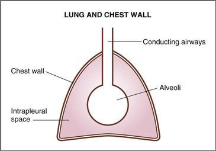

**Figure 5–8  Schematic diagram of the lung and chest-wall system.** The intrapleural space is exaggerated and lies between the lungs and the chest wall.

기흉의 결과를 이해하려면 일반적으로 흉막강 내압이 음압(대기압보다 낮음)이라는 점을 먼저 인식해야 합니다. 이 **음성흉막내압**은 흉강내 공간을 당기는 두 가지 반대되는 탄성력에 의해 생성됩니다. 즉, 탄성을 지닌 폐는 허탈되는 경향이 있고, 탄성을 지닌 흉벽은 튀어나오는 경향이 있습니다([그림 5-9](#filepos950829)). 이 두 가지 반대 힘이 흉막내 공간을 당기면 음압 또는 진공이 생성됩니다. 결과적으로, 이러한 음의 흉막내압은 폐가 허탈되고 흉벽이 튀어나오는 자연스러운 경향을 반대합니다(즉, 폐가 허탈되고 흉벽이 튀어나오는 것을 방지합니다).

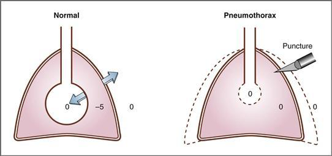

**그림 5–9 정상인과 기흉이 있는 사람의 흉막내압.** 숫자는 cm H2O 단위의 압력입니다. 압력은 대기압을 의미합니다. 따라서 압력이 0이라는 것은 대기압과 같다는 것을 의미합니다. *화살표*는 팽창하거나 수축하는 탄성력을 나타냅니다. 일반적으로 휴식 시 흉막내압은 폐를 허탈시키고 흉벽을 확장시키려는 동일하고 반대되는 힘으로 인해 -5 cm H2O입니다. 기흉이 있으면 흉막내압이 대기압과 같아져 폐가 허탈되고 흉벽이 확장됩니다.

날카로운 물체가 흉강내강을 뚫으면 그 공간으로 공기가 유입되는 **(기흉)**, 흉막내압은 갑자기 대기압과 같아집니다. 따라서 정상적인 음수 값 대신 흉막내압이 0이 됩니다. 기흉에는 두 가지 중요한 결과가 있습니다([그림 5-9](#filepos950829) 참조). 첫째, 폐를 열어두는 흉막내 음압이 없으면 폐가 허탈됩니다. 둘째, 흉벽이 팽창하는 것을 방지하는 흉막내 음압이 없으면 흉벽이 튀어나옵니다. (흉벽이 튀어나오는 이유를 이해하기 어려운 경우, 흉벽을 일반적으로 손가락 사이로 압축하여 담는 스프링이라고 생각하십시오. 물론 실제 흉벽은 손가락의 힘이 아닌 흉막내 음압에 의해 "억제"됩니다. 손가락을 떼거나 흉막내 음압을 제거하면 스프링 또는 흉벽이 튀어 나옵니다.)

##### *폐, 흉벽, 폐와 흉벽 결합에 대한 압력-용적 곡선*

[그림 5-10](#filepos954279)에 표시된 대로 폐 단독(즉, 병에 격리된 폐), 흉벽 단독, 폐와 흉벽 결합 시스템에 대한 압력-부피 곡선을 얻을 수 있습니다. 흉벽 단독에 대한 곡선은 이후에 설명되는 결합된 폐와 흉벽에 대한 곡선에서 폐 곡선을 빼서 얻습니다. 폐 단독에 대한 곡선은 [그림 5-7](#filepos943682)에 표시된 것과 유사하며 단순화를 위해 히스테리시스가 제거되었습니다. 폐와 흉벽 결합 시스템의 곡선은 훈련된 피험자가 폐활량계를 사용하여 다음과 같이 숨을 들이마시거나 내쉬도록 하여 얻습니다. 피험자는 주어진 양만큼 흡기하거나 호기합니다. 폐활량계 밸브가 닫히고 피험자가 호흡근을 이완시키면 피험자의 기도압이 측정됩니다(이완압력이라 함). 이러한 방식으로, 폐와 흉벽 결합 시스템의 일련의 정적 용적에서 기도압 값을 얻습니다. 부피가 기능적 잔존 용량(FRC)인 경우 기도압은 0이고 대기압과 같습니다. FRC보다 낮은 용적에서는 기도압이 음수입니다(용적이 적고 압력이 적음). FRC보다 높은 용적에서는 기도압이 양수입니다(더 많은 용적, 더 많은 압력).

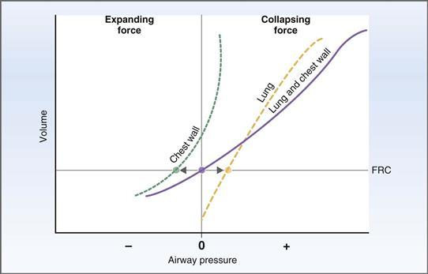

**그림 5–10 폐, 흉벽, 폐와 흉벽 결합 시스템의 순응도.** 평형 위치는 기능적 잔류 용량(FRC)에 있으며, 여기서 흉벽의 팽창력은 폐의 붕괴력과 정확히 동일합니다.

[그림 5-10](#filepos954279)의 각 곡선의 기울기는 **순응도**입니다. 흉벽 단독의 순응도는 폐 단독의 순응도와 거의 동일합니다. (그래프에서 기울기는 유사합니다.) 그러나 폐와 흉벽을 결합한 시스템의 순응도는 두 구조 중 하나를 단독으로 사용한 것보다 적습니다(즉, 폐와 흉벽을 결합한 곡선이 "더 평평"함). 다른 풍선(흉벽) 안에 하나의 풍선(폐)을 시각화합니다. 각 풍선은 그 자체로 규격을 준수하지만 결합된 시스템(풍선 내의 풍선)은 규격이 낮고 확장하기가 더 어렵습니다.

[그림 5-10](#filepos954279)의 곡선을 해석하는 가장 쉬운 방법은 **FRC**라는 부피에서 시작하는 것입니다. 이는 폐와 흉벽 결합 시스템의 휴식 또는 평형 부피입니다. FRC는 사람이 정상적인 일회 호흡을 마친 후 폐에 존재하는 부피입니다. FRC의 그래프를 이해했다면 FRC보다 작은 볼륨과 FRC보다 큰 볼륨의 그래프를 비교해 보세요.

 **부피는 FRC입니다.** 부피가 FRC이면 결합된 폐와 흉벽 시스템이 평형 상태에 있습니다. 기도압은 대기압과 같으며 이를 0이라고 합니다. (용적이 FRC인 경우 결합된 폐와 흉벽 곡선은 기도압 0에서 X축과 교차합니다.) FRC에서는 탄성 구조이기 때문에 폐는 붕괴를 "원"하고 흉벽은 확장을 "원"합니다. 이러한 탄성력이 반대되지 않는다면 구조는 정확히 그렇게 할 것입니다! 그러나 평형 위치인 FRC에서 폐에 가해지는 수축력은 등거리 화살표로 표시된 것처럼 흉벽에 가해지는 팽창력과 정확히 동일합니다. *결합된* 폐와 흉벽 시스템은 붕괴되거나 확장되는 경향이 없습니다.

 **부피가 FRC보다 적습니다.** 시스템의 부피가 FRC보다 적을 때(즉, 피험자가 폐활량계로 강제 호기함) 폐의 부피가 적고 폐의 붕괴(탄성)력도 더 작습니다. 그러나 흉벽의 팽창력은 더 크며 *결합된* 폐와 흉벽 시스템은 팽창을 "원합니다". (그래프에서 FRC보다 작은 부피에서는 폐에 대한 붕괴력이 흉벽의 팽창력보다 작고 결합 시스템의 기도압이 음수라는 점에 유의하십시오. 따라서 공기가 압력 구배를 따라 폐로 유입됨에 따라 결합 시스템이 팽창하는 경향이 있습니다.)

 **부피가 FRC보다 큽니다.** 시스템의 부피가 FRC보다 크면(즉, 피험자가 폐활량계에서 흡기함) 폐의 부피가 더 커지고 폐의 붕괴(탄성)력도 더 커집니다. 그러나 흉벽에 가해지는 팽창력은 더 작으며 *결합된* 폐와 흉벽 시스템은 붕괴를 "원합니다". (그래프에서 FRC보다 큰 용적에서는 폐에 대한 붕괴력이 흉벽의 팽창력보다 크고 결합 시스템에 대한 기도압이 양수라는 점에 유의하십시오. 따라서 공기가 폐에서 압력 구배 아래로 흘러 나가면서 전체 시스템이 붕괴되는 경향이 있습니다.) 가장 높은 폐 용적에서는 *폐와 흉벽 모두* 붕괴를 "원하며"[흉벽 곡선이 높은 용적에서 수직 축을 교차했다는 점에 유의] 결합된 시스템에 대한 붕괴력.)

##### *폐 순응성 질환*

질병으로 인해 폐의 순응도가 변하면 관계의 기울기도 변하고, 결과적으로 [그림 5-11](#filepos959602)에서와 같이 폐와 흉벽이 합쳐진 용적도 변하게 된다. 참고로 [그림 5-10](#filepos954279)의 정규관계를 [그림 5-11](#filepos959602) 상단에 나타내었다. 편의를 위해 시스템의 각 구성 요소는 별도의 그래프에 표시됩니다(예: 흉벽만, 폐만, 폐와 흉벽 결합). 흉벽만은 이러한 질병으로 인해 흉벽의 순응도가 변경되지 않으므로 완전성을 위해서만 포함됩니다. 세 그래프 각각의 실선은 [그림 5-10](#filepos954279)의 정규 관계를 보여준다. 점선은 질병의 영향을 나타냅니다.

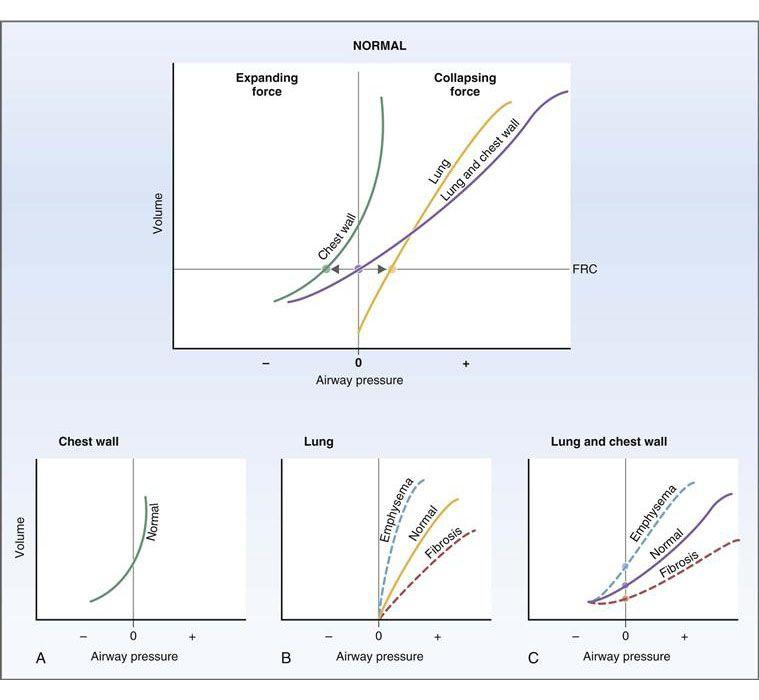

**그림 5–11 폐기종과 섬유증에서 흉벽(A), 폐(B), 폐와 흉벽 결합 시스템(C)의 순응도 변화.** 평형점인 기능적 잔류 용량(FRC)은 폐기종에서 증가하고 섬유증에서 감소합니다.

 **폐기종(폐 유연성 증가).** 만성 폐쇄성 폐질환(COPD)의 한 구성 요소인 폐기종은 폐의 탄력 섬유 손실과 관련이 있습니다. 결과적으로 폐의 순응도가 증가합니다. (탄력성과 순응도 사이의 역관계를 다시 생각해 보십시오.) 순응도의 증가는 폐의 용적-압력 곡선의 기울기 증가(가파르게)와 관련이 있습니다([그림 5-11*B*](#filepos959602) 참조). 결과적으로, 주어진 부피에서 폐에 가해지는 붕괴(탄성 반동) 힘이 감소합니다. FRC의 원래 값에서 폐가 허탈되는 경향은 흉벽이 팽창하는 경향보다 적으며 이러한 반대 힘은 더 이상 균형을 이루지 않습니다. 반대 세력이 균형을 이루려면 폐에 부피를 추가하여 폐의 붕괴력을 높여야 합니다. 따라서 결합된 폐와 흉벽 시스템은 두 개의 반대되는 힘이 균형을 이룰 수 있는 새로운 **더 높은 FRC**를 추구합니다([그림 5-11*C*](#filepos959602) 참조). 기도압이 0인 새로운 교차점이 증가합니다. 폐기종 환자는 (더 높은 FRC를 인정하여) 더 높은 폐용적에서 호흡한다고 하며 **통 모양의 가슴**을 갖게 됩니다.

 **섬유증(폐 유연성 감소).** 소위 제한성 질환인 섬유증은 폐 조직이 경직되고 유연성이 저하되는 것과 관련이 있습니다. 폐 순응도의 감소는 폐의 용적-압력 곡선의 기울기 감소와 관련이 있습니다([그림 5-11*B*](#filepos959602) 참조). 원래 FRC에서는 폐가 허탈되는 경향이 흉벽이 팽창하는 경향보다 더 크고 반대 세력이 더 이상 균형을 이루지 않게 됩니다. 균형을 다시 확립하기 위해 폐와 흉벽 시스템은 새로운 **낮은 FRC**를 찾습니다([그림 5-11*C*](#filepos959602) 참조). 기도압이 0인 새로운 교차점이 감소합니다.

##### *폐포의 표면 장력*

폐포의 크기가 작기 때문에 이를 열어두는 데 특별한 문제가 있습니다. 이 "문제"는 다음과 같이 설명될 수 있습니다. 폐포에는 체액막이 늘어서 있습니다. 액체의 인접한 분자 사이의 인력은 액체 분자와 폐포의 기체 분자 사이의 인력보다 강하여 **표면 장력**을 생성합니다. 인력에 의해 액체 분자가 서로 끌어당겨짐에 따라 표면적은 가능한 작아져 구형을 형성합니다(튜브 끝에 불어오는 비눗방울처럼). 표면 장력은 구를 붕괴시키는 경향이 있는 압력을 생성합니다. 이러한 구에 의해 생성되는 압력은 **라플라스의 법칙:**에 의해 제공됩니다.

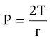

어디서

|  |  |
| --- | --- |
| 피 | = 폐포에 대한 붕괴 압력(dynes/cm2) |
|  | *또는* |
|  | 폐포를 열어두는 데 필요한 압력(dynes/cm2) |
| 티 | = 표면 장력(다인/cm) |
| r | = 폐포의 반경(cm) |

라플라스의 법칙에 따르면 폐포를 붕괴시키려는 압력은 폐포를 둘러싸고 있는 액체 분자에 의해 발생하는 표면 장력에 정비례하고 폐포 반경에 반비례합니다([그림 5-12](#filepos965071)). 반경과의 역관계로 인해 **큰 폐포**(반경이 큰 폐포)는 붕괴 압력이 낮으므로 열린 상태를 유지하는 데 최소한의 압력만 필요합니다. 반면에 **작은 폐포**(반경이 작은 것)는 붕괴 압력이 높으며 열린 상태를 유지하려면 더 많은 압력이 필요합니다. 따라서 작은 폐포는 붕괴되는 경향이 있기 때문에 이상적이지 않습니다. 그러나 가스 교환의 관점에서 볼 때 폐포는 부피에 비해 총 표면적을 늘리기 위해 가능한 한 작아야 합니다. 이러한 근본적인 갈등은 계면활성제에 의해 해결됩니다.

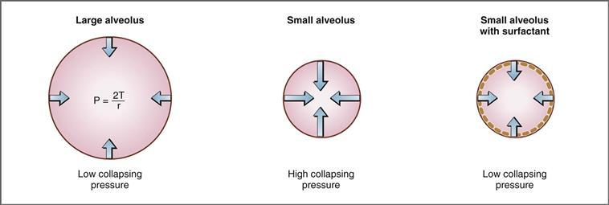

**그림 5-12 폐포 크기와 계면활성제가 붕괴 압력에 미치는 영향.** *화살표*의 길이는 붕괴 압력의 상대적 크기를 나타냅니다.

##### *계면활성제*

붕괴 압력에 대한 반경의 영향에 대한 논의에서 발생하는 질문은 *높은 붕괴 압력 하에서 어떻게 작은 폐포가 열린 채로 유지됩니까?*입니다. 이 질문에 대한 답은 폐포를 둘러싸고 표면 장력을 감소시키는 인지질 혼합물인 **계면활성제**에서 찾을 수 있습니다. 계면활성제는 표면 장력을 감소시켜 주어진 반경에 대한 붕괴 압력을 감소시킵니다.

[그림 5-12](#filepos965071)는 두 개의 작은 폐포를 보여주고 있는데, 하나는 계면활성제가 있고 다른 하나는 계면활성제가 없습니다. *계면활성제가 없으면* 라플라스의 법칙에 따라 작은 폐포가 붕괴될 것으로 예측됩니다**(무기폐).**
*계면활성제가 있으면* 붕괴 압력이 감소하기 때문에 동일한 작은 폐포가 열린 상태로 유지됩니다(공기로 팽창됨).

계면활성제는 **제2형 폐포 세포**에 의해 지방산으로부터 합성됩니다. 계면활성제의 정확한 구성은 아직 알려져 있지 않지만, 가장 중요한 성분은 **디팔미토일 포스파티딜콜린**(**DPPC**)입니다. DPPC가 표면 장력을 감소시키는 메커니즘은 인지질 분자의 **양친매성** 특성(즉, 한쪽 끝은 소수성, 다른 쪽 끝은 친수성)을 기반으로 합니다. DPPC 분자는 소수성 부분은 서로 끌어당기고 친수성 부분은 밀어내면서 폐포 표면에 스스로 정렬됩니다. DPPC 분자 사이의 분자간 힘은 폐포를 둘러싸고 있는 액체 분자(높은 표면 장력의 원인이 됨) 사이의 인력을 파괴합니다. 따라서 계면활성제가 존재하면 표면 장력과 붕괴 압력이 감소하고 작은 폐포가 열린 상태로 유지됩니다.

계면활성제는 폐 기능에 또 다른 이점을 제공합니다. **폐 유연성을 증가**하여 흡기 중 폐 확장 작업을 줄입니다. ([그림 5-11](#filepos959602)에서 폐의 탄력성을 높이면 주어진 부피에서 붕괴하는 힘이 감소하여 폐가 더 쉽게 확장된다는 점을 상기하십시오.)

**신생아 호흡 곤란 증후군**에서는 계면활성제가 부족합니다. 발달 중인 태아에서는 계면활성제 합성이 임신 24주차부터 시작되어 거의 항상 35주차까지 나타납니다. 아기가 조산될수록 계면활성제가 존재할 가능성은 줄어듭니다. 임신 24주 이전에 태어난 영아는 계면활성제를 *절대* 갖지 않으며, 24주에서 35주 사이에 태어난 영아는 표면활성제 상태가 *불확실*합니다. 이제 신생아의 계면활성제 부족으로 인한 결과는 분명해집니다. 계면활성제가 없으면 작은 폐포는 표면 장력과 압력이 증가하여 붕괴됩니다 **(무기폐).** 붕괴된 폐포는 환기되지 않으므로 가스 교환에 참여할 수 없습니다(이를 션트라고 하며 이 장의 뒷부분에서 설명합니다). 결과적으로 저산소혈증이 발생합니다. 계면활성제가 없으면 **폐순응도가 떨어지며** 호흡 중 폐를 팽창시키는 작업이 증가합니다.

#### 공기 흐름, 압력 및 저항 관계

폐의 기류, 압력 및 저항 사이의 관계는 심혈관계의 관계와 유사합니다. 공기 흐름은 혈류와 유사하고, 가스 압력은 유체 압력과 유사하며, 기도 저항은 혈관 저항과 유사합니다. 이제 다음 관계가 친숙해졌습니다.

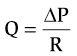

어디서

|  |  |
| --- | --- |
| 질문 | = 공기 흐름(mL/min 또는 L/min) |
| ΔP | = 압력 구배(mm Hg 또는 cm H2O) |
| R | = 기도 저항(cm H2O/L/초) |

즉, 기류(Q)는 입이나 코와 폐포 사이의 압력차(ΔP)에 정비례하고, 기도의 저항(R)에 반비례합니다. *압력 차이가 원동력*이라는 점을 이해하는 것이 중요합니다. 압력 차이가 없으면 공기 흐름이 발생하지 않습니다. 이 점을 설명하기 위해 호흡 주기의 여러 단계, 휴식 중(호흡 간) 및 흡기 중 존재하는 압력을 비교하십시오. 호흡 사이의 폐포압은 대기압과 같습니다. 압력 구배, 추진력 및 공기 흐름이 없습니다. 반면, 흡기 중에는 횡경막이 수축하여 폐용적을 증가시켜 폐포 압력을 감소시키고 폐로 공기 흐름을 유도하는 압력 구배를 설정합니다.

##### *기도 저항*

심혈관계와 마찬가지로 호흡계에서도 흐름은 저항에 반비례합니다(Q = ΔP/R). 저항은 **Poiseuille의 법칙**에 의해 결정됩니다. 따라서,

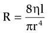

어디서

|  |  |
| --- | --- |
| R | = 저항 |
| 에타 | = 흡기 공기의 점도 |
| 내가 | = 기도의 길이 |
| r | = 기도 반경 |

네 번째 전력 의존성으로 인해 기도의 저항(R)과 반경(r) 사이에 존재하는 강력한 관계에 주목하십시오. 예를 들어, 기도 반경이 2배 감소하면 저항은 단순히 2배 증가하는 것이 아니라 24배, 즉 16배 증가합니다. 저항이 16배 *증가*하면 공기 흐름은 16배 *감소*하여 극적인 효과를 냅니다.

**중형 기관지**는 기도 저항이 가장 높은 부위입니다. 저항과 반경 사이의 역 4승 관계를 기반으로 가장 작은 기도가 공기 흐름에 가장 높은 저항을 제공하는 것처럼 보입니다*. 그러나 평행 배열로 인해 가장 작은 기도도 집단 저항이 가장 높지 *않습니다*. 혈관을 평행하게 배열하면 전체 저항이 개별 저항보다 작고, 혈관을 평행하게 추가하면 전체 저항이 감소한다는 점을 기억하세요([4장](CR%21G9RE0KW4PD33Q9F3DXNCSBNXCANP_split_011.html#filepos530928) 참조). 평행 저항의 동일한 원리가 기도에도 적용됩니다.

##### *기도 저항의 변화*

기도 저항과 기도 직경(반경) 사이의 관계는 네 번째 거듭제곱 관계를 기반으로 하는 강력한 관계입니다. 그러므로 **기도 직경의 변화**가 저항과 기류를 변경하는 주요 메커니즘을 제공한다는 것은 논리적입니다. 전도 기도 벽의 평활근은 자율 신경 섬유의 지배를 받습니다. 활성화되면 이 섬유는 기도를 수축시키거나 확장시킵니다. 폐용적과 흡기 공기의 점도 변화도 공기 흐름에 대한 저항을 변화시킬 수 있습니다.

 **자율신경계.** 기관지 평활근은 부교감 콜린성 신경 섬유와 교감 아드레날린 신경 섬유의 지배를 받습니다. 이러한 섬유의 활성화는 기관지 평활근의 수축 또는 확장을 일으키며, 이는 다음과 같이 기도의 직경을 감소시키거나 증가시킵니다: (1) **부교감신경 자극**은 기관지 평활근의 **수축**을 생성하여 기도 직경을 감소시키고 기류에 대한 저항을 증가시킵니다. 이러한 효과는 무스카린 작용제(예: 무스카린 및 카르바콜)에 의해 시뮬레이션될 수 있으며 무스카린 길항제(예: 아트로핀)에 의해 차단될 수 있습니다. 기관지 평활근의 수축은 천식 및 자극제에 대한 반응으로도 발생합니다. (2) **교감신경 자극**은 β2 수용체의 자극을 통해 기관지 평활근의 **이완**을 생성합니다. 기관지 평활근의 이완은 기도 직경을 증가시키고 공기 흐름에 대한 저항을 감소시킵니다. 따라서 에피네프린, 이소프로테레놀, 알부테롤과 같은 β2 작용제는 기관지 평활근을 이완시켜 **천식 치료**에 유용합니다.

 **폐 용적.** 폐 용적의 변화는 주변 폐 실질 조직이 기도에 방사형 견인력을 가하기 때문에 기도 저항을 변경합니다. 높은 폐용적은 더 큰 견인력과 연관되어 기도 저항을 감소시킵니다. 낮은 폐 용적은 견인력 감소와 연관되어 기도가 허탈되는 지점까지 기도 저항을 증가시킵니다. 천식이 있는 사람은 더 높은 폐용적으로 호흡하며 해당 질병의 높은 기도 저항을 부분적으로 상쇄합니다(즉, 천식 메커니즘은 보상 메커니즘으로 기도 저항을 줄이는 데 도움이 됩니다).

 **흡입된 공기의 점도(eta).** 흡입된 공기의 점도가 저항에 미치는 영향은 Poiseuille 관계에서 분명합니다. 흔하지는 않지만 기체 점도가 증가하면(예: 심해 잠수 중에 발생) 저항이 증가하고 점도가 감소하면(예: 헬륨과 같은 저밀도 기체 흡입) 저항이 감소합니다.

#### 호흡주기

정상적인 호흡주기는 [그림 5-13](#filepos976916)과 [5-14](#filepos977471)에 나타나 있다. 설명을 위해 호흡 주기는 **휴식**(호흡 사이의 기간), **흡기** 및 **호기**의 단계로 구분됩니다. [그림 5-13](#filepos976916)에는 호흡 주기를 설명하기 위해 폐 안팎으로 이동하는 공기량, 흉막내압, 폐포압의 세 가지 매개변수가 그래픽으로 표시되어 있습니다.

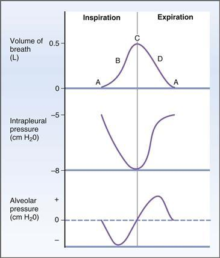

**그림 5–13 정상적인 호흡 주기 동안의 호흡량과 압력.** 흉막내압과 폐포압은 대기압을 기준으로 합니다. *A*부터 *D*까지의 문자는 [그림 5-14](#filepos977471)의 호흡 주기 단계에 해당합니다.

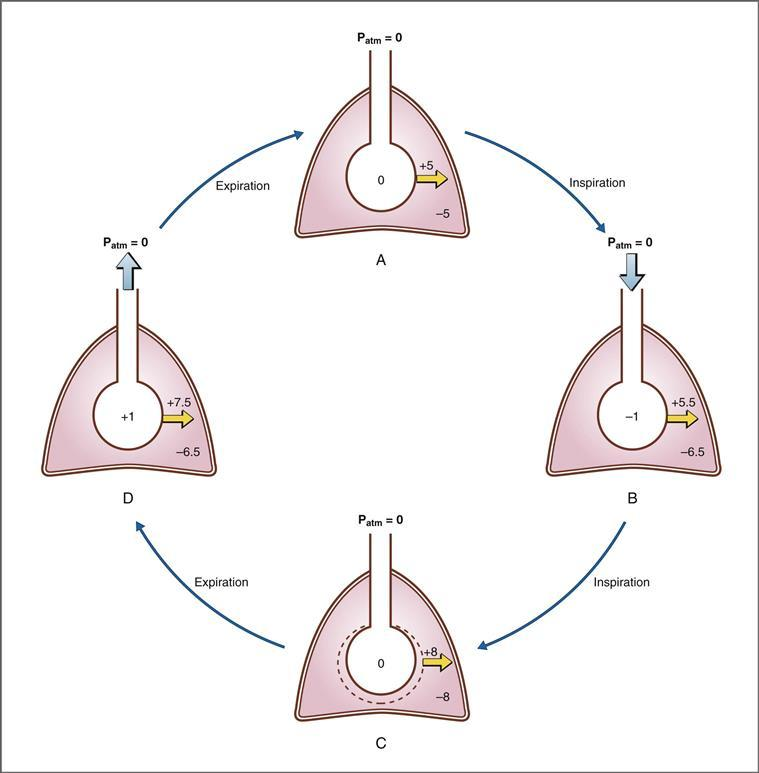

**그림 5–14 정상적인 호흡 주기 중 압력.**
숫자는 대기압(Patm)에 대한 cm H2O 단위의 압력을 나타냅니다. *노란색 화살표* 위의 숫자는 경벽압의 크기를 나타냅니다. *넓은 파란색 화살표*는 폐로 들어오고 나가는 공기 흐름을 보여줍니다. **아,** 휴식; **B,** 영감의 절반; **C,** 영감의 끝; **D,** 만료가 절반 남았습니다.

이 위치에는 현재 귀하의 기기에서 지원되지 않는 비디오 콘텐츠가 있습니다. 이 콘텐츠의 캡션이 아래에 표시됩니다. 

**동영상: 호흡 중 압력**

[그림 5-14](#filepos977471)는 폐(폐포로 표시됨), 흉벽, 폐와 흉벽 사이의 흉막강 내 공간에 대한 친숙한 그림을 보여줍니다. 압력(cm H2O)은 호흡 주기의 여러 지점에서 표시됩니다. 대기압은 0이고, 폐포압과 흉막내압 값이 적절한 공간에 표시되어 있습니다. *노란색 화살표*는 폐를 가로지르는 **경벽압**의 방향과 크기를 나타냅니다. 일반적으로 *경벽압은 폐포압 **-흉막내압**으로 계산됩니다.* 경벽압이 양수인 경우 이는 폐에 대한 팽창 압력이며 노란색 화살표는 바깥쪽을 가리킵니다. 예를 들어, 폐포압이 0이고 흉막내압이 −5 cm H2O인 경우 폐에는 +5 cm H2O(0 − [−5 cm H2O] = +5 cm H2O)의 팽창 압력이 있습니다. 경벽압이 음수인 경우 이는 폐에 대한 붕괴 압력이며 노란색 화살표는 안쪽을 가리킵니다(이 그림에는 표시되지 않음). 정상적인 호흡 주기의 모든 단계에서 폐포 및 흉막내압의 변화에도 불구하고 폐를 가로지르는 경벽압은 항상 열려 있는 상태를 유지합니다. *넓은 파란색 화살표*는 폐로 들어오거나 나가는 공기 흐름의 방향을 나타냅니다.

##### *휴식*

휴식은 횡경막이 평형 위치에 있을 때 호흡 주기 사이의 기간입니다([그림 5-13](#filepos976916) 및 [5-14*A*](#filepos977471) 참조). 휴식 중에는 공기가 폐 안팎으로 이동하지 않습니다. **폐포압은 대기압과 동일하며** 폐압은 항상 대기압을 기준으로 하므로 폐포압은 0이라고 합니다. 대기(입이나 코)와 폐포 사이에 압력 차이가 없기 때문에 정지 상태에서는 공기 흐름이 없습니다.

휴식 시 **흉막내압은 음수** 또는 약 -5 cm H2O입니다. 흉막내압이 음성인 이유는 이전에 설명했습니다. 허탈하려는 폐와 확장하려는 흉벽의 반대 힘으로 인해 흉막내압이 둘 사이에 있는 공간에 음압이 생성됩니다. 외부 음압(즉, 음압 흉막내압)이 폐를 팽창시키거나 확장시킨다는 것을 항아리에 격리된 폐에 대한 실험을 상기해 보십시오. 휴식 시 폐를 가로지르는 경벽압은 +5cm H2O(폐포압 - 흉막내압)이며, 이는 이러한 구조가 열리게 됨을 의미합니다.

안정 시 폐에 존재하는 용적은 평형 용적 또는 **FRC**입니다. 정의에 따르면 이는 정상적인 호기 후 폐에 남아 있는 용적입니다.

##### *영감*

흡기 중에는 **횡경막이 수축**하여 흉곽의 부피가 증가합니다. 폐용적이 증가하면 폐의 압력은 감소해야 합니다. (보일의 법칙에 따르면 P × V는 주어진 온도에서 일정합니다.) 흡기 중간([그림 5-13](#filepos976916) 및 [5-14*B*](#filepos977471) 참조)에서 폐포 압력은 대기압(−1 cm H2O) 아래로 떨어집니다. 대기와 폐포 사이의 압력 구배는 폐로의 공기 흐름을 유도합니다. 흡기가 끝날 때([그림 5-14*C*](#filepos977471) 참조) 폐포 압력이 다시 대기압과 같아질 때까지 공기가 폐로 흐릅니다. 대기와 폐포 사이의 압력 구배가 사라지고 폐로의 공기 흐름이 중단됩니다. 1회 호흡 시 흡기되는 공기량은 **일회 호흡량**(**VT**)이며, 이는 약 0.5L입니다. 따라서 정상적인 흡기가 끝날 때 폐에 존재하는 부피는 기능적 잔류 용량 *더하기* 1회 호흡량(FRC + VT)입니다.

흡기 중에는 **흉막내압이 안정 시보다 *더 부정적***됩니다. 이 효과에 대한 두 가지 설명이 있습니다. (1) 폐 용적이 증가함에 따라 폐의 탄성 반동도 증가하여 흉막내 공간을 더 강하게 당기고 (2) 기도 및 폐포 압력이 부정적이 됩니다.

이 두 가지 효과가 함께 작용하면 흉막내압이 더욱 음압이 되거나 흡기가 끝날 때 약 -8 cm H2O가 됩니다. 흡기 중 흉막내압 변화 정도를 사용하여 폐의 **동적 순응도**를 추정할 수 있습니다.

##### *만료*

일반적으로 만료는 수동적 프로세스입니다. **폐포압은 양의 압력**(대기압보다 높음)이 됩니다. 왜냐하면 폐의 탄성력이 폐포 내 더 많은 양의 공기를 압축하기 때문입니다. 폐포 압력이 대기압 이상으로 증가하면([그림 5-13](#filepos976916) 및 [5-14*D*](#filepos977471) 참조), 공기가 폐 밖으로 흘러나오고 폐의 부피는 FRC로 돌아갑니다. 만료된 볼륨은 일회 호흡량입니다. 만료가 끝나면([그림 5-13](#filepos976916) 및 [5-14*A*](#filepos977471) 참조) 모든 부피와 압력은 정지 상태의 값으로 돌아가고 시스템은 다음 호흡 주기를 시작할 준비가 됩니다.

##### *강제 만료*

강제 호기에서는 사람이 의도적으로 강제로 숨을 내쉬는 것입니다. 호기 근육은 정상적인 수동 호기에서 볼 수 있는 것보다 폐 및 기도 압력을 훨씬 더 긍정적으로 만드는 데 사용됩니다. [그림 5-15](#filepos985079)는 강제호기시 발생하는 압력의 예를 보여준다. 폐가 정상인 사람과 만성 폐쇄성 폐질환(COPD)이 있는 사람을 비교합니다.

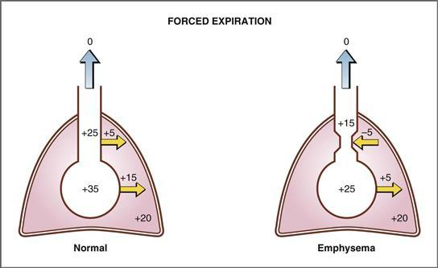

**그림 5–15 정상인과 폐기종이 있는 사람의 강제 호기 중 폐포 및 전도 기도의 압력.** 숫자는 cm H2O 단위의 압력을 나타내며 대기압을 기준으로 표현됩니다. *노란색 화살표* 위의 숫자는 경벽압의 크기를 나타냅니다. *노란색 화살표* 방향은 경벽압력이 확장(*바깥쪽 화살표*)되는지 아니면 붕괴(*내부 화살표*)되는지를 나타냅니다. *파란색 화살표*는 폐로 들어오고 나가는 공기 흐름을 보여줍니다.

**정상적인 폐**를 가진 사람의 경우 강제 호기는 폐와 기도의 압력을 매우 긍정적으로 만듭니다. 기도압과 폐포압은 모두 수동 호기 동안 발생하는 것보다 훨씬 더 높은 값으로 상승합니다. 따라서 정상적인 수동 호기 동안 폐포 압력은 +1 cm H2O입니다([그림 5-14*D*](#filepos977471) 참조). 강제 호기의 예에서 기도압은 +25 cm H2O이고 폐포압은 +35 cm H2O입니다([그림 5-15](#filepos985079) 참조).

강제 호기 동안 호기 근육의 수축으로 인해 흉막내압도 상승하여 이제 +20 cm H2O와 같은 양의 값이 됩니다. 중요한 질문은 *이러한 흉막내 양압 조건에서 폐와 기도가 허탈됩니까?* 아니요, 경벽압이 양압인 한 기도와 폐는 열린 상태로 유지됩니다. 정상적인 강제 호기 동안 기도를 가로지르는 경벽압은 기도압에서 흉막내압을 뺀 값, 즉 +5cm H2O(+25 − [+20] = +5cm H2O)입니다. 폐를 가로지르는 경벽압은 폐포압에서 흉막내압을 뺀 값, 즉 +15cm H2O(+35 − [+20] = +15cm H2O)입니다. 그러므로 경벽압이 양이기 때문에 기도와 폐포는 모두 열린 상태로 유지됩니다. 폐포(+35 cm H2O)와 대기(0) 사이의 압력 구배가 정상보다 훨씬 크기 때문에 호기가 빠르고 강력하게 발생합니다.

그러나 **폐기종**이 있는 사람의 경우 강제로 호기를 하면 기도가 허탈될 수 있습니다. 폐기종에서는 탄력 섬유의 손실로 인해 폐 순응도가 증가합니다. 강제 호기 동안 흉막내압은 정상인과 동일한 값인 +20 cm H2O로 상승합니다. 그러나 탄성 반동이 감소된 구조로 인해 폐포압과 기도압이 정상인에 비해 낮습니다. 폐를 가로지르는 경벽압 구배는 +5 cm H2O의 양의 팽창 압력으로 유지되고 폐포는 열린 상태로 유지됩니다. 그러나 큰 기도는 기도를 가로지르는 경벽 압력 구배가 역전되어 −5 cm H2O의 음(붕괴) 경벽 경압이 되므로 허탈됩니다. 분명히 큰 기도가 허탈되면 기류에 대한 저항이 증가하고 호기가 더 어려워집니다. 폐기종이 있는 사람은 **입술을 오므려** **천천히 숨을 내쉬는 법**을 배웁니다. 이렇게 하면 기도압이 상승하고 큰 기도에 걸쳐 경벽압 구배가 역전되는 것을 방지하여 허탈을 방지할 수 있습니다.

### 가스 교환

호흡계의 가스 교환은 폐와 말초 조직에서 O2와 CO2가 확산되는 것을 의미합니다. O2는 폐포 가스에서 폐 모세 혈관으로 전달되고 궁극적으로 조직으로 전달되어 전신 모세 혈관에서 세포로 확산됩니다. CO2는 조직에서 정맥혈, 폐모세혈관으로 전달되고, 폐포가스로 전달되어 호기됩니다.

#### 가스 법칙

가스 교환 메커니즘은 가스의 기본 특성을 기반으로 하며 용액에서의 거동을 포함합니다. 이 섹션에서는 이러한 원칙을 검토합니다.

##### *일반 가스 법칙*

일반 가스 법칙(화학 과정에서 익숙함)에 따르면 압력과 가스 부피의 곱은 가스의 몰수와 가스 상수, 온도를 곱한 것과 같습니다. 따라서,

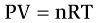

어디서

|  |  |
| --- | --- |
| 피 | = 압력(mmHg) |
| 뷔 | = 부피(L) |
| 엔 | = 몰(mol) |
| R | = 가스 상수 |
| 티 | = 온도(K) |

일반 기체 법칙을 호흡기 생리학에 적용하는 유일한 "비결"은 기체상 BTPS가 사용되지만 액체상에서는 STPD가 사용된다는 것을 아는 것입니다. **BTPS**는 체온(37°C 또는 310K), 주변 압력 및 수증기로 포화된 가스를 의미합니다. 혈액에 용해된 기체의 경우 **STPD**가 사용됩니다. 이는 표준 온도(0°C 또는 273K), 표준 압력(760mmHg) 및 건조 기체를 의미합니다. BTPS의 가스 부피는 부피(BTPS의 경우)에 273/310 × PB-47/760을 곱하여 STPD의 부피로 변환할 수 있습니다(여기서 PB는 기압이고 47mmHg는 37°C에서의 수증기압입니다).

##### *보일의 법칙*

보일의 법칙은 일반 기체법칙의 특별한 경우입니다. 주어진 온도에서 압력과 기체의 부피의 곱은 일정하다는 것입니다. 따라서,

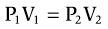

호흡기 시스템에 보일의 법칙을 적용하는 방법은 이전 예에서 논의되었습니다. 횡경막이 수축하여 폐용적을 증가시키는 흡기 동안 발생하는 사건을 상기하십시오. 압력과 용적의 곱을 일정하게 유지하려면 폐용적이 증가함에 따라 폐의 가스 압력이 감소해야 합니다. (이러한 가스 압력의 감소는 폐로의 공기 흐름을 촉진하는 힘입니다.)

##### *돌턴의 부분 압력 법칙*

Dalton의 분압 법칙은 호흡 생리학에 자주 적용됩니다. 혼합 가스에서 가스의 부분압은 가스가 혼합물의 전체 부피를 차지할 경우 발휘되는 압력이라고 말합니다. 따라서 부분압력은 전체 압력에 *건조 가스*의 농도 분율을 곱한 값입니다.

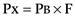

*가습 가스*의 관계는 수증기압에 대한 기압을 보정하여 결정됩니다. 따라서,

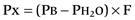

어디서

|  |  |
| --- | --- |
| PX | = 가스 부분압력(mmHg) |
| PB | = 기압(mmHg) |
| PH2O | = 37°C에서의 수증기압(47mmHg) |
| F | = 가스의 분수 농도(단위 없음) |

그러면 Dalton의 부분압력 법칙에 따라 혼합물에 있는 모든 기체의 부분압력의 합은 혼합물의 전체 압력과 같습니다. 따라서 기압(PB)은 O2, CO2, N2 및 H2O 부분압의 합입니다. 기압 760mmHg에서 건조 공기의 가스 비율(괄호 안의 F에 해당하는 값)은 다음과 같습니다. O2, 21%(0.21); N2, 79%(0.79); 및 CO2, 0%(0). 공기는 기도 내에서 가습되기 때문에 수증기압은 필수이며 37°C에서 47mmHg와 같습니다.

**샘플 문제.** 건조 흡기 공기의 O2(PO2) 부분압을 계산하고 해당 값을 37°C의 가습된 기관 공기의 PO2와 비교합니다. 흡기 공기 중 O2의 농도는 0.21입니다.

**해결책.** 건조 흡기 공기의 PO2는 혼합 가스의 압력(즉, 기압)에 O2의 농도 분율(0.21)을 곱하여 계산됩니다. 따라서 *건조한 흡기 공기*에서는

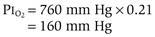

가습된 기관 공기의 PO2는 건조 흡기 공기의 PO2보다 낮습니다. 왜냐하면 총 압력은 수증기압(또는 37°C에서 47mmHg)에 대해 보정되어야 하기 때문입니다. 따라서 *가습된 기관 공기에서*

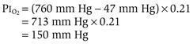

##### *용존 가스 농도에 관한 헨리의 법칙*

헨리의 법칙은 **용액에 용해된 기체**(예: 혈액)를 다룹니다. O2와 CO2는 모두 폐를 오가는 도중에 혈액(용액)에 용해됩니다. 액상의 가스 농도를 계산하려면 먼저 기상의 분압을 액상의 분압으로 변환합니다. 다음으로, 액체의 부분압이 액체의 농도로 변환됩니다.

반드시 자명하지는 않지만 중요한 점은 평형 상태에서 *액체 상태의 기체 부분압력이 기체 상태의 부분 압력과 동일하다는 점입니다.* 따라서 폐포 공기의 PO2가 100mmHg이면 폐포 공기와 평형을 이루는 모세혈의 PO2도 100mmHg가 됩니다. 헨리의 법칙은 액체 상태의 기체 분압을 액체 상태(예: 혈액 내)의 기체 농도로 변환하는 데 사용됩니다. 용액 내 가스 농도는 부피 백분율(%) 또는 혈액 100mL당 가스 부피(mL 가스/100mL 혈액)로 표시됩니다.

따라서 혈액의 경우,

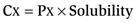

어디서

|  |  |
| --- | --- |
| CX | = 용존 가스 농도(mL 가스/100mL 혈액) |
| PX | = 가스 부분압력(mmHg) |
| 용해도 | = 혈액 내 가스 용해도(mL 가스/100mL 혈액/mmHg) |

마지막으로, 용액 내 가스의 농도는 용액 내에 존재하지 않는 *용해된 가스*에만 적용되며(헨리의 법칙에 따라 계산됨) 결합 형태로 존재하는 가스(예: 헤모글로빈이나 혈장 단백질에 결합된 가스)는 포함되지 않는다는 점을 이해하는 것이 중요합니다.

**예제 문제.** 동맥혈의 PO2가 100mmHg인 경우, O2의 용해도가 0.003mL O2/100mL 혈액/mmHg인 경우 혈액 내 용존 O2 농도는 얼마입니까?

**해결책.** 동맥혈의 용존 O2 농도를 계산하려면 다음과 같이 PO2에 용해도를 곱하면 됩니다.

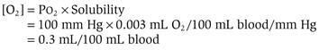

#### 가스 확산 - 픽의 법칙

세포막이나 모세혈관 벽을 통한 가스 이동은 [1장](CR%21G9RE0KW4PD33Q9F3DXNCSBNXCANP_split_007.html#filepos27757)에서 논의되는 **단순 확산**에 의해 발생합니다. 가스의 경우 확산에 의한 전달 속도(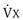)는 추진력, 확산 계수 및 확산에 사용할 수 있는 표면적에 정비례합니다. 이는 멤브레인 장벽의 두께에 반비례합니다. 따라서,

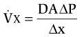

어디서

|  |  |
| --- | --- |
| 이미지 | = 단위 시간당 이동된 가스의 양 |
| 디 | = 가스의 확산계수 |
| A | = 표면적 |
| ΔP | = 가스의 부분압력차 |
| Δx | = 멤브레인의 두께 |

가스 확산과 관련하여 두 가지 특별한 점이 있습니다. (1) 가스 확산의 원동력은 농도 차이가 *아님* 막을 통과하는 **가스의 부분 압력 차이**(Δ**P**)입니다. 따라서 폐포 공기의 PO2가 100mmHg이고 폐모세혈관으로 들어가는 혼합 정맥혈의 PO2가 40mmHg라면, 폐포/폐 모세혈관 장벽을 가로지르는 O2의 부분압 차 또는 추진력은 60mmHg(100mmHg − 40mmHg)입니다. (2) **가스의 확산계수**(**D**)는 분자량에 따라 달라지는 일반적인 확산계수([Chapter 1](CR%21G9RE0KW4PD33Q9F3DXNCSBNXCANP_split_007.html#filepos27757) 참조)와 가스의 용해도를 조합한 것입니다. CO2와 O2의 확산 속도 차이로 설명되는 것처럼 가스의 확산 계수는 확산 속도에 막대한 영향을 미칩니다. CO2의 확산 계수는 O2의 확산 계수보다 약 20배 더 높습니다. 결과적으로 주어진 부분 압력 차이에 대해 CO2는 O2보다 약 20배 빠르게 확산됩니다.

확산에 대한 이전 방정식의 여러 항은 **폐 확산 능력**(**DL**)이라는 단일 항으로 결합될 수 있습니다. DL은 가스의 확산 계수, 멤브레인의 표면적(A) 및 멤브레인의 두께(Δx)를 결합합니다. DL은 또한 가스가 폐 모세혈관의 단백질과 결합하는 데 필요한 시간(예: 적혈구의 헤모글로빈에 O2 결합)을 고려합니다. 폐포/폐 모세혈관 장벽을 통한 CO 전달은 확산 과정에 의해서만 제한되기 때문에 DL은 일산화탄소(**CO**)로 측정할 수 있습니다. DLCO는 피험자가 낮은 농도의 CO를 포함하는 가스 혼합물을 호흡하는 단일 호흡 방법을 사용하여 측정됩니다. 가스 혼합물에서 CO가 사라지는 속도는 DL에 비례합니다. 다양한 질병에서 DL은 예측 가능한 방식으로 변화합니다. 예를 들어 **폐기종**에서는 폐포가 파괴되어 가스 교환을 위한 표면적이 감소하기 때문에 DL이 감소합니다. **섬유증** 또는 **폐부종**에서는 확산 거리(막 두께 또는 간질 부피)가 증가하기 때문에 DL이 감소합니다. **빈혈**에서는 적혈구의 헤모글로빈 양이 감소하기 때문에 DL이 감소합니다(DL에는 O2 교환의 단백질 결합 성분이 포함되어 있음을 기억하십시오). **운동 중에** DL은 추가 모세혈관에 혈액이 관류되어 가스 교환을 위한 표면적이 증가하기 때문에 증가합니다.

#### 용액 내 기체 형태

폐포 공기에는 부분압으로 표현되는 한 가지 형태의 가스가 있습니다. 그러나 혈액과 같은 용액에서는 가스가 추가적인 형태로 운반됩니다. 용액에서는 기체가 용해되거나, 단백질에 결합되거나, 화학적으로 변형될 수 있습니다. *용액 내 총 가스 농도는 용존 가스, 결합 가스, 화학적으로 변형된 가스의 합이라는 점을 이해하는 것이 중요합니다.*

 **용존 기체.** 용액 내 모든 기체는 어느 정도 용해된 형태로 운반됩니다. **헨리의 법칙**은 기체의 부분압과 용액 내 농도 사이의 관계를 나타냅니다. 주어진 부분 압력에서 기체의 용해도가 높을수록 용액 내 기체의 농도도 높아집니다. 용액에서는 *용해된* 기체 분자만이 부분압에 영향을 미칩니다. 즉, 결합 가스와 화학적으로 변형된 가스는 부분압에 영향을 미치지 않습니다.  
    흡기된 공기에서 발견되는 가스 중 질소(N2)는 *오직* 용해된 형태로 운반되며 결합되거나 화학적으로 변형되지 않는 유일한 기체입니다. 이러한 단순화된 특성으로 인해 N2는 호흡 생리학의 특정 측정에 사용됩니다.

 **결합 기체.** O2, CO2 및 일산화탄소(CO)는 혈액 내 단백질과 결합되어 있습니다. O2와 CO는 적혈구 내부의 헤모글로빈과 결합하여 이러한 형태로 운반됩니다. CO2는 적혈구의 헤모글로빈과 혈장 단백질에 결합합니다.

 **화학적으로 변형된 가스.** 화학적으로 변형된 가스의 가장 중요한 예는 탄산탈수효소의 작용에 의해 적혈구에서 CO2가 중탄산염(HCO3−)으로 전환되는 것입니다. 실제로 대부분의 CO2는 용해된 CO2나 결합된 CO2가 아닌 HCO3-의 형태로 혈액 내에서 운반됩니다.

#### 개요—폐의 가스 수송

폐포와 인근 폐모세혈관은 [그림 5-16](#filepos1007496)과 같다. 다이어그램은 폐 모세혈관이 오른쪽 심장의 혈액(혼합 정맥혈과 동일)으로 관류되는 것을 보여줍니다. 그런 다음 폐포 가스와 폐 모세 혈관 사이에서 가스 교환이 발생합니다. O2는 폐포 가스에서 폐 모세 혈관으로 확산되고 CO2는 폐 모세 혈관에서 폐포 가스로 확산됩니다. 폐모세혈관을 떠나는 혈액은 왼쪽 심장으로 전달되어 전신동맥혈이 됩니다.

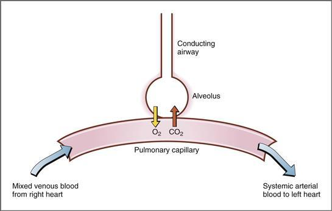

**그림 5–16 폐포와 인근 폐모세혈관의 도식.** 혼합 정맥혈이 폐모세혈관으로 들어갑니다. O2는 폐모세혈관 혈액에 추가되고 CO2는 폐포/모세혈관 장벽을 통과하여 제거됩니다. 전신 동맥혈은 폐 모세 혈관을 떠납니다.

[그림 5-17](#filepos1008532)은 PO2 및 PCO2 값이 건조한 흡기 공기, 가습된 기관 공기, 폐포 공기, 폐 모세혈관으로 들어가는 혼합 정맥혈, 폐 모세 혈관에서 나가는 전신 동맥혈 등 다양한 부위에 포함된 이 체계에 대해 자세히 설명합니다.

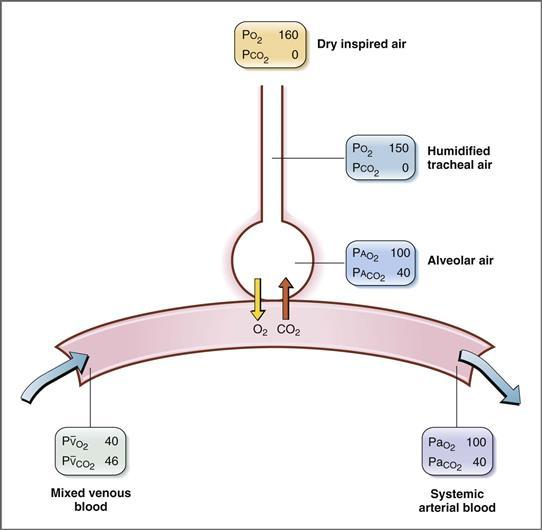

**그림 5–17 건조한 흡기 공기, 가습된 기관 공기, 폐포 공기 및 폐 모세혈관의 PO2 및 PCO2 값.** 숫자는 mmHg 단위의 분압입니다. 는 생리적 션트 때문에 실제로 100mmHg보다 약간 낮습니다.

 **건조한 흡기 공기**에서 PO2는 약 160mmHg이며, 이는 기압에 O2의 농도 분율 21%(760mmHg × 0.21 = 160mmHg)를 곱하여 계산됩니다. 실용적인 목적을 위해 건조한 흡기 공기에는 CO2가 없으며 PCO2는 0입니다.

 **가습된 기관 공기**에서는 공기가 수증기로 완전히 포화되는 것으로 가정됩니다. 37°C에서 PH2O는 47mmHg입니다. 따라서 건조한 흡기 공기에 비해 O2가 수증기에 의해 "희석"되기 때문에 PO2가 감소합니다. 다시 말하지만, 가습된 공기의 부분압은 수증기압에 대한 기압을 수정한 다음 가스의 농도 부분을 곱하여 계산된다는 점을 기억하십시오. 따라서 가습된 기관 공기의 PO2는 150mmHg([760mmHg − 47mmHg] × 0.21 = 150mmHg)입니다. 흡기 공기에는 CO2가 없기 때문에 가습된 기관 공기의 PCO2도 0입니다. 가습된 공기는 가스 교환이 일어나는 폐포로 들어갑니다.

 **폐포 공기**에서는 흡기 공기와 비교할 때 PO2 및 PCO2 값이 크게 변경됩니다. (폐포 공기의 부분압 표기는 수식어 “A”를 사용합니다. [표 5-1](#filepos897400) 참조.) 는 흡기보다 작은 100mmHg이고, 는 흡기보다 큰 40mmHg입니다. 이러한 변화는 O2가 폐포 공기를 떠나 폐모세혈관 혈액에 추가되고, CO2가 폐모세혈관 혈액을 떠나 폐포 공기로 들어가기 때문에 발생합니다. 일반적으로 폐포와 폐모세혈관 사이에 전달되는 O2와 CO2의 양은 신체의 필요량과 일치합니다. 따라서 매일 폐포 공기 *로부터* 전달되는 O2는 신체의 O2 소비량과 동일하며, 폐포 공기 *로* 전달되는 CO2는 CO2 생산량과 같습니다.

 폐모세혈관으로 들어가는 혈액은 **혼합정맥혈**입니다. 이 혈액은 조직에서 정맥을 거쳐 우심장으로 되돌아옵니다. 그런 다음 우심실에서 폐동맥으로 펌핑되어 폐모세혈관으로 전달됩니다. 이 혼합 정맥혈의 구성은 조직의 대사 활동을 반영합니다. 조직이 O2를 흡수하고 소비하기 때문에 PO2는 40mmHg로 상대적으로 낮습니다. PCO2는 조직이 CO2를 생성하여 정맥혈에 추가했기 때문에 46mmHg로 상대적으로 높습니다.

 폐 모세혈관을 떠나는 혈액은 *동맥화*(산소화)되어 **전신 동맥혈**이 됩니다.(전신 동맥혈에 대한 표기법은 수식어 "a"를 사용합니다. [표 5-1](#filepos897400)을 참조하십시오.) 동맥화는 폐포 공기와 폐 사이의 O2 및 CO2 교환에 의해 영향을 받습니다. 모세혈관. 폐포/모세혈관 장벽을 통한 가스 확산이 빠르기 때문에 폐모세혈관에서 나가는 혈액은 일반적으로 폐포 공기와 동일한 PO2 및 PCO2를 갖습니다(즉, 완전한 평형이 있음). 따라서 는 100mmHg이고 는 40mmHg입니다. 마찬가지로 는 100mmHg이고 는 40mmHg입니다. 이 동맥화된 혈액은 이제 왼쪽 심장으로 되돌아가 좌심실에서 대동맥으로 펌핑되어 순환을 다시 시작합니다.  
    폐포 공기와 전신 동맥혈 사이에는 약간의 불일치가 있습니다. 전신 동맥혈은 폐포 공기보다 PO2가 약간 낮습니다. 이러한 불일치는 폐포를 우회하여 동맥화되지 않는 폐혈류의 작은 부분을 나타내는 **생리적 션트**의 결과입니다.  
    생리적 션트에는 기관지 혈류와 산소 공급을 위해 폐로 가는 대신 좌심실로 직접 배출되는 관상 정맥혈의 작은 부분이라는 두 가지 출처가 있습니다. 생리적 션트는 여러 병리학적 상태(**환기/관류 결함**이라고 함)에서 증가합니다. 션트의 크기가 커지면 폐포 가스와 폐모세혈관 혈액 사이의 평형이 제대로 이루어지지 않고 폐모세혈관 혈액이 완전히 동맥화되지 않습니다. 이 장의 뒷부분에서 논의되는 **A − 차이**는 폐포 가스("A")와 전신 동맥혈("a") 간의 PO2 차이를 나타냅니다. 션트가 작은 경우(즉, 생리학적) A - 차이는 작거나 무시할 수 있습니다. 션트가 정상보다 크면 평형이 발생하지 않는 정도까지 A - 차이가 증가합니다.

[그림 5-17](#filepos1008532)의 다이어그램은 폐에서 일어나는 PO2와 PCO2의 변화를 강조하고 있다. 그림에는 표시되지 않았지만 전신 동맥혈과 혼합 정맥혈의 차이에서 알 수 있듯이 **전신 조직**에서 발생하는 교환 과정이 있습니다. 전신 동맥혈은 조직으로 전달되고, 여기서 O2는 전신 모세혈관에서 조직으로 확산되고 소비되어 조직에서 모세 혈관으로 확산되는 CO2를 생성합니다. 조직에서의 이러한 가스 교환은 전신 동맥혈을 혼합 정맥혈로 변환한 후 모세혈관을 떠나 우심장으로 돌아와 폐로 전달됩니다.

#### 확산 제한 및 관류 제한 가스 교환

폐포/폐 모세혈관 장벽을 통한 가스 교환은 확산 제한 또는 관류 제한으로 설명됩니다.

 **확산 제한** 가스 교환은 폐포-모세혈관 장벽을 통해 운반되는 가스의 총량이 *확산 과정*에 의해 제한된다는 의미입니다. 이러한 경우 가스의 부분 압력 구배가 유지되는 한 확산은 모세관 길이를 따라 계속됩니다.

 **관류 제한** 가스 교환은 폐포/모세혈관 장벽을 통해 운반되는 가스의 총량이 폐 모세혈관을 통한 *혈류*(즉, 관류)에 의해 제한된다는 의미입니다. 관류 제한 교환에서는 *부분압력 구배가 유지되지 않으며* 이 경우 운반되는 가스의 양을 늘릴 수 있는 유일한 방법은 혈류를 증가시키는 것입니다.

확산 제한 및 관류 제한 교환에 의해 전달되는 가스의 예는 이러한 프로세스를 특성화하는 데 사용됩니다([그림 5-18](#filepos1018280)). 그림에서 *빨간색 실선*은 모세혈관 길이에 따른 폐모세혈관 혈액 내 가스 분압(Pa)을 보여줍니다. 각 패널 상단에 있는 *녹색 점선*은 폐포 공기(PA)의 가스 부분 압력을 나타내며 이는 일정합니다. *회색으로 표시된 분홍색 영역*은 모세혈관 길이에 따른 폐포 가스와 폐모세혈관 혈액 사이의 **부분 압력 구배**를 나타냅니다. 부분 압력 구배는 가스 확산의 원동력이기 때문에 음영 영역이 클수록 구배도 커지고 가스의 순 전달도 커집니다.

**그림 5–18 폐포 공기와 폐모세혈관 사이의 확산 제한(A) 및 관류 제한(B) 가스 교환.** 폐 모세혈관 내 가스 분압은 *빨간색 실선*으로 모세혈관 길이의 함수로 표시됩니다. 그림 상단의 *녹색 점선*은 폐포 공기(PA) 내 가스 분압을 보여줍니다. *회색으로 표시된 분홍색 영역*은 폐포 공기와 폐모세혈관 혈액 사이의 분압 차이 크기를 나타내며, 이는 가스 확산의 원동력입니다. CO, 일산화탄소; N2O, 아산화질소.

두 가지 예가 나와 있습니다. CO는 확산 제한 가스([그림 5-18*A*](#filepos1018280) 참조)이고, 아산화질소(N2O)는 관류 제한 가스입니다([그림 5-18*B*](#filepos1018280) 참조). CO 또는 N2O는 폐포 가스에서 폐 모세 혈관으로 확산되고 결과적으로 가스에 대한 Pa는 모세 혈관의 길이를 따라 증가하여 PA 값에 접근하거나 도달합니다. Pa 값이 PA 값에 도달하면 완전한 평형이 발생한 것입니다. 일단 평형이 이루어지면 확산을 위한 원동력은 더 이상 존재하지 않으며(즉, 부분압 구배가 더 이상 존재하지 않음), 혈류가 증가하지 않는 한(즉, 더 많은 혈액이 폐 모세혈관으로 유입됨) 가스 교환이 중단됩니다.

##### *확산 제한 가스 교환*

확산 제한 가스 교환은 폐포/폐 모세혈관 장벽을 통과하는 **CO**의 이동으로 설명됩니다([그림 5-18*A*](#filepos1018280) 참조). 이는 또한 격렬한 운동** 및 **폐기종** 및 **섬유증**과 같은 병리학적 상태에서 **O2의 이동으로 설명됩니다.**

점선으로 표시된 폐포 공기(PACO)의 CO 부분압은 모세관의 길이를 따라 일정합니다. 폐모세혈관 초기에는 폐포 공기로부터 전달된 CO가 없고 모세혈관 내 CO 분압(PaCO)이 0이므로 혈액에 CO가 없습니다. 따라서 모세혈관이 시작될 때 CO에 대한 부분압력 구배가 가장 크고 CO가 폐포 공기에서 혈액으로 확산되는 원동력이 가장 큽니다. CO가 폐모세혈관으로 확산되면서 폐모세혈관의 길이를 따라 이동하면서 PaCO가 상승하기 시작합니다. 결과적으로 확산을 위한 부분압력 구배가 감소합니다. PaCO는 모세혈관 길이를 따라 약간만 상승합니다. 그러나 모세혈관에서 CO는 적혈구 내부의 헤모글로빈에 결합되어 있기 때문입니다. CO가 헤모글로빈에 결합되면 용액 내에서 자유로울 수 없으므로 부분압이 생성되지 않습니다. (자유 용해된 기체만이 부분 압력을 유발한다는 점을 상기하십시오.) 따라서 CO와 헤모글로빈의 결합은 유리 CO 농도와 부분 압력을 낮게 유지하여 모세관의 *전체* 길이를 따라 확산 구배를 유지합니다.

요약하면, CO가 폐 모세혈관으로 순 확산되는 것은 CO가 모세혈관의 헤모글로빈에 결합되어 있기 때문에 유지되는 부분압 구배의 크기에 따라 달라지거나 "제한"됩니다. 따라서 **CO는 모세관이 끝날 때까지 평형을 이루지 않습니다**. 실제로 모세관이 더 길면 순확산은 무기한으로 계속되거나 평형이 이루어질 때까지 계속됩니다.

##### *관류 제한 가스 교환*

관류 제한 가스 교환은 **N2O**([그림 5-18*B*](#filepos1018280) 참조)로 표시되지만 **O2(정상 조건에서)** 및 **CO2**로도 표시됩니다. N2O는 혈액에서는 전혀 *결합되지* 않으나 용액에서는 완전히 자유롭기 때문에 관류 제한 교환의 전형적인 예로 사용됩니다. CO의 예에서와 같이 PAN2O는 일정하며 PaN2O는 폐모세혈관의 시작 부분에서 0으로 가정됩니다. 따라서 초기에는 폐포 가스와 모세 혈관 사이에 N2O에 대한 부분압 구배가 크고 N2O는 폐 모세 혈관으로 빠르게 확산됩니다. N2O의 *전부*는 혈액 속에 자유롭게 남아 있기 때문에 *전부*는 부분압을 생성합니다. 따라서 폐 모세혈관의 N2O 분압은 급격히 증가하고 모세혈관의 처음 1/5에서 폐포 가스와 완전히 평형을 이룹니다. 일단 평형이 이루어지면 더 이상 부분 압력 구배가 없으므로 확산을 위한 추진력도 더 이상 존재하지 않습니다. N2O의 순 확산은 중단되지만 모세관의 4/5는 남아 있습니다.

N2O의 음영 영역([그림 5-18*B*](#filepos1018280) 참조)과 CO의 음영 영역([그림 5-18*A*](#filepos1018280) 참조)을 비교합니다. N2O의 훨씬 작은 음영 영역은 두 가스 간의 차이를 나타냅니다. N2O의 평형이 발생하기 때문에 N2O의 순 확산을 증가시키는 유일한 방법은 혈류를 증가시키는 것입니다. 더 많은 "새로운" 혈액이 폐 모세혈관에 공급되면 더 많은 *총* N2O가 혈액에 추가될 수 있습니다. 따라서 혈류 또는 관류는 관류 제한으로 설명되는 N2O의 순 이동을 결정하거나 "제한"합니다.

##### *O2 수송 - 관류 제한 및 확산 제한*

정상적인 조건에서 폐 모세혈관으로의 O2 수송은 관류에 의해 제한되지만, 다른 조건(예: 섬유증 또는 격렬한 운동)에서는 확산에 제한됩니다. [그림 5-19](#filepos1025144)는 두 가지 조건을 모두 보여준다.

**그림 5–19 정상인과 섬유증 환자의 폐 모세혈관 길이에 따른 O2 확산.**
**A,** 해수면 기준; **B,** 높은 고도에서.

 **관류 제한 O2 수송.** 휴식 중인 정상인의 폐에서 폐포 공기에서 폐 모세혈관으로의 O2 전달은 *관류* 제한적입니다(N2O가 관류 제한되는 극단적이지는 않지만)([그림 5-19*A*](#filepos1025144) 참조). 는 100mmHg에서 일정합니다. 모세혈관의 시작 부분에서 는 40mmHg로 혼합 정맥혈의 구성을 반영합니다. 폐포 공기와 모세혈관 사이에는 O2에 대한 부분압력 구배가 크며, 이로 인해 O2가 모세혈관으로 확산됩니다. 폐모세혈관 혈액에 O2가 첨가되면 가 증가합니다. O2가 헤모글로빈에 결합하여 자유 O2 농도와 부분압이 낮게 유지되기 때문에 확산 구배는 초기에 유지됩니다. O2의 평형은 모세혈관을 따라 거리의 약 1/3에서 발생하며, 이 지점에서 는 와 동일해지며, 혈류가 증가하지 않는 한 O2의 순 확산은 더 이상 있을 수 없습니다. 따라서 정상적인 조건에서는 O2 수송이 관류로 제한됩니다. 관류 제한 O2 교환을 설명하는 또 다른 방법은 폐혈류가 순 O2 전달을 결정한다고 말하는 것입니다. 따라서, 폐혈류의 증가(예: 운동 중)는 운반되는 O2의 총량을 증가시키고, 폐혈류의 감소는 운반되는 총 O2의 양을 감소시킵니다.

 **확산이 제한된 O2 전달.** 특정 병리학적 상태(예: **섬유증**) 및 **격렬한 운동** 중에는 O2 전달이 *확산* 제한됩니다. 예를 들어, 섬유증에서는 폐포 벽이 두꺼워져 가스의 확산 거리가 증가하고 DL이 감소합니다([그림 5-19*A*](#filepos1025144) 참조). 확산 거리가 증가하면 O2의 확산 속도가 느려지고 폐포 공기와 폐 모세혈관 혈액 사이의 O2 평형이 방해됩니다. 이러한 경우, O2에 대한 부분 압력 구배는 모세관의 전체 길이를 따라 유지되어 이를 확산 제한 과정으로 변환합니다(CO의 예처럼 극단적이지는 않지만; [그림 5-18*A*](#filepos1018280) 참조). 모세혈관의 전체 길이에 걸쳐 부분 압력 구배가 유지되기 때문에, 전달된 O2의 총량이 정상 폐를 가진 사람보다 섬유증이 있는 사람에게서 더 많은 것처럼 보일 수 있습니다. O2 부분압 구배가 모세혈관의 더 긴 길이에 대해 유지되는 것은 사실이지만(섬유증에서 DL이 현저하게 감소하기 때문에) O2의 전체 이동은 여전히 ​​크게 감소합니다. 폐모세혈관 말단에서는 폐포공기와 폐모세혈관 혈액 사이의 평형이 이루어지지 않았으며( < ) 이는 전신 동맥혈에서는  감소로 반영되고 혼합에서는  감소로 나타납니다. 정맥혈.

 **고도에서의 O2 수송.** 높은 고도로의 상승은 O2 평형 과정의 일부 측면을 변경합니다. 높은 고도에서는 기압이 감소하고 흡기 공기의 O2 비율이 동일하면 폐포 가스의 O2 부분압도 감소합니다. [그림 5-19*B*](#filepos1025144)*,*의 예에서는
는 정상 수치인 100mmHg에 비해 50mmHg로 감소합니다. 혼합 정맥 PO2는 25mmHg입니다(정상 값인 40mmHg와 반대). 따라서 높은 고도에서는 O2에 대한 부분압력 구배가 해수면에 비해 크게 감소합니다([그림 5-19*A*](#filepos1025144) 참조). 폐 모세혈관의 시작 부분에서도 경사도는 해수면의 일반적인 경사도 60mmHg(100mmHg - 40mmHg) 대신 25mmHg(50mmHg - 25mmHg)에 불과합니다. 이러한 부분 압력 구배의 감소는 O2의 확산이 감소하고 평형이 모세관을 따라 더 느리게 발생하며 완전한 평형이 모세관을 따라 나중 지점(해수면에서 모세관 길이의 1/3에 비해 높은 고도에서 모세관 길이의 2/3)에서 달성된다는 것을 의미합니다. 의 최종 평형값은 50mmHg에 불과합니다. 는 50mmHg에 불과하기 때문입니다(평형값이 50mmHg를 초과하는 것은 불가능합니다). **섬유증**이 있는 사람의 경우 높은 고도에서 O2의 느린 평형이 과장됩니다. 폐 모세혈관 혈액은 모세혈관 말단까지 평형을 이루지 못하여  값이 30mmHg만큼 낮아져 조직으로의 O2 전달을 심각하게 손상시킵니다.