# 6 Renal Physiology

xml 버전='1.0' 인코딩='utf-8'?

생리학

## *신장 생리학*

> [해부 및 혈액공급](#filepos1183437)

> [체액](#filepos1189887)

> [신장 청소](#filepos1220767)

> [신장혈류](#filepos1229146)

> [사구체여과](#filepos1250110)

> [재흡수 및 분비](#filepos1280731)

> [단일 네프론과 관련된 용어](#filepos1311766)

> [나트륨 균형](CR%21G9RE0KW4PD33Q9F3DXNCSBNXCANP_split_016.html#filepos1322603)

> [칼륨 균형](CR%21G9RE0KW4PD33Q9F3DXNCSBNXCANP_split_016.html#filepos1374126)

> [인산염, 칼슘, 마그네슘 균형](CR%21G9RE0KW4PD33Q9F3DXNCSBNXCANP_split_016.html#filepos1409463)

> [수분 균형 - 소변의 농도 및 희석](CR%21G9RE0KW4PD33Q9F3DXNCSBNXCANP_split_016.html#filepos1424288)

> [요약](CR%21G9RE0KW4PD33Q9F3DXNCSBNXCANP_split_016.html#filepos1475719)

> [도전해보세요](CR%21G9RE0KW4PD33Q9F3DXNCSBNXCANP_split_016.html#filepos1480544)

신장은 여러 가지 기능으로 기능합니다. 배설 기관인 신장은 과도하거나 유해한 물질이 적절한 양만큼 소변으로 배설되도록 합니다. 조절 기관인 신장은 용질과 수분의 배설을 다양하게 하여 체액의 양과 구성을 일정하게 유지합니다. 마지막으로 내분비 기관인 신장은 세 가지 호르몬인 레닌, 에리스로포이에틴, 1,25-디하이드록시콜레칼시페롤을 합성하고 분비합니다.

### 해부학 및 혈액 공급

#### 신장의 전체적인 해부학적 특징

신장은 신체의 후복막강에 위치한 콩 모양의 기관입니다. 시상면에서 신장은 세 가지 주요 영역으로 구성됩니다([그림 6-1](#filepos1184450)). (1) **피질**은 신장 피막 바로 아래에 위치한 외부 영역입니다. (2) **수질**은 중앙 영역으로 외부 수질과 내부 수질로 구분됩니다. 외부 수질에는 외부 줄무늬와 내부 줄무늬가 있습니다. (3) **유두**는 내부 수질의 가장 안쪽 끝 부분이며 요관의 확장인 작은 꽃받침과 큰 꽃받침이라고 불리는 주머니로 비워집니다. 각 신장의 소변은 요관으로 배출되어 저장 및 후속 제거를 위해 방광으로 운반됩니다.

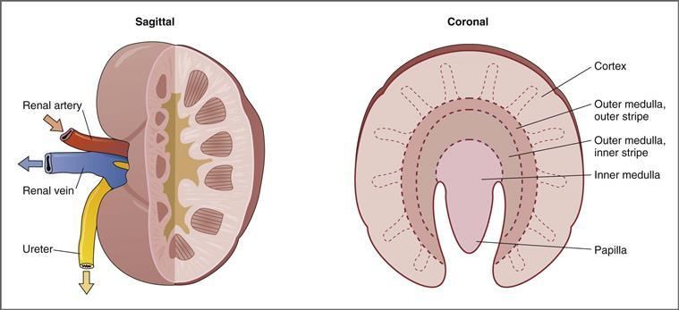

**그림 6-1 신장의 시상면과 관상면.**

#### 네프론의 구조

신장의 기능 단위는 네프론입니다. 각 신장에는 약 100만 개의 네프론이 들어있습니다([그림 6-2](#filepos1185688)). 네프론은 사구체와 세뇨관으로 구성됩니다. 사구체는 구심성 세동맥에서 나오는 **사구체 모세혈관 네트워크**입니다. 사구체 모세혈관은 네프론의 첫 번째 부분과 이어지는 **보우만낭**(또는 **보우만공간**)으로 둘러싸여 있습니다. 혈액은 사구체 모세혈관을 거쳐 보우만 공간으로 한외여과되며, 이는 소변 형성의 첫 번째 단계입니다. 네프론의 나머지 부분은 재흡수 및 분비 기능을 수행하는 상피 세포가 늘어선 관형 구조입니다.

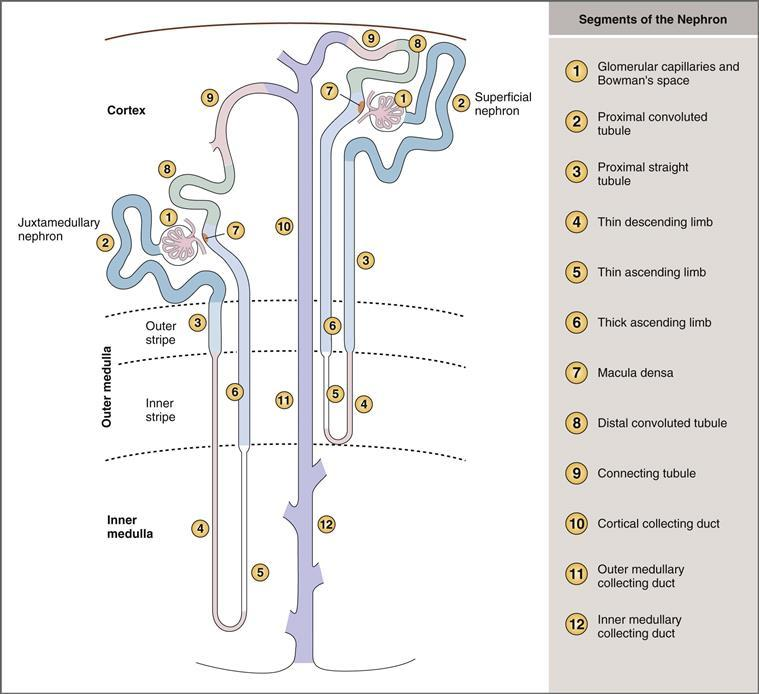

**그림 6-2 표층 네프론과 골수옆 네프론의 분절.**

네프론 또는 신장 세뇨관은 근위곡세뇨관, 근위직선세뇨관, 헨레고리(얇은 하강지, 얇은 상승지, 두꺼운 상승지를 포함), 원위곡세뇨관, 집합관 등의 부분(보우만 공간에서 시작)으로 구성됩니다. 네프론의 각 분절은 기능적으로 구별되며, 각 분절을 둘러싸고 있는 상피세포는 서로 다른 미세구조를 가지고 있습니다([그림 6-3](#filepos1186920)). 예를 들어, 근위곡세뇨관의 세포는 관강측에 브러쉬 경계(brush border)라고 불리는 미세융모가 광범위하게 발달되어 있다는 점에서 독특합니다. 브러시 경계는 근위 세뇨관의 주요 재흡수 기능을 위한 넓은 표면적을 제공합니다. 세포 미세구조와 기능 사이의 다른 상관관계는 이 장 전체에서 강조될 것입니다.

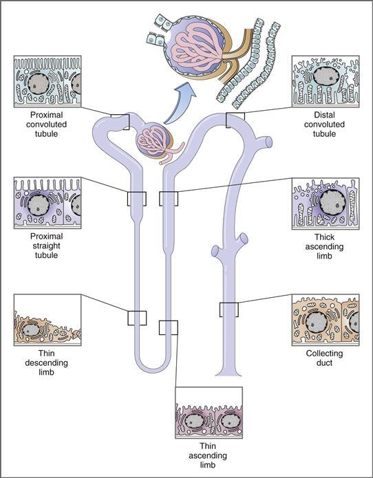

**그림 6–3 네프론의 개략도.** 네프론의 주요 부분에 대한 미세구조적 특징이 표시됩니다.

네프론에는 표재성 피질 네프론과 수질옆 네프론의 두 가지 유형이 있으며 사구체의 위치에 따라 구별됩니다. **표층 피질 네프론**은 외부 피질에 사구체가 있습니다. 이 네프론은 외부 수질로만 내려가는 비교적 짧은 헨레 고리를 가지고 있습니다. **수질옆 네프론**은 피질수질 경계 근처에 사구체를 가지고 있습니다. 수질옆 네프론의 사구체는 표층 피질 네프론의 사구체보다 크므로 사구체 여과율이 더 높습니다. 수질옆 네프론은 내부 수질과 유두 속으로 깊숙이 내려가는 긴 헨레 고리가 특징이며 소변 농축에 필수적입니다.

#### 신장 혈관계

혈액은 신장동맥을 통해 각 신장으로 들어가고, 신장동맥은 엽간동맥, 궁상동맥, 피질요골동맥으로 갈라집니다. 가장 작은 동맥은 *첫 번째* 세동맥 세트인 **구심 세동맥**으로 세분됩니다. 수입 세동맥은 한외여과가 일어나는 *첫 번째* 모세혈관 네트워크인 **사구체 모세혈관**에 혈액을 전달합니다. 혈액은 *두 번째* 세동맥인 **원심 세동맥**을 통해 사구체 모세혈관에서 빠져나가며, 이 **원심 세동맥**은 혈액을 *두 번째* 모세 혈관 네트워크인 **세관 주위 모세혈관**에 전달합니다. 세뇨관 주위 모세혈관은 네프론을 둘러싸고 있습니다. 용질과 물은 세뇨관 주위 모세혈관으로 재흡수되고, 몇 가지 용질은 세뇨관 주위 모세혈관에서 분비됩니다. 세뇨관 주위 모세혈관의 혈액은 소정맥으로 흘러간 다음 신장 정맥으로 흘러 들어갑니다.

표면 피질 네프론의 혈액 공급은 수질 옆 네프론의 혈액 공급과 다릅니다. **표층 네프론**에서는 관주위 모세혈관이 원심성 세동맥에서 갈라져 상피 세포에 영양분을 전달합니다. 이 모세혈관은 재흡수와 분비를 위한 혈액 공급 역할도 합니다. **수질옆 네프론**에서 관주위 모세혈관은 **직장맥관**이라는 전문화되어 있으며, 이는 헨레 고리와 동일한 경로를 따르는 긴 머리핀 모양의 혈관입니다. 정맥관은 농축된 소변을 생성하기 위한 삼투압 교환기 역할을 합니다.

### 체액

물은 내부 환경의 매개체이며 체중의 큰 부분을 차지합니다. 이 섹션의 논의에는 신체의 다양한 구획에 수분이 분포되는 내용이 포함됩니다. 체액 구획의 부피를 측정하는 방법; 구획 사이의 주요 양이온과 음이온 농도의 차이; 생리적 장애가 발생할 때 체액 구획 사이에서 발생하는 물의 이동.

#### 체액 내 수분 분포

##### *전체 신체 수분*

체중의 **50~70%**를 차지하는 수분은 평균 60%를 차지합니다([그림 6-4](#filepos1191321)). 총 체수분의 비율은 성별과 체내 지방 조직의 양에 따라 다릅니다. 신체의 수분 함량은 지방 함량과 반비례합니다. 여성은 남성보다 수분 함량이 낮습니다(여성의 지방 조직 비율이 높기 때문). 이러한 이유로 마른 남성의 체중에서 수분 비율이 가장 높고(약 70%) 비만 여성의 체중 비율이 가장 낮습니다(약 50%).

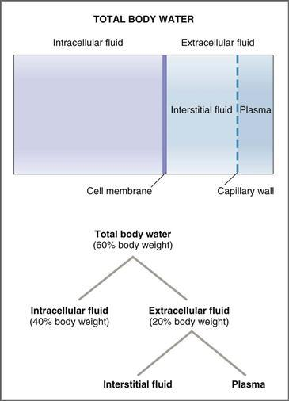

**그림 6-4 체액 구획.** 전체 체수분은 세포내액과 세포외액 사이에 분포됩니다. 주요 구획에는 체중 대비 수분이 표시됩니다.

체중의 변화를 사용하여 체수분 함량의 변화를 추정할 수 있기 때문에 수분 함량과 체중 사이의 관계는 임상적으로 중요합니다. 예를 들어, 다른 설명이 없는 경우 3kg의 갑작스러운 체중 감소는 총 체수분 3kg(약 3L)의 손실을 반영합니다.

체액 구획 사이의 수분 분포는 [그림 6-4](#filepos1191321)와 같습니다. 총 체수분은 **세포내액**(**ICF**)과 **세포외액**(**ECF**)**의 두 가지 주요 구획 사이에 분포됩니다.** 총 체수분의 약 2/3는 ICF에 있고 약 1/3은 ECF에 있습니다. 체중의 백분율로 표현하면 체중의 40%가 ICF(60%의 2/3)이고 ECF(60%의 1/3)가 20%입니다. (**60-40-20 규칙**은 알아두면 유용합니다. 체중의 60%는 물이고, 40%는 ICF, 20%는 ECF입니다.) ECF는 두 개의 작은 구획, 즉 간질액과 혈장으로 더 나뉩니다. ECF의 약 3/4은 간질성 구획에서 발견되고 나머지 1/4은 혈장에서 발견됩니다. 세 번째 체액 구획인 **경세포 구획**([그림 6-4](#filepos1191321)에는 표시되지 않음)은 정량적으로 작으며 뇌척수액, 흉막액, 복막액 및 소화액을 포함합니다.

##### *세포내액*

ICF는 모든 세포 내 용질이 용해되는 세포 내부의 물입니다. **전체 체수분의 2/3** 또는 체중의 40%를 구성합니다. ICF의 구성은 [1장](CR%21G9RE0KW4PD33Q9F3DXNCSBNXCANP_split_007.html#filepos27757)에서 논의된다. 간단히 말하면, 주요 양이온은 칼륨(**K+**)과 마그네슘(**Mg2+**)이고, 주요 음이온은 **단백질**과 **유기 인산염**(예: 아데노신 삼인산(ATP), 아데노신 이인산(ADP), 아데노신 일인산(AMP))입니다.

##### *세포외액*

ECF는 세포 외부의 물입니다. **전체 체수분의 1/3** 또는 체중의 20%를 구성합니다. ECF는 혈장과 간질액이라는 두 개의 하위 구획으로 나뉩니다. 혈장은 혈관을 순환하는 액체이며 간질액은 세포를 목욕시킵니다. ECF의 구성은 ICF와 크게 다릅니다. ECF의 주요 양이온은 나트륨(**Na+**)이고 주요 음이온은 염화물(**Cl−**) 및 중탄산염(**HCO3−**)입니다.

**혈장**은 혈액의 수성 성분입니다. 혈액 세포가 부유하는 액체입니다. 부피 기준으로 볼 때 혈장은 혈액량의 55%를 구성하고 혈액 세포(예: 적혈구, 백혈구, 혈소판)는 혈액량의 나머지 45%를 구성합니다. 혈액량 중 적혈구가 차지하는 비율을 **헤마토크리트**라고 하며, 평균 0.45 또는 45%이며 남성(0.48)이 여성(0.42)보다 높습니다. **혈장 단백질**은 혈장의 약 7%를 구성합니다. 따라서 혈장량의 93%만이 **플라즈마 물**이며 일반적으로 무시되는 보정입니다.

**간질액**은 혈장의 **한외여과물**입니다. 이는 혈장 단백질과 혈액 세포를 제외하고 혈장과 거의 동일한 구성을 가지고 있습니다. 간질액에 단백질이 거의 없고 혈액 세포가 없는 이유를 이해하려면 간질액이 모세혈관 벽을 통과하는 여과에 의해 형성된다는 점을 기억하십시오([4장](CR%21G9RE0KW4PD33Q9F3DXNCSBNXCANP_split_011.html#filepos530928) 참조). 모세혈관 벽의 구멍은 물과 작은 용질의 자유로운 통과를 허용하지만, 이 구멍은 큰 단백질 분자나 세포의 통과를 허용할 만큼 충분히 크지 않습니다. 간질액과 혈장 사이의 작은 양이온과 음이온 농도에도 작은 차이가 있는데, 이는 음전하를 띤 혈장 단백질의 **Gibbs-Donnan 효과**로 설명됩니다([1장](CR%21G9RE0KW4PD33Q9F3DXNCSBNXCANP_split_007.html#filepos27757) 참조). Gibbs-Donnan 효과는 혈장의 작은 양이온(예: Na+) 농도가 간질액보다 약간 높고 작은 음이온(예: Cl-) 농도는 약간 낮을 것으로 예측합니다.

#### 체액 구획의 부피 측정

인간의 경우 체액 구획의 부피는 **희석법**으로 측정됩니다. 이 방법의 기본 원리는 지표 물질이 물리적 특성에 따라 체액 구획에 분포된다는 것입니다. 예를 들어 **만니톨**과 같은 분자량이 큰 설탕은 세포막을 통과할 수 없으며 ECF에는 분포하지만 ICF에는 분포하지 않습니다. 따라서 만니톨은 ECF 부피의 지표입니다. 이와 대조적으로 **동위원소 수분**(예: D2O)은 물이 분포하는 모든 곳에 분포하며 전체 체수분의 지표로 사용됩니다.

희석 방법으로 체액 구획의 부피를 측정하는 데는 다음 단계가 사용됩니다.

1. **적절한 마커 물질의 식별.** 마커는 물리적 특성에 따라 선택됩니다([표 6-1](#filepos1198350)). **전체 체수분**에 대한 지표는 물이 발견되는 모든 곳에 분포되어 있는 물질입니다. 이러한 물질에는 동위원소수(예: D2O 및 삼중수소수[THO])와 지용성 물질인 안티피린이 포함됩니다. **ECF 부피**에 대한 마커는 ECF 전체에 분포하지만 세포막을 통과하지 않는 물질입니다. 이러한 물질에는 만니톨, 이눌린과 같은 고분자량 당과 황산염과 같은 고분자량 음이온이 포함됩니다. **혈장 부피**에 대한 마커는 혈장에 분포하지만 간질액에는 분포하지 않는 물질입니다. 그 이유는 모세혈관 벽을 통과하기에는 너무 크기 때문입니다. 이러한 물질에는 방사성 알부민과 알부민에 결합하는 염료인 에반스 블루가 포함됩니다.

   표 6-1 체액 구획 요약

   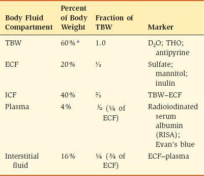

   D2O, 중수소 산화물; ECF, 세포외액; ICF, 세포내액; TBW, 총 체수분; THO, 삼중수.

   [\*](#filepos1198502)총체수분의 정상값 범위는 체중의 50%~70%입니다.

   ICF 및 간질액량은 이러한 구획에 대한 고유한 마커가 없기 때문에 직접 측정할 수 없습니다. 따라서 ICF 부피와 간질액 부피는 간접적으로 결정됩니다. **ICF 부피**는 총 체수분과 ECF 부피의 차이입니다. **Interstitial fluid volume** is the difference between ECF volume and plasma volume.
2. **알려진 양의 지표 물질 주입.** 혈액에 주입된 지표 물질의 양은 밀리그램(mg), 밀리몰(mmol) 또는 방사능 단위(예: 밀리큐리[mCi])로 측정됩니다.
3. **혈장 농도의 평형 및 측정.** 체액에서 마커가 평형을 이루도록 하고, 평형 기간 동안 소변 손실을 보정한 다음 혈장에서 마커의 농도를 측정합니다.
4. **체액 구획의 부피 계산.** 체내에 존재하는 표지 물질의 *양*을 알고(즉, 원래 주입된 양과 소변으로 배설되는 양의 차이) *농도*를 측정하므로 표지 물질의 분포 부피는 다음과 같이 계산할 수 있습니다.

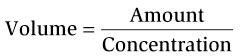

어디서

|  |  |
| --- | --- |
| 볼륨 | = 분포량(L) |
|  | 또는 |
|  | 체액 구획의 부피 (L) |
| 금액 | = 마커 주입량 - 배설량(mg) |
| 농도 | = 혈장 내 농도(mg/L) |

**예제 문제.** 65kg의 남성이 체액 구획의 부피를 알아야 하는 연구에 참여하고 있습니다. 이러한 부피를 측정하기 위해 남성에게 100mCi의 D2O와 500mg의 만니톨을 주사했습니다. 2시간의 평형 기간 동안 그는 소변으로 D2O 10%와 만니톨 10%를 배설합니다. 평형 후 혈장 내 D2O 농도는 0.213mCi/100mL이고 만니톨 농도는 3.2mg/100mL입니다. *그의 총 체수분, ECF 양, ICF 양은 얼마입니까? Is the man’s total body water appropriate for his weight?*

**SOLUTION.** D2O 분포량으로 전체 체수분을 계산할 수 있고, 만니톨 분포량으로 ECF량을 계산할 수 있습니다. ICF 부피는 직접 측정할 수 없지만 총 체수분과 ECF 부피의 차이로 계산할 수 있습니다.

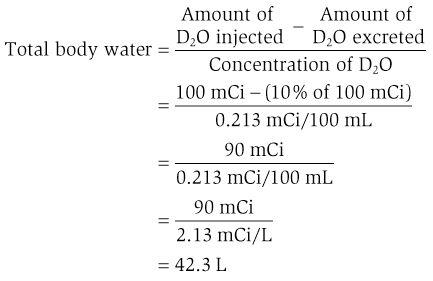

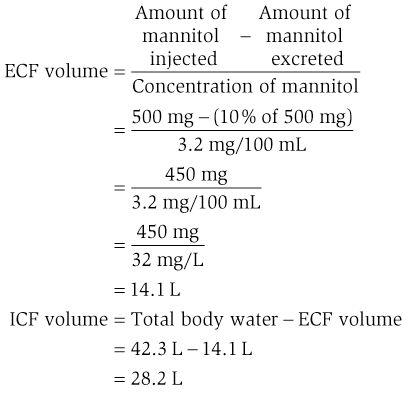

남성의 총 체수분은 42.3L로 체중의 65.1%입니다(42.3L는 약 42.3kg, 42.3kg/65kg = 65.1%). 이 비율은 체중의 50~70%의 정상 범위에 속합니다.

#### 체액 구획 사이의 물 이동

총 체수분의 정규 분포는 이 장의 앞부분과 [1장](CR%21G9RE0KW4PD33Q9F3DXNCSBNXCANP_split_007.html#filepos27757)에 설명되어 있습니다. 그러나 용질이나 수분 균형을 변경하여 체액 구획 *사이*에 수분 이동을 일으키는 여러 교란이 있습니다. 고려해야 할 장애로는 설사, 심각한 탈수, 부신 기능 부전, 등장성 식염수 주입, 높은 염화나트륨(NaCl) 섭취, 부적절한 항이뇨 호르몬 증후군(SIADH) 등이 있습니다. 이 섹션에서는 체액 균형의 일반적인 장애를 이해하기 위한 체계적인 접근 방식을 제공합니다.

체액 구획 사이의 체액 이동을 이해하려면 다음과 같은 주요 원칙이 필요합니다. 이러한 원리를 배우고 이해하십시오!

1. 체액 구획의 **부피**는 포함된 용질의 양에 따라 달라집니다. 예를 들어, ECF의 부피는 총 용질 함량에 따라 결정됩니다. ECF의 주요 양이온은 Na+(및 이에 수반되는 음이온 Cl- 및 HCO3-)이기 때문에 ECF 부피는 포함된 NaCl 및 중탄산나트륨(NaHCO3)의 *양*에 따라 결정됩니다.
2. **삼투압**은 삼투압 활성 입자의 농도로, 리터당 밀리오스몰(mOsm/L)로 표시됩니다. 실제로 osmola*r*ity는 osmola*l*ity(mOsm/kgH2O)와 동일합니다. 왜냐하면 1L의 물은 1kg의 물과 동일하기 때문입니다. 체액의 삼투압에 대한 정상 값은 **290mOsm/L** 또는 단순화를 위해 300mOsm/L입니다.  
       혈장 삼투압은 혈장 Na+ 농도, 혈장 포도당 농도 및 혈액 요소 질소(BUN)로부터 추정할 수 있는데, 이는 ECF와 혈장의 주요 용질이기 때문입니다.

   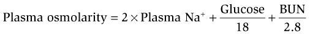

   어디서

   |  |  |
   | --- | --- |
   | 플라즈마 삼투압 | = 혈장 삼투압(총 삼투압 농도)(mOsm/L) |
   | Na+ | = 혈장 Na+ 농도(mEq/L) |
   | 포도당 | = 혈장 포도당 농도(mg/dL) |
   | 빵 | = 혈중 요소질소 농도(mg/dL) |

   Na+ 농도는 동일한 농도의 음이온으로 균형을 이루어야 하기 때문에 Na+ 농도에 2를 곱합니다. (혈장에서 이러한 음이온은 Cl- 및 HCO3-입니다.) mg/dL 단위의 포도당 농도는 18로 나누면 mOsm/L로 변환됩니다. mg/dL 단위의 BUN은 2.8로 나누면 mOsm/L로 변환됩니다.
3. 정상 상태에서 **세포내 삼투압은 세포외 삼투압과 동일합니다.** 즉, 삼투압은 체액 전체에서 동일합니다. 이러한 평등을 유지하기 위해 **물은 세포막을 통해 자유롭게 이동**합니다. 따라서 ECF 삼투압을 변경하는 교란이 발생하면 물은 세포막을 가로질러 이동하여 ICF 삼투압을 새로운 ECF 삼투압과 동일하게 만듭니다. 짧은 평형 기간(물 이동이 일어나는 동안) 후에 새로운 정상 상태가 달성되고 삼투압은 다시 동일해집니다.
4. **NaCl** 및 **NaHCO3**와 같은 용질과 **만니톨**과 같은 큰 당은 세포막을 쉽게 통과하지 못하기 때문에 ECF 구획에 국한된 것으로 가정됩니다. 예를 들어, 사람이 다량의 NaCl을 섭취하면 해당 NaCl은 ECF 구획에만 추가되고 ECF의 총 용질 함량은 증가합니다.

체액의 6가지 장애를 [표 6-2](#filepos1207760)에 정리하였고, [그림 6-5](#filepos1208209)에 나타내었다. 장애는 부피 수축 또는 부피 팽창을 포함하는지, 그리고 체액 삼투압의 증가 또는 감소를 포함하는지에 따라 그룹화되고 명명됩니다.

표 6-2 체액의 교란

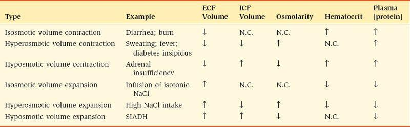

ECF, 세포외액; ICF, 세포내액; NaCl, 염화나트륨; N.C., 변화 없음; SIADH, 부적절한 항이뇨 호르몬 증후군.

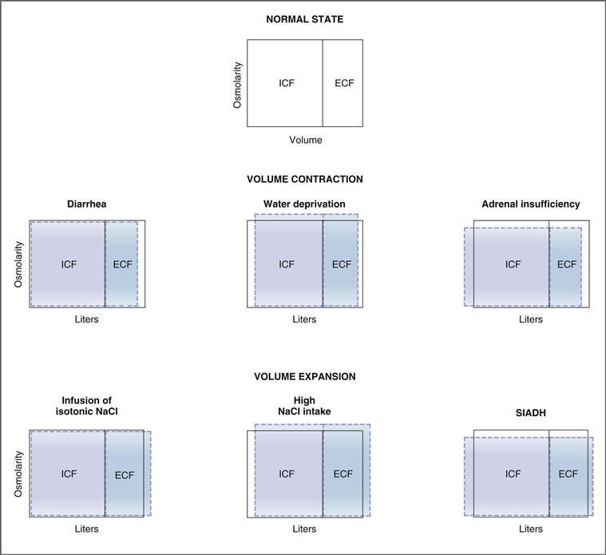

**그림 6–5 체액 구획 사이의 수분 이동.** 정상적인 세포외액(ECF)과 세포내액(ICF)의 삼투압은 *실선*으로 표시됩니다. 다양한 교란에 대한 반응으로 인한 부피 및 삼투압 변화는 *점선*으로 표시됩니다. SIADH, 부적절한 항이뇨 호르몬 증후군.

**볼륨 수축**은 ECF 볼륨의 *감소*를 의미합니다. **볼륨 확장**은 ECF 볼륨의 *증가*를 의미합니다. 등삼투성, 고삼투성, 저삼투성이라는 용어는 ECF의 삼투압을 나타냅니다. Thus, an **isosmotic** disturbance means that there is no change in ECF osmolarity; **고삼투성** 장애는 ECF 삼투압이 증가했음을 의미합니다. **저삼투성** 교란은 ECF 삼투압이 감소했음을 의미합니다.

이러한 교란에서 발생하는 이벤트를 이해하려면 3단계 접근 방식을 사용해야 합니다. 먼저, ECF에서 발생하는 모든 변화를 식별합니다(예: ECF에 용질이 추가되었습니까? ECF에서 물이 손실되었습니까?). 둘째, 해당 변화가 ECF 삼투압의 증가, 감소 또는 변화 없음을 결정합니다. 셋째, ECF 삼투압에 변화가 있는 경우 ECF 삼투압과 ICF 삼투압 간의 동등성을 다시 확립하기 위해 물이 세포 안으로 또는 세포 밖으로 이동하는지 여부를 결정합니다. ECF 삼투압에 변화가 없으면 물 이동이 발생하지 않습니다. ECF 삼투압에 변화가 있으면 물 이동이 발생해야 합니다.

##### *등삼투압 수축—설사*

설사를 하는 사람은 위장관에서 많은 양의 체액을 잃습니다. 손실된 체액의 삼투압은 ECF의 삼투압과 대략 같습니다. 즉, 등삼투성입니다. 따라서 설사 장애는 ECF로부터의 **등삼투액 손실**입니다. 결과적으로 ECF 부피는 감소하지만 ECF 삼투압에는 그에 따른 변화가 없습니다(손실된 유체는 등삼투성이므로). ECF 삼투압에는 변화가 없기 때문에 세포막을 가로지르는 체액 이동이 필요하지 않으며 ICF 부피는 변하지 않은 채로 유지됩니다. 새로운 정상 상태에서는 ECF 부피가 감소하고 ECF와 ICF의 삼투압은 변하지 않습니다. ECF 부피의 감소는 혈액량(ECF의 구성 요소)도 감소한다는 것을 의미하며, 이는 동맥압을 감소시킵니다.

설사의 다른 결과로는 적혈구용적률 증가와 혈장 단백질 농도 증가가 있는데, 이는 ECF 구획에서 등장액의 손실로 설명됩니다. ECF의 혈관 구성 요소에 남아 있는 적혈구와 단백질은 이러한 체액 손실로 인해 집중됩니다.

##### *고삼투압 부피 수축—물 부족*

충분한 식수 없이 사막에서 길을 잃은 사람은 땀으로 NaCl과 물을 모두 잃습니다. 즉각적으로 명확하지는 않지만 핵심 정보는 *땀이 ECF에 비해 저삼투성*이라는 것입니다. 즉, 체액과 비교할 때 땀에는 용질보다 상대적으로 더 많은 수분이 포함되어 있습니다. ECF에서 **저삼투액이 손실**되기 때문에 ECF 부피는 감소하고 ECF 삼투압은 증가합니다. ECF 삼투압은 ICF 삼투압보다 일시적으로 높으며 이러한 삼투압 차이로 인해 물이 ICF에서 ECF로 이동합니다. ICF 삼투압이 증가하여 ECF 삼투압과 같아질 때까지 물이 흐릅니다. 세포 밖으로 물이 이동하면 ICF 부피가 감소합니다. 새로운 정상 상태에서는 ECF와 ICF 부피가 모두 감소하고 ECF와 ICF 삼투압은 증가하여 서로 동일해집니다.

고삼투압 부피 수축에서는 혈장 단백질 농도가 증가하지만 적혈구용적률은 변하지 않습니다. 혈장 단백질 농도 증가에 대한 설명은 간단합니다. 체액은 ECF에서 손실되고 뒤에 남아 있는 혈장 단백질은 농축됩니다. 그러나 적혈구용적률이 변하지 않는 이유는 덜 분명합니다. ECF만으로 체액이 손실되면 적혈구 농도가 증가하고 적혈구용적률이 증가합니다. 그러나 이 교란에는 유체 이동도 있습니다. 물은 ICF에서 ECF로 이동합니다. 적혈구는 *세포*이기 때문에 물이 적혈구 밖으로 이동하여 부피가 감소합니다. 따라서 적혈구 농도는 증가하지만 적혈구 부피는 감소합니다. 두 가지 효과는 서로 상쇄되며 적혈구용적률은 변하지 않습니다.

*ECF 볼륨의 최종 상태는 어떻습니까? 감소(땀으로 인한 ECF 양의 손실로 인해), 증가(ICF에서 ECF로의 수분 이동으로 인해), 아니면 변하지 않았습니까(둘 다 발생하기 때문에)?*
[그림 6-5](#filepos1208209)를 보면 ECF 볼륨이 평소보다 낮은데 왜 그럴까요? 새로운 정상 상태에서 ECF 부피를 결정하는 것은 땀으로 인해 ECF에서 부피가 손실되지만 물도 ICF에서 ECF로 이동하기 때문에 복잡합니다. 다음 샘플 문제는 제기된 질문에 답하기 위해 새 ECF 볼륨을 결정하는 방법을 보여줍니다.

**예제 문제.** 한 여성이 더운 9월의 어느 날 마라톤을 달리며 땀으로 손실된 양을 보충하기 위해 수분을 전혀 마시지 않습니다. 그녀는 삼투압농도가 150mOsm/L인 3L의 땀을 잃은 것으로 확인되었습니다. 마라톤 전 그녀의 총 체수분은 36L, ECF 부피는 12L, ICF 부피는 24L, 체액 삼투압은 300mOsm/L였습니다. 새로운 정상 상태가 달성되었고 신체에서 손실된 모든 용질(즉, NaCl)이 ECF에서 나왔다고 가정합니다. *마라톤 후 ECF 용량과 삼투압은 얼마입니까?*

**해결책.** 마라톤 이전의 값은 *old*라고 하고 마라톤 이후의 값은 *new*라고 합니다. 이 문제를 해결하려면 먼저 새로운 정상 상태에서 삼투압이 체액 전체에서 동일하기 때문에 새로운 삼투압을 계산하십시오. 그런 다음 새로운 삼투압을 사용하여 새로운 ECF 부피를 계산합니다.

***새로운* 삼투압**을 계산하려면 체액이 땀으로 손실된 후 체내의 총 삼투압 수를 계산합니다(새로운 삼투압 = 오래된 삼투압 − 땀으로 손실된 삼투압). 그런 다음 새로운 삼투압을 새로운 총 체수분으로 나누어 새로운 삼투압을 구합니다. (새로운 총 체내 수분은 땀으로 손실된 3L를 *뺀* 36L라는 점을 기억하세요.)

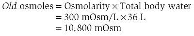

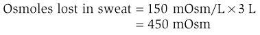

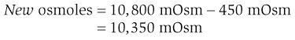

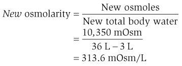

***새* ECF 부피**를 계산하려면 땀으로 손실된 모든 용질(NaCl)이 ECF에서 나온다고 가정합니다. 이 손실 후 새 ECF 삼투압을 계산한 다음 새 삼투압(이전에 계산됨)으로 나누어 새 ECF 부피를 얻습니다.

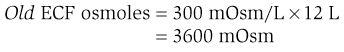

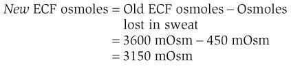

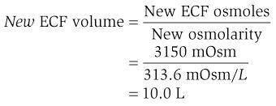

이 예의 계산을 요약하면, 마라톤 후 ECF 삼투압은 313.6mOsm/L로 증가합니다. 왜냐하면 저삼투성 용액이 신체에서 손실되기 때문입니다(즉, 용질보다 상대적으로 더 많은 물이 땀으로 손실됨). 마라톤 후에는 ECF 용량이 원래 12L에서 10L로 감소합니다. 따라서 땀으로 손실된 ECF 양의 전부는 아니지만 일부가 ICF에서 ECF로의 물 이동으로 대체되었습니다. 물의 이동이 없었다면 새로운 ECF 부피는 훨씬 더 낮았을 것입니다(즉, 9L).

##### *저혈압성 용적 수축—부신 기능부전*

부신 기능부전이 있는 사람은 일반적으로 원위세뇨관과 집합관에서 Na+ 재흡수를 촉진하는 호르몬인 알도스테론을 포함한 여러 호르몬이 결핍되어 있습니다. **알도스테론 결핍**의 결과로 과도한 NaCl이 소변으로 배설됩니다. NaCl은 ECF 용질이므로 ECF 삼투압이 감소합니다. 일시적으로, ECF 삼투압은 ICF 삼투압보다 낮으며, 이로 인해 ICF 삼투압이 ECF 삼투압과 동일한 수준으로 감소할 때까지 물이 ECF에서 ICF로 이동하게 됩니다. 새로운 정상 상태에서는 ECF와 ICF 삼투압 모두 정상보다 낮고 서로 동일합니다. 물의 이동으로 인해 ECF 부피는 감소하고 ICF 부피는 증가합니다.

저삼투성 부피 수축에서는 ECF 부피의 감소로 인해 혈장 단백질 농도와 적혈구 용적률이 모두 증가합니다. 물이 적혈구로 이동하여 세포 부피가 증가하기 때문에 적혈구용적률도 *또한* 증가합니다.

##### *등삼투압 팽창 - NaCl 주입*

등장성 NaCl을 주입받은 사람은 설사로 인해 등장액이 손실된 사람과 반대되는 임상 양상을 보입니다. NaCl은 세포외 용질이기 때문에 모든 **등장성 NaCl 용액**이 ECF에 첨가되어 ECF 부피는 증가하지만 ECF 삼투압에는 변화가 없습니다. 두 구획 사이의 삼투압 차이가 없기 때문에 ICF와 ECF 사이에는 물의 이동이 없습니다. 혈장 단백질 농도와 적혈구 용적률은 모두 ECF 부피의 증가로 인해 감소(즉, 희석)됩니다.

##### *고삼투압 부피 확장—높은 NaCl 섭취량*

**건조 NaCl 섭취**(예: 감자칩 한 봉지 먹기)는 ECF의 총 용질 양을 증가시킵니다. 결과적으로 ECF 삼투압이 증가합니다. 일시적으로 ECF 삼투압은 ICF 삼투압보다 높으며 이로 인해 물이 ICF에서 ECF로 이동하여 ICF 부피가 감소하고 ECF 부피가 증가합니다. 새로운 정상 상태에서는 ECF와 ICF 삼투압 모두 정상보다 높고 서로 동일합니다. 세포 밖으로 물이 이동하기 때문에 ICF 부피는 감소하고 ECF 부피는 증가합니다.

고삼투압 부피 확장에서는 ECF 부피의 증가로 인해 혈장 단백질 농도와 적혈구 용적률이 모두 감소합니다. 적혈구에서 물이 이동하기 때문에 적혈구 용적률도 *또한* 감소합니다.

##### *저혈압 용량 확장—SIADH*

**부적절한 항이뇨 호르몬 증후군**(**SIADH**)이 있는 사람은 집합관에서 수분 재흡수를 촉진하는 항이뇨 호르몬(ADH)을 부적절하게 높은 수준으로 분비합니다. ADH 수치가 비정상적으로 높으면 너무 많은 수분이 재흡수되고 과잉 수분이 유지되어 전체 체수분에 분산됩니다. ECF와 ICF에 추가되는 물의 양은 원래 양에 정비례합니다. 예를 들어, 집수관에서 추가로 3L의 물이 재흡수되면 1L는 ECF에 추가되고 2L는 ICF에 추가됩니다(ECF는 전체 체수분의 1/3을 구성하고 ICF는 2/3를 구성하기 때문입니다). 정상 상태와 비교할 때 ECF 및 ICF 부피는 증가하고 ECF 및 ICF 삼투압은 감소합니다.

저삼투성 부피 확장에서는 혈장 단백질 농도가 희석에 의해 감소됩니다. 그러나 두 가지 상쇄 효과로 인해 적혈구 용적률은 변하지 않습니다. 즉, 희석으로 인해 적혈구 농도가 감소하지만 물이 세포 내로 이동하기 때문에 적혈구 부피가 증가합니다.

### 신장 제거

제거는 물질이 혈장에서 제거(또는 제거)되는 속도를 설명하는 일반적인 개념입니다. 따라서 전신 청소율은 모든 장기에서 물질이 제거되는 전체 속도를 의미하고, 간 청소율은 간에서 제거되는 속도를 의미하며, 신장 청소율은 신장에서 제거되는 속도를 의미합니다. 신장 제거의 개념은 이 장 전반에 걸쳐 논의된 신장 생리학의 여러 기본 개념에 사용되기 때문에 이 시점에서 소개됩니다. 참고로 일반적으로 사용되는 약어([표 6-3](#filepos1221550))와 일반적으로 사용되는 수식([표 6-4](#filepos1221796)) 표를 참고하세요.

표 6-3 신장 생리학에서 일반적으로 사용되는 약어

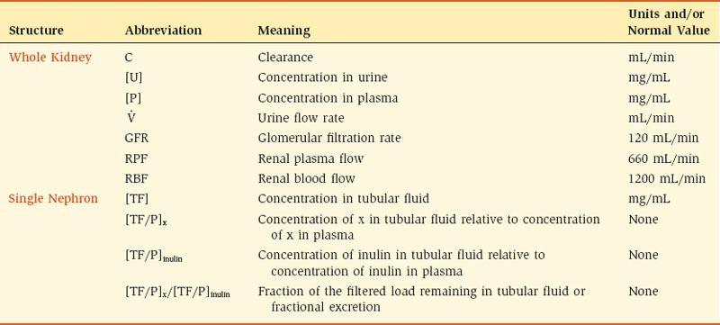

표 6-4 신장 생리학에서 일반적으로 사용되는 방정식

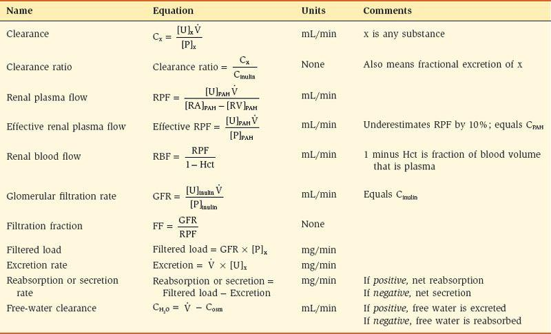

정의에 따르면 **신장 청소율**은 단위 시간당 신장에 의해 물질이 완전히 제거된 혈장의 양입니다. 신장 청소율이 높을수록 물질이 제거되는 혈장의 양이 많아집니다. 신장 청소율이 가장 높은 물질은 혈액이 신장을 한 번 통과하면 완전히 제거될 수 있습니다. 신장 청소율이 가장 낮은 물질은 전혀 제거되지 않습니다.

신장 제거 방정식은 다음과 같습니다.

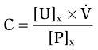

어디서

|  |  |
| --- | --- |
| 다 | = 클리어런스(mL/min) |
| [유]엑스 | = 물질 X의 소변 농도(mg/mL) |
| 이미지 | = 분당 소변 유량(mL/min) |
| [P]x | = 물질 X의 혈장 농도(mg/mL) |

따라서 신장 청소율은 혈장 농도에 대한 소변 배설량([U]x × )의 비율입니다. 특정 혈장 농도에서 요로 배설이 증가하면 물질의 신장 청소율도 증가합니다. 다시 말하지만, 제거 단위는 단위 시간당 부피(예: mL/min, L/시간, L/일)이며, 이는 단위 시간당 물질이 제거된 혈장의 부피를 의미합니다.

#### 각종 물질 제거

신장 청소율은 모든 물질에 대해 계산될 수 있습니다. 물질의 특성과 신장 처리에 따라 신장 청소율은 0에서 600mL/min 이상까지 다양할 수 있습니다. 예를 들어 **알부민**의 신장 청소율은 일반적으로 알부민이 사구체 모세혈관을 통해 여과되지 않기 때문에 대략 0입니다. **포도당**의 신장 청소율도 0이지만, 다른 이유가 있습니다. 포도당은 여과된 다음 다시 혈류로 완전히 재흡수됩니다. Na+, 요소, 인산염 및 Cl-와 같은 다른 물질은 여과되고 부분적으로 재흡수되기 때문에 0보다 높은 청소율을 갖습니다. 과당 중합체인 **이눌린**은 특별한 경우입니다. 이눌린은 사구체 모세혈관을 통해 자유롭게 여과되지만 재흡수되거나 분비되지 않습니다. 따라서 그 청소율은 사구체 여과율을 측정합니다. ***파라*-아미노히푸르산**(**PAH**)과 같은 유기산은 여과되고 분비되기 때문에 모든 물질 중에서 제거율이 가장 높습니다.

#### 클리어런스 비율

**이눌린**은 사구체 여과율(GFR)과 청소율이 정확히 동일한 유일한 물질인 독특한 특성을 가지고 있습니다. 이눌린은 사구체 모세혈관을 통해 자유롭게 여과되지만 일단 여과되면 재흡수되거나 분비되지 않습니다. 따라서 여과된 이눌린의 양은 배설된 이눌린의 양과 정확히 동일합니다. 이러한 이유로 이눌린은 **사구체 표지자**라고 불리는 기준 물질입니다.

임의의 물질(x)의 제거율은 이눌린의 제거율과 비교될 수 있으며 **제거율**로 표시됩니다.

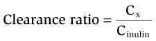

클리어런스 비율의 다양한 값의 의미는 다음과 같습니다.

 **Cx/Cinulin** = **1.0.** x의 클리어런스는 이눌린의 클리어런스와 같습니다. 또한 물질은 사구체 표지자(여과되지만 재흡수되거나 분비되지 않음)여야 합니다.

 **Cx/Cinulin** <**1.0.** x의 클리어런스는 이눌린의 클리어런스보다 낮습니다. *둘 중 하나* 물질이 여과되지 않거나, *또는* 여과된 후 재흡수됩니다. 예를 들어 알부민은 여과되지 않으며 알부민 청소율은 이눌린 청소율보다 적습니다. Na+, Cl-, HCO3-, 인산염, 요소, 포도당 및 아미노산의 제거율도 이눌린의 제거율보다 적습니다. 이러한 물질은 여과된 후 재흡수되기 때문입니다.

 **Cx/Cinulin** > **1.0.** x의 클리어런스는 이눌린의 클리어런스보다 높습니다. 물질은 여과되어 분비됩니다. 이눌린보다 제거율이 더 높은 물질의 예로는 유기산과 염기, 그리고 일부 조건에서는 K+가 있습니다.

**예제 문제.** 24시간 동안 이눌린 주입을 받은 남성에게서 1.44L의 소변이 수집되었습니다. 그의 소변에서 [이눌린]은 150mg/mL이고 [Na+]는 200mEq/L입니다. 그의 혈장에서 [이눌린]은 1mg/mL이고 [Na+]는 140mEq/L입니다. *Na+의 제거율은 얼마이며, 그 값의 의미는 무엇입니까?*

**해결책.** Na+ 제거율은 이눌린 제거율에 대한 Na+ 제거율입니다. 모든 물질의 제거 방정식은 C = [U] × 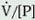입니다. 소변 유량(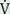)을 계산해야 하지만 필요한 모든 값이 설명에 제공됩니다.

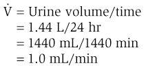

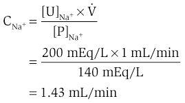

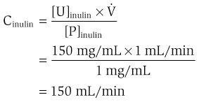

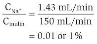

계산된 Na+ 제거율 0.01(또는 1%)은 Na+의 신장 처리에 대한 많은 정보를 제공합니다. Na+는 사구체 모세혈관을 통해 자유롭게 여과되기 때문에 신장 세뇨관에 의해 광범위하게 재흡수되어야 하므로 Na+의 청소율은 이눌린의 청소율보다 훨씬 적습니다. 제거율이 0.01이라는 것은 여과된 Na+의 1%만 배설된다는 의미입니다. 다르게 말하면, 여과된 Na+의 99%가 재흡수되어야 합니다.

### 신장 혈액 흐름

신장은 심박출량의 약 25%를 담당하는데, 이는 모든 기관계 중에서 가장 높은 부분입니다. 따라서 심박출량이 5L/분인 사람의 경우 신장 혈류량(RBF)은 1.25L/분 또는 1800L/일입니다! 신장이 체액의 양과 구성을 유지하는 중심 역할을 한다는 점을 고려하면 이러한 높은 RBF 비율은 놀라운 일이 아닙니다.

#### 신장 혈류 조절

모든 기관의 혈류와 마찬가지로 RBF(Q)는 신동맥과 신정맥 사이의 **압력 구배**(ΔP)에 정비례하고, 신장 혈관계의 **저항**(R)에 반비례합니다. ([4장](CR%21G9RE0KW4PD33Q9F3DXNCSBNXCANP_split_011.html#filepos530928)에서 Q = ΔP/R임을 상기하십시오. 또한 저항은 주로 세동맥에 의해 제공된다는 점을 상기하십시오.) 그러나 신장은 *수심성 및 원심성 *두 세트의 세동맥*이 있다는 점에서 특이합니다. 혈류를 변화시키는 주요 메커니즘은 동맥 저항을 변화시키는 것입니다. 신장에서는 구심성 동맥 저항 및/또는 원심성 동맥 저항을 변경하여 이를 수행할 수 있습니다([표 6-5](#filepos1230560)).

표 6–5 신장 혈관수축제 및 혈관확장제

|  |  |
| --- | --- |
| **혈관수축제** | **혈관확장제** |
| 교감 신경(카테콜아민) 안지오텐신 II 엔도텔린 | PGE2 PGI2 산화질소 브래디키닌 도파민 심방 나트륨 이뇨 펩타이드 |

PG, 프로스타글란딘.

 **교감 신경계 및 순환 카테콜아민.** 구심성 세동맥과 원심성 세동맥 모두 **α1 수용체를 활성화하여 **혈관 수축**을 생성하는 교감 신경 섬유에 의해 신경이 지배됩니다. 그러나 구심성 세동맥에 훨씬 더 많은 α1 수용체가 있기 때문에 교감 신경 활동이 증가하면 RBF와 GFR이 모두 감소합니다. 신장 혈관 저항에 대한 교감 신경계의 영향은 출혈에 대한 반응을 고려하여 평가할 수 있습니다. [제4장](CR%21G9RE0KW4PD33Q9F3DXNCSBNXCANP_split_011.html#filepos530928)에서 혈액 손실과 그에 따른 동맥압 감소로 인해 압수용기 메커니즘을 통해 심장과 혈관으로의 교감신경 유출이 증가한다는 점을 상기해 보세요. 신장 α1 수용체가 교감신경 활동의 증가로 활성화되면 구심성 세동맥의 혈관 수축이 일어나 RBF와 GFR이 감소합니다. 따라서 심혈관계는 신장으로 가는 혈류를 희생시키면서라도 동맥압을 높이려고 시도할 것입니다.

 **안지오텐신 II.** 안지오텐신 II는 구심성 및 원심성 세동맥 모두의 강력한 혈관 수축 물질입니다. RBF에 대한 안지오텐신의 효과는 분명합니다. 두 세동맥 세트를 모두 수축시키고 저항을 증가시키며 혈류를 감소시킵니다. 그러나 **원심 세동맥**은 수입 세동맥보다 안지오텐신 II에 더 민감하며 이러한 민감도의 차이는 GFR에 미치는 영향으로 이어집니다(GFR 조절에 대한 논의 참조). 간단히 말해서, 낮은 수치의 안지오텐신 II는 원심성 세동맥을 수축시켜 *GFR을 증가*시키는 반면, 높은 수치의 안지오텐신 II는 수입성 세동맥과 원심성 세동맥을 모두 수축시켜 *GFR을 감소*시킵니다. **출혈**에서는 혈액 손실로 인해 동맥압이 감소하여 레닌-안지오텐신-알도스테론 시스템이 활성화됩니다. 높은 수준의 안지오텐신 II는 교감 신경 활동의 증가와 함께 구심성 및 원심성 세동맥을 수축시키고 RBF 및 GFR을 감소시킵니다.

 **심방 나트륨 이뇨 펩타이드(ANP).** ANP 및 뇌 나트륨 이뇨 펩타이드(BNP)와 같은 관련 물질은 구심성 세동맥의 확장 및 원심성 세동맥의 수축을 유발합니다. 수입 세동맥에 대한 ANP의 확장 효과가 수출 세동맥에 대한 수축 효과보다 크기 때문에 신장 혈관 저항이 전반적으로 감소하고 결과적으로 RBF가 증가합니다. 수입세동맥의 확장과 수출세동맥의 수축은 모두 GFR을 증가시킵니다(GFR 조절에 대한 논의 참조).

 **프로스타글란딘.** 여러 프로스타글란딘(예: 프로스타글란딘 E2 및 프로스타글란딘 I2)은 신장에서 국소적으로 생성되며 구심성 및 원심성 세동맥 모두의 **혈관 확장**을 유발합니다. 교감 신경계를 활성화하고 출혈 시 안지오텐신 II 수준을 증가시키는 동일한 자극은 또한 국소 신장 프로스타글란딘 생산을 활성화합니다. 이러한 작용은 모순적으로 보일 수 있지만 프로스타글란딘의 혈관 확장 효과는 분명히 RBF를 보호합니다. 따라서 프로스타글란딘은 교감신경계와 안지오텐신 II에 의해 생성된 혈관 수축을 조절합니다. 반대 없이 이러한 혈관 수축은 RBF의 심각한 감소를 유발하여 신부전을 초래할 수 있습니다. **비스테로이드성 항염증제**(**NSAID**)는 프로스타글란딘의 합성을 억제하므로 출혈 후 신장 기능에 대한 프로스타글란딘의 보호 효과를 방해합니다.

 **도파민.** 노르에피네프린의 전구체인 도파민은 여러 혈관층의 세동맥에 선택적인 작용을 합니다. 낮은 수준에서 도파민은 대뇌, 심장, 내장 및 신장 세동맥을 *확장*시키고 골격근과 피부 세동맥을 *수축*합니다. 따라서 신장을 포함한 여러 중요한 기관의 혈류에 대한 보호(혈관 확장) ​​효과 때문에 **출혈** 치료에 낮은 복용량의 도파민을 투여할 수 있습니다.

#### 신장 혈류의 자동 조절

RBF는 광범위한 평균 동맥압(Pa)에 걸쳐 자동 조절됩니다([그림 6-6](#filepos1237168)). 신장 동맥압은 80~200mmHg까지 다양하지만 RBF는 일정하게 유지됩니다. 신장 동맥압이 80mmHg 미만으로 감소하는 경우에만 RBF도 감소합니다. 동맥압이 변할 때 혈류를 일정하게 유지하는 유일한 방법은 세동맥의 저항을 변화시키는 것입니다. 따라서 신장 동맥압이 증가하거나 감소함에 따라 신장 저항도 그에 비례하여 증가하거나 감소해야 합니다(Q = ΔP/R을 기억하십시오).

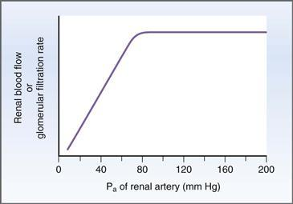

**그림 6-6 신장 혈류 및 사구체 여과율의 자동 조절.** Pa, 신장 동맥압.

신장 자동조절의 경우, 저항은 주로 원심성 세동맥보다는 수입세동맥 수준에서 조절되는 것으로 여겨집니다. **자동 조절 메커니즘**은 완전히 이해되지 않았습니다. 분명히 자율신경계는 손상되지 않은 신장뿐만 아니라 탈신경된(예를 들어 이식된) 신장도 자가 조절하기 때문에 관련되지 *않습니다*. 신장 자동 조절을 설명하는 주요 이론은 근원성 메커니즘과 세뇨관사구체 피드백입니다.

 **근생성 가설.** 근생성 가설은 동맥압이 증가하면 혈관이 늘어나 혈관벽 평활근의 반사 수축이 발생하고 결과적으로 혈류에 대한 저항이 증가한다는 것입니다([장 참조). 4](CR%21G9RE0KW4PD33Q9F3DXNCSBNXCANP_split_011.html#filepos530928)). 신장 유발 수축 메커니즘은 평활근 세포막의 **신장 활성화 칼슘**(**Ca2+**) **채널**을 여는 것과 관련이 있습니다. 이러한 채널이 열리면 더 많은 Ca2+가 혈관 평활근 세포로 들어가고 혈관벽에 더 많은 장력이 발생합니다. 근원성 가설은 RBF의 자동 조절을 다음과 같이 설명합니다. 신장 동맥압의 증가는 수축에 의해 반응하는 구심성 세동맥의 벽을 늘립니다. 구심성 세동맥 수축은 구심성 세동맥 저항을 증가시킵니다. 저항의 증가는 동맥압의 증가와 균형을 이루고 RBF는 일정하게 유지됩니다.

 **세뇨관사구체 피드백.** 세관사구체 피드백은 자동 조절을 위한 메커니즘이기도 하며([그림 6-7](#filepos1240061)), 다음과 같이 설명합니다. 신장 동맥압이 증가하면 RBF와 GFR이 모두 증가합니다. GFR의 증가는 초기 원위세뇨관의 **치밀황반** 영역으로의 용질과 물의 전달을 증가시키며, 이는 전달된 부하의 일부 구성요소를 감지합니다. **사구체근기관**의 일부인 치밀반은 측분비 메커니즘을 통해 구심성 세동맥을 수축시키는 혈관 활성 물질을 분비하여 증가된 전달 부하에 반응합니다. 수입성 세동맥의 국소 혈관 수축은 RBF와 GFR을 다시 정상으로 감소시킵니다. 즉, 자동 조절이 있습니다.

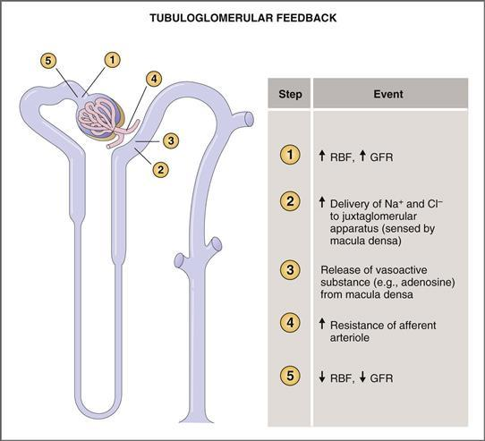

**그림 6-7 세뇨관사구체 피드백의 메커니즘.** GFR, 사구체 여과율; RBF, 신장 혈류.

세뇨관사구체 피드백의 메커니즘에 관해 두 가지 주요 답변되지 않은 질문이 있습니다. (1) *치밀황반에서 세뇨관액의 어떤 성분이 감지됩니까?* 주요 후보는 내강 Na+와 Cl−입니다. (2) *사구체근기관에서 분비되어 구심성 세동맥에 국소적으로 작용하는 혈관활성 물질은 무엇입니까?* 여기서 후보는 아데노신, ATP, 트롬복산입니다.

#### 신장 혈장 흐름 및 신장 혈류 측정

신장 *혈장* 유량(RPF)은 유기산 ***파라*-아미노히푸르산**(**PAH**)**의 제거로 추정할 수 있습니다.** 신장 *혈액* 유량(RBF)은 RPF와 적혈구 용적률로부터 계산됩니다.

##### *진정 신장 혈장 흐름 측정 - Fick 원리*

**픽 원리**는 기관에 들어가는 물질의 양이 기관에서 나가는 물질의 양과 같다고 말합니다(물질이 기관에 의해 분해된 양이라고 가정). Fick 원리를 신장에 적용하면 신동맥을 통해 신장으로 들어가는 물질의 양은 신정맥을 통해 신장에서 나가는 물질의 양 *더하기* 소변으로 배설되는 물질의 양과 같다고 합니다([그림 6-8](#filepos1242060)).

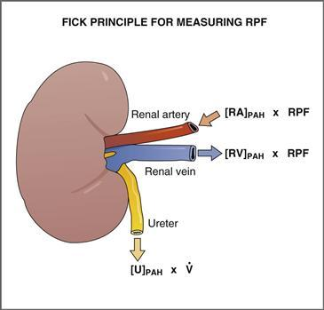

**그림 6-8 Fick 원리에 의한 신장 혈장 흐름 측정.** PAH, *Para*-aminohippuric acid; [RA], 신장 동맥의 농도; RPF, 신장 혈장 흐름; [RV], 신장 정맥의 농도; [U], 소변 농도.

PAH는 Fick 원리를 이용하여 RPF를 측정하는데 사용되는 물질로, 그 도출은 다음과 같습니다.

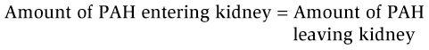

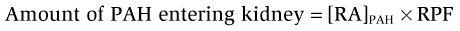

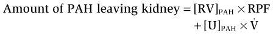

대체,

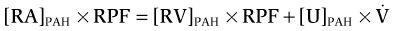

RPF에 대한 해결,

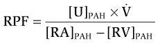

어디서

|  |  |
| --- | --- |
| RPF | = 신장 혈장 흐름 |
| [U]파 | = 소변 내 [PAH] |
| 이미지 | = 소변 유량 |
| [RA]파 | = 신장 동맥의 [PAH] |
| [RV]파 | = 신장 정맥의 [PAH] |

PAH는 RPF 측정에 이상적인 물질로 만드는 다음과 같은 특징을 가지고 있습니다. (1) PAH는 신장에서 대사되거나 합성되지 않습니다. (2) PAH는 RPF를 변경하지 않습니다. (3) 신장은 여과와 분비의 조합을 통해 신장 동맥혈에서 대부분의 PAH를 추출(제거)합니다. 결과적으로 신동맥을 통해 신장으로 유입되는 PAH의 거의 대부분이 소변으로 배설되고 신정맥에는 거의 남지 않습니다. PAH의 신정맥 농도는 거의 0에 가깝기 때문에 앞의 식([RA]PAH − [RV]PAH)의 분모가 크므로 정확하게 측정할 수 있습니다. 이 점을 더 자세히 설명하기 위해 신장 동맥혈에서 전혀 제거되지 *않는* 포도당과 같은 물질을 비교해 보십시오. 신정맥혈은 신동맥혈과 동일한 포도당 농도를 갖게 되며, 방정식의 분모는 0이 되는데, 이는 수학적으로 허용되지 않습니다. 분명히 포도당은 RPF를 측정하는 데 사용할 수 없습니다. (4) 신장 이외의 어떤 기관도 PAH를 추출하지 않으므로 신장 동맥의 PAH 농도는 말초 정맥의 PAH 농도와 동일합니다. 말초 정맥혈은 쉽게 채취할 수 있지만 신장 동맥혈은 채취할 수 없습니다.

##### *효과적인 신장 혈장 흐름 측정 - *파라*-아미노히푸르산* 제거

이전 섹션에서는 PAH 주입, 소변 샘플링, 신장 동맥 및 신장 정맥에서 혈액 샘플링을 포함하는 *진정한* 신장 혈장 흐름 측정에 대해 설명합니다. 인간의 경우 신장 혈관에서 혈액 샘플을 채취하는 것이 불가능하지는 않더라도 어렵습니다. 그러나 PAH의 특성에 따라 특정 단순화를 적용하여 *유효한* RPF를 측정할 수 있으며, 이는 *실제* RPF를 10% 이내로 근사화합니다.

첫 번째 단순화는 **[RV]PAH가 0으로 가정된다는 것입니다.** 신동맥을 통해 신장으로 유입되는 PAH의 대부분은 여과와 분비의 결합 과정을 통해 소변으로 배설되기 때문에 이는 합리적인 가정입니다. 두 번째 단순화는 **[RA]PAH가 모든 말초 정맥의 PAH 농도와 동일**하며 쉽게 샘플링할 수 있다는 것입니다. 이러한 수정을 통해 RPF 방정식은 다음과 같습니다.

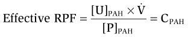

어디서

|  |  |
| --- | --- |
| 효과적인 RPF | = 유효 신장 혈장 유량(mL/분) |
| [U]파 | = 소변 PAH 농도(mg/mL) |
| 이미지 | = 소변 유속(mL/min) |
| [P]PAH | = PAH의 혈장 농도(mg/mL) |
| CPAH | = PAH 제거율(mL/분) |

따라서 단순화된 형태에서 *유효* RPF는 PAH 제거율과 동일합니다. 효과적인 RPF는 [RV]PAH가 0이 아니기 때문에 *실제* RPF를 약 10% 과소평가합니다. 즉 *거의 0*입니다. [RV]PAH는 RPF의 작은 부분이 PAH의 여과 및 분비에 관여하지 않는 신장 조직(예: 신장 지방 조직, 신장 피막)에 사용되기 때문에 0이 아닙니다. PAH는 RPF의 이 부분에서 추출되지 않으며 해당 혈액에 포함된 PAH는 신장 정맥으로 반환됩니다.

##### *신장 혈류 측정*

RBF는 RPF와 적혈구 용적률(Hct)로 계산됩니다. RBF를 계산하는 데 사용되는 공식은 다음과 같습니다.

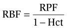

어디서

|  |  |
| --- | --- |
| RBF | = 신장 혈류량(mL/분) |
| RPF | = 신장 혈장 유량(mL/분) |
| Hct | = 헤마토크릿 |

따라서 RBF는 RPF를 1에서 적혈구 용적률로 나눈 값입니다. 여기서 **헤마토크릿**은 적혈구가 차지하는 혈액량의 비율이고 **1 − 헤마토크릿**은 혈장이 차지하는 혈액량의 비율입니다.

**예제 문제.** 소변 유속이 1mL/분인 남성의 혈장 PAH 농도는 1mg%, 소변 PAH 농도는 600mg%, 헤마토크릿은 0.45입니다. *그의 RBF는 무엇인가요?*

**해결책.** PAH의 신동맥 및 신정맥 농도에 대한 값이 제공되지 않기 때문에 *참* RPF(및 참 RBF)를 계산할 수 없습니다. 그러나 *유효* RPF는 PAH 제거로 계산할 수 있습니다. 유효 RBF는 적혈구 용적률을 사용하여 계산할 수 있습니다. *mg%*는 mg/100mL를 의미한다는 점을 기억하세요.

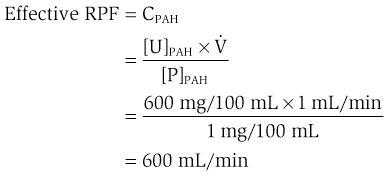

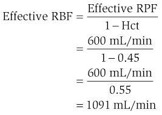

### 사구체 여과

사구체 여과는 소변 형성의 첫 번째 단계입니다. 신장 혈류가 사구체 모세혈관으로 들어갈 때, 그 혈액의 일부는 네프론의 첫 번째 부분인 보우만 공간으로 여과됩니다. 여과되는 체액은 간질액과 유사하며 **초여과액**이라고 합니다. 초여과액에는 물과 혈액의 작은 용질이 모두 포함되어 있지만 단백질과 혈액 세포는 포함되어 있지 않습니다. 사구체 여과를 담당하는 힘은 전신 모세혈관에서 작동하는 힘인 Starling 힘과 유사합니다([4장](CR%21G9RE0KW4PD33Q9F3DXNCSBNXCANP_split_011.html#filepos530928) 참조). 그러나 사구체 모세혈관 장벽의 특성과 표면적에는 차이가 있어 사구체 여과율이 전신 모세혈관의 여과율보다 훨씬 높습니다.

#### 사구체 여과 장벽의 특성

사구체 모세혈관벽의 물리적 특성은 사구체 여과 속도와 사구체 여과액의 특성을 모두 결정합니다. 이러한 특성에 따라 필터링되는 *대상*과 Bowman 공간으로 필터링되는 *얼마나*의 양이 결정됩니다.

##### *사구체 모세혈관의 층*

[그림 6-9](#filepos1252023)는 사구체 모세혈관의 주요 특징을 약 30,000배 확대한 모습이다. 모세혈관 내강에서 시작하여 보우만 공간 쪽으로 이동하면 다음 섹션에서 논의되는 세 개의 층이 사구체 모세혈관 벽을 구성합니다.

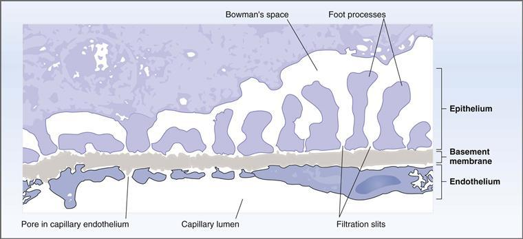

**그림 6-9 사구체 모세혈관벽의 구조.**

###### 내피세포

내피세포층에는 직경 70~100나노미터(nm)의 구멍이 있습니다. 이러한 구멍은 상대적으로 크기 때문에 액체, 용해된 용질 및 혈장 단백질은 모두 사구체 모세혈관 장벽의 이 층을 통해 여과됩니다. 반면, 모공은 혈액 세포를 걸러낼 수 있을 만큼 크지 않습니다.

###### 기저막

기저막은 세 개의 층으로 이루어져 있습니다. **lamina rara interna**는 내피세포에 융합되어 있습니다. **밀밀판**은 기저막 중앙에 위치합니다. **lamina rara externa**는 상피 세포층에 융합되어 있습니다. 다층 기저막은 혈장 단백질의 여과를 허용하지 않으므로 사구체 모세혈관의 가장 중요한 장벽을 구성합니다.

###### 상피

상피 세포층은 **발돌기**를 통해 기저막에 부착되는 **발세포**라는 특수 세포로 구성됩니다. 발돌기 사이에는 직경 25~60nm의 **여과 슬릿**이 있으며 얇은 격막으로 연결되어 있습니다. 여과 슬릿의 크기가 상대적으로 작기 때문에 기저막 외에 상피층도 여과에 중요한 장벽으로 간주됩니다.

##### *사구체 모세혈관 장벽의 음전하*

다양한 세공과 틈새로 인한 여과에 대한 크기 장벽 외에도 사구체 장벽의 또 다른 특징은 **음전하를 띤 당단백질**이 존재한다는 것입니다. 이러한 고정된 음전하는 내피, 기저막의 내부 및 외부, 족세포 및 족돌기, 상피의 여과 슬릿에 존재합니다. 이러한 고정된 음전하의 결과로 여과에 정전기 성분이 추가됩니다. 양전하를 띤 용질은 장벽의 음전하를 끌어당기고 더 쉽게 여과됩니다. 음전하를 띤 용질은 장벽의 음전하로부터 반발되어 쉽게 여과되지 않습니다.

Na+, K+, Cl- 또는 HCO3-와 같은 작은 용질의 경우 용질 여과에 대한 전하의 영향은 중요하지 않습니다. 전하와 관계없이 작은 용질은 사구체 장벽을 통해 자유롭게 필터링됩니다. 그러나 혈장 단백질과 같은 큰 용질의 경우 이러한 큰 용질의 분자 직경이 기공 및 슬릿의 직경과 유사하기 때문에 전하가 여과에 영향을 미칩니다. 예를 들어, 생리학적 pH에서 혈장 단백질은 순 음전하를 가지며 분자 크기 *및* 사구체 장벽을 둘러싸는 음전하에 의해 여과가 제한됩니다. 특정 사구체 질환에서는 장벽의 음전하가 제거되어 혈장 단백질의 여과가 증가하고 **단백뇨**가 발생합니다.

여담으로, 큰 용질의 여과에 대한 전하의 영향은 다양한 크기(분자 반경)와 다양한 순 전하를 갖는 일련의 덱스트란 분자의 여과 속도를 측정하여 쥐에서 입증되었습니다. 주어진 분자 반경에 대해 중성 덱스트란, 음전하(음이온) 덱스트란, 양전하(양이온) 덱스트란이 있었습니다. 모든 분자 반경에서 양이온성 덱스트란이 가장 여과성이 높았고, 음이온성 덱스트란이 가장 여과성이 낮았으며, 중성 덱스트란이 중간에 있었습니다. 양이온은 기공의 음전하를 끌어당기고 음이온은 밀어내며 중성 분자는 영향을 받지 않습니다.

#### 사구체 모세혈관을 가로지르는 찌르레기의 힘

전신 모세혈관에서와 마찬가지로 사구체 모세혈관 벽을 가로질러 유체 이동을 유도하는 압력은 스탈링 압력 또는 스탈링 힘입니다. 이론적으로 스탈링 압력에는 4가지가 있습니다. 정수압 2가지(모세혈관에 하나, 간질액에 하나)와 종양압 2개(모세혈관에 하나, 간질액에 하나)입니다. 이러한 압력을 사구체 모세혈관에 적용할 때 한 가지 작은 수정이 있습니다. 간질액과 유사한 보우만 공간의 종양압은 단백질 여과가 무시할 수 있기 때문에 0으로 간주됩니다.

##### *스탈링 방정식*

Fluid movement across the glomerular capillary wall is glomerular filtration. 이는 벽을 가로지르는 Starling 압력에 의해 구동되며 Bowman 공간의 종양압이 0이라는 가정 하에 **Starling 방정식:**으로 설명됩니다.

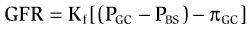

어디서

|  |  |
| --- | --- |
| GFR | = 사구체여과율(mL/min) |
| Kf | = 유압 컨덕턴스(mL/min • mm Hg) |
|  | 또는 |
|  | 여과계수(mL/min • mmHg) |
| PGC | = 사구체 모세혈관의 정수압(mmHg) |
| PBS | = 보우만 공간의 정수압(mm Hg) |
| πGC | = 사구체 모세혈관의 종양압(mmHg) |

Starling 방정식의 다음 매개변수 각각은 사구체 모세혈관에 적용되는 것으로 설명됩니다.

 **Kf, 여과 계수**는 사구체 모세혈관벽의 투수성 또는 수력 전도도입니다. Kf에 기여하는 두 가지 요소는 단위 표면적당 투수율과 전체 표면적입니다. 사구체 모세혈관의 Kf는 더 높은 총 표면적과 장벽의 더 높은 고유 수분 투과성의 조합으로 인해 전신 모세혈관(예: 골격근 모세혈관)의 Kf보다 100배 이상 높습니다. 이렇게 극도로 높은 Kf로 인해 다른 모세혈관보다 사구체 모세혈관에서 훨씬 더 많은 체액이 여과됩니다(즉, GFR은 180L/일입니다).

 **PGC**, **사구체 모세혈관의 정수압**은 여과를 선호하는 힘입니다. 전신 모세혈관과 비교할 때 PGC는 상대적으로 높습니다(45mmHg). 전신 모세혈관에서는 정수압이 모세혈관의 길이에 따라 떨어집니다. 사구체 모세혈관에서는 전체 길이에 걸쳐 일정하게 유지됩니다.

 **PBS**, **Bowman 공간의 정수압**은 여과에 반대되는 힘입니다. 이 압력(10mmHg)의 원인은 네프론의 내강에 존재하는 액체입니다.

 **πGC**, **사구체 모세혈관의 종양압**은 여과에 반대하는 또 다른 힘입니다. πGC는 사구체 모세혈관의 단백질 농도에 의해 결정됩니다. πGC*는 모세관 길이를 따라 일정하게 유지*되지 않습니다. 오히려 유체가 모세관에서 여과됨에 따라 점진적으로 증가합니다. πGC는 결국 순 한외여과압이 0이 되고 사구체 여과가 중지되는 지점(여과 평형이라고 함)까지 증가합니다.

즉, 사구체 여과율은 Kf와 순 한외여과압의 곱입니다. **순 한외여과 압력**, 즉 원동력은 세 개의 Starling 압력의 대수적 합입니다(Bowman 공간의 종양 압력 생략). 사구체 모세혈관의 경우 순 한외여과압은 **항상 여과를 선호**하므로 유체 이동 방향은 항상 모세혈관 *밖*입니다. 순압이 클수록 사구체 여과율이 높아집니다.

[그림 6-10](#filepos1262519)은 세 가지 Starling 압력을 그림으로 표현한 것으로, 각 압력은 화살표로 표시됩니다. 화살표의 *방향*은 압력이 모세관 밖으로 여과되거나 모세관으로 흡수되는 것을 선호하는지 여부를 나타냅니다. 화살표의 *크기*는 압력의 상대적 크기를 나타냅니다. 압력 수치(mmHg)에는 압력이 여과에 유리한 경우 *플러스 기호*가 표시되고, 압력이 흡수에 유리한 경우 *마이너스 기호*가 표시됩니다. 원동력인 순 한외여과압은 세 압력의 대수적 합입니다.

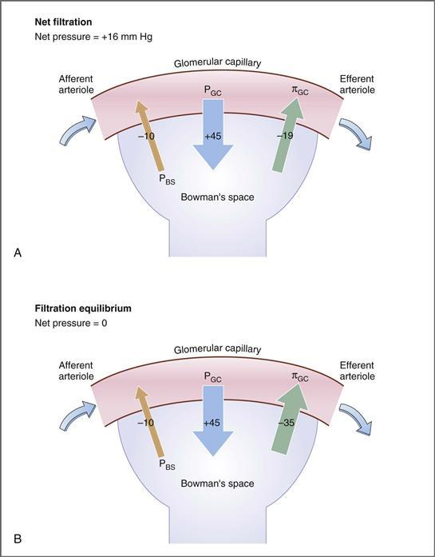

**그림 6–10 사구체 모세혈관을 가로지르는 찌르레기의 힘.**
**A,** 순 여과; **B,** 여과 평형. *화살표*는 Starling 압력의 방향을 나타냅니다. *숫자*는 압력의 크기(mmHg)입니다. *+ 기호*는 여과를 선호하는 압력을 나타냅니다. *− 기호*는 여과에 반대되는 압력을 나타냅니다. PGC, 사구체 모세혈관의 정수압; PBS, Bowman 공간의 정수압; πGC, 사구체 모세 혈관의 종양 압력.

[그림 6-10*A*](#filepos1262519)는 **사구체 모세혈관 시작**에서의 스탈링 압력 프로파일을 보여줍니다. 사구체 모세혈관 시작 부분에서는 혈액이 수입 세동맥에서 막 나왔고 아직 여과가 발생하지 않았습니다. 세 가지 Starling 압력의 합, 즉 순 한외여과 압력은 +16mmHg입니다. 따라서 순 한외여과 압력은 여과를 강력하게 선호합니다.

[그림 6-10*B*](#filepos1262519)는 **사구체 모세혈관 말단**에서의 세 가지 Starling 압력을 보여줍니다. 이 시점에서 혈액은 광범위하게 여과되었으며 사구체 모세혈관을 떠나 수출세동맥으로 들어가려고 합니다. 이제 세 개의 Starling 압력의 합은 0입니다. 순 한외여과는 0이기 때문에 여과가 일어날 수 없습니다. 이 지점을 **여과 평형**이라고 합니다. 편리하게도 여과 평형은 일반적으로 사구체 모세혈관 끝에서 발생합니다.

물어보아야 할 중요한 질문은 *여과 평형이 발생하는 원인은 무엇입니까?* 다르게 말하면 *순 한외여과압을 0으로 만들기 위해 어떤 Starling 압력이 변경되었습니까?* 이 질문에 대답하려면 사구체 모세혈관 시작 부분의 Starling 압력과 모세혈관 끝 부분의 Starling 압력을 비교하십시오. 변화하는 유일한 압력은 사구체 모세혈관의 종양압인 πGC입니다. 체액이 사구체 모세혈관에서 여과되면서 단백질이 남고 단백질 농도와 πGC가 증가합니다. 사구체 모세혈관이 끝날 때까지 πGC는 순 한외여과압이 0이 되는 지점까지 증가했습니다. (관련 요점은 사구체 모세혈관에서 나가는 이 혈액이 세뇨관 주위 모세혈관이 된다는 것입니다. 따라서 세뇨관 주위 모세혈관은 높은 종양압(πc)을 가지며, 이는 네프론 근위세뇨관에서 재흡수를 위한 원동력이 됩니다.) 전신 모세혈관에서 발생하는 것처럼 사구체 모세혈관의 길이에 따라 PGC가 감소하지 않습니다. 사구체 모세혈관의 차이점은 두 번째 세동맥 세트인 원심성 세동맥이 있다는 점입니다. 원심성 세동맥의 수축은 체액이 사구체 모세혈관의 길이를 따라 여과될 때 발생할 수 있는 PGC의 감소를 방지합니다.

##### *스탈링 압력의 변화*

GFR은 순 한외여과압에 따라 달라지며, 이는 다시 사구체 모세혈관 벽을 가로지르는 Starling 압력의 합에 따라 달라집니다. 따라서 GFR의 변화는 Starling 압력 중 하나의 변화로 인해 발생할 수 있다는 것이 분명합니다([표 6-6](#filepos1266367)).

표 6-6 신장 혈장 흐름, 사구체 여과율 및 여과 비율에 대한 찌르레기 힘의 변화 효과

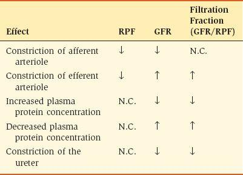

GFR, 사구체 여과율; N.C., 변화 없음; RPF, 신장 혈장 흐름.

 **PGC의 변화**는 수입성 세동맥과 원심성 세동맥의 저항 변화에 의해 생성됩니다. 분명한 이유로 GFR의 변화는 영향을 받은 세동맥에 따라 반대 방향으로 발생합니다. 이러한 현상의 메커니즘은 [그림 6-11](#filepos1267254)과 같다.

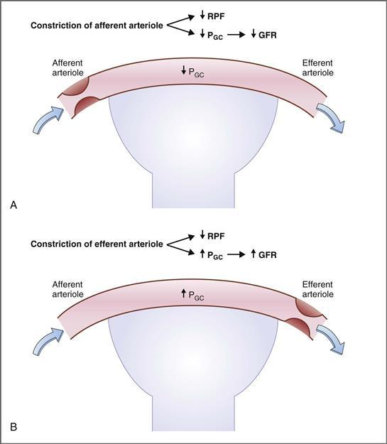

**그림 6–11 수축성 구심성(A) 및 원심성(B) 세동맥이 신장 혈장 흐름(RPF) 및 사구체 여과율(GFR)에 미치는 영향.** PGC, 사구체 모세혈관의 정수압.

[그림 6-11*A*](#filepos1267254)는 **수심세동맥의 수축**을 보여주며, 이는 수입세동맥 저항이 증가하는 모습이다. 세동맥 수축에서 예상한 대로 RPF는 감소합니다. 사구체 모세혈관으로 유입되는 혈액의 양이 줄어들수록 PGC가 감소하여 순 한외여과압이 감소하기 때문에 GFR도 감소합니다. 그 예로는 **교감 신경계**의 영향과 *높은* 수준의 안지오텐신 II가 있습니다.

[그림 6-11*B*](#filepos1267254)는 **수출세동맥의 수축**을 보여주며, 이는 원심성 세동맥 저항이 증가하는 모습이다. RPF에 대한 세동맥 수축의 효과는 수입세동맥의 수축과 동일하지만(감소), GFR에 대한 효과는 반대입니다(증가). 혈액이 사구체 모세혈관에서 나가는 것이 제한되어 PGC 및 순 한외여과압이 증가하기 때문에 GFR이 증가합니다. 한 가지 예는 **안지오텐신 II**의 *낮은* 수준의 효과입니다.

RPF 및 GFR에 대한 **안지오텐신 II**의 효과는 중요한 의미를 갖습니다. 안지오텐신 II는 구심성 세동맥과 원심성 세동맥을 모두 수축하지만, 원심성 세동맥을 우선적으로 수축합니다. 따라서, 낮은 수준의 안지오텐신 II는 원심성 세동맥에 큰 수축 효과를 갖고, 수입성 세동맥에 작은 수축 효과를 가져 RPF가 감소하고 GFR이 증가합니다. 높은 수준의 안지오텐신 II(출혈에 대한 반응으로 나타남)는 원심성 세동맥에 대해 뚜렷한 수축 효과를 갖고, 수입성 세동맥에 대해 중간 정도의 수축 효과를 가져 RPF가 감소하고 GFR이 더 적게 감소합니다. 따라서 낮은 수준과 높은 수준의 안지오텐신 II 모두 원심성 세동맥에 대한 우선적인 효과 때문에 GFR은 혈관 수축 상황에서 "보호"되거나 "보존"됩니다. **안지오텐신 전환 효소**(**ACE**) **억제제**는 안지오텐신 II의 생성을 차단하고 GFR에 대한 보호 효과를 상쇄하거나 제거합니다.

 **πGC의 변화**는 혈장 단백질 농도의 변화에 ​​의해 생성됩니다. 따라서 혈장 단백질 농도가 증가하면 **πGC가 증가하고** 순 한외여과압과 GFR이 모두 감소합니다. 반면, 혈장 단백질 농도가 감소하면(예: 다량의 단백질이 소변으로 손실되는 신증후군) **πGC가 감소하여 순 한외여과압과 GFR이 모두 증가합니다.

 **PBS의 변화**는 소변 흐름을 방해함으로써 발생할 수 있습니다(예: 요관 결석 또는 요관 수축). 예를 들어, **요관이 수축**되면 소변이 요관을 통해 방광으로 흐를 수 없어 소변이 신장에 정체됩니다. 결과적으로, 네프론의 정수압은 보우만 공간까지 증가하여 PBS의 증가를 생성합니다. PBS의 증가는 순 한외여과압을 감소시켜 GFR을 감소시킵니다.

#### 사구체 여과율 측정

GFR은 사구체 마커의 제거로 측정됩니다. **사구체 마커**에는 다음 세 가지 특성이 있습니다. (1) 크기나 전하 제한 없이 사구체 모세혈관을 통해 자유롭게 필터링되어야 합니다. (2) 세뇨관에서 재흡수되거나 분비될 수 없습니다. (3) 주입되면 GFR을 변경할 수 없습니다. 따라서 이상적인 사구체 표지자의 특성은 RPF(즉, PAH)를 측정하는 데 사용되는 표지 물질의 특성과 다릅니다.

##### *이눌린 제거*

이상적인 사구체 표지자는 분자량이 약 5000달톤인 과당 중합체인 **이눌린**입니다. 이눌린은 혈장 단백질에 결합되지도 않고 전하를 띠지도 않으며, 분자 크기는 사구체 모세혈관 벽을 가로질러 **자유롭게 여과**될 정도입니다. 일단 여과되면 이눌린은 신세뇨관에서 완전히 비활성 상태가 됩니다. 즉, 신세뇨관 세포에 의해 **재흡수되거나 분비되지 않습니다**. 따라서 사구체 모세혈관을 통해 여과되는 이눌린의 양은 소변으로 배설되는 이눌린의 양과 정확히 동일합니다.

다음 방정식으로 표현된 것처럼 이눌린 제거율은 GFR과 동일합니다.

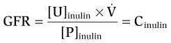

어디서

|  |  |
| --- | --- |
| GFR | = 사구체여과율(mL/min) |
| [U]이눌린 | = 소변 이눌린 농도(mg/mL) |
| [피]이눌린 | = 이눌린의 혈장 농도(mg/mL) |
| 이미지 | = 소변 유속(mL/min) |
| 시눌린 | = 이눌린 제거율(mL/분) |

GFR을 측정하기 위한 이눌린 사용에 관한 몇 가지 추가 사항에 유의해야 합니다. (1) 이눌린은 내인성 물질이 아니므로 정맥 내로 주입해야 합니다. (2) 분수의 분자 [U]이눌린 × 는 이눌린의 배설율과 같습니다. (3) 혈장 이눌린 농도의 변화는 *GFR을 변경하지 않습니다*. 그러나 방정식을 조사하면 반대 결론이 나올 수도 있습니다. 예를 들어, 다음 논리에 따르면 혈장 이눌린 농도의 증가(더 많은 이눌린 주입)는 GFR을 감소시키지 *않습니다*: 혈장 이눌린 농도가 증가하면 여과된 이눌린의 양도 증가하여 배설되는 이눌린의 양이 증가합니다(예: [U]이눌린 × ). 따라서 분자와 분모는 비례적으로 증가하며, GFR 계산값은 영향을 받지 않습니다. (4) GFR(또는 이눌린 청소율)도 소변 유량의 변화에 ​​영향을 받지 않지만 방정식을 조사하면 다시 반대 결론이 나올 수 있습니다. 소변 유량()이 증가하면 소변의 이눌린 농도인 [U]이눌린은 희석에 따라 비례적으로 감소합니다. 따라서 분자([U]inulin × 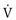)와 계산된 GFR 값은 다음 샘플 문제에 설명된 것처럼 소변 유량의 변화에 영향을 받지 않습니다.

**예제 문제.** 임상 연구 센터의 신장 연구에 동의한 여성에게 GFR을 측정하기 위해 이눌린을 주입했습니다. 측정 과정에서 다량의 물을 마시게 하여 소변 유량을 의도적으로 변경했습니다. [P]이눌린은 주입 시 1mg/mL로 일정하게 유지됩니다. 물을 마시기 전후의 소변량과 [U]이눌린은 다음과 같습니다.

> |  |  |
> | --- | --- |
> | **물을 마시기 전** | **물을 마신 후** |
> | [U]이눌린 = 100mg/mL | [U]이눌린 = 20mg/mL |
> | 이미지 = 1mL/분 | 이미지 = 5mL/분 |

*소변량(식수로 생성) 증가가 여성의 GFR에 어떤 영향을 미치나요?*

**해결책.** 여성이 물을 마신 전후의 이눌린 제거율로부터 GFR을 계산하십시오.

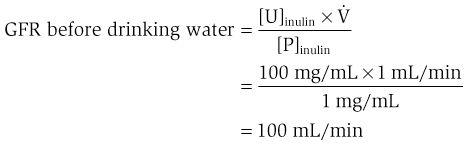

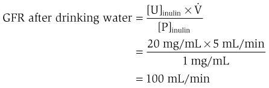

두 조건에서 소변 유량이 현저하게 다름에도 불구하고 GFR은 절대적으로 일정했습니다. 소변 유속이 1mL/min에서 5mL/min으로 증가함에 따라 [U]이눌린은 (희석에 의해) 100mg/mL에서 20mg/mL로 감소했습니다(비례 변화).

##### *사구체 여과율에 대한 기타 지표*

이눌린은 유일하게 완벽한 사구체 표지자입니다. 다른 마커는 완벽하지 않습니다. 가장 가까운 물질은 **크레아티닌**으로 사구체 모세혈관을 통해 자유롭게 여과되지만 소량으로도 분비됩니다. 따라서 크레아티닌 제거율은 GFR을 약간 과대평가합니다. 그러나 크레아티닌 사용의 편리성은 이러한 작은 오류를 능가합니다. 크레아티닌은 내인성 물질이며(이눌린은 아님) GFR을 측정하기 위해 주입할 필요가 없습니다.

요소와 크레아티닌은 모두 사구체 모세혈관을 통해 여과되기 때문에 **혈액 요소질소**(**BUN**)와 **혈청 크레아티닌 농도**를 모두 사용하여 GFR을 추정할 수 있습니다. 따라서 각 물질은 소변으로 배설되기 위해서는 여과 단계에 따라 달라집니다. GFR이 감소하면(예: 신부전) BUN과 혈청 크레아티닌이 적절하게 여과되지 않아 증가합니다.

**용적 수축(저혈량증)**은 신장 관류를 감소시키고 결과적으로 GFR을 감소시킵니다**(신전 질소혈증).** 신전질 질소혈증에서는 GFR 감소로 인해 BUN과 혈청 크레아티닌이 모두 증가합니다. 그러나 요소는 재흡수되고 크레아티닌은 재흡수되지 않기 때문에 BUN은 혈청 크레아티닌보다 더 많이 증가합니다. 부피 수축에서는 요소를 포함한 모든 용질의 근위부 재흡수가 증가하며, 이는 BUN의 더 큰 증가를 담당합니다. 따라서 용적 수축(*신전* 질소혈증)의 한 가지 지표는 **BUN/크레아티닌 비율**이 20 이상으로 증가한 것입니다. 대조적으로 *신장* 원인(예: 만성 신부전)으로 인한 신부전은 BUN과 혈청 크레아티닌 모두 증가하지만 BUN/크레아티닌 비율은 증가하지 않습니다.

#### 여과분수

여과율은 사구체 여과율(GFR)과 신장 혈장 흐름(RPF) 사이의 관계를 나타냅니다. 여과 분율은 다음 방정식으로 표현됩니다.

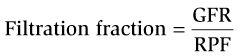

즉, 여과 분율은 사구체 모세혈관을 통해 여과되는 RPF의 분율입니다. 여과 분율 값은 일반적으로 약 **0.20 또는 20%**입니다. 즉, RPF의 20%가 필터링되고 80%가 필터링되지 않습니다. 여과되지 않은 RPF의 80%는 원심성 세동맥을 통해 사구체 모세혈관을 떠나 세뇨관 주위 모세혈관 혈류가 됩니다.

연습으로서 여과율의 변화가 세뇨관 주위 모세혈관의 단백질 농도와 종양압(πc)에 미치는 영향에 대해 생각해 보십시오. 여과율이 증가하면([표 6-6](#filepos1266367) 참조) 사구체모세혈관에서 여과되는 체액이 상대적으로 많아져 모세혈관의 단백질 농도가 평소보다 크게 증가하게 된다. 따라서 여과 분획의 증가는 단백질 농도와 세뇨관 주위 모세혈관의 πc를 증가시킵니다(이는 이 장의 뒷부분에서 논의되는 근위세뇨관의 재흡수 메커니즘에 영향을 미칩니다).

### 재흡수 및 분비

사구체 여과를 통해 혈장 한외여과액이 대량(180L/일) 생성됩니다. 이 초여과액이 변형되지 않은 채 배설된다면 매일 소변으로 다음 양이 손실될 것입니다: 물 180L; 25,200mEq의 Na+; 19,800mEq의 Cl-; 4320mEq의 HCO3−; 그리고 포도당 14,400mg. 이러한 각각의 손실은 *전체* ECF에 존재하는 금액의 10배 이상을 나타냅니다. 다행스럽게도 세뇨관을 둘러싸고 있는 상피 세포의 재흡수 메커니즘은 이러한 물질을 순환계와 ECF로 되돌려 보냅니다. 또한 상피 세포의 분비 메커니즘은 세뇨관 주위 모세 혈관에서 특정 물질을 제거하여 소변에 추가합니다.

#### 재흡수 및 분비 측정

여과, 재흡수, 분비의 과정은 [그림 6-12](#filepos1282255)와 같다. 구심성 세동맥과 원심성 세동맥이 있는 사구체 모세혈관이 표시됩니다. 네프론의 초기 부분(보우만 공간과 근위곡세뇨관의 시작 부분)이 표시되어 있으며 상피 세포가 늘어서 있습니다. 근처에는 원심성 세동맥에서 나와 네프론에 혈액을 공급하는 세뇨관 주위 모세혈관이 있습니다.

**그림 6–12 네프론의 여과, 재흡수 및 분비 과정.** 세 가지 과정의 합은 배설입니다.

 **여과.** 간질성 액체가 사구체 모세혈관을 거쳐 보우만 공간으로 여과됩니다. 단위 시간당 보우만 공간으로 여과된 물질의 양을 **여과된 부하**라고 합니다. 보우만 공간과 네프론의 내강에 있는 유체를 관형액 또는 관강액이라고 합니다.

 **재흡수.** 물과 많은 용질(예: Na+, Cl−, HCO3−, 포도당, 아미노산, 요소, Ca2+, Mg2+, 인산염, 젖산염 및 구연산염)은 사구체 여과액에서 세뇨관 주위 모세혈관으로 재흡수됩니다. 재흡수 메커니즘은 신장 상피 세포막의 수송체와 관련이 있습니다. 강조된 바와 같이, 재흡수가 발생하지 않으면 ECF의 이러한 성분 중 대부분이 소변으로 빠르게 손실됩니다.

 **분비.** 몇 가지 물질(예: 유기산, 유기 염기, K+)이 세뇨관 주위 모세혈관에서 세뇨관액으로 분비됩니다. 따라서 여과 외에도 분비는 소변으로 물질을 배설하는 메커니즘을 제공합니다. 재흡수와 마찬가지로 분비 메커니즘에는 네프론을 감싸는 상피 세포막의 수송체가 포함됩니다.

 **배설량.** 배설 또는 배설률이란 물질이 단위 시간당 배설되는 양을 말합니다. 배설은 여과, 재흡수, 분비 과정의 순 결과 또는 합계입니다. 배설률을 여과된 부하량과 비교하여 물질이 재흡수되었는지, 분비되었는지를 판단할 수 있습니다.

필터링된 부하, 배설 속도, 재흡수 또는 분비 속도를 계산하는 데 다음 방정식이 사용됩니다.

즉, 필터링된 부하와 배설 속도의 차이가 순 재흡수 또는 순 분비 속도입니다. 여과된 부하가 배설 속도보다 크면 물질의 **순 재흡수**가 발생한 것입니다. 필터링된 부하가 배설률보다 낮으면 물질이 **순 분비**된 것입니다. 이러한 계산 방식은 [그림 6-13](#filepos1285496)과 같다. 재흡수되는 물질에 대한 한 가지 예가 주어지고, 분비되는 물질에 대한 또 다른 예가 주어집니다.

**그림 6–13 재흡수되거나 분비되는 물질의 예.**
**A,** Na+의 순 재흡수 예. Na+는 여과되어 신장 상피 세포에 의해 재흡수됩니다. Na+ 배설량은 여과된 부하와 재흡수율의 차이입니다. **B,** PAH(*파라*-아미노히푸르산)의 순 분비의 예. PAH는 신장 상피 세포에 의해 여과되고 분비됩니다. PAH 배설량은 필터링된 부하와 분비율의 합입니다. 필터링된 부하, 재흡수 또는 분비 속도, 배설 속도(mEq/일)에 대한 계산이 표시됩니다. GFR, 사구체 여과율; PNa+, Na+의 혈장 농도; PPAH, PAH의 혈장 농도; UNa+, 소변 Na+ 농도; UPAH, PAH의 소변 농도.

[Figure 6-13*A*](#filepos1285496) illustrates the renal handling of Na+, a solute that is freely filtered and subsequently reabsorbed. 이 예에서 필터링된 Na+ 부하는 25,200mEq/day(GFR × [P]Na+)이고 Na+ 배설율은 100mEq/day(×[U]Na+)입니다. 여과된 Na+ 부하가 배설 속도보다 높기 때문에 **Na+의 순 재흡수**가 있었음에 틀림없습니다.** 신장은 하루에 25,100mEq를 재흡수하며, 이는 여과된 부하(25,100mEq/25,200mEq)의 99.4%에 해당합니다.

[그림 6-13*B*](#filepos1285496)는 여과된 후 분비되는 용질인 PAH의 신장 처리를 보여줍니다. 이 예에서 필터링된 PAH 부하량은 18g/일(GFR × [P]PAH)이고, PAH 배설량은 54g/일( × [U]PAH)입니다. PAH의 필터링된 부하가 배설률보다 적기 때문에 **PAH의 순 분비**가 36g/일(배출률 - 필터링된 부하)에 달했을 것입니다. 이 예에서 PAH의 분비율은 원래 필터링된 부하의 두 배입니다.

#### 포도당—재흡수의 예

포도당은 사구체 모세혈관을 통해 여과되고 근위곡세뇨관의 상피세포에 의해 재흡수됩니다. 포도당 재흡수는 내강막을 통한 **Na+-포도당 공동수송**과 세뇨관 주위막을 통한 **촉진된 포도당 수송**을 포함하는 2단계 과정입니다. 제한된 수의 포도당 운반체가 있기 때문에 메커니즘은 포화됩니다. 즉, **전송 최대값** 또는 **Tm.**이 있습니다.

##### *포도당 재흡수를 위한 세포 메커니즘*

[그림 6-14](#filepos1289371)는 초기 근위세뇨관에서 포도당 재흡수에 대한 세포적 메커니즘을 보여준다. 상피세포의 내강막은 관형액(내강)을 향하고 있으며 Na+-포도당 공동수송체를 함유하고 있습니다. 세포의 세뇨관 주위 막 또는 기저외막은 세뇨관 주위 모세혈관과 마주하고 있으며 Na+-K+ ATPase와 촉진된 포도당 수송체를 포함합니다. 세뇨관액에서 세뇨관 주위 모세혈관으로 포도당을 재흡수하는 데에는 다음 단계가 포함됩니다.

**그림 6–14 초기 근위세뇨관에서 포도당 재흡수의 세포 메커니즘.**

1. 포도당은 내강막에 있는 **Na+-포도당 공동수송체**(**SGLT**라고 함)를 통해 관형액에서 세포로 이동합니다. 두 개의 Na+ 이온과 하나의 포도당이 공동수송 단백질에 결합하고, 단백질은 막에서 회전하고, Na+와 포도당은 ICF로 방출됩니다. 이 단계에서 포도당은 전기화학적 구배에 반하여 운반됩니다. 이러한 포도당의 *오르막* 수송을 위한 에너지는 Na+의 *내리막* 움직임에서 나옵니다.
2. Na+ 구배는 세뇨관 주위 막의 Na+-K+ ATPase에 의해 유지됩니다. ATP는 Na+-K+ ATPase에 에너지를 공급하기 위해 *직접적으로* 사용되고 Na+ 구배를 유지하기 위해 *간접적으로* 사용되기 때문에 Na+-포도당 공동수송을 **2차 능동 수송**이라고 합니다.
3. 포도당은 **촉진 확산**에 의해 세포에서 세뇨관 주위 모세혈관으로 운반됩니다. 이 단계에서 포도당은 전기화학적 기울기를 따라 이동하며 에너지가 필요하지 않습니다. 포도당의 촉진 확산에 관여하는 단백질은 **GLUT 1** 및 **GLUT 2**라고 불리며, 이는 더 큰 포도당 운반체 계열에 속합니다.

##### *포도당 적정 곡선 및 Tm*

**포도당 적정 곡선**은 혈장 포도당 농도와 포도당 재흡수 사이의 관계를 나타냅니다([그림 6-15](#filepos1291876)). 비교를 위해 필터링된 포도당 부하와 포도당 배설율을 동일한 그래프에 표시합니다. 포도당 적정 곡선은 포도당을 주입하고 혈장 농도가 증가함에 따라 재흡수 속도를 측정하여 실험적으로 얻습니다. 적정 곡선은 각 관계를 개별적으로 검토한 다음 세 가지 관계를 모두 함께 고려함으로써 가장 잘 이해됩니다.

**그림 6–15 포도당 적정 곡선.** 포도당 여과, 재흡수 및 배설은 혈장 포도당 농도의 함수로 표시됩니다. *해칭된 부분*은 스플레이입니다. Tm, 관형 운송 최대값.

 **필터링된 로드.** 포도당은 사구체 모세혈관을 통해 자유롭게 필터링되며 필터링된 로드는 GFR과 혈장 포도당 농도의 곱입니다(필터링된 로드 = GFR × [P]x). 따라서 혈장 포도당 농도가 증가함에 따라 필터링 부하가 선형적으로 증가합니다.

 **재흡수.** 혈장 포도당 농도가 200mg/dL 미만이면 Na+-포도당 공동수송체가 풍부하기 때문에 여과된 포도당이 모두 재흡수될 수 있습니다. 이 범위에서 재흡수 곡선은 여과 곡선과 동일합니다. 즉, 재흡수는 여과와 같습니다. 단, 통신사 수는 제한되어 있습니다. 혈장 농도가 200mg/dL을 초과하면 여과된 포도당 중 일부가 재흡수되지 않기 때문에 재흡수 곡선이 *휘어집니다*. 혈장 농도가 350mg/dL을 초과하면 담체는 완전히 **포화**되고 최대 값인 **Tm.**에서 재흡수 수준이 떨어집니다.

 **배설.** 배설 곡선을 이해하려면 여과 곡선과 재흡수 곡선을 비교하십시오. 혈장 포도당 농도가 200mg/dL 미만이면 여과된 포도당은 모두 재흡수되고 배설되지 않습니다. 혈장 포도당 농도가 200mg/dL을 초과하면 운반자는 포화점에 가까워집니다. 여과된 포도당의 대부분은 재흡수되지만 일부는 그렇지 않습니다. 재흡수되지 않은 포도당은 배설됩니다. 포도당이 소변으로 처음 배설되는 혈장 농도를 **역치**라고 하며, 이는 Tm보다 낮은 혈장 농도에서 발생합니다. 350mg/dL 이상이면 Tm에 도달하고 담체는 완전히 포화됩니다. 이제 배설 곡선은 여과 곡선과 평행하게 혈장 포도당 농도의 함수로 선형적으로 증가합니다.

포도당의 Tm은 급격하게 접근하기보다는 점진적으로 접근하게 되는데([그림 6-15](#filepos1291876) 참조) 이러한 현상을 **splay**라고 합니다. 스플레이는 재흡수가 포화에 *접근*하지만 *완전히* 포화되지는 않은 적정 곡선의 부분입니다. 스플레이로 인해 포도당은 Tm 값에서 재흡수 수준이 떨어지기 전에 소변으로(즉, 역치에서) 배설됩니다.

스플레이에는 두 가지 설명이 있습니다. 첫 번째 설명은 Na+-포도당 공동수송체의 **낮은 친화성**에 기초합니다. 따라서 Tm 근처에서 포도당이 운반체에서 분리되면 다시 붙을 수 있는 결합 부위가 거의 남아 있지 않기 때문에 포도당이 소변으로 배설됩니다. 확산에 대한 두 번째 설명은 네프론의 **이질성**에 기초합니다. 전체 신장의 Tm은 모든 네프론의 *평균* Tm을 반영하지만 모든 네프론의 Tm이 정확히 동일한 것은 아닙니다. 일부 네프론은 다른 네프론보다 낮은 혈장 농도에서 Tm에 도달하며, 평균 Tm에 도달하기 전에 포도당이 소변으로 배설됩니다.

##### *당뇨병*

정상 혈장 포도당 농도(70~100mg/dL)에서는 여과된 포도당이 모두 재흡수되고 배설되지 않습니다. 그러나 어떤 상황에서는 **당뇨병**(소변으로 포도당이 배설되거나 쏟아지는 현상)이 발생합니다. 당뇨병의 원인은 다시 포도당 적정곡선을 참조하여 이해할 수 있습니다. (1) 조절되지 않는 **당뇨병**에서는 인슐린 부족으로 인해 혈장 포도당 농도가 비정상적으로 높은 수준으로 증가합니다. 이 상태에서는 여과된 포도당의 양이 재흡수 능력을 초과하여(즉, 혈장 포도당 농도가 Tm보다 높음) 포도당이 소변으로 배설됩니다. (2) **임신 중** GFR이 증가하여 재흡수 능력을 초과할 정도로 포도당의 여과량이 증가합니다. (3) 여러 선천적 **Na+-포도당 공동수송체의 이상**은 Tm 감소와 관련되어 있으며, 이로 인해 포도당이 정상 혈장 농도보다 낮은 수준으로 소변으로 배설됩니다([박스 6-1](#filepos1296889)).

**상자 6-1 임상 생리학: 당뇨병**

> **사례 설명.** 한 여성이 과도한 갈증과 배뇨 때문에 의사를 방문했습니다. 지난 주 동안 그녀는 낮에는 한 시간에 한 번씩, 밤에는 4~5번 소변을 보았습니다. 그녀의 의사는 계량봉을 사용하여 소변을 검사하고 포도당을 검출합니다. 그녀는 밤새 금식하고 다음날 아침에 당 내성 테스트를 보고하도록 요청 받았습니다. 포도당 용액을 마신 후 혈당 농도는 200mg/dL에서 800mg/dL로 증가했습니다. 소변량과 포도당 농도를 측정하기 위해 검사 전반에 걸쳐 일정한 간격으로 소변을 수집합니다. 여성의 사구체 여과율(GFR)은 내인성 크레아티닌 청소율을 기준으로 120mL/분으로 추정됩니다. 포도당의 재흡수율(포도당 여과량 - 포도당 배설율)을 계산하면 375 mg/min으로 일정하다는 것을 알 수 있다. 의사는 여성의 당뇨병의 원인이 (신장 포도당 수송 메커니즘의 결함이 아니라) 제1형 당뇨병이라고 결론지었습니다.

> **사례 설명.** 이 여성의 당뇨병에 대한 두 가지 가능한 설명은 다음과 같습니다. (1) 포도당에 대한 신장 수송 메커니즘의 결함 또는 (2) 근위세뇨관의 재흡수 용량을 초과하는 여과된 포도당 부하의 증가. 어느 설명이 맞는지 판단하기 위해 혈장 포도당 농도가 증가함에 따라 재흡수율을 측정하여 포도당의 최대 재흡수율(Tm)을 결정합니다. 375 mg/min의 Tm 값이 발견되었으며 이는 정상으로 간주됩니다. 따라서 의사는 여성의 당뇨병의 원인이 췌장에서 인슐린 분비가 부족하여 혈당 농도가 비정상적으로 상승한 것이라고 결론 내립니다. 당뇨병이 신장 결함으로 인해 발생했다면 Tm은 정상보다 낮을 것입니다.

> 과도한 배뇨는 세뇨관액에 재흡수되지 않은 포도당이 존재하기 때문에 발생합니다. 포도당은 삼투성 이뇨제 역할을 하며 수분을 보유하고 소변 생산량을 증가시킵니다. 여성의 과도한 갈증은 과도한 소변 생산으로 인해 부분적으로 설명됩니다. 또한, 높은 혈당 농도는 혈액의 삼투압을 증가시키고 갈증 중추를 자극합니다.

> **치료.** 여성은 정기적인 인슐린 주사로 치료를 받습니다.

#### 요소 - 수동 재흡수의 예

요소는 네프론의 대부분의 부분에서 운반됩니다([그림 6-16](#filepos1300624)). 담체 매개 메커니즘에 의해 재흡수되는 포도당과 달리 요소는 확산(단순 확산 및 촉진 확산)에 의해 재흡수되거나 분비됩니다. 재흡수 또는 분비 속도는 세뇨관액과 혈액 사이의 요소 농도 차이와 요소에 대한 상피 세포의 투과성에 의해 결정됩니다. 농도 차이가 크고 투과성이 높을 때 요소 재흡수가 높습니다. 농도 차이가 작거나 투과성이 낮을 때 요소 재흡수는 낮습니다.

**그림 6–16 네프론에서 요소 처리.**
*화살표*는 요소 재흡수 또는 분비 위치를 나타냅니다. 숫자는 네프론을 따라 다양한 지점에 남아 있는 필터링된 부하의 백분율입니다. UT1, 요소수송체 1. ADH, 항이뇨호르몬.

요소는 사구체 모세혈관을 통해 자유롭게 여과되며, 초기 여과액의 농도는 혈액의 농도와 동일합니다(즉, 처음에는 요소 재흡수에 대한 농도 차이나 추진력이 없습니다). 그러나 물이 네프론을 따라 재흡수됨에 따라 세뇨관액의 요소 농도가 증가하여 수동적 요소 재흡수의 원동력이 생성됩니다. 따라서 요소 재흡수는 일반적으로 물 재흡수와 동일한 패턴을 따릅니다. 즉, 물 재흡수가 많을수록 요소 재흡수는 커지고 요소 배설은 낮아집니다.

**근위 세뇨관**에서는 여과된 요소의 50%가 단순 확산에 의해 재흡수됩니다. 물이 근위세뇨관에서 재흡수됨에 따라 요소는 약간 뒤처져 세뇨관 내강의 요소 농도가 혈액의 요소 농도보다 약간 높아지게 됩니다. 이 농도 차이는 수동적 요소 재흡수를 유도합니다. 근위세뇨관 끝에서 여과된 요소의 50%가 재흡수되었습니다. 따라서 루멘에는 50%가 남아 있습니다. **헨레고리의 얇은 하행부**에서 요소가 분비됩니다. 나중에 설명할 메커니즘에 따르면 내부 수질의 간질액에는 요소 농도가 높습니다. 헨레 고리의 얇은 하행 가지는 내부 수질을 통과하고, 요소는 간질액의 고농도에서 네프론의 내강으로 확산됩니다. 근위 세뇨관에서 재흡수된 것보다 더 많은 요소가 얇은 하행 사지로 분비됩니다. 따라서 Henle 루프의 굴곡부에는 여과된 요소 부하의 110%가 존재합니다. **헨레의 두꺼운 상행 사지, 원위 세뇨관, 피질 및 외부 수질 집합관**은 요소에 불투과성이므로 이 부분에서는 요소 수송이 발생하지 않습니다. 그러나 항이뇨 호르몬(ADH)이 있는 경우 말단 원위 세뇨관과 피질 및 외부 수질 집합관에서 물이 재흡수됩니다. 결과적으로 이러한 부분에서는 요소가 "뒤에 남아" 세뇨관액의 요소 농도가 상당히 높아집니다. **내부 수질 집합관**에는 ADH에 의해 활성화되는 요소의 확산을 촉진하는 특정 수송체(요소 수송체 1, **UT1**)가 있습니다. 따라서 ADH가 있는 경우 요소는 UT1에 의해 재흡수되어 농도 구배를 따라 내강에서 내부 수질의 간질액으로 이동합니다. ADH가 있는 경우 여과된 요소의 약 70%가 UT1에 의해 재흡수되고 여과된 요소의 40%는 소변으로 배설됩니다. 내부 수질로 재흡수된 요소는 **요소 재활용**이라는 과정에서 피질 유두 삼투압 구배에 기여합니다. 이에 대해서는 이후 섹션에서 설명합니다.

#### *파라*-아미노히푸르산 - 분비의 예

RPF 측정에 사용되는 물질로 PAH가 도입되었습니다. PAH는 사구체 모세혈관을 통해 여과되고 세뇨관 주위 모세혈관에서 세뇨관액으로 분비되는 **유기산**입니다. 포도당과 마찬가지로 PAH 여과, 분비, 배설을 동시에 그래프로 표시할 수 있다([그림 6-17](#filepos1304629)). (PAH의 경우 재흡수 대신 분비가 표시됩니다.)

**그림 6–17 PAH 적정 곡선.** PAH(*파라*-아미노히푸르산) 여과, 분비 및 배설은 혈장 PAH 농도의 함수로 표시됩니다. Tm, 관형 운송 최대값.

 **필터링된 로드.** 혈액 내 PAH의 10%는 혈장 단백질에 결합되어 있으며 *결합되지 않은* 부분만 사구체 모세혈관을 통해 필터링할 수 있습니다. PAH의 필터링된 부하는 PAH의 *비결합* 농도가 증가함에 따라 선형적으로 증가합니다(필터링된 부하 = GFR × [P]x).

 **분비.** PAH(및 기타 유기 음이온)의 수송체는 근위 세뇨관 세포의 세뇨관 주위 막에 위치합니다. 이러한 운반체는 혈액에서 내강까지 세포 전체에 걸쳐 PAH를 결합하고 운반하는 제한된 능력을 가지고 있습니다. PAH 농도가 낮으면 많은 운반체가 이용 가능하며 혈장 농도가 증가함에 따라 분비가 선형적으로 증가합니다. PAH 농도가 캐리어가 포화되는 수준까지 증가하면 **Tm**에 도달합니다. 이 시점 이후에는 PAH 농도가 아무리 높아져도 더 이상 분비율이 증가하지 않습니다. PAH 수송체는 또한 **페니실린**과 같은 약물의 분비를 담당하며 **프로베네시드**에 의해 억제됩니다.

덧붙여 말하면, PAH와 같은 유기산의 분비가 있는 것처럼 근위세뇨관의 **유기 염기**(예: 퀴닌, 모르핀)에도 평행한 분비 메커니즘이 있습니다. 유기산과 염기에 대한 이러한 분비 메커니즘은 다음의 비이온 확산에 대한 논의와 관련이 있습니다.

 **배설.** PAH와 같은 분비성 물질의 경우 배설은 여과와 분비의 합을 의미합니다. 낮은 PAH 농도(Tm 미만)에서는 여과와 분비가 모두 증가하므로 혈장 PAH 농도가 증가함에 따라 배설도 급격히 증가합니다. PAH 농도가 Tm보다 높으면 농도가 증가함에 따라 여과 성분만 증가하기 때문에 배설은 덜 가파르게 증가합니다(여과 곡선과 평행함). 분비물은 이미 포화 상태입니다.

#### 약산과 염기 - 비이온 확산

근위세뇨관에서 분비되는 물질 중 상당수는 약산(예: PAH, 살리실산) 또는 약염기(예: 퀴닌, 모르핀)입니다. 약산과 염기는 전하를 띤 것과 전하를 띠지 않은 것의 두 가지 형태로 존재하며, 각 형태의 상대적인 양은 pH에 따라 달라집니다([7장](CR%21G9RE0KW4PD33Q9F3DXNCSBNXCANP_split_017.html#filepos1486613) 참조). **약산**은 산 형태인 HA와 짝염기 형태인 A−로 존재합니다. 낮은 pH에서는 *비전하*인 HA 형태가 우세합니다. 높은 pH에서는 *전하를 띠는* A− 형태가 우세합니다. **약염기**의 경우 염기 형태는 B이고 짝산은 BH+입니다. 낮은 pH에서는 *전하를 띠는* BH+ 형태가 우세합니다. 높은 pH에서는 *비전하*인 B 형태가 우세합니다. 약산 및 약염기의 신장 배설과 관련하여 중요한 점은 (1) 전하를 띠는 종과 전하를 띠지 않는 종의 상대적인 양은 소변 pH에 따라 달라지며 (2) 전하를 띠지 않는(즉, "비이온성") 종만이 세포를 통해 확산될 수 있다는 점입니다.

약산과 염기의 신장 배설에서 **비이온 확산**의 역할을 설명하기 위해 **약산** 살리실산(HA)과 그 짝염기인 살리실산염(A−)의 배설을 고려하십시오. 이 논의의 나머지 부분에서는 두 가지 형태를 모두 "살리실산염"이라고 부릅니다. PAH와 마찬가지로 살리실산염은 사구체 모세혈관을 통해 여과되고 근위세뇨관의 유기산 분비 메커니즘에 의해 분비됩니다. 이 두 가지 과정의 결과로 소변의 살리실산염 농도는 혈액 농도보다 훨씬 높아지며 세포 전체에 농도 구배가 설정됩니다. 소변에는 살리실산염이 HA와 A- 형태로 모두 존재합니다. 하전되지 않은 HA 형태는 이 농도 구배에 따라 소변에서 혈액으로 세포 전체에 확산될 수 있습니다. A- 형태는 전하를 띠고 확산될 수 없습니다. **산성 소변 pH**에서는 HA가 우세하며 소변에서 혈액으로의 "역확산"이 더 많이 발생하고 살리실산염의 배설(및 청소율)이 감소합니다. **알칼리성 소변 pH** A−가 우세하면 소변에서 혈액으로의 "역확산"이 줄어들고 살리실산염의 배설(및 청소율)이 증가합니다. 이러한 관계는 [그림 6-18](#filepos1310369)에 나타나 있는데, 이는 약산의 제거율이 알칼리성 소변 pH에서 가장 높고 산성 소변 pH에서 가장 낮다는 것을 보여줍니다. 비이온 확산의 원리는 소변을 알칼리화하여 아스피린(살리실산염) 과다복용을 치료하는 기본입니다. 알칼리성 소변 pH에서는 상대적으로 더 많은 살리실산염이 A- 형태로 혈액으로 다시 확산되지 않고 소변으로 배설됩니다.

**그림 6–18 비이온 확산.** 소변 pH에 따른 약산과 약염기 제거. C, 약산 또는 염기의 제거; GFR, 사구체 여과율.

약염기 배설에 대한 비이온 확산의 효과는 약산에 대한 효과의 거울상입니다([그림 6-18](#filepos1310369) 참조). **약염기**는 여과되고 분비되며, 이로 인해 소변 농도가 혈액 농도보다 높아집니다. 소변에는 약염기가 BH+와 B 형태로 모두 존재합니다. B형은 충전되지 않은 상태에서 이 농도 구배에 따라 소변에서 혈액으로 세포 전체에 확산될 수 있습니다. BH+ 형태는 전하를 띠고 확산될 수 없습니다. **알칼리성 소변 pH** B가 우세하면 소변에서 혈액으로의 "역확산"이 더 많이 발생하고 약염기의 배설(및 청소율)이 감소합니다. **산성 소변 pH**에서는 BH+가 우세하고 소변에서 혈액으로의 "역확산"이 줄어들며 약염기의 배설(및 청소율)이 증가합니다.

### 단일 네프론과 관련된 용어

이 장의 나머지 부분은 Na+, Cl-, HCO3-, K+ 및 H2O와 같은 특정 물질의 신장 처리에 관한 것입니다. 전체 신장 기능 수준에서 한 수준의 이해를 얻을 수 있습니다. 예를 들어, Na+는 사구체 모세혈관을 통해 자유롭게 여과되어 거의 완전히 재흡수되며, 여과된 양의 극히 일부만 배설됩니다. 그런데 *재흡수 과정의 구체적인 내용은 어떻게 되나요? Na*++는 네프론 전체에서 재흡수되나요, 아니면 특정 부분에서만 재흡수되나요? 그리고 어떤 세포 수송 메커니즘이 관련되어 있나요?*

이러한 보다 정교한 질문에 답하기 위해 **단일 네프론 기능**을 연구하는 기술이 개발되었습니다. 미세천자 기술에서는 체액을 개별 네프론에서 직접 샘플링하여 분석합니다. 분리 관류 네프론 기술에서는 네프론의 일부를 신장 밖으로 절개하고 시험관 내에서 인공 용액을 관류합니다. 분리막 기술에서는 생화학적 및 수송 특성을 연구하기 위해 신장 상피 세포의 내강 또는 기저측막에서 소포를 준비합니다.

단일 네프론 기능과 관련된 용어는 전체 신장 기능을 설명하는 데 사용되는 용어와 유사합니다. 예를 들어, "U"는 전체 신장 용어로 소변을 나타내고, 단일 네프론을 의미하는 평행 용어인 "TF"는 세뇨관액을 나타냅니다. "GFR"은 전체 신장 사구체 여과율을 나타내고, "SNGFR"은 단일 네프론의 여과율을 나타냅니다. 용어, 약어 및 의미를 정리하면 [표 6-3](#filepos1221550)과 같다.

#### [TF/P]X 비율

[TF/P]x 비율은 관형 유체의 물질 농도와 전신 혈장의 농도를 비교합니다. 미세천공 기술을 사용하면 보우만 공간에서 시작하여 네프론을 따라 다양한 지점에서 [TF/P]x 비율을 측정할 수 있습니다. *혈장 농도는 일정한 것으로 가정됩니다*. 따라서 [TF/P]x의 모든 변화는 관형 유체 농도의 변화를 반영합니다.

[TF/P]x 비율이 어떻게 적용되는지 이해하려면 간단한 예를 생각해 보십시오. [TF/P]Na+ 비율이 Bowman 공간에서 측정되었고 1.0으로 밝혀졌다고 가정합니다. 값 1.0은 관형 유체 Na+ 농도가 혈장 Na+ 농도와 동일함을 의미합니다. 이 값은 사구체 여과에 대한 지식을 바탕으로 완벽하게 이해됩니다. Na+는 사구체 모세혈관을 통해 Bowman 공간으로 자유롭게 여과되며 여과액의 Na+ 농도는 혈장 농도와 동일해야 합니다(작은 Gibbs-Donnan 보정 사용). 아직 재흡수나 분비가 일어나지 않았습니다. *자유롭게 여과된 물질의 경우 [TF/P]*x*는 보우만 공간*에서 1.0입니다(재흡수 또는 분비가 일어나 변형되기 전).

[TF/P]x 값에 대해 다음과 같은 해석이 제공될 수 있습니다. 여기서 x는 임의의 용질입니다. 다시, x의 혈장 농도는 일정한 것으로 가정됩니다.

 **[TF/P]x = 1.0.** 1.0 값은 두 가지 의미를 가질 수 있습니다. *첫 번째* 의미는 앞의 예에 설명되어 있습니다. Bowman 공간에서 자유롭게 필터링된 물질의 [TF/P]x는 아직 재흡수나 분비가 발생하지 않았기 때문에 1.0입니다. *두 번째* 의미는 더 복잡합니다. 근위세뇨관 끝에서 세뇨관액을 채취했는데, [TF/P]x가 1.0인 것으로 나타났다고 가정하자. *이것은 근위 세뇨관에서 용질의 재흡수나 분비가 발생하지 않았음을 의미합니까?* 반드시 그런 것은 아닙니다. 용질의 재흡수가 발생했지만 물의 재흡수는 정확히 같은 비율로 발생했을 수도 있습니다. 용질과 물이 비례적으로 재흡수되면 관형 유체의 용질 농도는 변하지 않습니다. 실제로 이것은 근위 세뇨관에서 Na+의 경우에 일어나는 일입니다. Na+는 재흡수되지만 Na+와 수분 재흡수에 비례성이 있기 때문에 [TF/P]Na+는 전체 근위 세뇨관을 따라 1.0으로 유지됩니다.

 **[TF/P]x < 1.0.** 1.0보다 작은 값은 한 가지 의미만 가집니다. 용질의 재흡수는 물의 재흡수보다 커야 하며, 이로 인해 세뇨관 유체의 용질 농도가 혈장의 농도보다 낮아집니다.

 **[TF/P]x > 1.0.** 1.0보다 큰 값에는 두 가지 의미가 있습니다. *첫번째* 의미는 용질의 순 재흡수는 있었지만 용질의 재흡수는 물 재흡수보다 적다는 것입니다. 용질 재흡수가 수분 재흡수보다 뒤처지면 관형액의 용질 농도가 증가합니다. *두 번째* 의미는 용질이 세뇨관 유체로 순 분비되어 농도가 혈장의 농도보다 증가했다는 것입니다.

#### [TF/P]이눌린

[TF/P]x 값에 대한 이전 논의에서는 그 해석에 수분 재흡수에 대한 동시 지식이 어떻게 필요한지 강조했습니다. 다음 질문 중 하나를 기억해 보십시오. *여과가 있었지만 재흡수나 분비가 없었기 때문에 [TF/P]*x*는 1.0과 같습니까? 아니면 용질과 물의 비례적인 재흡수가 있었기 때문에 [TF/P]*x*가 1.0과 같습니까?* 이 두 가지 매우 다른 가능성은 물 재흡수를 동시에 측정하는 경우에만 구별할 수 있습니다.

GFR을 측정하는 데 사용되는 물질인 **이눌린**은 단일 네프론의 **수분 재흡수**를 측정하는 데에도 사용할 수 있습니다. 이눌린은 일단 사구체 모세혈관을 통해 여과되면 불활성 상태가 됩니다. 즉, 재흡수되거나 분비되지 않습니다. 따라서 세뇨관액 내 이눌린의 농도는 자체 재흡수나 분비에 의해 영향을 받지 않으며 존재하는 물의 양에 의해서만 영향을 받습니다. 예를 들어 Bowman 공간에서는 관형 유체 이눌린 농도가 혈장 이눌린 농도와 동일합니다(이눌린이 자유롭게 여과되기 때문입니다). 물이 네프론을 따라 재흡수됨에 따라 세뇨관액의 이눌린 농도는 꾸준히 증가하여 혈장 농도보다 높아집니다.

수분 재흡수는 [TF/P]이눌린 값으로 계산할 수 있습니다. 관형 유체를 샘플링하고 측정된 **[TF/P]이눌린** = **2.0**의 예를 생각해 보십시오. 즉, 이는 세뇨관액 이눌린 농도가 혈장 이눌린 농도의 두 배라는 것을 의미합니다. 세뇨관액 이눌린 농도를 두 배로 늘리려면 네프론의 초기 부분에서 물이 재흡수되어야 합니다. *이 [TF/P]*이눌린 값을 달성하기 위해 얼마나 많은 물이 재흡수되었습니까? 이 간단한 예는 직관적으로 분석할 수 있습니다. 관형 유체 이눌린 농도가 두 배로 증가하면 물의 50%가 제거(즉, 재흡수)되어야 합니다.

[TF/P]이눌린의 다른 값은 다음 방정식으로 수분 재흡수를 측정하는 데 사용할 수 있습니다.

방정식은 **[TF/P]이눌린** = **2.0**에 대한 직관적인 해와 비교하여 이해할 수 있습니다. 이 예에서 여과된 물의 재흡수 비율 = 1 − 1/2 = 0.5 또는 50%입니다. 수학적 해법은 직관적인 접근 방식과 정확히 동일한 답을 제공하며, 이는 또한 물의 50%가 재흡수된다는 결론을 내립니다.

[TF/P]이눌린의 다른 값은 직관적으로 풀기가 쉽지 않으며 방정식을 사용해야 할 수도 있습니다. 예를 들어 **[TF/P]이눌린** = **100**인 경우 여과된 물의 재흡수율 = 1 − 1/100 = 1 − 0.01 = 0.99 또는 99%입니다. 참고로 이는 집합관 말단에서 발생할 수 있는 [TF/P]이눌린의 값으로, 이때 여과된 물의 99%가 다시 혈액으로 재흡수됩니다.

#### [TF/P]X/[TF/P]이눌린

[TF/P]이눌린 비율은 수분 재흡수에 대한 [TF/P]x를 교정하는 도구를 제공합니다. 이러한 보정을 통해 물질이 재흡수되었는지, 분비되었는지, 전혀 운반되지 않았는지 확실하게 알 수 있습니다. [TF/P]x/[TF/P]이눌린은 이러한 보정을 수행하는 **이중 비율**입니다. 이중 비율의 정확한 의미는 다음과 같습니다. **필터링된 물질 로드의 비율 x 남아 네프론을 따라 임의 지점에**. 예를 들어, [TF/P]x/[TF/P]이눌린 = 0.3이면 여과된 용질 부하의 30%가 네프론의 해당 지점에서 관형액에 남아 있거나 70%가 재흡수되었습니다. 이는 근위세뇨관 끝의 Na+에 대한 대략적인 상황입니다: [TF/P]Na+/[TF/P]이눌린 = 0.3, 이는 여과된 Na+의 30%가 해당 지점에 남아 있고 70%가 재흡수되었음을 의미합니다. 이전 논의에서 근위세뇨관 끝에서 [TF/P]Na+ = 1.0이라는 점을 상기하면 Na+가 근위세뇨관에서 재흡수되는지에 대한 혼란이 발생합니다. Now, using the double ratio to correct for water reabsorption, the answer is clear: A large fraction of the filtered Na+*has been* reabsorbed, but because water is reabsorbed along with it, [TF/P]Na+ does not change from its value in Bowman’s space.