# 7 Acid-Base Physiology

xml 버전='1.0' 인코딩='utf-8'?

생리학

## *산성 생리학*

> [체액의 pH](#filepos1487999)

> [체내 산생성](#filepos1491003)

> [버퍼링](#filepos1494498)

> [산-염기 균형의 신장 메커니즘](#filepos1522371)

> [산성 질환](#filepos1558884)

> [요약](#filepos1627139)

> [도전하세요](#filepos1629525)

산-염기 균형은 체액 내 정상적인 수소 이온 농도를 유지하는 것과 관련이 있습니다. 이러한 균형은 세포외액과 세포내액의 완충액 활용, 이산화탄소를 배출하는 호흡 메커니즘, 중탄산염을 재흡수하고 수소 이온을 분비하는 신장 메커니즘을 통해 달성됩니다.

### 체액의 pH

체액의 수소이온(H+) 농도는 극히 낮습니다. 동맥혈에서 H+ 농도는 리터당 40 × 10−9 당량(또는 40nEq/L)으로 나트륨(Na+) 농도보다 6자릿수 이상 낮습니다. 이렇게 작은 숫자로 작업하는 것은 번거롭기 때문에 H+ 농도는 일반적으로 **pH:**라는 로그 함수로 표현됩니다.

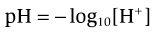

40 × 10−9 Eq/L의 정상 H+ 농도는 다음과 같이 pH로 변환됩니다.

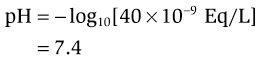

H+ 농도 대신 pH를 사용하는 경우 두 가지 주의 사항이 있습니다. 첫째, 대수 표현의 *마이너스* 기호 때문에 정신적인 반전이 필요합니다. 즉, H+ 농도가 증가하면 pH가 감소하고 그 반대도 마찬가지입니다. 둘째, H+ 농도와 pH 사이의 관계는 선형이 아니라 대수적입니다. 따라서 pH의 동일한 변화는 H+ 농도의 동일한 변화를 반영하지 않습니다. 이러한 선형성 부족은 [그림 7-1](#filepos1489982)에 설명되어 있으며, 여기서 H+ 농도와 pH 사이의 관계는 체액의 생리적 범위에 걸쳐 표시됩니다. 7.4에서 7.6(0.2 pH 단위)까지의 pH *증가*는 15 nEq/L의 H+ 농도 감소를 반영합니다. pH가 7.4에서 7.2로 *감소*(또한 0.2 pH 단위)는 23 nEq/L의 더 큰 H+ 농도 증가를 반영합니다. 즉, 산성 범위(pH < 7.4)에서 주어진 pH 변화는 알칼리성 범위(pH > 7.4)에서 동일한 pH 변화보다 더 큰 H+ 농도 변화를 반영합니다.

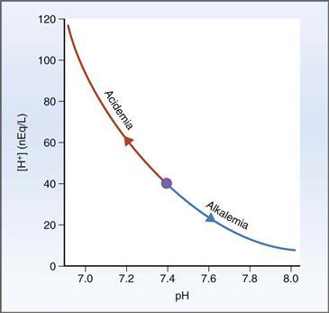

**그림 7-1 [H+]와 pH의 관계.**

**동맥 pH의 정상 범위는 7.37~7.42입니다.** 동맥 pH가 7.37 미만이면 **산혈증**이라고 합니다. 동맥 pH가 7.42보다 높으면 **알칼리혈증**이라고 합니다. 생명에 적합한 pH 범위는 6.8~8.0입니다.

pH를 정상 범위로 유지하는 데 기여하는 메커니즘에는 세포외액(ECF)과 세포내액(ICF) 모두에서 H+의 완충, 호흡 보상 및 신장 보상이 포함됩니다. 완충 및 호흡 보상 메커니즘은 몇 분에서 몇 시간 내에 빠르게 발생합니다. 신장 보상 메커니즘은 더 느려서 몇 시간에서 며칠이 걸립니다.

### 체내 산 생산

매일 많은 양의 산이 생성됨에도 불구하고 동맥 pH는 약알칼리성(7.4)입니다. 이러한 산 생산에는 휘발성 산(이산화탄소, CO2)과 비휘발성 또는 고정 산의 두 가지 형태가 있습니다. 휘발성 산과 고정산 모두 대량으로 생성되며 일반적인 알칼리성 pH에 문제가 됩니다.

#### CO2

CO2, 즉 휘발성 산은 세포 내 호기성 대사의 최종 산물이며 매일 13,000~20,000밀리몰(mmol/일)의 비율로 생성됩니다. CO2 자체는 산성이 아닙니다. 그러나 물(H2O)과 반응하면 약산성 탄산인 **H2CO3:**로 전환됩니다.

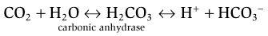

이 반응은 CO2가 H2O와 가역적으로 결합하여 **탄산탈수효소** 효소에 의해 촉매되는 H2CO3를 형성한다는 것을 보여줍니다. H2CO3는 H+와 HCO3−로 해리되고, 이 반응에 의해 생성된 H+는 완충되어야 합니다. 세포에서 생성된 CO2는 정맥혈에 추가되고 적혈구 내에서 H+ 및 HCO3-로 전환되어 폐로 운반된다는 점을 기억하십시오. 폐에서는 반응이 반대로 일어나고 CO2가 재생되어 만료됩니다. (따라서 CO2는 *휘발성* 산이라고 불립니다.) 따라서 CO2에서 나오는 H+의 완충은 정맥혈의 일시적인 문제일 뿐입니다.

#### 고정산

단백질과 인지질의 이화작용으로 인해 하루에 약 50mmol의 고정산이 생성됩니다. 황 함유 아미노산(예: 메티오닌, 시스테인, 시스틴)이 포함된 단백질은 대사될 때 **황산**을 생성하고, 인지질은 **인산**을 생성합니다. 휘발성이 있어 폐에서 만료되는 CO2와 달리 황산과 인산은 휘발성이 *않습니다*. 그러므로 고정된 산은 신장에서 배설될 수 있을 때까지 먼저 체액에서 완충되어야 합니다.

*정상* 이화 과정에서 생성되는 황산 및 인산 외에도 특정 병태생리학적 상태에서는 고정산이 과도한 양으로 생성될 수 있습니다. 이러한 고정산에는 치료되지 않은 당뇨병에서 생성되는 케토산인 **베타-하이드록시부티르산** 및 **아세토아세트산**과 격렬한 운동이나 조직이 저산소 상태일 때 생성될 수 있는 **젖산**이 포함됩니다. 또한 **살리실산**(아스피린 과다 복용으로 인해), **포름산**(메탄올 섭취로 인해), **글리콜산** 및 **옥살산**(에틸렌 글리콜 섭취로 인해)과 같은 다른 고정산이 섭취될 수 있습니다. 고정산의 과잉생산이나 섭취는 이 장의 뒷부분에서 논의되는 바와 같이 대사성 산증을 유발합니다.

### 버퍼링 중

#### 버퍼링의 원리

**버퍼**는 약산과 짝염기 *또는* 약염기와 짝산의 혼합물입니다. 두 가지 형태의 버퍼를 버퍼 쌍이라고 합니다. Brønsted-Lowry 명명법에서는 **약산**에 대해 산 형태를 HA라고 하며 H+ 공여체로 정의합니다. 기본 형태는 A−라고 하며 H+ 수용체로 정의됩니다. 마찬가지로 **약염기**의 경우 H+ 기증자를 BH+라고 하고 H+ 수용체를 B라고 합니다.

완충 용액은 **pH 변화에 저항합니다.** 따라서 완충 용액에 H+를 추가하거나 제거할 수 있지만 해당 용액의 pH는 최소한으로만 변경됩니다. 예를 들어, 약산이 포함된 완충 용액에 H+를 첨가하면 완충액의 A- 형태와 결합하여 HA 형태로 변환됩니다. 반대로, 완충 용액에서 H+가 제거되면(또는 OH-가 첨가되면) 완충액의 HA 형태에서 H+가 방출되어 A- 형태로 변환됩니다.

체액에는 pH 변화에 대한 중요한 첫 번째 방어를 구성하는 다양한 완충제가 포함되어 있습니다. 로버트 피츠(Robert Pitts)는 총 체액이 11.4L인 개에게 150mEq의 H+(염산, HCl)를 주입하여 이러한 완충 능력을 실험적으로 입증했습니다. 병행 실험에서 피츠는 11.4L의 증류수에 150mEq의 H+를 추가했습니다. 개에게 H+를 첨가하면 혈액 pH가 7.44에서 7.14로 감소했습니다. 개는 산성이었지만 살아 있었습니다. 증류수에 같은 양의 H+를 첨가하면 pH가 1.84로 급격히 떨어지며, 이 값은 개에게 즉각적으로 치명적일 수 있습니다. Pitts는 개의 체액에 다량의 H+ 첨가로부터 pH를 보호하는 완충제가 포함되어 있다고 결론지었습니다. 첨가된 H+는 이들 완충제의 A- 형태와 결합되어 강산이 약산으로 전환되었습니다. 강아지의 체액 pH 변화는 완전히 예방되지는 않았지만 최소화되었습니다. 증류수에는 완충액이 포함되어 있지 않으며 그러한 보호 메커니즘도 없었습니다.

#### Henderson-Hasselbalch 방정식

Henderson-Hasselbalch 방정식은 완충 용액의 pH를 계산하는 데 사용됩니다. 이 방정식은 용액 내 약산(및 염기)의 거동에서 파생되었으며, 이는 가역 반응의 동역학으로 설명됩니다.

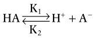

HA가 H+와 A-로 해리되는 정반응은 속도 상수 K1로 특징지어지고, 역반응은 속도 상수 K2로 특징지워집니다. 순방향 반응과 역방향 반응의 속도가 정확히 같을 때 HA 또는 A−의 농도에 더 이상 순 변화가 없는 **화학 평형** 상태가 됩니다. 여기에 표시된 것처럼 **질량 작용의 법칙**은 화학 평형에서 다음과 같이 명시합니다.

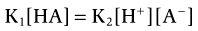

재배열,

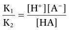

속도 상수의 비율은 다음과 같이 **평형 상수**라고 불리는 단일 상수 **K**로 결합될 수 있습니다.

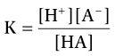

[H+]를 풀기 위해 다시 재배열:

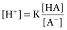

[H+]를 pH로 표현하려면, 이전 방정식의 양변에 *음의 로그*10를 취하십시오. 그런 다음,

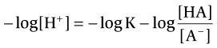

−log [H+]는 pH와 같고, −log K는 pK와 같고, *minus* log HA/A−는 *plus* log A−/HA와 같다는 점을 기억하십시오. 따라서 **Henderson-Hasselbalch 방정식**의 최종 형태는 다음과 같습니다.

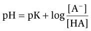

어디서

|  |  |
| --- | --- |
| pH | = −log10 [H+] (pH 단위) |
| pK | = -log10K(pH 단위) |
| [A-] | = 기본 형태의 완충액 농도(mEq/L) |
| [하] | = 산성 형태의 완충액 농도(mEq/L) |

따라서 완충 용액의 pH는 완충액의 pK, 완충액의 염기 형태 농도([A-]), 완충액의 산 형태 농도([HA]) 정보를 사용하여 계산할 수 있습니다. 반대로, 용액의 pH와 완충액의 pK를 알고 있으면 A- 및 HA 형태의 상대 농도를 계산할 수 있습니다.

**pK**는 버퍼 쌍의 특성 값입니다. *어떤 요인 또는 요인들이 그 값을 결정합니까?* 이전 도출에서 평형 상수(K)는 정반응의 속도 상수를 역반응의 속도 상수로 나눈 비율입니다. 따라서 HCl과 같은 **강산**은 H+와 A−로 *더 많이* 해리되며, 평형 상수(K)는 높고 pKs는 낮습니다(pK는 평형 상수의 *마이너스* log10이기 때문입니다). 반면, H2CO3와 같은 **약산**은 *덜 해리되고* 평형 상수가 낮고 **pK가 높습니다.**

**샘플 문제.** HPO4−2/H2PO4− 버퍼 쌍의 pK는 6.8입니다. 이 완충액에 관한 두 가지 질문에 대답하십시오. *(1) 혈액 pH가 7.4일 때 이 완충액 쌍의 산 형태와 염기 형태의 상대 농도는 얼마입니까? (2) 산과 염기 형태의 농도는 어느 pH에서 같습니까?*

**해결책.** 이 완충액의 산성 형태는 H2PO4−이고, 염기 형태는 HPO4−2입니다. 산과 염기 형태의 상대적 농도는 용액의 pH와 특성 pK에 의해 설정됩니다.

(1) 첫 번째 질문에 답하기: pH 7.4에서 산과 염기 형태의 상대 농도는 Henderson-Hasselbalch 방정식을 사용하여 계산됩니다. (힌트: 풀이의 마지막 단계에서 방정식 양변의 역대수를 취하세요!)

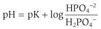

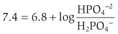

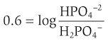

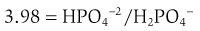

따라서 pH 7.4에서 염기 형태(HPO4-2)의 농도는 산 형태(H2PO4-)의 농도의 약 4배입니다.

(2) 두 번째 질문에 답하기: 산과 염기 형태의 농도가 동일한 pH는 Henderson-Hasselbalch 방정식으로 계산할 수도 있습니다. 산과 염기 형태가 동일한 농도일 때 HPO4−2/H2PO4− = 1.0입니다.

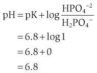

계산된 pH는 완충액의 pK와 동일합니다. 이 중요한 계산은 *용액의 pH가 pK와 같을 때 완충액의 산 및 염기 형태의 농도가 동일하다는 것을 보여줍니다.* 이 장의 뒷부분에서 설명하는 것처럼, 완충액은 용액의 pH가 pK와 같거나 거의 같을 때 가장 잘 기능합니다. 이는 바로 산과 염기 형태의 농도가 같거나 거의 같기 때문입니다.

#### 적정 곡선

적정 곡선은 Henderson-Hasselbalch 방정식을 그래픽으로 표현한 것입니다. [그림 7-2](#filepos1504111)는 용액 내 가상의 약산(HA)과 그 짝염기(A-)의 적정 곡선을 보여줍니다. H+가 추가되거나 제거됨에 따라 용액의 pH가 측정됩니다.

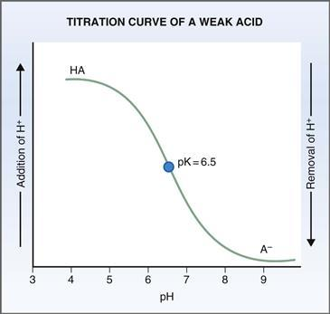

**그림 7-2 약산(HA)과 그 짝염기(A−)의 적정 곡선.** pH가 pK와 같을 때 HA와 A−의 농도는 동일합니다.

이전에 Henderson-Hasselbalch 방정식에서 볼 수 있듯이 HA와 A-의 상대 농도는 용액의 pH와 완충액의 pK에 따라 달라집니다. 이 가상 버퍼의 **pK**는 6.5입니다. 낮은(산성) pH에서 완충액은 주로 HA 형태로 존재합니다. 높은(알칼리성) pH에서 완충액은 주로 A- 형태로 존재합니다. pH가 pK와 같을 때 HA와 A-의 농도는 같습니다. 완충액의 절반은 HA 형태이고 절반은 A- 형태입니다.

적정 곡선의 눈에 띄는 특징은 S자형 모양입니다. **곡선의 선형 부분**에서는 H+가 추가되거나 제거될 때 pH의 작은 변화만 발생합니다. 가장 효과적인 버퍼링은 이 범위에서 발생합니다. 곡선의 선형 범위는 pK(pK ± 1.0) 위와 아래로 1.0 pH 단위로 확장됩니다. 따라서 가장 효과적인 생리학적 완충액은 1.0 pH 단위 내에서 7.4(7.4 ± 1.0)의 pK를 갖습니다. 효과적인 완충 범위를 벗어나면 소량의 H+가 추가되거나 제거될 때 pH가 급격하게 변합니다. 이 완충액의 경우 pH가 5.5보다 낮을 때 H+를 첨가하면 pH가 크게 감소합니다. pH가 7.5보다 높을 때 H+를 제거하면 pH가 크게 증가합니다.

#### 세포외액 완충액

ECF의 주요 완충제는 중탄산염과 인산염입니다. **중탄산염**의 경우 A− 형태는 HCO3−이고 HA 형태는 CO2(H2CO3와 평형 상태)입니다. **인산염**의 경우 A− 형태는 HPO4−2이고 HA 형태는 H2PO4−입니다. 이들 완충액의 적정 곡선은 [그림 7-3](#filepos1506575)과 같습니다.

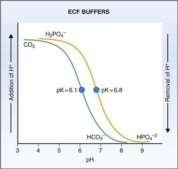

**그림 7-3 H2PO4−/HPO4−2 및 CO2/HCO3−에 대한 적정 곡선 비교.** ECF, 세포외액.

##### *HCO3−/CO2 완충액*

가장 중요한 세포외 완충액은 HCO3−/CO2입니다. 이는 신체에서 H+를 얻거나 잃을 때 첫 번째 방어선으로 활용됩니다. ECF 완충제로서 HCO3−/CO2가 탁월한 이유는 다음과 같은 특징 때문입니다. (1) A− 형태인 HCO3−의 농도는 24mEq/L로 높습니다. (2) HCO3−/CO2 완충액의 pK는 6.1로, 이는 ECF의 pH에 ​​상당히 가깝습니다. (3) 산성 형태의 완충액인 CO2는 휘발성이며 폐에 의해 만료될 수 있습니다([그림 7-3](#filepos1506575) 참조).

HCO3−/CO2 완충액의 기능은 개에게 HCl을 주입하는 이전 예에서 설명되었습니다. 이 예를 이해하기 위해 ECF가 다른 구성 요소를 무시하고 NaHCO3의 간단한 솔루션이라고 가정합니다. HCl이 ECF에 첨가되면 H+는 HCO3−의 일부와 결합하여 H2CO3를 형성합니다. 따라서 강산(HCl)이 약산(H2CO3)으로 전환됩니다. 그런 다음 H2CO3는 CO2와 H2O로 해리되며 둘 다 폐에 의해 만료됩니다. 개의 혈액의 pH가 감소하지만 완충액이 없는 것처럼 극적으로 감소하지는 않습니다. 반응은 다음과 같습니다.

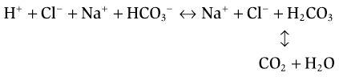

Henderson-Hasselbalch 방정식은 HCO3−/CO2 완충액에 적용될 수 있습니다. 기본 형태(A-)는 HCO3-이고 산 형태(HA)는 H2CO3이며 이는 CO2와 평형을 이루고 있습니다. 탄산 탈수효소가 있는 경우 대부분의 H2CO3는 CO2 형태(즉, 400 CO2:1 H2CO3)로 존재합니다. 따라서 H2CO3 농도는 일반적으로 너무 낮아 무시됩니다.

동맥혈의 pH는 HCO3− 및 CO2의 정상 농도를 대입하고 pK를 알면 **Henderson-Hasselbalch 방정식**을 사용하여 계산할 수 있습니다. CO2 값은 일반적으로 분압으로 보고되므로 PCO2는 혈액 내 CO2 용해도(0.03mmol/L/mmHg)를 곱하여 CO2 농도로 변환해야 합니다. 방정식의 최종 형태는 다음과 같습니다.

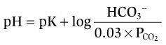

다음의 정상 값을 대입하면 동맥혈의 pH는 다음과 같이 계산할 수 있습니다.

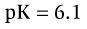

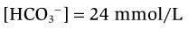

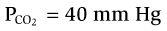

따라서,

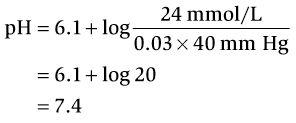

Henderson-Hasselbalch 방정식은 PCO2, HCO3− 농도 및 pH 사이의 관계를 보여주는 **산-염기 지도**에서도 나타낼 수 있습니다([그림 7-4](#filepos1511519)). 지도의 원점에서 방사형으로 뻗어 있는 선을 **등가선**(동일한 H+ 농도 또는 동일한 pH를 의미)이라고 합니다. 각 등가선은 동일한 pH 값을 산출하는 PCO2와 HCO3−의 모든 조합을 제공합니다. 중앙의 **타원**은 동맥혈의 정상 수치를 나타냅니다. 그래프의 모든 점은 Henderson-Hasselbalch 방정식에 적절한 값을 대입하여 계산할 수 있습니다. 예를 들어, 이전 계산에서는 PCO2가 40mmHg이고 HCO3− 농도가 24mEq/L일 때 pH가 7.4라는 것을 보여줍니다. 산-염기 지도는 PCO2가 40mmHg이고 HCO3− 농도가 24mEq/L일 때 pH가 7.4임을 확인합니다.

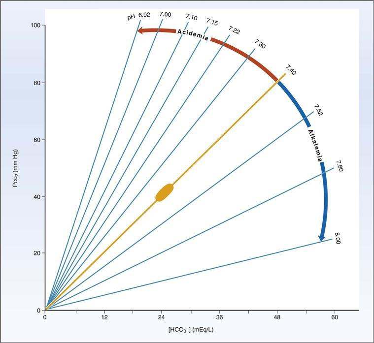

**그림 7–4 산-염기 지도.** 표시된 관계는 동맥혈 PCO2, [HCO3**-**] 및 pH 사이의 관계입니다. 중앙의 *타원*은 정상 값의 범위를 나타냅니다. (Cohen JJ, Kassirer JP: 산성/염기에서 수정됨. Boston, Little, Brown, 1982.)

*PCO2와 HCO3의 비정상적인 조합*-*농도는 정상(또는 거의 정상)의 pH 값을 생성할 수 있다는 점에 유의하는 것이 중요합니다.* 예를 들어, PCO2 60mmHg와 HCO3− 농도 36mEq/L의 조합도 pH 7.4에 해당합니다. 하지만 HCO3− 농도와 PCO2 모두 분명히 정상보다 높습니다. 또 다른 예를 들어, PCO2 20mmHg와 HCO3− 농도 12mEq/L의 조합도 pH 7.4에 해당합니다. 하지만 HCO3− 농도와 PCO2 모두 정상보다 낮습니다. (이 중요한 원리는 산염기 장애가 있을 때 pH를 정상화하려고 시도하는 호흡 및 신장 보상 과정의 기초가 됩니다.)

pH 보호에 있어서 HCO3−/CO2 완충 시스템의 중요성은 **12mmol/L의 HCl이 ECF**에 첨가되는 것을 상상해 보면 알 수 있습니다. ECF의 초기 HCO3− 농도는 24mmol/L입니다. 그런 다음, 12mmol/L의 추가된 H+가 12mmol/L의 HCO3-와 결합하여 12mmol/L의 H2CO3를 형성하고, 이는 탄산 탈수효소의 존재 하에서 12mmol/L의 CO2로 전환됩니다. 이 **버퍼링** 반응이 발생한 후 *새로운* HCO3− 농도는 원래 24mmol/L 대신 12mmol/L가 됩니다. *새로운* CO2 농도는 원래 농도 1.2mmol/L(즉, 40mmHg × 0.03) *더하기* 완충 반응에서 생성된 12mmol/L가 됩니다. 생성된 추가 CO2가 폐에서 배출될 수 없다고 잠시 가정하면 *새* pH는 다음과 같습니다.

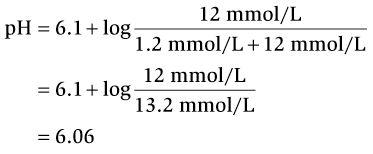

분명히, 이렇게 낮은 pH(6.06)는 치명적일 것입니다! 그러나 pH가 치명적으로 낮은 값으로 떨어지는 것을 방지하는 두 번째 보호 메커니즘인 **호흡 보상**이 있습니다. 산혈증은 경동맥의 화학수용체를 자극하여 환기율을 즉각적으로 증가시킵니다**(과호흡):** 초과된 CO2 *+ 그 이상*은 모두 폐에서 배출됩니다. 호흡 보상이라고 하는 이 반응은 PCO2를 정상 값(예: 24mmHg)보다 낮게 만듭니다. Henderson-Hasselbalch 방정식에 이 값을 대입하면 또 다른 pH를 계산할 수 있습니다.

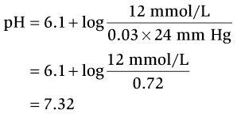

HCO3-에 의한 완충과 호흡 보상(즉, 과호흡)이 결합되면 거의 정상적인 pH(정상 = 7.4)가 됩니다. HCO3− 농도와 PCO2가 모두 심각하게 감소했지만 pH는 거의 정상입니다. 산-염기 균형의 완전한 회복은 신장에 달려 있습니다. 결국, 이 장의 뒷부분에 설명된 과정을 통해 신장은 H+를 분비하고 추가된 고정 H+를 완충하는 데 소비된 HCO3-를 대체하기 위해 "새로운" HCO3-를 합성합니다.

##### *HPO4−2/H2PO4− 버퍼*

무기 인산염도 완충 역할을 합니다. 적정곡선은 HCO3−의 적정곡선과 비교할 수 있다([그림 7-3](#filepos1506575) 참조). HCO3−/CO2의 pK는 6.1이고 적정 곡선의 선형 부분은 pH 5.1에서 7.1까지 확장됩니다. 기술적으로 선형 부분은 pH 7.4에 대한 완충 범위를 벗어납니다. 반면, HPO4-2/H2PO4- 완충액의 pK는 6.8이며 곡선의 선형 부분은 pH 5.8에서 7.8까지 확장됩니다. 무기 인산염은 HCO3−보다 더 중요한 생리적 완충제가 될 것 같습니다. 그 이유는 무기 인산염의 효과적인 완충 범위가 혈액의 pH인 7.4에 더 가깝기 때문입니다. 그러나 HCO3−/CO2 완충액의 두 가지 특징은 이를 더욱 효과적인 완충액으로 만듭니다. (1) HCO3−는 인산염(1~2mmol/L)보다 농도가 훨씬 높습니다(24mmol/L). (2) HCO3-/CO2 완충액의 산 형태는 CO2이며, 이는 휘발성이며 폐에서 만료될 수 있습니다.

#### 세포내 체액 완충액

**유기 인산염 및 단백질**을 포함하는 방대한 양의 세포 내 완충액이 있습니다. 산-염기 교란에서 이러한 ICF 완충액을 활용하려면 H+가 먼저 다음 세 가지 메커니즘 중 하나에 의해 세포막을 통과해야 합니다. (1) 호흡 산-염기 교란과 같이 CO2가 과잉 또는 결핍된 조건에서는 CO2*자체*가 세포막을 통과할 수 있습니다. 예를 들어, 호흡성 산증의 경우 CO2가 과잉되어 완충되어야 하는 H+가 생성됩니다. CO2는 세포 내로 빠르게 유입되고, CO2가 생성하는 H+는 세포내 완충액에 의해 완충됩니다. (2) 고정산이 과하거나 부족한 조건에서 H+는 젖산과 같은 유기 음이온과 함께 세포에 들어오거나 나갈 수 있습니다. 예를 들어, 젖산 수치 증가로 인한 대사성 산증에서는 과도한 H+가 젖산염과 함께 생성되고, H+와 젖산염은 함께 세포에 들어가 전기적 중성을 유지합니다. (3) 수반되는 유기 음이온이 없는 고정 H+의 과잉 또는 부족의 경우, H+는 K+와 교환하여 전기적 중성을 보존합니다.

ICF에는 존재하지 않지만 **혈장 단백질**은 H+를 완충하기도 합니다. 혈장 단백질, H+ 및 칼슘(Ca2+) 사이에는 관계가 존재하며, 이는 산-염기 교란이 있을 때 이온화된 Ca2+ 농도의 변화를 초래합니다. ([제9장](CR%21G9RE0KW4PD33Q9F3DXNCSBNXCANP_split_020.html#filepos1863682), [그림 9-34](CR%21G9RE0KW4PD33Q9F3DXNCSBNXCANP_split_021.html#filepos2111606) 참조) 메커니즘 혈장 단백질(예: 알부민)의 음전하 그룹은 H+ 또는 Ca2+와 결합할 수 있습니다. (Ca2+의 단백질 결합은 광범위하며 전체 Ca2+의 40%를 차지합니다.) **산혈증**에서는 혈액에 H+가 과도하게 존재합니다. 더 많은 H+가 혈장 단백질에 결합하기 때문에 더 적은 Ca2+가 결합되어 유리 Ca2+ 농도가 증가합니다. **알칼리혈증**에서는 혈액 내 H+가 부족합니다. 혈장 단백질에 결합하는 H+의 양이 적기 때문에 Ca2+가 더 많이 결합되어 유리 Ca2+ 농도가 감소합니다(저칼슘혈증). 저칼슘혈증의 증상은 일반적으로 호흡성 알칼리증에서 발생하며 따끔거림, 무감각 및 강직증을 포함합니다.

##### *유기 인산염*

ICF의 유기 인산염에는 아데노신 삼인산(ATP), 아데노신 이인산(ADP), 아데노신 일인산(AMP), 포도당-1-인산 및 2,3-이인산글리세르산(2,3-DPG)이 포함됩니다. H+는 이러한 유기 분자의 인산염 부분에 의해 완충됩니다. 이러한 유기 인산염의 pKa 범위는 6.0~7.5이며, 이는 효과적인 생리학적 완충에 이상적입니다.

##### *단백질*

세포내 단백질은 -COOH/-COO- 또는 -NH3+/-NH2와 같은 산성 또는 염기성 그룹을 많이 포함하고 있기 때문에 완충 역할을 합니다. 단백질의 모든 해리 가능한 그룹 중에서 생리학적 범위의 pK를 갖는 그룹은 히스티딘의 이미다졸 그룹(pK 6.4 ~ 7.0)과 α 아미노 그룹(pK 7.4 ~ 7.9)입니다.

가장 중요한 세포내 완충제는 적혈구 내부에 고농도로 존재하는 **헤모글로빈**입니다. 각 헤모글로빈 분자에는 총 36개의 히스티딘 잔기가 있습니다(4개의 폴리펩티드 사슬 각각에 9개). 산소헤모글로빈의 pK는 6.7이며, 이는 효과적인 생리학적 완충 범위에 속합니다. **디옥시헤모글로빈**은 pK가 7.9로 훨씬 더 효과적인 완충제입니다. 산소(O2)를 방출할 때 헤모글로빈의 pK 변화는 생리학적으로 중요합니다. 혈액이 전신 모세혈관을 통해 흐를 때 산소헤모글로빈은 O2를 조직으로 방출하고 디옥시헤모글로빈으로 전환됩니다. 동시에 조직의 전신 모세혈관에 CO2가 추가됩니다. 이 CO2는 적혈구로 확산되어 H2O와 결합하여 H2CO3를 형성합니다. 그러면 H2CO3는 H+와 HCO3-로 해리됩니다. 생성된 H+는 이제 편리하게 탈산소화된 형태의 헤모글로빈에 의해 완충됩니다. 디옥시헤모글로빈은 확실히 H+에 대한 탁월한 완충제임이 틀림없습니다. 정맥혈의 pH는 7.37입니다. 이는 CO2로 다량의 산을 첨가함에도 불구하고 동맥혈의 pH보다 산성이 0.03 pH 단위에 불과합니다.

### 산-염기 균형의 신장 메커니즘

신장은 정상적인 산-염기 균형을 유지하는 데 두 가지 주요 역할, 즉 HCO3−의 재흡수와 H+의 배설을 담당합니다. 신장의 첫 번째 역할은 **여과된 HCO3를 재흡수**하여 이 중요한 세포외 완충액이 소변으로 배설되지 않도록 하는 것입니다. 신장의 두 번째 역할은 단백질과 인지질 이화작용으로 생성된 **고정된 H+**를 배출하는 것입니다. 고정된 H+의 배설에는 두 가지 메커니즘이 있습니다. (1) 적정 가능한 산(즉, 요중 인산염에 의해 완충됨)으로 H+를 배설하는 것과 (2) NH4+로 H+를 배설하는 것입니다. 두 가지 메커니즘에 의한 H+ 배설에는 *새로운* HCO3−의 합성과 재흡수가 수반됩니다. 새로운 HCO3−의 합성과 재흡수의 목적은 고정된 H+를 완충하는 데 사용된 HCO3− 저장량을 보충하는 것입니다.

#### 여과된 HCO3의 재흡수−

여과된 HCO3-의 거의 99.9%가 재흡수되어 주요 세포외 완충액이 배설되지 않고 보존됩니다. 재흡수율은 필터링된 HCO3- 부하량과 HCO3- 배설율을 비교하여 계산할 수 있습니다([6장](CR%21G9RE0KW4PD33Q9F3DXNCSBNXCANP_split_015.html#filepos1181244) 참조). 사구체 여과율(GFR)이 180L/일이고 혈장 HCO3− 농도가 24mEq/L인 경우 필터링된 부하는 4320mEq/일(180L/일 × 24mEq/L)입니다. 측정된 HCO3− 배설량은 하루에 2mEq에 불과합니다. 따라서 HCO3-의 재흡수율은 4318mEq/day로 여과부하량의 99.9%에 해당한다. 대부분의 여과된 HCO3- 재흡수는 **근위세뇨관**에서 발생하며, 헨레 고리, 원위세뇨관 및 집합관에서는 소량만 재흡수됩니다.

##### *HCO3의 메커니즘− 근위세뇨관에서의 재흡수*

[그림 7-5](#filepos1525481)는 여과된 HCO3−가 재흡수되는 초기 근위세뇨관의 세포를 나타낸 그림이다. 여과된 HCO3−의 재흡수에는 다음 단계가 포함되며, 여기에는 내강에서 HCO3−가 CO2로 전환되는 과정, CO2가 세포 내로 확산되는 과정, 세포 내에서 다시 HCO3−로 전환되는 과정, HCO3−가 혈액으로 재흡수되는 과정이 포함됩니다.

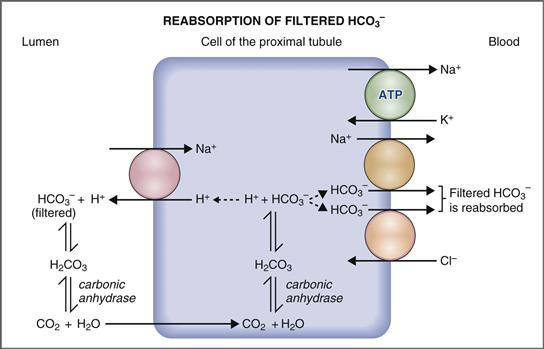

**그림 7-5 근위세뇨관 세포에서 여과된 HCO3−의 재흡수 메커니즘.** ATP, 아데노신 삼인산.

1. 관강막에는 초기 근위 세뇨관의 여러 Na+ 의존적 2차 능동 수송 메커니즘 중 하나인 **Na+-H+ 교환기**가 포함되어 있습니다. Na+가 전기화학적 구배를 따라 내강에서 세포 내로 이동함에 따라 H+는 전기화학적 구배에 반하여 세포에서 내강으로 이동합니다.
2. 내강으로 분비된 H+는 여과된 HCO3−와 결합하여 H2CO3를 형성합니다. 그런 다음 H2CO3는 ***브러시 보더* 탄산탈수효소에 의해 촉매되어 CO2와 H2O로 분해됩니다.** (아세타졸아미드와 같은 탄산탈수효소 억제제는 이 단계를 방해하여 여과된 HCO3−의 재흡수를 억제합니다.) 이 반응에서 생성된 CO2와 H2O는 쉽게 관강막을 통과하여 세포로 들어갑니다.
3. 세포 내부에서는 반응이 반대로 일어난다. CO2와 H2O는 재결합하여 H2CO3를 형성하며, ***세포내* 탄산탈수효소에 의해 촉매됩니다.** H2CO3는 다시 H+와 HCO3−로 전환됩니다. H+와 HCO3−의 운명은 다릅니다. H+는 Na+-H+ 교환기에 의해 분비되어 여과된 다른 HCO3−의 재흡수를 돕습니다. HCO3-는 Na+-HCO3- 공동수송과 Cl--HCO3- 교환이라는 두 가지 메커니즘에 의해 기저측막을 통해 혈액으로 운반됩니다(즉, HCO3-는 재흡수됩니다). 여과된 HCO3-의 재흡수 메커니즘의 특별한 특징은 다음과 같습니다.

    이 과정에서는 **Na+ 및 HCO3−의 순 재흡수**−**가 발생합니다. 따라서 근위 세뇨관의 Na+ 재흡수 중 일부는 여과된 HCO3−의 재흡수와 직접적으로 연결됩니다. (나머지 Na+ 재흡수는 포도당, 아미노산, Cl- 및 인산염의 재흡수와 연결됩니다.)

    이 메커니즘을 통한 H+**의 순 분비는 ***없음*입니다. 관강막의 Na+-H+ 교환기에 의해 분비된 각 H+는 여과된 HCO3−와 결합하여 CO2와 H2O를 형성하고, 이는 세포로 들어가서 다시 H+와 HCO3−로 전환됩니다. H+는 더 많은 여과된 HCO3−를 재흡수하기 위해 Na+-H+ 교환기의 관강 막을 통해 재활용됩니다.

    이 메커니즘에 의한 H+의 순 분비가 없기 때문에 **세관액 pH에 약간의 변화가 발생합니다.**

##### *필터링된 HCO3 부하의 효과−*

HCO3−의 여과된 부하량은 GFR과 혈장 HCO3− 농도의 곱입니다. 광범위한 필터링된 부하에 걸쳐 사실상 모든 HCO3−가 재흡수됩니다. 그러나 혈장 HCO3- 농도가 40mEq/L보다 높으면 필터링된 부하가 너무 높아져 재흡수 메커니즘이 포화됩니다. 재흡수될 수 없는 여과된 HCO3−는 모두 배설됩니다. 예를 들어, 혈액 중 HCO3− 농도가 상승하는 대사성 알칼리증의 경우 정상적인 산-염기 균형을 회복하려면 과도한 HCO3−를 소변으로 배출해야 합니다. 이는 혈액 내 HCO3− 농도가 증가함에 따라 여과된 부하가 증가하고 재흡수 용량을 초과하기 때문에 달성됩니다. 재흡수되지 않은 HCO3-가 배설되어 혈액 중 HCO3- 농도가 정상으로 낮아집니다.

##### *세포외액량의 영향*

여과된 HCO3−의 대부분은 근위세뇨관에서 재흡수되며, 여기서 ECF 부피의 변화는 세뇨관 주위 모세혈관의 Starling 힘의 변화를 통해 등장성 재흡수를 변경합니다([6장](CR%21G9RE0KW4PD33Q9F3DXNCSBNXCANP_split_015.html#filepos1181244) 참조). HCO3-는 이러한 등장성 재흡수의 일부이기 때문에 ECF 부피의 변화는 HCO3- 재흡수를 예측 가능한 방식으로 변경합니다. 예를 들어, **ECF 부피 확장**은 근위 세뇨관의 등장성 재흡수를 억제하여 HCO3− 재흡수를 억제합니다. 반대로 **ECF 부피 수축**은 근위 세뇨관의 등장성 재흡수를 자극하고 HCO3− 재흡수를 자극합니다.

안지오텐신 II와 관련된 두 번째 메커니즘은 ECF 부피 수축에 대한 HCO3- 재흡수 반응에 참여합니다. ECF 부피가 감소하면 레닌-안지오텐신 II-알도스테론 시스템이 활성화된다는 점을 상기하십시오. **안지오텐신 II**는 근위 세뇨관에서 Na+-H+ 교환을 자극하여 HCO3− 재흡수를 자극하고 혈액 HCO3− 농도를 증가시킵니다. 이 메커니즘은 문자 그대로 ECF 부피 수축에 따라 발생하는 대사성 알칼리증을 의미하는 **수축 알칼리증** 현상을 설명합니다. 수축성 알칼리증은 **루프 이뇨제** 또는 **티아지드 이뇨제** 치료 중에 발생하며 이는 **구토**로 인한 대사성 알칼리증의 합병증 요인입니다. 수축성 알칼리증은 등장성 NaCl을 주입하여 ECF 용량을 회복시키는 방법으로 치료합니다.

##### *PCO2의 효과*

PCO2의 만성 변화는 여과된 HCO3-의 재흡수를 변화시키고 만성 호흡산-염기 장애에 대한 신장 보상 현상을 설명합니다. PCO2의 증가는 HCO3-의 재흡수를 증가시키고, PCO2의 감소는 HCO3-의 재흡수를 감소시킵니다.

CO2 효과의 기본 메커니즘은 완전히 이해되지 않았습니다. 그러나 한 가지 설명은 신장 세포에 CO2를 *공급*하는 것과 관련이 있습니다. **호흡성산증**에서는 PCO2가 증가합니다. Na+-H+ 교환기에 의한 분비를 위해 H+를 생성하기 위해 신장 세포에서 더 많은 CO2를 사용할 수 있기 때문에 더 많은 HCO3-가 재흡수될 수 있습니다. 따라서 혈장 HCO3− 농도가 증가하여 동맥 pH가 증가합니다(보상). **호흡성 알칼리증**에서는 PCO2가 감소합니다. 신장 세포에서 분비를 위해 H+를 생성하는 데 사용할 수 있는 CO2가 적기 때문에 HCO3-가 더 적게 재흡수됩니다. 이 경우 혈장 HCO3− 농도가 감소하여 동맥 pH가 감소합니다(보상).

#### 적정산으로서 H+의 배설

정의에 따르면, 적정 가능한 산은 소변 완충액으로 배설된 H+입니다. 무기 인산염은 소변 내 상대적으로 높은 농도와 이상적인 pK로 인해 이러한 완충제 중에서 가장 중요합니다. 여과된 인산염의 85%만이 재흡수되기 때문에 소변에는 상당한 양의 인산염이 있다는 점을 기억하십시오. 여과된 인산염의 15%는 적정 가능한 산으로 배설되도록 남겨집니다.

##### *적정산의 배설 메커니즘*

적정산은 네프론 전체로 배설되지만 주로 말단 원위 세뇨관과 집합관의 α-삽입 세포에서 배설됩니다. 이 프로세스에 대한 세포 메커니즘은 [그림 7-6](#filepos1535333)에 설명되어 있으며 다음과 같습니다.

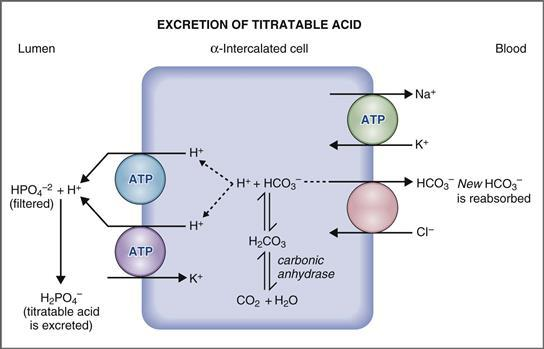

**그림 7-6 적정산으로 H+를 배설하는 메커니즘.** ATP, 아데노신 삼인산.

1. 말단 원위 세뇨관과 집합관의 α-삽입 세포의 내강막에는 H+를 세뇨관액으로 분비하는 두 가지 주요 능동 수송 기전이 있습니다. H+ 분비의 첫 번째 메커니즘은 **알도스테론**에 의해 자극되는 **H+ ATPase**입니다. 알도스테론은 Na+ 재흡수 및 K+ 분비를 자극하는 주요 세포에 작용할 뿐만 아니라 α-삽입된 세포에서 H+ 분비도 자극합니다. H+ 분비의 또 다른 메커니즘은 α-삽입된 세포에서 K+ 재흡수를 담당하는 운반체인 **H+-K+ ATPase**입니다([6장](CR%21G9RE0KW4PD33Q9F3DXNCSBNXCANP_split_015.html#filepos1181244) 참조). 내강에서 분비된 H+는 A- 형태의 인산염 완충액인 HPO4-2와 결합하여 HA 형태의 완충액인 H2PO4-를 생성합니다. **H2PO4**−는 적정 가능한 산으로 배설됩니다.  
       이 메커니즘이 유용하려면 대부분의 여과된 인산염이 H+를 수용할 수 있는 형태(즉, HPO4-2 형태)여야 합니다. *그렇습니까?* pH 7.4에서 HPO4−2와 H2PO4−의 상대농도를 계산하면, HPO4−2의 농도가 사구체 여과액 내 H2PO4− 농도의 거의 4배임을 확인할 수 있습니다(pH = pK + log HPO4−2/H2PO4−, 여기서 pK = 6.8; pH 7.4에서는 HPO4−2/H2PO4− = 3.98).
2. H+ ATPase에 의해 분비된 H+는 신장 세포에서 CO2와 H2O로부터 생산되며, 세포 내 탄산 탈수효소가 있을 때 결합하여 H2CO3를 형성합니다. H2CO3는 분비되는 H+와 Cl--HCO3- 교환을 통해 혈액으로 재흡수되는 HCO3-로 해리됩니다.
3. 적정 가능한 산으로 배설된 각 H+에 대해 하나의 ***새로운* HCO3**−**가 합성되어 재흡수됩니다.** 이 새로운 HCO3−는 이전에 고정 H+ 완충으로 인해 고갈되었던 세포외 HCO3− 저장량을 보충합니다. 새로운 HCO3-의 생성 또는 합성은 지속적인 과정이기 때문에 HCO3-는 단백질과 인지질 이화작용으로 생성된 고정산을 완충하는 데 사용되므로 지속적으로 대체됩니다.

##### *소변 완충액의 양*

적정 가능한 산으로 배설되는 H+의 양은 사용 가능한 소변 완충액의 *양*에 따라 달라집니다. 그 이유가 즉시 명백하지는 않더라도 기본 원리는 **최소 소변 pH가 4.4**라는 것입니다. 혈액 pH가 7.4이기 때문에 소변 pH 4.4는 신세뇨관 세포 전체의 H+ 농도가 1000배 차이가 난다는 것을 의미합니다. 이 1000배의 차이는 H+ ATPase에 의해 H+가 분비될 수 있는 가장 큰 농도 구배입니다. 소변 pH가 4.4로 감소하면 H+의 순 분비가 중단됩니다.

이 원리를 이해하려면 *배출되는 H*+*의 양*과 *소변 pH 값*을 구별하는 것이 중요합니다. 이러한 구별을 설명하기 위해 다음 두 가지 예를 고려하십시오. 먼저, 소변 완충제가 *없다*고 상상해 보십시오. 이 경우 처음 분비된 몇 개의 H+는 소변 완충액이 없어 용액에 유리되어 pH가 최소값인 4.4로 감소하고 그 이후에는 추가로 H+가 분비되지 않습니다. 다음으로, 소변 완충액이 풍부하다고 상상해 보십시오. 이 경우 pH가 4.4로 떨어지기 전에 다량의 H+가 분비되어 소변으로 완충될 수 있습니다.

이 점은 [그림 7-7](#filepos1541752)에 자세히 설명되어 있다. [그림 7-7*A*](#filepos1541752)는 인산염 적정 곡선에 중첩된 관형 유체 pH 범위(음영 영역)를 보여줍니다. pH가 7.4인 사구체 여과액부터 시작합니다. HPO4−2와 H2PO4−가 모두 존재하며, HPO4−2의 농도는 H2PO4−의 농도보다 상당히 높습니다. H+는 관상액으로 분비되면서 인산염 완충액의 HPO4−2 형태와 결합하여 H2PO4−로 전환됩니다. 적정 곡선의 선형 부분(pH 7.8 ~ 5.8)에서 관형 유체에 H+를 추가하면 pH가 약간만 감소합니다. 그러나 일단 대부분의 HPO4-2가 H2PO4-로 전환되면 H+의 추가 분비로 인해 세뇨관 유체의 pH가 4.4로 급격히 감소합니다. 그 시점에서는 더 이상 H+가 분비되지 않습니다. 더 많은 H+를 분비하는 유일한 방법은 더 많은 HPO4−2를 제공하는 것입니다. 따라서 적정 가능한 산으로 배설되는 H+의 *양*은 사용 가능한 소변 완충액의 *양*에 따라 달라집니다.

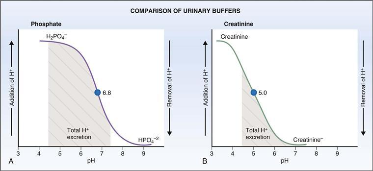

**그림 7-7 소변 완충제로서 인산염(A)과 크레아티닌(B)의 효과 비교.** 인산염 완충액의 pK는 6.8입니다. 크레아티닌 완충액의 pK는 5.0입니다. *어두운 부분*은 사구체 여과액(pH 7.4)과 최종 소변(pH 4.4) 사이의 세뇨관액으로 분비되는 H+의 총량을 나타냅니다.

##### *소변 완충액의 pK*

소변 완충액의 pK는 배설되는 H+의 양에도 영향을 미칩니다. 로버트 피츠(Robert Pitts)는 소변 완충제로서 크레아티닌의 효과(pK 5.0)와 인산염의 효과(pK 6.8)를 비교하여 pK의 중요성을 입증했습니다. 그는 주어진 양의 소변 완충액에 대해 완충액이 크레아티닌일 때보다 인산염 완충액일 때 더 많은 H+가 배설된다는 것을 발견했습니다([그림 7-7](#filepos1541752) 참조).

배설된 H+ 양의 차이는 두 완충액의 pK가 다르기 때문입니다. **인산염**은 *가장 이상적인* 소변 완충제라는 점을 기억하세요. 적정 곡선의 선형 범위는 관형 유체 pH 범위와 거의 완벽하게 겹칩니다. [그림 7-7*A*](#filepos1541752)에서 인산염 적정 곡선 아래 음영 처리된 부분은 세뇨관액 pH가 사구체 여과액의 pH 7.4에서 최종 소변의 pH 4.4로 감소할 때 분비되는 H+의 총량을 나타냅니다.

[그림 7-7*B*](#filepos1541752)는 **크레아티닌**에 대한 적정 곡선을 보여줍니다. 또한 세뇨관액의 pH 범위는 7.4(사구체 여과액)에서 최종 소변의 4.4입니다. 크레아티닌의 pK는 5.0으로 최소 소변 pH에 가깝습니다. 따라서 pH가 4.4로 떨어지기 전에 분비될 수 있는 H+의 총량(*어두운 부분*)은 인산염이 완충제일 때 분비되는 양보다 *훨씬 적습니다*.

#### H+를 NH4+로 배출

적정 가능한 산이 H+를 배설하는 유일한 메커니즘이라면 고정된 H+의 배설은 소변 내 인산염의 양에 의해 제한될 것입니다. 단백질과 인지질 이화작용으로 인한 고정된 H+ 생산은 약 50mEq/day라는 점을 상기하십시오. 그러나 평균적으로 이 고정된 H+ 중 하루 20mEq만이 적정 가능한 H+로 배설됩니다. 나머지 30mEq/일은 두 번째 메커니즘인 NH4+로 배설됩니다.

##### *H+가 NH4+로 배설되는 메커니즘*

네프론의 세 부분은 H+를 NH4+로 배설하는 데 참여합니다. 즉, 근위 세뇨관, 헨레 고리의 두꺼운 상행 가지, 집합관의 α 삽입 세포입니다. **근위세뇨관**에서는 Na+-H+ 교환기에 의해 NH4+가 분비됩니다. **두꺼운 상행 사지**에서는 이전에 근위 세뇨관에서 분비되었던 NH4+가 재흡수되어 피질 유두 삼투 구배에 추가됩니다. **집합관**의 α-삽입 세포에서 NH3와 H+는 내강으로 분비되고 결합하여 NH4+를 형성한 후 배설됩니다.

 **근위세뇨관.** 근위세뇨관 세포에서는 **글루타미나제** 효소에 의해 **글루타민**이 글루타메이트와 **NH4+**로 대사됩니다([그림 7-8](#filepos1546675)). 글루타메이트는 α-케토글루타레이트로 대사되고, 이는 궁극적으로 CO2와 H2O로 대사된 다음 HCO3−로 대사됩니다. HCO3-는 Na+- HCO3- 공동수송을 통해 기저측막을 통해 혈액으로 재흡수됩니다. 적정 가능한 산 메커니즘과 유사하게 이 HCO3−는 새로 합성되어 ECF에 HCO3− 저장량을 보충하는 데 도움이 됩니다. 생성된(그리고 궁극적으로 배설되는) 각 NH4+에 대해 하나의 새로운 HCO3−가 재흡수됩니다.

> 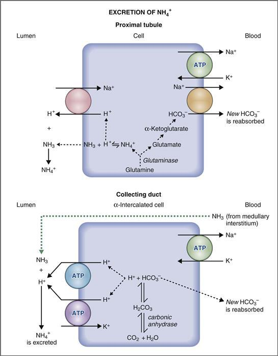

> **그림 7-8 H+를 NH4+로 배설하는 메커니즘.** 근위 세뇨관에서 NH3는 신장 세포의 글루타민으로부터 생성됩니다. H+는 Na+-H+ 교환기에 의해 분비되고 NH3는 내강으로 확산됩니다. NH4+는 TALH의 Na+-K+-2Cl- 공동수송체에 의해 재흡수되어 수질 간질액에 침착됩니다(표시되지 않음). 집합관에서 NH3는 수질 간질에서 내강으로 확산되고 내강에서 분비된 H+와 결합하여 NH4+로 배설됩니다. ATP, 아데노신 삼인산. TALH, Henle 루프의 두꺼운 상승 사지.

NH4+의 운명에는 몇 가지 추가 단계가 필요합니다. 근위세뇨관 세포에서 NH4+는 NH3 및 H+와 평형을 이루고 있습니다. 지용성인 NH3 형태는 농도 구배에 따라 세포에서 내강으로 확산되고, H+는 Na+-H+ 교환기를 통해 내강으로 분비됩니다. 루멘에 들어가면 NH3와 H+가 NH4+로 재결합됩니다. 근위세뇨관의 내강에 있는 NH4+의 운명은 다음과 같습니다. NH4+의 일부는 소변을 통해 *직접* 배설됩니다. 나머지는 순환 경로를 따라 *간접적으로* 배설됩니다. 먼저 두꺼운 상행 사지에서 재흡수된 다음 수질 간질액에 축적된 다음 최종 배설을 위해 수질 간질액에서 집합관으로 분비됩니다.

 **두꺼운 상행지.** 앞서 언급했지만 [그림 7-8에는 표시되지 않았습니다.](#filepos1546675) 근위세뇨관에서 분비되어 Henle 고리로 전달된 NH4+의 일부는 두꺼운 상행지에 의해 재흡수됩니다. 세포 수준에서 NH4+는 Na+-K+-2Cl- 공동수송체의 K+를 대체하여 재흡수됩니다. 이러한 치환의 결과로 NH4+는 **역류 증식**(NaCl과 유사)에 참여하고 신장 내부 수질과 유두의 간질액에 집중됩니다.

 **집합관.** 적정 가능한 산 메커니즘에 대해 설명한 바와 같이 집합관의 α-삽입 세포의 관강막에는 H+를 관상액으로 분비하는 두 개의 수송체([그림 7-8](#filepos1546675) 참조)가 포함되어 있습니다: H+ ATPase 및 H+-K+ ATPase. **H+ ATPase**는 **알도스테론**에 의해 자극됩니다.  
    H+가 관형액으로 분비됨에 따라 **NH3는 수질 간질액에 고농도로 확산**되어 집합관의 내강으로 확산되고, 그곳에서 분비된 H+와 결합하여 NH4+를 형성합니다. 발생하는 질문은 *왜 NH3/NH4+*완충액의 NH*3 형태만 수질 간질에서 확산됩니까?*입니다. 대답은 NH4+와 NH3가 모두 수질 간질액에 존재하지만 NH3 형태만 지용성이며 집합관 세포를 통해 관상액으로 확산될 수 있다는 것입니다. 관형액에 들어가면 NH3는 분비된 H+와 결합하여 NH4+를 형성합니다. NH4+는 지용성이 아니므로 세뇨관액에 갇혀 배설됩니다. 지용성 형태의 완충액(NH3)은 *확산*되고 수용성 형태의 완충액(NH4+)은 *포착*되어 배설되기 때문에 전체 과정을 **확산 포착**이라고 합니다.  
    α-삽입된 세포에서 분비되는 H+의 공급원은 CO2와 H2O입니다. 세포에서 생성되어 분비되는 각 H+에 대해 하나의 ***새로운* HCO3−가 합성되어 재흡수됩니다.** 적정 가능한 산 메커니즘과 마찬가지로 이 새로운 HCO3−는 고갈된 HCO3− 저장량을 보충하는 데 도움이 됩니다.

##### *NH4+ 배설에 대한 요로 pH의 영향*

요중 pH가 감소함에 따라 NH4+로 H+ 배설이 증가합니다. NH4+ 배설에 대한 소변 pH의 효과는 유리합니다. 소변 pH가 낮은 경향이 있는 산증에서는 배설되는 H+의 양이 많습니다. 소변 pH 효과의 기본 메커니즘은 NH3/NH4+의 확산 포착에 기초합니다. 소변의 pH가 감소함에 따라 소변 완충액 중 NH4+ 형태로 더 많이 존재하고 NH3 형태로 더 적게 존재합니다. NH3의 관강 농도가 낮을수록 NH3가 수질 간질액에서 관형액으로 확산되는 기울기가 더 커집니다. 따라서 관형 유체의 pH가 낮을수록 NH3 확산량이 많아지고 NH4+로 배설되는 H+의 양이 많아집니다.

##### *NH3 합성에 대한 산증의 영향*

NH3 합성 속도는 배설되어야 하는 H+의 양에 따라 달라집니다. **만성산증**에서는 근위세뇨관 세포의 **NH3 합성이 적응적으로 증가합니다**. 이 메커니즘은 글루타민 대사에 관여하는 효소의 합성을 유도하는 세포내 pH의 감소와 관련이 있습니다. 이러한 방식으로 NH3 합성이 증가하면 더 많은 H+가 NH4+로 배설되고 더 많은 새로운 HCO3-가 재흡수됩니다. 예를 들어, 당뇨병성 케톤산증에서는 고정산 생산이 증가합니다. 이러한 추가적인 고정된 산 부하를 배설하는 신장의 능력은 대부분 NH3 합성의 적응적 증가에 기인합니다.

##### *NH3 합성에 대한 혈장 K+ 농도의 영향*

혈장 K+ 농도는 NH3 합성도 변경합니다. **고칼륨혈증**은 NH3 합성을 억제하고 H+를 NH4+로 배설하는 능력을 감소시켜 **4형 신세뇨관 산증**(RTA)을 유발합니다. **저칼륨혈증**은 NH3 합성을 자극하고 H+를 NH4+로 배설하는 능력을 증가시킵니다. 이러한 효과는 신장 세포막을 통한 H+ 및 K+ 교환에 의해 매개될 가능성이 높으며, 이는 차례로 세포내 pH를 변경합니다. 고칼륨혈증에서는 K+가 신장 세포로 들어가고 H+가 잎으로 들어갑니다. 결과적으로 세포내 pH가 증가하면 글루타민에서 NH3 합성이 억제됩니다. 저칼륨혈증에서는 K+가 신장 세포를 떠나고 H+가 신장 세포로 들어갑니다. 결과적으로 세포내 pH가 감소하면 글루타민에서 NH3 합성이 자극됩니다.

#### 적정산과 NH4+ 배설량의 비교

매일 H+는 적정산과 NH4+로 배설되므로 일반적으로 단백질과 인지질 이화작용으로 생성된 고정된 H+는 모두 신체에서 제거됩니다(그리고 고정된 H+를 완충하는 데 사용되는 모든 HCO3−는 대체됩니다). [표 7-1](#filepos1555681)은 정상인과 다양한 유형의 대사성 산증(예: 당뇨병성 케톤산증 및 만성 신부전)이 있는 사람의 적정 산으로서의 H+ 및 NH4+ 배설 속도를 요약하고 비교합니다.

**표 7–1 적정산과 NH4+의 H+ 배설 비교**

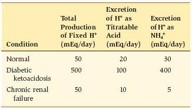

 상대적으로 고단백 식단을 섭취하는 **정상** 사람의 경우 매일 약 50mEq의 고정 H+가 생성됩니다. 신장은 생성된 고정산의 *전부*(100%)를 배설합니다. 40%는 적정 가능한 산(20mEq/일)으로 배설되고 60%는 NH4+(30mEq/일)로 배설됩니다.

 **당뇨병성 케톤산증** 환자의 경우 고정산 생산량은 1일 최대 500mEq까지 10배 증가할 수 있습니다. 이러한 추가적인 산 부하를 배설하기 위해 적정 가능한 산과 NH4+의 배설이 모두 증가됩니다. 산증이 글루타민 대사에 관여하는 효소를 유도하여 NH3 합성을 증가시키기 때문에 NH4+ 배설이 증가합니다. 신장 세포에서 더 많은 NH3가 생산될수록 더 많은 H+가 NH4+로 배설됩니다.  
    적정 가능한 산 배설이 증가하는 이유는 덜 분명합니다. 당뇨병성 케톤산증에서는 β-OH 부티르산과 아세토아세트산이 과잉 생산되어 대사성 산증을 유발합니다. 이들 케토산의 염(즉, 부티레이트 및 아세토아세트산)은 그 자체로 여과되어 인산염과 유사한 요로 완충제 역할을 하여 적정 가능한 산으로 배설되는 H+의 총량을 증가시킵니다.

 **만성 신부전**은 대사성 산증의 또 다른 원인입니다. 상대적으로 고단백 식단을 계속해서 섭취하는 만성 신부전 환자는 매일 50mEq의 고정산을 생성합니다. 이 질환에서는 네프론이 점진적으로 손실되고, 고정산을 배설하는 신장 기전이 다음 두 가지 이유로 심각하게 손상됩니다: (1) 사구체 여과가 감소하여 적정 가능한 산 배설이 감소하고, 이로 인해 여과된 인산염 부하가 감소하여 소변 완충액 역할을 할 수 있는 인산염의 양이 감소합니다. (2) 병든 네프론에서 NH3 합성이 손상되기 때문에 NH4+ 배설이 감소됩니다.  
    만성 신부전에서 총 고정산 배설은 15mEq/일(적정 가능한 산으로 10mEq + NH4+로 5mEq)에 불과하며, 이는 단백질 이화작용으로 생성된 고정산의 양(50mEq/일)보다 훨씬 적습니다. 만성 신부전에서 대사성 산증의 *원인*은 실제로 신장이 매일 생산되는 고정된 산을 모두 배설할 수 없기 때문입니다. 논리적으로, 만성 신부전 환자는 일일 고정산 생산을 줄이고 그에 따라 고정산 배설과 새로운 HCO3- 재흡수에 대한 신장의 수요를 줄이기 위해 저단백질 식단을 섭취합니다.

### 산성 질환

산-염기 균형의 장애는 모든 임상 의학에서 가장 흔한 증상 중 하나입니다. 산염기 장애는 비정상적인 pH로 반영되는 혈액 내 비정상적인 H+ 농도를 특징으로 합니다. **산혈증**은 혈액 내 H+ 농도의 증가(pH 감소)이며 산증이라는 병리생리학적 과정에 의해 발생합니다. 반면에 **알칼리혈증**은 혈액 내 H+ 농도 감소(pH 증가)이며 *알칼리증*이라는 병리생리학적 과정에 의해 발생합니다.

혈액 pH의 교란은 HCO3− 농도의 *일차* 교란 또는 PCO2의 *일차* 교란으로 인해 발생할 수 있습니다. 이러한 교란은 HCO3−/CO2 완충액에 대한 Henderson-Hasselbalch 방정식을 고려함으로써 가장 잘 이해됩니다. 방정식에서는 혈액 pH가 HCO3− 농도와 CO2 농도의 비율에 의해 결정된다는 점을 기억하십시오. 따라서 HCO3− 농도 또는 PCO2의 변화는 pH의 변화를 가져옵니다.

산-염기 균형의 교란은 일차 교란이 HCO3− 또는 CO2에 있는지에 따라 *대사* 또는 *호흡*으로 설명됩니다. 네 가지 **단순 산염기 ​​장애**가 있습니다. 여기서 *단순*은 단 하나의 산염기 장애가 존재함을 의미합니다. 하나 이상의 산-염기 장애가 존재하는 경우, 그 상태를 *혼합* 산-염기 장애라고 합니다.

산-염기 대사 장애는 HCO3−와 관련된 주요 장애입니다. **대사성 산증**은 Henderson-Hasselbalch 방정식에 따라 pH가 감소하는 HCO3− 농도의 감소로 인해 발생합니다. 이 장애는 체내 고정 H+의 증가(고정 H+ 과잉 생산, 고정 H+ 섭취 또는 고정 H+ 배설 감소를 통해) 또는 HCO3− 손실로 인해 발생합니다. **대사성 알칼리증**은 Henderson-Hasselbalch 방정식에 따라 pH가 증가하는 HCO3− 농도의 증가로 인해 발생합니다. 이 장애는 신체에서 고정된 H+가 손실되거나 HCO3−가 증가하여 발생합니다.

호흡성 산-염기 장애는 CO2의 주요 장애(즉, 호흡 장애)입니다. **호흡성 산증**은 호흡 저하로 인해 발생하며 이로 인해 CO2 정체, PCO2 증가 및 pH 감소가 발생합니다. **호흡성 알칼리증**은 과호흡으로 인해 발생하며 이로 인해 CO2 손실, PCO2 감소 및 pH 증가가 발생합니다.

산-염기 장애가 있는 경우 혈액 pH를 정상 범위로 유지하기 위해 여러 메커니즘이 활용됩니다. 첫 번째 방어선은 ECF와 ICF의 버퍼링입니다. 완충 외에도 **호흡 보상**과 **신장 보상**이라는 두 가지 유형의 보상 반응이 pH를 정상화하려고 시도합니다. 경험적으로 알아두면 도움이 되는 규칙은 다음과 같습니다. 산-염기 장애가 대사성(즉, HCO3 장애)인 경우 보상 반응은 PCO2를 조절하기 위한 호흡입니다. 산-염기 교란이 호흡(예: CO2 교란)인 경우 보상 반응은 HCO3− 농도를 조정하기 위한 신장(또는 대사) 반응입니다. 또 다른 유용한 규칙은 다음과 같습니다. 보상 반응은 항상 원래 교란과 동일한 방향입니다. 예를 들어, 대사성 산증에서 주요 장애는 혈액 중 HCO3− 농도의 *감소*입니다. 호흡 보상은 과호흡으로 PCO2를 *감소*시킵니다. 호흡성 산증에서 일차 장애는 PCO2 *증가*입니다. 신장 보상은 HCO3− 농도를 *증가*시킵니다.

각 산-염기 장애가 제시될 때 완충 및 보상 반응이 자세히 논의됩니다. [표 7-2](#filepos1563952)는 4가지 단순 산-염기 장애와 각각에서 발생하는 예상 보상 반응을 요약한 것입니다.

**표 7–2 산-염기 장애 요약**

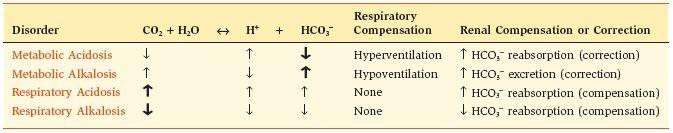

*굵은 화살표*는 초기 교란을 나타냅니다.

#### 플라즈마의 음이온 갭

산염기 장애 진단에 유용한 측정은 **혈장 음이온 갭**(또는 간단히 **음이온 갭**)입니다. 음이온 갭은 전기적 중성의 원리에 기초합니다. 혈장과 같은 체액 구획의 경우 양이온과 음이온의 농도가 동일해야 합니다. 혈장의 일상적인 분석에서는 일부 양이온과 음이온이 측정되고 다른 일부는 측정되지 않습니다. 일반적으로 측정되는 양이온은 Na+입니다. 일반적으로 측정되는 음이온은 HCO3− 및 Cl−입니다. Na+ 농도(mEq/L 단위)를 HCO3− 및 Cl− 농도(mEq/L 단위)의 합과 비교할 때 음이온 갭이 있습니다. 즉, Na+ 농도가 HCO3− 농도와 Cl− 농도의 합보다 크다([그림 7-9](#filepos1565674)). 전기적 중성은 결코 침해되지 않기 때문에 플라즈마에는 이러한 차이 또는 "간극"을 구성하는 **측정되지 않은 음이온**이 포함되어야 합니다. 측정되지 않은 혈장 음이온에는 혈장 단백질, 인산염, 구연산염 및 황산염이 포함됩니다.

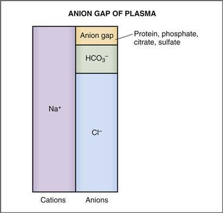

**그림 7–9 플라즈마의 음이온 갭.**

플라즈마의 음이온 갭은 다음과 같이 계산됩니다.

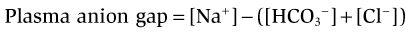

어디서

|  |  |
| --- | --- |
| 플라즈마 음이온 갭 | = 측정되지 않은 음이온(mEq/L) |
| [Na+] | = 측정된 양이온(mEq/L) |
| [HCO3−] 및 [Cl−] | = 측정된 음이온(mEq/L) |

혈장 음이온 갭의 정상값 범위는 **8 ~ 16 mEq/L입니다.** 음이온 갭의 정상값은 혈장 Na+ 농도, HCO3− 농도, Cl− 농도의 정상값을 식에 대입하여 구할 수 있습니다. 따라서 Na+ 농도가 140mEq/L, HCO3− 농도가 24mEq/L, Cl− 농도가 105mEq/L이면 혈장 음이온 갭은 11mEq/L입니다.

혈장 음이온 갭은 주로 **대사성 산증**의 감별 진단에 유용합니다. 정의에 따르면 대사성 산증은 혈장 HCO3− 농도 감소와 관련이 있습니다. Na+ 농도가 변하지 않는다고 가정하면 혈장 구획의 전기적 중성을 보존하기 위해 음이온의 농도는 "손실된" HCO3−를 대체하기 위해 증가해야 합니다. 해당 음이온은 측정되지 않은 음이온 중 하나일 수도 있고 Cl-일 수도 있습니다. HCO3−가 측정되지 않은 음이온으로 대체되면 계산된 음이온 갭이 증가합니다. HCO3−가 Cl−로 대체되면 계산된 음이온 갭은 정상입니다.

##### *음이온 갭 증가*

여러 형태의 대사성 산증에서는 유기 음이온(예: 케토산, 젖산염, 포름산염, 살리실산염)이 축적됩니다. 이러한 경우, HCO3− 농도의 감소는 측정되지 않은 유기 음이온 농도의 증가로 상쇄됩니다. 따라서 음이온 갭이 증가하며 이러한 유형의 대사성 산증을 *음이온 갭이 증가된 대사성 산증*이라고 합니다. 증가된 음이온 갭 대사성 산증의 예로는 당뇨병성 케톤산증, 젖산산증, 살리실산염 중독, 메탄올 중독, 에틸렌 글리콜 중독 및 만성 신부전이 있습니다.

음이온 갭이 증가된 대사성 산증의 특정 원인(예: 메탄올 및 에틸렌 글리콜 중독)에는 **삼투압 갭**도 있습니다. 삼투압 갭은 *측정된* 혈장 삼투압과 *추정된* 혈장 삼투압 간의 차이입니다. ([6장](CR%21G9RE0KW4PD33Q9F3DXNCSBNXCANP_split_015.html#filepos1181244)에서 혈장 삼투압은 혈장의 주요 용질, 즉 Na+ [및 이에 수반되는 음이온 Cl- 및 HCO3-], 포도당 및 요소를 합산하여 추정한다는 점을 상기하십시오. 6](CR%21G9RE0KW4PD33Q9F3DXNCSBNXCANP_split_015.html#filepos1181244), 추정된 혈장 삼투압 = 2 × Na+ + 포도당/18 + BUN/2.8.) 일반적으로 추정 방법은 일반적으로 존재하는 거의 모든 용질을 설명하기 때문에 측정된 혈장 삼투압과 추정된 혈장 삼투압 사이에는 거의 차이가 없습니다. 그러나 메탄올 중독이나 에틸렌 글리콜 중독의 경우 이들 물질은 분자량이 낮기 때문에 혈장에 상당한 양의 용질이 추가되어 측정된 혈장 삼투압이 증가합니다. 추정된 혈장 삼투압에는 이러한 특이한 용질이 포함되지 않기 때문에 삼투압 차이가 존재합니다. 이론적으로 음이온 갭이 증가하여 대사성 산증을 유발하는 다른 물질(예: 케토산, 젖산, 살리실산)은 삼투압 갭을 생성할 수 있습니다. 그러나 상대적으로 높은 분자량으로 인해 독성 농도는 혈장의 총 삼투압에 거의 영향을 미치지 않습니다.

##### *정상 음이온 갭*

대사성 산증의 몇 가지 원인(예: 설사, 신세뇨관 산증)에서는 유기 음이온이 축적되지 않습니다. 이러한 경우 HCO3− 농도의 감소는 측정된 음이온인 Cl− 농도의 증가로 상쇄됩니다. 하나의 측정된 음이온(HCO3-)이 다른 측정된 음이온(Cl-)으로 대체되기 때문에 음이온 갭에는 변화가 없습니다. 이러한 유형의 대사성 산증을 *정상 음이온 갭이 있는 고염소산 대사성 산증*이라고 합니다.(어떤 사람들은 "비음이온 갭"이라는 용어를 사용할 수 있지만 이것은 잘못된 명칭입니다. 이러한 경우 음이온 갭이 여전히 존재하지만 이는 증가한 것이 아니라 정상입니다.)

#### 산-염기 지도

네 가지 단순 산-염기 장애 각각은 pH, PCO2, HCO3− 농도 값의 범위와 연관되어 있습니다. 이러한 값은 [그림 7-10](#filepos1571768)과 같이 산-염기 지도에서 음영 영역으로 겹쳐질 수 있습니다. 이 지도는 환자의 산-염기 상태를 평가하는 편리한 방법을 제공합니다.

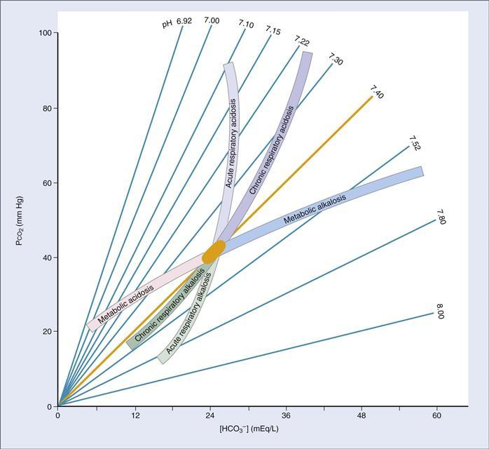

**그림 7–10 산-염기 지도에 겹쳐진 단순 산-염기 장애에 대한 값**
*음영 영역*은 각각의 단순한 산-염기 장애에 대해 일반적으로 나타나는 값의 범위를 보여줍니다. 각 호흡기 질환에는 두 개의 *음영 영역*이 있습니다. 하나는 급성기와 다른 하나는 만성기입니다.

 **대사 장애.** 대사성 산증 또는 대사성 알칼리증에 대한 호흡 보상이 즉시 발생하므로 각 단순 대사 장애에는 *한 가지* 범위의 기대값이 있습니다.

 **호흡기 장애.** 각각의 단순 호흡 장애에는 *두 가지* 기대 값 범위가 있습니다. 하나는 급성 장애에 대한 것이고 다른 하나는 만성 장애에 대한 것입니다. **급성** 장애는 신장 보상이 발생하기 전에 나타나므로 혈액 pH 값이 더 비정상적인 경향이 있습니다. **만성** 장애는 일단 신장 보상이 이루어지면 나타나며, 이는 며칠이 걸립니다. 보상 과정으로 인해 혈액 pH 값은 만성 단계에서 더 정상이 되는 경향이 있습니다.

산-염기 지도는 다음과 같이 사용됩니다: 환자의 값이 *음영 영역* 내에 속하는 경우, 단 하나의 산-염기 장애가 존재한다는 결론을 내릴 수 있습니다. 환자의 값이 *음영 영역 외부*(예: 두 영역 사이)에 해당하는 경우, 두 가지 이상의 장애가 존재한다는 결론을 내릴 수 있습니다(즉, 혼합 장애). 이후에는 단순 산염기 ​​질환 각각에 대해 설명하므로 [표 7-2](#filepos1563952)와 [그림 7-10](#filepos1571768)의 산염기 지도를 참조한다.

#### 보상 대응 규칙

산-염기 지도는 그림으로는 유용하지만 환자의 침상 옆에서 사용하는 것은 불편할 수 있습니다. 따라서 환자의 pH, PCO2 및 HCO3− 농도가 단순 산-염기 장애와 일치하는지 확인하기 위해 "경험의 법칙" 또는 "신장 규칙"이 개발되었습니다. 이러한 규칙은 [표 7-3](#filepos1575195)에 요약되어 있다. 각 **대사 장애**에 대해 규칙은 HCO3− 농도의 주어진 변화에 대해 PCO2의 예상되는 보상 변화(즉, 호흡 보상)를 예측합니다. 각 **호흡기 장애**에 대해 규칙은 PCO2의 주어진 변화에 대해 예상되는 HCO3− 농도의 보상 변화(즉, 신장 보상)를 예측합니다. 산-염기 지도와 마찬가지로, 각 호흡기 질환에는 *급성* 단계에 대한 예측과 *만성* 단계에 대한 예측의 두 세트가 있습니다.

****표 7–3**단순 산-염기 장애에서 보상 반응을 예측하기 위한 신장 규칙**

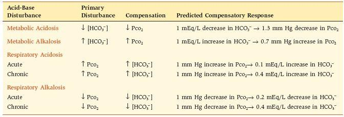

환자의 혈액 수치가 예측 수치와 동일하면 단일 산-염기 장애가 존재하는 것입니다. 환자의 값이 예측된 값과 다른 경우 혼합 산-염기 장애가 있는 것입니다.

**예제 문제.** 3일 동안 구토를 한 여성이 응급실로 이송되었으며, 그곳에서 다음과 같은 혈액 수치가 측정되었습니다: pH, 7.5; PCO2, 48mmHg; 및 HCO3-, 37mEq/L. *그녀는 어떤 산-염기 장애를 갖고 있나요? 단순 또는 혼합형 산-염기 장애가 있습니까?*

**해결책.** 여성의 혈액 pH(알칼리성)가 증가하고 PCO2 및 HCO3− 농도가 증가했습니다. 이 값은 모두 대사성 알칼리증과 일치합니다. 대사성 알칼리증은 HCO3− 농도의 증가로 시작되어 pH가 증가합니다. 화학수용체를 통해 작용하는 pH의 증가는 호흡곤란을 유발합니다. 저호흡은 CO2 저류와 대사성 알칼리증에 대한 호흡 보상인 PCO2 증가로 이어집니다.

여성이 단순 대사성 알칼리증인지, 혼합형 산-염기 질환인지에 대한 질문은 신장 규칙을 적용하여 답할 수 있습니다([표 7-3](#filepos1575195) 참조). 대사성 알칼리증의 경우, 신장 규칙은 주어진 HCO3− 농도 증가에 따른 PCO2의 예상 증가를 예측합니다. 실제 PCO2가 예측 PCO2와 동일하면 단순 대사성 알칼리증이 있는 것입니다. 실제 PCO2가 예측된 PCO2와 다른 경우, 그 사람은 다른 산-염기 장애(즉, 혼합 장애)와 결합된 대사성 알칼리증을 앓고 있는 것입니다. 이 예에서는 신장 규칙이 다음과 같이 적용됩니다.

HCO3 증가−

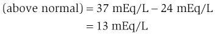

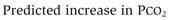

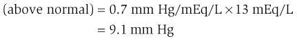

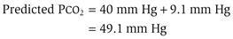

이 계산을 해석하면 HCO3− 농도가 37mEq/L인 단순 대사성 알칼리증에서 보상성 저호흡으로 인해 PCO2가 49.1mmHg로 상승할 것으로 예상됩니다. 여성의 실제 PCO2는 48mmHg로 사실상 동일합니다. 따라서 그녀는 단순 대사성 알칼리증에 대해 예상되는 정도의 호흡 보상을 갖고 있으며 다른 산-염기 장애는 존재하지 않습니다.

#### 대사성 산증

대사성 산증은 혈액 내 **HCO3**−**농도** 감소로 인해 발생합니다. 대사성 산증은 케토산이나 젖산과 같은 고정산의 생산 증가로 인해 발생할 수 있습니다. 살리실산과 같은 고정산 섭취로 인해; 정상적인 신진대사로 생성된 고정된 산을 신장이 배설할 수 없기 때문입니다. 또는 신장이나 위장관을 통한 HCO3−의 손실로 인해 발생합니다([표 7-4](#filepos1579523) 및 [Box 7-1](#filepos1583050)). 대사성 산증에서 나타나는 동맥혈 프로필은 다음과 같습니다.

표 7-4 대사성 산증의 원인

|  |  |  |
| --- | --- | --- |
| **원인** | **예** | **댓글** |
| 고정 H+의 과도한 생산 또는 섭취 | 당뇨병성 케톤산증 | β-OH부티르산과 아세토아세트산의 축적 ↑ 음이온 갭 |
|  | 젖산증 | 저산소증 시 젖산 축적 ↑ 음이온 갭 |
|  | 살리실산염 중독 | 호흡성 알칼리증도 유발 ↑ 음이온차이 |
|  | 메탄올/포름알데히드 중독 | 포름산으로 전환 ↑ 음이온 갭 ↑ 삼투압 갭 |
|  | 에틸렌 글리콜 중독 | 글리콜산과 옥살산으로 변환 ↑ 음이온 갭 ↑ 삼투압 갭 |
| HCO3 손실− | 설사 | HCO3의 위장관 손실− 정상적인 음이온 갭 고염소혈증 |
|  | 2형 신세뇨관성 산증(2형 RTA) | HCO3-의 신장 손실(여과된 HCO3- 재흡수 실패) 정상 음이온 갭 고염소혈증 |
| 고정된 H+를 배설할 수 없음 | 만성 신부전 | ↓ H+를 NH4+로 배설 ↑ 음이온 갭 |
|  | 1형 신세뇨관성 산증(제1형 RTA) | ↓ 적정산인 H+ 및 NH4+ 배설 ↓ 소변 산성화 능력 정상 음이온 갭 |
|  | 4형 신세뇨관성 산증(4형 RTA) | 저알도스테론증 ↓ NH4+ 배설 고칼륨혈증으로 NH3 합성 억제 정상 음이온 갭 |

**상자 7-1 임상 생리학: 당뇨병성 케톤산증**

> **사례 설명.** 56세 여성은 15년 동안 제1형 당뇨병을 앓고 있으며, 주의 깊은 식이 모니터링과 하루 2회 인슐린 피하 주사를 통한 치료를 통해 관리되고 있습니다. 최근 바이러스성 질병으로 인해 식욕 부진, 발열, 구토가 발생합니다. 그녀는 숨이 가빠져 병원 중환자실에 입원하게 됩니다.

> 신체 검사 결과 여성이 심각한 질병을 앓고 있는 것으로 나타났습니다. 그녀의 점막은 건조하고 피부 긴장도 감소했습니다. 그녀는 깊고 빠르게 숨을 쉬고 있습니다. 소변 샘플에는 포도당과 케톤이 포함되어 있습니다.

> 그녀의 혈액에 대한 실험실 테스트 결과 다음과 같은 정보가 나왔습니다.

> |  |  |
> | --- | --- |
> | **동맥혈** | **정맥 혈장** |
> | pH, 7.07 | [Na+], 132mEq/L |
> | PCO2, 18mmHg | [Cl−], 94mEq/L |
> | [HCO3−], 5mEq/L | [K+], 5.9mEq/L |
> |  | [포도당], 650mg/dL |

> 여성에게 인슐린 주사와 등장성 식염수 정맥 주입을 실시합니다. 그녀의 혈액 수치와 호흡은 치료 시작 후 12시간 이내에 정상으로 돌아옵니다.

> **사례 설명.** 여성의 당뇨병은 급성 바이러스 질환으로 인해 당뇨병성 케톤산증이 촉발될 때까지 잘 조절되었습니다. 그녀의 혈당 수치가 650mg/dL(정상, 80mg/dL)로 상승하고 소변에 포도당이 존재하는 것은 그녀의 당뇨병이 조절되지 않는다는 증거입니다. 혈당 농도가 너무 높아 여과된 부하가 세뇨관의 재흡수 용량을 초과했기 때문에 그녀는 소변으로 포도당을 배설하고 있습니다.

> 입원 시 여성의 동맥혈 수치는 대사성 산증과 일치합니다(pH 감소, [HCO3−] 감소, PCO2 감소). 조절되지 않는 제1형 당뇨병의 대사성 산증은 고정산인 β-OH 부티르산과 아세토아세트산의 과도한 생산으로 인해 발생합니다. 인슐린이 없으면 지방 분해가 증가합니다(지방 분해 증가). 지방 분해의 산물인 지방산은 케톤산인 β-OH 부티르산과 아세토아세트산으로 전환됩니다. (소변에 케톤이 존재한다는 것은 케톤산증 진단을 뒷받침합니다.) 이러한 과도한 고정산은 세포외 HCO3−에 의해 완충되어 혈액[HCO3−]을 감소시키고 혈액 pH를 감소시킵니다. 감소된 PCO2는 쿠스마울 호흡으로 알려진 대사성 산증에 대한 호흡 보상인 과호흡(빠르고 깊은 호흡)의 결과입니다.

> *여성은 **단순** 대사성 산증(하나의 산염기 장애)을 앓고 있습니까, 아니면 **혼합** 산염기 장애를 앓고 있습니까?* 이 질문에 대답하기 위해 경험 법칙을 사용하여 측정된 [HCO3−] 변화에 대한 PCO2(호흡 보상)의 예측 변화를 계산합니다(이 계산은 [표 7-3](#filepos1575195) 참조). 단순 대사성 산증의 경우 규칙에 따르면 [HCO3−]가 1mEq/L 감소하면 PCO2가 1.3mmHg 감소합니다. 여성의 [HCO3−]는 5mEq/L로 정상 수치인 24mEq/L에서 19mEq/L 감소한 수치입니다. 따라서 [HCO3−]의 변화에 ​​대한 PCO2의 예측된 변화는 25mmHg(19×1.3)입니다. 이제 PCO2의 예측된 변화는 PCO2의 실제 변화와 비교됩니다. 여성의 PCO2는 18mmHg로 정상 수치인 40mmHg보다 22mmHg 낮습니다. PCO2(25mmHg)의 예측된 변화와 PCO2(22mmHg)의 실제 변화는 유사하며 단 하나의 산-염기 장애, 즉 대사성 산증만이 존재함을 시사합니다.

> 혈장 음이온 갭은 대사성 산증의 감별 진단에 유용한 정보를 제공합니다. 여성의 음이온 갭은 다음과 같이 계산됩니다.

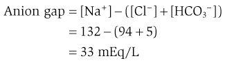

> 플라즈마 음이온 갭의 정상 범위는 8~16mEq/L입니다. 33mEq/L에서는 측정되지 않은 음이온의 존재로 인해 여성의 음이온 격차가 심각하게 높아집니다. 즉, 측정된 음이온인 HCO3−가 감소되고 측정되지 않은 음이온으로 대체되어 혈장 구획의 전기적 중성을 유지하게 됩니다. 여성의 당뇨병 병력과 소변 내 케톤의 존재를 고려할 때 이러한 측정되지 않은 음이온은 β-OH 낙산염과 아세토아세트산일 가능성이 가장 높습니다.

> 감소된 피부 긴장과 건조한 점막은 ECF 부피 수축을 암시합니다. 그녀의 ECF 부피 수축의 원인은 포도당의 삼투성 이뇨로 인한 소변의 용질과 수분 손실입니다. 여성의 혈당이 너무 높기 때문에 여과된 포도당의 일부가 재흡수될 수 없습니다. 재흡수되지 않은 포도당은 삼투성 이뇨제로 작용하고 NaCl과 물도 함께 배설되어 ECF 부피 수축을 유발합니다.

> 저나트륨혈증 또는 감소된 혈액(Na+)은 당뇨병성 케톤산증에서 흔히 볼 수 있으며 다음과 같이 설명할 수 있습니다. 여성의 ECF(포도당)가 눈에 띄게 상승하기 때문에 ECF 삼투압도 상승합니다(포도당은 삼투압 활성 용질입니다). ECF의 고삼투압으로 인해 물이 세포 밖으로 이동하여 ECF와 ICF 사이의 삼투압 평형을 달성하고 ECF의 용질을 희석시키고 혈액 [Na+]을 감소시킵니다.

> 그 여성은 고칼륨혈증(혈액 [K+] 증가)을 앓고 있습니다. 산-염기 균형과 K+ 균형 사이의 관계는 종종 복잡하지만 특히 당뇨병성 케톤산증의 경우 더욱 그렇습니다. 고칼륨혈증의 가장 큰 원인은 인슐린 부족입니다. [6장](CR%21G9RE0KW4PD33Q9F3DXNCSBNXCANP_split_015.html#filepos1181244)에서 인슐린이 K+를 세포로 이동시키는 주요 요인이라는 점을 상기해 보세요. 인슐린이 없으면 K+가 세포 밖으로 이동하여 고칼륨혈증을 유발합니다. 그녀의 고칼륨혈증에 기여하는 또 다른 요인은 고삼투압인데, 이는 혈당 상승의 결과로 추정됩니다. 삼투압 평형을 달성하기 위해 물이 세포 밖으로 이동함에 따라 K+도 함께 운반되어 추가 고칼륨혈증을 유발합니다. 대사성 산증은 고칼륨혈증을 유발하는 요인이 아닐 가능성이 높습니다. 왜냐하면 H+가 완충될 세포에 들어갈 때 케토음이온과 함께 들어가기 때문입니다. K+로 교환할 필요가 없습니다.

> **치료.** 치료는 여성의 혈당 수치를 낮추고 케톤산증을 교정하며 고칼륨혈증을 교정하는 인슐린 주사로 구성됩니다. 또한 삼투성 이뇨로 인한 Na+ 및 수분 손실을 보충하기 위해 정맥 내 식염수를 투여합니다.

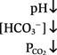

이 혈액 프로필을 생성하기 위한 대사성 산증 생성에서 다음과 같은 일련의 사건이 발생합니다. 대사성 산증은 설사 및 제2형 신세뇨관 산증(HCO3- 농도의 직접적인 감소로 이어짐)처럼 HCO3-의 명백한 손실로 인해 발생할 수 있지만, 대부분 체내 고정산의 과잉으로 인해 발생합니다.

1. **고정 H+의 증가.** 과잉 고정 H+는 고정 산의 생산 증가나 섭취 또는 고정 산 배설 감소를 통해 체내에 축적됩니다.
2. **버퍼링.** 초과 고정 H+는 ECF와 ICF 모두에 버퍼링됩니다. ECF에서 H+는 주로 HCO3−에 의해 완충되며, 이로 인해 **HCO3−**농도가 감소합니다.** HCO3− 농도가 감소하면 Henderson-Hasselbalch 방정식(pH = pK + log HCO3−/CO2)에서 예측한 대로 **pH가 감소합니다**.  
       ICF에서 과잉 고정된 H+는 유기 인산염과 단백질에 의해 완충됩니다. 이러한 세포내 완충액을 활용하려면 먼저 H+가 세포 안으로 들어가야 합니다. H+는 케토음이온, 젖산염 또는 포름산염과 같은 유기 음이온과 함께 세포에 들어갈 수도 있고, K+와 교환하여 세포에 들어갈 수도 있습니다. H+가 K+로 교환되면 **고칼륨혈증**이 발생합니다.
3. **호흡 보상.** 감소된 동맥 pH는 경동맥체의 말초 화학수용체를 자극하여 **과호흡**을 유발합니다. 결과적으로 과호흡은 대사성 산증에 대한 호흡 보상인 **감소 PCO2**를 생성합니다. 이것이 보상 반응인 *이유*를 이해하려면 Henderson-Hasselbalch 방정식을 살펴보십시오.

   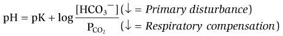

   주요 장애는 HCO3− 농도 감소이며, 이는 그 자체로 pH의 심각한 감소로 이어집니다. 호흡 보상인 과호흡은 PCO2를 감소시켜 HCO3−/CO2 비율을 정상화하고 pH를 정상화하는 경향이 있습니다.
4. **신장 교정.** 완충 및 호흡 보상이 빠르게 발생합니다. 그러나 대사성 산증(사람의 산-염기 상태를 정상으로 되돌리는 것)의 궁극적인 *교정*은 신장에서 이루어지며 며칠이 걸립니다. 과잉 고정된 H+는 적정산과 NH4+로 배설됩니다. 동시에, 새로운 HCO3-가 합성되어 신장에서 재흡수되어 이전에 완충 과정에서 소비되었던 HCO3-를 대체하게 됩니다. 이런 방식으로 혈중 HCO3− 농도가 정상으로 돌아갑니다.

#### 대사성 알칼리증

대사성 알칼리증은 혈액 내 HCO3 농도 증가로 인해 발생합니다. 대사성 알칼리증은 위장관에서 고정된 H+가 손실된 결과입니다. 신장에서 고정 H+ 손실(예: 고알도스테론증); HCO3−를 함유한 용액 투여; 또는 ECF 부피 수축(예: 이뇨제 투여)([표 7-5](#filepos1596133) 및 [박스 7-2](#filepos1597902)). 대사성 알칼리증에서 나타나는 동맥혈 프로필은 다음과 같습니다.

표 7–5 대사성 알칼리증의 원인

|  |  |  |
| --- | --- | --- |
| **원인** | **예** | **댓글** |
| H+ 손실 | 구토 | 위 H+ HCO3−의 손실은 혈액에 남아 있습니다. 부피 수축에 의해 유지됩니다. 저칼륨혈증 |
|  | 고알도스테론증 | 삽입된 세포에 의한 H+ 분비 증가 저칼륨혈증 |
| HCO3의 이득− | NaHCO3 섭취 우유-알칼리 증후군 | 신부전과 관련된 다량의 HCO3− 섭취 |
| 체적수축알칼리증 | 루프 또는 티아지드 이뇨제 | ↑ 안지오텐신 II 및 알도스테론으로 인한 HCO3− 재흡수 |

**상자 7-2 임상 생리학: 구토로 인한 대사성 알칼리증**

> **사례 설명.** 35세 남자가 심한 상복부 통증을 평가하기 위해 병원에 입원했습니다. 내원 전 며칠 동안 그는 지속적인 오심과 구토를 겪었습니다. 신체검사상 중상복부 압통이 있습니다. 그의 혈압은 바로 누웠을 때 120/80mmHg, 서 있을 때 100/60mmHg입니다. 상부 위장 내시경 검사에서 부분적인 위출구 폐쇄를 동반한 유문궤양이 발견되었습니다. 입원 시 다음 혈액 값을 얻습니다.

> |  |  |
> | --- | --- |
> | **동맥혈** | **정맥혈** |
> | pH, 7.53 | [Na+], 137mEq/L |
> | PCO2, 45mmHg | [Cl−], 82mEq/L |
> | [HCO3−], 37mEq/L | [K+], 2.8mEq/L |

> 남성은 정맥내 등장성 식염수와 K+로 치료하고 수술을 권합니다.

> **사례 설명.** 이 환자의 경우 유문궤양으로 인해 위출구 폐쇄가 발생했습니다. 위 내용물이 소장으로 쉽게 전달되지 않자 남성은 구토를 시작했습니다. 동맥혈 수치는 대사성 알칼리증과 일치합니다: pH 증가, [HCO3−] 증가, PCO2 증가. 그 남자는 토했고 위장에서 H+가 빠져나갔고, 혈액 속에 HCO3−가 남았습니다. H+가 위에서 HCl로 손실되기 때문에 혈액 [Cl-]이 감소합니다(정상, 100mEq/L). 그의 PCO2는 대사성 알칼리증에 대한 호흡 보상으로 예상되는 저환기의 결과로 상승합니다.

> 음이온 갭은 모든 산-염기 장애로 계산됩니다. 남성의 혈장 음이온 갭이 18mEq/L로 높아졌습니다.

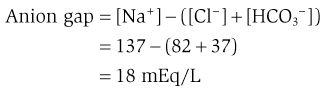

> 이 사례는 음이온 갭의 증가가 반드시 대사성 산증이 있음을 의미하지는 *않음*을 보여줍니다. 이 남자의 산-염기 장애는 대사성 *알칼리증*입니다. 며칠 동안 아무것도 먹지 않았기 때문에 그의 음이온 갭이 높아졌습니다. 지방은 분해되고 결과로 생성된 지방산은 측정할 수 없는 음이온인 케톤산을 생성합니다.

> 남성은 기립성 저혈압(서 있을 때 혈압이 떨어짐)을 앓고 있는데 이는 ECF 용적 수축과 일치합니다. 그의 ECF 부피 수축은 레닌-안지오텐신 II-알도스테론 시스템을 활성화시켜 대사성 알칼리증을 악화시킵니다. 증가된 안지오텐신 II는 Na+-H+ 교환을 자극하여 HCO3- 재흡수를 증가시키고, 증가된 알도스테론은 H+ 분비를 증가시킵니다. 세뇨관에 대한 이 두 가지 효과는 함께 대사성 알칼리증을 악화시킵니다. 이 점을 요약하면, 위 H+의 손실은 대사성 알칼리증을 생성하고 체적 수축은 과도한 HCO3-가 소변으로 배설되는 것을 허용하지 않음으로써 이를 유지합니다.

> 저칼륨혈증에는 여러 가지 설명이 있습니다. 첫째, 일부 K+가 위액에서 손실됩니다. 둘째, 대사성 알칼리증에서는 H+가 세포 밖으로 이동하고 K+가 세포로 이동하여 저칼륨혈증을 유발합니다. 마지막으로 가장 중요한 요인은 ECF 부피 수축으로 인해 알도스테론 분비가 증가했다는 것입니다. 이 이차성 고알도스테론증은 신장 주요 세포에 의한 K+ 분비 증가를 유발하고([6장](CR%21G9RE0KW4PD33Q9F3DXNCSBNXCANP_split_015.html#filepos1181244) 참조), 이는 추가 저칼륨혈증을 유발합니다.

> **치료.** 즉각적인 치료는 정맥 식염수와 K+로 구성됩니다. 대사성 알칼리증을 교정하려면 구토가 멈추더라도 ECF량을 회복해야 합니다.

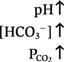

이 혈액 프로필을 생성하기 위한 대사성 알칼리증 생성에서 다음과 같은 일련의 사건이 발생합니다. 대사성 알칼리증은 HCO3− 투여로 인해 발생할 수 있지만 대부분 신체에서 고정된 산이 손실되어 발생합니다.

1. **고정산의 손실.** 대사성 알칼리증의 전형적인 예는 HCl이 위에서 손실되는 **구토**입니다. 위 벽세포는 CO2와 H2O로부터 H+와 HCO3-를 생성합니다. H+는 Cl-와 함께 위강으로 분비되어 소화를 돕고, HCO3-는 혈액으로 들어갑니다. 정상인의 경우 분비된 H+는 위에서 소장으로 이동하며, 그곳에서 낮은 pH는 췌장에서 HCO3−의 분비를 촉발합니다. 따라서 일반적으로 벽세포에 의해 혈액에 추가된 HCO3−는 나중에 췌장 분비물을 통해 혈액에서 제거됩니다. 그러나 구토가 발생하면 H+가 위에서 손실되어 결코 소장에 도달하지 않습니다. 따라서 췌장에서 HCO3− 분비가 자극되지 않고 HCO3−가 혈액에 남아 **HCO3− 농도가 증가합니다.** HCO3− 농도가 증가하면 Henderson-Hasselbalch 방정식(pH = pK + log HCO3−/CO2)에서 예측한 대로 **pH가 증가합니다**.
2. **완충.** 대사성 산증과 마찬가지로 완충은 ECF와 ICF 모두에서 발생합니다. ICF 완충액을 활용하기 위해 H+는 K+와 교환하여 세포를 떠나고 **저칼륨혈증**이 발생합니다.
3. **호흡 보상.** 동맥 pH가 증가하면 **환기 저하**를 유발하여 반응하는 말초 화학 수용체가 억제됩니다. 결과적으로, 저환기는 **증가된 PCO2**를 생성하는데, 이는 대사성 알칼리증에 대한 호흡 보상입니다. 이전과 마찬가지로 Henderson-Hasselbalch 방정식을 조사하여 보상을 이해합니다.

   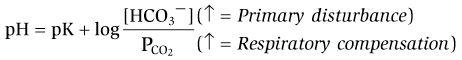

   대사성 알칼리증의 주요 장애는 HCO3− 농도의 증가이며, 이는 그 자체로 pH의 심각한 증가를 초래합니다. 호흡 보상, 저호흡은 PCO2를 증가시켜 HCO3-/CO2 비율을 정상화하고 pH를 정상화하는 경향이 있습니다.
4. **신장 교정.** 대사성 알칼리증의 교정은 모든 산-염기 장애 중에서 가장 간단해야 합니다*. 주요 교란은 HCO3− 농도의 증가이기 때문에 과도한 HCO3−가 신장을 통해 배설되면 산-염기 균형이 회복됩니다. 이는 신장 세뇨관이 여과된 HCO3−에 대해 유한한 재흡수 능력을 갖고 있기 때문에 달성될 수 있습니다. 여과된 HCO3−의 양이 재흡수 능력을 초과하면 HCO3−가 소변으로 배설되어 결국 HCO3− 농도가 정상으로 감소합니다. 그러나 대사성 알칼리증의 교정은 종종 *그렇게 간단하지 않습니다.* 관련된 **ECF 용적 수축**(예: 구토로 인해)이 있는 경우 복잡합니다. ECF 부피 수축은 신장에 세 가지 2차 효과를 생성하며, 이 모두는 과잉 HCO3−가 소변으로 배설되는 것을 허용하지 않음으로써 대사성 알칼리증**(수축 알칼리증)**을 *유지*하는 데 공모합니다([그림 7-11](#filepos1608111)): (1) Starling 힘을 통한 ECF 부피 수축은 근위 세뇨관에서 HCO3− 재흡수를 증가시킵니다. (2) 레닌-안지오텐신 II-알도스테론 시스템을 통한 ECF 부피 수축은 안지오텐신 II의 수준을 증가시킵니다. **안지오텐신 II**는 Na+-H+ 교환을 자극하고 여과된 HCO3−의 재흡수를 촉진합니다. (3) **알도스테론** 수준의 증가는 H+의 분비와 "새로운" HCO3−의 재흡수를 자극합니다. ECF 부피 수축에 부차적인 이러한 효과가 결합되면 구토가 멈췄을 때에도 HCO3− 농도가 증가하고 대사성 알칼리증이 유지됩니다.

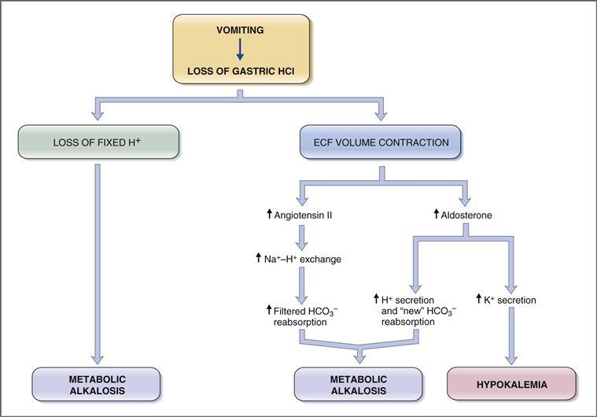

**그림 7-11 구토를 동반한 대사성 알칼리증의 생성과 유지.** ECF, 세포외액.

#### 호흡성 산증

호흡성 산증은 **환기 저하**로 인해 **CO2 저류**가 발생합니다. CO2 저류는 수질호흡중추 억제, 호흡근 마비, 기도 폐쇄, 폐모세혈관과 폐포가스 사이의 CO2 교환 실패 등으로 인해 발생할 수 있습니다([표 7-6](#filepos1609154) 및 [박스] 7-3](#filepos1611394)). 호흡성 산증에서 나타나는 동맥혈 프로필은 다음과 같습니다.

표 7-6 호흡성 산증의 원인

|  |  |  |
| --- | --- | --- |
| **원인** | **예** | **댓글** |
| 수질 호흡 센터의 억제 | 아편제, 바르비투르산염, 마취제 중추신경계 병변 중추수면무호흡증 산소요법 | 말초 화학수용체의 억제 |
| 호흡 근육 장애 | 길랭-바레 증후군, 소아마비, 근위축성측삭경화증(ALS), 다발성 경화증 |  |
| 기도 폐쇄 | 흡인 폐쇄성 수면 무호흡증 후두경련 |  |
| 가스 교환 장애 | 급성 호흡 곤란 증후군(ARDS) 만성 폐쇄성 폐질환(COPD) 폐렴 폐부종 | ↓ 폐모세혈관과 폐포가스의 CO2 교환 |

**상자 7-3 임상 생리학: 만성 폐쇄성 폐질환**

> **사례 설명.** 68세 남성이 40년 동안 하루에 3갑의 담배를 피웠습니다. 그는 아침에 가래, 기침, 호흡곤란(호흡곤란)을 일으킨 병력이 있으며, 천식성 기관지염도 자주 앓았습니다. 그는 미열, 호흡곤란, 천명음으로 병원에 입원했다. 그의 신체 검사 결과 그는 청색증을 앓고 있으며 통 모양의 가슴을 가지고 있는 것으로 나타났습니다. 입원 시 다음 혈액 값을 얻습니다.

> |  |  |
> | --- | --- |
> | **동맥혈** | **정맥혈** |
> | pH, 7.29 | [Na+], 139mEq/L |
> | PCO2, 70mmHg | [Cl−], 95mEq/L |
> | PO2, 54mmHg |  |
> | [HCO3−], 33mEq/L |  |

> **사례 설명.** 천식, 기관지염을 동반한 흡연 이력이 있는 남성은 만성폐쇄성폐질환(COPD)을 시사합니다. 동맥혈 수치는 호흡성 산증과 일치합니다: pH 감소, PCO2 증가, [HCO3−] 증가. 폐쇄성 폐질환이 있는 경우 폐포 환기가 부적절합니다. 따라서 그의 PO2는 54mmHg(정상 PO2, 100mmHg)로 현저히 저하되어 있는데, 이는 폐포가스에서 폐모세혈관으로의 O2 전달이 충분하지 않기 때문입니다. 마찬가지로, 그의 PCO2는 폐모세혈관에서 폐포가스로의 CO2 전달이 충분하지 않기 때문에(즉, 호흡성 산증) 현저하게 상승합니다. [HCO3-]는 대량 활동으로 인해 상승하며, 추가적으로 신장 보상으로 인해 상승합니다.

> 경험적 법칙을 사용하여 신장 보상이 이루어졌는지 여부를 결정할 수 있습니다. 즉, 이 사람이 *급성* 또는 *만성* 호흡성 산증을 앓고 있는지 여부입니다. 호흡성 산증에서 [HCO3−]의 변화는 PCO2의 주어진 변화에 대해 예측된다는 점을 상기하십시오. In this man, the PCO2 is 70 mm Hg, which is 30 mm Hg higher than the normal value of 40 mm Hg. 그의 [HCO3−]는 33mEq/L로 정상 수치인 24mEq/L보다 9mEq/L 높습니다. *HCO3의 증가*−*급성 또는 만성 호흡성 산증과 일치합니까?* PCO2가 30mmHg 증가하는 경우 급성 호흡성 산증에 대한 규칙은 [HCO3−]가 3mEq/L 증가할 것으로 예측합니다. 만성 호흡성 산증의 경우 규칙에 따르면 12mEq/L 증가가 예측됩니다. 따라서 남성의 [HCO3−] 변화는 대상성 만성 호흡성 산증(그는 *만성* 폐 질환 병력이 있음)에 대해 예측된 변화에 더 가깝습니다. [HCO3−]의 변화가 규칙에 의해 예측된 값과 정확하게 일치하지 않기 때문에 두 번째 산-염기 장애가 존재할 수 있으며, 이는 조직 산소 공급 부족으로 인한 젖산증일 수 있습니다.

> 음이온 갭은 11 mEq/L입니다. 음이온 갭 = Na+ − (Cl− + HCO3−) = 139 − 95 − 33 = 11 mEq/L이며 이는 정상 범위 내에 있으며, 젖산증이 존재하더라도 아직 유의미하지 않음을 나타냅니다. 그의 만성 호흡성 산증에 중첩된 젖산산증의 발생에 대해 음이온 갭을 주의 깊게 모니터링해야 합니다.

> **치료.** 남성은 항생제 치료를 받고 폐에 기계 환기를 실시했습니다.

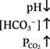

이 혈액 프로필을 생성하기 위해 호흡성 산증이 생성될 때 다음과 같은 일련의 사건이 발생합니다.

1. **CO2 보유.** 환기 부족은 CO2 보유 및 **PCO2 증가**를 유발합니다. 증가된 PCO2는 호흡성 산증의 주요 장애이며, Henderson-Hasselbalch 방정식에 의해 예측된 대로 **pH 감소**(pH = 6.1 + log HCO3−/CO2)를 유발합니다. 대량 활동으로 인해 증가된 PCO2는 또한 HCO3−의 농도를 증가시킵니다.
2. **완충.** 과잉 CO2의 완충은 ICF, 특히 적혈구에서만 발생합니다. 이러한 세포내 완충액을 활용하기 위해 CO2는 세포막을 통해 확산됩니다. 세포 내에서 CO2는 H+와 HCO3-로 변환되고 H+는 세포내 단백질(예: 헤모글로빈)과 유기 인산염에 의해 완충됩니다.
3. **호흡 보상.** 호흡이 이 장애의 *원인*이기 때문에 호흡성 산증에 대한 호흡 보상은 *아닙니다*.
4. **신장 보상.** 호흡성 산증에 대한 신장 보상은 적정산 및 NH4+로 H+ 배설 증가와 새로운 HCO3−의 합성 및 재흡수 증가로 구성됩니다. 새로운 HCO3−의 재흡수는 대량 작용 단독 효과보다 HCO3− 농도를 훨씬 더 증가시킵니다. Henderson-Hasselbalch 방정식은 증가된 HCO3− 농도가 보상 반응인 이유를 이해하는 데 사용될 수 있습니다. 따라서,

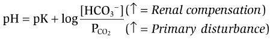

**급성 호흡성 산증**에서는 신장 보상이 아직 발생하지 않았으며 pH가 상당히 낮은 경향이 있습니다(Henderson-Hasselbalch 방정식에서 분모는 증가하지만 분자는 거의 증가하지 않음). 반면에 **만성호흡성산증**에서는 신장 보상이 일어나서 HCO3− 농도가 증가하고 HCO3−/CO2 비율과 pH가 모두 정상화되는 경향이 있습니다. 급성 및 만성 호흡성 산증의 *차이*는 신장 보상에 있습니다. 따라서 신장 보상의 유무에 따라 신장 규칙은 급성 및 만성 호흡성 산증에서 발생하는 HCO3− 농도의 예상 변화에 대해 서로 다른 계산을 제공합니다([표 7-3](#filepos1575195) 참조).

#### 호흡성 알칼리증

호흡성 알칼리증은 **과호흡**으로 인해 발생하며 **과도한 CO2 손실**을 초래합니다. 과호흡은 수질호흡중추의 직접적인 자극, 저산소혈증(말초 화학수용체 자극) 또는 기계적 환기에 의해 발생할 수 있습니다([표 7-7](#filepos1620221)). 호흡성 알칼리증에서 나타나는 동맥혈 프로필은 다음과 같습니다.

**표 7–7 호흡성 알칼리증의 원인**

|  |  |  |
| --- | --- | --- |
| **원인** | **예** | **댓글** |
| 수질호흡센터 자극 | 히스테리성 과호흡 그람 음성 패혈증 살리실산 중독 신경 질환(종양, 뇌졸중) | 또한 대사성 산증을 유발합니다 |
| 저산소증 | 고산성 폐렴; 폐색전증 | 저산소혈증은 말초 화학수용체를 자극합니다 |
| 기계적 환기 |  |  |

이 혈액 프로필을 생성하기 위해 호흡성 알칼리증이 생성될 때 다음과 같은 일련의 사건이 발생합니다.

1. **CO2 손실.** 과호흡은 CO2의 과도한 손실과 **PCO2 감소를 유발합니다.** 감소된 PCO2는 호흡 알칼리증의 주요 장애이며 Henderson-Hasselbalch 방정식에서 예측한 대로 **pH 증가**(pH = 6.1 + log HCO3−/CO2)를 유발합니다. 대량 활동으로 인해 PCO2가 감소하면 HCO3− 농도도 감소합니다.
2. **버퍼링.** 버퍼링은 ICF, 특히 적혈구에서만 발생합니다. 이 경우 CO2는 세포를 떠나 세포 내 pH가 증가합니다.
3. **호흡기 보상.** 호흡성 산증과 마찬가지로 호흡성 알칼리증에도 호흡 보상이 없습니다. 왜냐하면 호흡이 이 장애의 *원인*이기 때문입니다.
4. **신장 보상.** 호흡성 알칼리증에 대한 신장 보상은 적정산인 H+ 및 NH4+의 배설 감소와 새로운 HCO3−의 합성 및 재흡수 감소로 구성됩니다. HCO3-의 재흡수가 감소하면 대량 작용 효과만 있을 때보다 HCO3- 농도가 훨씬 더 감소합니다. Henderson-Hasselbalch 방정식을 사용하면 HCO3− 농도 감소가 보상 반응인 이유를 이해할 수 있습니다.

**급성 호흡성 알칼리증**에서는 신장 보상이 아직 발생하지 않았으며 pH가 상당히 높습니다(Henderson-Hasselbalch 방정식의 분모는 감소하지만 분자는 거의 감소하지 않음). **만성 호흡성 알칼리증**에서는 신장 보상이 발생하여 혈액 중 HCO3− 농도가 더욱 감소하고 HCO3−/CO2 비율과 pH가 모두 정상화되는 경향이 있습니다. 급성 및 만성 호흡성 알칼리증의 차이는 신장 보상에 있습니다. 다시 말하지만, 신장 보상의 유무에 따라 신장 규칙은 급성 및 만성 호흡성 알칼리증에서 HCO3− 농도의 예상 변화에 대해 다른 계산을 제공합니다([표 7-3](#filepos1575195) 참조).

**예제 문제.** 환자의 동맥혈 값은 다음과 같습니다: pH, 7.33; [HCO3-], 36mEq/L; PCO2, 70mmHg. *환자의 산-염기 장애는 무엇입니까? 급성인가요, 만성인가요? 혈액 수치가 단순 또는 혼합 산-염기 장애와 일치합니까?*

**해결책.** pH가 7.33인 환자는 산성혈증입니다. [HCO3-]와 PCO2는 대사성 산증보다는 호흡성 산증과 일치합니다. 일차저호흡으로 인해 PCO2가 상승합니다. (대사성산증인 경우 보상적 과호흡으로 인해 PCO2가 감소합니다.)

호흡성 산증이 급성인지 만성인지는 환자의 값을 산-염기 지도의 범위와 비교하여 판단할 수 있습니다. 산염기 지도를 사용하여 환자가 *만성* 호흡성 산증을 앓고 있다는 결론을 내릴 수 있습니다.

경험 법칙은 또한 PCO2의 변화에 ​​대한 [HCO3-]의 예측 변화를 계산하여 급성 및 만성 호흡성 산증을 구별하는 데 사용될 수 있습니다. 환자의 PCO2는 70mmHg로 정상(정상 PCO2, 40mmHg)보다 30mmHg 높습니다. 보상 반응은 [HCO3−]의 증가입니다. 환자의 [HCO3−]는 36mEq/L로 정상(정상 [HCO3−], 24mEq/L)보다 12mEq/L 높습니다. 그러므로 PCO2의 변화에 ​​대한 [HCO3−]의 변화는 12/30, 즉 0.4mEq/L/mmHg입니다. 보상은 만성 호흡성 산증에 대한 경험 법칙에 따라 정확하게 예측됩니다. 환자는 예상되는 신장 보상 수준과 함께 ***단순* 만성 호흡성 산증**을 앓고 있다는 결론을 내릴 수 있습니다.

### 요약

 매일 대량의 CO2(휘발성산)와 고정산(비휘발성산)이 생성됨에도 불구하고 체액의 pH는 일반적으로 7.4로 유지됩니다. 일정한 pH를 유지하는 메커니즘에는 완충, 호흡 보상, 신장 보상이 포함됩니다.

 버퍼링은 pH 보호의 첫 번째 방어선을 나타냅니다. 완충용액은 약산과 그 짝염기의 혼합물이다. 가장 효과적인 생리학적 완충액의 pK는 7.4에 가깝습니다. 세포외 완충액에는 HCO3−/CO2(가장 중요) 및 HPO4−2/H2PO4−가 포함됩니다. 세포내 완충액에는 유기 인산염과 단백질(예: 디옥시헤모글로빈)이 포함됩니다.

 산-염기 균형의 신장 메커니즘에는 필터링된 HCO3−의 거의 모든 재흡수와 적정 가능한 산 및 NH4+인 H+의 배설이 포함됩니다. 적정산 또는 NH4+로 배설된 각 H+에 대해 하나의 새로운 HCO3−가 합성되어 재흡수됩니다.

 단순한 산-염기 장애는 대사성 질환이나 호흡기 질환으로 인해 발생할 수 있습니다. 대사 장애는 고정된 H+의 증가 또는 손실로 인해 발생하는 [HCO3−]의 주요 교란과 관련됩니다. 고정된 H+가 증가하면 대사성 산증이 발생합니다. 고정된 H+가 손실되면 대사성 알칼리증이 발생합니다. 호흡 장애에는 호흡 저하(호흡성 산증) 또는 과호흡(호흡성 알칼리증)으로 인해 발생하는 PCO2의 일차적 장애가 포함됩니다.

 산-염기 장애에 대한 보상은 호흡기 또는 신장입니다. 일차 장애가 대사 장애인 경우 보상은 호흡 장애입니다. 일차 장애가 호흡 장애인 경우 보상은 신장(대사)입니다.

---

***도전해 보세요***

각 질문에 단어, 구문, 문장 또는 숫자로 답해 보세요. 질문과 함께 가능한 답변 목록이 제공되는 경우 선택 항목 중 하나, 둘 이상 또는 하나도 정답이 아닐 수 있습니다. 책 말미에는 정답이 나와 있습니다.

**[1](CR%21G9RE0KW4PD33Q9F3DXNCSBNXCANP_split_033.html#filepos2295226)** *약산성 "A"의 pK는 5.5이고, 약산성 "B"의 pK는 7.5입니다. pH 7에서 주로 A− 형태인 약산은 무엇입니까?*

**[2](CR%21G9RE0KW4PD33Q9F3DXNCSBNXCANP_split_033.html#filepos2295315)** *사람의 동맥혈의 pH가 7.22이고 PCO2가 20mmHg인 경우 HCO3− 농도는 얼마입니까?*

**[3](CR%21G9RE0KW4PD33Q9F3DXNCSBNXCANP_split_033.html#filepos2295388)** *질문 2에 설명된 사람의 경우 환기가 증가, 감소 또는 변경되지 않았습니까(정상과 비교하여)?*

**[4](CR%21G9RE0KW4PD33Q9F3DXNCSBNXCANP_split_033.html#filepos2295523)** *사람의 동맥혈 pH는 7.25, PCO2는 24mmHg, HCO3−는 10.2mEq/L입니다. 설사, 구토, 폐쇄성 폐질환, 히스테리성 과다호흡, 살리실산염 과다복용, 만성 신부전 등 다음 중 이 패턴을 유발할 수 있는 것은 무엇입니까?*

**[5](CR%21G9RE0KW4PD33Q9F3DXNCSBNXCANP_split_033.html#filepos2295639)** *탄산 탈수효소 억제제, 루프 이뇨제, 티아지드 이뇨제, K+ 보존 이뇨제 중 어떤 종류의 이뇨제가 대사성 알칼리증을 유발합니까?*

**[6](CR%21G9RE0KW4PD33Q9F3DXNCSBNXCANP_split_033.html#filepos2295839)** *다음 혈액 수치를 지닌 환자가 응급실에 나타났습니다: pH, 7.1; HCO3−, 10mEq/L; Na+, 142mEq/L; 및 Cl-, 103mEq/L. 산염기 장애란 무엇이며, 음이온 갭의 값은 무엇입니까?*

**[7](CR%21G9RE0KW4PD33Q9F3DXNCSBNXCANP_split_033.html#filepos2295945)** *삼투압차의 단위는 무엇입니까?*

**[8](CR%21G9RE0KW4PD33Q9F3DXNCSBNXCANP_split_033.html#filepos2296015)** *환기가 저하된 다음 장애가 있는 환자: 설사, 구토, 높은 고도로의 상승, 모르핀 과다복용, 폐색성 폐질환, 고알도스테론증, 에틸렌 글리콜 중독, 살리실산염 중독?*

**[9](CR%21G9RE0KW4PD33Q9F3DXNCSBNXCANP_split_033.html#filepos2296152)** *이러한 이벤트의 올바른 순서는 무엇입니까: Na+-H+ 교환, 사구체 모세혈관을 통한 HCO3− 여과, HCO3− 확산 촉진, H2CO3를 CO2 및 H2O로 전환, H2CO3를 H+로 전환 및 HCO3−, HCO3−를 H2CO3로 변환?*

**[10](CR%21G9RE0KW4PD33Q9F3DXNCSBNXCANP_split_033.html#filepos2296650)** *하루에 25mEq의 H+가 H2PO4−로 배출되고 45mEq의 H+가 NH4+로 배출되면 얼마나 새로운 HCO3−가 합성됩니까?*

**[11](CR%21G9RE0KW4PD33Q9F3DXNCSBNXCANP_split_033.html#filepos2296725)** *두 환자의 동맥 PCO2가 70mmHg 상승했습니다. 하나는 급성 호흡성 산증이고 다른 하나는 만성 호흡성 산증입니다. 어느 환자의 혈중 HCO3−농도가 더 높습니까? 어떤 환자의 pH가 더 높습니까?*

**[12](CR%21G9RE0KW4PD33Q9F3DXNCSBNXCANP_split_033.html#filepos2296928)** *환자의 혈액 값은 다음과 같습니다: pH, 7.22; HCO3−, 18mEq/L; 및 PCO2, 45mmHg. 이러한 값은 단순한 산-염기 장애와 일치합니까? 그렇다면 어느 것입니까? 그렇지 않다면 어떤 산-염기 장애가 있습니까?*

**[13](CR%21G9RE0KW4PD33Q9F3DXNCSBNXCANP_split_033.html#filepos2297040)** *급성 호흡성 알칼리증에서 만성 호흡성 알칼리증으로 전환 시 혈액 pH는 어떻게 되나요?*

**[14](CR%21G9RE0KW4PD33Q9F3DXNCSBNXCANP_split_033.html#filepos2297130)** *소변 pH, 여과된 HPO4−2 부하, 여과된 NH3 부하 중 소변으로 배설된 총 H+를 가장 잘 나타내는 지표는 무엇입니까?*

**[15](CR%21G9RE0KW4PD33Q9F3DXNCSBNXCANP_split_033.html#filepos2297485)** *당뇨병성 케톤산증, 만성 신부전, 구토, 히스테리성 과호흡 등 NH4+ 배설이 가장 높은 상태는 무엇입니까?*

---

#### 선정된 독서

> Cohen JJ, Kassirer JP: 산/염기. 보스턴, 리틀, 브라운, 1982.
>
> Davenport HW: 산-염기 화학의 ABC, 6판. 시카고, 시카고 대학 출판부, 1974.
>
> Rose BD: 산-염기 및 전해질 장애의 임상 생리학, 5판. 뉴욕, 맥그로힐, 2000.
>
> Valtin H, Gennari FJ: 산-염기 장애. 보스턴, 리틀, 브라운, 1987.