# 8 Gastrointestinal Physiology

xml 버전='1.0' 인코딩='utf-8'?

생리학

## *위장 생리학*

> [위장관의 구조](#filepos1637528)

> [위장관의 신경 분포](#filepos1640199)

> [위장 규제 물질](#filepos1650209)

> [운동성](#filepos1675170)

> [비밀](#filepos1710171)

> [소화 및 흡수](CR%21G9RE0KW4PD33Q9F3DXNCSBNXCANP_split_019.html#filepos1785258)

> [장액 및 전해질 수송](CR%21G9RE0KW4PD33Q9F3DXNCSBNXCANP_split_019.html#filepos1829729)

> [간생리학](CR%21G9RE0KW4PD33Q9F3DXNCSBNXCANP_split_019.html#filepos1845905)

> [요약](CR%21G9RE0KW4PD33Q9F3DXNCSBNXCANP_split_019.html#filepos1852548)

> [자신에게 도전하세요](CR%21G9RE0KW4PD33Q9F3DXNCSBNXCANP_split_019.html#filepos1857669)

위장관의 기능은 영양소의 소화와 흡수입니다. 이러한 기능을 수행하기 위해 위장관에는 네 가지 주요 활동이 있습니다. (1) 운동성은 섭취한 음식물을 입에서 직장으로 이동시켜 음식물을 혼합하고 크기를 줄입니다. 음식이 위장관을 통해 이동하는 속도는 소화 및 흡수 시간을 최적화하기 위해 조절됩니다. (2) 타액선, 췌장 및 간에서 분비된 분비물은 위장관 내강에 체액, 전해질, 효소 및 점액을 추가합니다. 이러한 분비물은 소화와 흡수를 더욱 돕습니다. (3) 섭취한 음식은 흡수 가능한 분자로 소화됩니다. (4) 영양소, 전해질, 물이 장 내강에서 혈류로 흡수됩니다.

### 위장관의 구조

위장관은 입, 식도, 위, 소장(십이지장, 공장, 회장 포함), 대장, 항문의 순서로 선형으로 배열되어 있습니다. 위장관의 다른 구조로는 침샘, 췌장, 간 및 담낭이 있으며 모두 분비 기능을 수행합니다.

위장관 벽에는 점막과 장막의 두 표면이 있습니다. **점막** 표면은 내강을 향하고, **장막** 표면은 혈액을 향하고 있습니다([그림 8-1](#filepos1639862)). 위장벽의 층은 다음과 같이 내강에서 시작하여 혈액을 향해 이동합니다. **점막층**은 상피 세포층, 고유판, 점막근층으로 구성됩니다. 상피 세포는 흡수 및 분비 기능을 수행하도록 특화되어 있습니다. 고유판은 주로 결합 조직으로 구성되지만, 혈액과 림프관도 포함합니다. 근육층 점막은 평활근 세포로 구성됩니다. 점막근층의 수축은 상피세포층의 모양과 표면적을 변화시킵니다. 점막층 아래에는 콜라겐, 엘라스틴, 분비선 및 위장관 혈관으로 구성된 **점막하층**이 있습니다. 위장관의 운동성은 점막하층과 장막 사이에 삽입된 평활근의 두 층인 **원형근**과 **세로근**에 의해 제공됩니다. 세로 근육층은 얇고 신경 섬유가 거의 포함되어 있지 않은 반면, 원형 근육층은 두껍고 더 조밀하게 신경 분포되어 있습니다. 뉴런은 위장 평활근 섬유에서 진정한 시냅스를 만들지 않습니다. 오히려 그들은 축삭의 길이를 따라 정맥류로부터 송신기를 방출합니다. 두 개의 신경총인 점막하 신경총과 근육층 신경총은 위장관의 신경계를 포함합니다. **점막하 신경총**(마이스너 신경총)은 점막하층과 원형 근육 사이에 위치합니다. **근막신경얼기**는 원형 근육과 세로 근육 사이에 위치합니다.

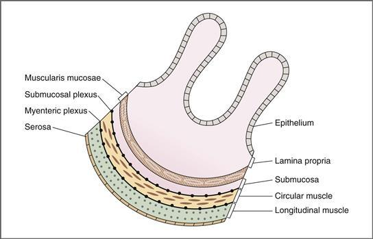

**그림 8-1 위장관 벽의 구조.**

### 위장관의 신경 분포

위장관은 부분적으로 외인성 구성요소와 내인성 구성요소가 있는 **자율신경계**에 의해 조절됩니다. **외인성** 구성 요소는 위장관의 교감 및 부교감 신경 분포입니다. **내인성** 구성 요소를 **장 신경계**라고 합니다. 장 신경계는 위장관 벽의 점막하 신경총과 근육층 신경총 내에 완전히 포함되어 있습니다. 부교감신경계와 교감신경계와 광범위하게 소통합니다.

#### 부교감 신경 분포

부교감 신경 분포는 미주 신경(뇌신경[CN] X)과 골반 신경에 의해 공급됩니다([Chapter 2](CR%21G9RE0KW4PD33Q9F3DXNCSBNXCANP_split_009.html#filepos253561), [Fig. 2-3](CR%21G9RE0KW4PD33Q9F3DXNCSBNXCANP_split_009.html#filepos278026)). 위장관의 부교감 신경 분포 패턴은 그 기능과 일치합니다. **미주 신경**은 식도 상부 1/3의 줄무늬 근육, 위벽, 소장 및 상행 결장을 포함하여 *상부* 위장관에 신경을 공급합니다. **골반 신경**은 외부 항문관의 가로무늬 근육과 횡행결장, 하행결장, 구불결장 벽을 포함하여 *하부* 위장관을 자극합니다.

[2장](CR%21G9RE0KW4PD33Q9F3DXNCSBNXCANP_split_009.html#filepos253561)에서 부교감 신경계에는 표적 기관 *내부 또는 근처*의 신경절에서 시냅스되는 긴 신경절전 섬유가 있다는 사실을 상기하십시오. 위장관에서 이러한 신경절은 실제로 근육층 신경총과 점막하 신경총 내의 기관 벽에 위치합니다. 부교감신경계에서 전달된 정보는 이들 신경총에서 조정되어 평활근, 내분비세포, 분비세포로 전달됩니다([그림 8-2](#filepos1642433) 및 [8-3](#filepos1642976)).

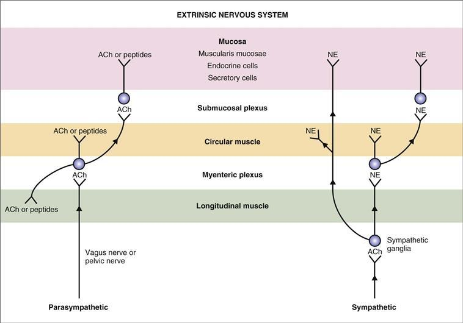

**그림 8-2 위장관의 외인성 신경계.** 부교감 신경계와 교감 신경계의 원심성 뉴런은 근육층 신경총과 점막하 신경총, 평활근 및 점막에서 시냅스를 형성합니다. ACh, 아세틸콜린; NE, 노르에피네프린.

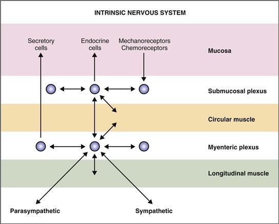

**그림 8-3 위장관의 내인신경계.**

부교감신경계의 신경절후 뉴런은 콜린성 또는 펩티드성으로 분류됩니다. **콜린성 뉴런**은 신경전달물질로 아세틸콜린(ACh)을 방출합니다. **펩티드 뉴런**은 물질 P 및 혈관작용 억제 펩티드(VIP)를 포함한 여러 펩티드 중 하나를 방출합니다. 어떤 경우에는 신경펩타이드가 아직 확인되지 않았습니다.

미주신경은 섬유의 75%가 구심성, 25%가 원심성인 혼합 신경입니다. 구심성 섬유는 말초(예: 위장관 벽의 기계 수용체 및 화학 수용체)에서 중추신경계(CNS)로 감각 정보를 전달합니다. 원심성 섬유는 중추신경계에서 말초의 표적 조직(예: 평활근, 분비세포, 내분비세포)으로 운동 정보를 전달합니다([그림 8-2](#filepos1642433) 참조). 따라서 위장 점막의 기계 수용체와 화학 수용체는 미주 신경을 통해 구심성 정보를 CNS에 전달하고, 이는 원심성 사지가 미주 신경에도 있는 반사를 유발합니다. 구심성 및 원심성 사지 모두가 미주신경에 포함되어 있는 이러한 반사를 **미주주신경 반사**라고 합니다.

#### 교감 신경 분포

교감 신경계의 신경절 이전 섬유는 비교적 짧으며 위장관 *외부* 신경절에서 시냅스를 형성합니다. (위장 벽 *내부* 신경절에서 길고 시냅스되는 부교감 신경계의 신경절 이전 섬유와 대조해 보십시오.) 4개의 교감 신경절이 위장관을 담당합니다: 복강 신경절, 상 장간막 신경절, 하 장간막 신경절, 하복부 신경절([장 참조) 2](CR%21G9RE0KW4PD33Q9F3DXNCSBNXCANP_split_009.html#filepos253561), [그림 2-2](CR%21G9RE0KW4PD33Q9F3DXNCSBNXCANP_split_009.html#filepos264020)). 아드레날린성(노르에피네프린 분비)인 신경절후신경섬유는 이러한 교감신경절과 시냅스를 근장층 신경총과 점막하 신경총의 신경절에 남기거나 평활근, 내분비선, 분비세포에 직접적으로 신경을 분포시킨다([그림 8-2](#filepos1642433) 참조).

교감 신경 섬유의 약 50%는 구심성 신경 섬유이고 50%는 원심성 신경 섬유입니다. 따라서 부교감 신경 분포와 마찬가지로 감각 및 운동 정보는 점막하 신경총과 근육층 신경총에 의해 조정되어 위장관과 CNS 사이에서 앞뒤로 전달됩니다.

#### 내재적 신경 분포

내인성 또는 **장 신경계**는 외인성 신경 분포가 없더라도 위장관의 모든 기능을 지시할 수 있습니다. 장신경계는 근장신경총과 점막하 신경총의 신경절에 위치하며 위장관의 수축, 분비, 내분비 기능을 조절한다([그림 8-3](#filepos1642976) 참조). [그림 8-2](#filepos1642433)에서 볼 수 있듯이, 이들 신경절은 부교감신경계와 교감신경계로부터 입력을 받아 활동을 조절합니다. 이 신경절은 또한 점막의 기계 수용체와 화학 수용체 *로부터 직접 감각 정보를 받고 운동 정보를 평활근, 분비 및 내분비 세포 *로 직접 보냅니다. 정보는 또한 개재뉴런에 의해 신경절 *사이*에 전달됩니다.

장신경계의 뉴런에서는 수많은 신경화학물질, 즉 **신경분비**가 확인되었습니다([표 8-1](#filepos1647393)). 나열된 물질 중 일부는 신경전달물질로 분류되고 일부는 신경조절물질입니다(즉, 신경전달물질의 활성을 *조절*합니다). 장신경계의 대부분의 뉴런은 하나 이상의 신경화학물질을 함유하고 있으며 자극 시 두 개 이상의 신경분비선을 공동분비할 수 있습니다.

**표 8–1 장신경계의 신경전달물질과 신경조절물질**

|  |  |  |
| --- | --- | --- |
| **물질** | **출처** | **작업** |
| 아세틸콜린(ACh) | 콜린성 뉴런 | 벽의 평활근 수축 괄약근 이완 ↑ 타액 분비 ↑ 위 분비 ↑ 췌장 분비 |
| 노르에피네프린(NE) | 아드레날린성 뉴런 | 벽의 평활근 이완 괄약근 수축 ↑ 타액분비 |
| 혈관활성 장 펩타이드(VIP) | 점막과 평활근의 뉴런 | 평활근 이완 ↑ 장분비 ↑ 췌장분비 |
| 가스트린 방출 펩타이드(GRP) 또는 봄베신 | 위점막의 뉴런 | ↑ 가스트린 분비 |
| 엔케팔린(아편제) | 점막과 평활근의 뉴런 | 평활근 수축 ↓ 장분비 |
| 신경펩타이드 Y | 점막과 평활근의 뉴런 | 평활근 이완 ↓ 장분비 |
| 물질 P | ACh와 함께 분비됨 | 평활근 수축 ↑ 타액분비 |

### 위장관 규제 물질

호르몬, 신경분비, 측분비를 포함한 위장관 펩타이드는 위장관 기능을 조절합니다. 이러한 기능에는 평활근 벽과 괄약근의 수축과 이완이 포함됩니다. 소화를 위한 효소 분비; 체액 및 전해질 분비; 및 위장관 조직에 대한 영양(성장) 효과. 또한 일부 위장 펩타이드는 *다른* 위장 펩타이드의 분비를 조절합니다. 예를 들어, 소마토스타틴은 모든 위장 호르몬의 분비를 억제합니다.

#### 위장관 펩타이드의 특성

위장 펩티드는 호르몬, 측분비 또는 신경분비로 분류됩니다. 펩타이드가 내분비세포에서 방출되는지, 위장관 신경세포에서 방출되는지와 펩타이드가 표적 세포에 도달하는 경로에 따라 명칭이 부여됩니다([그림 8-4](#filepos1651422)).

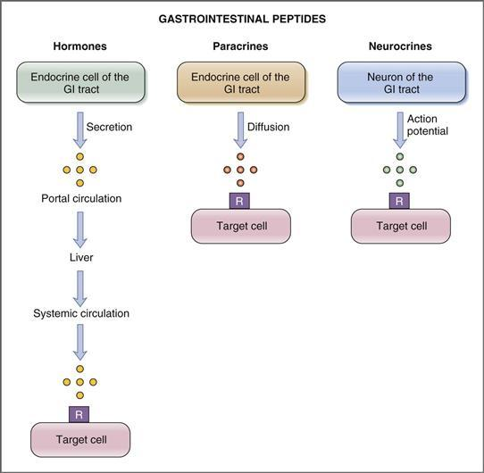

**그림 8-4 호르몬, 측분비 또는 신경분비로 위장관 펩타이드 분류.** GI, 위장; R, 수용체.

 **호르몬**은 위장관 내분비 세포에서 분비되는 펩타이드입니다. 이들은 문맥 순환계로 분비되어 간을 통과하여 전신 순환계로 들어갑니다. 그런 다음 전신 순환은 해당 호르몬 수용체가 있는 표적 세포에 호르몬을 전달합니다. 표적 세포는 위장관 자체에 위치할 수 있거나(예를 들어, 가스트린은 위의 벽 세포에 작용하여 산 분비를 유발함), 표적 세포는 신체의 다른 곳에 위치할 수 있습니다(예를 들어, 위 억제 펩타이드는 췌장의 베타[β] 세포에 작용하여 인슐린 분비를 유발함). 위장 점막의 내분비 세포는 샘에 집중되어 있지 않고 단일 세포 또는 넓은 영역에 분산된 세포 그룹입니다. 네 가지 위장 펩타이드는 가스트린, 콜레시스토키닌(CCK), 세크레틴, 포도당 의존성 인슐린 친화 펩타이드(또는 위 억제 펩타이드, GIP) 등 호르몬으로 분류됩니다.

 **파라크린**은 호르몬과 마찬가지로 위장관의 내분비 세포에서 분비되는 펩타이드입니다. 그러나 호르몬과는 대조적으로 측분비(paracrine)는 호르몬을 분비하는 동일한 조직 내에서 *국소적으로* 작용합니다. 측분비 물질은 간질액을 통해 짧은 거리를 확산시켜 표적 세포에 도달하거나 모세혈관을 통해 짧은 거리로 운반됩니다. 따라서 물질이 측분비 작용을 하기 위해서는 분비 부위가 작용 부위로부터 *짧은 거리* 떨어져 있어야 합니다. 측분비 기능이 알려진 주요 위장 펩타이드는 위장관 전반에 걸쳐 억제 작용을 하는 소마토스타틴입니다. (또 다른 위장 분비물인 히스타민은 펩타이드가 아닙니다.)

  **Neurocrines** are substances that are synthesized in neurons of the gastrointestinal tract and released following an action potential. 방출된 후 뉴로크린은 시냅스를 통해 확산되어 표적 세포에 작용합니다. 위장관의 신경분비 물질로는 ACh, 노르에피네프린, 혈관활성 장펩타이드(VIP), 가스트린 방출 펩타이드(GRP) 또는 봄베신, 엔케팔린, 뉴로펩타이드 Y, 물질 P 등이 있다. 이들 물질의 출처와 작용은 [표 8-1](#filepos1647393)에 정리되어 있다.

#### 위장 호르몬

물질이 위장 호르몬으로 자격을 갖추려면 몇 가지 기준을 충족해야 합니다. (1) 물질은 생리적 자극에 반응하여 분비되어야 하며 혈류를 통해 먼 곳으로 운반되어 생리적 작용을 생성해야 합니다. (2) 그 기능은 어떤 신경 활동과도 독립적이어야 합니다. (3) 분리, 정제, 화학적 확인, 합성이 이루어져야 합니다. 이러한 엄격한 기준을 적용한 후에는 가스트린, CCK, 세크레틴, GIP 등 4가지 물질만 위장 호르몬으로 인정됩니다. 또한, 모틸린, 췌장 폴리펩티드, 장글루카곤을 포함한 여러 후보 호르몬이 기준의 전부는 아니지만 일부를 충족합니다.

[표 8-2](#filepos1655541)에는 호르몬군, 분비 부위, 분비 자극제 및 생리적 작용과 관련하여 4가지 "공식" 위장 호르몬이 설명되어 있습니다. 운동성, 분비 및 흡수에 관한 장 후반부의 논의를 위한 참고 자료로 [표 8-2](#filepos1655541)를 사용하십시오.

**표 8–2 위장 호르몬 요약**

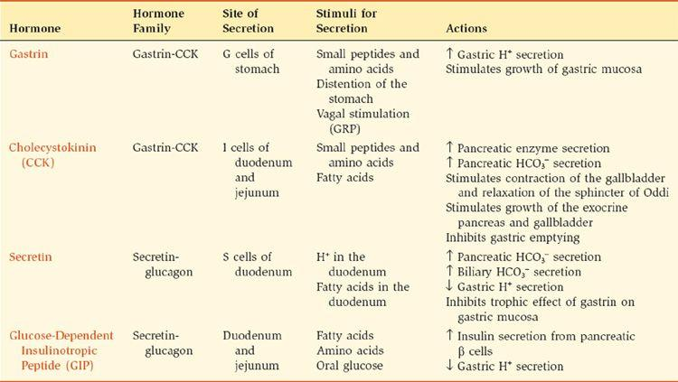

GRP, 가스트린 방출 펩타이드.

##### *가스트린*

가스트린의 기능은 위벽 세포에 의한 **수소 이온**(**H+**) **분비**를 촉진하도록 조정됩니다. 17개의 아미노산으로 구성된 직쇄 펩타이드인 가스트린은 위 전정부의 G(가스트린) 세포에서 분비됩니다. G17 또는 "*작은*" *가스트린*이라고 불리는 17개 아미노산 형태의 가스트린은 식사에 반응하여 분비되는 가스트린의 형태입니다. G34 또는 "*큰*" *가스트린*이라고 불리는 34개 아미노산 형태의 가스트린은 소화 간 기간(식사 사이)에 분비됩니다. 따라서 소화간 기간 동안 혈청 가스트린의 대부분은 G34 형태로 존재하며 낮은 기초 수준으로 분비됩니다. 식사를 섭취하면 G17이 분비됩니다. G34는 G17의 이량체가 *아닙니다*. G17도 G34에서 형성되지 않습니다. 오히려, 가스트린의 각 형태는 자체 전구체인 프로가스트린 분자로 시작하는 자체 생합성 경로를 가지고 있습니다.

가스트린의 생물학적 활성에 필요한 최소 단편은 **C-말단 테트라펩타이드**입니다([그림 8-5](#filepos1657535)). (C 말단 페닐알라닌에는 NH2 그룹이 포함되어 있으며 이는 단순히 페닐알라미드임을 의미합니다.) C 말단 테트라펩타이드는 활성에 필요한 최소 단편이지만 여전히 전체 가스트린 분자만큼 활성이 6분의 1에 불과합니다.

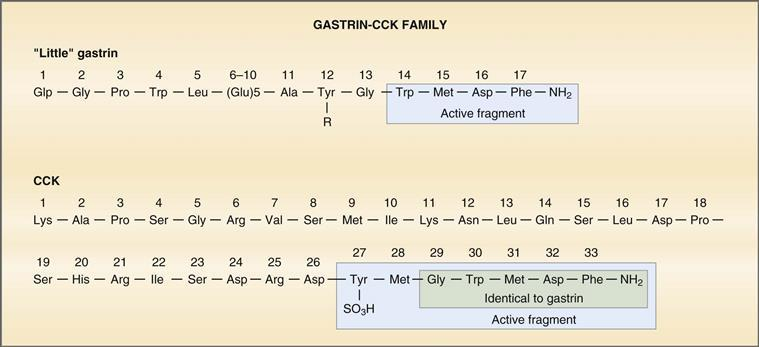

**그림 8–5 인간 가스트린과 돼지 콜레시스토키닌(CCK)의 구조.** *파란색 음영 상자*는 최소한의 생물학적 활동에 필요한 조각을 보여줍니다. *녹색 음영 상자*는 가스트린과 동일한 CCK 분자 부분을 나타냅니다. Glp, 피로글루타밀 잔기.

 **가스트린의 분비.** 식사를 하면 위의 전정부에 위치한 **G세포**에서 가스트린이 분비됩니다. 가스트린 분비를 시작하는 생리적 자극은 모두 음식 섭취와 관련이 있습니다. 이러한 자극에는 단백질 소화 생성물(예: 작은 펩타이드 및 아미노산), ​​음식에 의한 위 팽창, 미주신경 자극이 포함됩니다. 단백질 소화 산물 중 아미노산인 페닐알라닌과 트립토판은 가스트린 분비를 위한 가장 강력한 자극제입니다. 국소 미주신경 반사도 가스트린 분비를 자극합니다. 이러한 국소 반사에서 미주 신경 말단에서 G 세포로 방출되는 신경분비 물질은 **가스트린 방출 펩타이드**(**GRP**)**,** 또는 봄베신입니다. 이러한 긍정적인 자극 외에도, 위 내용물의 낮은 pH와 소마토스타틴에 의해 가스트린 분비가 *억제*됩니다.

 **가스트린의 작용.** 가스트린은 두 가지 주요 작용을 합니다: (1) 위 벽세포에 의한 **H+ 분비**를 자극하고, (2) 영양 효과인 **위 점막의 성장**을 자극합니다. 가스트린의 생리학적 작용은 가스트린 과잉 또는 결핍 상태에서 잘 설명됩니다. 예를 들어, 가스트린 분비 종양(졸링거-엘리슨 증후군)이 있는 사람의 경우 H+ 분비가 증가하고 가스트린의 영양 효과로 인해 위 점막이 비대해집니다. 반대로, 위 유문을 절제한 사람(가스트린의 공급원인 G 세포 제거)에서는 H+ 분비가 감소하고 위 점막이 위축됩니다.

 **졸링거-엘리슨 증후군**은 일반적으로 비β세포 췌장에서 발생하는 가스트린 분비 종양 또는 **가스트린종**에 의해 발생합니다. 졸링거-엘리슨 증후군의 징후와 증상은 모두 가스트린의 높은 순환 수준에 기인합니다: 벽세포에 의한 H+ 분비 증가, 위 점막 비대(가스트린의 영양 효과), 그리고 끊임없는 H+ 분비로 인한 **십이지장 궤양**. H+ 분비가 증가하면 장 내강이 산성화되어 지방 소화에 필요한 효소인 췌장 리파아제가 비활성화됩니다. 그 결과, 식이 지방이 적절하게 소화되거나 흡수되지 않고 지방이 대변으로 배설됩니다**(지방변).** 졸링거-엘리슨 증후군의 치료에는 H2 수용체 차단 약물(예: **시메티딘**)의 투여가 포함됩니다. H+ 펌프 억제제(예: **오메프라졸**) 투여; 종양 제거; 또는 최후의 수단으로 가스트린의 표적 조직을 제거하는 위 절제술이 있습니다.

##### *콜레시스토키닌*

콜레시스토키닌(CCK)의 기능은 **지방 소화 및 흡수**를 촉진하기 위해 조화롭게 작용합니다. CCK는 33개의 아미노산으로 구성된 펩타이드로 구조적으로 가스트린과 관련이 있으며 “가스트린-CCK 계열”에 속합니다([그림 8-5](#filepos1657535) 참조). C-말단 5개 아미노산(CCK-5)은 가스트린의 아미노산과 동일하며 가스트린 활성에 최소한으로 필요한 테트라펩타이드를 포함합니다. 따라서 CCK에는 *일부* 가스트린 활성이 있습니다. CCKA 수용체는 CCK에 대해 선택적인 반면, CCKB 수용체는 CCK와 가스트린에 똑같이 민감합니다. 생물학적 활성에 필요한 CCK의 최소 단편은 **C 말단 헵타펩타이드**(7개 아미노산[CCK-7])입니다.

CCK는 두 가지 유형의 생리적 자극, 즉 (1) 모노글리세리드 및 지방산(트리글리세리드 제외) 및 (2) 작은 펩타이드 및 아미노산에 반응하여 십이지장 및 공장 점막의 **I 세포**에서 분비됩니다. 이러한 자극은 I 세포에 소화 및 흡수되어야 하는 지방과 단백질이 포함된 식사가 있음을 알려줍니다. 그런 다음 CCK는 적절한 췌장 효소와 담즙염이 분비되어 이러한 소화와 흡수를 돕습니다.

**CCK의 다섯 가지 주요 작용**이 있으며, 각각은 지방, 단백질, 탄수화물의 소화 및 흡수의 전반적인 과정에 기여합니다.

 **담낭의 수축**과 오디 괄약근의 동시 이완은 담낭에서 소장의 내강으로 담즙을 배출합니다. 담즙은 식이 지질의 유화 및 용해에 필요합니다.

 **췌장 효소의 분비.** 췌장 리파아제는 섭취된 지질을 지방산, 모노글리세리드 및 콜레스테롤로 소화하며 모두 흡수될 수 있습니다. 췌장 아밀라아제는 탄수화물을 소화하고, 췌장 프로테아제는 단백질을 소화합니다.

 **췌장에서 중탄산염(HCO3−) 분비.** 이는 CCK의 주요 효과는 아니지만 세크레틴이 HCO3 분비에 미치는 영향을 강화합니다**−**.

 **외분비 췌장과 담낭의 성장.** CCK의 주요 표적 기관은 외분비 췌장과 담낭이므로 CCK도 이들 기관에 영양 영향을 미치는 것이 논리적입니다.

 **위 배출 억제.** CCK는 위 배출을 억제하거나 느리게 하며 *위 배출 시간을 증가시킵니다.* 이 작용은 상당한 시간이 필요한 지방 소화 및 흡수 과정에 매우 중요합니다. CCK는 차임(부분적으로 소화된 음식)이 위에서 소장으로 전달되는 속도를 늦춰 후속 소화 및 흡수 단계에 적절한 시간을 보장합니다.

##### *비밀*

27개의 아미노산으로 구성된 펩타이드인 세크레틴(Secretin)은 구조적으로 글루카곤과 상동성을 가지며 세크레틴-글루카곤 계열에 속한다([그림 8-6](#filepos1665119)). 세크레틴의 27개 아미노산 중 14개는 글루카곤과 동일하고 동일한 위치에 있습니다. 활성 단편을 갖고 있는 가스트린과 CCK와는 대조적으로, 세크레틴의 27개 아미노산은 모두 생물학적 활성에 필요합니다. 활동을 위해서는 전체 세크레틴 분자가 3차 구조인 α 나선으로 접혀야 합니다.

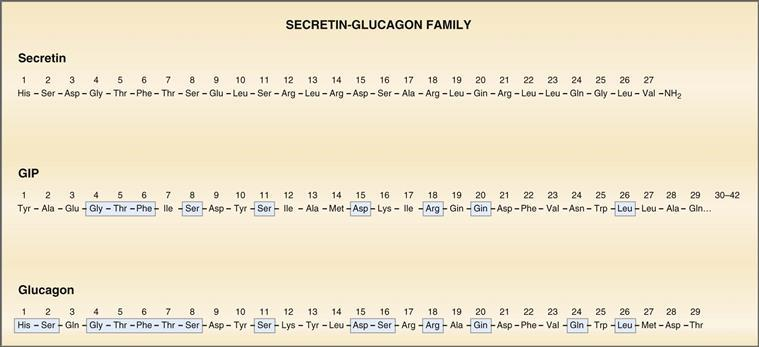

**그림 8-6 세크레틴, 포도당 의존성 인슐린 친화 펩타이드(GIP) 및 글루카곤의 구조.** *파란색 음영 조각*(아미노산)은 세크레틴과 상동성인 GIP 및 글루카곤 부분을 보여줍니다.

세크레틴은 소장 내강의 H+ 및 지방산에 반응하여 십이지장의 **S 세포**(세크레틴 세포)에서 분비됩니다. 따라서 세크레틴의 분비는 산성 위 내용물(pH < 4.5)이 소장에 도착할 때 시작됩니다.

세크레틴의 기능은 **췌장 및 담즙의 HCO3− 분비**를 촉진하여 소장 내강에서 H+를 중화시키는 것입니다. H+의 중화는 지방 소화에 필수적입니다. 췌장 리파아제의 최적 pH는 6~8이며, pH가 3 미만이면 비활성화되거나 변성됩니다. 세크레틴은 또한 가스트린이 벽세포에 미치는 영향(H+ 분비 및 성장)을 억제합니다.

##### *포도당 의존성 인슐린 친화성 펩타이드*

42개의 아미노산으로 이루어진 펩타이드인 포도당 의존성 인슐린분비펩타이드(GIP)도 세크레틴-글루카곤 계열의 구성원이다([그림 8-6](#filepos1665119) 참조). GIP에는 세크레틴과 공통으로 9개의 아미노산이 있고 글루카곤과 공통으로 16개의 아미노산이 있습니다. 이러한 상동성으로 인해 GIP의 약리학적 수준은 세크레틴의 작용 대부분을 생성합니다.

GIP는 십이지장과 공장점막의 K세포에서 분비됩니다. 이는 포도당, 아미노산 및 지방산의 세 가지 유형의 영양소 모두에 반응하여 분비되는 유일한 위장 호르몬입니다.

GIP의 주요 생리학적 작용은 췌장 β 세포에 의한 **인슐린 분비 자극**입니다. 이러한 작용으로 인해 **인크레틴**(즉, 인슐린 분비를 촉진하는 위장 호르몬)으로 분류됩니다. 이 작용은 경구 포도당 부하가 동등한 정맥 내 포도당 부하보다 세포에서 더 빠르게 활용된다는 관찰을 설명합니다. 경구 포도당은 GIP 분비를 자극하여 인슐린 분비를 자극합니다(베타 세포에 흡수된 포도당의 직접적인 자극 작용에 더해). 정맥 내로 투여된 포도당은 β 세포에 대한 직접적인 작용에 의해서만 인슐린 분비를 자극합니다. GIP의 다른 작용으로는 **위 H+ 분비 억제** 및 위 배출 억제가 있습니다.

##### *후보 호르몬*

후보 또는 추정 호르몬도 위장관에서 분비됩니다. 이는 "공식" 위장 호르몬으로 분류되는 데 필요한 기준 중 하나 이상을 충족하지 못하기 때문에 *후보* 호르몬으로 간주됩니다.

**모틸린**은 22개의 아미노산으로 구성된 펩타이드로 가스트린-CCK 계열이나 세크레틴-글루카곤 계열에 속하지 않습니다. 공복 상태에서는 십이지장 상부에서 분비됩니다. 모틸린은 위장 운동성을 증가시키고 특히 90분 간격으로 발생하는 **소화간 근전 복합체**를 시작하는 것으로 알려져 있습니다.

**췌장 폴리펩티드**는 탄수화물, 단백질 또는 지질 섭취에 반응하여 췌장에서 분비되는 36개 아미노산으로 구성된 펩티드입니다. 췌장 폴리펩티드는 췌장의 HCO3- 및 효소 분비를 억제하지만 생리학적 역할은 불확실합니다.

**엔테로글루카곤**은 혈당 농도 감소에 반응하여 장 세포에서 방출됩니다. 그런 다음 간에 글리코겐분해와 포도당신생합성을 증가시키도록 지시합니다.

**글루카곤 유사 펩타이드-1(GLP-1)**은 프로글루카곤의 선택적 절단으로 생성됩니다. 소장의 L세포에서 합성되어 분비됩니다. GIP와 마찬가지로 GLP-1은 췌장 베타 세포의 수용체에 결합하여 **인슐린 분비를 자극**하기 때문에 **인크레틴**으로 분류됩니다. 보완 작용으로 글루카곤 분비를 억제하고, 포도당과 같은 분비 촉진제에 대한 췌장 베타 세포의 민감성을 증가시키며, 위 배출을 감소시키고, 식욕을 억제합니다(즉, 포만감을 증가시킵니다). 이러한 이유로 GLP-1 유사체는 제2형 당뇨병의 가능한 치료법으로 간주되어 왔습니다.

#### 파라크린

위장 호르몬과 마찬가지로 파라크린도 위장관의 내분비 세포에서 합성됩니다. 측분비(paracrine)는 전신 순환계로 들어가지 않고 *국소적으로 작용*하여 짧은 거리에 확산되어 표적 세포에 도달합니다.

**소마토스타틴**은 내강 pH 감소에 반응하여 위장 점막의 D 세포(내분비 및 측분비 모두)에서 분비됩니다. 차례로, 소마토스타틴은 다른 위장 호르몬의 분비를 *억제*하고 위 H+ 분비를 *억제*합니다. 위장관의 이러한 측분비 기능 외에도 소마토스타틴은 시상하부와 내분비 췌장의 델타(δ) 세포에서 분비됩니다.

**히스타민**은 위장 점막의 내분비형 세포, 특히 위의 H+ 분비 영역에서 분비됩니다. 히스타민은 가스트린 및 ACh와 함께 위벽 세포의 H+ 분비를 자극합니다.

#### 신경분비

신경분비는 위장 뉴런의 세포체에서 합성됩니다. 뉴런의 활동 전위는 신경분비의 방출을 유발하며, 이는 시냅스를 통해 확산되어 시냅스후 세포의 수용체와 상호작용합니다.

[표 8-1](#filepos1647393)은 ACh 및 노르에피네프린과 같은 비펩티드와 VIP, GRP, 엔케팔린, 신경펩티드 Y 및 물질 P와 같은 펩티드를 포함하는 신경분비에 대한 요약을 제시합니다. 가장 잘 알려진 신경분비에는 ACh(콜린성 뉴런에서 분비됨)와 노르에피네프린(아드레날린성 뉴런에서 분비됨)이 있습니다. 다른 신경분비는 신경절후 *비콜린성* 부교감 뉴런(펩티드성 뉴런이라고도 함)에서 방출됩니다.

#### 포만감

식욕과 식사 행동을 조절하는 중추는 시상하부에 위치해 있습니다. 음식이 있어도 식욕을 억제하는 **포만중추**는 시상하부의 복내측핵(VPN)에 위치하고 **섭식중추**는 시상하부 외측영역(LHA)에 위치합니다. 정보는 시상하부의 **활형핵**에서 이러한 센터로 공급됩니다.

아치형 핵에는 포만감 공급 센터로 돌출되는 다양한 뉴런이 있습니다. **거식증 뉴런**은 프로오피오멜라노코르틴(POMC)을 방출하여 식욕 감소를 유발합니다. **욕식성 뉴런**은 신경펩타이드 Y를 방출하여 식욕을 증가시킵니다. 다음 물질은 궁상핵의 식욕부진 및 식욕부진 뉴런에 영향을 미치고, 그에 따라 식욕 및 섭식 행동을 감소 또는 증가시킵니다.

 **렙틴.** 렙틴은 지방 조직에 저장된 지방의 양에 비례하여 **지방 세포**에서 분비됩니다. 따라서 렙틴은 체지방 수준을 감지하여 순환계로 분비되고 혈액뇌관문을 통과하여 시상하부 궁형핵의 뉴런에 작용합니다. 이는 식욕부진 뉴런을 자극하고 식욕부진 뉴런을 억제하여 **식욕을 감소**시키고 에너지 소비를 증가시킵니다. 렙틴은 저장된 체지방을 감지하므로 식욕을 감소시키는 만성(장기적) 효과가 있습니다.

 **인슐린.** 인슐린은 식욕부진 뉴런을 자극하고 식욕부진 뉴런을 억제하여 식욕을 감소시킨다는 점에서 렙틴과 유사한 작용을 합니다. 렙틴과 달리 인슐린 수치는 낮 동안 변동하므로 식욕을 감소시키는 급성(단기) 효과가 있습니다.

 **GLP-1.** 앞에서 설명한 것처럼 GLP-1은 장 L 세포에서 합성되고 분비됩니다. 렙틴이나 인슐린과 같은 작용 중 식욕을 감소시킵니다.

 **그렐린.** 그렐린은 식사 직전에 **위세포**에서 분비됩니다. 이는 렙틴 및 인슐린과 반대로 작용하여 식욕 부진 뉴런을 자극하고 식욕 부진 뉴런을 억제하여 **식욕을 증가**하고 음식 섭취를 증가시킵니다. 기아와 체중 감소 기간은 그렐린 분비를 강력하게 자극합니다.

 **펩타이드 YY(PYY).** PYY는 식사 후 장 L 세포에서 분비됩니다. 시상하부에 직접적인 영향을 미치고 그렐린 분비를 억제함으로써 식욕을 감소시키는 역할을 합니다.

### 운동성

운동성은 위장관의 벽과 괄약근의 수축과 이완을 나타내는 일반적인 용어입니다. 운동성은 섭취한 음식을 분쇄하고 혼합하고 조각내어 소화 및 흡수를 준비한 다음 위장관을 따라 음식을 추진합니다.

위장관의 모든 수축 조직은 인두, 식도의 상부 1/3 및 외부 항문 괄약근(횡문근)을 제외하고는 모두 평활근입니다. 위장관의 평활근은 **단일 평활근**으로, 여기서 세포는 **간극 접합**이라는 저저항 경로를 통해 전기적으로 연결됩니다. 간극 접합은 조화롭고 원활한 수축을 제공하는 활동 전위의 빠른 세포 간 확산을 허용합니다.

위장관의 원형 근육과 세로 근육은 서로 다른 기능을 가지고 있습니다. **원형 근육**이 수축하면 평활근 고리가 짧아지고 이로 인해 해당 부분의 직경이 줄어듭니다. **세로 근육**이 수축하면 세로 방향으로 짧아져 해당 부분의 길이가 줄어듭니다.

위장 평활근의 수축은 위상성 또는 강장성일 수 있습니다. **단계적 수축**은 주기적인 수축과 이완이 뒤따르는 것입니다. 위상 수축은 식도, 위 유문 및 소장, 혼합 및 추진에 관여하는 모든 조직에서 발견됩니다. **강장성 수축**은 정기적인 이완 기간 없이도 일정한 수준의 수축이나 긴장을 유지합니다. 이는 위의 구강(상부) 부위와 하부 식도, 회장맹장 및 내부 항문 괄약근에서 발견됩니다.

#### 느린 파도

모든 근육과 마찬가지로 위장 평활근의 수축은 전기 활동, 즉 활동 전위가 선행됩니다. 느린 파동은 위장 평활근의 전기적 활동의 독특한 특징입니다. 느린파는 *활동전위가 아니라* 오히려 평활근 세포의 막전위의 **진동하는 탈분극과 재분극**입니다([그림 8-7](#filepos1678517)). 서파의 탈분극 단계에서는 막 전위가 덜 음수가 되고 역치 쪽으로 이동합니다. 재분극 단계에서 막전위는 더욱 음이 되고 역치에서 멀어집니다. 서파의 안정기 또는 최고점에서 막 전위가 역치까지 탈분극되면 활동 전위가 서파 "위에" 발생합니다. 예를 들어, [그림 8-7](#filepos1678517)에 표시된 느린 파동은 임계값에 도달하여 고원에서 6개의 활동 전위가 폭발하게 됩니다. 다른 유형의 근육과 마찬가지로 기계적 반응(수축 또는 장력)은 전기적 반응을 따릅니다. [그림 8-7](#filepos1678517)에서 활동전위가 터진 직후에 수축 또는 장력이 발생하는 것을 알 수 있습니다.

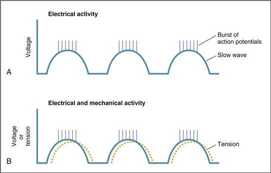

**그림 8-7 활동 전위와 수축이 중첩된 위장관의 느린 파동.** 활동 전위의 폭발 후에는 수축이 일어납니다. **A,** 전기 활동; **B,** 전기적 및 기계적 활동.

 **느린 파도의 빈도.** 느린 파도의 고유 속도 또는 빈도는 위장관을 따라 분당 3~12개의 느린 파도로 다양합니다. 위장관의 각 부분은 특징적인 빈도를 가지고 있으며, 위장의 속도가 가장 낮고(분당 느린 파도 3회), 십이지장의 속도가 가장 높습니다(분당 느린 파도 12번). 느린 파동의 빈도는 활동 전위의 빈도를 설정하므로 수축 빈도를 설정합니다. (서파가 막 전위를 역치까지 가져오지 않으면 활동 전위가 발생할 수 없습니다.) 비록 신경 활동과 호르몬 활동이 활동 전위 생성과 수축 강도를 모두 조절하더라도 느린 파동의 특징적인 주파수는 신경이나 호르몬 입력에 영향을 받지 않습니다.

 **느린 파동의 기원.** 느린 파동은 근육층 신경총에 풍부한 **카잘 간질 세포**에서 발생한다고 믿어집니다. 순환적 탈분극 및 재분극은 Cajal의 간질 세포에서 자발적으로 발생하며 낮은 저항 간극 접합을 통해 인접한 평활근으로 빠르게 퍼집니다. 동방결절이 심장의 박동조율기인 것처럼 Cajal의 간질세포는 위장 평활근의 **박동조율기**로 간주될 수 있습니다. 위장관의 각 영역에서 심박조율기는 활동 전위와 수축이 발생할 수 있는 속도를 결정하는 느린 파동의 빈도를 구동합니다.

 **느린 파동의 메커니즘.** 서파의 탈분극 단계는 칼슘(Ca2+) 채널의 주기적 개방으로 인해 발생하며, 이는 세포막을 탈분극시키는 내부 Ca2+ 전류를 생성합니다. 서파의 안정기 동안 Ca2+ 채널이 열리고 탈분극 수준에서 막 전위를 유지하는 내부 Ca2+ 전류가 생성됩니다. 서파의 재분극 단계는 칼륨(K+) 채널이 열리면서 발생하며, 이는 세포막을 재분극하는 외부 K+ 전류를 생성합니다.

 **서파, 활동 전위 및 수축의 관계.** 위장 평활근에서는 역치 이하의 서파라도 약한 수축을 생성합니다. 따라서 활동전위가 발생하지 않아도 평활근은 완전히 이완되지 않고 기저수축, 즉 **강장성 수축**을 나타냅니다. 그러나 느린 파동이 막전위를 역치까지 탈분극시키면 느린 파동 위에 활동전위가 발생하고 이어서 훨씬 더 강한 수축, 즉 **상성 수축**이 뒤따릅니다. 느린 파동 위에 있는 활동전위의 수가 많을수록 위상성 수축도 커집니다. 골격근(각 활동 전위 다음에 별도의 수축 또는 경련이 뒤따름)과 달리, 평활근에서는 개별 활동 전위에 별도의 경련이 뒤따르지 않습니다. 대신, 경련은 하나의 긴 수축으로 합쳐집니다([그림 8-7*B*](#filepos1678517) 참조).

#### 씹고 삼키는 행위

씹고 삼키는 것은 섭취한 음식이 소화와 흡수를 위해 준비되는 과정의 첫 번째 단계입니다.

##### *씹는*

씹는 기능에는 세 가지 기능이 있습니다. (1) 음식을 타액과 혼합하고 윤활하여 삼키는 것을 용이하게 합니다. (2) 음식 입자의 크기를 줄여 삼키는 것을 용이하게 합니다(삼킨 입자의 크기는 소화 과정에 영향을 미치지 않지만). (3) 섭취한 탄수화물을 타액 아밀라아제와 혼합하여 탄수화물 소화를 시작합니다.

씹는 행위에는 자발적인 요소와 비자발적인 요소가 모두 있습니다. 불수의적 요소에는 입안의 음식에 의해 시작되는 반사가 포함됩니다. 감각 정보는 입에 있는 기계 수용체에서 **뇌간**으로 전달되어 씹는 것과 관련된 근육의 활동 반사 진동 패턴을 조율합니다. 자발적인 씹기는 언제든지 비자발적 또는 반사적 씹기를 무시할 수 있습니다.

##### *삼키는*

삼키는 것은 입안에서 자발적으로 시작되지만 이후에는 불수의적이거나 반사적으로 조절됩니다. 반사 부분은 **수질**에 위치한 **연하 센터**에 의해 제어됩니다. 감각 정보(예: 입 안의 음식)는 인두 근처에 위치한 체성 감각 수용체에 의해 감지됩니다. 이 감각 또는 구심성 정보는 미주 신경과 설인두 신경을 통해 연수 연하 중추로 전달됩니다. 수질은 감각 정보를 조정하고 모터 또는 원심성 출력을 인두 및 상부 식도의 가로무늬근으로 보냅니다([그림 8-8](#filepos1684485)).

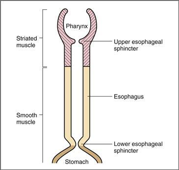

**그림 8-8 상부 위장관의 구조.** 인두, 상부 식도 괄약근 및 식도의 상부 1/3은 줄무늬 근육으로 구성됩니다. 식도 하부 2/3와 하부 식도 괄약근은 평활근으로 구성되어 있습니다.

삼킴에는 구강, 인두, 식도의 세 단계가 포함됩니다. 구강 단계는 자발적이고 인두 및 식도 단계는 반사에 의해 제어됩니다.

 **구강 단계.** 구강 단계는 혀가 높은 밀도의 체성감각 수용체를 포함하는 인두쪽으로 음식 덩어리를 밀어낼 때 시작됩니다. 이전에 언급한 바와 같이, 이들 수용체의 활성화는 수질에서 비자발적인 삼키기 반사를 시작합니다.

 **인두 단계.** 인두 단계의 목적은 다음 단계에 따라 음식물 덩어리를 입에서 인두를 통해 식도로 추진하는 것입니다. (1) 연구개를 위쪽으로 당겨 음식물이 인두로 이동할 수 있는 좁은 통로를 만들어 음식물이 비인두로 역류할 수 없도록 합니다. (2) 후두개는 후두로 통하는 구멍을 덮기 위해 움직이고, 후두는 후두개에 맞서 위쪽으로 움직여 음식이 기관으로 들어가는 것을 방지합니다. (3) 상부 식도 괄약근이 이완되어 음식이 인두에서 식도로 통과할 수 있습니다. (4) 연동 수축 파동이 인두에서 시작되어 열린 괄약근을 통해 음식을 추진합니다. 삼키는 인두 단계에서는 호흡이 억제됩니다.

 **식도 단계.** 삼키는 식도 단계는 부분적으로는 삼킴 반사에 의해, 부분적으로는 장신경계에 의해 제어됩니다. 식도 단계에서는 음식이 식도를 통해 위로 이동됩니다. 일단 덩어리가 인두 단계에서 상부 식도 괄약근을 통과하면 삼키는 반사가 괄약근을 닫아 음식이 인두로 역류할 수 없게 됩니다. 삼킴 반사에 의해 조정되는 **1차 연동파**는 식도를 따라 이동하여(연동운동에 대한 설명 참조) 음식을 추진합니다. 1차 연동파가 식도에서 음식물을 제거하지 못하는 경우, 식도의 지속적인 팽창으로 인해 **2차 연동파**가 시작됩니다. 장신경계에 의해 매개되는 2차 파동은 팽창 부위에서 시작하여 아래쪽으로 이동합니다.

#### 식도 운동성

식도의 운동성 기능은 음식물 덩어리를 인두에서 위로 밀어내는 것입니다([그림 8-8](#filepos1684485) 참조). 삼키는 식도 단계와 식도 운동성 사이에는 중복이 있습니다. 식도를 통한 음식물 덩어리의 경로는 다음과 같습니다.

1. 삼키는 반사에 의해 **상부 식도 괄약근**이 열려 음식물 덩어리가 인두에서 식도로 이동할 수 있습니다. 덩어리가 식도로 들어가면 상부 식도 괄약근이 닫혀 인두로 역류하는 것을 방지합니다.
2. 삼킴 반사에 의해 매개되는 **일차 연동 수축**에는 일련의 조화된 순차적 수축이 포함됩니다([그림 8-9](#filepos1688675)). 식도의 각 부분이 수축함에 따라 덩어리 바로 뒤에 높은 압력 영역이 생성되어 식도 아래로 밀어냅니다. 각각의 연속적인 수축은 볼루스를 더 멀리 밀어냅니다. 사람이 앉아 있거나 서 있으면 이 동작은 **중력**에 의해 가속됩니다.

   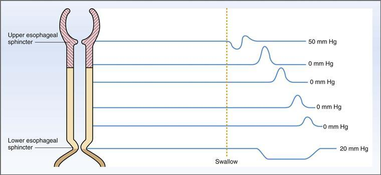

**그림 8–9 삼키는 동안 식도의 압력.**
3. 연동파와 음식 덩어리가 하부 식도 괄약근에 접근하면 괄약근이 열립니다. **하부 식도 괄약근**의 개방은 신경 전달 물질로 **VIP**를 방출하는 미주 신경의 펩티드 섬유에 의해 매개됩니다. VIP는 하부 식도 괄약근의 평활근을 이완시킵니다.  
       하부 식도 괄약근이 이완됨과 동시에 위의 구강 영역도 이완되는데, 이 현상을 **수용성 이완**이라고 합니다. 수용성 이완은 구강 위의 압력을 감소시키고 덩어리가 위로 이동하는 것을 촉진합니다. 덩어리가 위로 들어가자마자 하부 식도 괄약근이 수축하여 높은 안정 상태로 돌아갑니다. 이 안정 상태에서는 괄약근의 압력이 식도나 위의 압력보다 높습니다.
4. 일차 연동 수축으로 식도에서 음식이 제거되지 않으면 장신경계에 의해 매개되는 **이차 연동 수축**이 식도에 남아 있는 음식을 제거합니다. 2차 연동 수축은 팽창 지점에서 시작되어 아래쪽으로 이동합니다.

**식도의 흉강내 위치**(하부 식도만 복부에 있음)로 인해 흥미로운 문제가 발생합니다. 흉부 위치는 식도 내압이 흉강 내압과 동일하며 대기압보다 낮다는 것을 의미합니다. 이는 또한 식도 내압이 복압보다 낮다는 것을 의미합니다. 식도 내압이 낮으면 두 가지 문제가 발생합니다. (1) 상단에서 식도에 공기가 들어가지 않게 하는 것과 (2) 하단에서 산성 위 내용물을 내보내는 것입니다. 상부식도괄약근은 공기가 상부식도로 들어가는 것을 막아주는 역할을 하고, 하부식도괄약근은 산성 위 내용물이 하부식도로 들어가는 것을 막아주는 역할을 합니다. 음식이 인두에서 식도로 또는 식도에서 위로 이동할 때를 제외하고는 상부 및 하부 식도 괄약근이 모두 닫혀 있습니다. 복강 내압이 증가하는 상태(예: 임신 또는 병적 비만)는 위 내용물이 식도로 역류하는 **위식도 역류**를 유발할 수 있습니다.

#### 위 운동성

위 운동에는 세 가지 구성 요소가 있습니다. (1) 식도에서 음식 덩어리를 받기 위한 위 구개 영역의 이완, (2) 덩어리의 크기를 줄이고 위 분비물과 혼합하여 소화를 시작하는 수축, (3) 유미즙을 소장으로 보내는 위 비우기입니다. 유미즙이 소장으로 전달되는 속도는 소장에서 영양분의 소화 및 흡수를 위한 적절한 시간을 확보하기 위해 호르몬에 의해 조절됩니다.

##### *위의 구조와 신경 분포*

위는 외부 세로층, 중간 원형층, 위장에 고유한 내부 경사층의 세 가지 근육 층으로 구성되어 있습니다. 근육벽의 두께는 위 근위부에서 위 원위부로 갈수록 증가합니다.

위의 신경 분포에는 자율신경계에 의한 외인성 신경 분포와 근육층 신경총 및 점막하 신경총의 내인성 신경 분포가 포함됩니다. 위장을 담당하는 근육층 신경총은 미주 신경을 통해 부교감 신경 분포를 받고, 복강 신경절에서 유래한 섬유를 통해 교감 신경 분포를 받습니다.

[그림 8-10](#filepos1693536)은 위의 세 가지 해부학적 구분인 **안저부, 몸통** 및 **유문부**를 보여줍니다. 운동성의 차이에 따라 위도 구강과 꼬리의 두 영역으로 나눌 수 있습니다. **구경 영역**은 근위부에 위치하며 안저와 신체의 근위부를 포함하며 벽이 얇습니다. **꼬리 부위**는 말단에 위치하며 신체의 말단 부분과 유문을 포함하고 벽이 두꺼워서 orad 부위보다 훨씬 더 강한 수축을 생성합니다. 꼬리 부분의 수축은 음식을 섞어서 소장으로 밀어 넣습니다.

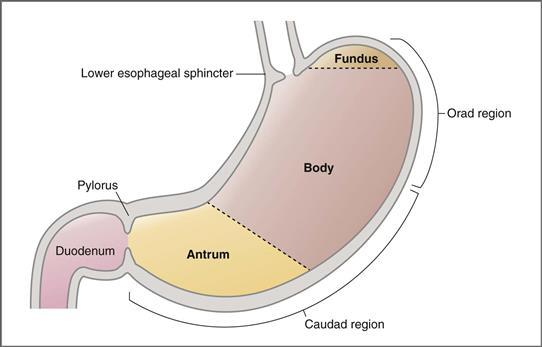

**그림 8-10 위의 세 가지 주요 부분인 안저부, 몸체, 유문부를 보여주는 도식.** 구강 부위에는 안저부와 상체가 포함됩니다. 꼬리 부분에는 하체와 유문이 포함됩니다.

##### *수용적 이완*

위의 오라드 부위에는 얇은 근육벽이 있습니다. 그 기능은 음식 덩어리를 받는 것입니다. 식도 운동성에 대한 논의에서 언급한 바와 같이, 음식에 의한 하부 식도의 팽창은 하부 식도 괄약근의 이완과 동시에 **수용성 이완**이라고 불리는 위 위의 이완을 일으킵니다. 수용성 이완은 압력을 감소시키고 위 위의 부피를 증가시키며, 이완된 상태에서는 최대 1.5L의 음식을 수용할 수 있습니다.

수용성 이완은 **미주신경 반사**입니다. 이는 반사의 구심성 및 원심성 사지 모두가 미주신경을 통해 운반된다는 의미입니다. 기계 수용체는 위의 팽창을 감지하고 이 정보를 감각 뉴런을 통해 CNS에 전달합니다. 그런 다음 CNS는 위의 평활근 벽에 원심성 정보를 보내 위를 이완시킵니다. 이러한 신경절후 펩티드성 미주신경 섬유에서 방출되는 신경전달물질은 **VIP**입니다. 미주신경절단술은 수용성 이완을 제거합니다.

##### *혼합 및 소화*

위의 꼬리 부분은 두꺼운 근육벽을 가지고 있으며 음식을 혼합하고 소화하는 데 필요한 수축을 생성합니다. 이러한 수축은 음식을 더 작은 조각으로 나누고 위 분비물과 혼합하여 소화 과정을 시작합니다.

수축파동은 위체 중앙에서 시작하여 꼬리위를 따라 말단으로 이동합니다. 이는 유문에 접근함에 따라 강도가 증가하는 격렬한 수축입니다. 수축은 위 내용물을 혼합하고 주기적으로 위 내용물의 일부를 유문을 통해 십이지장으로 밀어냅니다. 그러나 유미즙의 대부분은 수축 파동으로 인해 유문도 닫히기 때문에 즉시 십이지장으로 주입되지 않습니다. 따라서 대부분의 위 내용물은 추가 혼합 및 입자 크기의 추가 감소를 위해 위로 다시 추진됩니다. 이 과정을 **역류력**이라고 합니다.

꼬리 위의 **느린 파동** 빈도는 분당 3~5회입니다. 느린 파동은 막 전위를 역치까지 가져와 활동 전위가 발생할 수 있다는 점을 기억하십시오. 느린 파동의 빈도가 활동 전위와 수축의 최대 빈도를 설정하기 때문에 꼬리 위는 분당 3~5회 수축합니다.

신경 입력과 호르몬 입력은 느린 파동의 빈도에 *영향을 미치지* 않지만, 활동 전위의 빈도와 수축력에는 *영향*을 미칩니다. **부교감 자극**과 가스트린 및 모틸린 호르몬은 활동 전위의 빈도와 위 수축력을 *증가*시킵니다. **교감신경 자극**과 세크레틴 및 GIP 호르몬은 활동 전위의 빈도와 수축력을 *감소*시킵니다.

단식 중에는 **모틸린**에 의해 매개되는 **이동성 근전 복합체**라고 하는 주기적인 위 수축이 발생합니다. 이러한 수축은 90분 간격으로 발생하며 위에 이전 식사에서 남은 잔여물을 제거하는 역할을 합니다.

##### *위 배출*

식사 후 위 안에는 약 1.5L의 내용물이 들어 있는데, 이는 고형물, 액체, 위액분비물로 구성됩니다. 위 내용물을 십이지장까지 비우는 데는 약 3시간이 걸립니다. 위 배출 속도는 십이지장에서 위 H+의 중화를 위한 적절한 시간과 영양분의 소화 및 흡수를 위한 적절한 시간을 제공하기 위해 엄격하게 조절되어야 합니다.

액체는 고체보다 더 빨리 비워지며, 등장성 내용물은 저장성 또는 고장성 내용물보다 더 빠르게 비워집니다. 십이지장에 들어가려면 고형물을 1mm3 이하의 입자로 줄여야 합니다. 위에서 역추력은 고체 음식 입자가 필요한 크기로 줄어들 때까지 계속됩니다.

위 배출을 늦추거나 억제하는 두 가지 주요 요인(예: *위 배출 시간 증가*): 십이지장의 지방 존재 및 H+ 이온(낮은 pH) 존재. **지방**의 효과는 지방산이 십이지장에 도착할 때 분비되는 **CCK**에 의해 매개됩니다. 결과적으로 CCK는 위 배출 속도를 늦추어 위 내용물이 십이지장까지 천천히 전달되도록 하고 지방이 소화 및 흡수될 수 있는 적절한 시간을 제공합니다. **H+**의 효과는 **장 신경계**의 반사에 의해 매개됩니다. 십이지장 점막의 H+ 수용체는 장 내용물의 낮은 pH를 감지하고 이 정보를 근장 신경총의 개재뉴런을 통해 위 평활근에 전달합니다. 이 반사는 또한 위 내용물이 십이지장까지 천천히 전달되도록 보장하여 췌장 효소의 최적 기능에 필요한 췌장 HCO3-에 의한 H+의 중화 시간을 허용합니다.

#### 소장 운동성

소장의 기능은 영양소의 소화와 흡수입니다. 이러한 맥락에서 소장의 운동성은 유미즙을 소화 효소 및 췌장 분비물과 혼합하고, 흡수를 위해 영양분을 장 점막에 노출시키고, 흡수되지 않은 유미즙을 소장을 따라 대장으로 이동시키는 역할을 합니다.

소장에서는 다른 위장 평활근과 마찬가지로 **느린 파동**의 빈도에 따라 활동 전위와 수축이 발생하는 속도가 결정됩니다. 느린 파도는 위에서보다 십이지장(분당 12번의 파도)에서 더 자주 발생합니다. 회장에서는 느린 파동의 빈도가 분당 9파로 약간 감소합니다. 위에서와 마찬가지로 수축(**이동하는 근전 복합체**라고 함)이 90분마다 발생하여 소장에서 잔류 유미즙을 제거합니다.

소장에는 부교감 신경과 교감 신경 분포가 모두 있습니다. 부교감 신경 분포는 미주 신경을 통해 발생하고 교감 신경 분포는 복강 및 상장간막 신경절에서 유래하는 섬유를 통해 발생합니다. **부교감** 자극은 장 평활근의 수축을 *증가*시키고, **교감* 활동은 수축을 *감소*시킵니다. 많은 부교감 신경이 콜린성(즉, ACh를 방출)이지만 일부 부교감 신경은 다른 신경분비(즉, 펩티드성)를 방출합니다. 소장의 부교감신경 펩티드 뉴런에서 방출되는 신경분비에는 VIP, 엔케팔린 및 모틸린이 포함됩니다.

소장에는 분할 수축과 연동 수축이라는 두 가지 수축 패턴이 있습니다. 각 패턴은 **장신경계**에 의해 조정됩니다([그림 8-11](#filepos1701550)).

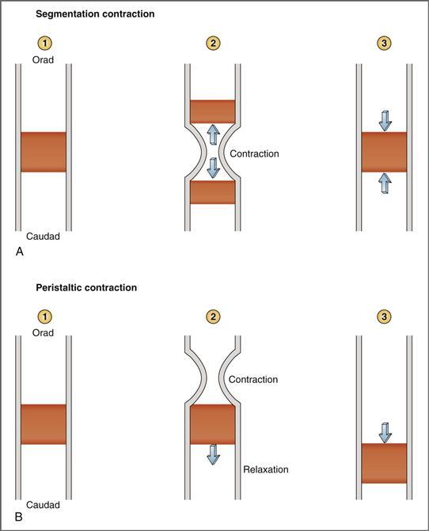

**그림 8-11 소장의 분할 수축(A)과 연동 수축(B)의 비교.** 분할 수축은 유미즙을 혼합합니다. 연동운동은 유미즙을 꼬리 방향으로 이동시킵니다. 연동 수축의 경우 볼루스(orad) 뒤에서 원형 근육이 수축하고 세로 근육이 이완됩니다. 볼루스(꼬리뼈) 앞에서 원형 근육은 이완되고 세로 근육은 수축합니다.

이 위치에는 현재 귀하의 기기에서 지원되지 않는 비디오 콘텐츠가 있습니다. 이 콘텐츠의 캡션이 아래에 표시됩니다. 

**동영상: 연동운동**

##### *분할 수축*

분할 수축은 [그림 8-11*A*](#filepos1701550)에 표시된 것처럼 **유미즙을 혼합**하고 이를 췌장 효소 및 분비물에 노출시키는 역할을 합니다. 1단계는 장 내강에 있는 유미 덩어리를 보여줍니다. 소장의 한 부분이 수축하여 유미즙을 쪼개어 오라드 방향과 꼬리 방향으로 보냅니다(2단계). 그런 다음 장의 해당 부분이 이완되어 분할된 유미 덩어리가 다시 합쳐질 수 있습니다(3단계). 이러한 앞뒤 움직임은 유미즙을 혼합하는 역할을 하지만 소장을 따라 앞으로 나아가는 추진력 있는 움직임은 생성하지 않습니다.

##### *연동 수축*

유미즙을 혼합하도록 설계된 분할 수축과 달리 연동 수축은 소장을 따라 대장 방향으로 **유미즙을 추진**하도록 설계되었습니다([그림 8-11*B*](#filepos1701550) 참조). 1단계에서는 유미즙 덩어리를 보여줍니다. 수축은 볼루스의 (뒤) 지점에서 발생합니다. 동시에, 볼루스(앞)에 대한 장 꼬리 부분이 이완됩니다(2단계). 이로써 유미즙은 꼬리 방향으로 추진됩니다. 연동 수축 파동이 소장 아래에서 발생하여 볼루스 뒤의 수축과 볼루스 앞의 이완을 반복하여 유즙을 따라 움직입니다(3단계).

소장을 따라 이러한 추진력 있는 움직임을 수행하려면 원형 근육과 세로 근육이 서로 반대 방향으로 기능하여 서로의 활동을 보완해야 합니다. (원형 근육의 수축은 소장 부분의 *직경*을 감소시키는 반면, 세로 근육의 수축은 소장 부분의 *길이*를 감소시킨다는 점을 기억하십시오.) 원형 근육과 세로 근육이 동시에 수축할 때 발생할 수 있는 충돌을 방지하기 위해 두 근육은 상호 신경 지배를 받습니다. 결과적으로, 분절의 원형 근육이 수축할 때 세로 근육이 동시에 이완됩니다. 세로 근육이 수축하면 원형 근육이 동시에 이완됩니다.

**연동운동**은 따라서 다음과 같이 발생합니다. 장 내강의 음식물 덩어리는 세로토닌(5-하이드록시티프타민, 5-HT)을 방출하는 장 점막의 장크로마핀 세포에 의해 감지됩니다. 5-HT는 IPAN(내인성 일차 구심성 뉴런)의 수용체에 결합하여 활성화되면 소장의 해당 부분에서 **연동 반사**를 시작합니다. **볼루스 뒤에서** 흥분성 전달 물질(예: ACh, 물질 P, 신경펩타이드 Y)은 원형 근육에서 방출되는 반면, 이러한 경로는 세로 근육에서 동시에 억제됩니다. 따라서 소장의 이 부분은 좁아지고 길어집니다. **볼루스 앞에서** 억제 경로(예: 혈관 활성 장 펩티드, 산화질소)는 원형 근육에서 활성화되는 반면 흥분성 경로는 세로 근육에서 활성화됩니다. 따라서 소장의 이 부분이 넓어지고 짧아집니다.

##### *구토*

수질에 있는 **구토 중추**는 구토 반사를 조정합니다. 구심성 정보는 전정계, 목 뒤, 위장관, 제4뇌실의 화학수용체 유발 구역에서 구토 중추로 전달됩니다.

**구토 반사**에는 이 시간 순서로 다음과 같은 이벤트가 포함됩니다. 소장에서 시작되는 **역 연동운동**; 위와 유문의 이완; 복압을 증가시키기 위한 강제 흡기; 후두의 위쪽 및 앞쪽의 움직임과 하부 식도 괄약근의 이완; 성문 폐쇄; 위, 때로는 십이지장의 내용물을 강제로 배출합니다. **구역질**에서는 상부 식도 괄약근이 닫힌 상태로 유지되며, 하부 식도 괄약근이 열려 있기 때문에 구역질이 끝나면 위 내용물이 위로 되돌아갑니다.

#### 대장 운동성

소장에서 흡수되지 않은 물질은 대장으로 들어갑니다. **대변**이라고 불리는 대장의 내용물은 배설되도록 되어 있습니다. 소장의 내용물이 맹장과 근위 결장으로 들어간 후 회맹장 괄약근이 수축하여 회장으로의 역류를 방지합니다. 대변 ​​물질은 맹장에서 결장(즉, 상행결장, 횡행결장, 하행결장, S자 결장)을 거쳐 직장을 거쳐 항문관으로 이동합니다.

##### *분할 수축*

분할 수축은 맹장과 근위 결장에서 발생합니다. 소장에서와 마찬가지로 이러한 수축은 대장의 내용물을 혼합하는 기능을 합니다. 대장에서 수축은 **하우스트라**라고 불리는 특징적인 주머니 모양의 부분과 연관되어 있습니다.

##### *대중 운동*

대량 이동은 결장에서 발생하며 횡결장에서 구불결장까지 장거리로 대장의 내용물을 이동시키는 기능을 합니다. 대량 이동은 **하루 1~3회** 발생합니다.** 원위 결장에서 수분 흡수가 발생하여 대장의 대변 내용물이 반고체로 변하고 이동이 점점 더 어려워집니다. 최종 대량 이동은 대변 내용물을 직장으로 밀어 넣어 배변이 일어날 때까지 거기에 저장됩니다.

##### *배변*

직장이 대변으로 채워짐에 따라 직장 평활근 벽이 수축하고 **직장 괄약근 반사**에 의해 내부 항문 괄약근이 이완됩니다. 그러나 외부 항문 괄약근(횡문근으로 구성되어 자발적으로 조절되는)이 여전히 긴장 수축되어 있기 때문에 배변은 발생하지 않습니다. 그러나 직장이 용량의 25%까지 차면 배변을 하고 싶은 충동이 생깁니다. 적절한 경우 외부 항문 괄약근이 자발적으로 이완되고 직장의 평활근이 수축하여 압력을 생성하며 대변이 항문관을 통해 밀려 나옵니다. 배변을 위해 발생하는 복강 내 압력은 **Valsalva 법**(닫힌 성문에 대한 만료)으로 증가될 수 있습니다.

##### *위장 반사*

음식에 의한 위의 팽창은 결장의 운동성을 증가시키고 대장의 대량 이동 빈도를 증가시킵니다. **위대장 반사**라고 하는 이 긴 호 반사는 위장에 구심성 사지가 있으며, 이는 부교감 신경계에 의해 매개됩니다. 결장의 운동성을 증가시키는 반사의 원심성 사지는 CCK와 가스트린 호르몬에 의해 매개됩니다.

### 비밀

분비는 위장관 내강에 체액, 효소, 점액이 *추가*되는 것입니다. 이러한 분비물은 타액선(타액), 위점막세포(위분비물), 췌장의 외분비세포(췌장분비물), 간(담즙)에서 생성됩니다([표 8-3](#filepos1710637)).

**표 8–3 위장 분비물 요약**

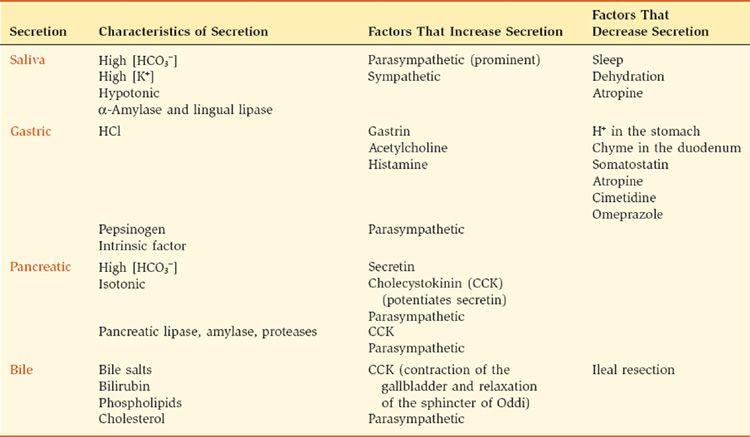

#### 타액 분비

타액선에서 하루에 1L의 비율로 생성되는 타액이 입으로 분비됩니다. **타액의 기능**에는 타액 효소에 의한 전분과 지질의 초기 소화가 포함됩니다. 섭취한 식품의 희석 및 완충(해로울 수 있음) 식도를 통한 이동을 돕기 위해 섭취한 음식을 점액으로 윤활합니다.

##### *타액선의 구조*

세 가지 주요 침샘은 이하선, 턱밑샘, 설하선입니다. 각 샘은 타액을 생성하고 덕트를 통해 입으로 전달하는 한 쌍의 구조입니다. **귀밑샘**은 장액 세포로 구성되어 있으며 물, 이온 및 효소로 구성된 수성 액체를 분비합니다. **턱밑샘과 설하샘**은 혼합샘으로 장액세포와 점액세포를 모두 가지고 있습니다. 장액 세포는 방수를 분비하고, 점액 세포는 윤활을 위해 뮤신 당단백질을 분비합니다.

각 침샘은 포도송이 하나가 포도송이 하나에 해당하는 '포도송이'의 모습을 하고 있다([그림 8-12](#filepos1713007)). **acinus**는 분지관 시스템의 막힌 끝 부분이며 선포 세포가 늘어서 있습니다. **선상 세포**는 물, 이온, 효소 및 점액으로 구성된 초기 타액을 생성합니다. 이 초기 타액은 삽입관(intercalated duct)이라 불리는 짧은 부분을 통과한 다음 관 세포가 늘어선 줄무늬 관을 통과합니다. **관 세포**는 다양한 전해질의 농도를 변경하여 초기 타액을 수정하여 최종 타액을 생성합니다. **근상피 세포**는 선방과 삽입관에 존재합니다. 신경 입력에 의해 자극을 받으면 근상피 세포가 수축하여 타액을 입으로 배출합니다.

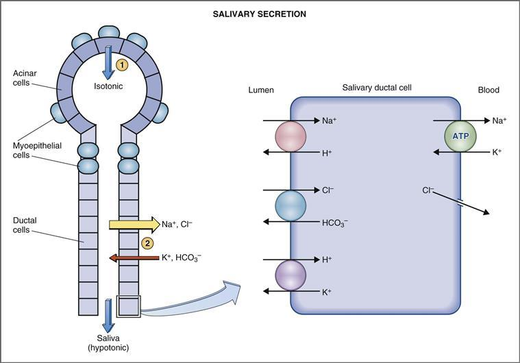

**그림 8-12 타액 분비의 메커니즘.** 초기 타액은 선조 세포(1)에 의해 생성되고 이후 관 상피 세포(2)에 의해 변형됩니다. ATP, 아데노신 삼인산.

타액 선조 세포와 도관 세포에는 **부교감 신경 분포와 교감 신경 분포**가 모두 있습니다. 비록 많은 기관이 이러한 이중 신경 분포를 갖고 있지만, 타액선의 특이한 특징은 타액 생성이 부교감 신경계와 교감 신경계 모두에 의해 *자극된다는 것입니다(부교감 조절이 지배적임에도 불구하고).

타액선에는 타액 생성이 자극될 때 증가하는 비정상적으로 **높은 혈류량**이 있습니다. 장기 크기에 맞게 보정하면 침샘으로 가는 최대 혈류량은 골격근을 운동시키는 혈류량의 10배 이상입니다!

##### *타액 형성*

타액은 분비선의 작은 크기에 비해 부피가 매우 큰 수용액입니다. 타액은 물, 전해질, α-아밀라아제, 설측 리파아제, 칼리크레인, 점액으로 구성됩니다. 혈장과 비교할 때 타액은 **저장성**(즉, 삼투압농도가 낮음)이며 K+ 및 중탄산염(HCO3−) 농도가 더 높으며 Na+ 및 염화물(Cl−) 농도가 더 낮습니다. 따라서 타액은 혈장의 단순한 한외여과물이 아니라 여러 수송 메커니즘을 포함하는 2단계 과정으로 형성됩니다. 첫 번째 단계는 선포 세포에 의한 등장성 플라즈마 유사 용액의 형성입니다. 두 번째 단계는 관 세포에 의한 혈장 유사 용액의 변형입니다.

타액 생산의 선방 및 관 단계는 [그림 8-12](#filepos1713007)에 나와 있습니다. 그림에서 원 안의 숫자는 다음 단계에 해당합니다.

1. **선상세포**는 초기 타액을 분비하는데, 이는 **등장성**이며 혈장과 대략 동일한 전해질 구성을 가지고 있습니다. 따라서 초기 타액의 삼투압, Na+, K+, Cl**-** 및 HCO3**-** 농도는 혈장의 농도와 유사합니다.
2. **관 세포**는 초기 타액을 수정합니다. 이 변형과 관련된 수송 메커니즘은 복잡하지만 관강막과 기저외측막의 사건을 개별적으로 고려한 다음 모든 수송 메커니즘의 최종 결과를 결정함으로써 단순화될 수 있습니다. 관 세포의 관강막에는 Na+-H+ 교환, Cl**−**-HCO3**−** 교환 및 H+-K+ 교환의 세 가지 수송체가 포함되어 있습니다. 기저측막에는 Na+-K+ ATPase 및 Cl**−** 채널이 포함되어 있습니다. 함께 작동하는 이러한 운반체의 결합된 작용은 Na+와 Cl−**의 ***흡수* 및 K+와 HCO3−**의 ***분비*입니다. Na+ 및 Cl**-**의 순 흡수는 타액의 Na+ 및 Cl**-** 농도를 혈장 농도보다 낮추고, K+ 및 HCO3**-**의 순 분비로 인해 타액의 K+ 및 HCO3**-** 농도가 혈장 농도보다 높아집니다. KHCO3가 분비되는 것보다 더 많은 NaCl이 흡수되기 때문에 **용질의 순 흡수**가 발생합니다.  
       마지막 질문은 *처음에는 등장성이었던 타액이 어떻게 관을 통해 흐를 때 저장성이 됩니까?*입니다. 대답은 관 세포의 상대적인 **물 불침투성**에 있습니다. 언급한 바와 같이, KHCO3가 분비되는 것보다 더 많은 NaCl이 흡수되기 때문에 용질의 순 흡수가 발생합니다. 관 세포는 물이 투과하지 않기 때문에 물은 용질과 함께 흡수되지 않아 최종 타액을 **저장성**으로 만듭니다.

선포 세포는 또한 α-아밀라제, 설측 리파제, 뮤신 당단백질, IgA(면역글로불린 A) 및 칼리크레인과 같은 유기 성분을 분비합니다. **α-아밀라제**는 탄수화물의 초기 소화를 시작하고, **설측 리파제**는 지질의 초기 소화를 시작합니다. 점액 성분은 윤활제 역할을 합니다. **칼리크레인**은 고분자량 키니노겐을 강력한 혈관 확장제인 브래디키닌으로 분해하는 효소입니다. 침샘 활동이 활발한 기간에는 칼리크레인이 분비되어 브라디키닌을 생성합니다. 그런 다음 브래디키닌은 국소 혈관 확장을 유발하는데, 이는 타액 활동이 증가하는 기간 동안 높은 타액 혈류를 설명합니다.

##### *타액 구성에 대한 유량의 영향*

타액유량의 변화에 따라 타액의 이온조성이 변화한다([그림 8-13](#filepos1719701)). **최고 유속**(4mL/분)에서 최종 타액은 혈장 및 선포 세포에서 생성된 초기 타액과 가장 유사합니다. **가장 낮은 유속**(<1mL/분)에서 최종 타액은 혈장과 가장 다릅니다(Na+ 및 Cl− 농도가 더 낮고 K+ 농도가 더 높습니다). 유량에 따른 농도 변화의 메커니즘은 주로 타액이 관 세포와 접촉하는 시간에 기초합니다. 높은 유속에서는 관 세포가 타액을 변형하는 *시간이 적습니다*. 낮은 유속에서는 타액을 수정하는 데 *더 많은 시간*이 있습니다. 접촉 시간이 가장 긴 저유량 조건에서는 Na+와 Cl-가 더 많이 재흡수되어 초기 타액에 비해 농도가 감소하고 K+가 더 많이 분비되어 농도가 증가합니다.

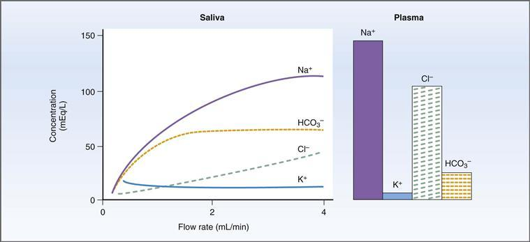

**그림 8-13 타액 조성과 타액 유량 사이의 관계.** 타액의 이온 조성을 혈장의 이온 조성과 비교합니다.

이 "접촉 시간" 설명으로 설명되지 않는 유일한 전해질은 HCO3−입니다. 접촉 시간 설명에 따르면, HCO3−는 관 세포에서 분비되기 때문에 그 농도는 낮은 유속에서 가장 높아야 합니다. 그러나 [그림 8-13](#filepos1719701)에서 볼 수 있듯이 타액의 HCO3− 농도는 저유량에서 가장 낮고, 고유량에서 가장 높습니다. 이는 타액 생성이 자극될 때(예: 부교감 신경 자극에 의해) HCO3− 분비가 *선택적으로* 자극되기 때문에 발생합니다. 따라서 타액의 유량이 증가하면 HCO3− 농도도 증가합니다.

##### *타액분비 조절*

타액 분비 조절에는 두 가지 특이한 특징이 있습니다. (1) 타액 분비는 전적으로 자율신경계의 신경 조절을 받는 반면, 다른 위장 분비물은 신경과 호르몬의 조절을 모두 받습니다. (2) 부교감신경 자극이 지배적이지만 ***모두* 부교감신경과 교감신경** 자극에 의해 타액 분비가 증가합니다. (보통 부교감신경계와 교감신경계는 반대의 작용을 합니다.)

자율신경계에 의한 타액분비 조절은 [그림 8-14](#filepos1721999)에 요약되어 있다. 예시된 바와 같이, 선조 세포와 관 세포에는 부교감 신경과 교감 신경 분포가 있습니다. 타액 세포를 자극하면 타액 생성이 증가하고 HCO3− 및 효소 분비가 증가하며 근상피 세포가 수축됩니다.

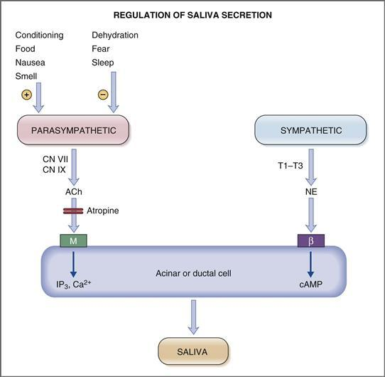

**그림 8–14 자율신경계에 의한 타액 분비 조절.** ACh, 아세틸콜린; β, β 수용체; cAMP, 사이클릭 아데노신 모노포스페이트; CN, 뇌신경; M, 무스카린성 수용체; NE, 노르에피네프린; T1-T3, 흉부 부분.

 **부교감 신경 분포.** 타액선으로의 부교감 신경 입력은 안면(CN VII) 및 설인두(CN IX) 신경을 통해 전달됩니다. 신경절후 부교감 뉴런은 ACh를 방출하는데, 이는 선방세포와 관 세포의 **무스카린성 수용체**와 상호작용합니다. 세포 수준에서 무스카린 수용체의 활성화는 이노시톨 1,4,5-삼인산(**IP3**)의 생성과 세포내 칼슘(Ca2+) 농도의 증가로 이어지며, 이는 타액 분비 증가의 생리적 작용을 일으키며 주로 타액의 양과 효소 성분을 증가시킵니다. 여러 요인이 타액선으로의 부교감 신경 입력을 조절합니다. 침샘에 대한 부교감 활동은 음식, 냄새, 메스꺼움 및 조건 반사(예: 파블로프의 침 흘리는 개에서 입증된 바와 같이)에 의해 증가됩니다. 부교감신경 활동은 두려움, 수면, 탈수로 인해 감소합니다.

 **교감 신경 분포.** 타액선으로의 교감 신경 입력은 상부 경추 신경절에서 시냅스되는 신경절 이전 신경이 있는 흉부 T1~T3에서 시작됩니다. 신경절이후 교감신경세포는 노르에피네프린을 분비하는데, 이는 선방세포와 관세포의 β**-아드레날린 수용체**와 상호작용합니다. β-아드레날린성 수용체의 활성화는 아데닐릴 사이클라제의 자극과 **환형 아데노신 일인산(cAMP)**의 생성으로 이어집니다.** 부교감 IP3/Ca2+ 메커니즘과 마찬가지로 cAMP의 생리적 작용은 타액 분비를 증가시키는 것입니다. 교감신경 자극은 또한 선조 세포의 α-아드레날린 수용체를 활성화하지만, β-아드레날린 수용체의 활성화가 더 중요한 것으로 간주됩니다.

#### 위 분비물

위점막 세포는 **위액**이라는 액체를 분비합니다. 위액의 4가지 주요 구성 요소는 염산(HCl), 펩시노겐, 내인자 및 점액입니다. **HCl**과 **펩시노겐**은 함께 단백질 소화 과정을 시작합니다. **내인성 인자**는 회장에서 비타민 B12를 흡수하는 데 필요하며 위액의 유일한 *필수* 성분입니다. **점액**은 HCl의 부식 작용으로부터 위점막을 보호하고 위 내용물을 윤활시킵니다.

##### *위점막의 구조와 세포 유형*

위의 해부학적 구분(저부, 몸체, 유문)은 운동성 섹션에서 논의되었습니다. 이러한 전체적인 해부학적 구분 외에도 위 점막에는 위액의 다양한 구성 요소를 분비하는 여러 유형의 세포가 포함되어 있습니다. 세포의 종류와 분비산물은 [그림 8-15](#filepos1725821)과 같다.

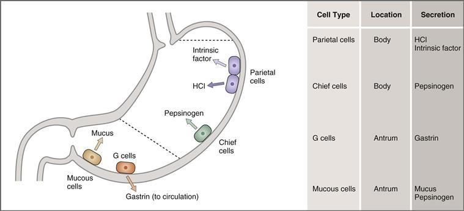

**그림 8–15 다양한 위세포의 분비산물.**

위의 몸체에는 분비물을 관을 통해 위의 내강으로 비우는 **산소샘**이 있습니다([그림 8-16](#filepos1726706)). 위점막에 있는 관의 개구부를 구덩이라고 하며 상피 세포가 늘어서 있습니다. 샘의 더 깊은 곳에는 목 점액 세포, 두정(산소) 세포, 주(소화) 세포가 있습니다. **벽세포**에는 HCl과 내인성 인자라는 두 가지 분비물이 있습니다. **주요세포**에는 하나의 분비산물인 펩시노겐이 있습니다.

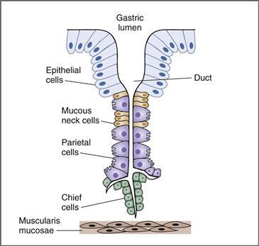

**그림 8-16 위산샘의 구조. 위산샘을 둘러싸고 있는 다양한 세포 유형을 보여줍니다.** 이 관은 위점막 표면의 구덩이로 열립니다.

위의 유문에는 **유문샘**이 포함되어 있으며, 유문샘은 산소샘과 유사하게 구성되어 있지만 구덩이가 더 깊습니다. 유문샘에는 G 세포와 점액 세포라는 두 가지 세포 유형이 있습니다. **G 세포**는 유문관이 아닌 *순환계*로 가스트린을 분비합니다. **점액성 목 세포**는 점액, HCO3− 및 펩시노겐을 분비합니다. 점액과 HCO3-는 위 점막을 보호하고 중화시키는 효과가 있습니다.

##### *HCl 분비*

**벽세포**의 주요 기능은 위 내용물을 pH 1과 2 사이로 산성화하는 **HCl**의 분비입니다. 생리학적으로 이 낮은 위 pH의 기능은 근처의 주요 세포에서 분비되는 *비활성* 펩시노겐을 *활성* 형태인 펩신, 즉 단백질 소화 과정을 시작하는 프로테아제로 전환하는 것입니다. 정수리 세포에 의한 HCl 분비의 세포 메커니즘을 먼저 설명하고, 이어서 HCl 분비를 조절하는 메커니즘과 H+ 분비의 병태생리에 대해 논의합니다.

###### 셀룰러 메커니즘

위벽세포에 의한 HCl 분비의 세포기전은 [그림 8-17](#filepos1729202)에 나타나 있다. 신장 세포에서와 마찬가지로 위의 내강을 향한 세포막을 정점 또는 관강 막이라고 하며 혈류를 향한 세포막을 기저외측 막이라고 합니다. **정단막**에는 H+-K+ ATPase 및 Cl− 채널이 포함되어 있고 **기저측막**에는 Na+-K+ ATPase 및 Cl−-HCO3− 교환기가 포함되어 있습니다. 세포에는 탄산 탈수효소가 포함되어 있습니다.

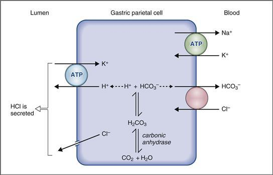

**그림 8–17 위 벽세포에 의한 HCl 분비 메커니즘.** ATP, 아데노신 삼인산.

HCl 분비는 [그림 8-17](#filepos1729202)에 나타나 있으며, 그 설명은 다음과 같다.

1. 세포내액에서 호기성 대사로 생성된 이산화탄소(CO2)는 H2O와 결합하여 **탄산탈수효소**에 의해 촉매되는 H2CO3를 형성합니다. H2CO3는 H+와 HCO3−로 해리됩니다. H+는 Cl-와 함께 위강으로 분비되고, HCO3-는 각각 2단계와 3단계에서 설명한 대로 혈액으로 흡수됩니다.
2. **첨단 막**에서 H+는 **H+-K+ ATPase를 통해 위 내강으로 분비됩니다.** H+-K+ ATPase는 전기화학적 구배(오르막)에 대해 H+와 K+를 운반하는 주요 활성 과정입니다. H+-K+ ATPase는 H+ 분비를 줄이기 위해 궤양 치료에 사용되는 약물 **오메프라졸**에 의해 억제됩니다. Cl−는 근단막의 **Cl**−**채널**을 통해 확산되어 H+를 내강으로 따라갑니다.
3. **기저측막**에서 HCO3−는 Cl−-HCO3− 교환기를 통해 세포에서 혈액으로 흡수됩니다. 흡수된 HCO3-는 식사 후 위 정맥혈에서 관찰될 수 있는 "알칼리성 조수"(높은 pH)의 원인입니다. 결국 이 HCO3−는 췌장 분비물을 통해 위장관으로 다시 분비됩니다.
4. 위 벽세포의 정점막과 기저측막에서 발생하는 현상이 결합되어 **HCl의 순 분비**와 **HCO3의 순 흡수**−가 발생합니다.

###### HCL 분비를 변화시키는 물질

세 가지 물질은 위벽 세포의 H+ 분비를 자극합니다: 히스타민(측분비), ACh(신경분비) 및 가스트린(호르몬). 각 물질은 벽세포의 서로 다른 수용체에 결합하여 서로 다른 세포 작용 메커니즘을 가지고 있습니다([그림 8-18](#filepos1732268)). 또한 히스타민 방출 자극을 통해 ACh와 가스트린의 간접적인 효과도 있습니다.

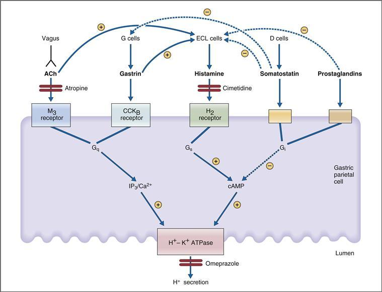

**그림 8–18 위벽 세포에 의한 H+ 분비를 자극하고 억제하는 물질.** ACh, 아세틸콜린; cAMP, 사이클릭 아데노신 모노포스페이트; CCK, 콜레시스토키닌; ECL, 장크로마핀 유사; IP3, 이노시톨 1,4,5-트리포스페이트; M, 무스카린성.

 **히스타민**은 위 점막의 장크롬친화성(ECL) 세포에서 방출되어 측분비 메커니즘을 통해 인근 벽세포로 확산되어 **H2 수용체**와 결합합니다. 히스타민의 두 번째 전달자는 **cAMP입니다.** 히스타민은 Gs 단백질에 의해 아데닐릴 시클라제와 결합되는 H2 수용체에 결합합니다. adenylyl cyclase가 활성화되면 cAMP 생산이 증가합니다. cAMP는 단백질 키나제 A를 활성화시켜 벽세포에서 H+를 분비하게 합니다. **시메티딘**은 H2 수용체를 차단하고 벽세포에 대한 히스타민의 작용을 차단합니다.

 **ACh**는 위점막을 지배하는 미주신경에서 방출되어 벽세포의 **무스카린성**(**M3**) **수용체**에 직접 결합합니다. ACh의 두 번째 전달자는 **IP3/Ca2+**입니다. ACh가 무스카린 수용체에 결합하면 포스포리파제 C가 활성화됩니다. 포스포리파제 C는 막 인지질에서 디아실글리세롤과 IP3를 유리시키고, IP3는 세포내 저장소에서 Ca2+를 방출합니다. Ca2+와 디아실글리세롤은 최종 생리적 작용, 즉 벽세포에 의한 H+ 분비를 생성하는 단백질 키나제를 활성화합니다. **아트로핀**은 벽세포의 무스카린성 수용체를 차단하여 ACh의 작용을 차단합니다.

ACh는 또한 ECL 세포를 자극하여 히스타민을 방출함으로써 간접적으로 H+ 분비를 증가시킵니다. 히스타민은 앞서 설명한 대로 벽 세포에 작용합니다.

 **가스트린**은 위 유문의 G 세포에 의해 순환계로 분비됩니다. 가스트린은 위장 내 국소 확산이 *아님* 내분비 메커니즘을 통해 벽세포에 도달합니다. 따라서 가스트린은 위 유문에서 전신 순환계로 분비된 다음 순환계를 통해 위로 *다시* 전달됩니다. 가스트린은 벽세포의 콜레시스토키닌 B(CCKB) 수용체에 결합합니다. (CCKB 수용체는 가스트린과 CCK에 대해 동일한 친화력을 갖는 반면, CCKA 수용체는 CCK에 특이적입니다.) ACh와 마찬가지로 가스트린은 **IP3/Ca2+** 2차 전달 시스템을 통해 H+ 분비를 자극합니다. G 세포에서 가스트린 분비를 유발하는 자극은 이후에 자세히 논의됩니다. 간단히 말해서 이러한 자극은 위 팽창, 작은 펩타이드와 아미노산의 존재, 미주 신경 자극입니다.

ACh와 마찬가지로 가스트린도 ECL 세포에서 히스타민 방출을 유발하여 간접적으로 H+ 분비를 자극합니다.

H+ 분비 속도는 히스타민, ACh 및 가스트린의 독립적인 작용뿐만 아니라 세 물질 간의 *상호작용*에 의해 조절됩니다. 이러한 상호작용을 **강화**라고 하며, 이는 개별 반응의 합보다 더 큰 결합 반응을 생성하는 두 자극의 능력을 나타냅니다. 벽세포의 강화에 대한 한 가지 설명은 각 물질이 ​​서로 다른 수용체를 통해 H+ 분비를 자극하고, 히스타민의 경우에는 서로 다른 2차 전달자를 자극한다는 것입니다. 또 다른 설명은 ACh와 가스트린 모두 ECL 세포에서 히스타민 방출을 자극하여 두 번째 간접적인 경로를 통해 H+ 분비를 유도한다는 사실에서 비롯됩니다. 이러한 강화 현상은 H+ 분비를 억제하는 다양한 약물의 작용에 영향을 미칩니다. 예를 들어, 히스타민은 ACh와 가스트린의 작용을 강화하기 때문에 **시메티딘**과 같은 H2 수용체 차단제는 예상보다 더 큰 효과를 나타냅니다. 이는 히스타민의 직접적인 작용을 차단하고* ACh와 가스트린의 히스타민 강화 효과도 차단합니다. 또 다른 예에서 ACh는 히스타민과 가스트린의 작용을 강화합니다. 이러한 강화의 결과로 **아트로핀**과 같은 무스카린 차단제는 ACh의 직접적인 효과 *및* 히스타민과 가스트린의 ACh 강화 효과를 차단합니다.

###### H+ 분비 자극

히스타민, ACh 및 가스트린이 모두 벽세포의 HCl 분비를 자극한다는 사실이 입증되었으므로 이제 식사에 대한 HCl 분비 조절을 통합된 방식으로 논의할 수 있습니다. [그림 8-19](#filepos1738021)는 HCl을 분비하는 위벽벽세포와 가스트린을 분비하는 G세포를 나타낸다. 미주신경은 벽세포에 직접적으로 신경을 분포시켜 ACh를 신경전달물질로 방출합니다. 미주신경은 또한 G 세포에 신경을 분포시켜 GRP를 신경전달물질로 방출합니다.

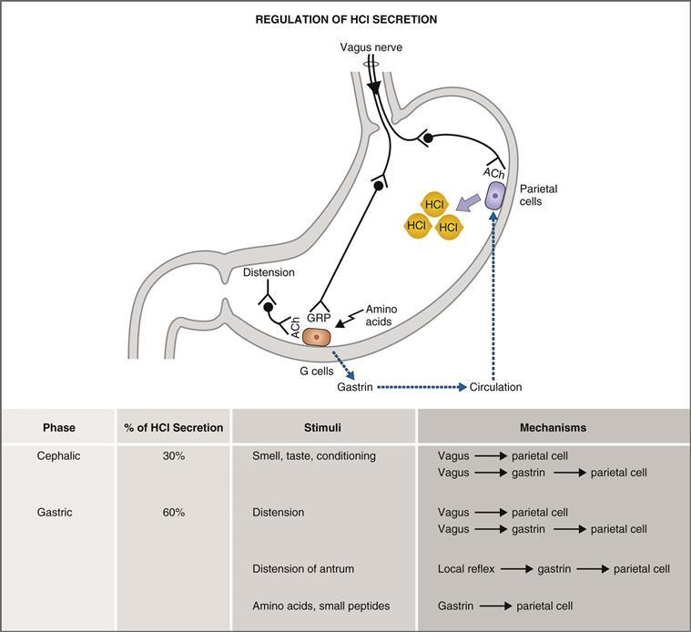

**그림 8–19 두부 및 위 단계 중 HCl 분비 조절.** ACh, 아세틸콜린; GRP, 가스트린 방출 펩타이드(봄베신).

[그림 8-19](#filepos1738021)에서 볼 수 있듯이, 두 번째 경로인 G 세포 경로는 벽세포의 미주신경 자극을 위한 *간접적인* 경로를 제공합니다. 미주신경 자극은 G 세포에서 가스트린을 방출하고, 가스트린은 전신 순환계로 들어가서 다시 위로 전달되어 벽세포에 의한 H+ 분비를 자극합니다. 미주신경 자극의 이러한 이중 작용의 한 가지 결과는 **아트로핀**과 같은 무스카린 차단제가 HCl 분비를 완전히 차단하지 못한다는 것입니다. 아트로핀은 ACh에 의해 매개되는 두정엽 세포에 대한 직접적인 미주신경 효과를 차단하지만 가스트린 분비에 대한 미주신경 효과는 차단하지 않습니다. 왜냐하면 G 세포 시냅스의 신경전달물질은 ACh가 아니라 GRP이기 때문입니다.

위 HCl 분비는 두 단계, 위 단계, 장 단계의 3단계로 나누어집니다. 두부 및 위 단계는 [그림 8-19](#filepos1738021)에 설명되어 있습니다.

 **두부 단계**는 식사에 반응하여 분비되는 총 HCl의 약 **30%**를 차지합니다. 두부 단계에서 HCl 분비에 대한 자극은 **냄새 맡기** 및 **맛보기**, 씹기, 삼키기, 음식을 예상하여 **조건 반사**입니다. 두 가지 메커니즘이 두부 단계에서 HCl 분비를 촉진합니다. 첫 번째 메커니즘은 ACh를 분비하는 미주 신경에 의한 벽세포의 직접적인 자극입니다. 두 번째 메커니즘은 가스트린에 의한 벽세포의 간접적인 자극입니다. In the indirect path, vagus nerves release GRP at the G cells, stimulating gastrin secretion; 가스트린은 순환계로 들어가 벽세포를 자극하여 HCl을 분비합니다.

 **위 단계**는 식사에 반응하여 분비되는 총 HCl의 약 **60%**를 차지합니다. 위 단계에서 HCl 분비에 대한 자극은 위의 **팽창**과 단백질, **아미노산 및 작은 펩타이드**의 분해 산물의 존재입니다. 위 단계에는 4가지 생리적 메커니즘이 관련되어 있습니다. 위의 팽창에 의해 시작되는 처음 두 가지 메커니즘은 두부 단계에서 사용되는 것과 유사합니다. 팽창은 벽 세포의 직접적인 미주신경 자극을 유발하고 가스트린 방출을 통해 벽 세포의 간접적인 자극을 유발합니다. 세 번째 메커니즘은 위 유문의 팽창에 의해 시작되며 가스트린 방출을 자극하는 국소 반사를 포함합니다. 네 번째 메커니즘은 G 세포에 대한 아미노산과 작은 펩타이드의 직접적인 효과로 가스트린 방출을 자극하는 것입니다. 이러한 생리적 메커니즘 외에도 **알코올**과 **카페인**도 위산 염산 분비를 자극합니다.

 **장 단계**는 HCl 분비의 **10%**만을 차지하며([그림 8-19](#filepos1738021)에는 표시되지 않음) 단백질 소화 생성물에 의해 매개됩니다.

###### HCL 분비 억제

펩시노겐을 펩신으로 활성화하는 데 HCl이 더 이상 필요하지 않을 때(즉, 유미즙이 소장으로 이동했을 때) HCl 분비가 억제됩니다. 논리적으로, HCl 분비의 주요 억제 조절은 위 내용물의 **감소된 pH**입니다. 하지만 다음과 같은 질문이 생깁니다. *유미즙이 소장으로 이동할 때 위 내용물의 pH가 감소하는 이유는 무엇입니까?* 대답은 음식 자체가 H+에 대한 완충제라는 사실에 있습니다. 위장에 음식이 있으면 H+가 분비되므로 대부분이 완충됩니다. 위 내용물은 산성화되지만 완충제가 없을 때만큼 산성화되지는 않습니다. 음식이 소장으로 이동하면 완충 능력이 감소하고 추가로 H+ 분비가 위 pH를 훨씬 더 낮은 값으로 감소시킵니다. 이렇게 낮은 pH는 가스트린 분비를 억제하여 H+ 분비를 감소시킵니다.

벽세포의 H+ 분비에 대한 주요 억제 기전은 **소마토스타틴**입니다. 소마토스타틴은 직접 경로와 간접 경로를 통해 위 H+ 분비를 억제합니다([그림 8-18](#filepos1732268) 참조). **직접 경로**에서, 소마토스타틴은 Gi 단백질을 통해 아데닐릴 사이클라제에 결합된 벽 세포의 수용체에 결합합니다. 소마토스타틴이 수용체에 결합하면 Gi가 활성화되고 아데닐릴 사이클라제가 억제되며 cAMP 수준이 감소합니다. 이러한 방식으로 소마토스타틴은 H+ 분비에 대한 히스타민의 자극 효과를 길항합니다. **간접 경로**에서 소마토스타틴은 ECL 세포의 히스타민 방출과 G 세포의 가스트린 방출을 모두 억제합니다. 이러한 간접적인 작용의 최종 결과는 히스타민과 가스트린의 자극 작용을 감소시키는 것입니다. 소마토스타틴과 마찬가지로 **프로스타글란딘**도 Gi 단백질을 활성화하고 아데닐릴 시클라제를 억제하여 히스타민의 H+ 분비 자극 작용을 길항합니다([그림 8-18](#filepos1732268) 참조).