# 9 Endocrine Physiology

xml 버전='1.0' 인코딩='utf-8'?

생리학

## *내분비 생리학*

> [호르몬 합성](#filepos1868243)

> [호르몬 분비 조절](#filepos1873563)

> [호르몬 수용체의 조절](#filepos1880712)

> [호르몬 작용과 2차 전달자의 메커니즘](#filepos1885378)

> [시상하부-뇌하수체 관계](#filepos1905949)

> [전엽 호르몬](#filepos1913966)

> [후엽 호르몬](#filepos1943353)

> [갑상선호르몬](#filepos1964410)

> [부신수질 및 피질](CR%21G9RE0KW4PD33Q9F3DXNCSBNXCANP_split_021.html#filepos2009139)

> [내분비췌장](CR%21G9RE0KW4PD33Q9F3DXNCSBNXCANP_split_021.html#filepos2068971)

> [칼슘 및 인산염 대사 조절](CR%21G9RE0KW4PD33Q9F3DXNCSBNXCANP_split_021.html#filepos2105338)

> [요약](CR%21G9RE0KW4PD33Q9F3DXNCSBNXCANP_split_021.html#filepos2149629)

> [도전해보세요](CR%21G9RE0KW4PD33Q9F3DXNCSBNXCANP_split_021.html#filepos2156142)

내분비계는 신경계와 협력하여 항상성을 담당합니다. 성장, 발달, 생식, 혈압, 혈액 내 이온 및 기타 물질의 농도, 심지어 행동까지도 모두 내분비계에 의해 조절됩니다. 내분비 생리학은 호르몬 분비와 표적 조직에 대한 후속 작용을 포함합니다.

호르몬은 펩타이드, 스테로이드, 아민으로 분류되는 화학물질이다. 호르몬은 소량으로 순환계로 분비되어 표적 조직으로 전달되어 생리학적 반응을 일으킵니다. 호르몬은 일반적으로 내분비선에서 발견되는 내분비 세포에 의해 합성되고 분비됩니다. [표 9-1](#filepos1866295)은 제9장과 [10장](CR%21G9RE0KW4PD33Q9F3DXNCSBNXCANP_split_022.html#filepos2161205)에서 사용되는 호르몬과 그 약어의 목록이다.

표 9-1 내분비 생리학에서 일반적으로 사용되는 약어

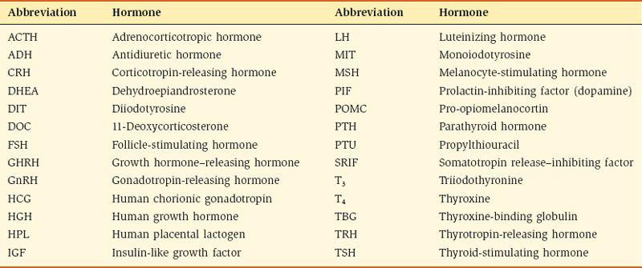

고전적인 내분비샘은 시상하부, 뇌하수체의 전엽과 후엽, 갑상선, 부갑상선, 부신 피질, 부신 수질, 생식선, 태반, 췌장입니다. 신장도 내분비선으로 간주되며 내분비 세포는 위장관 전체에서 발견됩니다. [표 9-2](#filepos1867151)에는 주요 호르몬과 그 기원샘, 화학적 성질, 주요 작용을 요약하고 있다. 그 동반자인 [그림 9-1](#filepos1867818)은 내분비샘과 호르몬 분비를 그림으로 요약한 것이다.

표 9-2 내분비샘과 호르몬 작용 요약

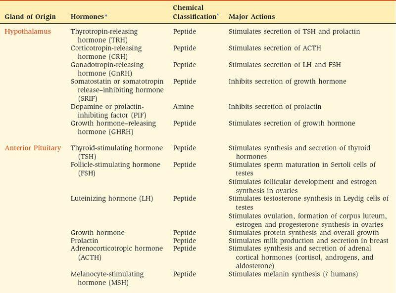

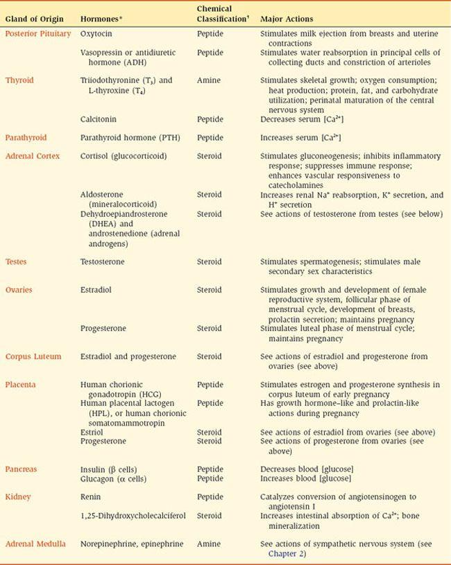

[\*](#filepos1867320)호르몬의 표준 약어는 괄호 안에 표시됩니다.

[†](#filepos1867320)펩타이드는 펩타이드와 단백질을 모두 의미합니다.

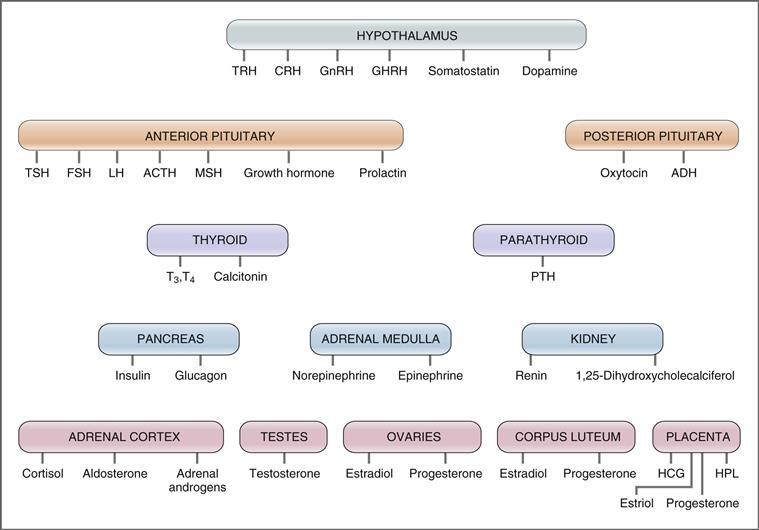

**그림 9-1 내분비샘과 각 분비선에서 분비되는 호르몬.** 이 그림에 사용된 약어는 [표 9-1](#filepos1866295)을 참조하세요.

### 호르몬 합성

호르몬은 펩타이드, 단백질, 스테로이드 또는 아민의 세 가지 클래스 중 하나로 분류됩니다. 각 클래스는 생합성 경로가 다릅니다. 펩타이드와 단백질 호르몬은 아미노산에서 합성됩니다. 스테로이드 호르몬은 콜레스테롤의 유도체입니다. 아민 호르몬은 티로신의 유도체입니다.

#### 펩타이드 및 단백질 호르몬 합성

대부분의 호르몬은 본질적으로 펩타이드 또는 단백질입니다. 생합성 경로는 생화학에서 잘 알려져 있습니다. 펩타이드의 1차 아미노산 서열은 해당 호르몬 유전자에서 전사된 특정 메신저 리보뉴클레오티드(mRNA)에 의해 결정됩니다. 펩타이드 호르몬의 생합성 경로는 [그림 9-2](#filepos1869283)에 요약되어 있다. 그림에서 원 안의 숫자는 다음 단계에 해당합니다.

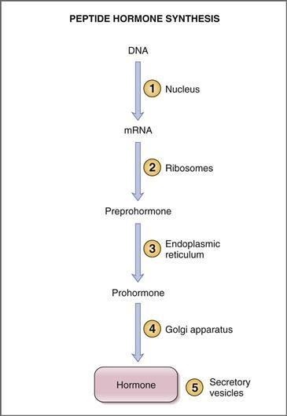

**그림 9-2 펩타이드 호르몬 합성에 관련된 단계.** 원 안의 숫자에 대한 설명은 본문을 참조하세요. DNA, 디옥시리보핵산; mRNA, 메신저 리보핵산.

1. **핵**에서는 호르몬 유전자가 **mRNA**로 전사됩니다. 일반적으로 단일 유전자가 각 펩타이드 호르몬의 1차 구조를 지시하는 역할을 담당합니다. (거의 모든 펩타이드 호르몬의 유전자가 클로닝되었기 때문에 재조합 DNA 기술을 이용하면 인간 펩타이드 호르몬의 합성이 가능해집니다.)
2. mRNA는 세포질로 전달되어 **리보솜**에서 첫 번째 단백질 산물인 **프리프로호르몬**으로 번역됩니다. mRNA의 번역은 N 말단의 신호 펩타이드에서 시작됩니다. 번역이 중단되고 신호 펩타이드가 "도킹 단백질"을 통해 소포체의 수용체에 부착됩니다. 번역은 전체 펩타이드 서열(즉, 프리프로호르몬)이 생성될 때까지 소포체에서 계속됩니다.
3. 신호 펩타이드는 ** 소포체**에서 제거되어 프리프로호르몬을 **프로호르몬**으로 전환합니다. 프로호르몬에는 완전한 호르몬 서열과 기타 펩타이드 서열이 포함되어 있으며 이는 최종 단계에서 제거됩니다. 프로호르몬의 "다른" 펩타이드 서열 중 일부는 호르몬의 적절한 접힘(예: 분자내 결합 형성)에 필요합니다.
4. 프로호르몬은 **골지체**로 전달되어 분비 소포에 포장됩니다. 분비 소포에서 단백질 분해 효소는 프로호르몬의 펩타이드 서열을 절단하여 최종 **호르몬**을 생성합니다. 골지체의 다른 기능으로는 호르몬의 글리코실화와 인산화가 있습니다.
5. 최종 호르몬은 내분비 세포가 자극될 때까지 **분비 소포**에 저장됩니다. 예를 들어, 부갑상선 호르몬(PTH)은 부갑상선 주요 세포의 소포에 합성되어 저장됩니다. PTH 분비 자극은 낮은 세포외 칼슘(Ca2+) 농도입니다. 부갑상선의 센서가 낮은 세포외 Ca2+ 농도를 감지하면 분비 소포가 세포막으로 전위되어 세포외유출에 의해 PTH를 혈액으로 배출합니다. 코펩티드 및 절단 효소를 포함하는 분비 소포의 다른 구성성분은 PTH와 함께 압출됩니다.

#### 스테로이드 호르몬 합성

스테로이드 호르몬은 부신 피질, 생식선, 황체 및 태반에서 합성되고 분비됩니다. 스테로이드 호르몬에는 코티솔, 알도스테론, 에스트라디올과 에스트리올, 프로게스테론, 테스토스테론, 1,25-디하이드록시콜레칼시페롤이 있습니다. 모든 스테로이드 호르몬은 **콜레스테롤**의 파생물이며, 이는 측쇄의 제거 또는 추가, 수산화 또는 스테로이드 핵의 방향화에 의해 변형됩니다. 이 장에서는 부신피질 호르몬과 1,25-디하이드록시콜레칼시페롤의 생합성 경로를 논의합니다. 성 스테로이드 호르몬의 경로는 [10장](CR%21G9RE0KW4PD33Q9F3DXNCSBNXCANP_split_022.html#filepos2161205)에서 논의됩니다.

#### 아민 호르몬 합성

아민 호르몬은 카테콜아민(에피네프린, 노르에피네프린, 도파민)과 갑상선 호르몬입니다. 아민 호르몬은 아미노산 **티로신**의 파생물입니다. 카테콜아민의 생합성 경로는 [1장](CR%21G9RE0KW4PD33Q9F3DXNCSBNXCANP_split_007.html#filepos27757)에서 논의됩니다. 갑상선 호르몬의 경로는 이 장에서 논의됩니다.

### 호르몬 분비 조절

항상성을 유지하려면 필요에 따라 호르몬 분비를 켜고 꺼야 합니다. 분비율의 조정은 신경 메커니즘이나 피드백 메커니즘을 통해 이루어질 수 있습니다. **신경 메커니즘**은 신경절전 교감 신경이 부신 수질에 시냅스를 형성하고 자극을 받으면 카테콜아민이 순환계로 분비되는 카테콜아민 분비로 설명됩니다. **피드백 메커니즘**은 신경 메커니즘보다 더 일반적입니다. "피드백"이라는 용어는 호르몬에 대한 생리적 반응의 일부 요소가 호르몬을 분비하는 내분비선에 직접 또는 간접적으로 "피드백"하여 분비 속도를 변화시키는 것을 의미합니다. 피드백은 부정적일 수도 있고 긍정적일 수도 있습니다. 부정적인 피드백은 호르몬 분비를 조절하는 가장 중요하고 일반적인 메커니즘입니다. 긍정적인 피드백은 거의 없습니다.

#### 부정적인 피드백

부정적인 피드백의 원리는 사실상 모든 기관 시스템의 항상성 조절의 기초가 됩니다. 예를 들어, [4장](CR%21G9RE0KW4PD33Q9F3DXNCSBNXCANP_split_011.html#filepos530928)에서는 혈압의 작은 변화가 혈압을 정상으로 되돌리는 메커니즘을 활성화하거나 활성화하는 동맥 혈압 조절에 대한 부정적인 피드백이 논의됩니다. 동맥 혈압의 감소는 혈압을 높이는 조정 메커니즘을 활성화하는 압수용기에 의해 감지됩니다. 혈압이 정상으로 돌아오면 압수용기가 더 이상 장애를 감지하지 않으며 이전에 활성화된 메커니즘이 꺼집니다. 피드백 메커니즘이 더 민감할수록 정상보다 높거나 낮은 혈압의 "이동"이 작아집니다.

내분비계에서 음성 피드백은 *호르몬 작용의 일부 특징이 직접 또는 간접적으로 호르몬의 추가 분비를 억제한다는 것을 의미합니다.* 음성 피드백 루프는 [그림 9-3](#filepos1876953)에 설명되어 있습니다. 설명의 목적으로 시상하부는 뇌하수체 전엽과 관련하여 표시되며, 이는 말초 내분비선과 관련하여 표시됩니다. 그림에서 시상하부는 뇌하수체 전엽 호르몬의 분비를 자극하는 방출 호르몬을 분비합니다. 그런 다음 뇌하수체 전엽 호르몬은 말초 내분비선(예: 고환)에 작용하여 호르몬(예: 테스토스테론)의 분비를 유발하고, 이 호르몬(예: 테스토스테론)은 표적 조직(예: 골격근)에 작용하여 생리학적 활동을 생성합니다. 호르몬은 뇌하수체 전엽과 시상하부에 '피드백'하여 호르몬 분비를 억제합니다. **긴 루프 피드백**은 호르몬이 시상하부-뇌하수체 축에 *완전히* 피드백된다는 의미입니다. **짧은 루프 피드백**은 뇌하수체 전엽 호르몬이 시상하부로 피드백되어 시상하부 방출 호르몬의 분비를 억제한다는 것을 의미합니다. 그림에는 보이지 않는 **초단거리 피드백**이라는 세 번째 가능성이 있는데, 여기서 시상하부 호르몬은 자체 분비를 억제합니다(예: 성장 호르몬 방출 호르몬[GHRH]은 GHRH 분비를 억제합니다).

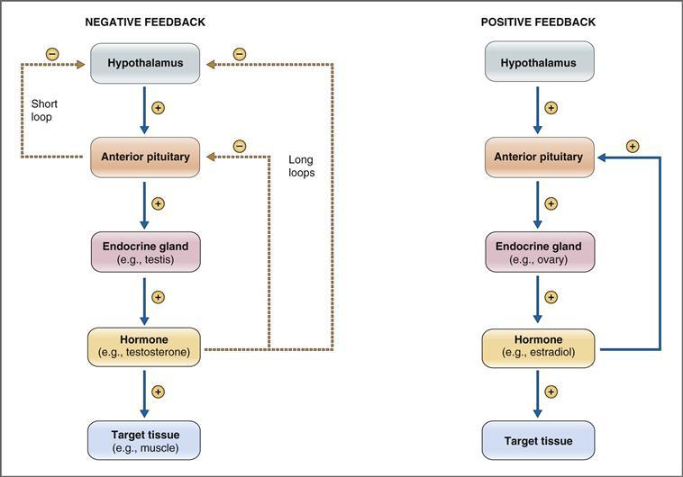

**그림 9–3 음성 및 양성 피드백 메커니즘.** 이 그림에서는 시상하부-뇌하수체 축이 예로 사용됩니다. *실선* 및 *더하기* (+) *기호*는 자극을 나타냅니다. *점선* 및 *빼기* (-) *기호*는 억제를 나타냅니다.

부정적인 피드백의 최종 결과는 호르몬 수치가 (생리적 작용에 의해) 적절하거나 높다고 판단될 때 호르몬의 추가 분비가 억제된다는 것입니다. 호르몬 수치가 부족하거나 낮다고 판단되면 호르몬 분비가 촉진됩니다.

시상하부-뇌하수체 축을 활용하지 않는 부정적인 피드백의 다른 예도 있습니다. 예를 들어 **인슐린**은 혈당 농도를 조절합니다. 차례로, 혈당 농도의 변화에 ​​따라 인슐린 분비가 켜지거나 꺼집니다. 따라서 혈당 농도가 높으면 췌장에서 인슐린 분비가 활성화됩니다. 그러면 인슐린은 표적 조직(간, 근육, 지방)에 작용하여 혈당 농도를 정상 수준으로 낮춥니다. 포도당 농도가 충분히 낮다고 감지되면 인슐린은 더 이상 필요하지 않으며 인슐린 분비도 중단됩니다.

#### 긍정적인 피드백

긍정적인 피드백은 흔하지 않습니다. 긍정적인 피드백이 있으면 호르몬 작용의 일부 특징으로 인해 호르몬이 *더 많이* 분비됩니다([그림 9-3](#filepos1876953) 참조). 자기 제한적인 부정적인 피드백과 비교할 때 긍정적인 피드백은 자기 강화적입니다. 생물학적 시스템에서는 드물지만 긍정적인 피드백이 발생하면 폭발적인 사건이 발생합니다.

양성 피드백의 비호르몬적 예는 **활동 전위가 상승**하는 동안 신경 나트륨(Na+) 채널이 열리는 것입니다. 탈분극은 전압에 민감한 Na+ 채널을 열고 Na+가 세포로 유입되도록 하여 더 많은 탈분극과 더 많은 Na+ 유입을 유도합니다. 이러한 자체 강화 과정은 빠르고 폭발적인 상승 스트로크를 생성합니다.

호르몬 시스템에서 긍정적 피드백의 주요 예는 월경 주기 중간 지점에 뇌하수체 전엽에 의한 난포 자극 호르몬(**FSH**) 및 황체 형성 호르몬(**LH**) 분비에 대한 **에스트로겐**의 효과입니다. 월경주기의 난포기 동안 난소는 에스트로겐을 분비하는데, 이는 뇌하수체 전엽에 작용하여 FSH와 LH 분비를 빠르게 증가시킵니다. FSH와 LH는 난소에 두 가지 영향을 미칩니다: 배란*과* 에스트로겐 분비 자극. 따라서 난소에서 분비된 에스트로겐은 뇌하수체 전엽에 작용하여 FSH와 LH의 분비를 유발하고, 이러한 뇌하수체 전엽 호르몬은 *더 많은* 에스트로겐 분비를 유발합니다. 이 예에서 폭발적인 사건은 배란 이전에 FSH와 LH가 폭발하는 것입니다.

호르몬 긍정적 피드백의 두 번째 예는 **옥시토신**입니다. 자궁경부가 확장되면 뇌하수체 후엽에서 옥시토신이 분비됩니다. 결과적으로 옥시토신은 자궁 수축을 자극하여 자궁 경부를 더욱 확장시킵니다. 이 예에서 폭발적인 사건은 출산, 즉 태아의 출산입니다.

### 호르몬 수용체의 조절

이전 섹션에서는 일반적으로 부정적인 피드백을 통해 호르몬 순환 수준을 조절하는 메커니즘을 설명했습니다. 순환하는 호르몬 수치가 중요하기는 하지만 이것이 표적 조직의 반응을 결정하는 유일한 요인은 *아닙니다*. 반응하려면 표적 조직이 호르몬을 인식하는 특정 수용체를 보유해야 합니다. 이러한 수용체는 생리적 반응을 생성하는 세포 메커니즘과 결합됩니다. (결합 메커니즘은 호르몬 작용 메커니즘 섹션에서 논의됩니다.)

호르몬에 대한 표적 조직의 반응성은 **용량-반응 관계**로 표현되며, 여기서 반응의 크기는 호르몬 농도와 상관관계가 있습니다. 호르몬 농도가 증가함에 따라 반응은 일반적으로 증가한 다음 감소합니다. **민감도**는 최대 반응의 50%를 생성하는 호르몬 농도로 정의됩니다. 최대 반응의 50%를 생성하기 위해 더 많은 호르몬이 필요하다면 표적 조직의 민감도가 감소한 것입니다. 호르몬이 덜 필요하면 표적 조직의 민감도가 증가합니다.

표적 조직의 반응성이나 민감도는 수용체의 *수*를 변경하거나 호르몬에 대한 수용체의 *친화도*를 변경하는 두 가지 방법 중 하나로 변경될 수 있습니다. 호르몬 수용체의 수가 많을수록 최대 반응도 커집니다. 호르몬에 대한 수용체의 친화력이 높을수록 반응 가능성이 높아집니다.

수용체의 수나 친화도의 변화를 하향 조절 또는 상향 조절이라고 합니다. **하향 조절**은 호르몬에 대한 수용체의 수 또는 수용체의 친화력이 감소했음을 의미합니다. **상향 조절**은 수용체의 수 또는 친화도가 증가했음을 의미합니다. 호르몬은 표적 조직에서 자신의 수용체를 하향 조절하거나 상향 조절할 수 있으며 심지어 다른 호르몬에 대한 수용체도 조절할 수 있습니다.

#### 하향 규제

하향 조절은 호르몬이 표적 조직에서 수용체의 수나 친화력을 *감소*시키는 메커니즘입니다. 하향 조절은 새로운 수용체의 합성을 감소시키거나, 기존 수용체의 분해를 증가시키거나, 수용체를 비활성화함으로써 발생할 수 있습니다. 하향 조절의 목적은 호르몬 수치가 장기간 동안 높을 때 표적 조직의 민감도를 줄이는 것입니다. 하향 조절이 발생하면 호르몬 수치는 여전히 높게 유지되지만 호르몬에 대한 반응은 감소합니다. 하향 조절의 예는 자궁 내 자체 수용체에 대한 **프로게스테론**의 효과입니다([10장](CR%21G9RE0KW4PD33Q9F3DXNCSBNXCANP_split_022.html#filepos2161205) 참조).

하향 조절은 다른 관련 호르몬의 수용체에 대한 호르몬의 영향을 나타낼 수도 있습니다. 이러한 유형의 하향 조절은 프로게스테론으로도 설명됩니다. 자궁에서 프로게스테론은 자체 수용체를 하향 조절하고* 에스트로겐 수용체도 하향 조절합니다. 이러한 유형의 하향 조절의 두 번째 예는 갑상선 시스템에서 볼 수 있습니다. 트리요오드티로닌(**T3**)은 뇌하수체 전엽의 갑상선 자극 호르몬 방출 호르몬(TRH) 수용체의 민감도를 감소시킵니다. 전반적인 효과는 만성적으로 높은 수준의 T3가 시상하부-뇌하수체-갑상선 축의 전반적인 반응성을 감소시킨다는 것입니다.

#### 상향 규제

수용체의 상향 조절은 호르몬이 수용체의 수나 친화력을 *증가*시키는 메커니즘입니다. 상향 조절은 새로운 수용체의 합성 증가, 기존 수용체의 분해 감소 또는 수용체 활성화를 통해 발생할 수 있습니다. 예를 들어, **프로락틴**은 유방의 수용체 수를 증가시키고, **성장 호르몬**은 골격근과 간의 수용체 수를 증가시키며, **에스트로겐**은 자궁의 수용체 수를 증가시킵니다.

호르몬은 또한 다른 호르몬에 대한 수용체를 상향 조절할 수도 있습니다. 예를 들어, 에스트로겐은 자궁 내 자체 수용체를 상향 조절할 뿐만 아니라 난소의 LH 수용체도 상향 조절합니다.

### 호르몬 활동과 두 번째 전달자의 메커니즘

표적 세포에 대한 호르몬 작용은 호르몬이 막 수용체에 결합하여 호르몬-수용체 복합체를 형성할 때 시작됩니다. 많은 호르몬 시스템에서 호르몬-수용체 복합체는 구아노신 삼인산(GTP) 결합 단백질(G 단백질)에 의해 이펙터 단백질과 결합됩니다. 이펙터 단백질은 일반적으로 아데닐릴 시클라제 또는 포스포리파제 C 효소입니다. 이펙터 단백질이 활성화되면 cAMP 또는 IP3(이노시톨 1,4,5-삼인산)이라는 두 번째 전달자가 생성되어 원래의 호르몬 신호를 증폭하고 생리학적 활동을 조정합니다.

표적 세포에 대한 호르몬 작용의 주요 메커니즘은 **아데닐릴 시클라제** 메커니즘이며, 여기서 cAMP는 두 번째 전달자입니다. IP3/Ca2+가 두 번째 전달자인 **포스포리파제 C** 메커니즘; 그리고 **스테로이드 호르몬** 메커니즘. 또한, 인슐린과 인슐린 유사 성장 인자(IGF)는 **티로신 키나제** 메커니즘을 통해 표적 세포에 작용합니다. 마지막으로, 여러 호르몬이 **구아닐레이트 시클라제**를 활성화하는데, 여기서 고리형 구아노신 모노포스페이트(고리형 GMP 또는 cGMP)가 두 번째 전달자입니다. 주요 호르몬의 작용기전은 [표 9-3](#filepos1886868)에 요약되어 있다.

표 9-3 호르몬 작용의 메커니즘

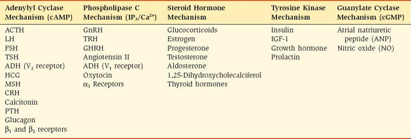

#### G 단백질

G 단백질은 자율 수용체와 관련하여 [2장](CR%21G9RE0KW4PD33Q9F3DXNCSBNXCANP_split_009.html#filepos253561)에서 논의됩니다. 간단히 말하면, G 단백질은 호르몬 수용체를 효과기 효소(예: 아데닐릴 시클라제)에 연결하는 막 결합 단백질 계열입니다. 따라서 G 단백질은 호르몬 작용이 진행될 수 있는지 여부를 결정하는 "분자 스위치" 역할을 합니다.

분자 수준에서 G 단백질은 이종삼량체(즉, 3개의 하위 단위를 가짐) 단백질입니다. 세 가지 하위 단위는 알파(α), 베타(β) 및 감마(γ)로 지정됩니다. α 소단위체는 구아노신 이인산(GDP) 또는 GTP와 결합할 수 있으며 GTPase 활성을 포함합니다. GDP가 α 서브유닛에 결합되면 G 단백질은 비활성화됩니다. GTP가 결합되면 G 단백질이 활성화되어 결합 기능을 수행할 수 있습니다. 구아노신 뉴클레오티드 방출 인자(GRF)는 GDP의 해리를 촉진하여 GTP가 더 빠르게 결합하도록 하는 반면, GTPase 활성화 인자(GAP)는 GTP의 가수분해를 촉진합니다. 따라서 GRF와 GAP의 상대적인 활성은 G 단백질 활성화의 전체 속도에 영향을 미칩니다.

G 단백질은 자극성 또는 억제성일 수 있으므로 **Gs** 또는 **Gi**라고 합니다. 자극 또는 억제 활성은 α 하위 단위(αs 또는 αi)에 있습니다. 따라서 GTP가 Gs 단백질의 αs 하위 단위에 결합되면 Gs 단백질은 효과기 효소(예: adenylyl cyclase)를 *자극*합니다. GTP가 Gi 단백질의 αi 서브유닛에 결합되면 Gi 단백질은 이펙터 효소를 *억제*합니다.

#### 아데닐릴 고리화효소 메커니즘

아데닐릴 시클라제/cAMP 메커니즘은 많은 호르몬 시스템에서 활용됩니다([표 9-3](#filepos1886868) 참조). 이 기전은 호르몬이 수용체에 결합하고, Gs 또는 Gi 단백질에 의해 결합된 다음, 아데닐릴 시클라제의 활성화 또는 억제를 통해 세포내 cAMP의 증가 또는 감소를 초래합니다. 두 번째 전달자인 cAMP는 호르몬 신호를 증폭시켜 최종 생리적 활동을 생성합니다.

adenylyl cyclase/cAMP 메커니즘의 단계는 [그림 9-4](#filepos1890170)에 나와 있습니다. 이 예에서 호르몬은 Gs 단백질(Gi 단백질이 아닌)을 활용합니다. 수용체-Gs-아데닐릴 사이클라제 복합체는 세포막에 내장되어 있습니다. 수용체에 호르몬이 결합되어 있지 않으면 Gs 단백질의 αs 하위 단위가 GDP에 결합합니다. 이 구성에서 Gs 단백질은 **비활성**입니다. 호르몬이 수용체에 결합하면 다음 단계([그림 9-4](#filepos1890170) 참조)가 발생합니다.

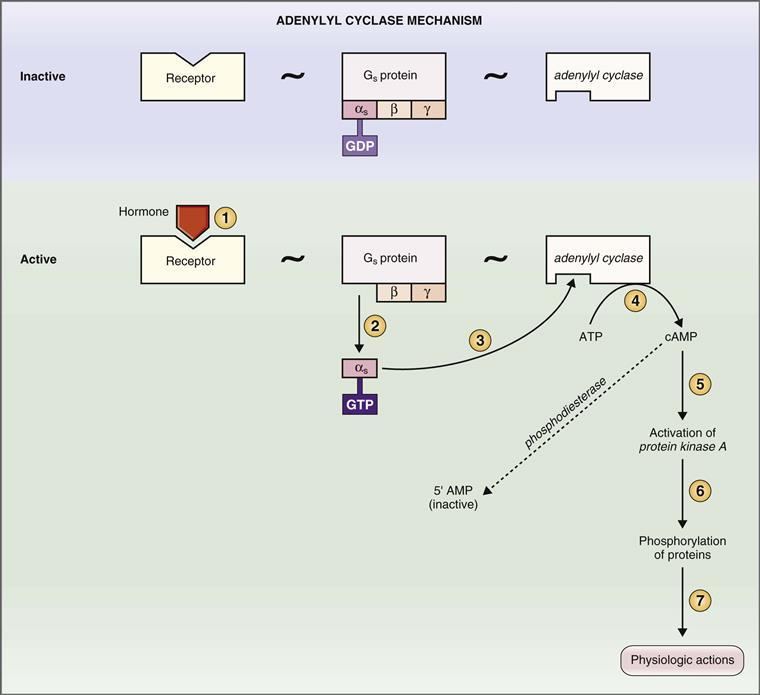

**그림 9–4 아데닐릴 시클라제(cAMP) 작용 메커니즘과 관련된 단계.** 원 안의 숫자에 대한 설명은 본문을 참조하십시오. AMP, 아데노신 모노포스페이트; ATP, 아데노신 삼인산; cAMP, 사이클릭 아데노신 모노포스페이트; GDP, 구아노신 디포스페이트; GTP, 구아노신 삼인산.

1. 호르몬은 세포막의 **수용체**에 결합하여 αs 하위 단위의 구조 변화를 생성합니다(1단계). 이는 두 가지 변화를 생성합니다. GDP는 αs 하위 단위에서 방출되어 GTP로 대체되고, αs 하위 단위는 Gs 단백질에서 분리됩니다(2단계).
2. **αs-GTP 복합체**는 세포막 내로 이동하여 아데닐릴 사이클라제에 결합하여 활성화시킵니다(3단계). 활성화된 **아데닐릴 시클라제**는 ATP를 두 번째 전달자 역할을 하는 cAMP로 전환하는 것을 촉매합니다(4단계). 표시되지는 않았지만 G 단백질의 고유한 GTPase 활성은 GTP를 다시 GDP로 변환하고 αs 하위 단위는 비활성 상태로 돌아갑니다.
3. **cAMP**는 **단백질 키나제 A**의 활성화와 관련된 일련의 단계를 통해 세포내 단백질을 인산화합니다(단계 5 및 6). 이러한 인산화된 단백질은 최종 생리적 작용을 실행합니다(7단계).
4. 세포내 cAMP는 **포스포디에스테라제** 효소에 의해 불활성 대사산물인 **5' AMP**로 분해되어 2차 전달자의 활동을 중단시킵니다.

#### 포스포리파제 C 메커니즘

포스포리파제 C(IP3/Ca2+) 메커니즘을 활용하는 호르몬도 [표 9-3](#filepos1886868)에 나열되어 있습니다. 이 메커니즘은 호르몬이 수용체에 결합하고 Gq 단백질을 통해 포스포리파제 C에 결합하는 것을 포함합니다. IP3 및 Ca2+의 세포 내 수준이 증가하여 최종 생리학적 작용을 생성합니다. 포스포리파제 C(IP3/Ca2+) 메커니즘의 단계는 [그림 9-5](#filepos1892792)에 나와 있습니다.

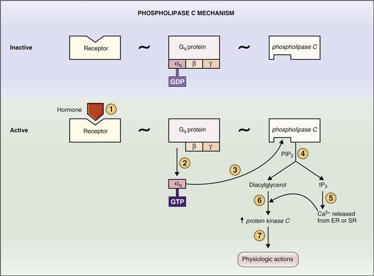

**그림 9–5 포스포리파제 C(IP3/Ca2+) 작용 메커니즘과 관련된 단계.** 원 안의 숫자에 대한 설명은 본문을 참조하세요. ER, 소포체; GDP, 구아노신 디포스페이트; GTP, 구아노신 삼인산염; IP3, 이노시톨 1,4,5-트리포스페이트; PIP2, 포스파티딜이노시톨 4,5-디포스페이트; SR, 근형질 세망.

수용체-Gq-포스포리파제 C 복합체는 세포막에 내장되어 있습니다. 수용체에 결합된 호르몬이 없으면 αq 하위 단위는 GDP에 결합합니다. 이 구성에서 Gq 단백질은 **비활성**입니다. 호르몬이 수용체에 결합하면 Gq가 활성화되어 다음 단계에서 포스포리파제 C를 활성화합니다([그림 9-5](#filepos1892792) 참조).

1. 호르몬은 세포막의 수용체에 결합하여 αq 하위 단위의 구조 변화를 생성합니다(1단계). GDP는 αq 하위 단위에서 방출되고 GTP로 대체되며 αq 하위 단위는 Gq 단백질에서 분리됩니다(2단계).
2. **αq-GTP 복합체**는 세포막 내로 이동하여 포스포리파제 C와 결합하여 활성화합니다(3단계). 활성화된 **포스포리파제 C**는 막 인지질인 포스파티딜이노시톨 4,5-디포스페이트(PIP2)로부터 디아실글리세롤과 IP3의 유리를 촉매합니다(4단계). 생성된 **IP3**는 소포체 또는 근형질 세망의 세포내 저장소에서 **Ca2+**를 방출하여 세포내 Ca2+ 농도를 증가시킵니다(5단계).
3. Ca2+와 디아실글리세롤은 함께 **단백질 키나제 C**를 활성화하여(6단계), 이는 단백질을 인산화하고 최종 생리적 작용을 생성합니다(7단계).

#### 촉매 수용체 메커니즘

일부 호르몬은 세포막의 세포내 측면에서 효소 활성을 갖거나 이와 연관된 세포 표면 수용체에 결합합니다. 이러한 소위 **촉매 수용체**에는 구아닐릴 사이클라제, 세린/트레오닌 키나제, 티로신 키나제 및 티로신 키나제 관련 수용체가 포함됩니다. Guanylyl cyclase는 GTP에서 순환 GMP 생성을 촉매합니다. 키나아제는 단백질의 세린, 트레오닌 또는 티로신을 인산화하여 인산기 형태로 음전하를 추가합니다. 표적 단백질의 인산화는 호르몬의 생리적 작용을 담당하는 구조적 변화를 초래합니다.

##### *구아닐릴 시클라아제*

구아닐릴 사이클라제 메커니즘을 통해 작용하는 호르몬도 [표 9-3](#filepos1886868)에 나열되어 있습니다. **심방 나트륨 이뇨 펩타이드(ANP)** 및 관련 나트륨 이뇨 펩타이드는 다음과 같이 *수용체* 구아닐릴 사이클라제 메커니즘을 통해 작용합니다([4장](CR%21G9RE0KW4PD33Q9F3DXNCSBNXCANP_split_011.html#filepos530928 참조). [6](CR%21G9RE0KW4PD33Q9F3DXNCSBNXCANP_split_015.html#filepos1181244)). 수용체의 세포외 도메인에는 ANP에 대한 결합 부위가 있는 반면, 수용체의 세포내 도메인에는 구아닐릴 시클라제 활성이 있습니다. ANP의 결합은 구아닐릴 시클라제의 활성화 및 GTP의 고리형 GMP로의 전환을 유발합니다. 그런 다음 순환 GMP는 순환 GMP 의존성 키나제를 활성화하여 ANP의 생리적 작용을 담당하는 단백질을 인산화합니다.

**산화질소(NO)**는 다음과 같이 *세포질* 구아닐릴 시클라제를 통해 작용합니다([4장](CR%21G9RE0KW4PD33Q9F3DXNCSBNXCANP_split_011.html#filepos530928) 참조). 혈관 내피 세포의 합성효소는 아르기닌을 시트룰린으로 분해하고 NO를 분해합니다. 방금 합성된 NO는 내피 세포에서 인근 혈관 평활근 세포로 확산되어 수용성 또는 세포질의 구아닐릴 시클라제와 결합하여 활성화됩니다. GTP는 순환 GMP로 전환되어 혈관 평활근을 이완시킵니다.

##### *세린/트레오닌 키나제*

이전에 논의한 바와 같이, 수많은 호르몬은 **아데닐일 사이클라제** 및 **포스포리파제 C** 메커니즘의 일부로 G-단백질 연결 수용체를 활용합니다([표 9-3](#filepos1886868) 참조). 이러한 메커니즘에서 일련의 사건은 궁극적으로 각각 단백질 키나제 A 또는 단백질 키나제 C를 활성화합니다. 활성화된 키나제는 호르몬의 생리적 작용을 실행하는 단백질의 세린과 트레오닌 부분을 인산화합니다. 또한 **Ca2+-칼모듈린 의존성 단백질 키나제(CaMK)** 및 **미토겐 활성화 단백질 키나제(MAPK)**는 일련의 과정에서 생물학적 작용을 일으키는 세린과 트레오닌을 인산화합니다.

##### *티로신 키나제*

티로신 키나아제는 단백질의 티로신 부분을 인산화하며 두 가지 주요 범주로 분류됩니다. **수용체 티로신 키나제**는 수용체 분자 내에 *본질적인* 티로신 키나제 활성을 가지고 있습니다. **티로신 키나제 관련 수용체**는 본질적인 티로신 키나제 활성을 갖지 않지만, 그러한 활성을 갖는 단백질과 *비공유적으로 결합*합니다([그림 9-6](#filepos1898732)).

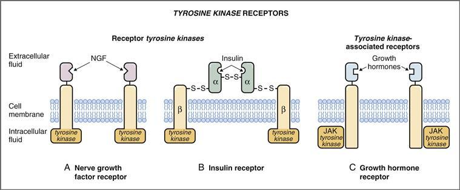

**그림 9–6 티로신 키나제 수용체.** 신경 성장 인자 **(A)** 및 인슐린 **(B)**는 고유한 티로신 키나제 활성을 갖는 수용체 티로신 키나제를 활용합니다. 성장 호르몬 **(C)**는 티로신 키나제 관련 수용체를 활용합니다. NGF, 신경 성장 인자; JAK, 수용체 관련 티로신 키나제의 야누스 계열.

 **수용체 티로신 키나제**에는 호르몬이나 리간드와 결합하는 세포외 결합 도메인, 소수성 막횡단 도메인, 티로신 키나제 활성을 포함하는 세포내 도메인이 있습니다. 호르몬이나 리간드에 의해 활성화되면 내인성 티로신 키나제는 자신과 다른 단백질을 인산화합니다.

수용체 티로신 키나제의 한 유형은 단량체입니다(예: **신경 성장 인자[NGF] 및 표피 성장 인자 수용체,** [그림 9-6*A*](#filepos1898732) 참조). 이 단량체 유형에서, 리간드가 세포외 도메인에 결합하면 수용체의 이량체화, 내재성 티로신 키나제의 활성화, 자체 및 다른 단백질의 티로신 부분의 인산화가 발생하여 생리학적 작용이 발생합니다.

또 다른 유형의 수용체 티로신 키나제는 이미 이량체입니다(예: **인슐린 및 인슐린 유사 성장 인자[IGF] 수용체,** [그림 9-6*B*](#filepos1898732) 참조). 이 이합체 유형에서는 리간드(예: 인슐린)의 결합이 내인성 티로신 키나제를 활성화하고 자체 및 다른 단백질의 인산화를 유도하여 궁극적으로 호르몬의 생리적 작용을 유도합니다. 인슐린 수용체의 메커니즘은 이 장의 뒷부분에서도 논의됩니다.

 **티로신 키나제 관련 수용체**(예: **성장 호르몬 수용체,** [그림 9-6*C*](#filepos1898732) 참조)도 세포외 도메인, 소수성 막횡단 도메인 및 세포내 도메인을 가지고 있습니다. 그러나 수용체 티로신 키나제와 달리 세포내 도메인은 티로신 키나제 활성을 갖지 않지만 Janus 키나제 계열(**JAK**, 수용체 관련 티로신 키나제의 Janus 계열 또는 "단지 또 다른 키나제")과 같은 티로신 키나제와 비공유적으로 "결합"됩니다. 호르몬은 세포외 도메인에 결합하여 수용체 이량체화 및 관련 단백질(예: JAK)의 티로신 키나제 활성화를 유도합니다. 관련된 티로신 키나제는 그 자체, 호르몬 수용체 및 기타 단백질의 티로신 부분을 인산화합니다. JAK의 하류 표적에는 **STAT**(신호 변환기 및 전사 활성화제) 계열의 구성원이 포함되며, 이는 mRNA의 전사를 유발하고 궁극적으로 호르몬의 생리적 작용과 관련된 새로운 단백질을 유발합니다.

#### 스테로이드 및 갑상선 호르몬 메커니즘

스테로이드 호르몬과 갑상선 호르몬은 동일한 작용 메커니즘을 가지고 있습니다. 펩타이드 호르몬에 의해 활용되고 세포막 수용체 및 세포내 2차 전달자 생성과 관련된 아데닐릴 사이클라제 및 포스포리파제 C 메커니즘과 달리, 스테로이드 호르몬 메커니즘은 DNA 전사 및 새로운 단백질의 합성을 시작하는 세포질(또는 핵) 수용체([그림 9-7](#filepos1902757))에 결합하는 것과 관련됩니다. 표적 세포에 신속하게(몇 분 내에) 작용하는 펩타이드 호르몬과 달리 스테로이드 호르몬은 **느리게 작용**합니다(몇 시간 소요).

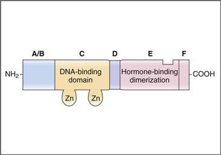

**그림 9–7 세포질(또는 핵) 스테로이드 호르몬 수용체의 구조.** 문자 A~F는 수용체의 6개 도메인을 나타냅니다. DNA, 디옥시리보핵산.

스테로이드 호르몬의 메커니즘([그림 9-8](#filepos1903325))의 단계는 다음과 같다.

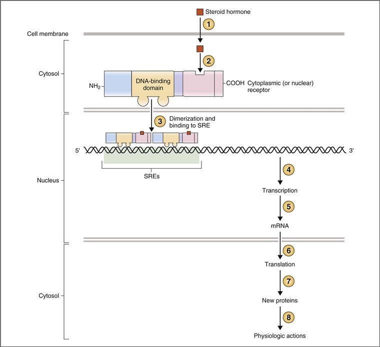

**그림 9-8 스테로이드 호르몬 작용 메커니즘과 관련된 단계.** 원 안의 숫자에 대한 설명은 본문을 참조하십시오. DNA, 디옥시리보핵산; mRNA, 메신저 리보핵산; SRE, 스테로이드 반응 요소.

1. 스테로이드 호르몬은 세포막을 통과하여 확산되어 표적 세포로 들어가고(1단계), 세포질([그림 9-8](#filepos1903325) 참조)이나 핵에 위치한 특정 **수용체 단백질**(2단계)과 결합합니다. 스테로이드 호르몬 수용체는 세포내 수용체의 유전자 슈퍼패밀리의 일부인 단량체성 인단백질입니다. 각 수용체에는 6개의 도메인이 있습니다([그림 9-7](#filepos1902757) 참조). 스테로이드 호르몬은 C 말단 근처에 위치한 **E 도메인**에 결합합니다. 중앙 **C 도메인**은 다양한 스테로이드 호르몬 수용체 사이에서 고도로 보존되어 있으며 두 개의 징크 핑거를 갖고 있으며 DNA 결합을 담당합니다. 호르몬이 결합하면 수용체는 형태 변화를 겪고 활성화된 호르몬-수용체 복합체는 표적 세포의 핵으로 들어갑니다.
2. 호르몬-수용체 복합체는 **이량체화**하고 표적 유전자의 5' 영역에 위치한 **스테로이드 반응 요소**(**SREs**)라고 불리는 특정 DNA 서열에 (C 도메인에서) 결합합니다(3단계).
3. 호르몬-수용체 복합체는 이제 해당 유전자의 전사 속도를 조절하는 **전사 인자**가 되었습니다(4단계). 새로운 **메신저 RNA**(**mRNA**)는 전사되고(5단계) 핵을 떠나며(6단계), 특정 생리학적 작용을 하는 새로운 단백질로 번역됩니다(7단계)(8단계). **새로운 단백질**의 특성은 호르몬에 따라 다르며 호르몬 작용의 특이성을 설명합니다. 예를 들어, 1,25-디하이드록시콜레칼시페롤은 장에서 Ca2+ 흡수를 촉진하는 Ca2+ 결합 단백질의 합성을 유도합니다. 알도스테론은 신장에서 Na+ 재흡수를 촉진하는 신장 주요 세포에서 Na+ 채널(ENaC)의 합성을 유도합니다. 테스토스테론은 골격근 단백질의 합성을 유도합니다.

### 시상하부-뇌하수체 관계

시상하부와 뇌하수체는 조화롭게 기능하여 많은 내분비 시스템을 조율합니다. 시상하부-뇌하수체 단위는 갑상선, 부신, 생식선의 기능을 조절하고 성장, 우유 생산 및 배출, 삼투압 조절도 조절합니다. 시상하부와 뇌하수체 사이의 해부학적 관계를 시각화하는 것이 중요합니다. 왜냐하면 이러한 관계가 분비선 사이의 기능적 연결의 기초가 되기 때문입니다.

뇌하수체라고도 불리는 뇌하수체는 후엽과 전엽으로 구성됩니다. **후엽**(또는 뇌하수체 후엽)은 신경하수체라고도 합니다. **전엽**(또는 뇌하수체 전엽)은 샘하수체라고도 합니다. 시상하부는 **누두부**라고 불리는 얇은 줄기로 뇌하수체와 연결되어 있습니다. 기능적으로 시상하부는 신경 및 호르몬 메커니즘을 통해 뇌하수체를 제어합니다([그림 9-9](#filepos1907145)).

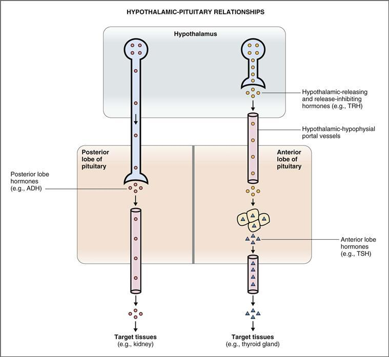

**그림 9-9 시상하부와 뇌하수체 후엽 및 전엽 사이의 관계를 보여주는 도식적 그림.**
*분홍색 원*은 뇌하수체 후엽 호르몬입니다. *노란색 원*은 시상하부 호르몬입니다. *삼각형*은 뇌하수체 전엽 호르몬입니다. ADH, 항이뇨 호르몬; TRH, 갑상선 자극 호르몬 방출 호르몬; TSH, 갑상선 자극 호르몬.

#### 시상하부와 뇌하수체 후엽의 관계

뇌하수체 후엽은 신경 조직에서 유래됩니다. 이는 항이뇨 호르몬(ADH)과 옥시토신이라는 두 가지 펩타이드 호르몬을 분비하는데, 이는 신장, 유방, 자궁 등 각각의 표적 조직에 작용합니다.

시상하부와 뇌하수체 후엽 사이의 연결은 신경입니다. 실제로 뇌하수체 후엽은 세포체가 시상하부에 위치한 신경 축삭의 집합체입니다. 따라서 후엽에서 분비되는 호르몬(ADH 및 옥시토신)은 실제로 **신경펩티드**, 즉 뉴런에서 분비되는 펩티드입니다.

ADH 및 옥시토신 분비 뉴런의 세포체는 시상하부 내의 시신경 및 방실핵에 위치합니다. 두 호르몬은 두 핵 모두에서 합성되지만 **ADH**는 주로 **시각상** 핵과 연관되고 **옥시토신**은 주로 **방실** 핵과 연관됩니다.

일단 세포체에서 합성된 호르몬(즉, 신경펩티드)은 신경분비 소포의 축색돌기를 따라 운반되어 뇌하수체 후엽의 구근 신경 말단에 저장됩니다. 세포체가 자극되면 신경분비 소포는 세포외유출에 의해 신경 말단에서 방출되고 분비된 호르몬은 천공된 모세혈관 근처로 들어갑니다. 뇌하수체 후엽의 정맥혈은 전신 순환계로 들어가 호르몬을 표적 조직에 전달합니다.

요약하면, 시상하부와 뇌하수체 후엽 사이의 관계는 간단합니다. 호르몬을 분비하는 뉴런은 시상하부에 세포체를 갖고 뇌하수체 후엽에 축색돌기를 갖고 있습니다.

#### 시상하부와 뇌하수체의 관계

뇌하수체 전엽은 원시 전장에서 파생됩니다. 신경 조직인 후엽과 달리 전엽은 주로 내분비 세포의 집합체입니다. 뇌하수체 전엽에서는 갑상선 자극 호르몬(TSH), 난포 자극 호르몬(FSH), 황체 형성 호르몬(LH), 성장 호르몬, 프로락틴, 부신피질 자극 호르몬(ACTH) 등 6가지 펩티드 ​​호르몬을 분비합니다.

시상하부와 뇌하수체 전엽 사이의 관계의 본질은 신경과 내분비 둘 다입니다(후엽은 신경만 있음). 시상하부와 뇌하수체 전엽은 전엽에 혈액 공급의 대부분을 제공하는 **시상하부-하수체 문맥 혈관**에 의해 직접 연결됩니다.

길고 짧은 뇌하수체 문맥이 있으며 다음과 같이 구분됩니다. 동맥혈은 일차 모세혈관 신경총이라고 불리는 정중 융기의 모세혈관 네트워크에 혈액을 분배하는 상부 뇌하수체 동맥을 통해 시상하부로 전달됩니다. 이러한 일차 모세혈관 신경총은 모여서 ***긴* 뇌하수체 문맥 혈관**을 형성하며, 이 혈관은 누두 아래로 이동하여 시상하부 정맥혈을 뇌하수체 전엽으로 전달합니다. 평행한 모세혈관 신경총은 누두줄기의 하부에 있는 하하하수체 동맥으로부터 형성됩니다. 이러한 모세혈관은 모여 뇌하수체 전엽에 혈액을 전달하는 ***짧은* 뇌하수체 문맥**을 형성합니다. 요약하면, 뇌하수체 전엽의 혈액 공급은 다른 기관의 혈액 공급과 다릅니다. 혈액 공급의 대부분은 길고 짧은 뇌하수체 문맥에서 공급되는 시상하부의 *정맥* 혈액입니다.

뇌하수체 전엽으로의 문맥 혈액 공급에는 두 가지 중요한 의미가 있습니다. (1) 시상하부 호르몬은 고농도로 뇌하수체 전엽에 직접 전달될 수 있으며, (2) 시상하부 호르몬은 고농도로 전신 순환에 나타나지 않습니다. 그러므로 뇌하수체 전엽 세포는 신체에서 고농도의 시상하부 호르몬을 받는 유일한 세포입니다.

시상하부와 뇌하수체 전엽 사이의 *기능적* 연결은 이제 *해부학적* 연결의 맥락에서 이해될 수 있습니다. 시상하부 방출 호르몬과 방출 억제 호르몬은 시상하부 뉴런의 세포체에서 합성되어 이들 뉴런의 축삭을 따라 시상하부 중앙 융기까지 이동합니다. 이러한 뉴런이 자극되면 호르몬은 주변 시상하부 조직으로 분비되어 근처 모세혈관 신경총으로 들어갑니다. 이러한 모세혈관(현재 정맥혈)의 혈액은 뇌하수체 문맥으로 배출되어 뇌하수체 전엽으로 직접 전달됩니다. 그곳에서 시상하부 호르몬은 전엽 세포에 작용하여 뇌하수체 전엽 호르몬의 방출을 자극하거나 억제합니다. 뇌하수체 전엽 호르몬은 전신 순환계로 들어가 표적 조직으로 전달됩니다.

시상하부-뇌하수체 전엽 관계는 TRH-TSH-갑상선 호르몬 시스템을 고려하여 설명할 수 있습니다. **TRH**는 시상하부 뉴런에서 합성되고 시상하부 중앙융기에서 분비되며, 그곳에서 모세혈관으로 들어간 다음 뇌하수체 문맥으로 들어갑니다. 이 문맥 혈액을 통해 뇌하수체 전엽으로 전달되어 TSH 분비를 자극합니다. **TSH**는 전신 순환계로 들어가 표적 조직인 갑상선으로 전달되어 **갑상선 호르몬**의 분비를 자극합니다.

### 전엽 호르몬

뇌하수체 전엽에서는 TSH, FSH, LH, ACTH, 성장 호르몬, 프로락틴 등 6가지 주요 호르몬이 분비됩니다. 각 호르몬은 서로 다른 세포 유형에서 분비됩니다(동일한 세포 유형에서 분비되는 FSH와 LH 제외). 세포 유형은 영양을 의미하는 접미사 "troph"로 표시됩니다. 따라서 TSH는 **갑상선 영양 세포**(5%)에 의해 분비되고, FSH와 LH는 **성선 영양 세포**(15%)에 의해, ACTH는 **피질 영양 세포**(15%)에 의해, 성장 호르몬은 **신체 영양 세포**(20%)에 의해, 프로락틴은 **유산 영양 세포**(15%)에 의해 분비됩니다. (백분율은 뇌하수체 전엽의 각 세포 유형을 나타냅니다.)

뇌하수체 전엽 호르몬 각각은 펩타이드 또는 폴리펩타이드입니다. 설명된 바와 같이, 펩타이드 호르몬의 합성에는 다음 단계가 포함됩니다: 핵에서 DNA를 mRNA로 전사하는 단계; 리보솜의 프리프로호르몬으로 mRNA의 번역; 최종 호르몬을 생산하기 위해 소포체와 골지체에 있는 프리프로호르몬의 번역 후 변형이 있습니다. 호르몬은 후속 방출을 위해 막 결합 분비 과립에 저장됩니다. 뇌하수체 전엽이 시상하부 방출 호르몬 또는 방출 억제 호르몬에 의해 자극되면(예: 갑상선 영양 세포가 TRH에 의해 자극되어 TSH를 분비함) 분비 과립이 세포외유출됩니다. 뇌하수체 전엽 호르몬(예: TSH)은 모세혈관으로 들어가고 전신 순환을 통해 표적 조직(예: 갑상선)으로 전달됩니다.

전엽의 호르몬은 구조적, 기능적 상동성에 따라 "계열"로 구성됩니다. TSH, FSH, LH는 구조적으로 연관되어 하나의 계열을 구성하고, ACTH는 두 번째 계열에 속하며, 성장호르몬과 프로락틴은 세 번째 계열을 구성합니다.

TSH, FSH, LH 및 ACTH는 이 섹션에서 간략하게 논의되고 이 장의 뒷부분에서는 해당 작업의 맥락에 대해 설명합니다. (TSH는 갑상선의 맥락에서 논의됩니다. ACTH는 부신 피질의 맥락에서 논의됩니다. FSH와 LH는 남성 및 여성의 생식 생리학과 함께 [10장](CR%21G9RE0KW4PD33Q9F3DXNCSBNXCANP_split_022.html#filepos2161205)에서 논의됩니다.) 성장 호르몬과 프로락틴은 이 섹션에서 논의됩니다.

#### TSH, FSH 및 LH 제품군

TSH, FSH 및 LH는 모두 폴리펩타이드 사슬의 아스파라긴 잔기와 공유 결합된 당 부분을 가진 **당단백질**입니다. 각 호르몬은 공유적으로 연결되지 않은 두 개의 하위 단위인 α와 β로 구성됩니다. 하위 단위 중 어느 것도 생물학적으로 활성이 없습니다. TSH, FSH 및 LH의 **α 하위 단위**는 동일하며 동일한 mRNA에서 합성됩니다. 각 호르몬의 **β 하위 단위**는 서로 다르기 때문에 생물학적 특이성을 부여합니다(β 하위 단위는 서로 다른 호르몬 간에 높은 수준의 상동성을 가지지만). 생합성 과정에서 α와 β 하위 단위의 쌍은 소포체에서 시작되어 골지체에서 계속됩니다. 분비 과립에서 한 쌍의 분자는 분비되기 전에 보다 안정적인 형태로 다시 접힙니다.

태반 호르몬 **인간 융모막 성선 자극 호르몬**(**HCG**)은 구조적으로 TSH-FSH-LH 계열과 관련이 있습니다. 따라서 HCG는 동일한 α 사슬과 자체 β 사슬을 갖는 당단백질로 생물학적 특이성을 부여합니다.

#### ACTH 가족

ACTH 계열은 단일 전구체인 **프로오피오멜라노코르틴(POMC)**에서 파생됩니다.** ACTH 계열에는 ACTH, γ- 및 β-리포트로핀, β-엔돌핀, 멜라닌 세포 자극 호르몬(MSH)이 포함됩니다. ACTH는 인간에게 생리학적 작용이 잘 확립된 이 계열의 유일한 호르몬입니다. MSH는 하등 척추동물의 색소 침착에 관여하지만 인간에서는 활동이 거의 없습니다. β-엔돌핀은 내인성 아편제입니다.

이 그룹의 프리프로호르몬인 **prepro-opiomelanocortin**은 단일 유전자에서 전사됩니다. 신호 펩타이드는 소포체에서 절단되어 ACTH 계열의 전구체인 POMC를 생성합니다. 그런 다음 엔도펩티다제는 POMC와 중간체의 펩타이드 결합을 가수분해하여 ACTH 계열의 구성원을 생성합니다([그림 9-10](#filepos1918751)). 인간의 뇌하수체 전엽은 주로 ACTH, γ-리포트로핀 및 β-엔돌핀을 생성합니다.

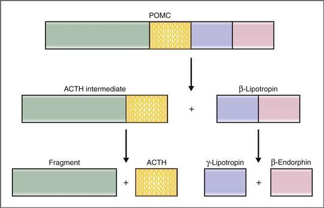

**그림 9–10 프로오피오멜라노코르틴(POMC)에서 파생된 호르몬.** 단편에는 γ-MSH가 포함되어 있습니다. ACTH에는 α-MSH가 포함되어 있습니다. γ-리포트로핀에는 β-MSH가 포함되어 있습니다. ACTH, 부신피질 자극 호르몬; MSH, 멜라닌 세포 자극 호르몬.

MSH 활성이 POMC와 여러 제품에서 발견된다는 점은 주목할 만합니다. ACTH 중간체의 가수분해로 인해 남은 "단편"에는 γ-MSH가 포함되어 있습니다. ACTH에는 α-MSH가 포함되어 있습니다. γ-리포트로핀에는 β-MSH가 포함되어 있습니다. 이러한 MSH 함유 단편은 혈중 농도가 증가하면 인간의 피부 색소 침착을 유발할 수 있습니다. 예를 들어 **애디슨병**(원발성 부신 부전)에서는 음성 피드백에 의해 POMC와 ACTH 수치가 증가합니다. POMC와 ACTH에는 MSH 활성이 포함되어 있으므로 피부 색소침착이 이 질환의 증상입니다.

#### 성장 호르몬

성장호르몬은 평생 동안 분비됩니다. 이는 성인 키까지의 **정상적인 성장**에 가장 중요한 단일 호르몬입니다. 이 작업(성장)의 광범위한 특성을 고려할 때 성장 호르몬이 단백질, 탄수화물 및 지방 대사에 지대한 영향을 미치는 것은 놀라운 일이 아닙니다.

##### *성장 호르몬의 화학*

성장 호르몬은 뇌하수체 전엽의 성장 호르몬에서 합성되며 성장 호르몬 또는 성장 호르몬이라고도 합니다. 인간 성장 호르몬은 **2개의 내부 이황화 다리**가 있는 직쇄 폴리펩티드에 **191개의 아미노산**을 포함합니다. 성장 호르몬 유전자는 관련 펩티드, 프로락틴 및 인간 태반 락토겐에 대한 유전자 계열의 구성원입니다. 성장 호르몬의 합성은 시상하부 방출 호르몬인 GHRH에 의해 자극됩니다.

인간 성장 호르몬은 전엽의 유산균에 의해 합성되는 프로락틴 및 태반에서 합성되는 인간 태반 락토겐과 구조적으로 유사합니다. 3개의 이황화 다리를 가진 198개 아미노산의 직쇄 폴리펩티드인 프로락틴은 성장 호르몬과 75% 상동성을 가지고 있습니다. 2개의 이황화 다리를 가진 191개 아미노산의 직쇄 폴리펩티드인 인간 태반 락토겐은 80%의 상동성을 가지고 있습니다.

##### *성장호르몬 분비 조절*

성장 호르몬은 **박동성** 패턴으로 분비되며, 대략 2시간마다 분비가 폭발적으로 일어납니다. 가장 큰 분비 파열은 잠든 후 1시간 이내에 발생합니다(수면 단계 III 및 IV 동안). 빈도와 크기 모두에서 파열 패턴은 성장 호르몬 분비의 전반적인 수준을 변경하는 여러 물질에 의해 영향을 받습니다([표 9-4](#filepos1922010)).

표 9-4 성장 호르몬 분비에 영향을 미치는 요인

|  |  |
| --- | --- |
| **자극 요인** | **억제 요인** |
| 포도당 농도 감소 유리지방산 농도 감소 아르기닌 단식 또는 기아 사춘기 호르몬(에스트로겐, 테스토스테론) 운동 스트레스 3단계 및 4단계 수면 α-아드레날린 작용제 | 포도당 농도 증가 유리 지방산 농도 증가 비만 노화 소마토스타틴 소마토메딘 성장 호르몬 β-아드레날린 작용제 임신 |

성장호르몬 분비율은 일생 동안 일정하지 않습니다. 분비 속도는 출생부터 유아기까지 꾸준히 증가합니다. 어린 시절에는 분비가 비교적 안정적으로 유지됩니다. **사춘기**에는 엄청난 양의 분비물이 분비되는데, 이는 여성의 경우 에스트로겐에 의해, 남성의 경우 테스토스테론에 의해 유발됩니다. 사춘기의 성장 호르몬 수치가 높으면 분비 펄스의 빈도와 크기가 증가하고 사춘기의 **급격한 성장**을 담당합니다. 사춘기 이후에는 성장호르몬 분비율이 안정된 수준으로 감소합니다. 마지막으로, 노화가 진행되면 성장 호르몬 분비율과 박동성이 최저 수준으로 감소합니다.

성장호르몬 분비를 변화시키는 주요 요인은 [표 9-4](#filepos1922010)에 정리되어 있다. **저혈당증**(혈당 농도 감소) 및 **굶주림**은 성장 호르몬 분비를 위한 강력한 자극제입니다. 분비를 위한 다른 자극으로는 운동과 외상, 발열, 마취를 포함한 다양한 형태의 스트레스가 있습니다. 성장호르몬 분비율은 사춘기에 가장 높으며, 노화기에 가장 낮은 비율로 분비됩니다.

성장호르몬 분비의 조절은 [그림 9-11](#filepos1925570)에 나타나 있는데, 이는 뇌하수체 전엽인 시상하부와 성장호르몬의 표적조직과의 관계를 보여준다. 뇌하수체 전엽에 의한 성장 호르몬 분비는 시상하부로부터 두 가지 경로, 즉 자극 경로(GHRH)와 억제 경로(소마토스타틴, 성장호르몬 방출 억제 인자(SRIF)로도 알려짐)에 의해 조절됩니다.

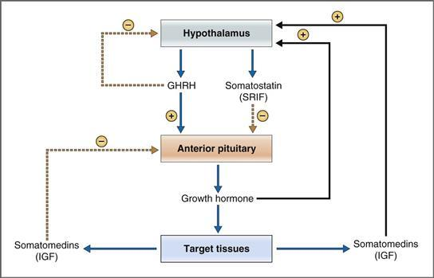

**그림 9–11 성장 호르몬 분비 조절.** GHRH, 성장 호르몬 방출 호르몬; IGF, 인슐린 유사 성장 인자; SRIF, 성장호르몬 방출 억제 인자.

 **GHRH**는 뇌하수체 전엽의 성장 호르몬에 직접 작용하여 성장 호르몬 유전자의 전사를 유도하고 이를 통해 성장 호르몬의 합성과 분비를 모두 자극합니다. 성장호르몬에 대한 작용을 시작하면서 GHRH는 *G*s 단백질을 통해 아데닐릴 시클라제와 포스포리파제 C *둘 다*에 결합되는 막 수용체에 결합합니다. 따라서 GHRH는 cAMP와 IP3/Ca2+를 2차 전달자로 활용하여 성장 호르몬 분비를 자극합니다.

 **소마토스타틴**(**소마토트로핀 방출 억제 호르몬, SRIF**)도 시상하부에서 분비되며 성장 호르몬 분비를 억제하기 위해 성장 호르몬에 작용합니다. 소마토스타틴은 성장호르몬에 대한 GHRH의 작용을 차단함으로써 성장호르몬 분비를 억제합니다. 소마토스타틴은 *G*i 단백질에 의해 아데닐릴 사이클라제에 결합된 자체 막 수용체에 결합하여 cAMP 생성을 억제하고 성장 호르몬 분비를 감소시킵니다.

성장호르몬 분비는 음성 피드백에 의해 조절됩니다([그림 9-11](#filepos1925570) 참조). 긴 루프와 짧은 루프를 모두 포함하는 세 가지 피드백 루프가 포함됩니다. (1) GHRH는 초단 루프 피드백을 통해 시상하부에서 자체 분비를 억제합니다. (2) 표적 조직에 대한 성장 호르몬 작용의 부산물인 소마토메딘은 뇌하수체 전엽에 의한 성장 호르몬 분비를 억제합니다. (3) 성장 호르몬과 소마토메딘은 모두 시상하부에 의한 소마토스타틴 분비를 자극합니다. 이 세 번째 루프의 전체적인 효과는 *억제*(즉, 부정적인 피드백)입니다. 왜냐하면 소마토스타틴이 뇌하수체 전엽에 의한 성장 호르몬 분비를 억제하기 때문입니다.

##### *성장 호르몬의 작용*

성장 호르몬은 간, 근육, 지방 조직, 뼈에 다양한 대사 작용을 할 뿐만 아니라 사실상 다른 모든 기관에서도 성장 촉진 작용을 합니다. 성장 호르몬의 작용에는 선형 성장, 단백질 합성 및 장기 성장, 탄수화물 대사 및 지질 대사에 대한 영향이 포함됩니다.

성장 호르몬의 일부 작용은 골격근, 간 또는 지방 조직과 같은 표적 조직에 대한 호르몬의 *직접적인* 효과의 결과입니다. 성장 호르몬의 다른 작용은 간에서 **소마토메딘**(또는 인슐린 유사 성장 인자[IGF])의 생성을 통해 *간접적으로* 매개됩니다. 소마토메딘 중 가장 중요한 것은 소마토메딘 C 또는 **IGF-1**입니다. 소마토메딘은 인슐린 수용체와 유사한 IGF 수용체를 통해 표적 조직에 작용하며 **내재적 티로신 키나제 활성**을 가지며 자가인산화를 나타냅니다. 성장 호르몬의 성장 촉진 효과는 주로 소마토메딘 생산을 통해 매개됩니다.

성장호르몬의 작용은 다음과 같습니다.

 **당뇨병 유발 효과.** 성장 호르몬은 **인슐린 저항성**을 유발하고 근육 및 지방 조직과 같은 표적 조직의 포도당 흡수 및 활용을 감소시킵니다. 이러한 효과는 인슐린이 부족하거나 조직이 인슐린에 저항하는 경우(예: 당뇨병) 혈당 농도가 증가하기 때문에 "당뇨병 유발"이라고 합니다. 성장 호르몬은 또한 지방 조직의 지방 분해를 증가시킵니다. 이러한 대사 효과의 결과로 성장 호르몬은 혈중 인슐린 수치를 증가시킵니다.

 **단백질 합성 및 장기 성장 증가.** 사실상 모든 장기에서 성장 호르몬은 아미노산 흡수를 증가시키고 DNA, RNA 및 단백질의 합성을 자극합니다. 이러한 효과는 호르몬의 성장 촉진 작용, 즉 제지방량 증가 및 장기 크기 증가를 설명합니다. 언급한 바와 같이, 성장 호르몬의 많은 성장 효과는 소마토메딘에 의해 매개됩니다.

 **선형 성장 증가.** 성장 호르몬의 가장 눈에 띄는 효과는 선형 성장을 증가시키는 능력입니다. 소마토메딘에 의해 매개되는 성장 호르몬은 연골 대사의 모든 측면, 즉 DNA 합성, RNA 합성 및 단백질 합성의 자극을 변경합니다. 뼈가 성장하면 골단판이 넓어지고 긴 뼈 끝에 더 많은 뼈가 놓입니다. 또한 연골 형성 세포의 신진대사와 연골 세포의 증식이 증가합니다.

##### *성장호르몬의 병태생리*

성장 호르몬의 병태생리학에는 호르몬의 결핍 또는 과잉이 포함되며, 선형 성장, 장기 성장, 탄수화물 및 지질 대사에 예측 가능한 영향이 미칩니다.

어린이의 **성장 호르몬 결핍**은 성장 장애, 단신, 경미한 비만, 사춘기 지연을 초래합니다. 성장 호르몬 결핍의 원인에는 시상하부-뇌하수체 전엽-표적 조직 축의 모든 단계에서의 결함이 포함됩니다. 시상하부 기능 장애로 인한 GHRH 분비 감소; 뇌하수체 전엽으로부터의 성장 호르몬 분비의 주요 결핍; 간에서 소마토메딘 생성 실패; 및 표적 조직의 성장 호르몬 또는 소마토메딘 수용체의 결핍(성장 호르몬 저항성). 어린이의 성장 호르몬 결핍은 인간 성장 호르몬 대체 요법으로 치료됩니다.

**성장 호르몬 과잉**은 **말단 비대증**을 유발하며 가장 흔히 성장 호르몬을 분비하는 뇌하수체 선종으로 인해 발생합니다. 과도한 성장 호르몬의 결과는 과잉이 사춘기 이전에 발생했는지 아니면 이후에 발생했는지에 따라 다릅니다. 사춘기 이전에 과도한 수준의 성장 호르몬은 골단판의 강렬한 호르몬 자극으로 인해 **거대증**(선형 성장 증가)을 유발합니다. 선형 성장이 완료되어 더 이상 영향을 받을 수 없는 사춘기 이후, 과도한 성장 호르몬 수치는 골막 성장 증가, 장기 크기 증가, 손과 발 크기 증가, 혀 비대, 얼굴 특징의 거칠어짐, 인슐린 저항성 및 포도당 불내성을 유발합니다. 성장 호르몬이 과도하게 분비되는 상태는 내인성 소마토스타틴처럼 뇌하수체 전엽에 의한 성장 호르몬 분비를 억제하는 **소마토스타틴 유사체**(예: **옥트레오타이드**)로 치료됩니다.

#### 프로락틴

프로락틴은 **우유 생산**을 담당하는 주요 호르몬이며 유방 발달에도 참여합니다. 임신하지 않고 수유하지 않는 여성과 남성의 경우 혈중 프로락틴 수치가 낮습니다. 그러나 임신과 수유 중에는 프로락틴의 혈중 농도가 증가하는데, 이는 유방 발달과 젖 생성(우유 생산)에서 호르몬의 역할과 일치합니다.

##### *프로락틴의 화학*

프로락틴은 뇌하수체 전엽 조직의 약 15%를 차지하는 유산균에 의해 합성됩니다. 프로락틴 수요가 증가하면 임신과 수유 중에 유산균의 수가 증가합니다. 화학적으로 프로락틴은 3개의 내부 이황화 다리가 있는 **단일 사슬 폴리펩티드**에 **198개의 아미노산**을 갖는 성장 호르몬과 관련이 있습니다.

프로락틴 분비를 증가시키거나 감소시키는 자극은 프로락틴 유전자의 전사를 변경함으로써 그렇게 합니다. 따라서 프로락틴 분비 자극제인 TRH는 프로락틴 유전자의 전사를 증가시키는 반면, 프로락틴 분비 억제제인 ​​도파민은 유전자의 전사를 감소시킵니다.

##### *프로락틴 분비 조절*

[그림 9-12](#filepos1934803)는 시상하부의 프로락틴 분비 조절을 보여준다. 시상하부에는 두 가지 조절 경로가 있습니다. 하나는 억제 경로(cAMP 수준을 감소시켜 작용하는 도파민을 통해)이고 다른 하나는 자극 경로(TRH를 통해)입니다.

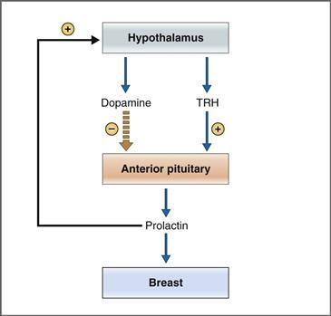

**그림 9–12 프로락틴 분비 조절.** TRH, 갑상선 자극 호르몬 방출 호르몬.

임신 또는 수유 중이 아닌 사람의 경우, 프로락틴 분비는 시상하부의 **도파민**(프로락틴 억제 인자, PIF)에 의해 긴장적으로 억제됩니다. 즉, 도파민의 억제 효과가 TRH의 자극 효과를 지배하고 무시합니다. 펩타이드인 다른 시상하부 방출 또는 방출 억제 호르몬과 달리 도파민은 카테콜아민입니다.

도파민의 억제 작용에 관해 두 가지 질문이 제기됩니다. *시상하부 도파민의 공급원은 무엇입니까? 도파민은 어떻게 전엽에 도달합니까?* 세 가지 공급원과 세 가지 경로가 있습니다. (1) 도파민의 주요 공급원은 시상하부의 도파민 작동성 뉴런으로, 도파민을 합성하여 정중 돌출부로 분비합니다. 이 도파민은 시상하부-하수체 문맥으로 배출되는 모세혈관으로 들어가고 도파민을 뇌하수체 전엽에 고농도로 직접 전달하여 프로락틴 분비를 억제합니다. (2) 도파민은 또한 뇌하수체 후엽의 도파민 뉴런에 의해 분비되어 짧은 연결 문맥을 통해 전엽에 도달합니다. (3) 마지막으로, 뇌하수체 전엽의 비유산균 세포는 소량의 도파민을 분비하는데, 이는 유산균에 짧은 거리로 확산되고 측분비 메커니즘에 의해 프로락틴 분비를 억제합니다.

프로락틴 분비를 변화시키는 요인은 [표 9-5](#filepos1937846)에 정리되어 있다. **프로락틴**은 시상하부에서 도파민의 합성과 분비를 증가시켜 자신의 분비를 억제한다([그림 9-12](#filepos1934803) 참조). 프로락틴의 이러한 작용은 도파민 분비의 *자극*이 프로락틴 분비의 *억제*를 유발하기 때문에 부정적인 피드백을 구성합니다. **임신**과 **수유**(수유)는 프로락틴 분비에 가장 중요한 자극입니다. 예를 들어, 모유 수유 중에 혈청 프로락틴 수치는 기본 수치의 10배 이상 증가할 수 있습니다. 젖을 빠는 동안 유두의 구심성 섬유는 정보를 시상하부로 전달하고 도파민 분비를 억제합니다. 도파민의 억제효과를 방출함으로써 프로락틴 분비를 증가시킨다. 프로락틴 분비에 대한 도파민, 도파민 작용제, 도파민 길항제의 효과는 피드백 조절에 기초하여 예측 가능합니다([그림 9-12](#filepos1934803) 참조). 따라서 도파민 자체와 **브로모크립틴**과 같은 도파민 작용제는 프로락틴 분비를 억제하는 반면, 도파민 길항제는 도파민에 의한 "억제"를 통해 프로락틴 분비를 자극합니다.

표 9-5 프로락틴 분비에 영향을 미치는 요인

|  |  |
| --- | --- |
| **자극 요인** | **억제 요인** |
| 임신(에스트로겐) 모유 수유 수면 스트레스 TRH 도파민 길항제 | 도파민 브로모크립틴(도파민 작용제) 소마토스타틴 프롤락틴(부정 피드백) |

TRH, 갑상선 자극 호르몬 방출 호르몬.

##### *프로락틴의 작용*

프로락틴은 에스트로겐 및 프로게스테론과 보조적인 역할을 하며 유방 발달을 자극하고 수유 중에 유방에서 젖 분비를 촉진하며 배란을 억제합니다.

 **유방 발달.** 사춘기에는 프로락틴이 에스트로겐 및 프로게스테론과 함께 유선의 증식과 분지를 자극합니다. 임신 중에 프로락틴(역시 에스트로겐 및 프로게스테론과 함께)은 유방 폐포의 성장과 발달을 자극하여 출산 후 모유를 생산합니다.

 **젖 생성(우유 생산).** 프로락틴의 주요 작용은 젖먹기에 대한 반응으로 우유 생산과 분비를 자극하는 것입니다. (흥미롭게도 임신이 일어나야 수유가 가능해지는 것은 아닙니다. 유두가 충분히 자극되면 프로락틴이 분비되어 젖이 생성됩니다.) 프로락틴은 **유당**(우유의 탄수화물), **카제인**(우유의 단백질), **지질**을 비롯한 우유 성분의 합성을 유도하여 우유 생산을 자극합니다. 유방에 대한 프로락틴의 작용 기전은 프로락틴이 세포막 수용체에 결합하고, 알려지지 않은 경로를 통해 두 번째 전달자는 유당, 카제인 및 지질의 생합성 경로에서 효소 유전자의 전사를 유도합니다.

임신 중에는 프로락틴 수치가 높지만, 높은 수치의 에스트로겐과 프로게스테론이 유방의 프로락틴 수용체를 하향 조절하고 프로락틴의 작용을 차단하기 때문에 수유가 발생하지 않습니다. 출산 시 에스트로겐과 프로게스테론 수치가 급격히 떨어지고 이들의 억제 작용이 중단됩니다. 프로락틴은 젖 생성을 자극할 수 있으며, 수유가 일어날 수 있습니다.

 **배란 억제.** 여성의 경우 프로락틴은 성선 자극 호르몬 방출 호르몬(GnRH)의 합성과 방출을 억제하여 배란을 억제합니다. 10](CR%21G9RE0KW4PD33Q9F3DXNCSBNXCANP_split_022.html#filepos2161205)). GnRH 분비의 억제와 이차적으로 배란의 억제는 모유수유 중 생식능력 감소의 원인이 됩니다. 프로락틴 수치가 높은 남성(예: 프로락틴종으로 인해)에서는 GnRH 분비와 정자 형성에 병행 억제 효과가 나타나 불임을 초래합니다.

##### *프로락틴의 병태생리*

프로락틴의 병태생리학에는 프로락틴 결핍으로 인해 젖산이 불가능해지거나 프로락틴 과잉으로 인해 유즙분비가 발생할 수 있습니다.

 **프로락틴 결핍**은 뇌하수체 전엽 전체의 파괴 또는 유산균의 선택적 파괴로 인해 발생할 수 있습니다. 프로락틴 결핍은 예상대로 젖산 결핍을 초래합니다.

 **프로락틴 과잉**은 시상하부 파괴, 시상하부-하수체 경로의 중단 또는 프로락틴종(프로락틴 분비 종양)으로 인해 발생할 수 있습니다. 시상하부가 파괴되거나 시상하부-하수체 경로가 중단되는 경우 *도파민에 의한 강장 억제 기능이 상실*되어 프로락틴 분비가 증가합니다. 프로락틴 과잉 분비의 주요 증상은 **유즙분비** 및 **불임**(높은 프로락틴 수치로 인해 GnRH 분비가 억제되어 발생함)입니다. 시상하부 부전 또는 프로락틴종으로 인한 프로락틴 과잉은 도파민 작용제인 **브로모크립틴**을 투여하여 치료할 수 있습니다. 도파민과 마찬가지로 브로모크립틴도 뇌하수체 전엽의 프로락틴 분비를 억제합니다.

### 후엽 호르몬

뇌하수체 후엽에서는 항이뇨 호르몬(ADH)과 옥시토신을 분비합니다. ADH와 옥시토신은 모두 시상하부 뉴런의 세포체에서 합성되고 뇌하수체 후엽의 신경 말단에서 분비되는 신경펩티드입니다.

#### 항이뇨호르몬과 옥시토신의 합성과 분비

##### *합성 및 처리*

ADH와 옥시토신은 상동성 **노나펩티드**(9개 아미노산 함유)([그림 9-13](#filepos1945602) 및 [9-14](#filepos1946006))이며 시상하부의 시신경 및 방실핵에서 합성됩니다. **ADH** 뉴런은 주로 시상하부의 **시각상핵**에 세포체를 가지고 있습니다. **옥시토신** 뉴런은 주로 **뇌실주위 핵**에 세포체를 가지고 있습니다. 주로 ADH나 옥시토신을 생산하는 데 전념하지만 각 핵은 "다른" 호르몬도 생산합니다. 유사한 유전자는 ADH와 옥시토신에 대한 프리프로호르몬의 염색체 직접 합성에 근접해 위치합니다. ADH의 펩타이드 전구체는 신호 펩타이드, ADH, 뉴로피신 II 및 당단백질로 구성된 **프리프로프레소피신**입니다. 옥시토신의 전구체는 **프레프로옥시피신**이며, 이는 신호 펩타이드, 옥시토신 및 뉴로피신 I로 구성됩니다. 골지체에서 신호 펩타이드는 *프리프로*호르몬에서 제거되어 *프로*호르몬, *프로*프레소피신 및 *프로-옥시피신을 형성하고, 프로호르몬은 분비 소포에 포장됩니다. 프로호르몬을 함유한 분비 소포는 뉴런의 축삭을 따라 시상하부-하수체 경로를 통해 뇌하수체 후엽으로 이동합니다. 뇌하수체 후엽으로 가는 도중에 뉴로피신은 분비 소포 내의 각각의 프로호르몬으로부터 절단됩니다.

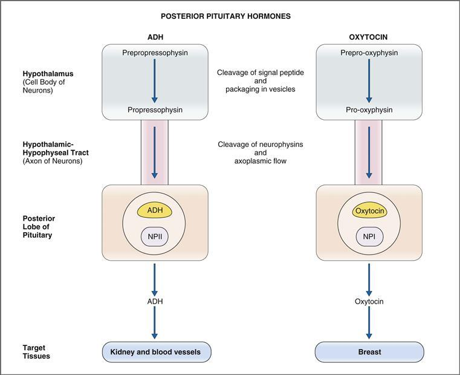

**그림 9-13 항이뇨 호르몬(ADH)과 옥시토신의 합성, 처리 및 분비.** NPI, Neurophysin I; NPII, 뉴로피신 II.

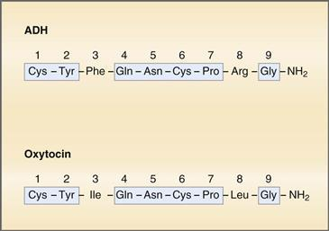

**그림 9-14 항이뇨 호르몬(ADH)과 옥시토신의 구조.** 상동 아미노산 서열은 *음영 상자* 내에 표시됩니다.

##### *분비*

뇌하수체 후엽에 도달하는 분비 소포에는 ADH, 뉴로피신 II, 당단백질 *또는* 옥시토신과 뉴로피신 I이 포함되어 있습니다. 활동 전위가 시상하부의 세포체에서 축색을 따라 뇌하수체 후엽의 신경 말단으로 전달될 때 분비가 시작됩니다. 활동 전위에 의해 신경 말단이 탈분극되면 Ca2+가 말단으로 유입되어 ADH 또는 옥시토신 및 이들의 뉴로피신을 포함하는 분비 과립의 세포외유출을 유발합니다. 분비된 호르몬은 천공된 모세혈관 근처로 들어가 전신 순환계로 운반되어 호르몬을 표적 조직에 전달합니다.

#### 항이뇨호르몬

ADH(또는 바소프레신)는 체액 삼투압 조절과 관련된 주요 호르몬입니다. ADH는 혈청 삼투압의 증가에 반응하여 뇌하수체 후엽에서 분비됩니다. 그런 다음 ADH는 말단 원위 세뇨관과 집합관의 주요 세포에 작용하여 수분 재흡수를 증가시켜 체액 삼투압을 정상으로 감소시킵니다. 삼투압 조절과 신장에 대한 ADH의 작용은 [6장](CR%21G9RE0KW4PD33Q9F3DXNCSBNXCANP_split_015.html#filepos1181244)에서 논의됩니다.

##### *항이뇨호르몬 분비 조절*

뇌하수체 후엽에서 ADH의 분비를 자극하거나 억제하는 인자는 [표 9-6](#filepos1948185)에 정리되어 있다.

표 9-6 항이뇨 호르몬 분비에 영향을 미치는 요인

|  |  |
| --- | --- |
| **자극 요인** | **억제 요인** |
| 혈청 삼투압 증가 ECF 양 감소 안지오텐신 II 통증 메스꺼움 저혈당증 니코틴 아편제 항종양제 | 혈청 삼투압 감소 에탄올 α-아드레날린 작용제 심방 나트륨 이뇨 펩타이드(ANP) |

**혈장 삼투압 증가**는 ADH 분비를 증가시키는 가장 중요한 생리적 자극입니다([그림 9-15](#filepos1950199)). 예를 들어, 사람에게 물이 부족하면 혈청 삼투압이 증가합니다. 증가는 시상하부 전방에 있는 삼투압 수용체에 의해 감지됩니다. 활동전위는 인근 ADH 뉴런의 세포체에서 시작되어 축색돌기를 따라 전파되어 뇌하수체 후엽의 신경 말단에서 ADH의 분비를 유발합니다. 반대로, 혈청 삼투압의 감소는 시상하부 삼투수용체에 ADH 분비를 억제하라는 신호를 보냅니다.

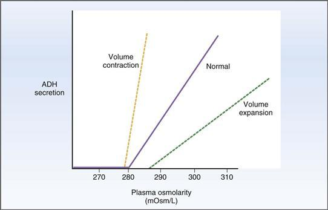

**그림 9–15 삼투압 및 세포외액량에 따른 항이뇨 호르몬(ADH) 분비 조절.**

**저혈량증 또는 체액 수축**(예: 출혈로 인한)도 ADH 분비에 대한 강력한 자극입니다. 세포외액(ECF) 양이 10% 이상 감소하면 좌심방, 경동맥 및 대동맥궁의 압수용기가 감지하는 동맥 혈압이 감소합니다. 혈압에 대한 이러한 정보는 미주신경을 통해 시상하부로 전달되어 ADH 분비를 증가시킵니다. 그런 다음 ADH는 집합관에서 수분 재흡수를 자극하여 ECF 부피를 회복하려고 시도합니다. 중요한 것은 혈장 삼투압이 정상보다 낮은 경우에도 저혈량증이 ADH 분비를 자극한다는 것입니다([그림 9-15](#filepos1950199) 참조). 반대로, 과다혈량증(부피 확장)은 혈장 삼투압이 정상보다 높은 경우에도 ADH 분비를 억제합니다.

통증, 메스꺼움, 저혈당증 및 다양한 약물(예: 니코틴, 아편제, 항종양제)은 모두 ADH의 분비를 자극합니다. 에탄올, α-아드레날린 작용제, 심방 나트륨 이뇨 펩타이드는 ADH 분비를 억제합니다.

##### *항이뇨호르몬의 작용*

ADH(바소프레신)는 두 가지 작용을 하는데, 하나는 신장에, 다른 하나는 혈관 평활근에 작용합니다. 이러한 작용은 다양한 수용체, 다양한 세포 내 메커니즘, 다양한 2차 전달자에 의해 매개됩니다.

 **수투과성 증가.** ADH의 주요 작용은 말단 원위세뇨관과 집합관에 있는 주요 세포의 수분 투과성을 증가시키는 것입니다. 주요 세포의 ADH 수용체는 **V2 수용체**이며, 이는 Gs 단백질을 통해 아데닐릴 사이클라제에 결합됩니다. 두 번째 전달자는 **cAMP**이며 인산화 단계를 통해 관강막에 물 채널인 **아쿠아포린 2**(**AQP2**)**를 삽입하도록 지시합니다. 주요 세포의 증가된 물 투과성은 집합관에 의해 물이 재흡수되도록 하고 소변을 농축 또는 고삼투압으로 만듭니다([6장](CR%21G9RE0KW4PD33Q9F3DXNCSBNXCANP_split_015.html#filepos1181244) 참조).

 **혈관 평활근의 수축.** ADH의 두 번째 작용은 혈관 평활근의 수축을 유발하는 것입니다(다른 이름인 바소프레신에서 알 수 있듯이). 혈관 평활근의 ADH 수용체는 **V1 수용체**이며 Gq 단백질을 통해 포스포리파제 C와 결합됩니다. 이 작용의 두 번째 전달자는 **IP3/Ca2+**이며, 이는 혈관 평활근의 수축, 세동맥의 수축 및 전체 말초 저항의 증가를 생성합니다.

##### *항이뇨호르몬의 병태생리*

ADH의 병태생리학은 [6장](CR%21G9RE0KW4PD33Q9F3DXNCSBNXCANP_split_015.html#filepos1181244)에 자세히 설명되어 있으며 여기에 요약되어 있습니다.

***중추* 요붕증**은 뇌하수체 후엽의 ADH 분비 실패로 인해 발생합니다. 이 질환에서는 ADH 순환 수준이 낮고 집합관에 물이 침투할 수 없으며 소변이 농축될 수 없습니다. 따라서 중추성 요붕증 환자는 다량의 묽은 소변을 생성하고 체액이 농축됩니다(예: 혈청 삼투압 증가, 혈청 Na+ 농도 증가). 중추성 요붕증은 ADH 유사체 **dDAVP.**로 치료됩니다.

***신원성* 요붕증**의 경우 뇌하수체 후엽은 정상이지만 집합관의 주요 세포는 V2 수용체, Gs 단백질 또는 아데닐릴 사이클라제의 결함으로 인해 ADH에 반응하지 않습니다. 중추성 요붕증의 경우와 마찬가지로 수분이 집합관에서 재흡수되지 않고 소변이 농축되지 않아 다량의 묽은 소변이 배설됩니다. 결과적으로 체액이 농축되고 혈청 삼투압이 증가합니다. 그러나 중추성 요붕증과 달리 신장성 요붕증에서는 증가된 혈청 삼투압에 의한 분비 자극으로 인해 ADH 수치가 상승합니다. 신성 요붕증은 **티아지드 이뇨제**로 치료됩니다. 신성 요붕증 치료에서 티아지드 이뇨제의 유용성은 다음과 같이 설명됩니다: (1) 티아지드 이뇨제는 초기 원위 세뇨관에서 Na+ 재흡수를 억제합니다. 해당 부위에서 소변이 희석되는 것을 방지함으로써 최종적으로 배설되는 소변은 (치료를 받지 않았을 때보다) 덜 희석됩니다. (2) 티아지드 이뇨제는 사구체 여과율을 감소시킵니다. 더 적은 양의 물이 여과되기 때문에 더 적은 양의 물이 배설됩니다. (3) 티아지드 이뇨제는 Na+ 배설을 증가시켜 2차 ECF 부피 수축을 일으킬 수 있습니다. 부피 수축에 반응하여 용질과 물의 근위부 재흡수가 증가합니다. 더 많은 물이 재흡수되기 때문에 더 적은 양의 물이 배설됩니다.

**부적절한 ADH 증후군**(**SIADH**)**에서는 과도한 ADH가 자율 부위(예: 폐의 귀리 세포 암종, [상자 9-1](#filepos1956483))에서 분비됩니다. ADH 수치가 높으면 집합관에서 수분이 과도하게 재흡수되어 체액이 희석됩니다(예: 혈장 삼투압 및 Na+ 농도 감소). 소변이 *부적절하게 농축*되었습니다(즉, 혈청 삼투압에 비해 너무 농축됨). SIADH는 **데메클로사이클린** 또는 **수분 제한**과 같은 ADH 길항제로 치료됩니다.

**상자 9-1 임상 생리학: 부적절한 ADH 증후군**

> **사례 설명.** 귀리 세포 폐암을 앓고 있는 56세 남성이 대발작을 겪은 후 병원에 입원했습니다. 실험실 연구에서는 다음과 같은 정보를 제공합니다.

> |  |  |
> | --- | --- |
> | **세럼** | **소변** |
> | [Na+],110mEq/L | 삼투압, 650mOsm/L |
> | 삼투압, 225mOsm/L |  |

> 남성의 폐종양은 수술이 불가능한 것으로 진단되었습니다. 그는 고장성 NaCl의 IV 주입으로 치료를 받고 안정되어 퇴원합니다. 그는 ADH 길항제인 데메클로사이클린을 투여받았으며 물 섭취를 엄격하게 제한하라는 명령을 받았습니다.

> **사례 설명.** 병원에 입원했을 때 남성의 혈청 [Na+] 및 혈청 삼투압은 심각하게 저하되었습니다(정상 혈청 [Na+], 140 mEq/L; 정상 혈청 삼투압, 290 mOsm/L). 동시에 그의 소변은 삼투압이 높아 측정된 삼투압이 650mOsm/L입니다. 즉, 매우 묽은 혈청 삼투압으로 인해 그의 소변이 *부적절하게* 농축된 것입니다.

> 뇌하수체 후엽과는 별도로 귀리 세포 암종은 ADH를 합성 및 분비하여 소변 및 혈청 수치의 이상을 유발했습니다. 일반적으로 ADH는 뇌하수체 후엽에서 분비되며 혈청 삼투압에 의해 음성 피드백 조절을 받습니다. 혈청 삼투압이 정상 이하로 감소하면 뇌하수체 후엽의 ADH 분비가 억제됩니다. 그러나 종양에 의한 ADH 분비는 이러한 음성 피드백 조절을 받지 않으며 ADH 분비는 (혈청 삼투압이 아무리 낮더라도) 줄어들지 않고 계속되어 SIADH를 유발합니다.

> 남성의 혈청 및 소변 수치는 다음과 같이 설명됩니다. 종양이 다량의 ADH를 (부적절하게) 분비하고 있습니다. 이 ADH는 신장으로 순환하여 말단 원위세뇨관과 집합관의 주요 세포에 작용하여 수분 재흡수를 증가시킵니다. 재흡수된 물은 전체 체수분에 추가되어 용질을 희석시킵니다. 따라서 혈청 [Na+] 및 혈청 삼투압은 신장에서 재흡수된 과잉 수분에 의해 희석됩니다. 이러한 혈청 삼투압 희석은 뇌하수체 후엽에 의한 ADH 분비를 차단하지만 종양 세포에 의한 ADH 분비를 차단하지는 않습니다.

> 남자의 대발작은 뇌세포의 부종으로 인해 발생했습니다. 신장에서 재흡수된 과잉 수분은 ICF를 포함한 전체 체수분에 분포됩니다. 물이 세포 안으로 유입되면서 부피가 증가했습니다. 뇌세포의 경우, 뇌가 두개골이라는 고정된 공간에 둘러싸여 있기 때문에 이러한 부종은 치명적이었습니다.

> **치료.** 해당 남성은 ECF의 삼투압을 높이기 위해 고장성 NaCl을 주입하여 즉시 치료를 받았습니다. 세포외 삼투압이 세포내 삼투압보다 높아지면 삼투압 구배에 의해 물이 세포 밖으로 흘러나와 ICF 부피가 감소합니다. 뇌세포의 경우 세포 부피가 감소하면 또 다른 발작이 발생할 가능성이 줄어듭니다.

> 남성의 폐종양은 수술이 불가능하며 계속해서 대량의 ADH를 분비하게 됩니다. 그의 치료에는 수분 제한과 주요 세포의 수분 재흡수에 대한 ADH의 효과를 차단하는 ADH 길항제인 데메클로사이클린의 투여가 포함됩니다.

#### 옥시토신

옥시토신은 유관을 둘러싸고 있는 근상피 세포의 수축을 자극하여 수유 중인 유방에서 젖이 "감소"되거나 배출되도록 합니다.

##### *옥시토신 분비 조절*

젖먹이를 포함한 여러 가지 요인이 뇌하수체 후엽에서 옥시토신 분비를 유발합니다. 유아의 시각, 소리 또는 냄새; 및 자궁경부 확장([표 9-7](#filepos1961474)).

표 9-7 옥시토신 분비에 영향을 미치는 요인

|  |  |
| --- | --- |
| **자극 요인** | **억제 요인** |
| 유아의 시력, 소리 또는 냄새 자궁경부 확장 오르가슴 | 오피오이드(엔돌핀) |

옥시토신 분비의 주요 자극은 유방의 **빨기**입니다. 유두의 감각 수용체는 구심성 뉴런을 통해 자극을 척수로 전달합니다. 그런 다음 이 정보는 척수시상관을 통해 뇌간으로 올라가고 마지막으로 시상하부의 뇌실방핵으로 올라갑니다. 빨고 몇 초 안에 옥시토신은 뇌하수체 후엽의 신경 말단에서 분비됩니다. 빨기가 계속되면 시상하부 세포체에서 새로운 옥시토신이 합성되어 축색돌기를 따라 이동하여 분비된 옥시토신을 보충합니다.

옥시토신 분비에는 젖먹이가 *필요하지 않습니다*; 유아의 시각, 소리 또는 냄새에 대한 **조건화된 반응**도 젖 분비를 유발합니다. 옥시토신은 또한 분만 및 오르가슴 동안 자궁경부가 확장되는 것에 대한 반응으로 분비됩니다.

##### *옥시토신의 작용*

 **젖 배출.** 프로락틴은 젖 생성을 자극합니다. 우유는 유방 폐포와 작은 유관에 저장됩니다. 옥시토신의 주요 작용은 우유를 감소시키는 것입니다. 옥시토신이 빨기 또는 조절된 반응에 반응하여 분비되면 이 작은 관을 둘러싸고 있는 근상피 세포가 수축되어 젖이 큰 관으로 들어가게 됩니다. 우유는 물탱크에 모인 다음 젖꼭지를 통해 흘러나옵니다.

 **자궁 수축.** 매우 낮은 농도에서도 옥시토신은 자궁 평활근의 강력한 리듬 수축을 유발합니다. 옥시토신이 출산에 관여하는 중요한 호르몬이라고 추측하기 쉽지만, 옥시토신이 출산의 시작이나 정상적인 과정에서 생리학적 역할을 하는지는 불분명합니다. 그러나 옥시토신의 이러한 작용은 **진통을 유도**하고 **산후 출혈을 감소**하는 데 사용되는 기초입니다.

### 갑상선 호르몬

갑상선 호르몬은 갑상선의 상피세포에서 합성되고 분비됩니다. 이는 정상적인 성장 및 발달과 관련된 기관을 포함하여 신체의 거의 모든 기관 시스템에 영향을 미칩니다. 갑상선은 결핍 장애로 기술된 최초의 내분비 기관이었습니다. 1850년에 갑상선이 없는 환자들은 **크레틴병**이라고 불리는 일종의 정신 및 성장 지연을 앓고 있는 것으로 기술되었습니다. 1891년에 이러한 환자들은 조갑상선 추출물(즉, 호르몬 대체 요법)을 투여하여 치료를 받았습니다. 갑상선 결핍 및 과잉 장애는 내분비병증(내분비선 장애) 중 가장 흔한 장애 중 하나로, 미국 인구의 4~5%에 영향을 미치며, 요오드 결핍이 있는 세계 지역에서는 훨씬 더 많은 비율의 사람들에게 영향을 미칩니다.

#### 갑상선 호르몬의 합성과 수송

두 가지 활성 갑상선 호르몬은 삼요오드티로닌(T3)과 테트라요오드티로닌 또는 티록신(T4)입니다. T3와 T4의 구조는 [그림 9-16](#filepos1966208)과 같이 요오드의 단일 원자만 다르다. T3가 T4보다 더 활동적이지만 갑상선의 거의 모든 호르몬 생산량은 T4입니다. 덜 활동적인 형태를 분비하는 이 "문제"는 T4를 T3로 전환하는 표적 조직에 의해 해결됩니다. 세 번째 화합물인 reverse T3([그림 9-16](#filepos1966208)에는 표시되지 않음)은 생물학적 활성이 없습니다.

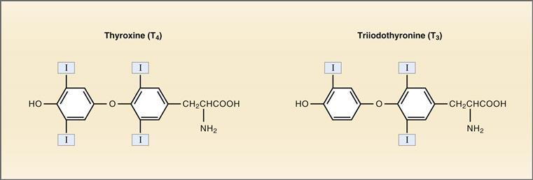

**그림 9–16 갑상선 호르몬인 티록신(T4)과 트리요오드티로닌(T3)의 구조.**

##### *갑상선 호르몬의 합성*

갑상선 호르몬은 갑상선의 **여포 상피 세포**에서 합성됩니다. 모낭 상피세포는 [그림 9-17](#filepos1967379)과 같이 직경 200~300 µm의 원형 모낭으로 배열되어 있다. 세포에는 혈액을 향한 기저막과 모낭 내강을 향한 정점 막이 있습니다. 모낭 내강의 물질은 **티로글로불린**에 부착된 새로 합성된 갑상선 호르몬으로 구성된 **콜로이드**입니다. 갑상선이 자극되면 이 콜로이드성 갑상선 호르몬은 세포내이입에 의해 모낭 세포로 흡수됩니다.

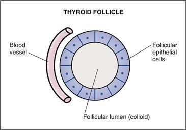

**그림 9–17 갑상선 여포의 개략도.** 콜로이드는 여포 내강에 존재합니다.

갑상선 호르몬의 합성은 대부분의 호르몬보다 더 복잡합니다. 합성 과정에는 세 가지 특이한 특징이 있습니다. (1) 갑상선 호르몬에는 다량의 요오드가 포함되어 있으며 이는 식단을 통해 적절하게 공급되어야 합니다. (2) 갑상선 호르몬의 합성은 부분적으로는 세포내, 부분적으로는 세포외에서 이루어지며, 완성된 호르몬은 갑상선이 분비되도록 자극될 때까지 여포 내강에 세포외적으로 저장됩니다. (3) 언급한 바와 같이, T4는 갑상선의 주요 분비 산물이지만 호르몬의 가장 활동적인 형태는 아닙니다.

여포상피세포에서 갑상선호르몬이 생합성되는 과정은 [그림 9-18](#filepos1968578)과 같다. 그림에서 원으로 표시된 숫자는 다음 단계와 관련이 있습니다.

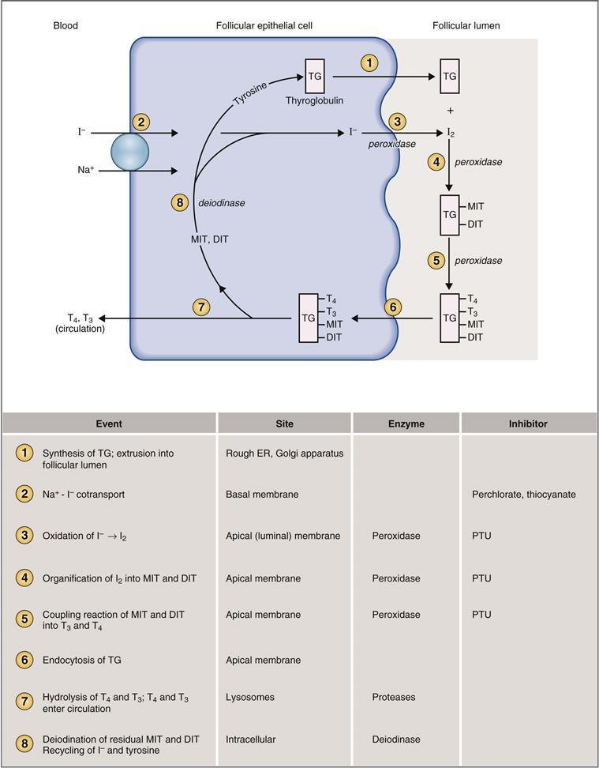

**그림 9-18 갑상선 여포 세포에서 갑상선 호르몬의 합성에 관련된 단계.** 또한 원 안의 숫자에 대한 설명은 본문을 참조하십시오. DIT, 디요오도티로신; ER, 소포체; MIT, 모노요오도티로신; PTU, 프로필티오우라실; TG, 티로글로불린; T3, 트리요오드티로닌; T4, 티록신.

1. **티로신**을 다량 함유한 당단백질인 **티로글로불린(TG)**은 갑상선 여포세포의 거친 소포체와 골지체에서 합성됩니다. 그런 다음 티로글로불린은 분비 소포에 통합되어 근단 막을 거쳐 난포 내강으로 압출됩니다. 나중에 티로글로불린의 티로신 잔기가 요오드화되어 갑상선 호르몬의 전구체를 형성하게 됩니다.
2. **Na+-I- 공동수송 또는 "I-트랩"** I**−**은 화학적 및 전기적 구배에 맞서 혈액에서 모낭 상피 세포로 능동적으로 운반됩니다. 이 펌프의 활동은 신체의 I**−** 수준에 의해 조절됩니다. 예를 들어, 낮은 수준의 I**−**는 펌프를 자극합니다. I**−**의 식이 결핍이 있을 때, Na+-I**−** 공동수송은 결핍을 보상하려고 시도하면서 활동을 증가시킵니다. 그러나 식이 결핍이 심하면 Na+-I**-** 공동수송도 보상할 수 없으며 갑상선 호르몬의 합성이 감소합니다.  
       음이온 **티오시아네이트** 및 **과염소산염**을 포함하여 Na+-I**-** 공동수송에 대한 여러 경쟁적 억제제가 있는데, 이는 I**-**가 난포 세포로 흡수되는 것을 차단하고 갑상선 호르몬의 합성을 방해합니다.
3. **I-에서 I2로의 산화.** 일단 I**-**가 세포 내로 펌핑되면 세포를 거쳐 정점 막으로 이동하고 그곳에서 **갑상선 퍼옥시다제** 효소에 의해 I2로 산화됩니다. 갑상선 퍼옥시다제는 이 산화 단계 *및* 다음 두 단계(즉, I2를 티로글로불린으로의 조직화와 결합 반응)를 촉매합니다.  
       갑상선 퍼옥시다제는 **프로필티오우라실**(**PTU**)에 의해 억제되는데, 이는 갑상선 퍼옥시다제가 촉매하는 *모든* 단계를 차단하여 갑상선 호르몬의 합성을 차단합니다. 따라서 PTU 투여는 갑상선 기능 항진증의 효과적인 치료법입니다.
4. **I2의 조직.** 난포 내강 바로 내부의 근단막에서 I2는 갑상선 퍼옥시다제에 의해 촉매되는 티로글로불린의 티로신 부분과 결합하여 **모노이오도티로신(MIT)** 및 **디요오드티로신(DIT)을 형성합니다.**
   *MIT와 DIT는 갑상선이 자극되어 호르몬을 분비할 때까지 여포 내강의 티로글로불린*에 부착된 상태로 유지됩니다. 높은 수준의 I**−**는 **볼프-차이코프 효과**로 알려진 갑상선 호르몬의 조직과 합성을 억제합니다.
5. **커플링 반응.** 여전히 티로글로불린의 일부이지만 MIT와 DIT 사이에는 두 가지 별도의 커플링 반응이 발생하며 다시 갑상선 퍼옥시다제에 의해 촉매됩니다. 한 반응에서는 DIT 두 분자가 결합하여 **T4**를 형성합니다. 다른 반응에서는 DIT 분자 1개가 MIT 분자 1개와 결합하여 **T3**을 형성합니다. 첫 번째 반응은 더 빠르며 결과적으로 T3보다 약 10배 더 많은 T4가 생성됩니다. MIT와 DIT의 일부는 결합되지 않고("남은" 상태로) 단순히 티로글로불린에 부착된 상태로 남아 있습니다. 결합 반응이 발생한 후 티로글로불린에는 T4, T3 및 남은 MIT와 DIT가 포함됩니다. 이 요오드화된 티로글로불린은 갑상선이 호르몬을 분비하도록 자극될 때까지(예: TSH에 의해) **콜로이드**로 여포 내강에 저장됩니다.
6. **티로글로불린의 세포내이입.** 갑상선이 자극되면 요오드화된 티로글로불린(T4, T3, MIT 및 DIT가 부착됨)이 여포 상피 세포로 세포내이입됩니다. 위족류는 정단 세포막에서 떨어져 나와 콜로이드의 일부를 삼켜 세포 내로 흡수합니다. 세포 내부로 들어가면 티로글로불린은 미세관 작용에 의해 기저막 방향으로 운반됩니다.
7. **리소좀 효소에 의한 티로글로불린에서 T4와 T3의 가수분해.** 티로글로불린 소적은 리소좀 막과 융합됩니다. 그런 다음 리소좀 프로테아제는 펩티드 결합을 가수분해하여 티로글로불린에서 T4, T3, MIT 및 DIT를 방출합니다. T4와 T3는 기저막을 거쳐 인근 모세혈관으로 운반되어 전신 순환계로 전달됩니다. MIT와 DIT는 난포 세포에 남아 있으며 새로운 티로글로불린 합성으로 재활용됩니다.
8. **MIT 및 DIT의 탈요오드화.** MIT 및 DIT는 **갑상선 탈요오드화효소** 효소에 의해 난포 세포 내부에서 탈요오드화됩니다. 이 단계에서 생성된 I**−**는 세포 내 풀로 재활용되고 펌프에 의해 운반되는 I**−**에 추가됩니다. 티로신 분자는 새로운 티로글로불린 합성에 통합되어 또 다른 주기를 시작합니다. 따라서 I**-**와 티로신은 모두 탈요오드효소에 의해 "회수"됩니다. 그러므로 갑상선 탈요오드화효소의 결핍은 식이요법과 유사합니다**−**

##### *순환계에서 갑상선 호르몬의 결합*

갑상선 호르몬(T4 및 T3)은 혈장 단백질에 결합되거나 유리(비결합)되어 혈류에서 순환합니다. 대부분의 T4 및 T3는 **티록신 결합 글로불린(TBG)에 결합되어 순환합니다.** T4 결합 프리알부민 및 알부민에 결합하여 더 적은 양이 순환합니다. 더 적은 양이 자유롭고 구속되지 않은 형태로 유통됩니다. *유리* 갑상선 호르몬만이 생리학적으로 활성화되기 때문에 TBG의 역할은 순환 갑상선 호르몬의 큰 저장소를 제공하는 것입니다. 이는 유리 호르몬 풀에 방출되어 추가될 수 있습니다.

TBG의 혈중 농도 변화는 유리(생리학적 활성) 갑상선 호르몬의 비율을 변경합니다. 예를 들어, **간부전**의 경우 간 단백질 합성이 감소하기 때문에 혈중 TBG 수치가 감소합니다. TBG 수준의 감소는 유리 갑상선 호르몬 수준의 일시적인 증가를 초래합니다. 유리 갑상선 호르몬의 증가로 인해 갑상선 호르몬 합성이 억제됩니다(음성 피드백에 의해). 대조적으로, **임신 중**, 높은 수준의 에스트로겐은 TBG의 간 분해를 억제하고 TBG 수준을 증가시킵니다. TBG 수준이 높을수록 더 많은 갑상선 호르몬이 TBG에 결합되고 더 적은 갑상선 호르몬이 유리되거나 결합되지 않습니다. 일시적으로 감소된 유리 호르몬 수치는 부정적인 피드백에 의해 갑상선에 의한 갑상선 호르몬의 합성 및 분비가 증가합니다. 임신 중에는 이러한 모든 변화의 결과로 *총* T4 및 T3 수치가 증가하지만(TBG 수치 증가로 인해) *유리* 생리학적 활성 갑상선 호르몬 수치는 정상이며 환자는 "임상적으로 정상 갑상선"이라고 합니다.

TBG의 순환 수준은 합성 수지에 대한 방사성 T3의 결합을 측정하는 **T3 수지 흡수 테스트**를 통해 간접적으로 평가할 수 있습니다. 이 테스트에서는 표준량의 방사성 T3가 환자의 혈청 샘플과 T3 결합 수지가 포함된 분석 시스템에 추가됩니다. 그 근거는 방사성 T3가 먼저 환자의 TBG의 빈 부위에 결합하고 "남은" 방사성 T3가 수지에 결합한다는 것입니다. 따라서 TBG의 순환 수준이 감소하거나(예: 간부전) 내인성 T3 수준이 증가할 때(즉, 내인성 호르몬이 TBG에서 평소보다 더 많은 부위를 차지함) T3 수지 흡수가 증가합니다. 반대로 TBG의 순환 수준이 증가하거나(예: 임신 중) 내인성 T3 수준이 감소할 때(즉, 내인성 호르몬이 TBG에서 평소보다 적은 부위를 차지함) T3 수지 흡수가 감소합니다.

##### *표적 조직에서 T4 활성화*

언급한 바와 같이, 갑상선의 주요 분비 산물은 T4이며, 이는 갑상선 호르몬의 가장 활동적인 형태가 아닙니다. 이 "문제"는 I2 원자 하나를 제거하여 T4를 T3으로 전환시키는 **5' 요오드나제** 효소에 의해 표적 조직에서 해결됩니다. 또한 표적 조직은 T4의 일부를 비활성 상태인 **역 T3**(rT3)으로 전환합니다. 본질적으로, T4는 T3의 전구체 역할을 하며, T3 및 rT3으로 전환된 T4의 상대적인 양에 따라 표적 조직에서 얼마나 많은 *활성* 호르몬이 생성되는지가 결정됩니다.

**기아**(단식)에서는 표적 조직 5' 요오드나제가 흥미로운 역할을 합니다. 기아는 골격근과 같은 조직에서 5' 요오드나제를 억제하여 칼로리 결핍 기간 동안 O2 소비와 기초 대사율을 낮춥니다. 그러나 뇌의 5' 요오디나제는 다른 조직의 5' 요오디나제와 다르기 때문에 기아 상태에서도 억제되지 않습니다. 이러한 방식으로 T3의 뇌 수준은 칼로리가 부족한 동안에도 보호됩니다.

#### 갑상선 호르몬 분비 조절

갑상선호르몬의 분비를 증가시키거나 감소시키는 요인은 [표 9-8](#filepos1980193)에 정리되어 있다. 갑상선 호르몬의 합성과 분비에 대한 주요 조절은 시상하부-뇌하수체 축을 통해 이루어집니다([그림 9-19](#filepos1981795)). 갑상선 자극 호르몬 방출 호르몬(TRH)은 시상하부에서 분비되며 뇌하수체 전엽의 갑상선 자극 호르몬에 작용하여 갑상선 자극 호르몬(TSH)의 분비를 유발합니다. 그런 다음 TSH는 갑상선에 작용하여 갑상선 호르몬의 합성과 분비를 자극합니다.

표 9-8 갑상선 호르몬 분비에 영향을 미치는 요인

|  |  |
| --- | --- |
| **자극 요인** | **억제 요인** |
| TSH 갑상선 자극 면역글로불린 TBG 수치 증가(예: 임신) | I− 결핍 Deiodinase 결핍 I− 과다 섭취(Wolff-Chaikoff 효과) 과염소산염; 티오시아네이트(Na+-I- 공동수송 억제) 프로필티오우라실(퍼옥시다제 효소 억제) TBG 수준 감소(예: 간 질환) |

TBG, 티록신 결합 글로불린; TSH, 갑상선 자극 호르몬.

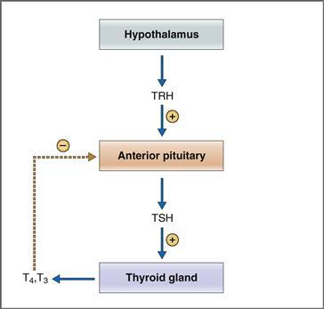

**그림 9–19 갑상선 호르몬 분비 조절.** TRH, 갑상선 자극 호르몬 방출 호르몬; TSH, 갑상선 자극 호르몬; T3, 트리요오드티로닌; T4, 티록신.

 **TRH**는 삼중펩타이드로 시상하부의 방실핵에서 분비됩니다. TRH는 뇌하수체 전엽의 갑상선 영양 세포에 작용하여 TSH 유전자의 전사와 TSH 분비를 모두 자극합니다. (TRH의 또 다른 작용은 뇌하수체 전엽에 의한 프로락틴 분비를 자극하는 것임을 기억하십시오.)

 **TSH**는 당단백질로 TRH의 자극에 반응하여 뇌하수체 전엽에서 분비됩니다. TSH의 역할은 생합성 경로의 여러 단계에 영향을 주어 갑상선의 성장(즉, 영양 효과)과 갑상선 호르몬의 분비를 조절하는 것입니다. 뇌하수체 전엽의 갑상선 영양 세포는 대략 임신 13주차에 발달하여 TSH를 분비하기 시작하며, 동시에 태아 갑상선이 갑상선 호르몬을 분비하기 시작합니다.

TSH 분비는 두 가지 상호 요인에 의해 조절됩니다. (1) 시상하부의 TRH는 TSH 분비를 자극하고, (2) 갑상선 호르몬은 갑상선 영양 세포의 TRH 수용체를 하향 조절하여 TSH 분비를 억제하여 TRH 자극에 대한 민감도를 감소시킵니다. 갑상선 호르몬의 이러한 부정적인 피드백 효과는 **유리 T3**에 의해 매개되는데, 이는 전엽에 갑상선 탈요오드효소(T4를 T3로 전환)가 포함되어 있기 때문에 가능합니다. TRH에 의한 TSH 분비의 상호 조절과 유리 T3에 의한 음성 피드백은 상대적으로 안정적인 TSH 분비 속도를 가져오고, 이는 차례로 갑상선 호르몬의 안정적인 분비 속도를 생성합니다(분비가 박동성인 성장 호르몬 분비와는 대조적).

 **갑상선에 대한 TSH의 작용**은 TSH가 Gs 단백질을 통해 아데닐릴 사이클라제에 결합된 막 수용체에 결합할 때 시작됩니다. 아데닐릴 시클라제의 활성화는 TSH의 2차 전달자 역할을 하는 **cAMP**를 생성합니다. TSH는 갑상선에 두 가지 유형의 작용을 합니다. (1) 생합성 경로의 *각* 단계를 자극하여 갑상선 호르몬의 합성과 분비를 증가시킵니다. I - 흡수 및 산화, I2의 MIT와 DIT로의 조직화, MIT와 DIT의 결합으로 T4와 T3 형성, 세포내이입, 분비를 위해 T4와 T3를 방출하는 티로글로불린의 단백질 분해. (2) TSH는 갑상선에 영양 효과를 줍니다. 이러한 영양 효과는 TSH 수치가 장기간 상승할 때 나타나며 갑상선 여포 세포의 비대 및 증식과 갑상선 혈류 증가를 유발합니다.

 갑상선 세포의 TSH 수용체도 TSH 수용체에 대한 항체인 **갑상선 자극 면역글로불린**에 의해 활성화됩니다. 갑상선 자극 면역글로불린은 혈장 단백질의 면역글로불린 G(IgG) 분획의 구성요소입니다. 이러한 면역글로불린이 TSH 수용체에 결합하면 갑상선 세포에서 TSH와 동일한 반응, 즉 갑상선 호르몬 합성 및 분비 자극, 분비선의 비대 및 증식(즉, 갑상선 기능 항진증)을 생성합니다. **그레이브스병**은 갑상선 기능항진증의 일반적인 형태로 갑상선 자극 면역글로불린의 순환 수준이 증가하여 발생합니다. 이 질환에서는 갑상선이 항체에 의해 강하게 자극되어 갑상선 호르몬의 순환 수준이 증가합니다. 그레이브스병에서는 갑상선 호르몬의 높은 순환 수준이 음성 피드백에 의해 TSH 분비를 억제하기 때문에 TSH 수준이 실제로 정상보다 낮습니다.

#### 갑상선 호르몬의 작용

갑상선호르몬은 인체의 거의 모든 장기에 작용한다([그림 9-20](#filepos1986733)). 갑상선호르몬은 성장호르몬, 소마토메딘과 시너지 효과를 발휘하여 뼈 형성을 촉진한다. 기초 대사율(BMR), 열 생산 및 산소 소비를 증가시킵니다. 심혈관 및 호흡기 시스템을 변경하여 혈류와 조직으로의 산소 전달을 증가시킵니다.

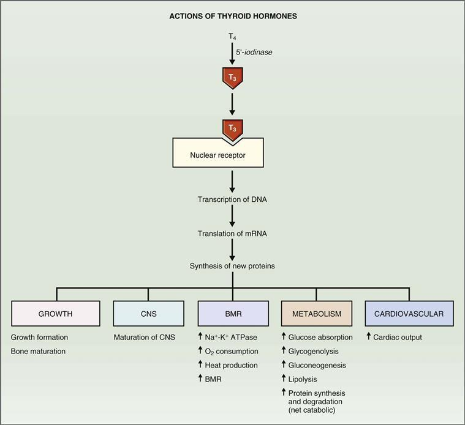

**그림 9–20 갑상선 호르몬의 작용 메커니즘.** 티록신(T4)은 표적 조직에서 트리요오드티로닌(T3)으로 전환됩니다. 여러 기관 시스템에 대한 T3의 작용이 표시됩니다. BMR, 기초대사량; CNS, 중추신경계; DNA, 디옥시리보핵산; mRNA, 메신저 리보핵산.

표적 조직에서 갑상선 호르몬 작용의 첫 번째 단계는 **5'-요오드나제에 의한 **T4를 T3으로 전환**하는 것입니다.** (T4는 T3보다 훨씬 더 많은 양으로 분비되지만 활성도도 훨씬 낮다는 점을 상기하십시오.) 대체 경로에서 T4는 생리학적으로 비활성인 rT3으로 전환될 수 있습니다. 일반적으로 조직은 T3와 rT3를 거의 동일한 양(T3, 45% 및 rT3, 55%)으로 생성합니다. 그러나 특정 조건에서는 상대적인 금액이 변경될 수 있습니다. 예를 들어, 임신, 단식, 스트레스, 간 및 신부전, 베타-아드레날린 차단제는 모두 T4에서 T3으로의 전환을 감소시키고(rT3으로의 전환을 증가시켜) 활성 호르몬의 양을 감소시킵니다. 비만은 T4의 T3로의 전환을 증가시켜 활성 호르몬의 양을 증가시킵니다.

T3가 표적 세포 내부에서 생성되면 핵으로 들어가 **핵 수용체**에 결합합니다. 그런 다음 T3 수용체 복합체는 DNA의 갑상선 조절 요소와 결합하여 **DNA 전사**를 자극합니다. 새로 전사된 mRNA가 번역되고 새로운 단백질이 합성됩니다. 이 새로운 단백질은 갑상선 호르몬의 다양한 작용을 담당합니다. 리보솜과 미토콘드리아에 위치한 다른 T3 수용체는 전사 후 및 번역 후 사건을 중재합니다.

Na+-K+ ATPase, 수송 단백질, β1-아드레날린 수용체, 리소좀 효소, 단백질 분해 단백질, 구조 단백질을 비롯한 다양한 **새로운 단백질**이 갑상선 호르몬의 지시에 따라 합성됩니다. 유도된 단백질의 성질은 표적 조직에 따라 다릅니다. 대부분의 조직에서는 Na+-K+ ATPase 합성이 유도되어 산소 소비, BMR 및 열 생산이 증가합니다. 심근 세포에서는 미오신, β1-아드레날린 수용체 및 Ca2+ ATPase가 유도되는데, 이는 갑상선 호르몬에 의한 심박수 및 수축력 증가를 설명합니다. 간 및 지방 조직에서는 주요 대사 효소가 유도되어 탄수화물, 지방 및 단백질 대사에 변화가 발생합니다.

다양한 기관계에 대한 갑상선 호르몬(T3)의 효과는 다음과 같습니다.

 **기초 대사율(BMR).** 갑상선 호르몬의 가장 중요하고 두드러진 효과 중 하나는 **산소 소비 증가**와 그에 따른 **BMR** 및 **체온**의 증가입니다. 갑상선 호르몬은 **Na+-K+ ATPase의 합성을 유도하고 활동을 증가시켜 *뇌, 생식선, 비장*을 제외한 모든 조직에서 산소 소비를 증가시킵니다.** Na+-K+ ATPase는 모든 세포에서 Na+와 K+의 일차 능동 수송을 담당합니다. 이 활동은 신체의 총 산소 소비 및 열 생산과 높은 상관관계가 있으며 이를 차지합니다. 따라서 갑상선 호르몬이 Na+-K+ ATPase 활성을 증가시키면 산소 소비, BMR 및 열 생산도 증가합니다.

 **대사.** 궁극적으로 산소 소비 증가는 산화 대사를 위한 기질의 가용성 증가에 달려 있습니다. 갑상선 호르몬은 위장관에서 포도당 흡수를 증가시키고 포도당 신생, 지방 분해 및 단백질 분해에 대한 다른 호르몬(예: 카테콜아민, 글루카곤, 성장 호르몬)의 효과를 강화합니다. 갑상선 호르몬은 단백질 합성과 분해를 모두 증가시키지만, 전반적으로 그 효과는 *이화작용*(즉, 순 분해)이므로 근육량이 감소합니다. 이러한 대사 효과는 갑상선 호르몬이 시토크롬 산화효소, NADPH 시토크롬 C 환원효소, α-글리세로인산 탈수소효소, 말산 효소 및 여러 단백질 분해 효소를 포함한 주요 대사 효소의 합성을 유도하기 때문에 발생합니다.

 **심혈관 및 호흡기.** 갑상선 호르몬은 O2 소비를 증가시키기 때문에 조직에서 O2에 대한 수요가 더 높아집니다. 갑상선 호르몬이 심박출량과 환기를 증가시키기 때문에 조직으로의 O2 전달 증가가 가능합니다. **심박출량 증가**는 심박수 증가와 박출량 증가(수축성 증가)가 결합된 결과입니다. 이러한 심장 효과는 갑상선 호르몬이 심장 β1-아드레날린 수용체의 합성을 유도(즉, 상향 조절)한다는 사실로 설명됩니다. 이러한 β1 수용체는 교감 신경계의 효과를 중재하여 심박수와 수축성을 증가시킨다는 점을 기억하세요. 따라서 갑상선 호르몬 수치가 높으면 심근의 β1 수용체 수가 증가하고 교감신경계의 자극에 더 민감해집니다. (상보적인 작용으로 갑상선 호르몬은 심장 미오신과 근형질 세망 Ca2+ ATPase의 합성도 유도합니다.)

 **성장.** 성인 키로 성장하려면 갑상선 호르몬이 필요합니다. 갑상선 호르몬은 성장 호르몬 및 소마토메딘과 시너지 효과를 발휘하여 뼈 형성을 촉진합니다. 갑상선 호르몬은 뼈판의 골화 및 융합과 뼈 성숙을 촉진합니다. 갑상선 기능 저하증에서는 뼈 연령이 생활 연령보다 낮습니다.

 **중추신경계(CNS).** 갑상선 호르몬은 CNS에 다양한 영향을 미치며 이러한 영향의 영향은 연령에 따라 다릅니다. **주산기**에 갑상선 호르몬은 *중추신경계의 정상적인 성숙에 필수적입니다.* 주산기의 갑상선 기능 저하증은 회복 불가능한 정신 지체를 유발합니다. 이러한 이유로 신생아에 대한 갑상선 기능 저하증 선별검사가 의무화됩니다. 신생아에서 발견되면 갑상선 호르몬 대체 요법으로 중추신경계 효과를 역전시킬 수 있습니다. **성인**의 경우 갑상선 기능 저하증은 무기력함, 움직임 둔화, 졸음, 기억력 손상, 정신 능력 저하를 유발합니다. 갑상선 기능항진증은 과잉흥분, 반사과민, 과민성을 유발합니다.

 **자율신경계.** 갑상선 호르몬은 완전히 이해되지 않는 방식으로 **교감신경계**와 상호작용합니다. BMR, 열 생성, 심박수 및 뇌졸중량에 대한 갑상선 호르몬의 효과 중 상당수는 **β-아드레날린 수용체**를 통해 카테콜아민이 생성하는 효과와 유사합니다. 열 생성, 심박출량, 지방분해 및 포도당 신생합성에 대한 갑상선 호르몬과 카테콜아민의 효과는 시너지 효과가 있는 것으로 보입니다. 이러한 시너지 효과의 중요성은 갑상선 기능 항진증의 많은 증상을 치료하는 데 있어 **β-아드레날린 차단제**(예: 프로프라놀롤)의 효과로 설명됩니다.

#### 갑상선 호르몬의 병태생리

가장 흔한 내분비 이상은 갑상선 호르몬의 장애입니다. 갑상선 호르몬의 과잉 또는 결핍으로 인해 발생하는 징후와 증상의 집합은 호르몬의 생리적 작용을 토대로 예측할 수 있습니다. 따라서 갑상선 호르몬의 교란은 성장, 중추신경계 기능, BMR 및 열 생성, 영양 대사 및 심혈관계에 영향을 미칩니다. 갑상선항진증과 갑상선저하증의 증상, 일반적인 원인, TSH 수치, 치료법 등을 [표 9-9](#filepos1995624)에 정리하였다.

표 9-9 갑상선 호르몬의 병태생리

|  |  |  |
| --- | --- | --- |
|  | **갑상선항진증** | **갑상선 기능 저하증** |
| 증상 | 기초대사량 증가 체중감소 음질소 균형 열생산 증가 발한 심박출량 증가 호흡곤란(호흡곤란) 떨림, 근쇠약 안구돌출증 갑상선종 | 기초 대사율 감소 체중 증가 양의 질소 균형 열 생산 감소 냉증 민감성 심박출량 감소 호흡 저하 무기력증, 정신적 둔화 눈꺼풀 처짐 점액수종 성장 지연 정신 지체(주산기) 갑상선종 |
| 원인 | 그레이브스병(갑상선 자극 면역글로불린 증가) 갑상선 신생물 과도한 TSH 분비 외인성 T3 또는 T4(인위성) | 갑상선염(자가면역 ​​또는 하시모토 갑상선염) 갑상선항진증 수술 I− 결핍 선천성(크레틴병) TRH 또는 TSH 감소 |
| TSH 수준 | 감소(전엽의 T3 피드백 억제) 증가(결함이 뇌하수체 전엽에 있는 경우) | 증가(1차 결함이 갑상선에 있는 경우 음성 피드백에 의해) 감소(결함이 시상하부 또는 뇌하수체 전엽에 있는 경우) |
| 치료 | 프로필티오우라실(과산화효소 및 갑상선 호르몬 합성 억제) 갑상선 절제술 131I−(갑상선 파괴) β-아드레날린 차단제(보조 요법) | 갑상선 호르몬 대체 요법 |